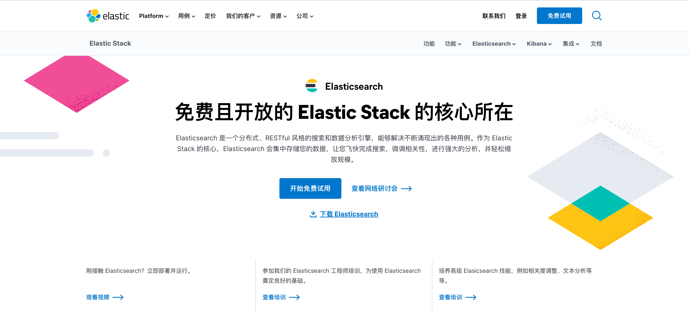
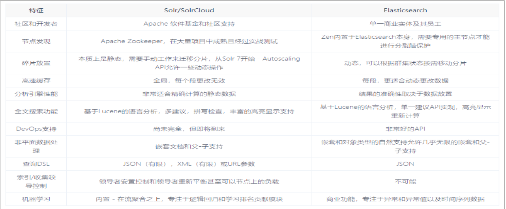

---
# 当前页面内容标题
title: 一、Elasticsearch概述
# 分类
category:
  - ELK
# 标签
tag: 
  - ELK
  - 分布式搜索引擎
sticky: false
# 是否收藏在博客主题的文章列表中，当填入数字时，数字越大，排名越靠前。
star: false
# 是否将该文章添加至文章列表中
article: true
# 是否将该文章添加至时间线中
timeline: true
---

## 一、Elasticsearch是什么

The Elastic Stack, 包括 Elasticsearch、Kibana、Beats 和 Logstash（也称为 ELK Stack）。能够安全可靠地获取任何来源、任何格式的数据，然后实时地对数据进行搜索、分析和可视化。Elaticsearch，简称为 ES，ES 是一个**开源的高扩展的分布式全文搜索引擎，**是整个 Elastic Stack 技术栈的核心。它可以近乎实时的存储、检索数据；本身扩展性很好，可以扩展到上百台服务器，处理 PB 级别的数据。

## 二、全文搜索引擎

Google，百度类的网站搜索，它们都是根据网页中的关键字生成索引，我们在搜索的时候输入关键字，它们会将该关键字即索引匹配到的所有网页返回；还有常见的项目中应用日志的搜索等等。对于这些非结构化的数据文本，关系型数据库搜索不是能很好的支持。

一般传统数据库，全文检索都实现的很鸡肋，因为一般也没人用数据库存文本字段。进行全文检索需要扫描整个表，如果数据量大的话即使对 SQL 的语法优化，也收效甚微。建立了索引，但是维护起来也很麻烦，对于 insert 和 update 操作都会重新构建索引。

基于以上原因可以分析得出，在一些生产环境中，使用常规的搜索方式，性能是非常差的：

- 搜索的数据对象是大量的非结构化的文本数据。
- 文件记录量达到数十万或数百万个甚至更多。
- 支持大量基于交互式文本的查询。
- 需求非常灵活的全文搜索查询。
- 对高度相关的搜索结果的有特殊需求，但是没有可用的关系数据库可以满足。
- 对不同记录类型、非文本数据操作或安全事务处理的需求相对较少的情况。为了解决结构化数据搜索和非结构化数据搜索性能问题，我们就需要专业，健壮，强大的全文搜索引擎

这里说到的全文搜索引擎指的是目前广泛应用的主流搜索引擎。它的工作原理是计算机索引程序通过扫描文章中的每一个词，对每一个词建立一个索引，指明该词在文章中出现的次数和位置，当用户查询时，检索程序就根据事先建立的索引进行查找，并将查找的结果反馈给用户的检索方式。这个过程类似于通过字典中的检索字表查字的过程

## 三、Elasticsearch And Solr

Lucene 是 Apache 软件基金会 Jakarta 项目组的一个子项目，提供了一个简单却强大的应用程式接口，能够做全文索引和搜寻。在 Java 开发环境里 Lucene 是一个成熟的免费开源工具。就其本身而言，Lucene 是当前以及最近几年最受欢迎的免费 Java 信息检索程序库。但 Lucene 只是一个提供全文搜索功能类库的核心工具包，而真正使用它还需要一个完善的服务框架搭建起来进行应用。

目前市面上流行的搜索引擎软件，主流的就两款：**Elasticsearch** 和 **Solr**,这两款都是基于 Lucene 搭建的，可以独立部署启动的搜索引擎服务软件。由于内核相同，所以两者除了服务器安装、部署、管理、集群以外，对于数据的操作 修改、添加、保存、查询等等都十分类似。

在使用过程中，一般都会将 Elasticsearch 和 Solr 这两个软件对比，然后进行选型。这两个搜索引擎都是流行的，先进的的开源搜索引擎。它们都是围绕核心底层搜索库 - Lucene构建的 - 但它们又是不同的。像所有东西一样，每个都有其优点和缺点：

## 四、Elasticsearch Or Solr

Elasticsearch 和 Solr 都是开源搜索引擎，那么我们在使用时该如何选择呢？

- Google 搜索趋势结果表明，与 Solr 相比，Elasticsearch 具有很大的吸引力，但这并不意味着 Apache Solr 已经死亡。虽然有些人可能不这么认为，但 Solr 仍然是最受欢迎的搜索引擎之一，拥有强大的社区和开源支持。

- 与 Solr 相比，Elasticsearch 易于安装且非常轻巧。此外，你可以在几分钟内安装并运行Elasticsearch。但是，如果 Elasticsearch 管理不当，这种易于部署和使用可能会成为一个问题。基于 JSON 的配置很简单，但如果要为文件中的每个配置指定注释，那么它不适合您。总的来说，如果你的应用使用的是 JSON，那么 Elasticsearch 是一个更好的选择。

    否则，请使用 Solr，因为它的 schema.xml 和 solrconfig.xml 都有很好的文档记录。

- Solr 拥有更大，更成熟的用户，开发者和贡献者社区。ES 虽拥有的规模较小但活跃的用户社区以及不断增长的贡献者社区。

    Solr 贡献者和提交者来自许多不同的组织，而 Elasticsearch 提交者来自单个公司。

- Solr 更成熟，但 ES 增长迅速，更稳定。

- Solr 是一个非常有据可查的产品，具有清晰的示例和 API 用例场景。 Elasticsearch 的 文档组织良好，但它缺乏好的示例和清晰的配置说明。

**那么，到底是** **Solr** **还是** **Elasticsearch****？**

有时很难找到明确的答案。无论您选择 Solr 还是 Elasticsearch，首先需要了解正确的用例和未来需求。总结他们的每个属性。

- 由于易于使用，Elasticsearch 在新开发者中更受欢迎。一个下载和一个命令就可以启动一切。

- 如果除了搜索文本之外还需要它来处理分析查询，Elasticsearch 是更好的选择

- 如果需要分布式索引，则需要选择 Elasticsearch。对于需要良好可伸缩性和以及性能分布式环境，Elasticsearch 是更好的选择。

- Elasticsearch 在开源日志管理用例中占据主导地位，许多组织在 Elasticsearch 中索引它们的日志以使其可搜索。

- 如果你喜欢监控和指标，那么请使用 Elasticsearch，因为相对于 Solr，Elasticsearch 暴露了更多的关键指标

## 五、Elasticsearch应用案例

- **GitHub**:2013 年初，抛弃了 Solr，采取 Elasticsearch 来做 PB 级的搜索。“GitHub 使用Elasticsearch 搜索 20TB 的数据，包括 13 亿文件和 1300 亿行代码”。

- **维基百科**：启动以 Elasticsearch 为基础的核心搜索架构

- **SoundCloud**：“SoundCloud 使用 Elasticsearch 为 1.8 亿用户提供即时而精准的音乐搜索服务”。

- **百度**：目前广泛使用 Elasticsearch 作为文本数据分析，采集百度所有服务器上的各类指标数据及用户自定义数据，通过对各种数据进行多维分析展示，辅助定位分析实例异常或业务层面异常。目前覆盖百度内部 20 多个业务线（包括云分析、网盟、预测、文库、直达号、钱包、风控等），单集群最大 100 台机器，200 个 ES 节点，每天导入 30TB+数据。

- **新浪**：使用 Elasticsearch 分析处理 32 亿条实时日志。

- **阿里**：使用 Elasticsearch 构建日志采集和分析体系。

- **Stack Overflow**：解决 Bug 问题的网站，全英文，编程人员交流的网站。

>   学习参考笔记：https://blog.csdn.net/u011863024/article/details/115721328
