---
# 当前页面内容标题
title: 一、Redis入门概述
# 分类
category:
  - redis
# 标签
tag: 
  - redis
  - NOSQL
  - K,V缓存数据库
  - 非关系型数据库
sticky: false
# 是否收藏在博客主题的文章列表中，当填入数字时，数字越大，排名越靠前。
star: false
# 是否将该文章添加至文章列表中
article: true
# 是否将该文章添加至时间线中
timeline: true
---
## 01、Redis是什么？

> Redis : REmote Dictionary Server （远程字典服务器）

### 官网解释：

> Remote Dictionary Server(远程字典服务)是完全开源的，使用ANSI，C语言编写遵守BSD协议，是一个高性能的Key-Value数据库提供了丰富的数据结构，例如String、Hash、List、Set、SortedSet等等。数据是存在内存中的，同时Redis支持事务、持久化、LUA脚本、发布/订阅、缓存淘汰、流技术等多种功能特性提供了主从模式、Redis Sentinel和Redis Cluster集群架构方案

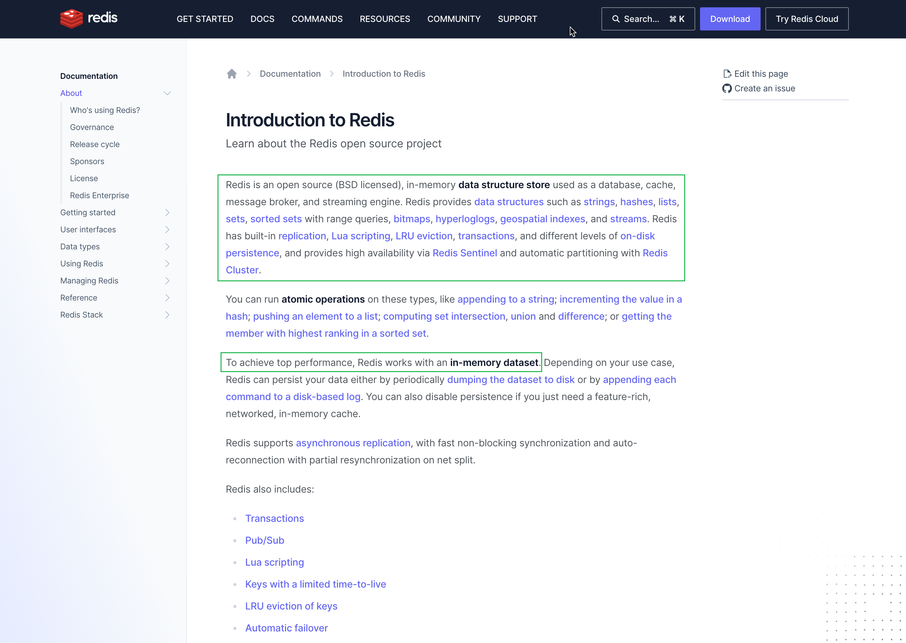

### 拜拜神

> Redis之父安特雷兹
> 
> Redis之父Salvatore Sanfilippo，一名意大利程序员，大家更习惯称呼他Antirez

> Github：https://github.com/antirez
> 
> 个人博客：http://antirez.com/latest/0

## 02、Redis能干嘛？

> 技术介绍

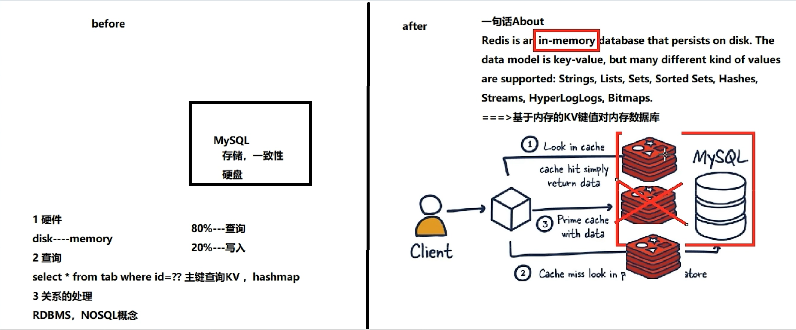

### 主流功能与应用

1. 分布式缓存，挡在mysql数据库之前的带刀侍卫

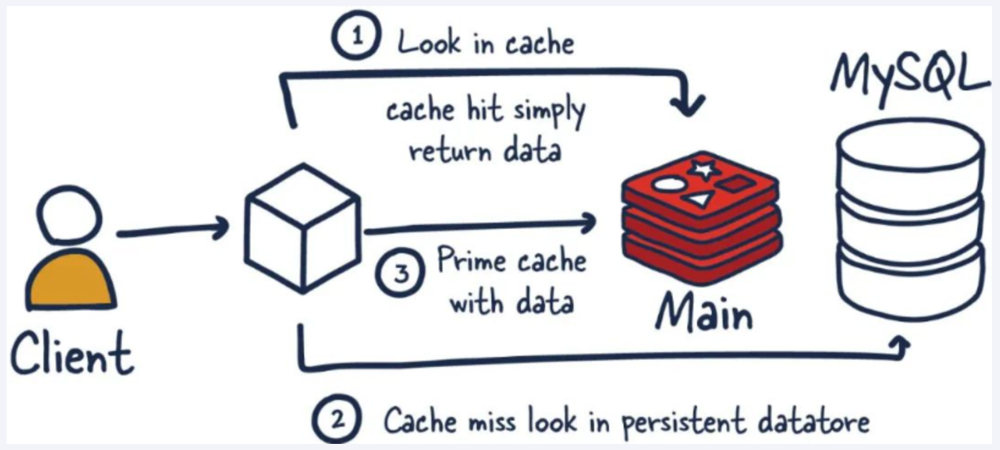

> 与传统数据库关系(mysql)
> 
> Redis是key-value数据库(NoSQL一种)，mysql是关系数据库
> 
> Redis数据操作主要在内存，而mysql主要存储在磁盘
> 
> Redis在某一些场景使用中要明显优于mysql，比如计数器、排行榜等方面
> 
> Redis通常用于一些特定场景，需要与Mysql一起配合使用
> 
> 两者并不是相互替换和竞争关系，而是共用和配合使用

2. 内存存储和持久化（RDB+AOF）
   
   Redis支持异步将内存中的数据写到磁盘上，同时不影响继续服务

3. 高可用架构搭配
   
   - 单机
   
   - 主从
   
   - 哨兵
   
   - 集群

4. 缓存穿透、击穿、雪崩

5. 分布式锁

6. 队列

> Reids提供list和set操作，这使得Redis能作为一个很好的消息队列平台来使用。
> 
> 我们常通过Reids的队列功能做购买限制。比如到节假日或者推广期间，进行一些活动，
> 
> 对用户购买行为进行限制，限制今天只能购买几次商品或者一段时间内只能购买一次。也比较适合适用。

7. 排行榜+点赞

> 在互联网应用中，有各种各样的排行榜，如电商网站的月度销量排行榜、社交APP的礼物排行榜、小程序的投票排行榜等等。Redis提供的zset数据类型能够快速实现这些复杂的排行榜。
> 
> 比如小说网站对小说进行排名，根据排名，将排名靠前的小说推荐给用户

8. 。。。。。。

### 总体功能概述，图示如下

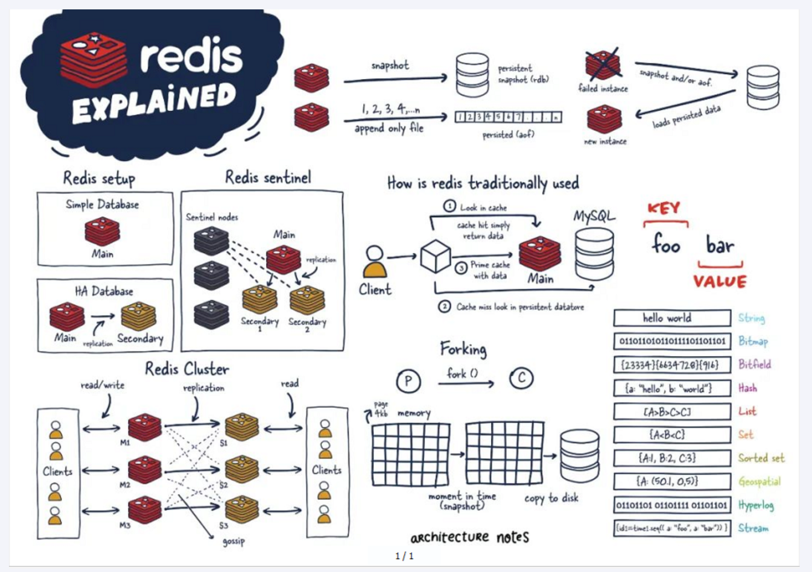

### 优势

- 性能极高--Redis能读的速度是110000次/秒，写的速度是81000次/秒

- Redis数据类型丰富，不仅仅支持简单的 key-value 类型的数据，同时还提供了list，set，zset，hash等数据结构的存储

- Redis支持数据的持久化，可以将内存中的数据保存在磁盘中，重启的时候可以再次加载进行使用

- Redis支持数据的备份，即master-salve模式的数据备份

### 小总结

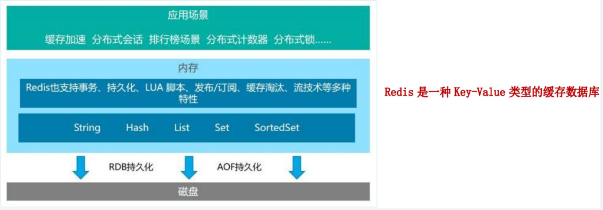

## 03、Redis去哪下

### 官网地址

> 英文文档：https://redis.io

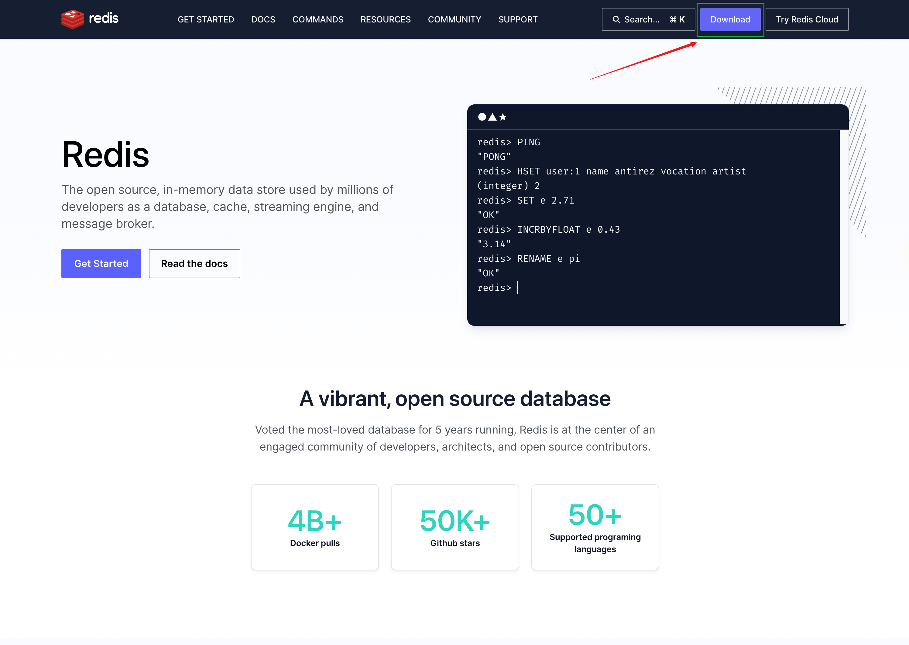

> 中文文档：http://www.redis.cn
> 
> 中文文档：https://www.redis.com.cn/documentation.html

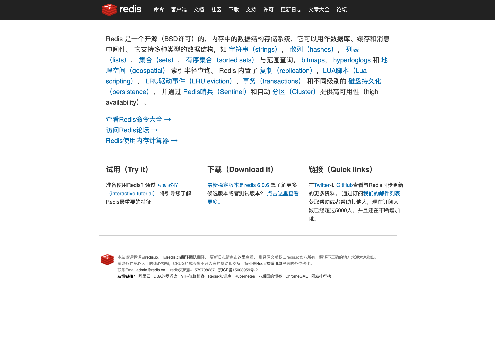

### 下载安装包

> 下载地址：https://redis.io/download

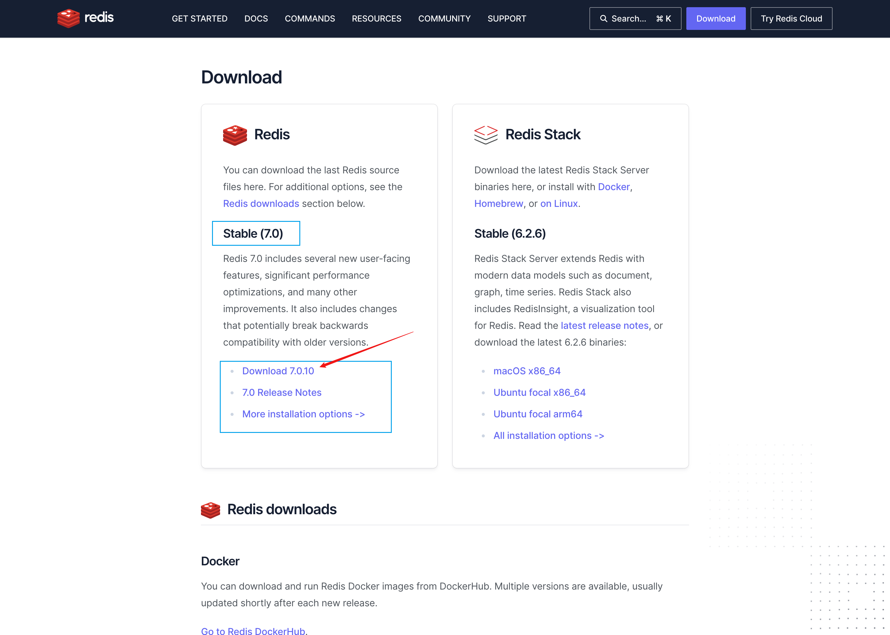

> 本次Reids7

- redis-7.0.0.tar.gz

> Redis6以及其他版本

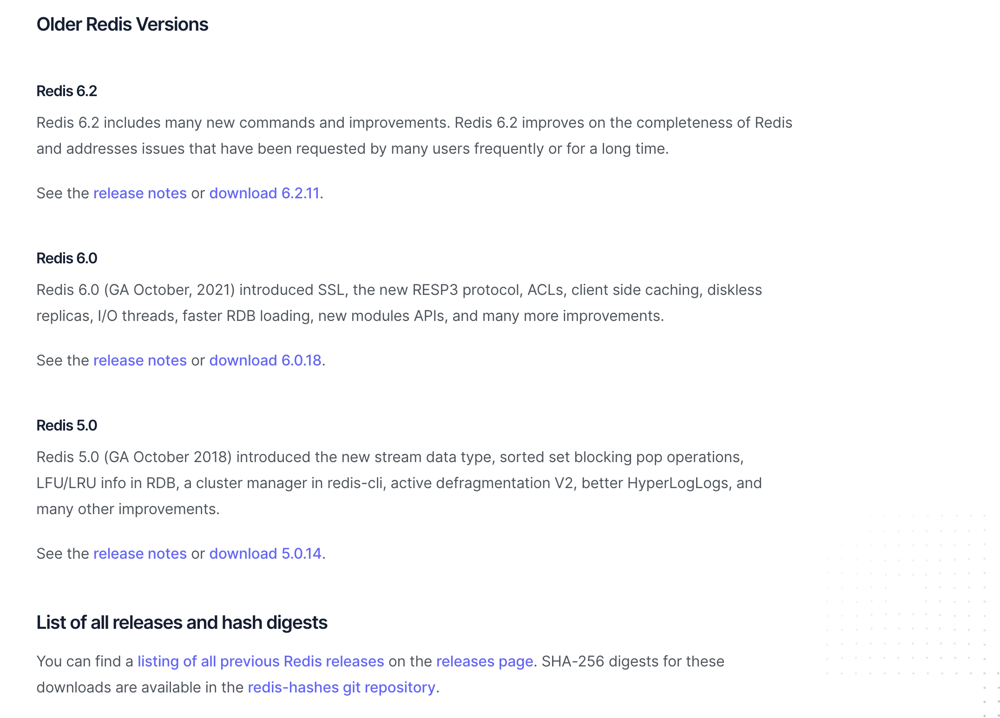

### 其他文档资料

> Redis源码地址
> 
> https://github.com/redis/redis
> 
> 中国大陆打开会比较慢，建议多试几次或者使用梯子进行尝试！

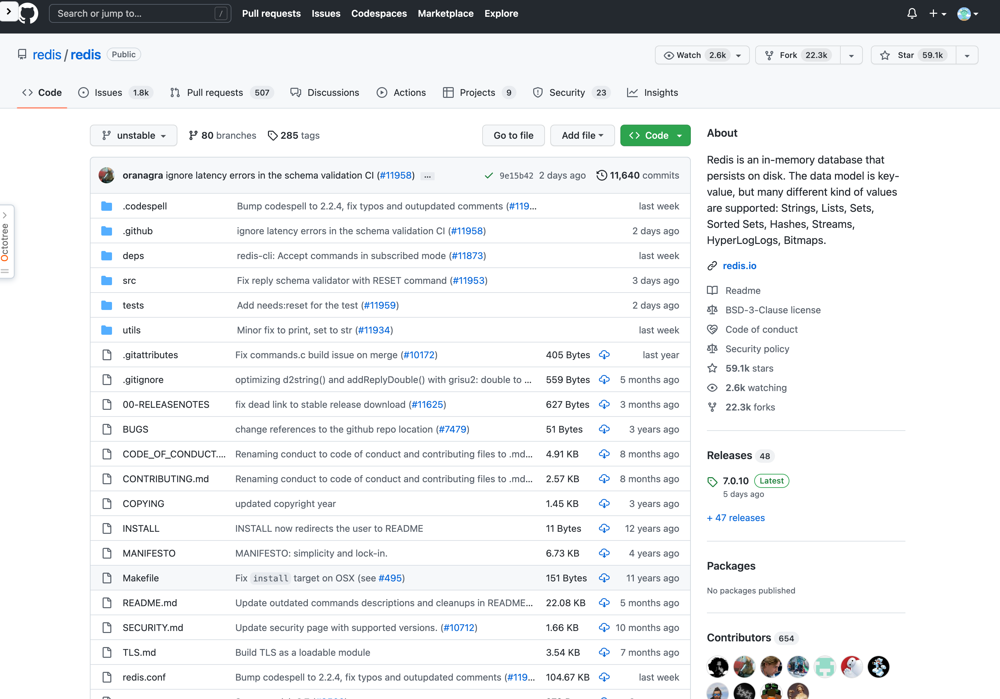

> Redis在线测试
> 
> https://try.redis.io/

> Redis命令参考
> 
> http://doc.redisfans.com/

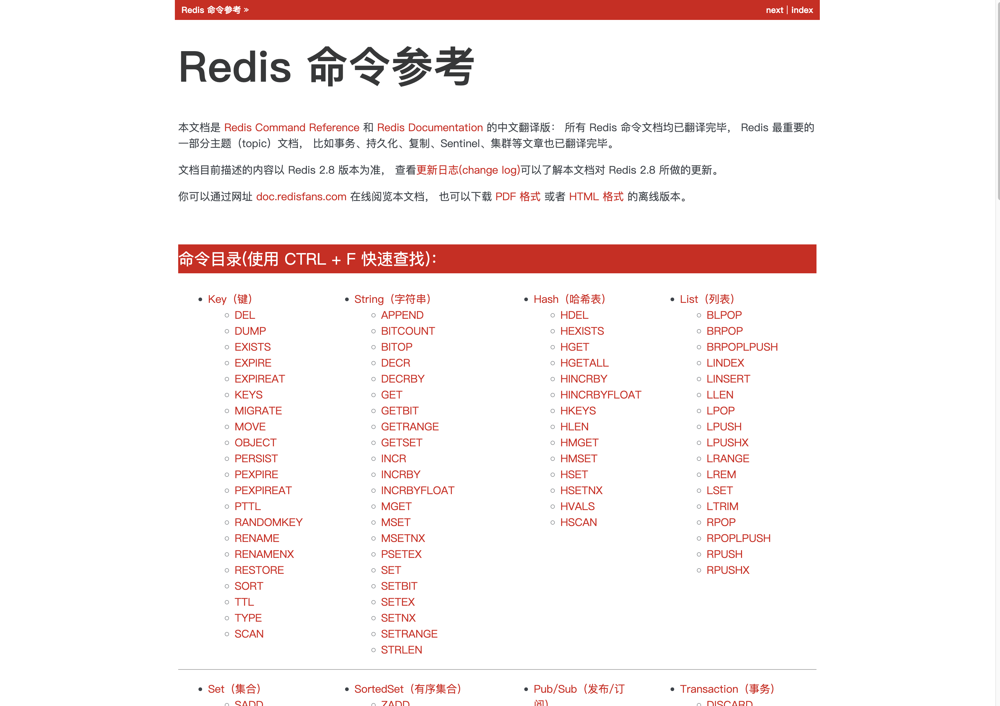

## 04、Redis怎么玩

- 官网

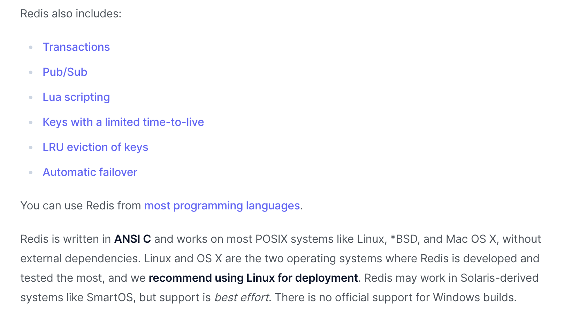

- 多种数据类型基本操作和配置

- 持久化和赋值，RDB/AOF

- 事务的控制

- 复制，集群等

- 。。。。。。

## 05、Redis迭代演化和Redis7新特性浅谈

### 时间推移，版本升级

> VCR
> 
> https://www.bilibili.com/video/BV1oW411u75R?p=1

> Redis之父安特雷兹的发言
> 
> http://antirez.com/news/132

### Redis版本迭代推演介绍

> 1.几个里程碑式的重要版本

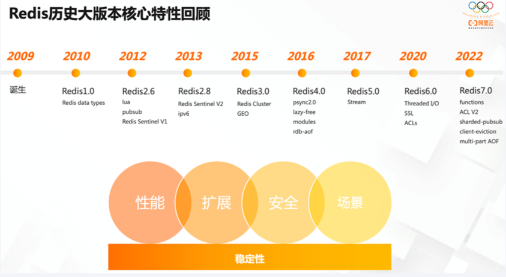

> 5.0版本是直接升级到6.0版本，对于这个激进的升级，Redis之父antirez表现得很有信心和兴奋，
> 
> 所以第一时间发文来阐述6.0的一些重大功能"Redis 6.0.0 GA is out!":

> 随后Redis再接再厉，直接王炸Redis7.0---2023年爆款

> 2022年4月27日Redis正式发布了7.0更新  
> （其实早在2022年1月31日，Redis已经预发布了7.0rc-1，经过社区的考验后，确认没重大Bug才会正式发布）

> `提示：在Redis的技术中主要关注（阿里、美团）这两个大厂的使用！`

> 2.命名规则

> Redis从发布至今，已经有十余年的时光了，一直遵循着自己的命名规则：
> 
> 版本号第二位如果是奇数，则为非稳定版本 如2.7、2.9、3.1
> 
> 版本号第二位如果是偶数，则为稳定版本 如2.6、2.8、3.0、3.2
> 
> 当前奇数版本就是下一个稳定版本的开发版本，如2.9版本是3.0版本的开发版本
> 
> 我们可以通过redis.io官网来下载自己感兴趣的版本进行源码阅读：
> 
> 历史发布版本的源码：`https://download.redis.io/releases/`

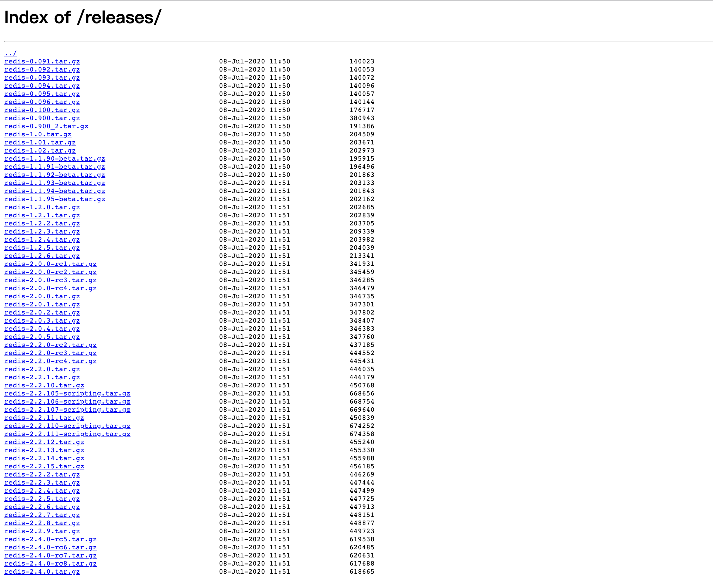

### Redis7.0新特性概述

> `https://github.com/redis/redis/releases`

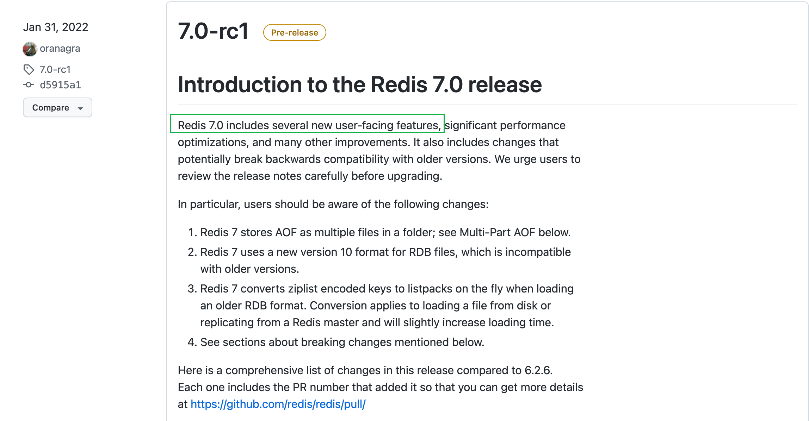

> 新特性

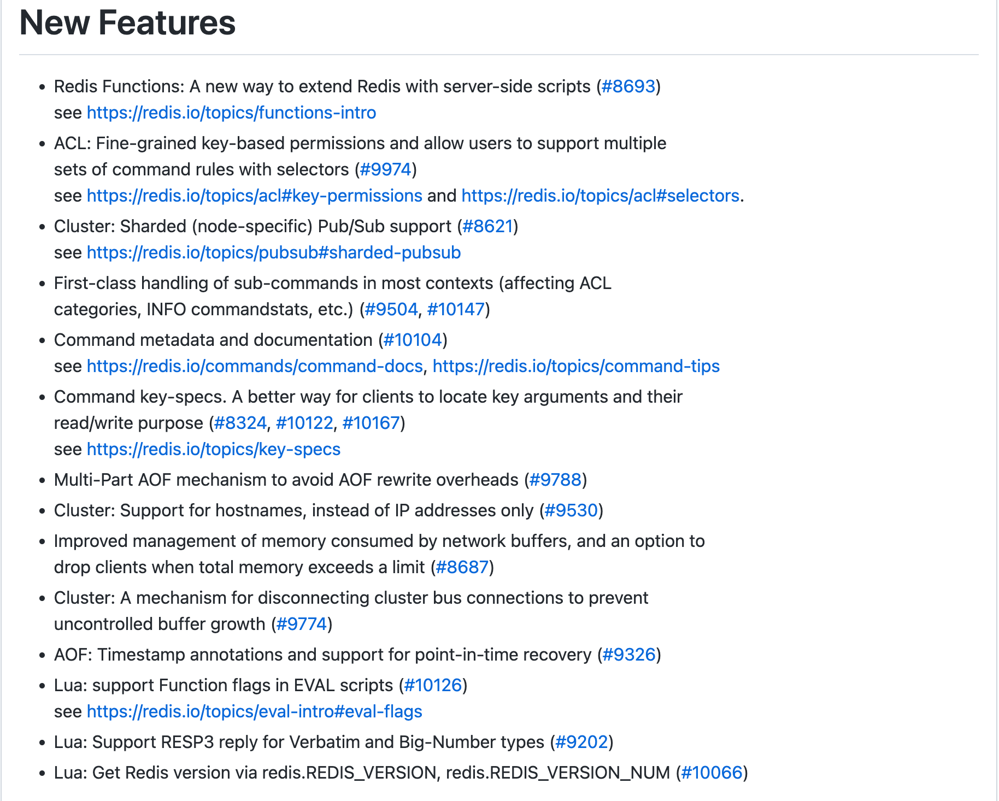

>  中文翻译：

新特性：

- Redis Functions：Redis函数，一种新的通过服务端脚本扩展Redis的方式，函数与数据本身一起存储。函数还被持久化到AOF文件，并从主文件复制到副本，因此它们与数据本身一样持久，见：https://redis.io/topics/functions-intro；

- ACL改进：支持基于key的细粒度的权限，允许用户支持多个带有选择器的命令规则集，见：https://redis.io/topics/acl#key-permissions 和https://redis.io/topics/acl#selectors；

- sharded-pubsub：分片发布/订阅支持，之前消息会在整个集群中广播，而与订阅特定频道/模式无关。发布行为会连接到集群中的所有节点，而不用客户端连接到所有节点都会收到订阅消息。见 https://redis.io/topics/pubsub#sharded-pubsub

- 在大多数情况下把子命令当作一类命令处理（Treat subcommands as commands）（影响 ACL类别、INFO 命令统计等）

- 文档更新：提供命令的元数据和文档，文档更完善，见https://redis.io/commands/command-docs 、https://redis.io/topics/command-tips

- Command key-specs：为客户端定位key参数和读/写目的提供一种更好的方式；

- 多部分 AOF 机制避免了 AOF 重写的开销；

- 集群支持主机名配置，而不仅仅是 IP 地址；

- 客户端驱逐策略：改进了对网络缓冲区消耗的内存的管理，并且提供一个选项，当总内存超过限制时，剔除对应的客户端；

- 提供一种断开集群总线连接的机制，来防止不受控制的缓冲区增长；

- AOF：增加时间戳和对基于时间点恢复的支持；

- Lua：支持 EVAL 脚本中的函数标志；

- Lua：支持 Verbatim 和 Big-Number 类型的 RESP3 回复；

- Lua：可以通过 redis.REDIS_VERSION、redis.REDIS_VERSION_NUM来获取 Redis 版本。

> 部分新特性总览

> 2022 年 4 月正式发布的 Redis 7.0 是目前 Redis 历史版本中变化最大的版本。
> 
> 首先，它有超过 50 个以上新增命令；其次，它有大量核心特性的新增和改进。

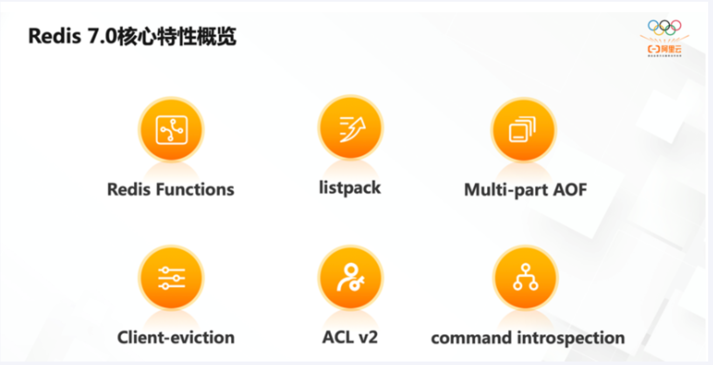

- Redis Functions

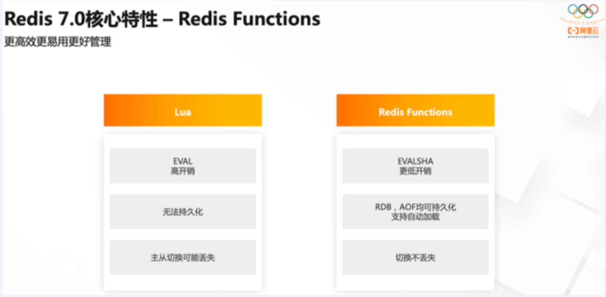

- Client-eviction

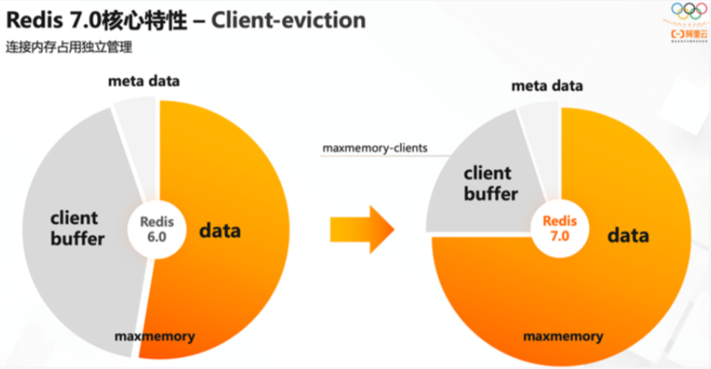

- Multi-part AOF

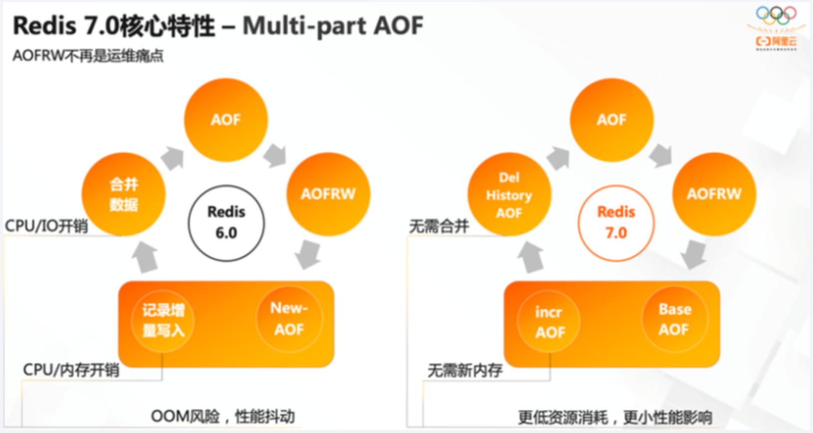

- ACL V2

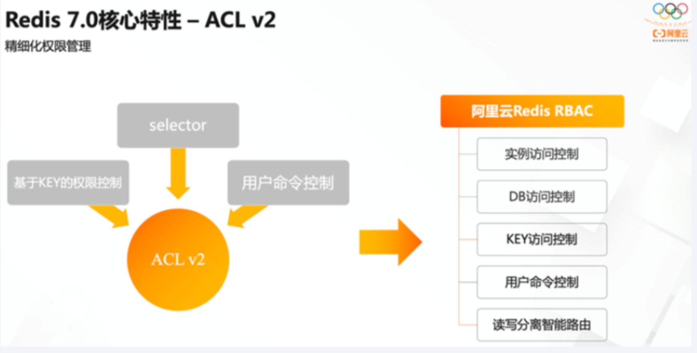

- 新增命令

- listpack替代ziplist

> listpack 是用来替代 ziplist 的新数据结构，在 7.0 版本已经没有 ziplist 的配置了（6.0版本仅部分数据类型作为过渡阶段在使用）

- 底层性能提升（和编码关系不大）

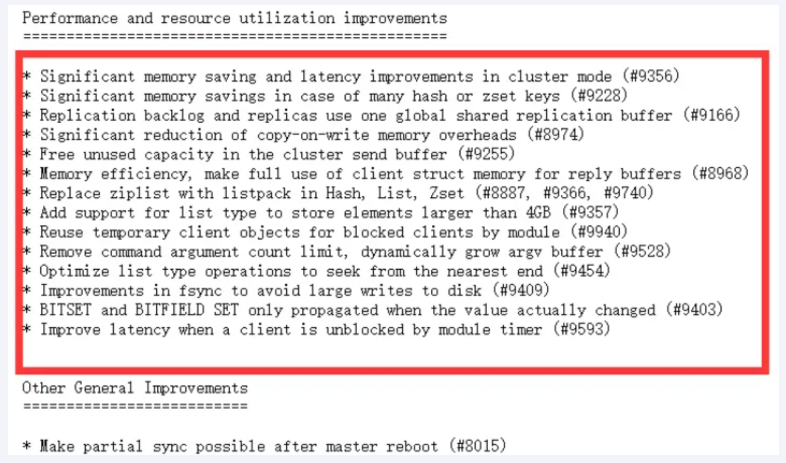

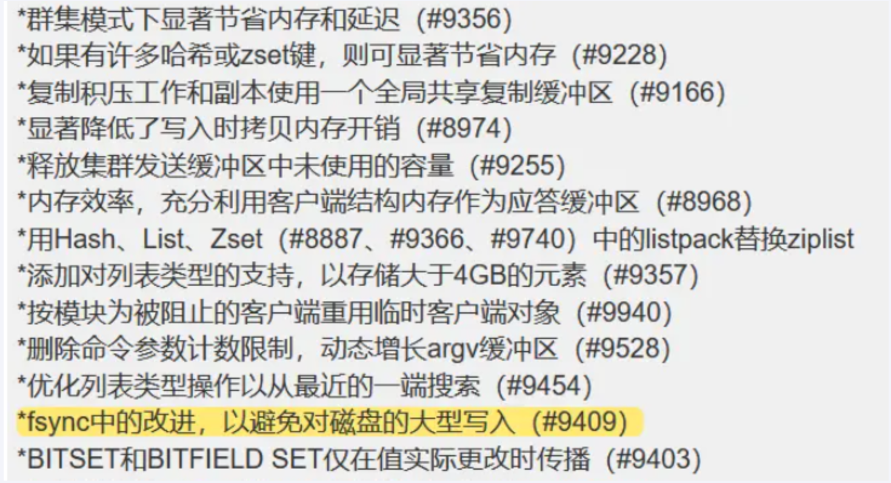

- 。。。。。。

### 本次将对Redis的一部分新特性做说明（not all）

> **总体概述：**
> 
> 大体和之前的redis版本保持一致和稳定，主要是自身底层性能和资源利用率上的优化和提高，如果你生产上系统稳定，不用着急升级到最新的redis7版本，当然，O(∩_∩)O哈哈~，如果你是从零开始的新系统，直接上Redis7.0-GA版。^_^

| 多AOF文件支持                         | 7.0 版本中一个比较大的变化就是 aof 文件由一个变成了多个，主要分为两种类型：基本文件(base files)、增量文件(incr files)，请注意这些文件名称是复数形式说明每一类文件不仅仅只有一个。在此之外还引入了一个清单文件(manifest) 用于跟踪文件以及文件的创建和应用顺序（恢复）                                                                    |
| -------------------------------- | --------------------------------------------------------------------------------------------------------------------------------------------------------------------------------------------------------------------------- |
| config命令增强                       | 对于Config Set 和Get命令，支持在一次调用过程中传递多个配置参数。例如，现在我们可以在执行一次Config Set命令中更改多个参数： config set maxmemory 10000001 maxmemory-clients 50% port 6399                                                                                     |
| 限制客户端内存使用  Client-eviction | 一旦 Redis 连接较多，再加上每个连接的内存占用都比较大的时候， Redis总连接内存占用可能会达到maxmemory的上限，可以增加允许限制所有客户端的总内存使用量配置项，redis.config 中对应的配置项  // 两种配置形式：指定内存大小、基于 maxmemory 的百分比。  maxmemory-clients 1g  maxmemory-clients 10%           |
| listpack紧凑列表调整                   | listpack 是用来替代 ziplist 的新数据结构，在 7.0 版本已经没有 ziplist 的配置了（6.0版本仅部分数据类型作为过渡阶段在使用）listpack 已经替换了 ziplist 类似 hash-max-ziplist-entries 的配置                                                                                        |
| 访问安全性增强ACLV2                     | 在redis.conf配置文件中，protected-mode默认为yes，只有当你希望你的客户端在没有授权的情况下可以连接到Redis server的时候可以将protected-mode设置为no                                                                                                                        |
| Redis Functions                  | Redis函数，一种新的通过服务端脚本扩展Redis的方式，函数与数据本身一起存储。  简言之，redis自己要去抢夺Lua脚本的饭碗                                                                                                                                                   |
| RDB保存时间调整                        | 将持久化文件RDB的保存规则发生了改变，尤其是时间记录频度变化                                                                                                                                                                                             |
| 命令新增和变动                          | Zset (有序集合)增加 ZMPOP、BZMPOP、ZINTERCARD 等命令  Set (集合)增加 SINTERCARD 命令  LIST (列表)增加 LMPOP、BLMPOP ，从提供的键名列表中的第一个非空列表键中弹出一个或多个元素。                                                                                    |
| 性能资源利用率、安全、等改进                   | 自身底层部分优化改动，Redis核心在许多方面进行了重构和改进  主动碎片整理V2：增强版主动碎片整理，配合Jemalloc版本更新，更快更智能，延时更低  HyperLogLog改进：在Redis5.0中，HyperLogLog算法得到改进，优化了计数统计时的内存使用效率，7更加优秀  更好的内存统计报告  如果不为了API向后兼容，我们将不再使用slave一词......(政治正确) |
