---
# 当前页面内容标题
title: 五、Redis事务
# 分类
category:
  - redis
# 标签
tag: 
  - redis
  - NOSQL
  - K,V缓存数据库
  - 非关系型数据库
sticky: false
# 是否收藏在博客主题的文章列表中，当填入数字时，数字越大，排名越靠前。
star: false
# 是否将该文章添加至文章列表中
article: true
# 是否将该文章添加至时间线中
timeline: true
---

## 01、是什么？

> 官网：https://redis.io/docs/manual/transactions/

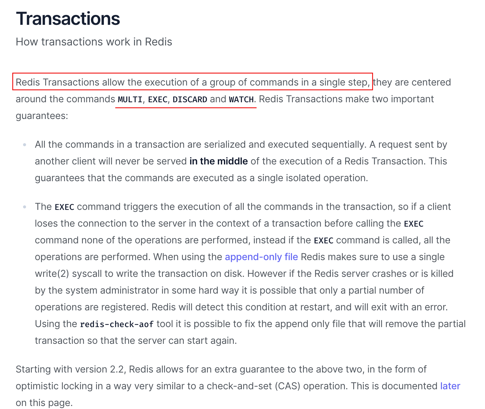

可以一次执行多个命令，本质是一组命令的集合。一个事务中的所有命令都会序列化，`按顺序地串行化执行而不会被其他命令插入，不许加塞`

## 02、能干嘛？

一个队列中，一次性、顺序性、排他性的执行一系列命令

## 03、Redis事务 VS 数据库事务

| 1 单独的隔离操作   | Redis的事务仅仅是保证事务里的操作会被连续独占的执行，redis命令执行是单线程架构，在执行完事务内所有指令前是不可能再去同时执行其他客户端的请求的 |
| ----------- | ---------------------------------------------------------------------------- |
| 2 没有隔离级别的概念 | 因为事务提交前任何指令都不会被实际执行，也就不存在”事务内的查询要看到事务里的更新，在事务外查询不能看到”这种问题了                   |
| 3不保证原子性     | Redis的事务不保证原子性，也就是不保证所有指令同时成功或同时失败，只有决定是否开始执行全部指令的能力，没有执行到一半进行回滚的能力          |
| 4 排它性       | Redis会保证一个事务内的命令依次执行，而不会被其它命令插入                                              |

## 04、怎么玩？

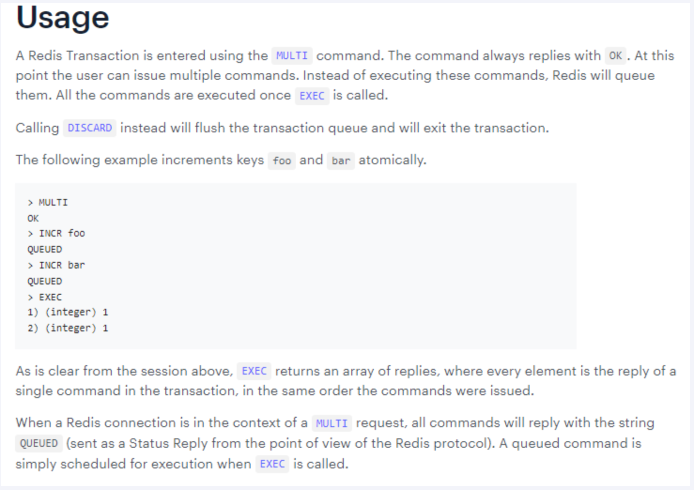

### 常用命令

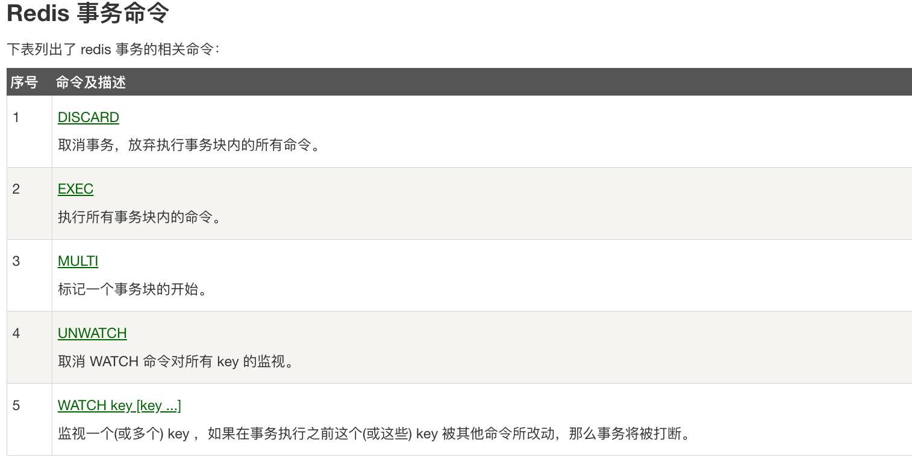

### case1：正常执行

- MULTI

- EXEC

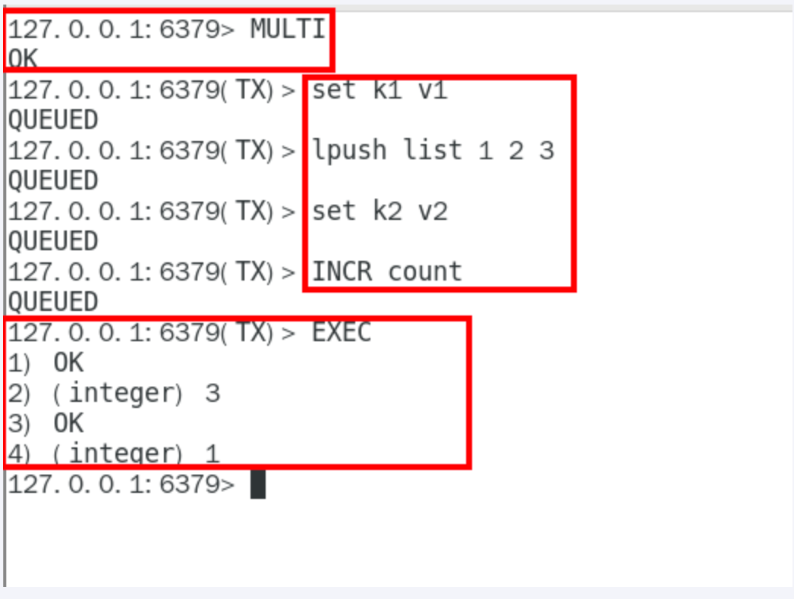

### case2：放弃事务

- MULTI

- DISCARD

案例演示：

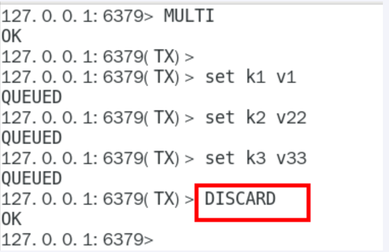

官网说明：

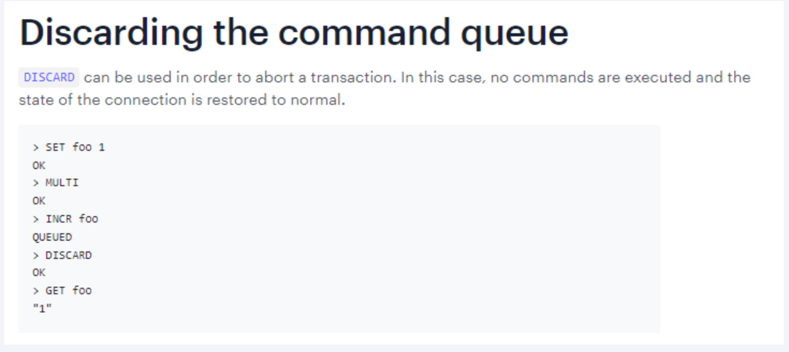

### case3：全体连坐

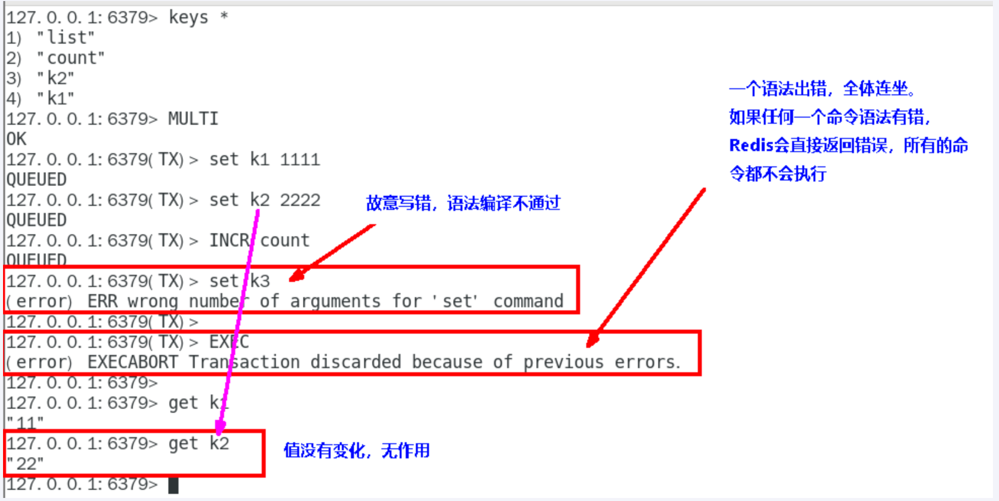

> 官网说明

### case4：冤头债主

1. 官网说明

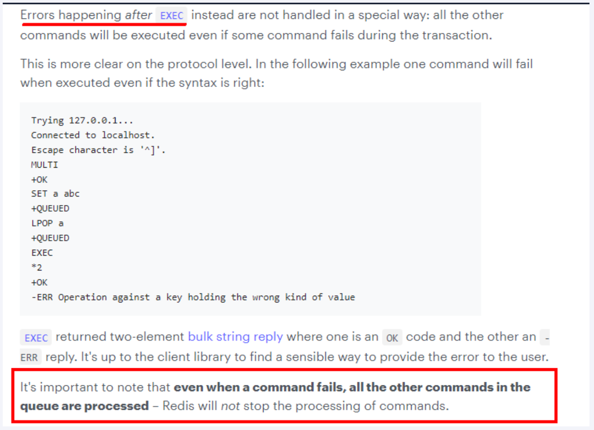

2. 补充

Redis不提供事务回滚的功能，开发者必须在事务执行出错后，自行恢复数据库状态

3. 注意和传统数据库事务区别，不一定要么一起成功要么一起失败！

### case5：watch监控

#### Redis使用Watch来提供乐观锁定，类似于CAS(Check-and-Set)

- 悲观锁

 悲观锁(Pessimistic Lock), 顾名思义，就是很悲观，每次去拿数据的时候都认为别人会修改，所以每次在拿数据的时候都会上锁，这样别人想拿这个数据就会block直到它拿到锁。

- 乐观锁

乐观锁(Optimistic Lock), 顾名思义，就是很乐观，每次去拿数据的时候都认为别人不会修改，`所以不会上锁`，但是在更新的时候会判断一下在此期间别人有没有去更新这个数据。

`乐观锁策略:提交版本必须   大于   记录当前版本才能执行更新`

- CAS

#### WATCH

- 初始化k1和balance两个key，先监控再开启multi，保证两个key变动在同一个事务内

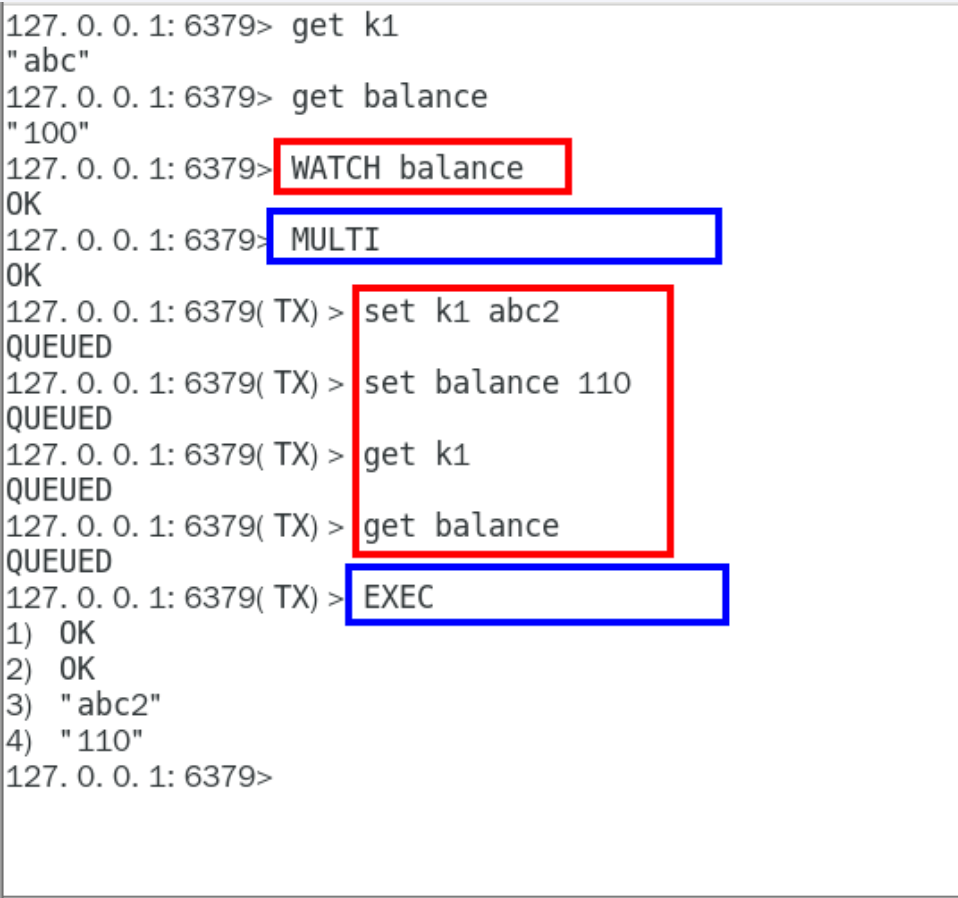

- 有加塞篡改

**watch命令是一种乐观锁的实现，Redis在修改的时候会检测数据是否被更改，如果更改了，则执行失败**

**第一个窗口蓝色框第5步执行结果返回为空，也就是相当于是失败，笔记见最下面官网说明**

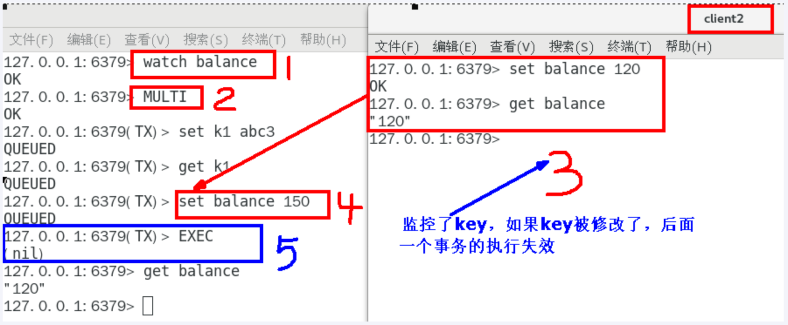

#### unwatch

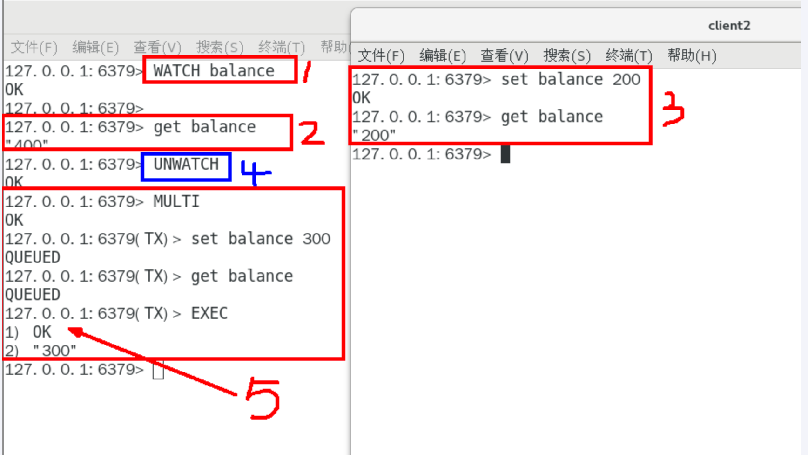

#### 小结

- 一旦执行了exec之前加的监控锁就会被取消掉了

- 当客户端连接丢失的时候（比如退出连接），所有东西都会被取消监视

## 05、小总结

开启：以MULTI开始一个事务

入队：将多个命令入队到事务中，接到这些命令并不会立即执行，而是放到等待执行的事务队列里面

执行：由EXEC命令触发事务
