---
# 当前页面内容标题
title: 一、Redis单线程 VS 多线程【入门篇】
# 分类
category:
  - redis
# 标签
tag: 
  - redis
  - NOSQL
  - K,V缓存数据库
  - 非关系型数据库
sticky: false
# 是否收藏在博客主题的文章列表中，当填入数字时，数字越大，排名越靠前。
star: false
# 是否将该文章添加至文章列表中
article: true
# 是否将该文章添加至时间线中
timeline: true
---

首课重要，后续深度讲解，避免晕菜，先预习混个耳熟

## 01、面试题

- redis到底是单线程还是多线程？

- IO多路复用听说过吗？

- redis为什么快？

## 02、Redis为什么选择单线程？

### 是什么？

`这种问法其实并不严谨，为啥这么说呢?`

Redis的版本很多3.x、4.x、6.x，版本不同架构也是不同的，不限定版本问是否单线程也不太严谨。

1 版本3.x ，最早版本，也就是大家口口相传的redis是单线程，阳哥2016年讲解的redis就是3.X的版本。

2 版本4.x，严格意义来说也不是单线程，而是负责处理客户端请求的线程是单线程，但是开始加了点多线程的东西(异步删除)。---貌似

3 2020年5月版本的6.0.x后及2022年出的7.0版本后，告别了大家印象中的单线程，用一种全新的多线程来解决问题。---实锤

`有几个里程碑式的重要版本`

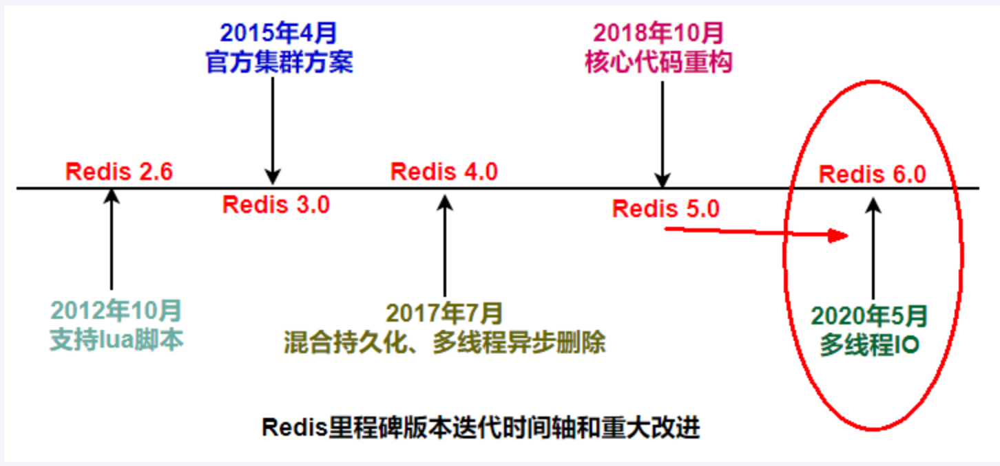

5.0版本是直接升级到6.0版本，对于这个激进的升级，Redis之父antirez表现得很有信心和兴奋，

所以第一时间发文来阐述6.0的一些重大功能"Redis 6.0.0 GA is out!"

当然，Redis7.0后版本更加厉害

### why

请说说演进变化情况？

1. Redis3.x单线程时代但性能依旧很快的主要原因
- 基于内存操作：Redis的所有数据都存在内存中，因此所有的运算都是内存级别的，所以它的性能比较高；

- 数据结构简单：Redis的数据结构是专门设计的，而这些简单的数据结构的查找和操作的时间大部分复杂度都是O(1)，因此性能比较高；

- 多路复用和非阻塞I/O：Redis使用I/O多路复用功能来监听多个socket连接客户端，这样就可以使用一个线程连接来处理多个请求，减少线程切换带来的开销，同时也避免了I/O阻塞操作

- 避免上下文切换：因为是单线程模型，因此就避免了不必要的上下文切换和多线程竞争，这就省去了多线程切换带来的时间和性能上的损耗，而且单线程不会导致死锁问题的发生
2. 作者原话，官网证据
- https://redis.io/docs/getting-started/faq/

- `Redis 4.0之前`一直采用单线程的主要原因有以下三个

简单来说，Redis4.0之前一直采用单线程的主要原因有以下三个：

1 使用单线程模型是 Redis 的开发和维护更简单，因为单线程模型方便开发和调试；

2 即使使用单线程模型也并发的处理多客户端的请求，主要使用的是IO多路复用和非阻塞IO；

3 对于Redis系统来说，**主要的性能瓶颈是内存或者网络带宽而并非 CPU。**

## 03、既然单线程那么好，为什么逐渐又加入了多线程特性？

### 单线程也有单线程的烦恼

举个栗子🌰

正常情况下使用 del 指令可以很快的删除数据，而当被删除的 key 是一个非常大的对象时，例如时包含了成千上万个元素的 hash 集合时，那么 del 指令就会造成 Redis 主线程卡顿。

**这就是redis3.x单线程时代最经典的故障，大key删除的头疼问题，**

由于redis是单线程的，del  bigKey .....

等待很久这个线程才会释放，类似加了一个synchronized锁，你可以想象高并发下，程序堵成什么样子？

### 如何解决？

- 使用惰性删除可以有效的避免Redis卡顿的问题

- 案例

比如当我（Redis）需要删除一个很大的数据时，因为是单线程原子命令操作，这就会导致 Redis 服务卡顿，

于是在 Redis 4.0 中就新增了多线程的模块，当然此版本中的多线程主要是为了解决删除数据效率比较低的问题的。

| unlink key                  |
| --------------------------- |
| flushdb async               |
| flushall async              |
| 把删除工作交给了后台的小弟（子线程）异步来删除数据了。 |

因为Redis是单个主线程处理，redis之父antirez一直强调"Lazy Redis is better Redis".

而lazy free的本质就是把某些cost(主要时间复制度，占用主线程cpu时间片)较高删除操作，

从redis主线程剥离让bio子线程来处理，极大地减少主线阻塞时间。从而减少删除导致性能和稳定性问题。

- 在Redis4.0就引入了多个线程来实现数据的异步惰性删除等功能，但是其处理读写请求的仍然只有一个线程，但是仍然算是狭义上的单线程。

## 04、Redis6/7的多线程特性和IO多路复用**入门篇**

### 对于Redis主要的性能瓶颈是内存或者网络带宽而并非是CPU

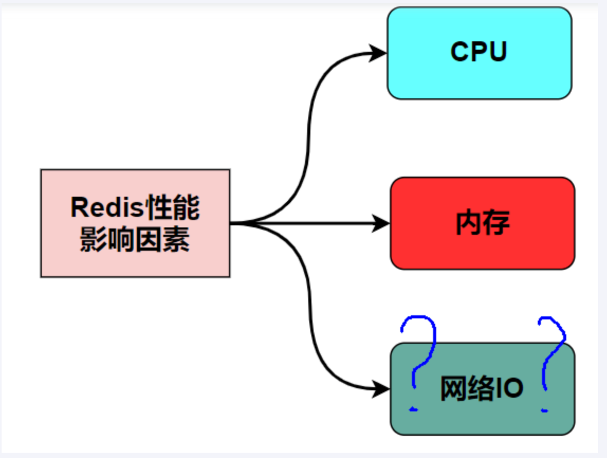

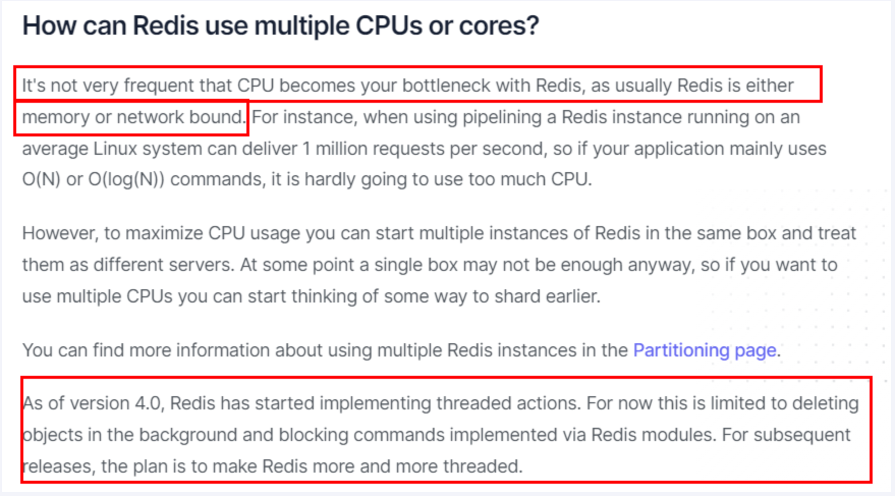

### 第一次听

听不懂没关系，阳哥是故意的，先混个耳熟，后续大招先给我预热。

### 最后Redis的瓶颈可以初步定位：网络IO

> redis6/7，真正多线程登场

`在Redis6/7中，非常受关注的第一个新特性就是多线程。`

这是因为，Redis一直被大家熟知的就是它的单线程架构，虽然有些命令操作可以用后台线程或子进程执行（比如数据删除、快照生成、AOF重写）。但是，从网络IO处理到实际的读写命令处理，都是由单个线程完成的。

随着网络硬件的性能提升，Redis的性能瓶颈有时会出现在网络IO的处理上，也就是说，单个主线程处理网络请求的速度跟不上底层网络硬件的速度,

为了应对这个问题:

`采用多个IO线程来处理网络请求，提高网络请求处理的并行度，Redis6/7就是采用的这种方法。`

但是，Redis的多IO线程只是用来处理网络请求的，对于读写操作命令Redis仍然使用单线程来处理。这是因为，Redis处理请求时，网络处理经常是瓶颈，通过多个IO线程并行处理网络操作，可以提升实例的整体处理性能。而继续使用单线程执行命令操作，就不用为了保证Lua脚本、事务的原子性，额外开发多线程`互斥加锁机制了(不管加锁操作处理)`，这样一来，Redis线程模型实现就简单了

> 主线程和IO线程是怎么协作完成请求处理的-精讲版

`四个阶段`

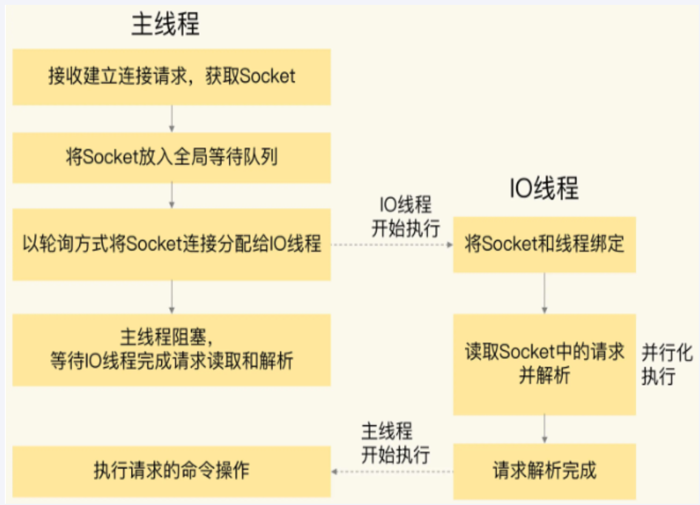

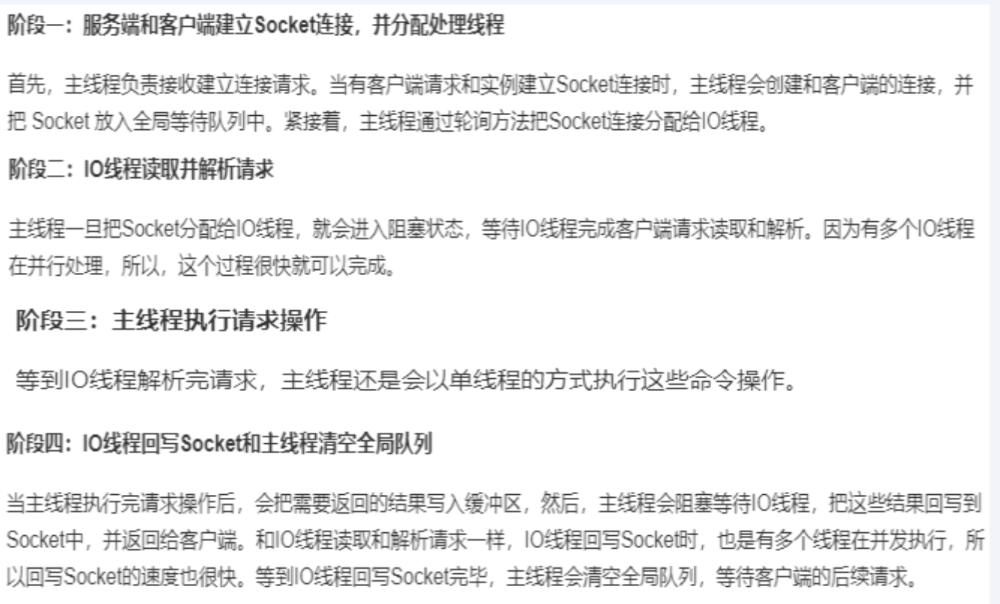

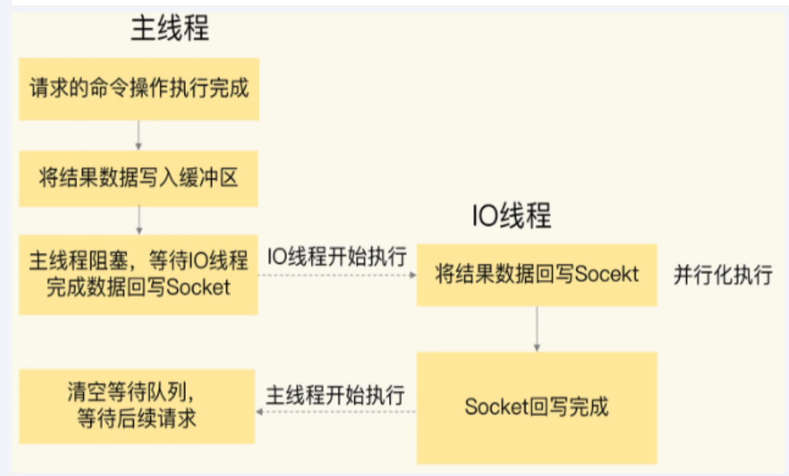

### Unix网络编程中的物种IO模型

#### Blocking IO-阻塞IO

#### NoneBlocking IO-非阻塞IO

#### IO multiplexing-IO多路复用

##### Linux世界一切皆文件

- 文件描述符、简称FD，句柄

- FileDescriptor

文件描述符（File descriptor）是计算机科学中的一个术语，是一个用于表述指向文件的引用的抽象化概念。文件描述符在形式上是一个非负整数。实际上，它是一个索引值，指向内核为每一个进程所维护的该进程打开文件的记录表。当程序打开一个现有文件或者创建一个新文件时，内核向进程返回一个文件描述符。在程序设计中，文件描述符这一概念往往只适用于UNIX、Linux这样的操作系统。

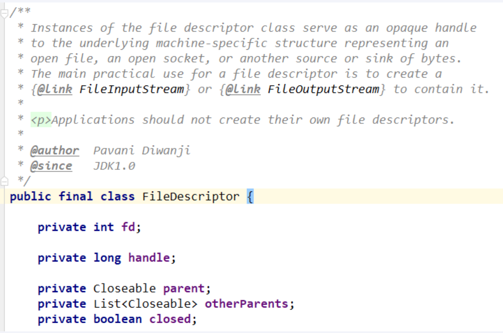

##### 首次浅谈IO多路复用，IO多路复用是什么？

一种同步的IO模型，实现`一个线程`监控`多个文件句柄`，`一旦某个文件句柄就绪`就能通知到对应应用程序进行相应的读写操作，`没有文件句柄就绪时`就会阻塞应用程序，从而释放CPU资源

> 概念

- I/O：网络I/O，尤其在操作系统层面指数据在内核态和用户态之间的读写操作

- 多路：多个客户端连接（连接就是套接字描述符，即`socket`或者`channel`）

- 复用：服用一个或几个线程。

- IO多路复用：也就是说一个或一组线程处理多个TCP连接，使用单线程就能实现同时处理多个客户端的连接，无需创建或者维护过多的进程/线程

- 一句话

一个服务端进程可以同时处理多个套接字描述符。

实现IO多路复用的模型有3种：可以分为 select -> poll -> epoll 三个阶段来描述。

##### 场景体验，说人话引出epoll

场景解析

模拟一个tcp服务器处理30个客户socket。

假设你是一个监考老师，让30个学生解答一道竞赛考题，然后负责验收学生答卷，你有下面几个选择：

`第一种选择(轮询)`：按顺序逐个验收，先验收A，然后是B，之后是C、D。。。这中间如果有一个学生卡住，全班都会被耽误,你用循环挨个处理socket，根本不具有并发能力。

`第二种选择(来一个new一个，1对1服务)`：你创建30个分身线程，每个分身线程检查一个学生的答案是否正确。 这种类似于为每一个用户创建一个进程或者线程处理连接。

`第三种选择(响应式处理，1对多服务)`，你站在讲台上等，谁解答完谁举手。这时C、D举手，表示他们解答问题完毕，你下去依次检查C、D的答案，然后继续回到讲台上等。此时E、A又举手，然后去处理E和A。。。这种就是IO复用模型。Linux下的select、poll和epoll就是干这个的。

##### IO多路复用模型，简单明了版理解

将用户socket对应的文件描述符(FileDescriptor)注册进epoll，然后epoll帮你监听哪些socket上有消息到达，这样就避免了大量的无用操作。此时的socket应该采用`非阻塞模式`。这样，整个过程只在调用select、poll、epoll这些调用的时候才会阻塞，收发客户消息是不会阻塞的，整个进程或者线程就被充分利用起来，这就是事件驱动，所谓的reactor反应模式。

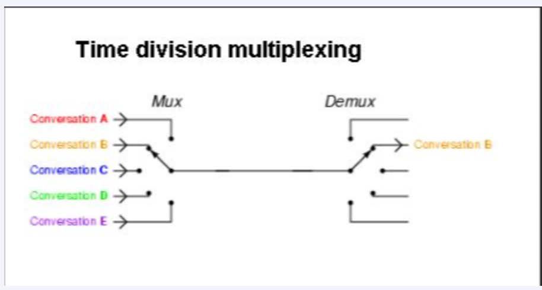

`在单个线程通过记录跟踪每一个Sockek(I/O流)的状态来同时管理多个I/O流`. 一个服务端进程可以同时处理多个套接字描述符。

目的是尽量多的提高服务器的吞吐能力。

大家都用过nginx，nginx使用epoll接收请求，ngnix会有很多链接进来， epoll会把他们都监视起来，然后像拨开关一样，谁有数据就拨向谁，然后调用相应的代码处理。redis类似同理，这就是IO多路复用原理，有请求就响应，没请求不打扰。

##### 小总结

只使用一个服务端进程就可以同时处理多个套接字描述符连接

##### 面试题：redis为什么这么快？

备注：

IO多路复用+epoll函数使用，才是redis为什么这么快的直接原因，而不是仅仅单线程命令+redis安装在内存中。

#### signal driven IO-信号驱动IO

#### asynchronous-异步IO

### 简单说明

Redis工作线程是单线程的，但是，整个Redis来说，是多线程的！

> 主线程和IO线程是怎么协作完成请求处理的-精简版

| I/O 的读和写本身是堵塞的，比如当 socket 中有数据时，Redis 会通过调用先将数据从内核态空间拷贝到用户态空间，再交给 Redis 调用，而这个拷贝的过程就是阻塞的，当数据量越大时拷贝所需要的时间就越多，而这些操作都是基于单线程完成的。 |
| ---------------------------------------------------------------------------------------------------------------------------- |

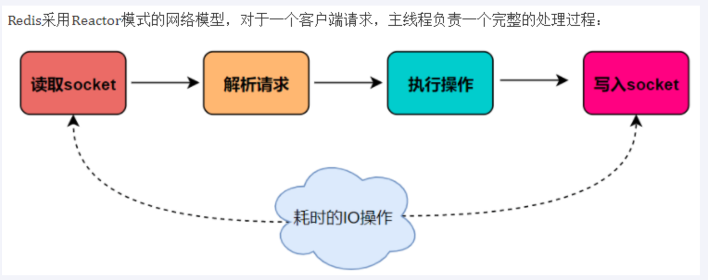

| 从Redis6开始，就新增了多线程的功能来提高 I/O 的读写性能，他的主要实现思路是将主线程的 IO 读写任务拆分给一组独立的线程去执行，这样就可以使多个 socket 的读写可以并行化了，采用多路 I/O 复用技术可以让单个线程高效的处理多个连接请求（尽量减少网络IO的时间消耗），将最耗时的Socket的读取、请求解析、写入单独外包出去，剩下的命令执行仍然由主线程串行执行并和内存的数据交互。 |
| ------------------------------------------------------------------------------------------------------------------------------------------------------------------------------------------------------- |

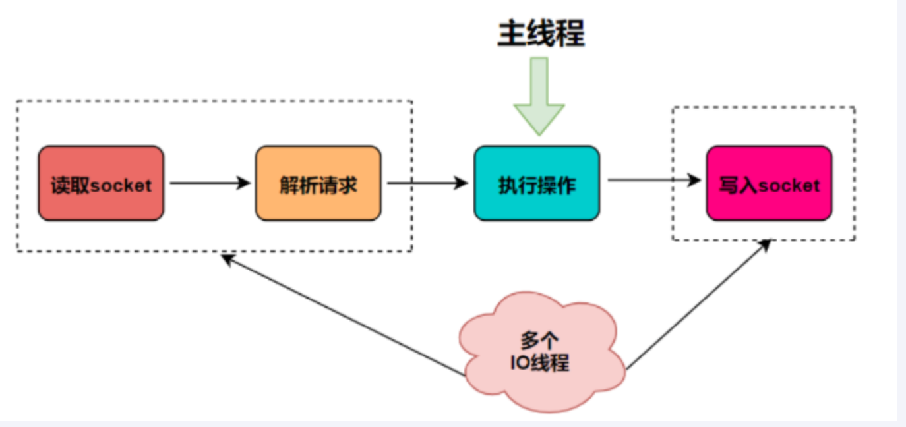

| 结合上图可知，网络IO操作就变成多线程化了，其他核心部分仍然是线程安全的，是个不错的折中办法。 |
| ----------------------------------------------- |

> 结论

| Redis6→7将网络数据读写、请求协议解析通过多个IO线程的来处理 ， 对于真正的命令执行来说，仍然使用主线程操作，一举两得，便宜占尽！！！ o(￣▽￣)ｄ |
| ----------------------------------------------------------------------------------- |

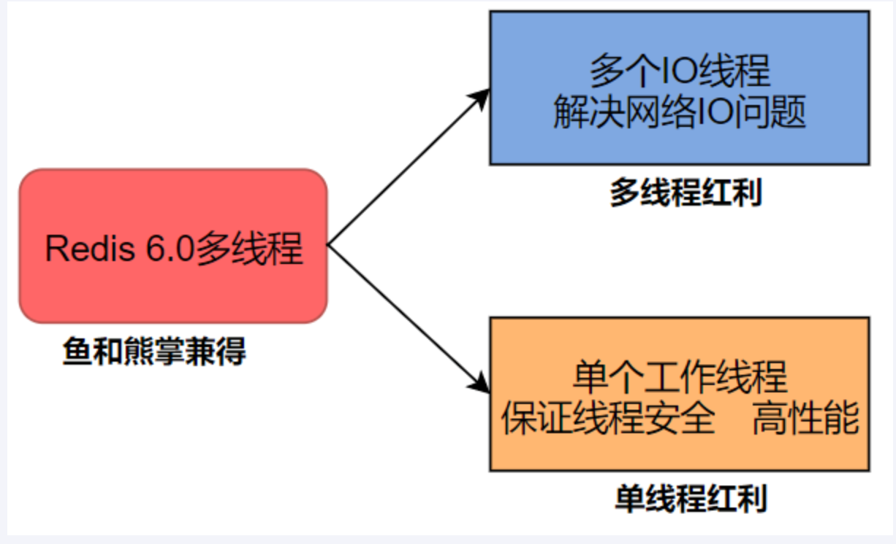

## 05、Redis7默认是否开启了多线程？

如果你在实际应用中，发现Redis实例的CPU开销不大但吞吐量却没有提升，可以考虑使用Redis7的多线程机制，加速网络处理，进而提升实例的吞吐量

| Redis7将所有数据放在内存中，内存的响应时长大约为100纳秒，对于小数据包，Redis服务器可以处理8W到10W的QPS， 这也是Redis处理的极限了，对于80%的公司来说，单线程的Redis已经足够使用了。 |
| --------------------------------------------------------------------------------------------------------------- |

在Redis6.0及7后，`多线程机制默认是关闭的`，如果需要使用多线程功能，需要在redis.conf中完成两个设置

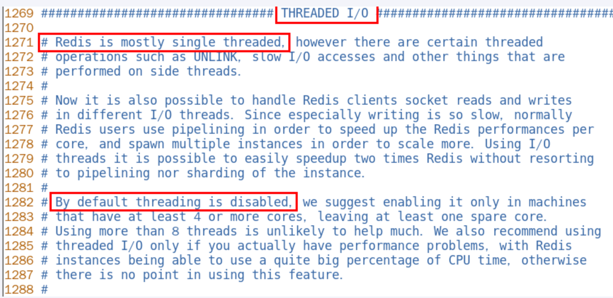

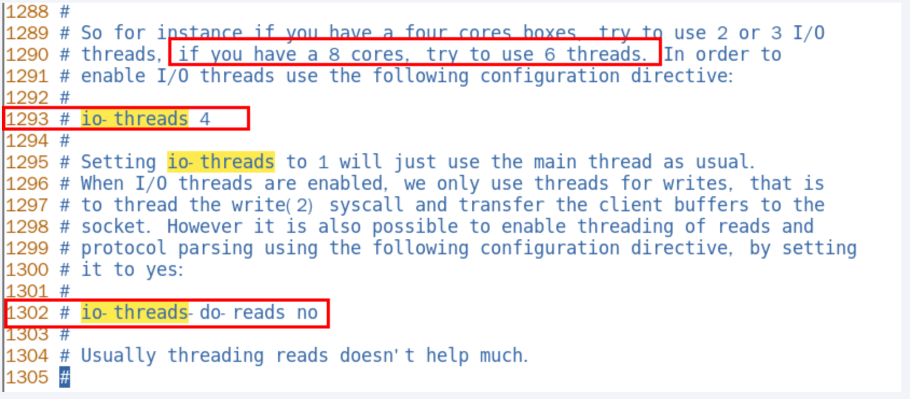

1.设置io-thread-do-reads配置项为yes，表示启动多线程。

2。设置线程个数。关于线程数的设置，官方的建议是如果为 4 核的 CPU，建议线程数设置为 2 或 3，`如果为 8 核 CPU 建议线程数设置为 6`，线程数一定要小于机器核数，线程数并不是越大越好。

## 06、我还是曾经那个少年

Redis自身出道就是优秀，基于内存操作、数据结构简单、多路复用和非阻塞 I/O、避免了不必要的线程上下文切换等特性，在单线程的环境下依然很快；

但对于大数据的 key 删除还是卡顿厉害，因此在 Redis 4.0 引入了多线程unlink key/flushall async 等命令，主要用于 Redis 数据的异步删除；

而在 Redis6/7中引入了 I/O 多线程的读写，这样就可以更加高效的处理更多的任务了，`Redis 只是将 I/O 读写变成了多线程`，而`命令的执行依旧是由主线程串行执行的`，因此在多线程下操作 Redis 不会出现线程安全的问题。

**Redis 无论是当初的单线程设计，还是如今与当初设计相背的多线程，目的只有一个：让 Redis 变得越来越快。**

所以 Redis 依旧没变，他还是那个曾经的少年，O(∩_∩)O哈哈~
