---
# 当前页面内容标题
title: 二、BigKey
# 分类
category:
  - redis
# 标签
tag: 
  - redis
  - NOSQL
  - K,V缓存数据库
  - 非关系型数据库
sticky: false
# 是否收藏在博客主题的文章列表中，当填入数字时，数字越大，排名越靠前。
star: false
# 是否将该文章添加至文章列表中
article: true
# 是否将该文章添加至时间线中
timeline: true
---

## 01、面试题

- 阿里广告平台，海量数据里查询某一固定前缀的key

- 小红书，你如何生产上限制`keys *`/`flushdb`/`flushall`等危险命令以防止误删无用？

- 美团，MEMORY USAGE命令你用过吗？

- BigKey问题，多大算big？你如何发现？如何删除？如何处理？

- BigKey你做过调优吗？惰性释放lazyfree了解过吗？

- Morekey问题，生产上redis数据库有1000W记录，你如何遍历？`keys *`可以吗？

- 。。。。。。

## 02、MoreKey案例

### **大批量往Redis里面插入2000W测试数据key**

**Linux Bash下面执行，插入100W**

> 生成100W条redis批量设置kv的语句(key=kn,value=vn)写入到/tmp目录下的redisTest.txt文件中
> 
> for((i=1;i<=100*10000;i++)); do echo "set k$i v$i" >> /tmp/redisTest.txt ;done;

通过redis提供的管道 --pipe命令插入100W大批量数据

结合自己机器的地址：

cat /tmp/redisTest.txt | /opt/redis-7.0.0/src/redis-cli -h 127.0.0.1 -p 6379 -a 111111 --pipe

多出来的5条，是之前阳哥自己的其它测试数据 ，参考阳哥机器硬件，100w数据插入redis花费5.8秒左右

### **某快递巨头真实生产案例新闻**

> 新闻

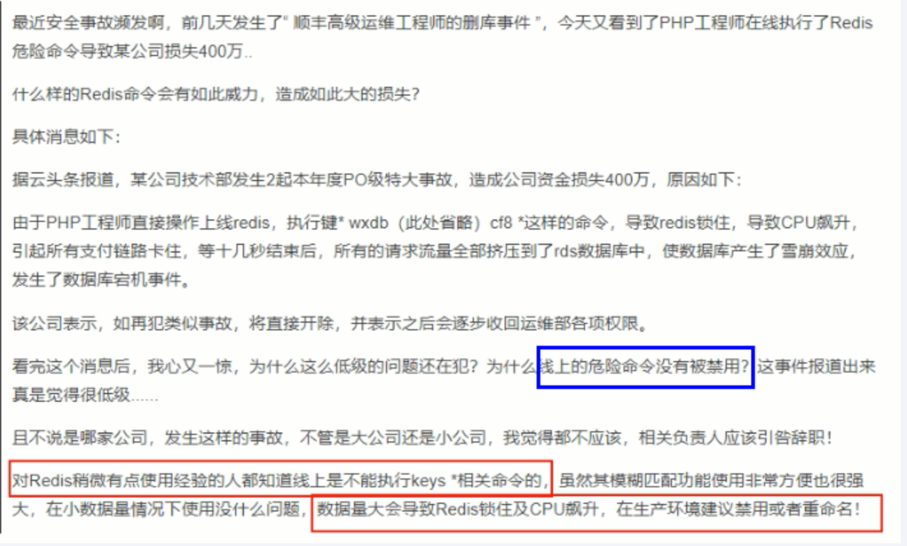

> keys * 你试试100W花费多少秒遍历查询

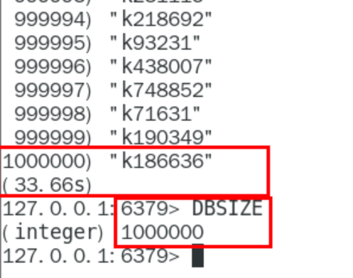

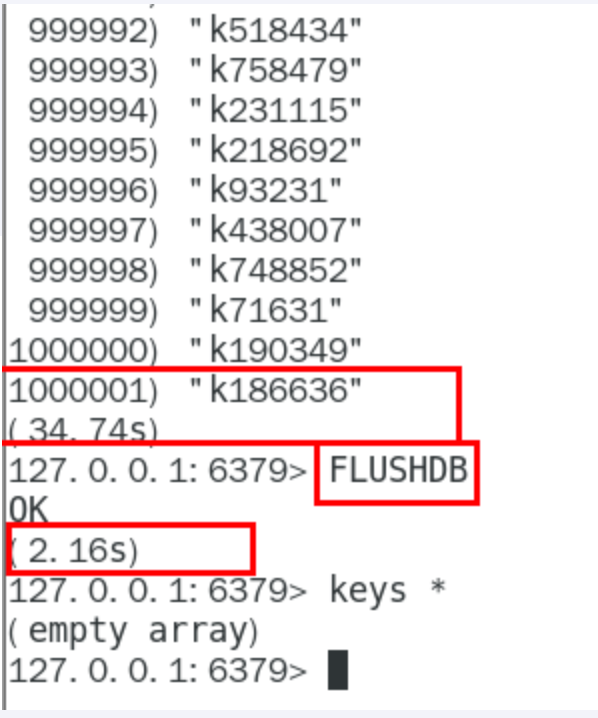

`key * 这个指令有致命的弊端，在实际环境中最好不要使用`

> 生产上限制keys */flushdb/flushall等危险命令防止误删误用？

通过配置设置禁用这些命令，redis.conf在`SECURITY`这一配置项中

【友情提醒】如果AOF或RDB中包含了需要禁用的命令，Redis会启动不起来，需要删除AOF以及RDB文件

### **不用keys *避免卡顿，那该用什么**

> scan命令登场

https://redis.io/commands/scan/

https://redis.com.cn/commands/scan.html

一句话，类似mysql limit但`不完全相同`

> Scan命令用于迭代数据库中的数据库键

- 语法

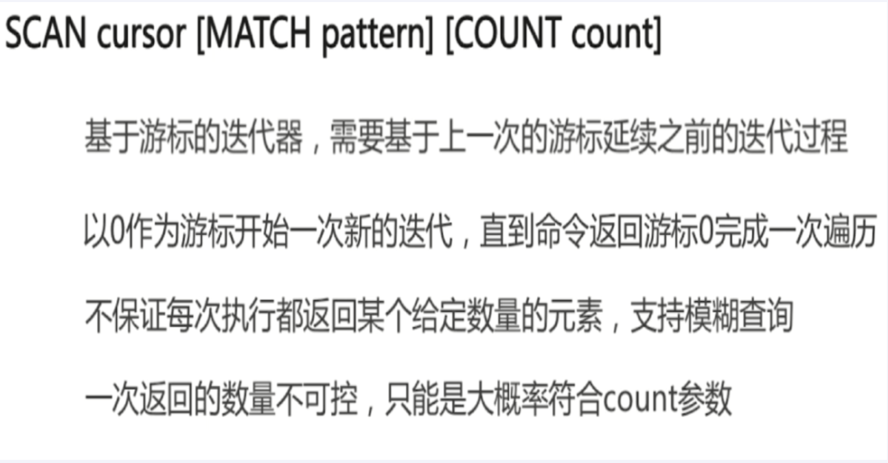

- 特点

SCAN 命令是一个基于游标的迭代器，每次被调用之后， 都会向用户返回一个新的游标， **用户在下次迭代时需要使用这个新游标作为 SCAN 命令的游标参数**， 以此来延续之前的迭代过程。

SCAN 返回一个包含**两个元素的数组**， 

第一个元素是用于进行下一次迭代的新游标， 

第二个元素则是一个数组， 这个数组中包含了所有被迭代的元素。**如果新游标返回零表示迭代已结束。**

SCAN的遍历顺序

**非常特别，它不是从第一维数组的第零位一直遍历到末尾，而是采用了高位进位加法来遍历。之所以使用这样特殊的方式进行遍历，是考虑到字典的扩容和缩容时避免槽位的遍历重复和遗漏。**

- 使用

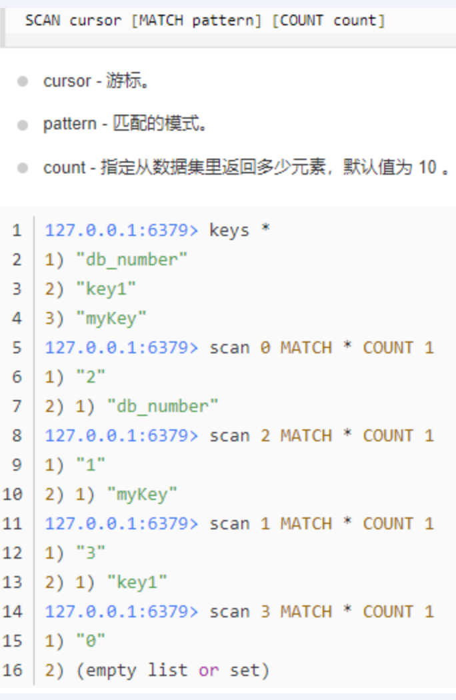

## 03、BigKey案例

### 多大算Big

**参考《阿里云Redis开发规范》**

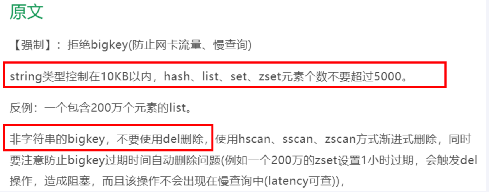

**string和二级数据**

`list、hash、set和zset，个数超过5000就是bigkey`

疑问？？？

- list：一个列表最多可以包含2^32-1个元素（4294967295，每个列表超过40亿个元素）。
- hash：Redis中每个hash可以存储2^32-1键值对（40多亿）
- set：集合中最大的成员数为2^32-1（4294967295，每个集合中可存储40多亿哥成员）。
- 。。。。。。

### 哪些危害

- 内存不均，集群迁移困难
- 超时删除，大key删除作梗
- 网络流量阻塞

### 如何产生

**社交类**

王心凌粉丝列表，典型案例粉丝逐步递增

**汇总统计**

某个报表，月日年经年累月的积累

### 如何发现

> redis-cli --bigkeys

**好处，见最下面总结**

给出每种数据结构Top 1 bigkey，同时给出每种数据类型的键值个数+平均大小

**不足**

想查询大于10kb的所有key，--bigkeys参数就无能为力了，`需要用到memory usage来计算每个键值的字节数`

redis-cli --bigkeys -a 111111 

| redis-cli -h 127.0.0.1 -p 6379 -a 111111 --bigkeys                                              |
| ----------------------------------------------------------------------------------------------- |
| 每隔 100 条 scan 指令就会休眠 0.1s，ops 就不会剧烈抬升，但是扫描的时间会变长redis-cli -h 127.0.0.1 -p 7001 –-bigkeys -i 0.1 |

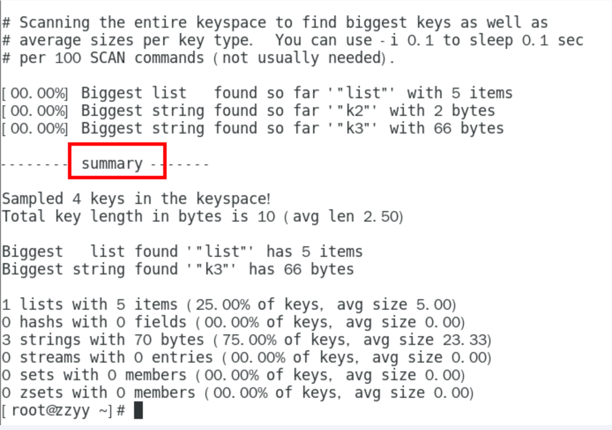

> MEMORY USAGE 键

计算每个键值的字节数

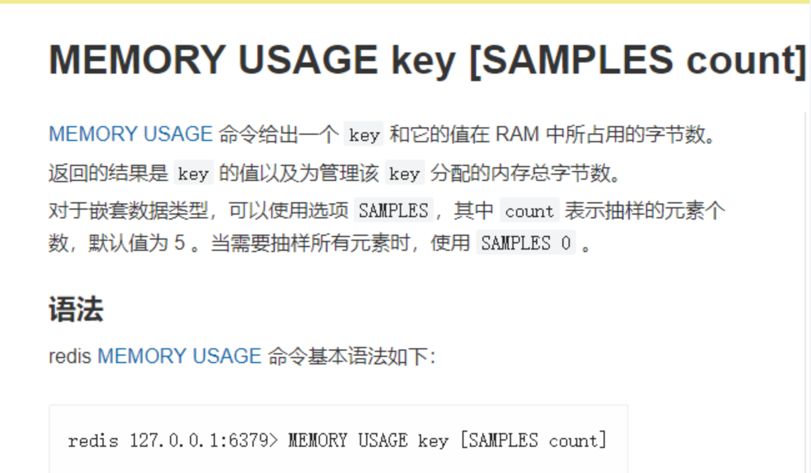

[官网](https://redis.com.cn/commands/memory-usage.html)

### 如何删除

> 参考《阿里云Redis开发手册》

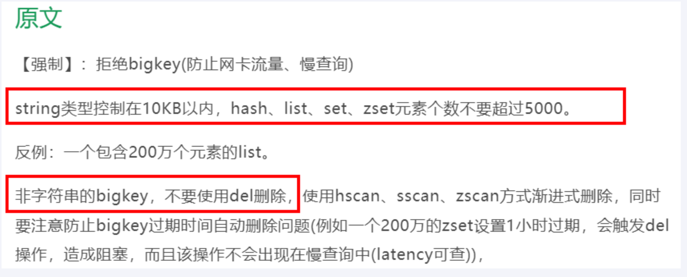

> [官网](https://redis.io/commands/scan)

> 普通命令

- String：一般用del，如果过于庞大`unlink`

- hash：使用hscan每次获取少量field-value，在使用hdel删除每个field
  
  - 命令
    
    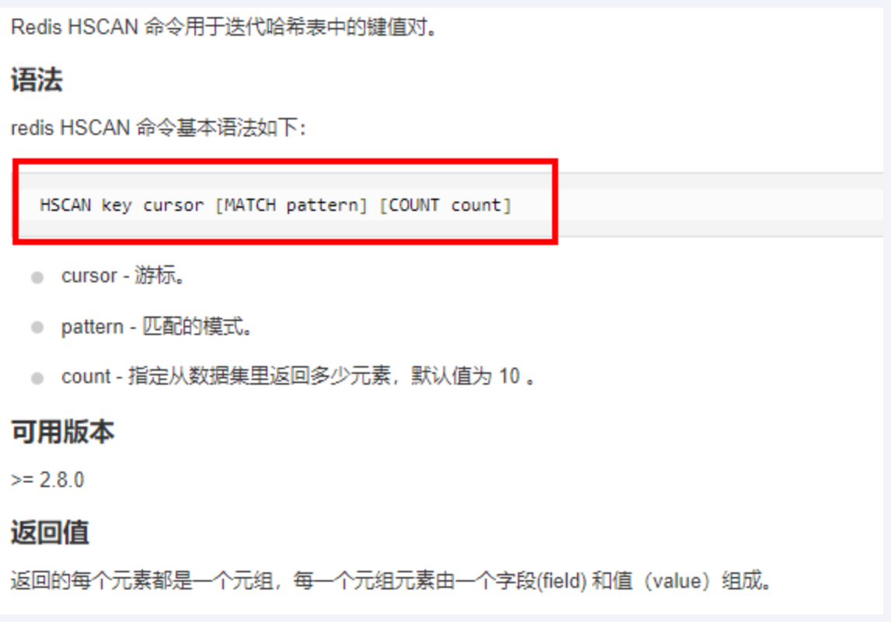
  
  - 阿里手册
    
    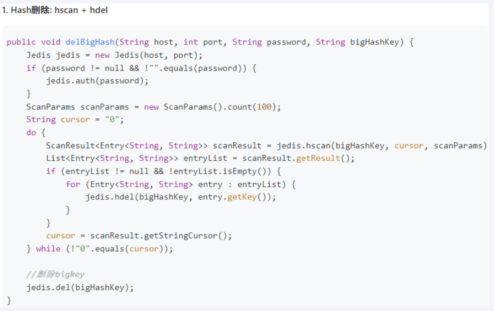

- list：使用ltrim渐进式逐步删除，知道全部删除完成
  
  - 命令
    
    
    
    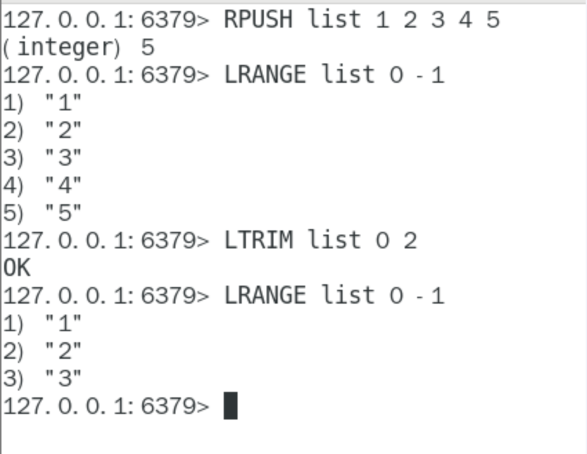
  
  - 阿里手册
    
    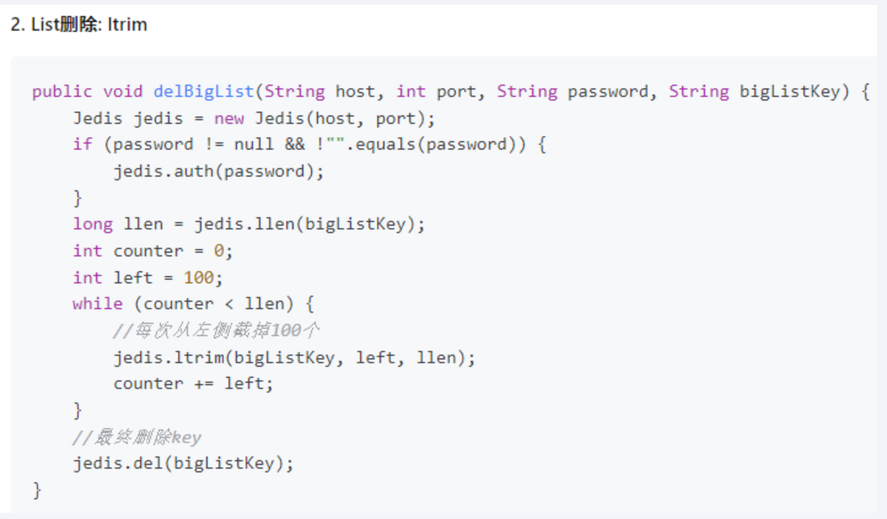

- set：使用sscan每次获取部分元素，在使用srem命令删除每个元素
  
  - 命令
    
    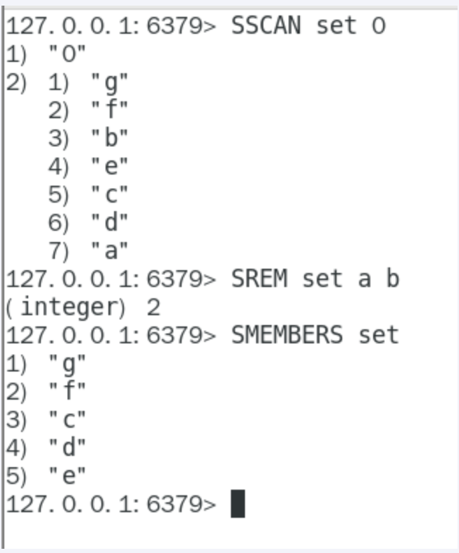
  
  - 阿里手册
    
    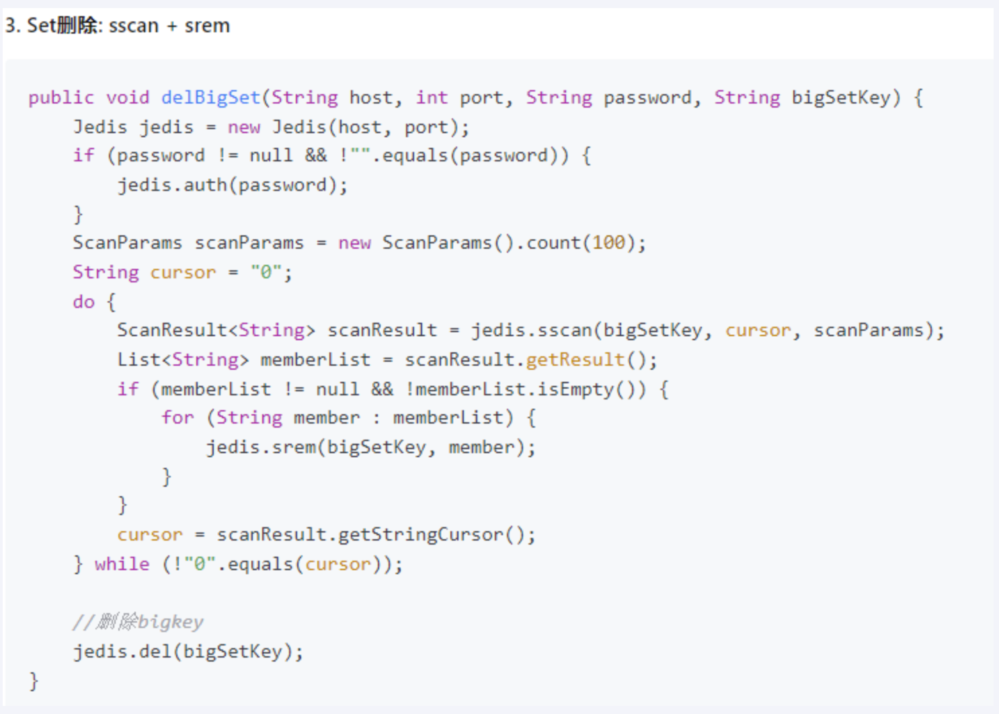

- zset：使用zscan每次获取部分元素，再使用ZREMRANGEBYRANK命令删除每个元素
  
  - 命令
    
    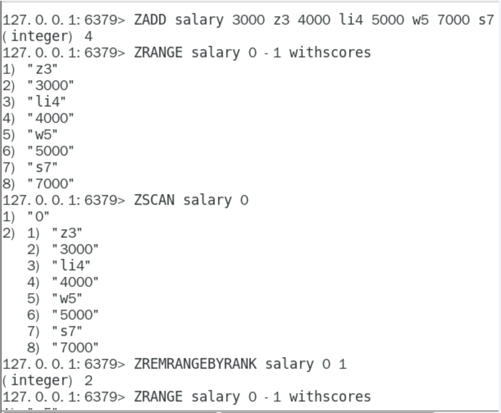
    
    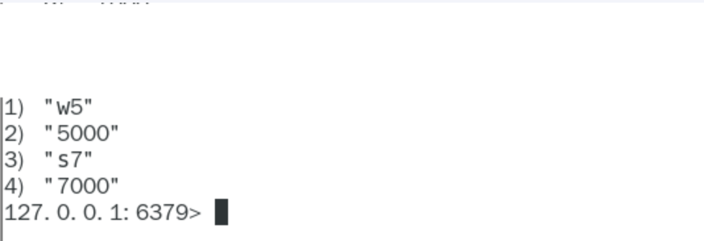
  
  - 阿里手册
    
    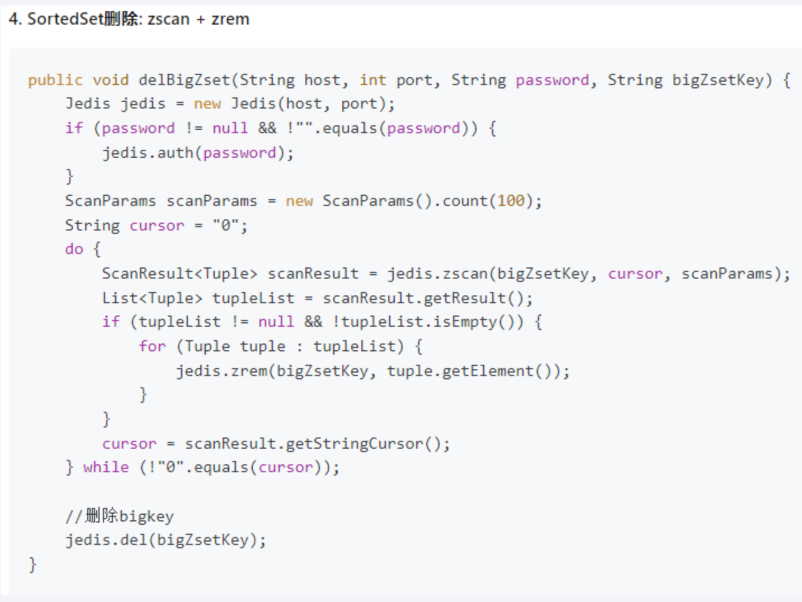

## 04、BigKey生产调优

**redis.conf配置文件LAZY FREEING相关说明**

阻塞和非阻塞删除命令

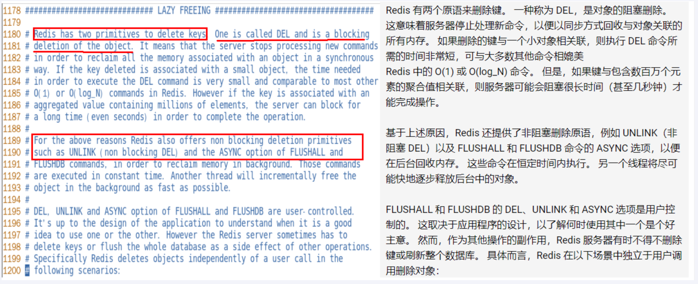

优化配置

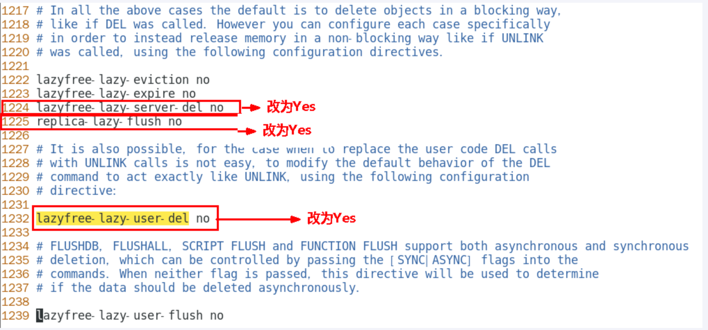
