---
# 当前页面内容标题
title: 二、Docker安装
# 分类
category:
  - docker
# 标签
tag: 
  - docker
  - 云原生开发
  - Devops
sticky: false
# 是否收藏在博客主题的文章列表中，当填入数字时，数字越大，排名越靠前。
star: false
# 是否将该文章添加至文章列表中
article: true
# 是否将该文章添加至时间线中
timeline: true
---

## 一、前提说明

**CentOS Docker 安装**

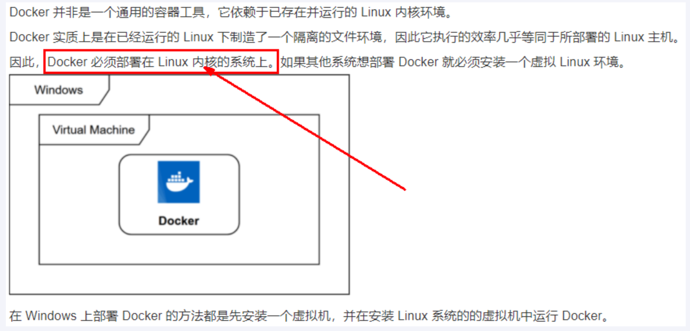

**前提条件**

目前，CentOS 仅发行版本中的内核支持 Docker。Docker 运行在CentOS 7 (64-bit)上，

要求系统为64位、Linux系统内核版本为 3.8以上，这里选用Centos7.x

**查看自己的内核**

uname命令用于打印当前系统相关信息（内核版本号、硬件架构、主机名称和操作系统类型等）。


## 二、Docker的基本组成

- 镜像（image）

Docker 镜像（Image）就是一个**只读**的模板。镜像可以用来创建 Docker 容器，`一个镜像可以创建很多容器`。

它也相当于是一个root文件系统。比如官方镜像 centos:7 就包含了完整的一套 centos:7 最小系统的 root 文件系统。

相当于容器的“源代码”，`docker镜像文件类似于Java的类模板，而docker容器实例类似于java中new出来的实例对象。`


- 容器（Container）

**1 从面向对象角度**

Docker 利用容器（Container）独立运行的一个或一组应用，应用程序或服务运行在容器里面，容器就类似于一个虚拟化的运行环境，`容器是用镜像创建的运行实例`。就像是Java中的类和实例对象一样，镜像是静态的定义，容器是镜像运行时的实体。容器为镜像提供了一个标准的和隔离的运行环境，它可以被启动、开始、停止、删除。每个容器都是相互隔离的、保证安全的平台

**2 从镜像容器角度**

***可以把容器看做是一个简易版的 Linux 环境***（包括root用户权限、进程空间、用户空间和网络空间等）和运行在其中的应用程序。

- 仓库（repoistory）

仓库（Repository）是`集中存放镜像文件`的场所。

类似于

Maven仓库，存放各种jar包的地方；

github仓库，存放各种git项目的地方；

Docker公司提供的官方registry被称为Docker Hub，存放各种镜像模板的地方。

仓库分为公开仓库（Public）和私有仓库（Private）两种形式。

**最大的公开仓库是 Docker Hub(https://hub.docker.com/)，** 存放了数量庞大的镜像供用户下载。国内的公开仓库包括阿里云 、网易云等

- 小总结

**需要正确的理解仓库/镜像/容器这几个概念:**

Docker 本身是一个容器运行载体或称之为管理引擎。我们把应用程序和配置依赖打包好形成一个可交付的运行环境，这个打包好的运行环境就是image镜像文件。只有通过这个镜像文件才能生成Docker容器实例(类似Java中new出来一个对象)。

image文件可以看作是容器的模板。Docker 根据 image 文件生成容器的实例。同一个 image 文件，可以生成多个同时运行的容器实例。

**镜像文件**

*  image 文件生成的容器实例，本身也是一个文件，称为镜像文件。

**容器实例**

*  一个容器运行一种服务，当我们需要的时候，就可以通过docker客户端创建一个对应的运行实例，也就是我们的容器

**仓库**

* 就是放一堆镜像的地方，我们可以把镜像发布到仓库中，需要的时候再从仓库中拉下来就可以了。

----

## 三、Docker平台架构图解

> Docker平台架构图解（入门版）

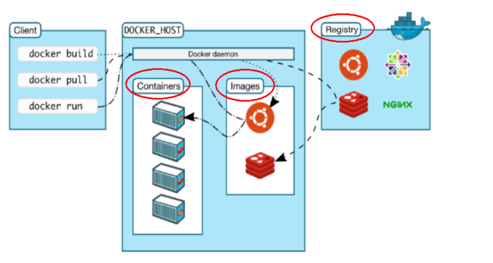

`Docker工作原理`

Docker是一个Client-Server结构的系统，Docker守护进程运行在主机上， 然后通过Socket连接从客户端访问，守护进程从客户端接受命令并管理运行在主机上的容器。 **容器，是一个运行时环境，就是我们前面说到的集装箱。可以对比mysql演示对比讲解**

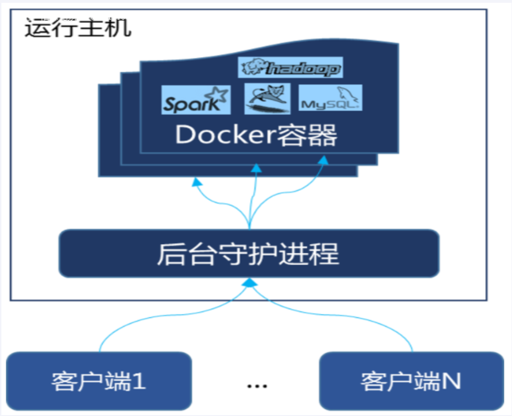

> Docker平台架构图解（架构版）

首次懵逼很正常，后续深入，先有大概轮廓，混个眼熟

**整体架构及底层通信原理概述**

Docker 是一个 C/S 模式的架构，后端是一个松耦合架构，众多模块各司其职。


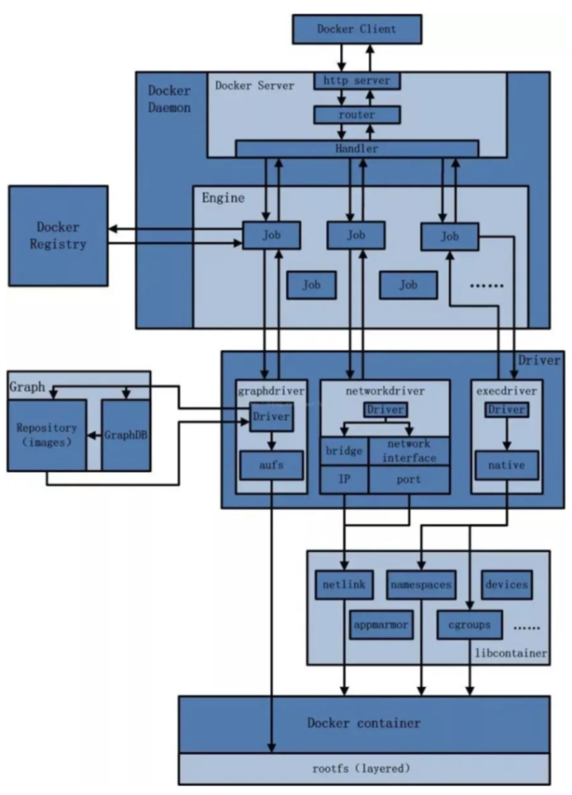

## 四、安装步骤

[下载地址]([Install Docker Engine on CentOS | Docker Documentation](https://docs.docker.com/engine/install/centos/))

**安装步骤**

1.确定你是CentOS7及以上版本

```shell
cat /etc/redhat-release
```

2.卸载旧版本

https://docs.docker.com/engine/install/centos/

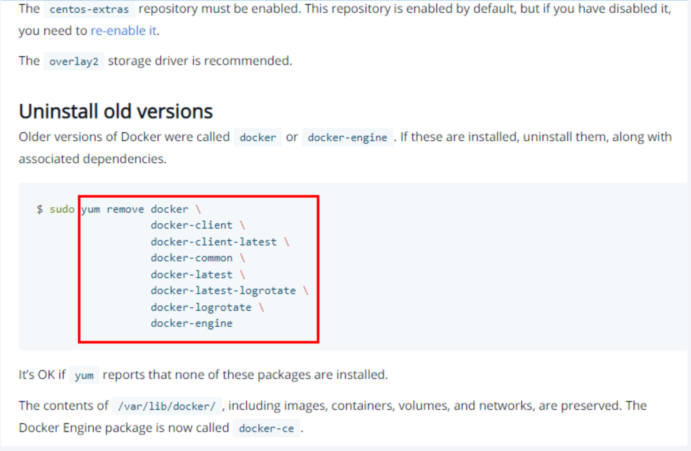

```shell
sudo yum remove docker \
                  docker-client \
                  docker-client-latest \
                  docker-common \
                  docker-latest \
                  docker-latest-logrotate \
                  docker-logrotate \
                  docker-engine
```

3.yum安装gcc相关

CentOS7能上外网

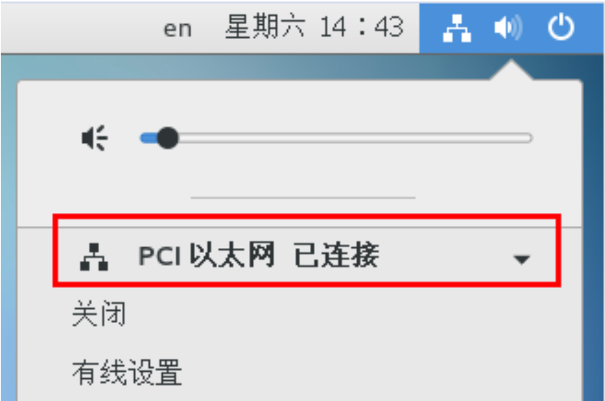

```shell
yum -y install gcc
yum -y install gcc-c++
```

4.安装需要的软件包

官网要求

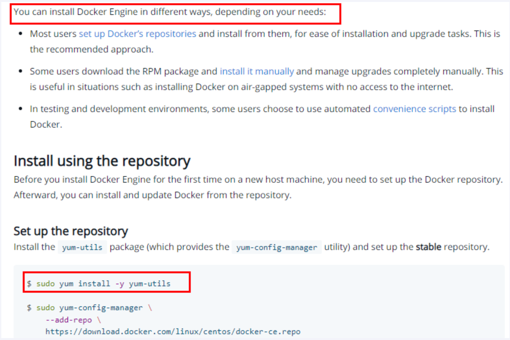

执行命令

```shell
sudo yum install -y yum-utils
```

5.设置stable镜像仓库

`❌大坑`

```shell
sudo yum install -y yum-utils
sudo yum-config-manager --add-repo https://download.docker.com/linux/centos/docker-ce.repo
```


报错：

1   [Errno 14] curl#35 - TCP connection reset by peer

2   [Errno 12] curl#35 - Timeout

**官网要求**

```shell
sudo yum-config-manager --add-repo https://download.docker.com/linux/centos/docker-ce.repo
```

报错：

1   [Errno 14] curl#35 - TCP connection reset by peer

2   [Errno 12] curl#35 - Timeout

**✅推荐**

```shell
yum-config-manager --add-repo http://mirrors.aliyun.com/docker-ce/linux/centos/docker-ce.repo
```

我们自己使用这个（阿里的镜像）


6.更新yum软件包索引

```shell
yum makecache fast
```

7.安装Docker CE

```shell
sudo yum install docker-ce docker-ce-cli containerd.io docker-buildx-plugin docker-compose-plugin
```

官网要求


执行结果


8.启动Docker

```shell
systemctl start docker
```

9.测试

```shell
docker version
```

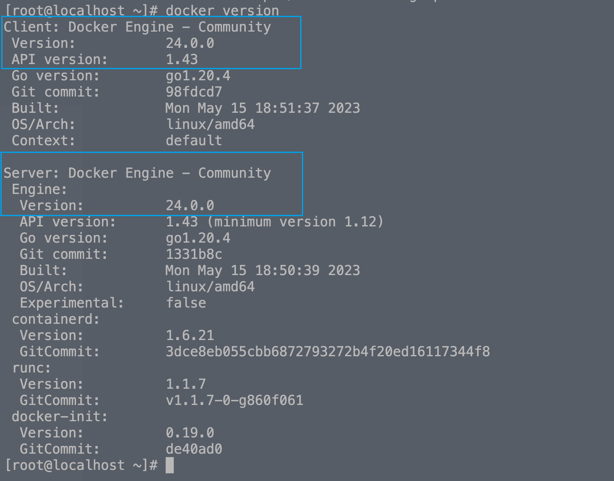

```shell
docker run hello-word
```

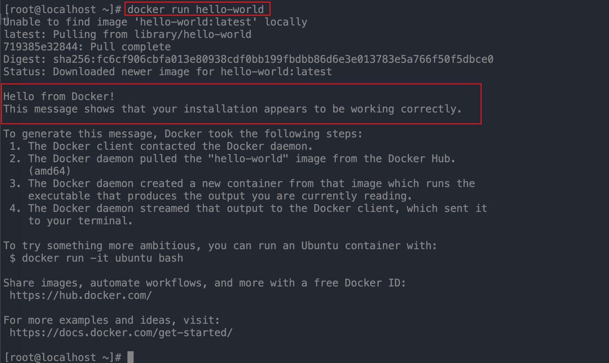

10.卸载

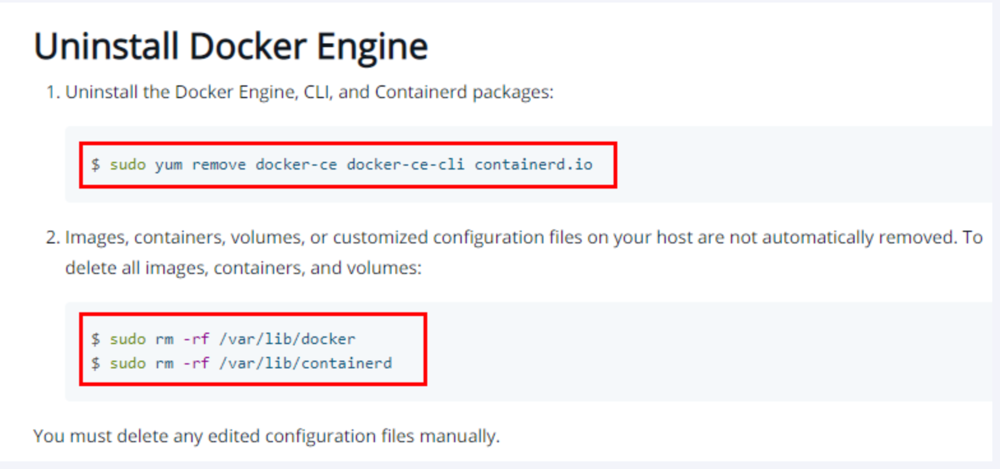

```shell
systemctl stop docker

sudo yum remove docker-ce docker-ce-cli containerd.io docker-buildx-plugin docker-compose-plugin docker-ce-rootless-extras

sudo rm -rf /var/lib/docker

sudo rm -rf /var/lib/containerd
```

## 五、阿里云镜像加速

> 是什么

[开放云原生应用-云原生（Cloud Native）-云原生介绍 - 阿里云 (aliyun.com)](https://promotion.aliyun.com/ntms/act/kubernetes.html)

> 注册一个属于自己的阿里云账户（可复用淘宝账号）

> 获得加速器地址连接

1. 登录阿里云开发者平台

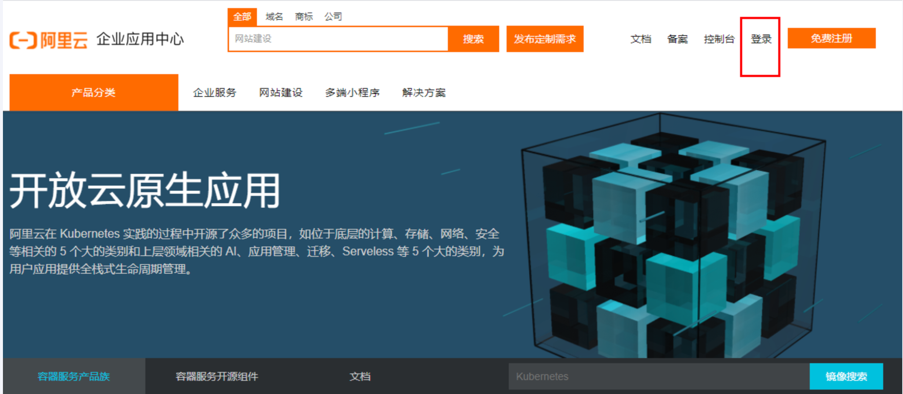

2. 点击控制台

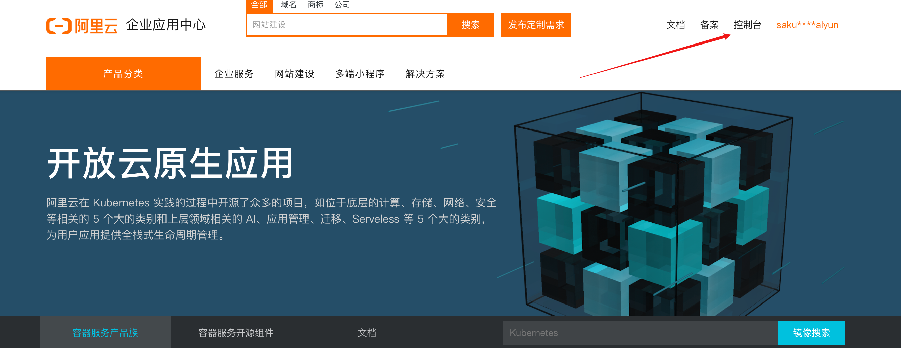

3. 选择容器镜像服务

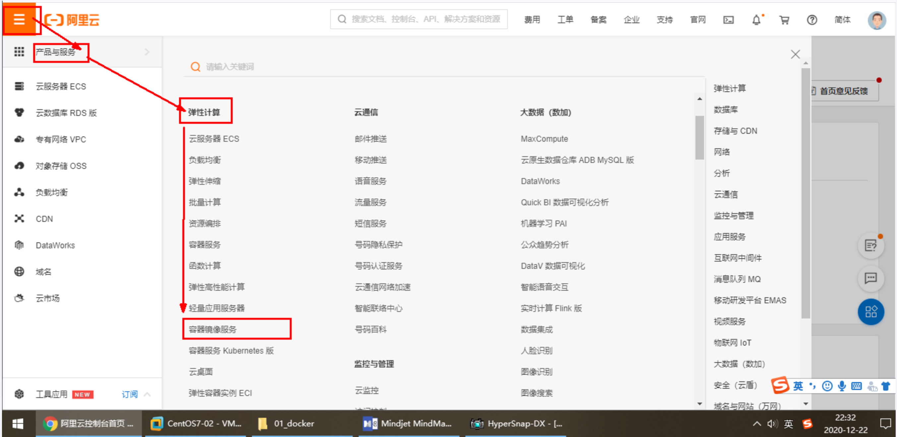

4. 获取加速器地址

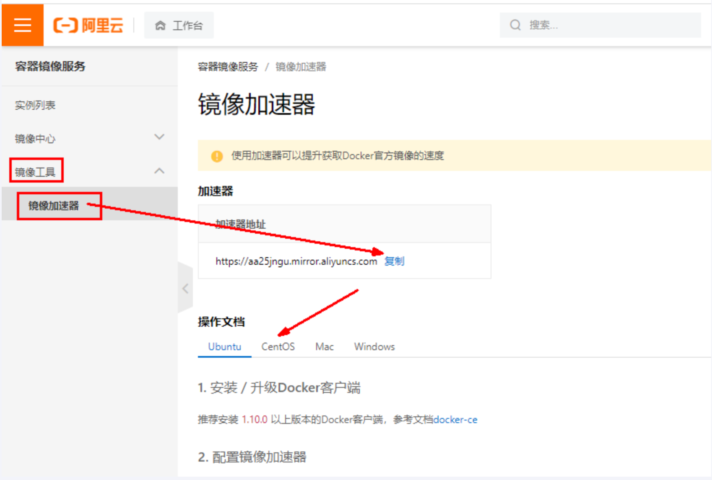

> 粘贴脚本直接执行

- 直接粘

```shell
mkdir -p /etc/docker
```

```shell
tee /etc/docker/daemon.json <<-'EOF'
{
  "registry-mirrors": ["https://gt9wq4lq.mirror.aliyuncs.com"]
}
EOF
```

- 或者分步骤都行

```shell
mkdir -p /etc/docker

vim /etc/docker/daemon.json
```

```json
#阿里云
{
  "registry-mirrors": ["https://｛自已的编码｝.mirror.aliyuncs.com"]
}
```

> 重启服务器

```shell
systemctl daemon-reload
systemctl restart docker
```

## 六、永远的HelloWord

启动Docker后台容器（测试运行 helo-world）

- docker run hello-world

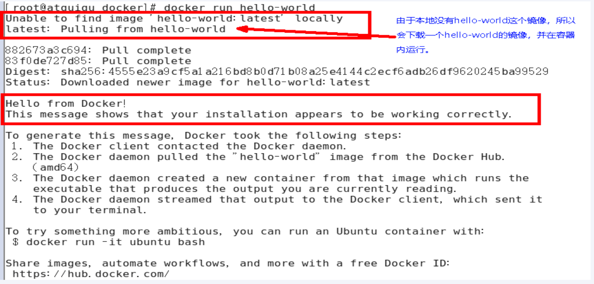

输出这段提示以后，hello world就会停止运行，容器自动终止。

- run 干了什么

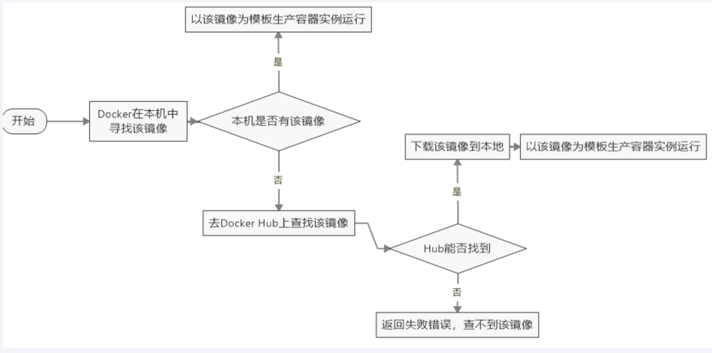

## 七、底层原理

> 为什么Docker会比VM虚拟机快？

`(1)docker有着比虚拟机更少的抽象层`

   由于docker不需要Hypervisor(虚拟机)实现硬件资源虚拟化,运行在docker容器上的程序直接使用的都是实际物理机的硬件资源。因此在CPU、内存利用率上docker将会在效率上有明显优势。

`(2)docker利用的是宿主机的内核,而不需要加载操作系统OS内核`

   当新建一个容器时,docker不需要和虚拟机一样重新加载一个操作系统内核。进而避免引寻、加载操作系统内核返回等比较费时费资源的过程,当新建一个虚拟机时,虚拟机软件需要加载OS,返回新建过程是分钟级别的。而docker由于直接利用宿主机的操作系统,则省略了返回过程,因此新建一个docker容器只需要几秒钟。

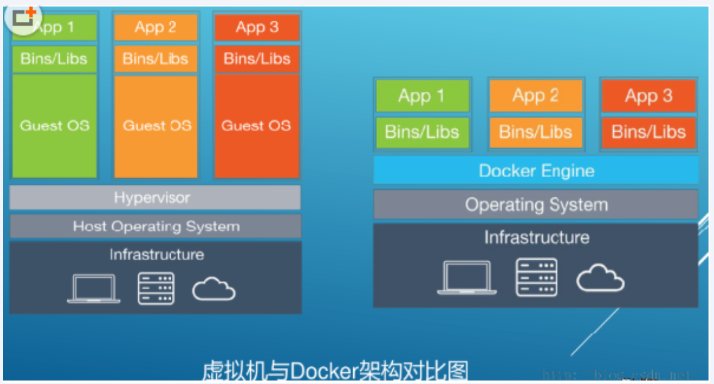

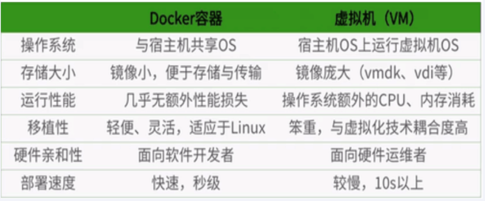
