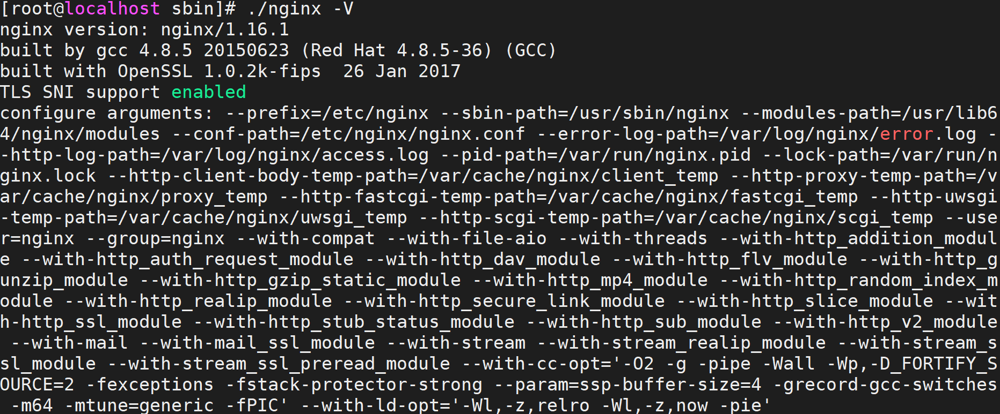
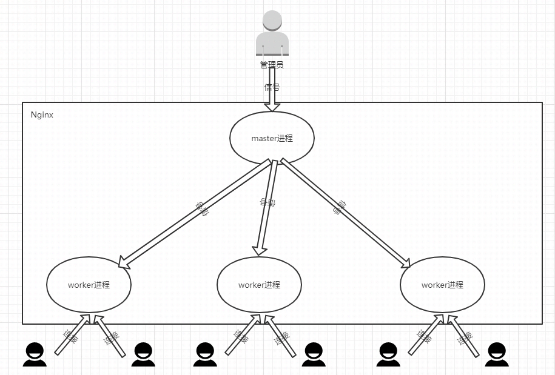

---
# 当前页面内容标题
title: 二、Nginx环境准备 
# 分类
category:
  - nginx
# 标签
tag: 
  - NGINX
  - 分布式架构
  - 服务器
sticky: false
# 是否收藏在博客主题的文章列表中，当填入数字时，数字越大，排名越靠前。
star: false
# 是否将该文章添加至文章列表中
article: true
# 是否将该文章添加至时间线中
timeline: true
---

### Nginx版本介绍

Nginx的官方网站为: http://nginx.org

打开源码可以看到如下的页面内容


Nginx的官方下载网站为<http://nginx.org/en/download.html>，当然你也可以之间在首页选中右边的download进入版本下载网页。在下载页面我们会看到如下内容：


### 获取Nginx源码

<http://nginx.org/download/>

打开上述网站，就可以查看到Nginx的所有版本，选中自己需要的版本进行下载。下载我们可以直接在windows上下载然后上传到服务器，也可以直接从服务器上下载，这个时候就需要准备一台服务器。


### 准备服务器系统

环境准备

```
VMware WorkStation
Centos7
MobaXterm
    xsheel,SecureCRT
网络
```

(1)确认centos的内核

准备一个内核为2.6及以上版本的操作系统，因为linux2.6及以上内核才支持epoll,而Nginx需要解决高并发压力问题是需要用到epoll，所以我们需要有这样的版本要求。

我们可以使用`uname -a`命令来查询linux的内核版本。


(2)确保centos能联网

```
ping www.baidu.com
```


(3)确认关闭防火墙

这一项的要求仅针对于那些对linux系统的防火墙设置规则不太清楚的，建议大家把防火墙都关闭掉，因为我们此次课程主要的内容是对Nginx的学习，把防火墙关闭掉，可以省掉后续Nginx学习过程中遇到的诸多问题。

关闭的方式有如下两种：

```
systemctl stop firewalld      关闭运行的防火墙，系统重新启动后，防火墙将重新打开
systemctl disable firewalld   永久关闭防火墙，，系统重新启动后，防火墙依然关闭
systemctl status firewalld     查看防火墙状态
```

（4）确认停用selinux

selinux(security-enhanced linux),美国安全局对于强制访问控制的实现，在linux2.6内核以后的版本中，selinux已经成功内核中的一部分。可以说selinux是linux史上最杰出的新安全子系统之一。虽然有了selinux，我们的系统会更安全，但是对于我们的学习Nginx的历程中，会多很多设置，所以这块建议大家将selinux进行关闭。


sestatus查看状态


如果查看不是disabled状态，我们可以通过修改配置文件来进行设置,修改SELINUX=disabled，然后重启下系统即可生效。

```
vim /etc/selinux/config
```


### Nginx安装方式介绍

Nginx的安装方式有两种分别是:

```
通过Nginx源码
    通过Nginx源码简单安装 (1)
    通过Nginx源码复杂安装 (3)
通过yum安装 (2)
```

如果通过Nginx源码安装需要提前准备的内容：

##### GCC编译器

Nginx是使用C语言编写的程序，因此想要运行Nginx就需要安装一个编译工具。GCC就是一个开源的编译器集合，用于处理各种各样的语言，其中就包含了C语言。

使用命令`yum install -y gcc`来安装

安装成功后，可以通过`gcc --version`来查看gcc是否安装成功

##### PCRE

Nginx在编译过程中需要使用到PCRE库（perl Compatible Regular Expressoin 兼容正则表达式库)，因为在Nginx的Rewrite模块和http核心模块都会使用到PCRE正则表达式语法。

可以使用命令`yum install -y pcre pcre-devel`来进行安装

安装成功后，可以通过`rpm -qa pcre pcre-devel`来查看是否安装成功

##### zlib

zlib库提供了开发人员的压缩算法，在Nginx的各个模块中需要使用gzip压缩，所以我们也需要提前安装其库及源代码zlib和zlib-devel

可以使用命令`yum install -y zlib zlib-devel`来进行安装

安装成功后，可以通过`rpm -qa zlib zlib-devel`来查看是否安装成功

##### OpenSSL

OpenSSL是一个开放源代码的软件库包，应用程序可以使用这个包进行安全通信，并且避免被窃听。

SSL:Secure Sockets Layer安全套接协议的缩写，可以在Internet上提供秘密性传输，其目标是保证两个应用间通信的保密性和可靠性。在Nginx中，如果服务器需要提供安全网页时就需要用到OpenSSL库，所以我们需要对OpenSSL的库文件及它的开发安装包进行一个安装。

可以使用命令`yum install -y openssl openssl-devel`来进行安装

安装成功后，可以通过`rpm -qa openssl openssl-devel`来查看是否安装成功

上述命令，一个个来的话比较麻烦，我们也可以通过一条命令来进行安装

`yum install -y gcc pcre pcre-devel zlib zlib-devel openssl openssl-devel`进行全部安装。

#### 方案一：Nginx的源码简单安装

(1)进入官网查找需要下载版本的链接地址，然后使用wget命令进行下载

```
wget http://nginx.org/download/nginx-1.16.1.tar.gz
```

(2)建议大家将下载的资源进行包管理

```
mkdir -p nginx/core
mv nginx-1.16.1.tar.gz nginx/core
```

(3)解压缩

```
tar -xzf nginx-1.16.1.tar.gz
```

(4)进入资源文件中，发现configure

```
./configure
```

(5)编译

```
make
```

(6)安装

```
make install
```

#### 方案二：yum安装

使用源码进行简单安装，我们会发现安装的过程比较繁琐，需要提前准备GCC编译器、PCRE兼容正则表达式库、zlib压缩库、OpenSSL安全通信的软件库包，然后才能进行Nginx的安装。

（1）安装yum-utils

```
sudo yum  install -y yum-utils
```

（2）添加yum源文件

```
vim /etc/yum.repos.d/nginx.repo
```

```
[nginx-stable]
name=nginx stable repo
baseurl=http://nginx.org/packages/centos/$releasever/$basearch/
gpgcheck=1
enabled=1
gpgkey=https://nginx.org/keys/nginx_signing.key
module_hotfixes=true

[nginx-mainline]
name=nginx mainline repo
baseurl=http://nginx.org/packages/mainline/centos/$releasever/$basearch/
gpgcheck=1
enabled=0
gpgkey=https://nginx.org/keys/nginx_signing.key
module_hotfixes=true
```

（3）查看是否安装成功

```
yum list | grep nginx
```


（4）使用yum进行安装

```
yun install -y nginx
```

（5）查看nginx的安装位置

```
whereis nginx
```


（6）启动测试

#### 源码简单安装和yum安装的差异：

这里先介绍一个命令: `./nginx -V`,通过该命令可以查看到所安装Nginx的版本及相关配置信息。

简单安装


yum安装



##### 解压Nginx目录

执行`tar -zxvf nginx-1.16.1.tar.gz`对下载的资源进行解压缩，进入压缩后的目录，可以看到如下结构


内容解释：

auto:存放的是编译相关的脚本

CHANGES:版本变更记录

CHANGES.ru:俄罗斯文的版本变更记录

conf:nginx默认的配置文件

configure:nginx软件的自动脚本程序,是一个比较重要的文件，作用如下：

​    （1）检测环境及根据环境检测结果生成C代码

​    （2）生成编译代码需要的Makefile文件

contrib:存放的是几个特殊的脚本文件，其中README中对脚本有着详细的说明

html:存放的是Nginx自带的两个html页面，访问Nginx的首页和错误页面

LICENSE:许可证的相关描述文件

man:nginx的man手册

README:Nginx的阅读指南

src:Nginx的源代码

#### 方案三:Nginx的源码复杂安装

这种方式和简单的安装配置不同的地方在第一步，通过`./configure`来对编译参数进行设置，需要我们手动来指定。那么都有哪些参数可以进行设置，接下来我们进行一个详细的说明。

PATH:是和路径相关的配置信息

with:是启动模块，默认是关闭的

without:是关闭模块，默认是开启的

我们先来认识一些简单的路径配置已经通过这些配置来完成一个简单的编译：

--prefix=PATH

```
指向Nginx的安装目录，默认值为/usr/local/nginx   
```

--sbin-path=PATH

```
指向(执行)程序文件(nginx)的路径,默认值为<prefix>/sbin/nginx
```

--modules-path=PATH

```
指向Nginx动态模块安装目录，默认值为<prefix>/modules
```

--conf-path=PATH

```
指向配置文件(nginx.conf)的路径,默认值为<prefix>/conf/nginx.conf
```

--error-log-path=PATH 

```
指向错误日志文件的路径,默认值为<prefix>/logs/error.log
```

--http-log-path=PATH  

```
指向访问日志文件的路径,默认值为<prefix>/logs/access.log
```

--pid-path=PATH

```
指向Nginx启动后进行ID的文件路径，默认值为<prefix>/logs/nginx.pid
```

--lock-path=PATH

```
指向Nginx锁文件的存放路径,默认值为<prefix>/logs/nginx.lock
```

要想使用可以通过如下命令

```
./configure --prefix=/usr/local/nginx \
--sbin-path=/usr/local/nginx/sbin/nginx \
--modules-path=/usr/local/nginx/modules \
--conf-path=/usr/local/nginx/conf/nginx.conf \
--error-log-path=/usr/local/nginx/logs/error.log \
--http-log-path=/usr/local/nginx/logs/access.log \
--pid-path=/usr/local/nginx/logs/nginx.pid \
--lock-path=/usr/local/nginx/logs/nginx.lock
```

在使用上述命令之前，需要将之前服务器已经安装的nginx进行卸载，卸载的步骤分为三步骤：

步骤一：需要将nginx的进程关闭

```
./nginx -s stop
```

步骤二:将安装的nginx进行删除

```
rm -rf /usr/local/nginx
```

步骤三:将安装包之前编译的环境清除掉

```
make clean
```

### Nginx目录结构分析

在使用Nginx之前，我们先对安装好的Nginx目录文件进行一个分析，在这块给大家介绍一个工具tree，通过tree我们可以很方面的去查看centos系统上的文件目录结构，当然，如果想使用tree工具，就得先通过`yum install -y tree`来进行安装，安装成功后，可以通过执行`tree /usr/local/nginx`(tree后面跟的是Nginx的安装目录)，获取的结果如下：


conf:nginx所有配置文件目录

​    CGI(Common Gateway Interface)通用网关【接口】，主要解决的问题是从客户端发送一个请求和数据，服务端获取到请求和数据后可以调用调用CGI【程序】处理及相应结果给客户端的一种标准规范。

​    fastcgi.conf:fastcgi相关配置文件

​    fastcgi.conf.default:fastcgi.conf的备份文件

​    fastcgi_params:fastcgi的参数文件

​    fastcgi_params.default:fastcgi的参数备份文件

​    scgi_params:scgi的参数文件

​    scgi_params.default：scgi的参数备份文件

​    uwsgi_params:uwsgi的参数文件

​    uwsgi_params.default:uwsgi的参数备份文件

​    mime.types:记录的是HTTP协议中的Content-Type的值和文件后缀名的对应关系

​    mime.types.default:mime.types的备份文件

​    nginx.conf:这个是Nginx的核心配置文件，这个文件非常重要，也是我们即将要学习的重点

​    nginx.conf.default:nginx.conf的备份文件

​    koi-utf、koi-win、win-utf这三个文件都是与编码转换映射相关的配置文件，用来将一种编码转换成另一种编码

html:存放nginx自带的两个静态的html页面

​    50x.html:访问失败后的失败页面

​    index.html:成功访问的默认首页

logs:记录入门的文件，当nginx服务器启动后，这里面会有 access.log error.log 和nginx.pid三个文件出现。

sbin:是存放执行程序文件nginx

​    nginx是用来控制Nginx的启动和停止等相关的命令。

### Nginx服务器启停命令

Nginx安装完成后，接下来我们要学习的是如何启动、重启和停止Nginx的服务。

对于Nginx的启停在linux系统中也有很多种方式，我们本次课程介绍两种方式：

1. Nginx服务的信号控制

2. Nginx的命令行控制

#### 方式一:Nginx服务的信号控制

```
Nginx中的master和worker进程?
Nginx的工作方式?
如何获取进程的PID?
信号有哪些?
如何通过信号控制Nginx的启停等相关操作?
```

前面在提到Nginx的高性能，其实也和它的架构模式有关。Nginx默认采用的是多进程的方式来工作的，当将Nginx启动后，我们通过`ps -ef | grep nginx`命令可以查看到如下内容：


从上图中可以看到,Nginx后台进程中包含一个master进程和多个worker进程，master进程主要用来管理worker进程，包含接收外界的信息，并将接收到的信号发送给各个worker进程，监控worker进程的状态，当worker进程出现异常退出后，会自动重新启动新的worker进程。而worker进程则是专门用来处理用户请求的，各个worker进程之间是平等的并且相互独立，处理请求的机会也是一样的。nginx的进程模型，我们可以通过下图来说明下：



我们现在作为管理员，只需要通过给master进程发送信号就可以来控制Nginx,这个时候我们需要有两个前提条件，一个是要操作的master进程，一个是信号。

（1）要想操作Nginx的master进程，就需要获取到master进程的进程号ID。获取方式简单介绍两个，

方式一：通过`ps -ef | grep nginx`；

方式二：在讲解nginx的`./configure`的配置参数的时候，有一个参数是`--pid-path=PATH`默认是`/usr/local/nginx/logs/nginx.pid`,所以可以通过查看该文件来获取nginx的master进程ID.

（2）信号

| 信号       | 作用                                |
| -------- | --------------------------------- |
| TERM/INT | 立即关闭整个服务                          |
| QUIT     | "优雅"地关闭整个服务                       |
| HUP      | 重读配置文件并使用服务对新配置项生效                |
| USR1     | 重新打开日志文件，可以用来进行日志切割               |
| USR2     | 平滑升级到最新版的nginx                    |
| WINCH    | 所有子进程不在接收处理新连接，相当于给work进程发送QUIT指令 |

调用命令为`kill -signal PID`

signal:即为信号；PID即为获取到的master线程ID

1. 发送TERM/INT信号给master进程，会将Nginx服务立即关闭。

```
kill -TERM PID / kill -TERM `cat /usr/local/nginx/logs/nginx.pid`
kill -INT PID / kill -INT `cat /usr/local/nginx/logs/nginx.pid`
```

2. 发送QUIT信号给master进程，master进程会控制所有的work进程不再接收新的请求，等所有请求处理完后，在把进程都关闭掉。

```
kill -QUIT PID / kill -TERM `cat /usr/local/nginx/logs/nginx.pid`
```

3. 发送HUP信号给master进程，master进程会把控制旧的work进程不再接收新的请求，等处理完请求后将旧的work进程关闭掉，然后根据nginx的配置文件重新启动新的work进程

```
kill -HUP PID / kill -TERM `cat /usr/local/nginx/logs/nginx.pid`
```

4. 发送USR1信号给master进程，告诉Nginx重新开启日志文件

```
kill -USR1 PID / kill -TERM `cat /usr/local/nginx/logs/nginx.pid`
```

5. 发送USR2信号给master进程，告诉master进程要平滑升级，这个时候，会重新开启对应的master进程和work进程，整个系统中将会有两个master进程，并且新的master进程的PID会被记录在`/usr/local/nginx/logs/nginx.pid`而之前的旧的master进程PID会被记录在`/usr/local/nginx/logs/nginx.pid.oldbin`文件中，接着再次发送QUIT信号给旧的master进程，让其处理完请求后再进行关闭

```
kill -USR2 PID / kill -USR2 `cat /usr/local/nginx/logs/nginx.pid`
```

```
kill -QUIT PID / kill -QUIT `cat /usr/local/nginx/logs/nginx.pid.oldbin`
```


6. 发送WINCH信号给master进程,让master进程控制不让所有的work进程在接收新的请求了，请求处理完后关闭work进程。注意master进程不会被关闭掉

```
kill -WINCH PID /kill -WINCH`cat /usr/local/nginx/logs/nginx.pid`
```

#### 方式二:Nginx的命令行控制

此方式是通过Nginx安装目录下的sbin下的可执行文件nginx来进行Nginx状态的控制，我们可以通过`nginx -h`来查看都有哪些参数可以用：


-?和-h:显示帮助信息

-v:打印版本号信息并退出

-V:打印版本号信息和配置信息并退出

-t:测试nginx的配置文件语法是否正确并退出

-T:测试nginx的配置文件语法是否正确并列出用到的配置文件信息然后退出

-q:在配置测试期间禁止显示非错误消息

-s:signal信号，后面可以跟 ：

​     stop[快速关闭，类似于TERM/INT信号的作用]

​    quit[优雅的关闭，类似于QUIT信号的作用] 

​    reopen[重新打开日志文件类似于USR1信号的作用] 

​    reload[类似于HUP信号的作用]

-p:prefix，指定Nginx的prefix路径，(默认为: /usr/local/nginx/)

-c:filename,指定Nginx的配置文件路径,(默认为: conf/nginx.conf)

-g:用来补充Nginx配置文件，向Nginx服务指定启动时应用全局的配置

### Nginx服务器版本升级和新增模块

如果想对Nginx的版本进行更新，或者要应用一些新的模块，最简单的做法就是停止当前的Nginx服务，然后开启新的Nginx服务。但是这样会导致在一段时间内，用户是无法访问服务器。为了解决这个问题，我们就需要用到Nginx服务器提供的平滑升级功能。这个也是Nginx的一大特点，使用这种方式，就可以使Nginx在7*24小时不间断的提供服务了。接下来我们分析下需求：

```
需求：Nginx的版本最开始使用的是Nginx-1.14.2,由于服务升级，需要将Nginx的版本升级到Nginx-1.16.1,要求Nginx不能中断提供服务。
```

为了应对上述的需求，这里我们给大家提供两种解决方案:

方案一:使用Nginx服务信号完成Nginx的升级

方案二:使用Nginx安装目录的make命令完成升级

#### 环境准备

（1）先准备两个版本的Nginx分别是 1.14.2和1.16.1

（2）使用Nginx源码安装的方式将1.14.2版本安装成功并正确访问

```
进入安装目录
./configure
make && make install
```

（3）将Nginx1.16.1进行参数配置和编译，不需要进行安装。

```
进入安装目录
./configure
make 
```

#### 方案一:使用Nginx服务信号进行升级

第一步:将1.14.2版本的sbin目录下的nginx进行备份

```
cd /usr/local/nginx/sbin
mv nginx nginxold
```

第二步:将Nginx1.16.1安装目录编译后的objs目录下的nginx文件，拷贝到原来`/usr/local/nginx/sbin`目录下

```
cd ~/nginx/core/nginx-1.16.1/objs
cp nginx /usr/local/nginx/sbin
```

第三步:发送信号USR2给Nginx的1.14.2版本对应的master进程

第四步:发送信号QUIT给Nginx的1.14.2版本对应的master进程

```
kill -QUIT `more /usr/local/logs/nginx.pid.oldbin`
```

#### 方案二:使用Nginx安装目录的make命令完成升级

第一步:将1.14.2版本的sbin目录下的nginx进行备份

```
cd /usr/local/nginx/sbin
mv nginx nginxold
```

第二步:将Nginx1.16.1安装目录编译后的objs目录下的nginx文件，拷贝到原来`/usr/local/nginx/sbin`目录下

```
cd ~/nginx/core/nginx-1.16.1/objs
cp nginx /usr/local/nginx/sbin
```

第三步:进入到安装目录，执行`make upgrade`


第四步:查看是否更新成功

```
./nginx -v
```

在整个过程中，其实Nginx是一直对外提供服务的。并且当Nginx的服务器启动成功后，我们是可以通过浏览器进行直接访问的，同时我们可以通过更改html目录下的页面来修改我们在页面上所看到的内容，那么问题来了，为什么我们要修改html目录下的文件，能不能多添加一些页面是Nginx的功能更加丰富，还有前面聊到Nginx的前端功能又是如何来实现的，这就需要我们对Nginx的核心配置文件进行一个详细的学习。
