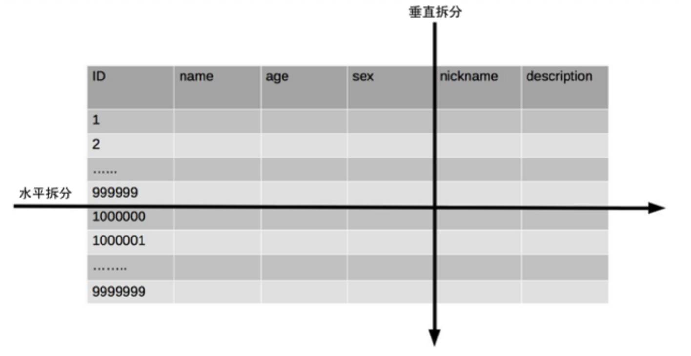
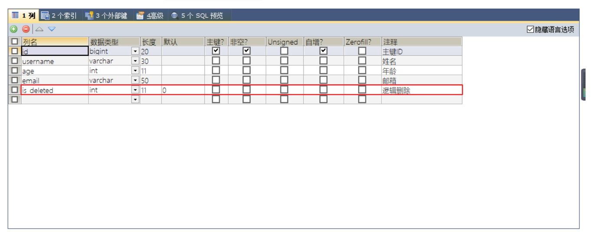
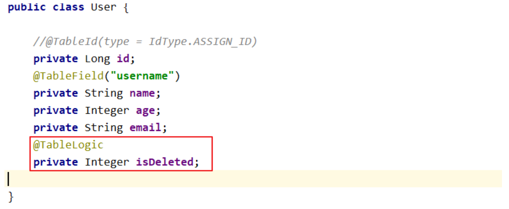

---
# 当前页面内容标题
title: 四、常用注解
# 分类
category:
  - mybatisplus
# 标签
tag: 
  - mybatisplus
  - mybatis
  - java
sticky: false
# 是否收藏在博客主题的文章列表中，当填入数字时，数字越大，排名越靠前。
star: false
# 是否将该文章添加至文章列表中
article: true
# 是否将该文章添加至时间线中
timeline: true

---


# 四、常用注解

## 1、@TableName

> 经过以上的测试，在使用MyBatis-Plus实现基本的CRUD时，我们并没有指定要操作的表，只是在Mapper接口继承BaseMapper时，设置了泛型User，而操作的表为user表
>
> 由此得出结论，MyBatis-Plus在确定操作的表时，由BaseMapper的泛型决定，即实体类型决定，且默认操作的表名和实体类型的类名一致。


### a>问题

---

> **若实体类类型的类名和要操作的表的表名不一致，会出现什么问题？**
>
> 我们将表user更名为t_user，测试查询功能
>
> 程序抛出异常，Table 'mybatis_plus.user' doesn't exist，因为现在的表名为t_user，而默认操作的表名和实体类型的类名一致，即user表


### **b>通过@TableName解决问题**

> 在实体类类型上添加@TableName("t_user")，标识实体类对应的表，即可成功执行SQL语句


### c>通过GlobalConfig解决问题

> 在开发的过程中，我们经常遇到以上的问题，即实体类所对应的表都有固定的前缀，例如t_或tbl_
>
> 此时，可以使用MyBatis-Plus提供的全局配置，为实体类所对应的表名设置默认的前缀，那么就不需要在每个实体类上通过@TableName标识实体类对应的表

```xml
<bean class="com.baomidou.mybatisplus.extension.spring.MybatisSqlSessionFactoryBean">
    <property name="configLocation" value="classpath:mybatis-config.xml"></property>
    <property name="dataSource" ref="dataSource"></property>
    <property name="typeAliasesPackage" value="com.atguigu.mp.pojo"></property> 
    <!-- 设置MyBatis-Plus的全局配置 -->
    <property name="globalConfig" ref="globalConfig"></property>
</bean> <bean id="globalConfig" class="com.baomidou.mybatisplus.core.config.GlobalConfig">
<property name="dbConfig">
    <bean class="com.baomidou.mybatisplus.core.config.GlobalConfig$DbConfig">
        <!-- 设置实体类所对应的表的前缀 -->
        <property name="tablePrefix" value="t_"></property>
    </bean>
</property>
</bean>
```


## 2、@TableId

> **经过以上的测试，MyBatis-Plus在实现CRUD时，会默认将id作为主键列，并在插入数据时，默认基于雪花算法的策略生成id**


### a>引出问题

---

> **若实体类和表中表示主键的不是id，而是其他字段，例如uid，MyBatis-Plus会自动识别uid为主键列吗？**
>
> 我们实体类中的属性id改为uid，将表中的字段id也改为uid，测试添加功能
>
> 程序抛出异常，Field 'uid' doesn't have a default value，说明MyBatis-Plus没有将uid作为主键赋值


### b>通过@TableId解决问题

---

> **在实体类中uid属性上通过`@TableId`将其标识为主键，即可成功执行SQL语句**

```java
@Date
public class User {
    @TableId
    private Long uid;
    private String name;
    private Integer age;
    private String email;
}
```


### c>@TableId的value属性

---

> 若实体类中主键对应的属性为id，而表中表示主键的字段为uid，此时若只在属性id上添加注解@TableId，则抛出异常**Unknown column 'id' in 'field list'**，即MyBatis-Plus仍然会将id作为表的主键操作，而表中表示主键的是字段uid
>
> 此时需要通过@TableId注解的value属性，指定表中的主键字段，`@TableId("uid")`或`@TableId(value="uid")`


### d>@TableId的type属性

---

> **type属性用来定义主键策略：默认雪花算法**

**常用的主键策略：**

|            值            |                             描述                             |
| :----------------------: | :----------------------------------------------------------: |
| IdType.ASSIGN_ID（默认） |   基于雪花算法的策略生成数据id，与数据库id是否设置自增无关   |
|       IdType.AUTO        | 使用数据库的自增策略，注意，该类型请确保数据库设置了id自增， |


**配置全局主键策略：**

```xml
<bean class="com.baomidou.mybatisplus.extension.spring.MybatisSqlSessionFactoryBean">
    <property name="configLocation" value="classpath:mybatis-config.xml"></property>
    <property name="dataSource" ref="dataSource"></property>
    <property name="typeAliasesPackage" value="com.atguigu.mp.pojo"></property> 
    <!-- 设置MyBatis-Plus的全局配置 -->
    <property name="globalConfig" ref="globalConfig"></property>
</bean> 
<bean id="globalConfig" class="com.baomidou.mybatisplus.core.config.GlobalConfig">
<property name="dbConfig">
    <bean class="com.baomidou.mybatisplus.core.config.GlobalConfig$DbConfig"> 
        <!-- 设置实体类所对应的表的前缀 -->
        <property name="tablePrefix" value="t_"></property> 
        <!-- 设置全局主键策略 -->
        <property name="idType" value="AUTO"></property>
    </bean>
</property>
</bean>
```

### 2.5.雪花算法

- **背景**

需要选择合适的方案去应对数据规模的增长，以应对逐渐增长的访问压力和数据量。

数据库的扩展方式主要包括：业务分库、主从复制，数据库分表。

- **数据库分表**

将不同业务数据分散存储到不同的数据库服务器，能够支撑百万甚至千万用户规模的业务，但如果业务继续发展，同一业务的单表数据也会达到单台数据库服务器的处理瓶颈。例如，淘宝的几亿用户数据，如果全部存放在一台数据库服务器的一张表中，肯定是无法满足性能要求的，此时就需要对单表数据进行拆分。

单表数据拆分有两种方式：垂直分表和水平分表。示意图如下：



- 垂直分表

垂直分表适合将表中某些不常用且占了大量空间的列拆分出去。

例如，前面示意图中的 nickname 和 description 字段，假设我们是一个婚恋网站，用户在筛选其他用户的时候，主要是用 age 和 sex 两个字段进行查询，而 nickname 和 description 两个字段主要用于展示，一般不会在业务查询中用到。description 本身又比较长，因此我们可以将这两个字段独立到另外一张表中，这样在查询 age 和 sex 时，就能带来一定的性能提升。

水平分表适合表行数特别大的表，有的公司要求单表行数超过 5000 万就必须进行分表，这个数字可以作为参考，但并不是绝对标准，关键还是要看表的访问性能。对于一些比较复杂的表，可能超过 1000万就要分表了；而对于一些简单的表，即使存储数据超过 1 亿行，也可以不分表。

但不管怎样，当看到表的数据量达到千万级别时，作为架构师就要警觉起来，因为这很可能是架构的性能瓶颈或者隐患。

水平分表相比垂直分表，会引入更多的复杂性，例如要求全局唯一的数据id该如何处理

> **主键自增**

①以最常见的用户 ID 为例，可以按照 1000000 的范围大小进行分段，1 ~ 999999 放到表 1中，

1000000 ~ 1999999 放到表2中，以此类推。

②复杂点：分段大小的选取。分段太小会导致切分后子表数量过多，增加维护复杂度；分段太大可能会导致单表依然存在性能问题，一般建议分段大小在 100 万至 2000 万之间，具体需要根据业务选取合适的分段大小。

③优点：可以随着数据的增加平滑地扩充新的表。例如，现在的用户是 100 万，如果增加到 1000 万，只需要增加新的表就可以了，原有的数据不需要动。

④缺点：分布不均匀。假如按照 1000 万来进行分表，有可能某个分段实际存储的数据量只有 1 条，而另外一个分段实际存储的数据量有 1000 万条。

> **取模**

①同样以用户 ID 为例，假如我们一开始就规划了 10 个数据库表，可以简单地用 user_id % 10 的值来表示数据所属的数据库表编号，ID 为 985 的用户放到编号为 5 的子表中，ID 为 10086 的用户放到编号为 6 的子表中。

②复杂点：初始表数量的确定。表数量太多维护比较麻烦，表数量太少又可能导致单表性能存在问题。

③优点：表分布比较均匀。

④缺点：扩充新的表很麻烦，所有数据都要重分布。

> **雪花算法**

雪花算法是由Twitter公布的分布式主键生成算法，它能够保证不同表的主键的不重复性，以及相同表的主键的有序性。

①核心思想：

长度共64bit（一个long型）。

首先是一个符号位，1bit标识，由于long基本类型在Java中是带符号的，最高位是符号位，正数是0，负数是1，所以id一般是正数，最高位是0。

41bit时间截(毫秒级)，存储的是时间截的差值（当前时间截 - 开始时间截)，结果约等于69.73年。

10bit作为机器的ID（

5个bit是数据中心，5个bit的机器ID，可以部署在1024个节点）。

12bit作为毫秒内的流水号（意味着每个节点在每毫秒可以产生 4096 个 ID）。


②优点：整体上按照时间自增排序，并且整个分布式系统内不会产生ID碰撞，并且效率较高。

## 3.@TbaleField

> 经过以上的测试，我们可以发现，MyBatis-Plus在执行SQL语句时，要保证实体类中的属性名和表中的字段名一致
>
> 如果实体类中的属性名和字段名不一致的情况，会出现什么问题呢？


### a>情况一

---

> 若实体类中的属性使用的是驼峰命名风格，而表中的字段使用的是下划线命名风格
>
> 例如实体类属性`userName`，表中字段`user_name`
>
> 此时MyBatis-Plus会自动将下划线命名风格转化为驼峰命名风格
>
> 相当于在MyBatis中配置


### b>情况二

---

> 若实体类中的属性和表中的字段不满足情况1
>
> 例如实体类属性`name`，表中字段`username`
>
> 此时需要在实体类属性上使用`@TableField("username")`设置属性所对应的字段名

```java
public class User {
  
    @TableId("uid")
    private Long id;
  
    @TableField("username")
    private String name;
  
    private Integer age;
    private String email;
}
```


## 4.@TableLogic


### a>逻辑删除

---

> 物理删除：真实删除，将对应数据从数据库中删除，之后查询不到此条被删除的数据
>
> 逻辑删除：假删除，将对应数据中代表是否被删除字段的状态修改为“被删除状态”，之后在数据库中仍旧能看到此条数据记录
>
> 使用场景：可以进行数据恢复


### b>实现逻辑删除

---

> **step1：**数据库中创建逻辑删除状态列，设置默认值为0



> **step2：**实体类中添加逻辑删除属性



> **step3**：测试
>
> 测试删除功能，真正执行的是修改
>
> UPDATE t_user SET is_deleted=1 WHERE id=? AND is_deleted=0
>
> 测试查询功能，被逻辑删除的数据默认不会被查询
>
> SELECT id,username AS name,age,email,is_deleted FROM t_user WHERE is_deleted=0


