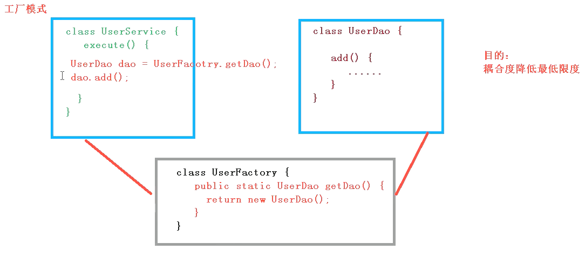
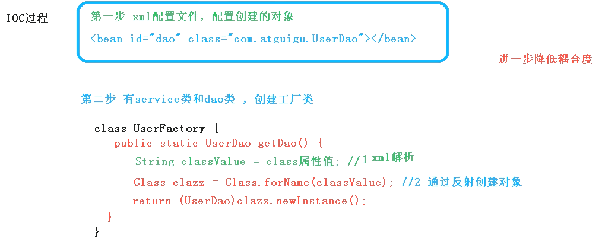
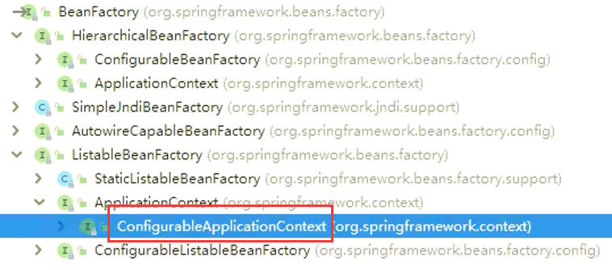
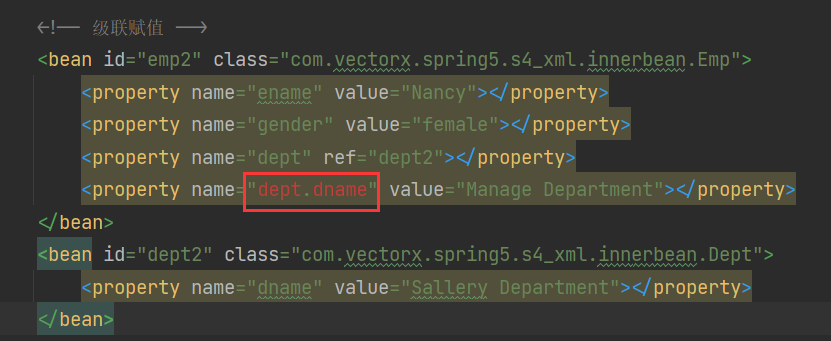

---
# 当前页面内容标题
title: IOC容器
# 分类
category:
  - spring
# 标签
tag: 
  - spring
  - SSM框架
  - IOC容器
sticky: false
# 是否收藏在博客主题的文章列表中，当填入数字时，数字越大，排名越靠前。
star: false
# 是否将该文章添加至文章列表中
article: true
# 是否将该文章添加至时间线中
timeline: true
---

# IOC 容器

## 1、IOC 的概念原理

### 1.1、IOC 是什么？

- 1）控制反转，把对象的创建和对象之间的调用过程，都交给 Spring 进行管理
- 2）使用 IOC 的目的：降低耦合性

### 1.2、IOC 底层实现

- 1）xml 解析
- 2）工厂模式
- 3）反射技术

### 1.3、图解 IOC 原理

**原始方法**

[](https://s2.loli.net/2022/02/15/tRs5qg1CokmNPTi.png)

代码示例

```java
public class UserDao {
    public void add(){
        // ...
    }
}
public class UserService {
    public void execute(){
        UserDao dao = new UserDao();
        dao.add();
    }
}
```

**工厂模式**

[](https://s2.loli.net/2022/02/15/YZSyzCNQiPM2LR6.png)

代码示例

```java
public class UserDao {
    public void add(){
        // ...
    }
}
public class UserFactory{
    public static UserDao getDao(){
        return new UserDao();
    }
}
public class UserService {
    public void execute(){
        UserDao dao = UserFactory.getDao();
        dao.add();
    }
}
```

**IOC 过程**

[](https://s2.loli.net/2022/02/15/5kRTry4CFhUDteX.png)

代码示例

```java
public class UserFactory{
	public static UserDao getDao(){
        // 1、xml解析
        String classValue = class属性值;
        // 2、通过反射创建对象
        Class clazz = Class.forName(classValue);
        return (UserDao)clazz.newInstance();
	}
}
```

## 2、IOC 接口

1）IOC 思想基于 IOC 容器完成，IOC 容器底层就是对象工厂

2）Spring 提供了IOC 容器实现的两种方式（即两个接口）

- `BeanFactory`
  - IOC 容器基本实现，是 Spring 的内部接口，不提供给开发人员使用
  - 加载配置文件时不会创建对象，使用对象时才会创建对象
- `ApplicationContext`
  - `BeanFactory`的子接口，提供更多功能，提供给开发人员使用
  - 加载配置文件就创建对象

### 2.1、ApplicationContext

`ApplicationContext`接口的实现类

[](https://s2.loli.net/2022/02/16/ivuGMy9IA18azFR.png)

- `FileSystemXmlApplicationContext`：xml 配置文件在系统盘中的文件全路径名

  ```java
  new FileSystemXmlApplicationContext("D:\workspace\NOTE_Spring\Spring5_HelloWorld\src\bean1.xml");
  ```

- `ClassPathXmlApplicationContext`：xml 配置文件在项目 src 下的相对路径名

  ```java
  new ClassPathXmlApplicationContext("bean1.xml");
  ```

### 2.2、BeanFactory

`BeanFactory`接口的子接口和实现类

[](https://s2.loli.net/2022/02/16/m9F862JWqAb5Zpc.png)

- `ConfigurableApplicationContext`：包含一些相关的扩展功能

## 3、IOC 操作 Bean 管理

### 3.1、Bean 管理是什么

Bean 管理指的是两个操作

- 1）Spring 创建对象
- 2）Spring 注入属性

```java
public class User{
    private String userName;

    public void setUserName(String userName){
        this.userName = userName;
    }
}
```

### 3.2、Bean 管理实现方式

- 1）基于 XML 配置文件方式实现
- 2）基于注解方式实现

## 4、基于 XML 方式

### 4.1、创建对象

```xml
<!--配置User对象-->
<bean id="user" class="com.vectorx.spring5.User"></bean>
```

1）在 Spring 配置文件中，使用`bean`标签，标签里添加对应属性，就可以实现对象的创建

2）`bean`标签中有很多属性，介绍常用的属性

- `id`属性：唯一标识
- `class`属性：类全限定名、类全路径
- `name`属性：了解即可，早期为`Struts`框架服务，现已“退役”，作用跟`id`属性一样
- 其他属性：后面再做介绍...

3）创建对象时，默认执行无参构造方法

如果只提供一个有参构造方法，如下

```java
public class User {
    private String userName;

    public User(String userName) {
        this.userName = userName;
    }

    // ...
}
```

仍然按照之前获取 User 对象创建方式，即

```java
// 1、加载自定义的Spring配置文件
ApplicationContext context = new ClassPathXmlApplicationContext("bean1.xml");
// 2、获取配置的User对象
User user = context.getBean("user", User.class);
```

则会报错

```java
警告: Exception encountered during context initialization - cancelling refresh attempt: org.springframework.beans.factory.BeanCreationException: Error creating bean with name 'user' defined in class path resource [bean1.xml]: Instantiation of bean failed; nested exception is org.springframework.beans.BeanInstantiationException: Failed to instantiate [com.vectorx.spring5.User]: No default constructor found; nested exception is java.lang.NoSuchMethodException: com.vectorx.spring5.User.<init>()

org.springframework.beans.factory.BeanCreationException: Error creating bean with name 'user' defined in class path resource [bean1.xml]: Instantiation of bean failed; nested exception is org.springframework.beans.BeanInstantiationException: Failed to instantiate [com.vectorx.spring5.User]: No default constructor found; nested exception is java.lang.NoSuchMethodException: com.vectorx.spring5.User.<init>()

	at org.springframework.beans.factory.support.AbstractAutowireCapableBeanFactory.instantiateBean(AbstractAutowireCapableBeanFactory.java:1334)
	at org.springframework.beans.factory.support.AbstractAutowireCapableBeanFactory.createBeanInstance(AbstractAutowireCapableBeanFactory.java:1232)
	at org.springframework.beans.factory.support.AbstractAutowireCapableBeanFactory.doCreateBean(AbstractAutowireCapableBeanFactory.java:582)
	at org.springframework.beans.factory.support.AbstractAutowireCapableBeanFactory.createBean(AbstractAutowireCapableBeanFactory.java:542)
	at org.springframework.beans.factory.support.AbstractBeanFactory.lambda$doGetBean$0(AbstractBeanFactory.java:335)
	at org.springframework.beans.factory.support.DefaultSingletonBeanRegistry.getSingleton(DefaultSingletonBeanRegistry.java:234)
	at org.springframework.beans.factory.support.AbstractBeanFactory.doGetBean(AbstractBeanFactory.java:333)
	at org.springframework.beans.factory.support.AbstractBeanFactory.getBean(AbstractBeanFactory.java:208)
	at org.springframework.beans.factory.support.DefaultListableBeanFactory.preInstantiateSingletons(DefaultListableBeanFactory.java:953)
	at org.springframework.context.support.AbstractApplicationContext.finishBeanFactoryInitialization(AbstractApplicationContext.java:918)
	at org.springframework.context.support.AbstractApplicationContext.refresh(AbstractApplicationContext.java:583)
	at org.springframework.context.support.ClassPathXmlApplicationContext.<init>(ClassPathXmlApplicationContext.java:144)
	at org.springframework.context.support.ClassPathXmlApplicationContext.<init>(ClassPathXmlApplicationContext.java:85)
	at com.vectorx.spring5.testdemo.TestSpring5.testAdd(TestSpring5.java:13)
	at sun.reflect.NativeMethodAccessorImpl.invoke0(Native Method)
	at sun.reflect.NativeMethodAccessorImpl.invoke(NativeMethodAccessorImpl.java:62)
	at sun.reflect.DelegatingMethodAccessorImpl.invoke(DelegatingMethodAccessorImpl.java:43)
	at java.lang.reflect.Method.invoke(Method.java:498)
	at org.junit.runners.model.FrameworkMethod$1.runReflectiveCall(FrameworkMethod.java:59)
	at org.junit.internal.runners.model.ReflectiveCallable.run(ReflectiveCallable.java:12)
	at org.junit.runners.model.FrameworkMethod.invokeExplosively(FrameworkMethod.java:56)
	at org.junit.internal.runners.statements.InvokeMethod.evaluate(InvokeMethod.java:17)
	at org.junit.runners.ParentRunner$3.evaluate(ParentRunner.java:306)
	at org.junit.runners.BlockJUnit4ClassRunner$1.evaluate(BlockJUnit4ClassRunner.java:100)
	at org.junit.runners.ParentRunner.runLeaf(ParentRunner.java:366)
	at org.junit.runners.BlockJUnit4ClassRunner.runChild(BlockJUnit4ClassRunner.java:103)
	at org.junit.runners.BlockJUnit4ClassRunner.runChild(BlockJUnit4ClassRunner.java:63)
	at org.junit.runners.ParentRunner$4.run(ParentRunner.java:331)
	at org.junit.runners.ParentRunner$1.schedule(ParentRunner.java:79)
	at org.junit.runners.ParentRunner.runChildren(ParentRunner.java:329)
	at org.junit.runners.ParentRunner.access$100(ParentRunner.java:66)
	at org.junit.runners.ParentRunner$2.evaluate(ParentRunner.java:293)
	at org.junit.runners.ParentRunner$3.evaluate(ParentRunner.java:306)
	at org.junit.runners.ParentRunner.run(ParentRunner.java:413)
	at org.junit.runner.JUnitCore.run(JUnitCore.java:137)
	at com.intellij.junit4.JUnit4IdeaTestRunner.startRunnerWithArgs(JUnit4IdeaTestRunner.java:69)
	at com.intellij.rt.junit.IdeaTestRunner$Repeater.startRunnerWithArgs(IdeaTestRunner.java:33)
	at com.intellij.rt.junit.JUnitStarter.prepareStreamsAndStart(JUnitStarter.java:221)
	at com.intellij.rt.junit.JUnitStarter.main(JUnitStarter.java:54)
Caused by: org.springframework.beans.BeanInstantiationException: Failed to instantiate [com.vectorx.spring5.User]: No default constructor found; nested exception is java.lang.NoSuchMethodException: com.vectorx.spring5.User.<init>()
	at org.springframework.beans.factory.support.SimpleInstantiationStrategy.instantiate(SimpleInstantiationStrategy.java:83)
	at org.springframework.beans.factory.support.AbstractAutowireCapableBeanFactory.instantiateBean(AbstractAutowireCapableBeanFactory.java:1326)
	... 38 more
Caused by: java.lang.NoSuchMethodException: com.vectorx.spring5.User.<init>()
	at java.lang.Class.getConstructor0(Class.java:3082)
	at java.lang.Class.getDeclaredConstructor(Class.java:2178)
	at org.springframework.beans.factory.support.SimpleInstantiationStrategy.instantiate(SimpleInstantiationStrategy.java:78)
	... 39 more
```

其中主要报错信息

```java
Failed to instantiate [com.vectorx.spring5.User]: No default constructor found
...
Caused by: java.lang.NoSuchMethodException: com.vectorx.spring5.User.<init>()
```

就是说：初始化 User 对象失败，因为没有找到默认构造，所以抛出了一个`NoSuchMethodException`异常，即 User 中没有`<init>()`方法

### 4.2、注入属性

`DI`：依赖注入，就是注入属性（但需要在创建对象基础上进行）

`IOC`和`DI`的区别：`DI`是`IOC`的一种具体实现

两种注入方式：Setter 方式、有参构造方法

- 第一种注入方式：通过 Setter 方式进行注入

  ```java
  public class Book{
      private String bname;
      
      // Setter 方法注入
      public void setBname(String bname){
          this.bname = bname;
      }
      
      public static void main(String[] args){
          Book book = new Book();
          book.setBname("book1");
      }
  }
  ```

- 第二种注入方式：通过有参构造方法进行注入

  ```java
  public class Book{
      private String bname;
      
      // 有参构造注入
      public Book(String bname){
          this.bname = bname;
      }
      
      public static void main(String[] args){
          Book book = new Book("book1");
      }
  }
  ```

#### 1）通过 Setter 方式注入

① 创建类，定义属性和 Setter 方法

```java
public class Book {
    private String bname;
    private String bauthor;

    public void setBname(String bname) {
        this.bname = bname;
    }
    public void setBauthor(String bauthor) {
        this.bauthor = bauthor;
    }
}
```

② 在 Spring 配置文件中配置对象创建，配置属性注入

```xml
<!-- 2、Setter方法注入属性 -->
<bean id="book" class="com.vectorx.spring5.s1_xml.setter.Book">
    <!-- 使用property完成属性注入
            name: 类中属性名称
            value: 向属性中注入的值
    -->
    <property name="bname" value="Spring实战 第5版"></property>
    <property name="bauthor" value="克雷格·沃斯（Craig Walls）"></property>
</bean>
```

#### 2）通过有参构造注入

① 创建类，定义属性，创建属性对应有参构造方法

```java
public class Orders {
    private String oname;
    private String address;

    public Orders(String oname, String address) {
        this.oname = oname;
        this.address = address;
    }
}
```

② 在 Spring 配置文件中配置对象创建，配置有参构造注入

```xml
<!-- 3、有参构造注入属性 -->
<bean id="order" class="com.vectorx.spring5.s2_xml.constructor.Orders">
    <constructor-arg name="oname" value="Spring微服务实战"></constructor-arg>
    <constructor-arg name="address" value="[美]约翰·卡内尔（John Carnell）"></constructor-arg>
</bean>
```

或者使用`index`属性代替`name`属性，索引值大小是几就表示有参构造中的第几个参数（索引从0开始）

```xml
<!-- 3、有参构造注入属性 -->
<bean id="order" class="com.vectorx.spring5.s2_xml.constructor.Orders">
    <constructor-arg index="0" value="冰墩墩"></constructor-arg>
    <constructor-arg index="1" value="Peking"></constructor-arg>
</bean>
```

#### 3）p 名称空间注入（了解）

① 基于 p 名称空间注入，可以简化基于 xml 的配置方式

在`bean1.xml`配置文件中添加 p 名称空间：`xmlns:p="http://www.springframework.org/schema/p"`，如下

```xml
<beans xmlns="http://www.springframework.org/schema/beans"
       xmlns:xsi="http://www.w3.org/2001/XMLSchema-instance"
       xmlns:p="http://www.springframework.org/schema/p"
       xsi:schemaLocation="http://www.springframework.org/schema/beans http://www.springframework.org/schema/beans/spring-beans.xsd">
</beans>
```

在`bean`标签中进行属性注入操作

```xml
<!-- 4、p名称空间注入属性 -->
<bean id="book1" class="com.vectorx.spring5.s1_xml.setter.Book" p:bname="SpringBoot实战" p:bauthor="[美]克雷格·沃斯"></bean>
```

需要注意的是：p 名称空间只能进行属性注入

### 4.3、注入其他类型属性

#### 1）字面量

- `null`值：使用`<null>`

  ```xml
  <bean id="book2" class="com.vectorx.spring5.s1_xml.setter.Book">
      <property name="bname" value="Spring实战 第5版"></property>
      <property name="bauthor">
          <null></null>
      </property>
  </bean>
  ```

- 属性值包含特殊符号：有两种方式

  - 使用转义字符，如`<>`标识`<>`

    ```xml
    <!-- 字面量：property方式注入含有特殊符号的属性 -->
    <bean id="book3" class="com.vectorx.spring5.s1_xml.setter.Book">
        <property name="bname" value="Spring实战 第5版"></property>
        <property name="bauthor" value="&lt;Test&gt;"</property>
    </bean>
    ```

  - 使用`CDATA`结构，如`<![CDATA[<Test>]]>`

    ```xml
    <!-- 字面量：property方式注入含有特殊符号的属性 -->
    <bean id="book4" class="com.vectorx.spring5.s1_xml.setter.Book">
        <property name="bname" value="Spring实战 第5版"></property>
        <property name="bauthor">
            <value><![CDATA[<Test>]]></value>
        </property>
    </bean>
    ```

#### 2）外部 Bean

① 创建两个类：`Service`类和`Dao`类

```java
public interface UserDao {
    void update();
}
public class UserDaoImpl implements UserDao{
    @Override
    public void update() {
        System.out.println("dao update...");
    }
}
```

② 在`Service`中调用`Dao`中的方法

```java
public class UserService {
    private UserDao userDao;

    public void setUserDao(UserDao userDao) {
        this.userDao = userDao;
    }

    public void updateUser(){
        System.out.println("service update...");
        userDao.update();
    }
}
```

③ 在 Spring 配置文件中进行配置

```java
<!--  1、配置service和dao创建  -->
<bean id="userService" class="com.vectorx.spring5.s3_xml.outerbean.service.UserService">
    <!-- 2、注入userDao对象
               name属性：类里面属性名称
               ref属性：创建userDao对象bean标签id值
       -->
    <property name="userDao" ref="userDaoImpl"></property>
</bean>
<bean id="userDaoImpl" class="com.vectorx.spring5.s3_xml.outerbean.dao.UserDaoImpl"></bean>
```

#### 3）内部 Bean

① 一对多关系：部门和员工。部门里有多个员工，一个员工属于一个部门。部门是一的一方，员工是多的一方

② 在实体类之间表示一对多关系。在员工类中使用对象类型表示所属部门

```java
public class Dept {
    private String dname;
    
    public String getDname() {
        return dname;
    }
    public void setDname(String dname) {
        this.dname = dname;
	}
}
public class Emp {
    private String ename;
    private String gender;
    private Dept dept;

    public void setDept(Dept dept) {
        this.dept = dept;
    }
    public String getEname() {
        return ename;
    }
    public void setEname(String ename) {
        this.ename = ename;
    }
    public String getGender() {
        return gender;
    }
    public void setGender(String gender) {
        this.gender = gender;
    }
}
```

③ 在 Spring 配置文件中进行配置

```xml
<bean id="emp1" class="com.vectorx.spring5.s4_xml.innerbean.Emp">
    <property name="ename" value="Lucy"></property>
    <property name="gender" value="female"></property>
    <property name="dept">
        <bean id="dept1" class="com.vectorx.spring5.s4_xml.innerbean.Dept">
            <property name="dname" value="Develop Department"></property>
        </bean>
    </property>
</bean>
```

#### 4）级联赋值

第一种写法

```xml
<!-- 级联赋值 -->
<bean id="emp2" class="com.vectorx.spring5.s4_xml.innerbean.Emp">
    <property name="ename" value="Nancy"></property>
    <property name="gender" value="female"></property>
    <property name="dept" ref="dept2"></property>
</bean>
<bean id="dept2" class="com.vectorx.spring5.s4_xml.innerbean.Dept">
    <property name="dname" value="Sallery Department"></property>
</bean>
```

第二种写法`<property name="dept.dname" value="Manage Department"></property>`

```xml
<!-- 级联赋值 -->
<bean id="emp2" class="com.vectorx.spring5.s4_xml.innerbean.Emp">
    <property name="ename" value="Nancy"></property>
    <property name="gender" value="female"></property>
    <property name="dept" ref="dept2"></property>
    <property name="dept.dname" value="Manage Department"></property>
</bean>
<bean id="dept2" class="com.vectorx.spring5.s4_xml.innerbean.Dept">
    <property name="dname" value="Sallery Department"></property>
</bean>
```

这种写法可以对外部`Bean`的属性值进行覆盖，但前提是要有`dept`的`Getter`方法

```java
public Dept getDept() {
    return dept;
}
```

否则 XML 文件就会爆红

[](https://s2.loli.net/2022/02/27/9VnbcAFEGeBwIqi.png)

强行使用就会报如下错误

```java
Caused by: org.springframework.beans.NotWritablePropertyException: Invalid property 'dept.dname' of bean class [com.vectorx.spring5.s4_xml.innerbean.Emp]: Nested property in path 'dept.dname' does not exist; nested exception is org.springframework.beans.NotReadablePropertyException: Invalid property 'dept' of bean class [com.vectorx.spring5.s4_xml.innerbean.Emp]: Bean property 'dept' is not readable or has an invalid getter method: Does the return type of the getter match the parameter type of the setter?
```

### 4.4、注入集合属性

- 1）注入数组类型属性
- 2）注入 List 集合类型属性
- 3）注入 Map 集合类型属性

① 创建类，定义数组、list、map、set 类型属性，生成对应 setter 方法

```java
public class Stu {
    private String[] arrs;
    private List<String> lists;
    private Map<String, String> maps;
    private Set<String> sets;
    public void setArrs(String[] arrs){
        this.arrs = arrs;
    }
    public void setLists(List<String> lists){
        this.lists = lists;
    }
    public void setMaps(Map<String, String> maps){
        this.maps = maps;
    }
    public void setSets(Set<String> sets){
        this.sets = sets;
    }
}
```

② 在 Spring 配置文件中进行配置

```xml
<!-- 集合类型属性注入 -->
<bean id="stu" class="com.vectorx.spring5.s5_xml.collection.Stu">
    <!--  1 数组属性注入  -->
    <property name="arrs">
        <array>
            <value>数组</value>
            <value>属性</value>
            <value>注入</value>
        </array>
    </property>
    <!--  2 list属性注入  -->
    <property name="lists">
        <list>
            <value>list</value>
            <value>属性</value>
            <value>注入</value>
        </list>
    </property>
    <!--  3 map属性注入  -->
    <property name="maps">
        <map>
            <entry key="k1" value="v1"></entry>
            <entry key="k2" value="v2"></entry>
            <entry key="k3" value="v3"></entry>
        </map>
    </property>
    <!--  4 set属性注入  -->
    <property name="sets">
        <set>
            <value>set</value>
            <value>属性</value>
            <value>注入</value>
        </set>
    </property>
</bean>
```

- 4）注入 List 类型属性值，值为对象

```xml
<bean id="stu" class="com.vectorx.spring5.s5_xml.collection.Stu">
    <!--注入 List 类型属性值，值为对象-->
    <property name="lists2">
        <list>
            <ref bean="course1"></ref>
            <ref bean="course2"></ref>
            <ref bean="course3"></ref>
        </list>
    </property>
</bean>
<bean id="course1" class="com.vectorx.spring5.s5_xml.collection.Course">
    <property name="cname" value="c1"></property>
</bean>
<bean id="course2" class="com.vectorx.spring5.s5_xml.collection.Course">
    <property name="cname" value="c2"></property>
</bean>
<bean id="course3" class="com.vectorx.spring5.s5_xml.collection.Course">
    <property name="cname" value="c3"></property>
</bean>
```

- 5）把集合注入部分提取出来

① 在 Spring 配置文件中引入`util`命名空间

```xml
<beans xmlns="http://www.springframework.org/schema/beans"
       xmlns:xsi="http://www.w3.org/2001/XMLSchema-instance"
       xmlns:util="http://www.springframework.org/schema/util"
       xsi:schemaLocation="
       http://www.springframework.org/schema/beans http://www.springframework.org/schema/beans/spring-beans.xsd
       http://www.springframework.org/schema/util http://www.springframework.org/schema/util/spring-util.xsd">
</beans>
```

② 使用`util`标签完成 list 集合注入提取

```xml
<!--提取属性注入-->
<util:list id="utilList">
    <value>111</value>
    <value>222</value>
    <value>333</value>
</util:list>
<!--提取属性注入使用-->
<bean id="stu2" class="com.vectorx.spring5.s5_xml.collection.Stu">
    <property name="lists" ref="utilList"></property>
</bean>
```

### 4.5、自动装配

自动装配：根据指定装配规则（属性名称或属性类型），Spring 自动将匹配的属性值进行注入

XML 实现自动装配：`bean`标签中有个属性`autowire`，里面有两个常用的属性值

- `byName`根据属性名称注入，要求注入值`bean`的`id`值和类中属性名称一致
- `byType`根据属性类型注入，要求注入值`bean`的类型在配置文件中只存在一份

1）根据属性名称进行自动注入

```xml
<bean id="emp" class="com.vectorx.spring5.s9_xml.autowire.Emp" autowire="byName"></bean>
<bean id="dept" class="com.vectorx.spring5.s9_xml.autowire.Dept"></bean>
```

2）根据属性类型进行自动注入

```xml
<bean id="emp" class="com.vectorx.spring5.s9_xml.autowire.Emp" autowire="byType"></bean>
<bean id="dept" class="com.vectorx.spring5.s9_xml.autowire.Dept"></bean>
```

### 4.6、外部属性文件

1、直接配置数据库信息

- 1）引入`Druid`连接池依赖`jar`包
- 2）配置`Druid`连接池

```xml
<bean id="dataSource" class="com.alibaba.druid.pool.DruidDataSource">
    <property name="driverClassName" value="com.mysql.jdbc.Driver"></property>
    <property name="url" value="jdbc:mysql://localhost:3306"></property>
    <property name="username" value="root"></property>
    <property name="password" value="root"></property>
</bean>
```

2、引入外部属性文件配置数据库连接池

- 1）创建`properties`格式的外部属性文件，配置数据库连接信息

  ```properties
  mysql.driverClassName=com.mysql.jdbc.Driver
  mysql.url=jdbc:mysql://localhost:3306
  mysql.username=root
  mysql.password=root
  ```

- 2）将外部`properties`属性文件引入到 Spring 配置文件中

```xml
<!--引入context名称空间-->
<beans xmlns="http://www.springframework.org/schema/beans"
       xmlns:xsi="http://www.w3.org/2001/XMLSchema-instance"
       xmlns:context="http://www.springframework.org/schema/context"
       xsi:schemaLocation="
                           http://www.springframework.org/schema/beans 
                           http://www.springframework.org/schema/beans/spring-beans.xsd
                           http://www.springframework.org/schema/context
                           http://www.springframework.org/schema/context/spring-context.xsd">
    <!--引入外部属性文件-->
    <context:property-placeholder location="classpath:jdbc.properties"/>
    <!--使用Spring表达式配置连接池-->
    <bean id="dataSource" class="com.alibaba.druid.pool.DruidDataSource">
        <property name="driverClassName" value="${mysql.driverClassName}"></property>
        <property name="url" value="${mysql.url}"></property>
        <property name="username" value="${mysql.username}"></property>
        <property name="password" value="${mysql.password}"></property>
    </bean>
</beans>
```

## 5、FactoryBean

Spring 有两种类型 Bean，一种是普通 Bean，另外一种是工厂 Bean（FactoryBean）

- 普通 Bean：在配置文件中定义的 Bean 类型就是返回类型
- 工厂 Bean：在配置文件中定义的 Bean 类型可以和返回类型不一致

上述的例子都是普通 Bean 的类型，那么工厂 Bean 该怎么实现呢？

- 1）创建类，实现 FactoryBean 接口，使其作为一个工厂 Bean
- 2）实现接口中的方法，在实现方法中定义返回的 Bean 类型

```java
public class MyFactoryBean implements FactoryBean<Course> {
    @Override
    public Course getObject() throws Exception {
        Course course = new Course();
        course.setCname("CourseName");
        return course;
    }

    @Override
    public Class<?> getObjectType() {
        return null;
    }
}
```

- 3）在 Spring 配置文件中进行配置

```xml
<bean id="myFactoryBean" class="com.vectorx.spring5.s6_xml.factorybean.MyFactoryBean"></bean>
```

由于是 FactoryBean，所以再通过上下文获取时，需要使用实现 FactoryBean 时传入的泛型类型进行接收

```java
ApplicationContext applicationContext = new ClassPathXmlApplicationContext("bean5.xml");
Course course = applicationContext.getBean("myFactoryBean", Course.class);
```

如果仍然使用配置文件中定义的 Bean 类型，则会报错

```java
Exception in thread "main" org.springframework.beans.factory.BeanNotOfRequiredTypeException: Bean named 'myFactoryBean' is expected to be of type 'com.vectorx.spring5.s6_xml.factorybean.MyFactoryBean' but was actually of type 'com.vectorx.spring5.s6_xml.factorybean.Course'
	at org.springframework.beans.factory.support.AbstractBeanFactory.adaptBeanInstance(AbstractBeanFactory.java:417)
	at org.springframework.beans.factory.support.AbstractBeanFactory.doGetBean(AbstractBeanFactory.java:398)
	at org.springframework.beans.factory.support.AbstractBeanFactory.getBean(AbstractBeanFactory.java:213)
	at org.springframework.context.support.AbstractApplicationContext.getBean(AbstractApplicationContext.java:1160)
	at com.vectorx.spring5.s6_xml.factorybean.TestFactoryBean.main(TestFactoryBean.java:11)
```

## 6、Bean 作用域和生命周期

### 6.1、Bean 作用域

在 Spring 里面，可以设置创建 Bean 的实例是单实例还是多实例，默认情况下是单实例

```xml
<bean id="book" class="com.vectorx.spring5.s7_xml.setter.Book"></bean>
```

测试

```xml
ApplicationContext context = new ClassPathXmlApplicationContext("bean6.xml");
Book book1 = context.getBean("book", Book.class);
Book book2 = context.getBean("book", Book.class);
System.out.println(book1 == book2); // true 表示是同一个对象，证明默认情况下是单实例
```

**如何设置单实例多实例？**

在 Spring 配置文件中 bean 标签里`scope`属性用于设置单实例还是多实例

- 1）`singleton`，单实例，默认情况下不写也是它
- 2）`prototype`，多实例

```xml
<bean id="book2" class="com.vectorx.spring5.s7_xml.setter.Book" scope="prototype"></bean>
```

测试

```java
Book book3 = context.getBean("book2", Book.class);
Book book4 = context.getBean("book2", Book.class);
System.out.println(book3 == book4); // false 表示不是同一个对象，证明scope为prototype时是多实例
```

**`singleton`和`prototype`的区别**

`singleton`和`prototype`除了单实例和多实例的差别之外，还有以下区别

- 1）设置`scope`值是`singleton`时，加载 Spring 配置文件时就会创建单实例对象
- 2）设置`scope`值是`prototype`时，加载 Spring 配置文件时不会创建对象，而是在调用`getBean`方法时创建多实例对象

**`scope`的其他值**

`scope`的属性值除了`singleton`和`prototype`之外，其实还有一些属性值，如

- `request`，每个`request`创建一个新的 bean
- `session`，同一`session`中的 bean 是一样的

不过这两个属性值使用非常少，了解即可

### 6.2、Bean 生命周期

生命周期：从对象创建到对象销毁的过程

Bean 生命周期

- 1）通过构造器创建 Bean 实例（无参构造）
- 2）为 Bean 属性设置值和对其他 Bean 引用（调用 setter 方法）
- 3）调用 Bean 的初始化方法（需要进行配置初始化方法）
- 4）Bean 就可以使用了（对象获取到了）
- 5）当容器关闭时，调用 Bean 的销毁方法（需要进行配置销毁方法）

代码演示

```java
public class Orders {
    public Orders() {
        System.out.println("Step1.执行无参构造创建Bean实例.");
    }

    private String oname;

    public void setOname(String oname) {
        this.oname = oname;
        System.out.println("Step2.通过setter方法设置属性值.");
    }

    public void initMethod(){
        System.out.println("Step3.执行初始化方法.");
    }

    public void destoryMethod(){
        System.out.println("Step5.执行销毁方法.");
    }
}
```

Spring 配置文件中的配置

```xml
<bean id="orders" class="com.vectorx.spring5.s8_xml.lifecycle.Orders" init-method="initMethod"
      destroy-method="destoryMethod">
    <property name="oname" value="Phone"></property>
</bean>
```

测试

```java
ClassPathXmlApplicationContext context = new ClassPathXmlApplicationContext("bean7.xml");
Orders orders = context.getBean("orders", Orders.class);
System.out.println("Step4.获取创建Bean实例对象.");
System.out.println(orders);
// 手动销毁Bean实例
context.close();
```

执行结果

```
Step1.执行无参构造创建Bean实例.
Step2.通过setter方法设置属性值.
Step3.执行初始化方法.
Step4.获取创建Bean实例对象.
com.vectorx.spring5.s8_xml.lifecycle.Orders@210366b4
Step5.执行销毁方法.
```

Spring 中 Bean 更加完整的生命周期其实不止上述 5 步，另外还有 2 步操作叫做 Bean 的后置处理器

**Bean 后置处理器**

加上 Bean 后置处理器，Bean 生命周期如下

- 1）通过构造器创建 Bean 实例（无参构造）
- 2）为 Bean 属性设置值和对其他 Bean 引用（调用 setter 方法）
- 3）把 Bean 的实例传递给 Bean 后置处理器的`postProcessBeforeInitialization`方法
- 4）调用 Bean 的初始化方法（需要进行配置初始化方法）
- 5）把 Bean 的实例传递给 Bean 后置处理器的`postProcessAfterInitialization`方法
- 6）Bean 就可以使用了（对象获取到了）
- 7）当容器关闭时，调用 Bean 的销毁方法（需要进行配置销毁方法）

代码演示

- 1）创建类，实现接口`BeanPostProcessor`，创建后置处理器

```java
public class MyBeanPost implements BeanPostProcessor {
    @Override
    public Object postProcessBeforeInitialization(Object bean, String beanName) throws BeansException {
        System.out.println("Step.初始化之前执行的方法");
        return BeanPostProcessor.super.postProcessBeforeInitialization(bean, beanName);
    }

    @Override
    public Object postProcessAfterInitialization(Object bean, String beanName) throws BeansException {
        System.out.println("Step.初始化之后执行的方法");
        return BeanPostProcessor.super.postProcessAfterInitialization(bean, beanName);
    }
}
```

- 2）Spring 配置文件中配置后置处理器

```xml
<!--配置后置处理器，会为当前配置文件中所有bean添加后置处理器-->
<bean id="myBeanPost" class="com.vectorx.spring5.s8_xml.lifecycle.MyBeanPost"></bean>
```

执行结果

```
Step1.执行无参构造创建Bean实例.
Step2.通过setter方法设置属性值.
Step.初始化之前执行的方法
Step3.执行初始化方法.
Step.初始化之后执行的方法
Step4.获取创建Bean实例对象.
com.vectorx.spring5.s8_xml.lifecycle.Orders@74e52ef6
Step5.执行销毁方法.
```

## 7、注解方式

### 7.1、什么是注解

- 注解是一种代码特殊标记，格式：`@注解名称(属性名称=属性值,属性名称=属性值...)`
- 注解作用：在类上面，方法上面，属性上面
- 注解目的：简化 XML 配置

### 7.2、创建对象

- `@Component`
- `@Service`
- `@Controller`
- `@Repository`

上面四个注解功能是一样的，都可以用来创建 Bean 实例

- 1）引入依赖

[](https://s2.loli.net/2022/03/03/Q4uYsdUGJBoRkwi.png)

- 2）开启组件扫描

```xml
<?xml version="1.0" encoding="UTF-8"?>
<!--引入context名称空间-->
<beans xmlns="http://www.springframework.org/schema/beans"
       xmlns:xsi="http://www.w3.org/2001/XMLSchema-instance"
       xmlns:context="http://www.springframework.org/schema/context"
       xsi:schemaLocation="http://www.springframework.org/schema/beans http://www.springframework.org/schema/beans/spring-beans.xsd
                           http://www.springframework.org/schema/context http://www.springframework.org/schema/context/spring-context.xsd">
    <!--开启组件扫描:
        多个包用逗号隔开-->
    <context:component-scan
                            base-package="com.vectorx.spring5.s11_annotation.dao,com.vectorx.spring5.s11_annotation.service"></context:component-scan>
</beans>
```

- 3）创建类，在类上添加创建对象注解

```java
/**
 * value可省略，默认值为类名首字母小写
 */
@Component(value = "userService")
public class UserService {
    public void add(){
        System.out.println("UserService add...");
    }
}
```

### 7.3、组件扫描配置

#### 设置扫描

- `use-default-filters`表示现在不使用默认`filter`，自己配置`filter`
- `include-filter`设置扫描哪些内容

```xml
<context:component-scan
                        base-package="com.vectorx.spring5.s11_annotation" use-default-filters="false">
    <context:include-filter type="annotation" expression="org.springframework.stereotype.Controller"/>
</context:component-scan>
```

#### 设置不扫描

- 配置扫描包下所有内容
- `exclude-filter`设置不扫描哪些内容

```xml
<context:component-scan
                        base-package="com.vectorx.spring5.s11_annotation">
    <context:exclude-filter type="annotation" expression="org.springframework.stereotype.Controller"/>
</context:component-scan>
```

### 7.4、属性注入

- `@Autowired`根据属性类型进行自动装配
- `@Qualifier`根据属性名称进行注入，需要和`@Autowired`一起使用
- `@Resource`可以根据类型和名称注入
- `@Value`根据普通类型注入

#### @Autowired

- 1）创建 Service 和 Dao 对象，在 Service 和 Dao 类上添加创建对象注解

```java
public interface UserDao {
    void add();
}
@Repository
public class UserDaoImpl implements UserDao{
    @Override
    public void add() {
        System.out.println("UserDaoImpl add...");
    }
}
@Service
public class UserService {
    public void add() {
        System.out.println("UserService add...");
    }
}
```

- 2）在 Service 类中添加 Dao 类型属性，在属性上面使用注解注入 Dao 对象

```java
@Service
public class UserService {

    @Autowired
    private UserDao userDao;

    public void add() {
        System.out.println("UserService add...");
        userDao.add();
    }
}
```

因为`@Autowired`是根据属性类型进行注入的，如果 UserDao 的实现类不止一个，比如新增一个 UserDaoImpl2 类

```java
@Repository
public class UserDaoImpl2 implements UserDao {
    @Override
    public void add() {
        System.out.println("UserDaoImpl2 add...");
    }
}
```

那么此时测试程序就会报错

```java
Exception in thread "main" org.springframework.beans.factory.UnsatisfiedDependencyException: Error creating bean with name 'userService': Unsatisfied dependency expressed through field 'userDao'; nested exception is org.springframework.beans.factory.NoUniqueBeanDefinitionException: No qualifying bean of type 'com.vectorx.spring5.s11_annotation.dao.UserDao' available: expected single matching bean but found 2: userDaoImpl,userDaoImpl2
...
Caused by: org.springframework.beans.factory.NoUniqueBeanDefinitionException: No qualifying bean of type 'com.vectorx.spring5.s11_annotation.dao.UserDao' available: expected single matching bean but found 2: userDaoImpl,userDaoImpl2
...
```

大概意思就是说，主程序抛出了一个`UnsatisfiedDependencyException`即*不满足依赖异常*，嵌套异常是`NoUniqueBeanDefinitionException`即*Bean定义不唯一异常*，预期匹配单个 Bean 但是找到了两个 Bean

此时想要指定装配某一个实现类，就需要用到`@Qualifier`注解

#### @Qualifier

书接上回，如果我们想要从多个实现类中装配具体某一个实现类，可以这么写

```java
@Autowired
@Qualifier(value = "userDaoImpl")
private UserDao userDao;
```

其中`value`值为具体的实现类上配置的注解中`value`值

```java
@Repository
public class UserDaoImpl implements UserDao{
    @Override
    public void add() {
        System.out.println("UserDaoImpl add...");
    }
}
@Repository
public class UserDaoImpl2 implements UserDao {
    @Override
    public void add() {
        System.out.println("UserDaoImpl2 add...");
    }
}
```

由于上述例子中，我们没有对`@Repository`配置相应的`value`，所以默认为*首字母小写的类名*

如果想使用 UserDaoImpl2 类，则

```java
@Autowired
@Qualifier(value = "userDaoImpl2")
private UserDao userDao;
```

如果指定名称有误，即不存在名称为`value`对应的类，则会报`NoSuchBeanDefinitionException`异常，即找不到对应类

```java
Exception in thread "main" org.springframework.beans.factory.UnsatisfiedDependencyException: Error creating bean with name 'userService': Unsatisfied dependency expressed through field 'userDao'; nested exception is org.springframework.beans.factory.NoSuchBeanDefinitionException: No qualifying bean of type 'com.vectorx.spring5.s11_annotation.dao.UserDao' available: expected at least 1 bean which qualifies as autowire candidate. Dependency annotations: {@org.springframework.beans.factory.annotation.Autowired(required=true), @org.springframework.beans.factory.annotation.Qualifier(value=userDaoImpl1)}
...
Caused by: org.springframework.beans.factory.NoSuchBeanDefinitionException: No qualifying bean of type 'com.vectorx.spring5.s11_annotation.dao.UserDao' available: expected at least 1 bean which qualifies as autowire candidate. Dependency annotations: {@org.springframework.beans.factory.annotation.Autowired(required=true), @org.springframework.beans.factory.annotation.Qualifier(value=userDaoImpl1)}
```

#### [@resource]()

- 根据类型注入

```java
@Resource
private UserDao userDao;
```

- 根据名称注入

```java
@Resource(name = "userDaoImpl")
private UserDao userDao;
```

需要注意的是`@Resource`注解所在包为`javax.annotation`即 Java 扩展包，所以 Spring 官方不建议使用该注解而推崇`@Autowired`和`@Qualifier`注解

#### @Value

上述注解都是对对象类型的属性进行注入，如果想要装配普通类型属性，如基本数据类型及其包装类等，则可以需要使用`@Value`注解

```java
@Value(value = "vector")
private String name;
@Value(value = "100")
private Integer age;
@Value(value = "200.0d")
private Double length;
@Value(value = "true")
private boolean isOk;
@Value(value = "0,a,3,6,test")
private String[] arrs;
```

### 7.5、完全注解开发

- 1）创建配置类，替代 XML 配置文件

```java
@Configuration
@ComponentScan(basePackages = "com.vectorx.spring5.s11_annotation")
public class SpringConfig {
}
```

- 2）编写测试类

```java
ApplicationContext context = new AnnotationConfigApplicationContext(SpringConfig.class);
UserService userService = context.getBean("userService", UserService.class);
userService.add();
```

与之前的不同点就是用`AnnotationConfigApplicationContext`代替了`ClassPathXmlApplicationContext`对象

