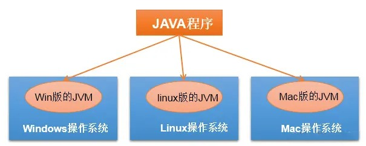
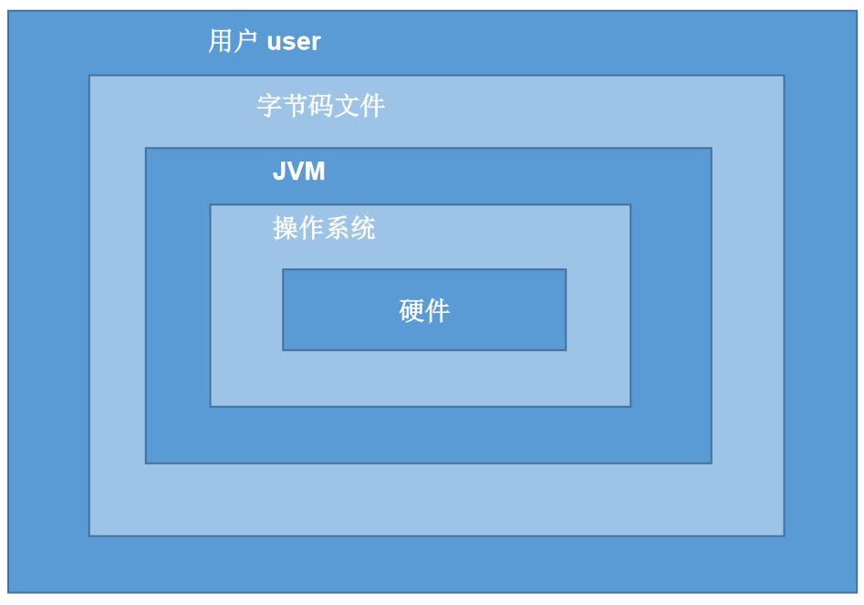
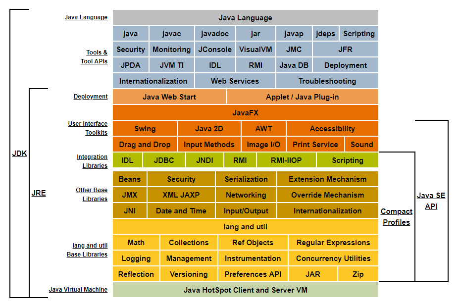
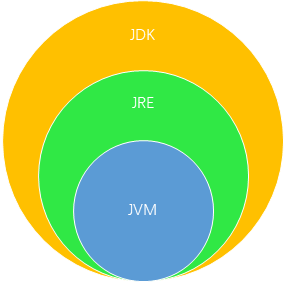
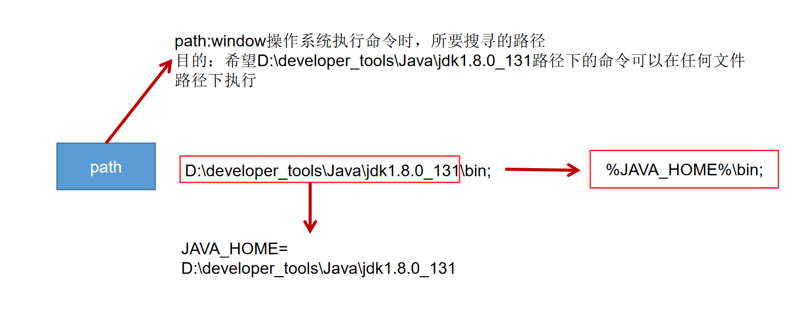
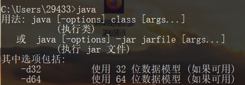
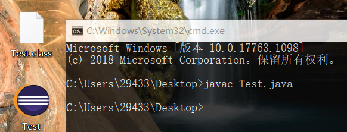
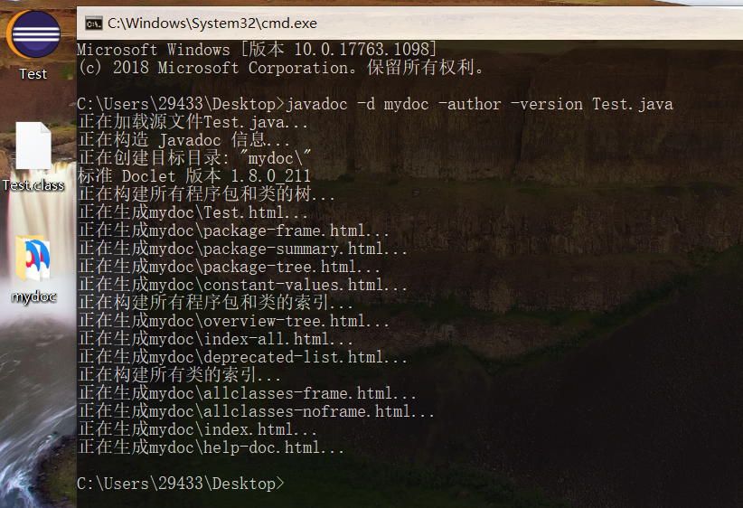

---
# 当前页面内容标题
title: 01、JavaSE_Java语言概述
# 分类
category:
  - Java
# 标签
tag:
  - Java
sticky: false
# 是否收藏在博客主题的文章列表中，当填入数字时，数字越大，排名越靠前。
star: false
# 是否将该文章添加至文章列表中
article: false
# 是否将该文章添加至时间线中
timeline: true
---

## 01、 软件开发介绍

- 软件开发软件，即一系列按照特定顺序组织的计算机数据和指令的集合。**软件有系统软件和应用软件之分**。
- 人机交互方式
  - 图形化界面(Graphical User Interface GUI)这种方式简单直观，使用者易于接受，容易上手操作。
  - 命令行方式(Command Line InterfaceCLI)：需要有一个控制台，输入特定的指令，让计算机完成一些操作。较为麻烦，需要记录住一些命令。

> **Pascal之父Nicklaus Wirth：“Algorithms+DataStructures=Programs”**

### 1.1、常用的DOS命令

- ⊞+R，一起按下，输入cmd，可以打开dos界面。
- dir :列出当前目录下的文件以及文件夹
- md:创建目录
- rd :删除目录
- cd:进入指定目录
- cd… : 退回到上一级目录
- cd:退回到根目录
- del :删除文件
- exit : 退出dos 命令行
- 补充：echo javase>1.doc
- 常用快捷键
  - ← →：移动光标
  - ↑↓：调阅历史操作命令
  - Delete和Backspace：删除字符
- 注意：在输入dos命令时，要是用英文输入，所有标点符号都是英文。

## 02、计算机编程语言介绍

- 什么是计算机语言
  - 语言：是人与人之间用于沟通的一种方式。
  - 例如：中国人与中国人用普通话沟通。而中国人要和英国人交流，就要学习英语。
- 计算机语言：人与计算机交流的方式。
  - 如果人要与计算机交流，那么就要学习计算机语言。计算机语言有很多种。如：C ,C++,Java,PHP,Kotlin，Python，Scala等。
- 第一代语言
  - 机器语言：指令以二进制代码形式存在。
- 第二代语言
  - 汇编语言：使用助记符表示一条机器指令。
- 第三代语言：高级语言
  - C、Pascal、Fortran面向过程的语言
  - C++面向过程/面向对象
  - Java跨平台的纯面向对象的语言
  - .NET跨语言的平台
  - Python、Scala…
  - 面向过程：例如张三打篮球，他打篮球的全部过程(拿球、传球、投篮……)。
  - 面向对象：人的对象，人的运动的动作，运动的器械这三个对象，实例化一个张三的对象，对象有一个打篮球的动作，器械是篮球。
  - 面向对象能更好的在抽象的层面分析问题，在程序实现跨越极大的赋予之前的代码。这些是面向过程编程极难实现的。

## 03、 Java语言概述

- 是SUN(Stanford University Network，斯坦福大学网络公司) 1995年推出的一门高级编程语言。
- 是一种面向Internet的编程语言。Java一开始富有吸引力是因为Java程序可以在Web浏览器中运行。这些Java程序被称为Java小程序（applet）。applet使用现代的图形用户界面与Web用户进行交互。applet内嵌在HTML代码中。
- 随着Java技术在web方面的不断成熟，已经成为Web应用程序的首选开发语言。后台开发：Java、PHP、Python、Go、Node.js

### 3.1、Java简史

- 1991年Green项目，开发语言最初命名为Oak (橡树)
- 1994年，开发组意识到Oak 非常适合于互联网
- 1996年，发布JDK 1.0，约8.3万个网页应用Java技术来制作
- 1997年，发布JDK 1.1，JavaOne会议召开，创当时全球同类会议规模之最
- 1998年，发布JDK 1.2，同年发布企业平台J2EE
- 1999年，Java分成J2SE、J2EE和J2ME，JSP/Servlet技术诞生
- 2004年，发布里程碑式版本：JDK 1.5，为突出此版本的重要性，更名为JDK 5.0
- 2005年，J2SE -> JavaSE，J2EE -> JavaEE，J2ME -> JavaME
- 2009年，Oracle公司收购SUN，交易价格74亿美元
- 2011年，发布JDK 7.0
- 2014年，发布JDK 8.0，是继JDK 5.0以来变化最大的版本
- 2017年，发布JDK 9.0，最大限度实现模块化
- 2018年3月，发布JDK 10.0，版本号也称为18.3
- 2018年9月，发布JDK 11.0，版本号也称为18.9
- 2019年3月20日，Java SE 12 发布。Java 12是短期支持版本。
- 2019年9月23日，Java SE 13发布，此版本中添加了“文本块”，文本块是一个多行字符串文字，避免对大多数转义序列的需要，以可预测的方式自动格式化字符串，并在需要时让开发人员控制格式。

### 3.2、Java技术体系平台

> 1、**JavaSE(Java Standard Edition)标准版**

支持面向桌面级应用（如Windows下的应用程序）的Java平台，提供了完整的Java核心API，此版本以前称为J2SE

> 2、**JavaEE(Java Enterprise Edition)企业版**

是为开发企业环境下的应用程序提供的一套解决方案。该技术体系中包含的技术如:Servlet 、Jsp等，主要针对于Web应用程序开发。版本以前称为J2EE

> 3、Java ME(Java Micro Edition)小型版

支持Java程序运行在移动终端（手机、PDA）上的平台，对Java API有所精简，并加入了针对移动终端的支持，此版本以前称为J2ME

> 4、Java Card

支持一些Java小程序（Applets）运行在小内存设备（如智能卡）上的平台

> 5、从Java的应用领域来分，Java语言的应用方向主要表现在以下几个方面：

- 企业级应用：主要指复杂的大企业的软件系统、各种类型的网站。Java的安全机制以及它的跨平台的优势，使它在分布式系统领域开发中有广泛应用。应用领域包括金融、电信、交通、电子商务等。

- Android平台应用：Android应用程序使用Java语言编写。Android开发水平的高低很大程度上取决于Java语言核心能力是否扎实。
- 大数据平台开发：各类框架有Hadoop，spark，storm，flink等，就这类技术生态圈来讲，还有各种中间件如flume，kafka，sqoop等等，这些框架以及工具大多数是用Java编写而成，但提供诸如Java，scala，Python，R等各种语言API供编程。
- 移动领域应用：主要表现在消费和嵌入式领域，是指在各种小型设备上的应用，包括手机、PDA、机顶盒、汽车通信设备等。

> Java主要特性

- Java语言是易学的。Java语言的语法与C语言和C++语言很接近，使得大多数程序员很容易学习和使用Java。

- Java语言是强制面向对象的。Java语言提供类、接口和继承等原语，为了简单起见，只支持类之间的单继承，但支持接口之间的多继承，并支持类与接口之间的实现机制（关键字为implements）。
- Java语言是分布式的。Java语言支持Internet应用的开发，在基本的Java应用编程接口中有一个网络应用编程接口（java net），它提供了用于网络应用编程的类库，包括URL、URLConnection、Socket、ServerSocket等。Java的RMI（远程方法激活）机制也是开发分布式应用的重要手段。
- Java语言是健壮的。Java的强类型机制、异常处理、垃圾的自动收集等是Java程序健壮性的重要保证。对指针的丢弃是Java的明智选择。
- Java语言是安全的。Java通常被用在网络环境中，为此，Java提供了一个安全机制以防恶意代码的攻击。如：安全防范机制（类ClassLoader），如分配不同的名字空间以防替代本地的同名类、字节代码检查。
- Java语言是体系结构中立的。Java程序（后缀为java的文件）在Java平台上被编译为体系结构中立的字节码格式（后缀为class的文件），然后可以在实现这个Java平台的任何系统中运行。
- Java语言是解释型的。如前所述，Java程序在Java平台上被编译为字节码格式，然后可以在实现这个Java平台的任何系统的解释器中运行。先编译后解释。
- Java是性能略高的。与那些解释型的高级脚本语言相比，Java的性能还是较优的。
- Java语言是原生支持多线程的。在Java语言中，线程是一种特殊的对象，它必须由Thread类或其子（孙）类来创建。

## 04、 Java程序运行机制及运行过程

- 特点一：面向对象
  - 两个基本概念：类、对象
  - 三大特性：封装、继承、多态
- 特点二：健壮性
  - 吸收了C/C++语言的优点，但去掉了其影响程序健壮性的部分（如指针、内存的申请与释放等），提供了一个相对安全的内存管理和访问机制
- 特点三：跨平台性
  - 跨平台性：通过Java语言编写的应用程序在不同的系统平台上都可以运行。“Write once , Run Anywhere”
  - 原理：只要在需要运行java 应用程序的操作系统上，先安装一个Java虚拟机(JVM Java Virtual Machine) 即可。由JVM来负责Java程序在该系统中的运行。

### 4.1、Java两种核心机制

> 1、Java虚拟机(Java VirtalMachine)

- JVM是一个虚拟的计算机，具有指令集并使用不同的存储区域。负责执行指令，管理数据、内存、寄存器。
- 对于不同的平台，有不同的虚拟机。
- 只有某平台提供了对应的java虚拟机，java程序才可在此平台运行。[外链图片转存失败,源站可能有防盗链机制,建议将图片保存下来直接上传


---

Java虚拟机机制屏蔽了底层运行平台的差别，实现了“一次编译，到处运行”。





> 2、垃圾收集机制(Garbage Collection)

- 不再使用的内存空间应回收——垃圾回收。
- 在C/C++等语言中，由程序员负责回收无用内存。
- Java 语言消除了程序员回收无用内存空间的责任：它提供一种系统级线程跟踪存储空间的分配情况。并在JVM空闲时，检查并释放那些可被释放的存储空间。
- 垃圾回收在Java程序运行过程中自动进行，程序员无法精确控制和干预。

**Java程序还会出现内存泄漏和内存溢出问题吗？Yes!**

## 05、Java语言的环境搭建

> 1、明确什么是JDK, JRE

- JDK(Java Development Kit Java开发工具包)
  - JDK是提供给Java开发人员使用的，其中包含了java的开发工具，也**包括了JRE。**所以安装了JDK，就不用在单独安装JRE了。其中的开发工具：编译工具(javac.exe) 打包工具(jar.exe)等。
- JRE(Java Runtime Environment Java运行环境)
  - 包括Java虚拟机(JVM Java Virtual Machine)和Java程序所需的核心类库等，如果想要运行一个开发好的Java程序，计算机中只需要安装JRE即可。

> 2、**简单而言，使用JDK的开发工具完成的java程序，交给JRE去运行。**





- **JDK = JRE + 开发工具集（例如Javac编译工具等）**
- **JRE = JVM + Java SE标准类库**

> 3、官方网址：

- 下载JDK：www.oracle.com
- java.sun.com
- 安装JDK
  1. 傻瓜式安装，下一步即可。
  2. 建议：安装路径不要有中文或者空格等特殊符号。
  3. 如果操作系统是64位的，软件尽量选择支持64位的（除非软件本身不区分）。
  4. 当提示安装JRE 时，正常在JDK安装时已经装过了，但是为了后续使用Eclipse等开发工具不报错，建议也根据提示安装JRE。

> 4、配置环境变量

- **path**：windows系统执行命令时要搜寻的路径。

- 在dos命令行中敲入javac，出现错误提示：

  

- 错误原因：当前执行的程序在当前目录下如果不存在，windows系统会在系统中已有的一个名为path的环境变量指定的目录中查找。如果仍未找到，会出现以上的错误提示。所以进入到jdk安装路径\bin目录下，执行javac，会看到javac参数提示信息。

  

> 5、**每次执行java 的工具都要进入到bin目录下，非常麻烦。可不可以在任何目录下都可以执行java的工具呢？**

- 根据windows系统在查找可执行程序的原理，可以将java工具所在路径定义到path 环境变量中，让系统帮我们去找运行执行的程序。
- 配置方法：
  - 我的电脑–属性–高级系统设置–环境变量
  - 编辑path 环境变量，在变量值开始处加上java工具所在目录，后面用“; ”和其他值分隔开即可。
  - 打开DOS命令行，任意目录下敲入javac。如果出现javac的参数信息，配置成功。
    注：具体操作流程，参看<https://www.yuque.com/nizhegechouloudetuboshu/library/rc1889>



> 6、验证是否成功




> 7、选择合适的文本编辑器或IDE 开发

- eclipse——<https://www.eclipse.org/downloads/packages/>
- IDEA——<https://www.jetbrains.com/idea/download/>
- 官网太慢，备用地址：链接：<https://pan.baidu.com/s/1rnBuCPKCyunCTyNKoRY7YA，提取码：4x3d>
- 安装步骤：<https://www.yuque.com/nizhegechouloudetuboshu/library/rc1889。>

## 06、 开发体验—HelloWorld

> 1、步骤：

1. 将Java 代码**编写**到扩展名为.java 的文件中。

- 选择最简单的编辑器：记事本。
- 敲入代码class Test{}将文件保存成Test.java，这个文件是存放java代码的文件，称为源文件。

> 2、**第一个Java程序**

```java
public class Test {

    public static void main(String[] args) {
    
        System.out.println("hello world");
    
    }
}    
```

> 1、通过javac命令对该java 文件进行**编译**。



- 有了java源文件，通过编译器将其编译成JVM可以识别的字节码文件。
- 在该源文件目录下，通过javac编译工具对Test.java文件进行编译。
- 如果程序没有错误，没有任何提示，但在当前目录下会出现一个Test.class文件，该文件称为字节码文件，也是可以执行的java的程序。

> 2、通过java 命令对生成的class 文件进行**运行**。

- 有了可执行的java程序(Test.class字节码文件)
- 通过运行工具java.exe对字节码文件进行执行。


- 出现提示：缺少一个名称为main的方法。


- 因为一个程序的执行需要一个起始点或者入口，所以在Test类中的加入public static void main(String[] args){}
- 对修改后的Test.java源文件需要重新编译，生成新的class文件后，再进行执行。
- 发现没有编译失败，但也没有任何效果，因为并没有告诉JVM要帮我们做什么事情，也就是没有可以具体执行的语句。
- 想要和JVM来个互动，只要在main方法中加入一句System.out.println(“Hello World");因为程序进行改动，所以再重新编译，运行即可。


## 07、 常见问题及解决方法

> 1、问题1


- 源文件名不存在或者写错
- 当前路径错误
- 后缀名隐藏问题

> 2、问题2


- 类文件名写错，尤其文件名与类名不一致时，要小心
- 类文件不在当前路径下，或者不在classpath指定路径下

> 3、问题3


- 声明为public的类应与文件名一致，否知编译失败

> 4、问题4


- 编译失败，注意错误出现的行数，再到源代码中指定位置改错

总结：学习编程最容易犯的错是**语法错误**。Java要求你必须按照语法规则编写代码。如果你的程序违反了语法规则，例如：忘记了分号、大括号、引号，或者拼错了单词，java编译器都会报语法错误。**尝试着去看懂编译器会报告的错误信息。**

## 08、 注释(comment)

- 用于注解说明解释程序的文字就是注释。

Java中的注释类型：

- 单行注释

  - **格式：//注释文字**

- 多行注释

  - **格式：/\* 注释文字\*/**
  - **注：对于单行和多行注释，被注释的文字，不会被JVM（java虚拟机）解释执行。**
    **多行注释里面不允许有多行注释嵌**

- **文档注释(java特有)**

  - 格式：

    ```java
    /**
     * @author  指定java程序的作者**
     * @version  指定源文件的版本**
     */
    ```

    **注释内容可以被JDK提供的工具javadoc所解析，生成一套以网页文件形式体现的该程序的说明文档。**

    

- **提高了代码的阅读性；调试程序的重要方法。**
- 注释是一个程序员必须要具有的良好编程习惯。
- 将自己的思想通过注释先整理出来，再用代码去体现。

## 09、小结第一个程序

- Java源文件以“java”为扩展名。源文件的基本组成部分是类（class），如本例中的HelloWorld类。
- Java应用程序的执行入口是main()方法。它有固定的书写格式：
- ==public static void main(String[] args) {…}==
- Java语言严格区分大小写。
- Java方法由一条条语句构成，每个语句以“;”结束。
- 大括号都是成对出现的，缺一不可。
- **一个源文件中最多只能有一个public类。其它类的个数不限，如果源文件包含一个public类，则文件名必须按该类名命名。**
