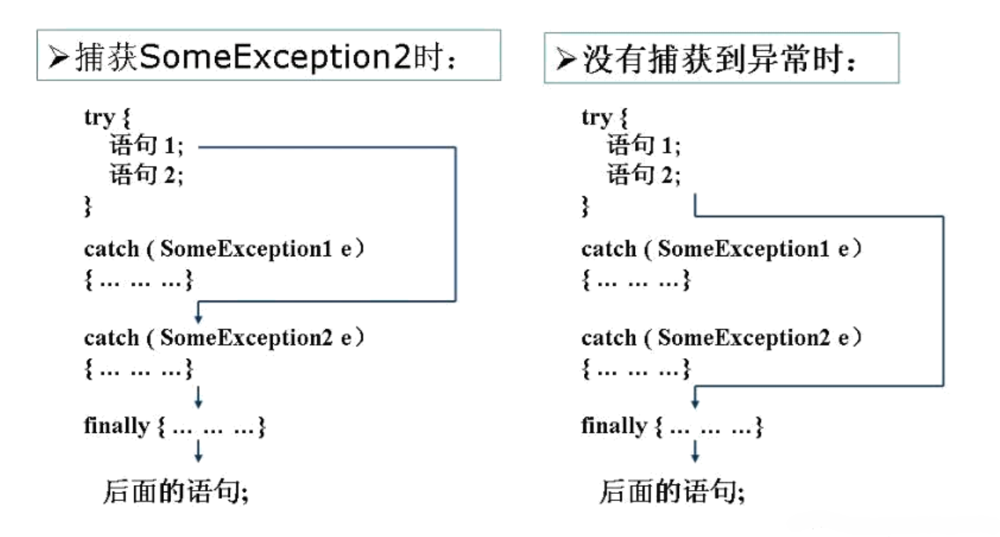
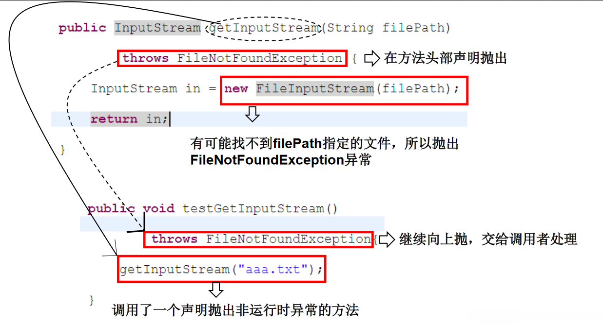
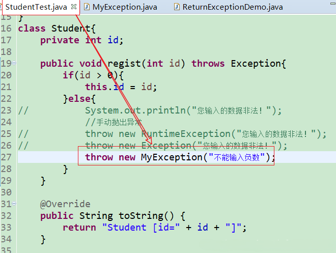
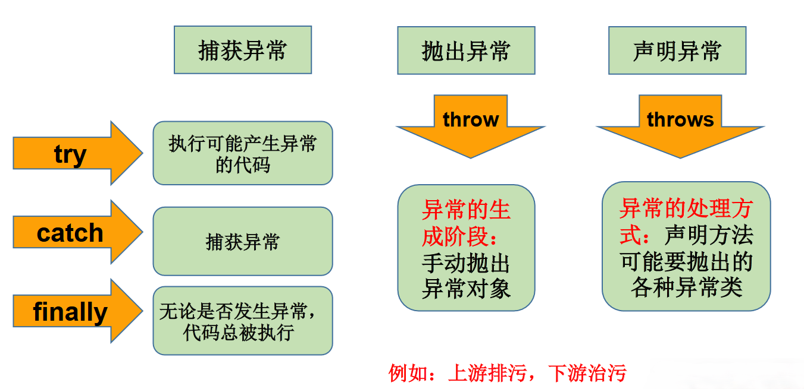

---
# 当前页面内容标题
title: 09、异常
# 分类
category:
  - Java
# 标签
tag:
  - Java
sticky: false
# 是否收藏在博客主题的文章列表中，当填入数字时，数字越大，排名越靠前。
star: false
# 是否将该文章添加至文章列表中
article: true
# 是否将该文章添加至时间线中
timeline: true
---

## 01、异常概述与异常[体系结构](https://so.csdn.net/so/search?q=体系结构&spm=1001.2101.3001.7020)

在使用计算机语言进行项目开发的过程中，即使程序员把代码写得尽善尽美，在系统的运行过程中仍然会遇到一些问题，因为很多问题不是靠代码能够避免的，比如：客户输入数据的格式，读取文件是否存在，网络是否始终保持通畅等等。

> 异常：

在Java语言中，将程序执行中发生的不正常情况称为“异常”。(开发过程中的语法错误和逻辑错误不是异常)

Java程序在执行过程中所发生的异常事件可分为两类：

Error：Java虚拟机无法解决的严重问题。如：JVM系统内部错误、资源耗尽等严重情况。比如：StackOverflowError和OOM。一般不编写针对性的代码进行处理。

```java
/*
 * Java虚拟机无法解决的严重问题。如：JVM系统内部错误、资源耗尽等严重情况。
 * 比如：StackOverflowError和OOM。
 * 一般不编写针对性的代码进行处理。
 * 
 */
public class ErrorTest {
 public static void main(String[] args) {
  //1.栈溢出:java.lang.StackOverflowError
//  main(args);
  //2.堆溢出:java.lang.OutOfMemoryError
//  Integer[] arr = new Integer[1024*1024*1024];

 }
}
```

- **Exception**:其它因编程错误或偶然的外在因素导致的一般性问题，可以使用针对性的代码进行处理。例如：
  - 空指针访问
  - 试图读取不存在的文件
  - 网络连接中断
  - 数组角标越界

> 对于这些错误，一般有两种解决方法：

- 一是遇到错误就终止程序的运行。
- 另一种方法是由程序员在编写程序时，就考虑到错误的检测、错误消息的提示，以及错误的处理。

捕获错误最理想的是在编译期间，但有的错误只有在运行时才会发生。比如：除数为0，数组下标越界等

> 异常分类：**编译时异常**和**运行时异常**

- 运行时异常
  - 是指编译器不要求强制处置的异常。一般是指编程时的逻辑错误，是程序员应该积极避免其出现的异常。java.lang.RuntimeException类及它的子类都是运行时异常。
  - 对于这类异常，可以不作处理，因为这类异常很普遍，若全处理可能会对程序的可读性和运行效率产生影响。
- 编译时异常
  - 是指编译器要求必须处置的异常。即程序在运行时由于外界因素造成的一般性异常。编译器要求Java程序必须捕获或声明所有编译时异常。
  - 对于这类异常，如果程序不处理，可能会带来意想不到的结果。

## 02、常见异常

```java
import java.io.File;
import java.io.FileInputStream;
import java.util.Date;
import java.util.Scanner;
import org.junit.Test;

/*
 * 一、java异常体系结构
 * 
 * java.lang.Throwable
 *   |----java.lang.Error:一般不编写针对性的代码进行处理
 *   |----java.lang.Exception:可以进行异常处理
 *    |----编译时异常(checked)
 *     |----IOEXception
 *      |----FileNotFoundException
 *     |----ClassNotFoundException
 *    |----运行时异常(unchecked)
 *     |----NullPointerException
 *     |----ArrayIndexOutOfBoundsException
 *     |----ClassCaseException
 *     |----NumberFormatException
 *     |----InputMismatchException
 *     |----ArithmaticException
 * 
 * 面试题:常见的异常有哪些？举例说明
 * 
 */
public class ExceptionTest {

 // ******************以下是编译时异常***************************
 @Test
 public void test7() {
//  File file = new File("hello.txt");
//  FileInputStream fis = new FileInputStream(file);
//  
//  int data = fis.read();
//  while(data != -1){
//   System.out.print((char)data);
//   data = fis.read();
//  }
//  
//  fis.close();
 }

 // ******************以下是运行时异常***************************
 // ArithmeticException
 @Test
 public void test6() {
  int a = 10;
  int b = 0;
  System.out.println(a / b);
 }

 // InputMismatchException
 @Test
 public void test5() {
  Scanner scanner = new Scanner(System.in);
  int score = scanner.nextInt();
  System.out.println(score);

  scanner.close();
 }

 // NumberFormatException
 @Test
 public void test4() {
  String str = "123";
  str = "abc";
  int num = Integer.parseInt(str);
 }

 // ClassCaseException
 @Test
 public void test3() {
   Object obj = new Date();
   String str = (String)obj;
 }

 // ArrayIndexOutOfBoundsException
 @Test
 public void test2() {
  // int[] arr = new int[10];
  // System.out.println(arr[10]);

  // String str = "abc";
  // System.out.println(str.charAt(3));
 }

 // NullPointerException
 @Test
 public void test1() {
  // int[] arr = null;
  // System.out.println(arr[3]);

  // String str = "abc";
  // str = null;
  // System.out.println(str.charAt(0));
 }
}
```

## 03、异常处理机制一：try-catch-finally

在编写程序时，经常要在可能出现错误的地方加上检测的代码，如进行x/y运算时，要检测分母为0，数据为空，输入的不是数据而是字符等。过多的if-else分支会导致程序的代码加长、臃肿，可读性差。因此采用异常处理机制。

> Java异常处理:

Java采用的异常处理机制，是将异常处理的程序代码集中在一起，与正常的程序代码分开，使得程序简洁、优雅，并易于维护。

方式一：try-catch-finally

方式二：[throws](https://so.csdn.net/so/search?q=throws&spm=1001.2101.3001.7020) + 异常类型

> Java异常处理的方式: try-catch-finally

- `try`
  - 捕获异常的第一步是用try{…}语句块选定捕获异常的范围，将可能出现异常的代码放在try语句块中。
- `catch(Exceptiontypee)`
- 在`catch`语句块中是对异常对象进行处理的代码。每个`try`语句块可以伴随一个或多个`catch`语句，用于处理可能产生的不同类型的异常对象。
- 捕获异常的有关信息：与其它对象一样，可以访问一个异常对象的成员变量或调用它的方法。
  - getMessage() 获取异常信息，返回字符串
  - printStackTrace() 获取异常类名和异常信息，以及异常出现在程序中的位置。返回值void。


- `finally`
  - 捕获异常的最后一步是通过finally语句为异常处理提供一个统一的出口，使得在控制流转到程序的其它部分以前，能够对程序的状态作统一的管理。
  - 不论在try代码块中是否发生了异常事件，catch语句是否执行，catch语句是否有异常，catch语句中是否有return，finally块中的语句都会被执行。
  - `finally`语句和`catch`语句是任选的



```java
import java.io.File;
import java.io.FileInputStream;
import java.io.FileNotFoundException;
import java.io.IOException;

import org.junit.Test;

/*
 * 异常的处理:抓抛模型
 * 
 * 过程一:“抛”：程序在征程执行过程中，一旦出现异常，就会在异常代码处生成一个对应异常类的对象
 *     并将此对象抛出。
 *    一旦抛出对象以后，其后的代码就不再执行。
 * 
 * 过程二:“抓”:可以理解为异常的处理方式：① try-catch-finally  ② throws
 * 
 * 二、try-catch-finally的使用
 * 
 * try{
 *   //可能出现异常的代码
 * }catch(异常类型1 变量名1){
 *   //处理异常的方式1
 * }catch(异常类型2 变量名2){
 *   //处理异常的方式2
 * }catch(异常类型3 变量名3){
 *   //处理异常的方式3
 * }
 * ...
 * finally{
 *   //一定会执行的代码
 * }
 * 
 * 说明:
 * 1.finally是可选的。
 * 2.使用try将可能出现异常代码包装起来，在执行过程中，一旦出现异常，就会生成一个对应异常类的对象，根据此对象
 *   的类型，去catch中进行匹配。
 * 3.一旦try中的异常对象匹配到某一个catch时，就进入catch中进行异常的处理。一旦处理完成，就跳出当前的
 *   try-catch结构（在没有写finally的情况）。继续执行其后的代码。
 * 4.catch中的异常类型如果没有子父类关系，则谁声明在上，谁声明在下无所谓。
 *   catch中的异常类型如果满足子父类关系，则要求子类一定声明在父类的上面。否则，报错
 * 5.常用的异常对象处理的方式： ① String  getMessage()    ② printStackTrace()
 * 6.在try结构中声明的变量，再出了try结构以后，就不能再被调用,例65行:System.out.println(num);
 * 7.try-catch-finally结构可以嵌套  
 * 
 * 体会1：使用try-catch-finally处理编译时异常，是得程序在编译时就不再报错，但是运行时仍可能报错。
 *     相当于我们使用try-catch-finally将一个编译时可能出现的异常，延迟到运行时出现。
 *     
 * 体会2：开发中，由于运行时异常比较常见，所以我们通常就不针对运行时异常编写try-catch-finally了。
 *      针对于编译时异常，我们说一定要考虑异常的处理。
 */
public class ExceptionTest1 {

 @Test
 public void test2(){
  try{
   File file = new File("hello.txt");
   FileInputStream fis = new FileInputStream(file);

   int data = fis.read();
   while(data != -1){
    System.out.print((char)data);
    data = fis.read();
   }

   fis.close();
  }catch(FileNotFoundException e){
   e.printStackTrace();
  }catch(IOException e){
   e.printStackTrace();
  }
 }

 @Test
 public void test1(){

  String str = "123";
  str = "abc";
  try{
   int num = Integer.parseInt(str); 

   System.out.println("hello-----1");
  }catch(NumberFormatException e){
//   System.out.println("出现数值转换异常了，不要着急....");
   //String getMessage():
//   System.out.println(e.getMessage());
   //printStackTrace():
   e.printStackTrace();
  }catch(NullPointerException e){
   System.out.println("出现空指针异常了，不要着急....");
  }catch(Exception e){
   System.out.println("出现异常了，不要着急....");
  }
//  System.out.println(num);

  System.out.println("hello----2");
 }
}
```

### 3.1、finally的使用

```java
import java.io.File;
import java.io.FileInputStream;
import java.io.FileNotFoundException;
import java.io.IOException;

import org.junit.Test;

/*
 * try-catch-finally中finally的使用：
 * 
 * 1.finally是可选的。
 * 2.finally中声明的是一定会被执行的代码。即使catch中又出现异常了，try中有return语句，catch中有
 *   return语句等情况。
 * 3.像数据库连接、输入输出流、网络编程Socket等资源，JVM是不能自动的回收的，我们需要自己手动的进行资源的
 *   释放。此时的资源释放，就需要声明在finally中。
 * 
 */
public class FinallyTest {

 @Test
 public void test2() {
  FileInputStream fis = null;
  try {
   File file = new File("hello1.txt");//文件可能不存在，而出现异常
   fis = new FileInputStream(file);

   int data = fis.read();
   while (data != -1) {
    System.out.print((char) data);
    data = fis.read();
   }

  } catch (FileNotFoundException e) {
   e.printStackTrace();
  } catch (IOException e) {
   e.printStackTrace();
  } finally {
   try {
    if (fis != null)
     fis.close();
   } catch (IOException e) {
    e.printStackTrace();
   }
  }
 }

 @Test
 public void testMethod() {
  int num = method();
  System.out.println(num);
 }

 public int method() {

  try {
   int[] arr = new int[10];
   System.out.println(arr[10]);
   return 1;
  } catch (ArrayIndexOutOfBoundsException e) {
   e.printStackTrace();
   return 2;
  } finally {
   System.out.println("我一定会被执行");
   return 3;
  }
 }

 @Test
 public void test1() {
  try {
   int a = 10;
   int b = 0;
   System.out.println(a / b);
  } catch (ArithmeticException e) {
   // e.printStackTrace();

   int[] arr = new int[10];
   System.out.println(arr[10]);

  } catch (Exception e) {
   e.printStackTrace();
  }
  // System.out.println("我好慢呀~~~");
  finally {
   System.out.println("我好慢呀~~~");
  }
 }
}
```

## 04、异常处理机制二：throws

- 声明抛出异常是Java中处理异常的第二种方式
  - 如果一个方法(中的语句执行时)可能生成某种异常，但是并不能确定如何处理这种异常，则此方法应显示地声明抛出异常，表明该方法将不对这些异常进行处理，而由该方法的调用者负责处理。
- 在方法声明中用throws语句可以声明抛出异常的列表，throws后面的异常类型可以是方法中产生的异常类型，也可以是它的父类。

```java
/*
 * 异常处理的方式二：throws + 异常类型
 * 
 * 1. "throws + 异常类型"写在方法的声明处。指明此方法执行时，可能会抛出的异常类型。
 *     一旦当方法体执行时，出现异常，仍会在异常代码处生成一个异常类的对象，此对象满足throws后异常
 *     类型时，就会被抛出。异常代码后续的代码，就不再执行！
 *
 *     关于异常对象的产生:① 系统自动生成的异常对象
 *      ② 手动生成一个异常对象，并抛出(throw)
 *     
 * 2. 体会：try-catch-finally:真正的将异常给处理掉了。
 *        throws的方式只是将异常抛给了方法的调用者。  并没有真正将异常处理掉。  
 * 
 */
public class ExceptionTest2 {

 public static void main(String[] args){
  try {
   method2();
  } catch (IOException e) {
   e.printStackTrace();
  }

  method3();
 }

 public static void method3(){
  try {
   method2();
  } catch (IOException e) {
   e.printStackTrace();
  }
 }

 public static void method2() throws IOException{
  method1();
 }


 public static void method1() throws FileNotFoundException,IOException{
  File file = new File("hello1.txt");
  FileInputStream fis = new FileInputStream(file);

  int data = fis.read();
  while(data != -1){
   System.out.print((char)data);
   data = fis.read();
  }

  fis.close();

  System.out.println("hahaha!");
 }
}
```



### 4.1、重写方法声明抛出异常的原则

```java
import java.io.FileNotFoundException;
import java.io.IOException;

/*
 * 方法重写的规则之一：
 * 子类重写的方法抛出的异常类型不大于父类被重写的方法抛出的异常类型
 * 
 */
public class OverrideTest {

 public static void main(String[] args) {
  OverrideTest test = new OverrideTest();
  test.display(new SubClass());
 }

 public void display(SuperClass s){
  try {
   s.method();
  } catch (IOException e) {
   e.printStackTrace();
  }
 }

}
class SuperClass{

 public void method() throws IOException{

 }
}
class SubClass extends SuperClass{
 public void method()throws FileNotFoundException{

 }
}
```

```java
/* 3. 开发中如何选择使用try-catch-finally 还是使用throws？
 *   3.1 如果父类中被重写的方法没有throws方式处理异常，则子类重写的方法也不能使用throws，意味着如果
 *       子类重写的方法中有异常，必须使用try-catch-finally方式处理。
 *   3.2 执行的方法a中，先后又调用了另外的几个方法，这几个方法是递进关系执行的。我们建议这几个方法使用throws
 *       的方式进行处理。而执行的方法a可以考虑使用try-catch-finally方式进行处理。
 */
```

## 05、手动抛出异常

> Java异常类对象除在程序执行过程中出现异常时由系统自动生成并抛出，也可根据需要使用人工创建并抛出。

- 首先要生成异常类对象，然后通过throw语句实现抛出操作(提交给Java运行环境)
- 可以抛出的异常必须是Throwable或其子类的实例。下面的语句在编译时将会产生语法错误：

```java
public class StudentTest {
 public static void main(String[] args) {
  try {
   Student s = new Student();
//  s.regist(1001);
   s.regist(-1001);
   System.out.println(s);
  } catch (Exception e) {
//   e.printStackTrace();
   System.out.println(e.getMessage());
  }
 }
}
class Student{
 private int id;

 public void regist(int id) throws Exception{
  if(id > 0){
   this.id = id;
  }else{
//   System.out.println("您输入的数据非法！");
   //手动抛出异常
//   throw new RuntimeException("您输入的数据非法！");
   throw new Exception("您输入的数据非法！");

  }
 }

 @Override
 public String toString() {
  return "Student [id=" + id + "]";
 }

}
```

## 06、用户自定义异常类

- 一般地，用户自定义异常类都是RuntimeException的子类。
- 自定义异常类通常需要编写几个重载的构造器。
- 自定义异常需要提供serialVersionUID
- 自定义的异常通过throw抛出。
- 自定义异常最重要的是异常类的名字，当异常出现时，可以根据名字判断异常类型。

```java
/*
 * 如何自定义异常类？
 * 1.继承于现有的异常结构：RuntimeException 、Exception
 * 2.提供全局常量：serialVersionUID
 * 3.提供重载的构造器
 * 
 */
public class MyException extends RuntimeException{
 static final long serialVersionUID = -7034897193246939L;

 public MyException(){

 }

 public MyException(String msg){
  super(msg);
 }
}
```



### 6.1、练习

> 练习1——ReturnExceptionDemo类

```java
public class ReturnExceptionDemo {
 static void methodA() {
  try {
   System.out.println("进入方法A");
   throw new RuntimeException("制造异常");
  } finally {
   System.out.println("用A方法的finally");
  }
 }

 static void methodB() {
  try {
   System.out.println("进入方法B");
   return;
  } finally {
   System.out.println("调用B方法的finally");
  }
 }

 public static void main(String[] args) {
  try {
   methodA();
  } catch (Exception e) {
   System.out.println(e.getMessage());
  }

  methodB();
 }
}
```

> 练习2

```java
/*
 * 编写应用程序EcmDef.java，接收命令行的两个参数，
 *   要求不能输入负数，计算两数相除。
 *   对 数 据 类 型 不 一 致(NumberFormatException)、
 *   缺 少 命 令 行 参 数(ArrayIndexOutOfBoundsException、
 *   除0(ArithmeticException)及输入负数(EcDef自定义的异常)进行异常处理。
 *
 * 提示：
 *   (1)在主类(EcmDef)中定义异常方法(ecm)完成两数相除功能。
 *   (2)在main()方法中使用异常处理语句进行异常处理。
 *   (3)在程序中，自定义对应输入负数的异常类(EcDef)。
 *   (4)运行时接受参数java EcmDef2010//args[0]=“20”args[1]=“10”
 *   (5)Interger类的static方法parseInt(Strings)将s转换成对应的int值。
 *   如：int a=Interger.parseInt(“314”);//a=314;
 */
public class EcmDef {
 public static void main(String[] args) {
  try {
   int i = Integer.parseInt(args[0]);
   int j = Integer.parseInt(args[0]);

   int result = ecm(i,j);

   System.out.println(result);
  } catch (NumberFormatException e) {
   System.out.println("数据类型不一致");
  }catch (ArrayIndexOutOfBoundsException e){
   System.out.println("缺少命令行参数");
  }catch (ArithmeticException e){
   System.out.println("除0");
  }catch (EcDef e) {
   System.out.println(e.getMessage());
  }
 }

 public static int ecm(int i, int j) throws EcDef{
  if(i < 0 || j < 0){
   throw new EcDef("分子或分母为负数了！");
  }
  return i / j;
 }
}
```

> 练习2的自定义异常类——EcDef

```java
//自定义异常类
public class EcDef extends Exception {

 static final long serialVersionUID = -33875164229948L;

 public EcDef() {

 }

 public EcDef(String msg) {
  super(msg);
 }
}
```

## 07、异常总结

> 总结：异常处理5个关键字


