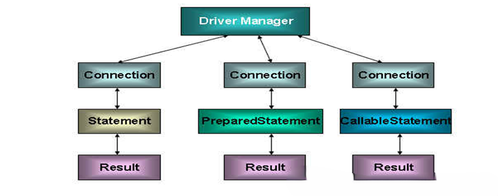
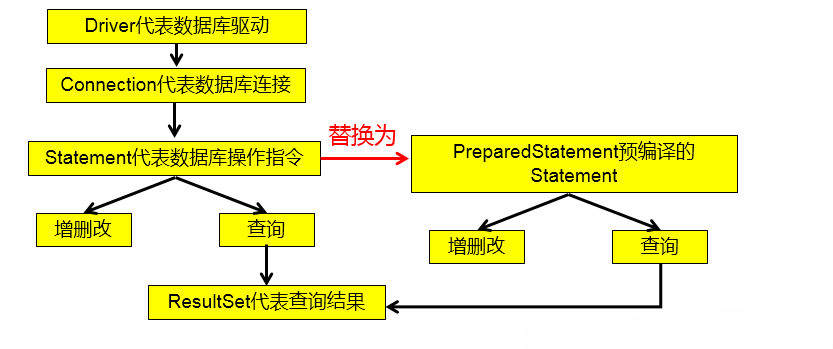
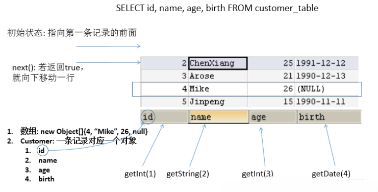
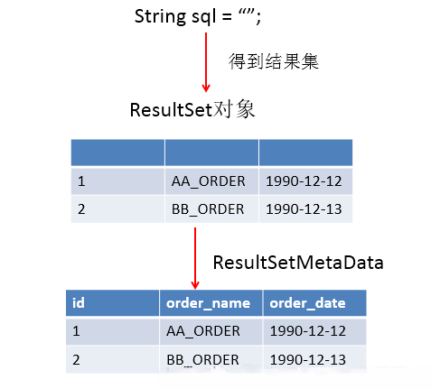
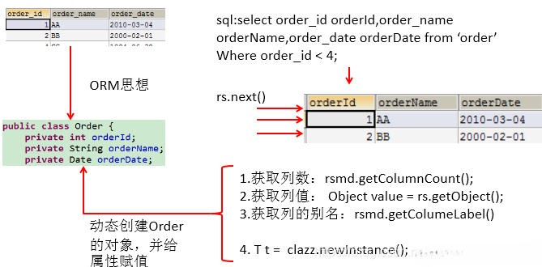

---
# 当前页面内容标题
title: 03、使用PreparedStatement实现CRUD操作
# 分类
category:
  - jdbc
# 标签
tag: 
  - jdbc
  - java
  - 数据库
sticky: false
# 是否收藏在博客主题的文章列表中，当填入数字时，数字越大，排名越靠前。
star: false
# 是否将该文章添加至文章列表中
article: true
# 是否将该文章添加至时间线中
timeline: true
---

# 03、使用PreparedStatement实现CRUD操作

## 3.1 操作和访问数据库

- 数据库连接被用于向数据库服务器发送命令和 SQL 语句，并接受数据库服务器返回的结果。其实一个数据库连接就是一个Socket连接。

- 在 java.sql 包中有 3 个接口分别定义了对数据库的调用的不同方式：

  - Statement：用于执行静态 SQL 语句并返回它所生成结果的对象。

  - PrepatedStatement：SQL 语句被预编译并存储在此对象中，可以使用此对象多次高效地执行该语句。

  - CallableStatement：用于执行 SQL 存储过程



## 3.2 使用Statement操作数据表的弊端

- 通过调用 Connection 对象的 createStatement() 方法创建该对象。该对象用于执行静态的 SQL 语句，并且返回执行结果。
- Statement 接口中定义了下列方法用于执行 SQL 语句：

```java
int excuteUpdate(String sql)：执行更新操作INSERT、UPDATE、DELETE
ResultSet executeQuery(String sql)：执行查询操作SELECT
```

- 但是使用Statement操作数据表存在弊端：
  - **问题一：存在拼串操作，繁琐**
  - **问题二：存在SQL注入问题**

- SQL 注入是利用某些系统没有对用户输入的数据进行充分的检查，而在用户输入数据中注入非法的 SQL 语句段或命令(如：SELECT user, password FROM user_table WHERE user=‘a’ OR 1 = ’ AND password = ’ OR ‘1’ = ‘1’) ，从而利用系统的 SQL 引擎完成恶意行为的做法。

- 对于 Java 而言，要防范 SQL 注入，只要用 PreparedStatement(从Statement扩展而来) 取代 Statement 就可以了。
- 代码演示：

```java
public class StatementTest {

	// 使用Statement的弊端：需要拼写sql语句，并且存在SQL注入的问题
	@Test
	public void testLogin() {
		Scanner scan = new Scanner(System.in);

		System.out.print("用户名：");
		String userName = scan.nextLine();
		System.out.print("密   码：");
		String password = scan.nextLine();

		// SELECT user,password FROM user_table WHERE USER = '1' or ' AND PASSWORD = '='1' or '1' = '1';
		String sql = "SELECT user,password FROM user_table WHERE USER = '" + userName + "' AND PASSWORD = '" + password
				+ "'";
		User user = get(sql, User.class);
		if (user != null) {
			System.out.println("登陆成功!");
		} else {
			System.out.println("用户名或密码错误！");
		}
	}

	// 使用Statement实现对数据表的查询操作
	public <T> T get(String sql, Class<T> clazz) {
		T t = null;

		Connection conn = null;
		Statement st = null;
		ResultSet rs = null;
		try {
			// 1.加载配置文件
			InputStream is = StatementTest.class.getClassLoader().getResourceAsStream("jdbc.properties");
			Properties pros = new Properties();
			pros.load(is);

			// 2.读取配置信息
			String user = pros.getProperty("user");
			String password = pros.getProperty("password");
			String url = pros.getProperty("url");
			String driverClass = pros.getProperty("driverClass");

			// 3.加载驱动
			Class.forName(driverClass);

			// 4.获取连接
			conn = DriverManager.getConnection(url, user, password);

			st = conn.createStatement();

			rs = st.executeQuery(sql);

			// 获取结果集的元数据
			ResultSetMetaData rsmd = rs.getMetaData();

			// 获取结果集的列数
			int columnCount = rsmd.getColumnCount();

			if (rs.next()) {

				t = clazz.newInstance();

				for (int i = 0; i < columnCount; i++) {
					// //1. 获取列的名称
					// String columnName = rsmd.getColumnName(i+1);

					// 1. 获取列的别名
					String columnName = rsmd.getColumnLabel(i + 1);

					// 2. 根据列名获取对应数据表中的数据
					Object columnVal = rs.getObject(columnName);

					// 3. 将数据表中得到的数据，封装进对象
					Field field = clazz.getDeclaredField(columnName);
					field.setAccessible(true);
					field.set(t, columnVal);
				}
				return t;
			}
		} catch (Exception e) {
			e.printStackTrace();
		} finally {
			// 关闭资源
			if (rs != null) {
				try {
					rs.close();
				} catch (SQLException e) {
					e.printStackTrace();
				}
			}
			if (st != null) {
				try {
					st.close();
				} catch (SQLException e) {
					e.printStackTrace();
				}
			}

			if (conn != null) {
				try {
					conn.close();
				} catch (SQLException e) {
					e.printStackTrace();
				}
			}
		}

		return null;
	}
}
```

综上：



## 3.3 PreparedStatement的使用

### 3.3.1 PreparedStatement介绍

- 可以通过调用 Connection 对象的 **preparedStatement(String sql)** 方法获取 PreparedStatement 对象
- **PreparedStatement 接口是 Statement 的子接口，它表示一条预编译过的 SQL 语句**

- PreparedStatement 对象所代表的 SQL 语句中的参数用问号(?)来表示，调用 PreparedStatement 对象的 setXxx() 方法来设置这些参数. setXxx() 方法有两个参数，第一个参数是要设置的 SQL 语句中的参数的索引(从 1 开始)，第二个是设置的 SQL 语句中的参数的值

### 3.3.2 PreparedStatement vs Statement

- 代码的可读性和可维护性。
- **PreparedStatement 能最大可能提高性能：**
  - DBServer会对预编译语句提供性能优化。因为预编译语句有可能被重复调用，所以语句在被DBServer的编译器编译后的执行代码被缓存下来，那么下次调用时只要是相同的预编译语句就不需要编译，只要将参数直接传入编译过的语句执行代码中就会得到执行。
  - 在statement语句中,即使是相同操作但因为数据内容不一样,所以整个语句本身不能匹配,没有缓存语句的意义.事实是没有数据库会对普通语句编译后的执行代码缓存。这样每执行一次都要对传入的语句编译一次。
  - (语法检查，语义检查，翻译成二进制命令，缓存)

- PreparedStatement 可以防止 SQL 注入

### 3.3.3 Java与SQL对应数据类型转换表

|      Java类型      |         SQL类型          |
| :----------------: | :----------------------: |
|      boolean       |           BIT            |
|        byte        |         TINYINT          |
|       short        |         SMALLINT         |
|        int         |         INTEGER          |
|        long        |          BIGINT          |
|       String       | CHAR,VARCHAR,LONGVARCHAR |
|     byte array     |   BINARY , VAR BINARY    |
|   java.sql.Date    |           DATE           |
|   java.sql.Time    |           TIME           |
| java.sql.Timestamp |        TIMESTAMP         |

### 3.3.4 使用PreparedStatement实现增、删、改操作

```java
	//通用的增、删、改操作（体现一：增、删、改 ； 体现二：针对于不同的表）
	public void update(String sql,Object ... args){
		Connection conn = null;
		PreparedStatement ps = null;
		try {
			//1.获取数据库的连接
			conn = JDBCUtils.getConnection();
			
			//2.获取PreparedStatement的实例 (或：预编译sql语句)
			ps = conn.prepareStatement(sql);
			//3.填充占位符
			for(int i = 0;i < args.length;i++){
				ps.setObject(i + 1, args[i]);
			}
			
			//4.执行sql语句
			ps.execute();
		} catch (Exception e) {
			
			e.printStackTrace();
		}finally{
			//5.关闭资源
			JDBCUtils.closeResource(conn, ps);
			
		}
	}
```

### 3.3.5 使用PreparedStatement实现查询操作

```java
	// 通用的针对于不同表的查询:返回一个对象 (version 1.0)
	public <T> T getInstance(Class<T> clazz, String sql, Object... args) {

		Connection conn = null;
		PreparedStatement ps = null;
		ResultSet rs = null;
		try {
			// 1.获取数据库连接
			conn = JDBCUtils.getConnection();

			// 2.预编译sql语句，得到PreparedStatement对象
			ps = conn.prepareStatement(sql);

			// 3.填充占位符
			for (int i = 0; i < args.length; i++) {
				ps.setObject(i + 1, args[i]);
			}

			// 4.执行executeQuery(),得到结果集：ResultSet
			rs = ps.executeQuery();

			// 5.得到结果集的元数据：ResultSetMetaData
			ResultSetMetaData rsmd = rs.getMetaData();

			// 6.1通过ResultSetMetaData得到columnCount,columnLabel；通过ResultSet得到列值
			int columnCount = rsmd.getColumnCount();
			if (rs.next()) {
				T t = clazz.newInstance();
				for (int i = 0; i < columnCount; i++) {// 遍历每一个列

					// 获取列值
					Object columnVal = rs.getObject(i + 1);
					// 获取列的别名:列的别名，使用类的属性名充当
					String columnLabel = rsmd.getColumnLabel(i + 1);
					// 6.2使用反射，给对象的相应属性赋值
					Field field = clazz.getDeclaredField(columnLabel);
					field.setAccessible(true);
					field.set(t, columnVal);

				}

				return t;

			}
		} catch (Exception e) {

			e.printStackTrace();
		} finally {
			// 7.关闭资源
			JDBCUtils.closeResource(conn, ps, rs);
		}

		return null;

	}
```

> 说明：使用PreparedStatement实现的查询操作可以替换Statement实现的查询操作，解决Statement拼串和SQL注入问题。

## 3.4 ResultSet与ResultSetMetaData

### 3.4.1 ResultSet

- 查询需要调用PreparedStatement 的 executeQuery() 方法，查询结果是一个ResultSet 对象
- ResultSet 对象以逻辑表格的形式封装了执行数据库操作的结果集，ResultSet 接口由数据库厂商提供实现
- ResultSet 返回的实际上就是一张数据表。有一个指针指向数据表的第一条记录的前面。
- ResultSet 对象维护了一个指向当前数据行的**游标**，初始的时候，游标在第一行之前，可以通过 ResultSet 对象的 next() 方法移动到下一行。调用 next()方法检测下一行是否有效。若有效，该方法返回 true，且指针下移。相当于Iterator对象的 hasNext() 和 next() 方法的结合体。
- 当指针指向一行时, 可以通过调用 getXxx(int index) 或 getXxx(int columnName) 获取每一列的值。
  - 例如: getInt(1), getString(“name”)
  - **注意：Java与数据库交互涉及到的相关Java API中的索引都从1开始。**

- ResultSet 接口的常用方法：
  - boolean next()
  - getString()
  - …



### 3.4.2 ResultSetMetaData

- 可用于获取关于 ResultSet 对象中列的类型和属性信息的对象
- ResultSetMetaData meta = rs.getMetaData();
  - **getColumnName**(int column)：获取指定列的名称
  - **getColumnLabel**(int column)：获取指定列的别名
  - **getColumnCount**()：返回当前 ResultSet 对象中的列数。
  - getColumnTypeName(int column)：检索指定列的数据库特定的类型名称。
  - getColumnDisplaySize(int column)：指示指定列的最大标准宽度，以字符为单位。
  - **isNullable**(int column)：指示指定列中的值是否可以为 null。
  - isAutoIncrement(int column)：指示是否自动为指定列进行编号，这样这些列仍然是只读的。



**问题1：得到结果集后, 如何知道该结果集中有哪些列 ？ 列名是什么？**

 需要使用一个描述 ResultSet 的对象， 即 ResultSetMetaData

**问题2：关于ResultSetMetaData**

1. 如何获取 ResultSetMetaData： 调用 ResultSet 的 getMetaData() 方法即可
2. 获取 ResultSet 中有多少列：调用 ResultSetMetaData 的 getColumnCount() 方法
3. 获取 ResultSet 每一列的列的别名是什么：调用 ResultSetMetaData 的getColumnLabel() 方法



## 3.5 资源的释放

- 释放ResultSet, Statement,Connection。
- 数据库连接（Connection）是非常稀有的资源，用完后必须马上释放，如果Connection不能及时正确的关闭将导致系统宕机。Connection的使用原则是`尽量晚创建，尽量早的释放`。
- 可以在finally中关闭，保证及时其他代码出现异常，资源也一定能被关闭。

## 3.6 JDBC API小结

- 两种思想
  - 面向接口编程的思想
  - ORM思想(object relational mapping)
    - 一个数据表对应一个java类
    - 表中的一条记录对应java类的一个对象
    - 表中的一个字段对应java类的一个属性

> sql是需要结合列名和表的属性名来写。注意起别名。

- 两种技术
  - JDBC结果集的元数据：ResultSetMetaData
    - 获取列数：getColumnCount()
    - 获取列的别名：getColumnLabel()
  - 通过反射，创建指定类的对象，获取指定的属性并赋值