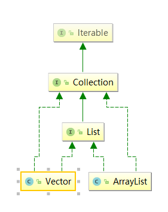
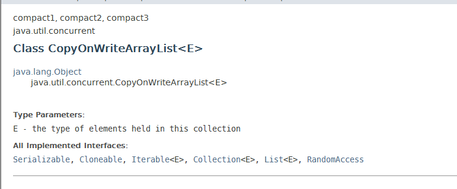

---
# 当前页面内容标题
title: 七、集合不安全
# 分类
category:
  - JUC
  - java
# 标签
tag: 
  - java
  - juc
  - 并发编程
sticky: false
# 是否收藏在博客主题的文章列表中，当填入数字时，数字越大，排名越靠前。
star: false
# 是否将该文章添加至文章列表中
article: true
# 是否将该文章添加至时间线中
timeline: true
---

## 七、集合不安全

### 1、线程不安全错误

```java
java.util.ConcurrentModificationException
ArrayList在迭代的时候如果同时对其进行修改就会
抛出java.util.ConcurrentModificationException异常 并发修改异常
```

### 2、List不安全

```java
List<String> list = new ArrayList<>();
for (int i = 0; i <30 ; i++) {
            new Thread(()->{
                list.add(UUID.randomUUID().toString().substring(0,8));
                System.out.println(list);
            },String.valueOf(i)).start();
        }

// 看ArrayList的源码
public boolean add(E e) {
    ensureCapacityInternal(size + 1);  // Increments modCount!!
    elementData[size++] = e;
    return true;
}
// 没有synchronized线程不安全
```

#### 1、 解决方案

##### 1、Vector

```java
List list = new Vector<>();
```



```java
// 看Vector的源码
public synchronized boolean add(E e) {
    modCount++;
    ensureCapacityHelper(elementCount + 1);
    elementData[elementCount++] = e;
    return true;
}
// 有synchronized线程安全
```

##### 2、Collections

```java
List list = Collections.synchronizedList(new ArrayList<>());
// Collections提供了方法synchronizedList保证list是同步线程安全的
// 那HashMap，HashSet是线程安全的吗？也不是,所以有同样的线程安全方法
```


##### 3、写时复制(JUC)

```java
List<String> list = new CopyOnWriteArrayList<>();
```



##### 4、CopyOnWrite理论

```java
/**
 * Appends the specified element to the end of this list.
 *
 * @param e element to be appended to this list
 * @return {@code true} (as specified by {@link Collection#add})
 */
public boolean add(E e) {
    final ReentrantLock lock = this.lock;
    lock.lock();
    try {
        Object[] elements = getArray();
        int len = elements.length;
        Object[] newElements = Arrays.copyOf(elements, len + 1);
        newElements[len] = e;
        setArray(newElements);
        return true;
    } finally {
        lock.unlock();
    }
}
```

 CopyOnWrite容器即写时复制的容器。往一个容器添加元素的时候，不直接往当前容器Object[]添加，而是先将当前容器Object[]进行Copy，复制出一个新的容器Object[] newElements，然后向新的容器Object[] newElements里添加元素。添加元素后，再将原容器的引用指向新的容器setArray(newElements)。这样做的好处是可以对CopyOnWrite容器进行并发的读，而不需要加锁，因为当前容器不会添加任何元素。所以CopyOnWrite容器也是一种读写分离的思想，读和写不同的容器。

### 3、Set不安全

```java
Set<String> set = new HashSet<>();//线程不安全

Set<String> set = new CopyOnWriteArraySet<>();//线程安全
HashSet底层数据结构是什么？
HashMap  ?

但HashSet的add是放一个值，而HashMap是放K、V键值对

public HashSet() {
    map = new HashMap<>();
}

private static final Object PRESENT = new Object();

public boolean add(E e) {
    return map.put(e, PRESENT)==null;
}
```

### 4、Map不安全

```java
Map<String,String> map = new HashMap<>();//线程不安全

Map<String,String> map = new ConcurrentHashMap<>();//线程安全
import java.util.*;
import java.util.concurrent.ConcurrentHashMap;
import java.util.concurrent.CopyOnWriteArrayList;
import java.util.concurrent.CopyOnWriteArraySet;

/**
 * 请举例说明集合类是不安全的
 */
public class NotSafeDemo {
    public static void main(String[] args) {

        Map<String,String> map = new ConcurrentHashMap<>();
        for (int i = 0; i <30 ; i++) {
            new Thread(()->{
                map.put(Thread.currentThread().getName(),UUID.randomUUID().toString().substring(0,8));
                System.out.println(map);
            },String.valueOf(i)).start();
        }


    }

    private static void setNoSafe() {
        Set<String> set = new CopyOnWriteArraySet<>();
        for (int i = 0; i <30 ; i++) {
            new Thread(()->{
                set.add(UUID.randomUUID().toString().substring(0,8));
                System.out.println(set);
            },String.valueOf(i)).start();
        }
    }

    private static void listNoSafe() {
        //        List<String> list = Arrays.asList("a","b","c");
        //        list.forEach(System.out::println);
        //写时复制
        List<String> list = new CopyOnWriteArrayList<>();
        // new CopyOnWriteArrayList<>();
        //Collections.synchronizedList(new ArrayList<>());
        //new Vector<>();//new ArrayList<>();

        for (int i = 0; i <30 ; i++) {
                    new Thread(()->{
                        list.add(UUID.randomUUID().toString().substring(0,8));
                        System.out.println(list);
                    },String.valueOf(i)).start();
                }
    }


}

    /**
     * 写时复制
     CopyOnWrite容器即写时复制的容器。往一个容器添加元素的时候，不直接往当前容器Object[]添加，
     而是先将当前容器Object[]进行Copy，复制出一个新的容器Object[] newElements，然后向新的容器Object[] newElements里添加元素。
     添加元素后，再将原容器的引用指向新的容器setArray(newElements)。
     这样做的好处是可以对CopyOnWrite容器进行并发的读，而不需要加锁，因为当前容器不会添加任何元素。
     所以CopyOnWrite容器也是一种读写分离的思想，读和写不同的容器。

     *
     *
     *
     *

    public boolean add(E e) {
        final ReentrantLock lock = this.lock;
        lock.lock();
        try {
            Object[] elements = getArray();
            int len = elements.length;
            Object[] newElements = Arrays.copyOf(elements, len + 1);
            newElements[len] = e;
            setArray(newElements);
            return true;
        } finally {
            lock.unlock();
        }
    }
     */
```

