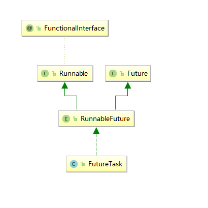
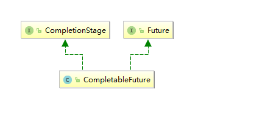
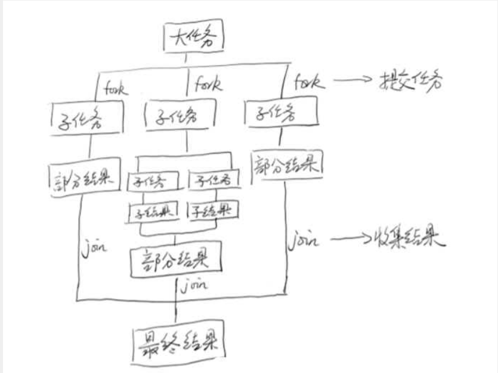
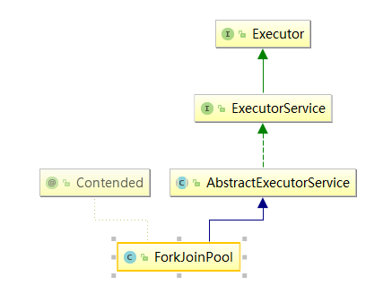

---
# 当前页面内容标题
title: 三、CompletableFuture
# 分类
category:
  - JUC
  - java
# 标签
tag: 
  - java
  - juc
  - 并发编程
sticky: false
# 是否收藏在博客主题的文章列表中，当填入数字时，数字越大，排名越靠前。
star: false
# 是否将该文章添加至文章列表中
article: true
# 是否将该文章添加至时间线中
timeline: true
---

## 三、CompletableFuture

### 1、Future和Callable接口

Future接口定义了操作异步任务执行一些方法，如获取异步任务的执行结果、取消任务的执行、判断任务是否被取消、判断任务执行是否完毕等。


Callable接口中定义了需要有返回的任务需要实现的方法

比如主线程让一个子线程去执行任务，子线程可能比较耗时，启动子线程开始执行任务后，主线程就去做其他事情了，过了一会才去获取子任务的执行结果。

### 2、从之前的FutureTask开始

Future接口相关架构




#### code1

```java
public class CompletableFutureDemo{
    public static void main(String[] args) throws ExecutionException, InterruptedException, TimeoutException{
        FutureTask<String> futureTask = new FutureTask<>(() -> {
            System.out.println("-----come in FutureTask");
            try { TimeUnit.SECONDS.sleep(3); } catch (InterruptedException e) { e.printStackTrace(); }
            return ThreadLocalRandom.current().nextInt(100);
        });

        Thread t1 = new Thread(futureTask,"t1");
        t1.start();

        //3秒钟后才出来结果，还没有计算你提前来拿(只要一调用get方法，对于结果就是不见不散，会导致阻塞)
        //System.out.println(Thread.currentThread().getName()+"\t"+futureTask.get());

        //3秒钟后才出来结果，我只想等待1秒钟，过时不候
        System.out.println(Thread.currentThread().getName()+"\t"+futureTask.get(1L,TimeUnit.SECONDS));

        System.out.println(Thread.currentThread().getName()+"\t"+" run... here");

    }
}
```

- get()阻塞 一旦调用get()方法，不管是否计算完成都会导致阻塞

#### code2

```java
public class CompletableFutureDemo2 {

    public static void main(String[] args) throws ExecutionException, InterruptedException {
        FutureTask<String> futureTask = new FutureTask<>(() -> {
            System.out.println("-----come in FutureTask");
            try { TimeUnit.SECONDS.sleep(3); } catch (InterruptedException e) { e.printStackTrace(); }
            return ""+ ThreadLocalRandom.current().nextInt(100);
        });

        new Thread(futureTask,"t1").start();

        System.out.println(Thread.currentThread().getName()+"\t"+"线程完成任务");

        /**
         * 用于阻塞式获取结果,如果想要异步获取结果,通常都会以轮询的方式去获取结果
         */
        while (true){
            if(futureTask.isDone()){
                System.out.println(futureTask.get());
                break;
            }
        }
    }
}
```

isDone()轮询

轮询的方式会耗费无谓的CPU资源，而且也不见得能及时地得到计算结果.

如果想要异步获取结果,通常都会以轮询的方式去获取结果 尽量不要阻塞

不见不散 -- 过时不候 -- 轮询

### 3、对Future的改进

#### 1、类CompletableFuture




#### 2、接口CompletionStage


代表异步计算过程中的某一个阶段，一个阶段完成以后可能会触发另外一个阶段，有些类似Linux系统的管道分隔符传参数。

### 4、核心的四个静态方法

#### 1、runAsync 无 返回值

```java
public static CompletableFuture<Void> runAsync(Runnable runnable)
public static CompletableFuture<Void> runAsync(Runnable runnable,Executor executor)  
```

#### 2、supplyAsync 有 返回值

```java
public static <U> CompletableFuture<U> supplyAsync(Supplier<U> supplier)
public static <U> CompletableFuture<U> supplyAsync(Supplier<U> supplier,Executor executor)
```

上述Executor executor参数说明

没有指定Executor的方法，直接使用默认的ForkJoinPool.commonPool() 作为它的线程池执行异步代码。

如果指定线程池，则使用我们自定义的或者特别指定的线程池执行异步代码

#### 3、Code 无 返回值

```java
public class CompletableFutureDemo3{
    public static void main(String[] args) throws ExecutionException, InterruptedException{
        CompletableFuture<Void> future = CompletableFuture.runAsync(() -> {
            System.out.println(Thread.currentThread().getName()+"\t"+"-----come in");
            //暂停几秒钟线程
            try { TimeUnit.SECONDS.sleep(1); } catch (InterruptedException e) { e.printStackTrace(); }
            System.out.println("-----task is over");
        });
        System.out.println(future.get());
    }
}
```


#### 4、Code 有 返回值

```java
public class CompletableFutureDemo3{
    public static void main(String[] args) throws ExecutionException, InterruptedException{
        CompletableFuture<Integer> completableFuture = CompletableFuture.supplyAsync(() -> {
            System.out.println(Thread.currentThread().getName() + "\t" + "-----come in");
            //暂停几秒钟线程
            try {
                TimeUnit.SECONDS.sleep(1);
            } catch (InterruptedException e) {
                e.printStackTrace();
            }
            return ThreadLocalRandom.current().nextInt(100);
        });

        System.out.println(completableFuture.get());
    }
}
```

#### 5、Code 减少阻塞和轮询

从Java8开始引入了CompletableFuture，它是Future的功能增强版，可以传入回调对象，当异步任务完成或者发生异常时，自动调用回调对象的回调方法

```java
public class CompletableFutureDemo3{
    public static void main(String[] args) throws Exception{
        CompletableFuture<Integer> completableFuture = CompletableFuture.supplyAsync(() -> {
            System.out.println(Thread.currentThread().getName() + "\t" + "-----come in");
            int result = ThreadLocalRandom.current().nextInt(10);
            //暂停几秒钟线程
            try { TimeUnit.SECONDS.sleep(1); } catch (InterruptedException e) { e.printStackTrace(); }
            System.out.println("-----计算结束耗时1秒钟，result： "+result);
            if(result > 6){
                int age = 10/0;
            }
            return result;
        }).whenComplete((v,e) ->{
            if(e == null){
                System.out.println("-----result: "+v);
            }
        }).exceptionally(e -> {
            System.out.println("-----exception: "+e.getCause()+"\t"+e.getMessage());
            return -44;
        });

        //主线程不要立刻结束，否则CompletableFuture默认使用的线程池会立刻关闭:暂停3秒钟线程
        try { TimeUnit.SECONDS.sleep(3); } catch (InterruptedException e) { e.printStackTrace(); }
    }
}
```

#### 6、CompletableFuture的优点

异步任务结束时，会自动回调某个对象的方法；

异步任务出错时，会自动回调某个对象的方法；

主线程设置好回调后，不再关心异步任务的执行，异步任务之间可以顺序执行

### 5、join和get对比

get会抛出异常，join不需要

### 6、案例精讲-从电商网站的比价需求说开去

切记，功能→性能

 经常出现在等待某条 SQL 执行完成后，再继续执行下一条 SQL ，而这两条 SQL 本身是并无关系的，可以同时进行执行的。我们希望能够两条 SQL 同时进行处理，而不是等待其中的某一条 SQL 完成后，再继续下一条。同理， 对于分布式微服务的调用，按照实际业务，如果是无关联step by step的业务，可以尝试是否可以多箭齐发，同时调用。我们去比同一个商品在各个平台上的价格，要求获得一个清单列表， 1 step by step，查完京东查淘宝，查完淘宝查天猫......

2 all 一口气同时查询。。。。。

```java
import lombok.Getter;

import java.util.Arrays;
import java.util.List;
import java.util.concurrent.CompletableFuture;
import java.util.concurrent.ThreadLocalRandom;
import java.util.concurrent.TimeUnit;
import java.util.stream.Collectors;

public class T1{
    static List<NetMall> list = Arrays.asList(
            new NetMall("jd"),
            new NetMall("tmall"),
            new NetMall("pdd"),
            new NetMall("mi")
    );

    public static List<String> findPriceSync(List<NetMall> list,String productName){
        return list.stream().map(mall -> String.format(productName+" %s price is %.2f",mall.getNetMallName(),mall.getPriceByName(productName))).collect(Collectors.toList());
    }

    public static List<String> findPriceASync(List<NetMall> list,String productName){
        return list.stream().map(mall -> CompletableFuture.supplyAsync(() -> String.format(productName + " %s price is %.2f", mall.getNetMallName(), mall.getPriceByName(productName)))).collect(Collectors.toList()).stream().map(CompletableFuture::join).collect(Collectors.toList());
    }


    public static void main(String[] args){
        long startTime = System.currentTimeMillis();
        List<String> list1 = findPriceSync(list, "thinking in java");
        for (String element : list1) {
            System.out.println(element);
        }
        long endTime = System.currentTimeMillis();
        System.out.println("----costTime: "+(endTime - startTime) +" 毫秒");

        long startTime2 = System.currentTimeMillis();
        List<String> list2 = findPriceASync(list, "thinking in java");
        for (String element : list2) {
            System.out.println(element);
        }
        long endTime2 = System.currentTimeMillis();
        System.out.println("----costTime: "+(endTime2 - startTime2) +" 毫秒");
    }
}

class NetMall{
    @Getter
    private String netMallName;

    public NetMall(String netMallName){
        this.netMallName = netMallName;
    }

    public double getPriceByName(String productName){
        return calcPrice(productName);
    }

    private double calcPrice(String productName){
        try { TimeUnit.SECONDS.sleep(1); } catch (InterruptedException e) { e.printStackTrace(); }
        return ThreadLocalRandom.current().nextDouble() + productName.charAt(0);
    }
}
```

### 7、CompletableFuture常用方法

#### 1、获得结果和触发计算

获取结果

```java
// 不见不散
public T get()

// 过时不候
public T get(long timeout, TimeUnit unit)

// 没有计算完成的情况下，给我一个替代结果 
// 立即获取结果不阻塞 计算完，返回计算完成后的结果  没算完，返回设定的valueIfAbsent值
public T getNow(T valueIfAbsent)

public class CompletableFutureDemo2{
    public static void main(String[] args) throws ExecutionException, InterruptedException{
        CompletableFuture<Integer> completableFuture = CompletableFuture.supplyAsync(() -> {
            try { TimeUnit.SECONDS.sleep(1); } catch (InterruptedException e) { e.printStackTrace(); }
            return 533;
        });

        //去掉注释上面计算没有完成，返回444
        //开启注释上满计算完成，返回计算结果
        try { TimeUnit.SECONDS.sleep(2); } catch (InterruptedException e) { e.printStackTrace(); }

        System.out.println(completableFuture.getNow(444));
    }
}

public T join()
public class CompletableFutureDemo2{
    public static void main(String[] args) throws ExecutionException, InterruptedException{
        System.out.println(CompletableFuture.supplyAsync(() -> "abc").thenApply(r -> r + "123").join());
    }
}   
```

主动触发计算

```java
// 是否打断get方法立即返回括号值
public boolean complete(T value)

public class CompletableFutureDemo4{
    public static void main(String[] args) throws ExecutionException, InterruptedException{
        CompletableFuture<Integer> completableFuture = CompletableFuture.supplyAsync(() -> {
            try { TimeUnit.SECONDS.sleep(1); } catch (InterruptedException e) { e.printStackTrace(); }
            return 533;
        });

        //注释掉暂停线程，get还没有算完只能返回complete方法设置的444；暂停2秒钟线程，异步线程能够计算完成返回get
        try { TimeUnit.SECONDS.sleep(2); } catch (InterruptedException e) { e.printStackTrace(); }

        //当调用CompletableFuture.get()被阻塞的时候,complete方法就是结束阻塞并get()获取设置的complete里面的值.
        System.out.println(completableFuture.complete(444)+"\t"+completableFuture.get());
    }
}   
```

#### 2、对计算结果进行处理

```java
thenApply
// 计算结果存在依赖关系，这两个线程串行化
// 由于存在依赖关系(当前步错，不走下一步)，当前步骤有异常的话就叫停。
public class CompletableFutureDemo4{
    public static void main(String[] args) throws ExecutionException, InterruptedException{
        //当一个线程依赖另一个线程时用 thenApply 方法来把这两个线程串行化,
        CompletableFuture.supplyAsync(() -> {
            //暂停几秒钟线程
            try { TimeUnit.SECONDS.sleep(1); } catch (InterruptedException e) { e.printStackTrace(); }
            System.out.println("111");
            return 1024;
        }).thenApply(f -> {
            System.out.println("222");
            return f + 1;
        }).thenApply(f -> {
            //int age = 10/0; // 异常情况：那步出错就停在那步。
            System.out.println("333");
            return f + 1;
        }).whenCompleteAsync((v,e) -> {
            System.out.println("*****v: "+v);
        }).exceptionally(e -> {
            e.printStackTrace();
            return null;
        });

        System.out.println("-----主线程结束，END");

        // 主线程不要立刻结束，否则CompletableFuture默认使用的线程池会立刻关闭:
        try { TimeUnit.SECONDS.sleep(2); } catch (InterruptedException e) { e.printStackTrace(); }
    }   
}  
handle
// 有异常也可以往下一步走，根据带的异常参数可以进一步处理
public class CompletableFutureDemo4{

    public static void main(String[] args) throws ExecutionException, InterruptedException{
        //当一个线程依赖另一个线程时用 handle 方法来把这两个线程串行化,
        // 异常情况：有异常也可以往下一步走，根据带的异常参数可以进一步处理
        CompletableFuture.supplyAsync(() -> {
            //暂停几秒钟线程
            try { TimeUnit.SECONDS.sleep(1); } catch (InterruptedException e) { e.printStackTrace(); }
            System.out.println("111");
            return 1024;
        }).handle((f,e) -> {
            int age = 10/0;
            System.out.println("222");
            return f + 1;
        }).handle((f,e) -> {
            System.out.println("333");
            return f + 1;
        }).whenCompleteAsync((v,e) -> {
            System.out.println("*****v: "+v);
        }).exceptionally(e -> {
            e.printStackTrace();
            return null;
        });

        System.out.println("-----主线程结束，END");

        // 主线程不要立刻结束，否则CompletableFuture默认使用的线程池会立刻关闭:
        try { TimeUnit.SECONDS.sleep(2); } catch (InterruptedException e) { e.printStackTrace(); }
    }
}   
```


#### 3、对计算结果进行消费

接收任务的处理结果，并消费处理，无返回结果

```java
//thenAccept
public static void main(String[] args) throws ExecutionException, InterruptedException{
    CompletableFuture.supplyAsync(() -> {
        return 1;
    }).thenApply(f -> {
        return f + 2;
    }).thenApply(f -> {
        return f + 3;
    }).thenApply(f -> {
        return f + 4;
    }).thenAccept(r -> System.out.println(r));
}  
```

Code之任务之间的顺序执行

```java
thenRun
thenRun(Runnable runnable)
// 任务 A 执行完执行 B，并且 B 不需要 A 的结果

thenAccept
thenAccept(Consumer action)
// 任务 A 执行完执行 B，B 需要 A 的结果，但是任务 B 无返回值

thenApply
thenApply(Function fn)
// 任务 A 执行完执行 B，B 需要 A 的结果，同时任务 B 有返回值

System.out.println(CompletableFuture.supplyAsync(() -> "resultA").thenRun(() -> {}).join());
System.out.println(CompletableFuture.supplyAsync(() -> "resultA").thenAccept(resultA -> {}).join());
System.out.println(CompletableFuture.supplyAsync(() -> "resultA").thenApply(resultA -> resultA + " resultB").join());
```

#### 4、对计算速度进行选用

谁快用谁

applyToEither

```java
public class CompletableFutureDemo5{
    public static void main(String[] args) throws ExecutionException, InterruptedException{
        CompletableFuture<Integer> completableFuture1 = CompletableFuture.supplyAsync(() -> {
            System.out.println(Thread.currentThread().getName() + "\t" + "---come in ");
            //暂停几秒钟线程
            try { TimeUnit.SECONDS.sleep(2); } catch (InterruptedException e) { e.printStackTrace(); }
            return 10;
        });

        CompletableFuture<Integer> completableFuture2 = CompletableFuture.supplyAsync(() -> {
            System.out.println(Thread.currentThread().getName() + "\t" + "---come in ");
            try { TimeUnit.SECONDS.sleep(1); } catch (InterruptedException e) { e.printStackTrace(); }
            return 20;
        });

        CompletableFuture<Integer> thenCombineResult = completableFuture1.applyToEither(completableFuture2,f -> {
            System.out.println(Thread.currentThread().getName() + "\t" + "---come in ");
            return f + 1;
        });

        System.out.println(Thread.currentThread().getName() + "\t" + thenCombineResult.get());
    }
}
```

#### 5、对计算结果进行合并

两个CompletionStage任务都完成后，最终能把两个任务的结果一起交给thenCombine 来处理

先完成的先等着，等待其它分支任务

thenCombine

code标准版，好理解先拆分

```java
public class CompletableFutureDemo2{
    public static void main(String[] args) throws ExecutionException, InterruptedException{
        CompletableFuture<Integer> completableFuture1 = CompletableFuture.supplyAsync(() -> {
            System.out.println(Thread.currentThread().getName() + "\t" + "---come in ");
            return 10;
        });

        CompletableFuture<Integer> completableFuture2 = CompletableFuture.supplyAsync(() -> {
            System.out.println(Thread.currentThread().getName() + "\t" + "---come in ");
            return 20;
        });

        CompletableFuture<Integer> thenCombineResult = completableFuture1.thenCombine(completableFuture2, (x, y) -> {
            System.out.println(Thread.currentThread().getName() + "\t" + "---come in ");
            return x + y;
        });

        System.out.println(thenCombineResult.get());
    }
}
```

code表达式

```java
public class CompletableFutureDemo6{
    public static void main(String[] args) throws ExecutionException, InterruptedException{
        CompletableFuture<Integer> thenCombineResult = CompletableFuture.supplyAsync(() -> {
            System.out.println(Thread.currentThread().getName() + "\t" + "---come in 1");
            return 10;
        }).thenCombine(CompletableFuture.supplyAsync(() -> {
            System.out.println(Thread.currentThread().getName() + "\t" + "---come in 2");
            return 20;
        }), (x,y) -> {
            System.out.println(Thread.currentThread().getName() + "\t" + "---come in 3");
            return x + y;
        }).thenCombine(CompletableFuture.supplyAsync(() -> {
            System.out.println(Thread.currentThread().getName() + "\t" + "---come in 4");
            return 30;
        }),(a,b) -> {
            System.out.println(Thread.currentThread().getName() + "\t" + "---come in 5");
            return a + b;
        });
        System.out.println("-----主线程结束，END");
        System.out.println(thenCombineResult.get());


        // 主线程不要立刻结束，否则CompletableFuture默认使用的线程池会立刻关闭:
        try { TimeUnit.SECONDS.sleep(10); } catch (InterruptedException e) { e.printStackTrace(); }
    }
}
```

### 8、分支合并框架

Fork：把一个复杂任务进行分拆，大事化小

Join：把分拆任务的结果进行合并



#### 1、相关类

##### 1、ForkJoinPool



##### 2、ForkJoinTask


##### 3、RecursiveTask


```java
// 递归任务：继承后可以实现递归(自己调自己)调用的任务
 class Fibonacci extends RecursiveTask<Integer> {
   final int n;
   Fibonacci(int n) { this.n = n; }
   Integer compute() {
     if (n <= 1)
       return n;
     Fibonacci f1 = new Fibonacci(n - 1);
     f1.fork();
     Fibonacci f2 = new Fibonacci(n - 2);
     return f2.compute() + f1.join();
   }
 }
```

#### 2、示例

```java
import java.util.concurrent.ExecutionException;
import java.util.concurrent.ForkJoinPool;
import java.util.concurrent.ForkJoinTask;
import java.util.concurrent.RecursiveTask;

class MyTask extends RecursiveTask<Integer>{
    private static final Integer ADJUST_VALUE = 10;
    private int begin;
    private int end;
    private int result;

    public MyTask(int begin, int end) {
        this.begin = begin;
        this.end = end;
    }

    @Override
    protected Integer compute() {
        if((end - begin)<=ADJUST_VALUE){
           for(int i =begin;i <= end;i++){
                result = result + i;
           }
        }else{
            int middle = (begin + end)/2;
            MyTask task01 = new MyTask(begin,middle);
            MyTask task02 = new MyTask(middle+1,end);
            task01.fork();
            task02.fork();
            result =  task01.join() + task02.join();
        }


        return result;
    }
}


/**
 * 分支合并例子
 * ForkJoinPool
 * ForkJoinTask
 * RecursiveTask
 */
public class ForkJoinDemo {

    public static void main(String[] args) throws ExecutionException, InterruptedException {

        MyTask myTask = new MyTask(0,100);
        ForkJoinPool forkJoinPool = new ForkJoinPool();
        ForkJoinTask<Integer> forkJoinTask = forkJoinPool.submit(myTask);

        System.out.println(forkJoinTask.get());

        forkJoinPool.shutdown();
    }
}
```