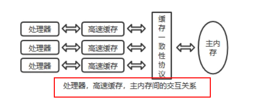
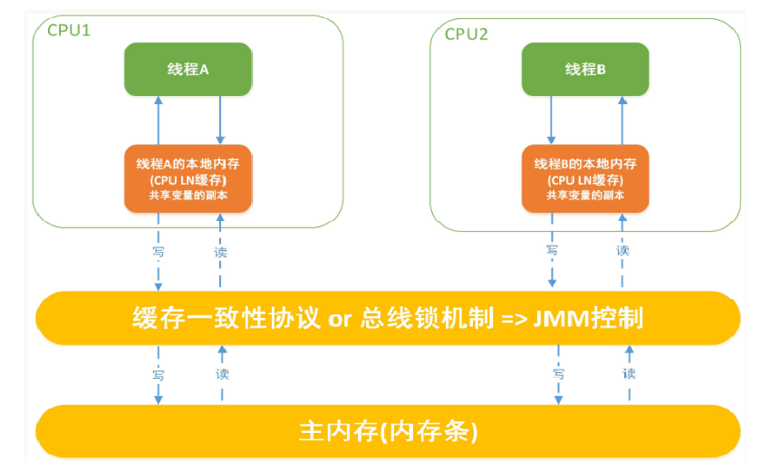
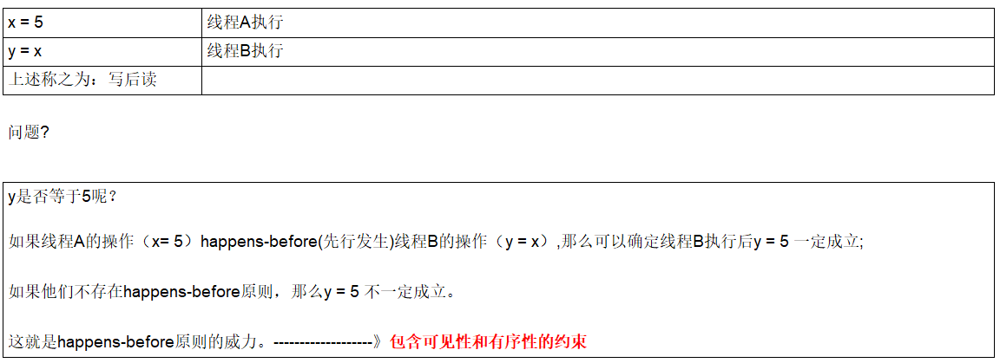

---
# 当前页面内容标题
title: 九、Java内存模型之JMM
# 分类
category:
  - JUC
  - java
# 标签
tag: 
  - java
  - juc
  - 并发编程
sticky: false
# 是否收藏在博客主题的文章列表中，当填入数字时，数字越大，排名越靠前。
star: false
# 是否将该文章添加至文章列表中
article: true
# 是否将该文章添加至时间线中
timeline: true
---

## 九、Java内存模型之JMM

JMM(java内存模型)，由于并发程序要比串行程序复杂很多，其中一个重要原因是并发程序中数据访问**一致性**和**安全性**将会受到严重挑战。**如何保证一个线程可以看到正确的数据呢？**这个问题看起来很白痴。对于串行程序来说，根本就是小菜一碟，如果你读取一个变量，这个变量的值是1，那么你读取到的一定是1，就是这么简单的问题在并行程序中居然变得复杂起来。事实上，如果不加控制地任由线程胡乱并行，即使原本是1的数值，你也可能读到2。因此我们需要在深入了解并行机制的前提下，再定义一种规则，保证多个线程间可以有小弟，正确地协同工作。而JMM也就是为此而生的。

### 1、计算机硬件存储体系

计算机存储结构，从本地磁盘到主存到CPU缓存，也就是从硬盘到内存，到CPU。一般对应的程序的操作就是从数据库查数据到内存然后到CPU进行计算


 因为有这么多级的缓存(cpu和物理主内存的速度不一致的)，CPU的运行并不是直接操作内存而是先把内存里边的数据读到缓存，而内存的读和写操作的时候就会造成不一致的问题



 Java虚拟机规范中试图定义一种Java内存模型（java Memory Model，简称JMM) 来屏蔽掉各种硬件和操作系统的内存访问差异，以实现让Java程序在各种平台下都能达到一致的内存访问效果。推导出我们需要知道JMM

### 2、Java内存模型Java Memory Model

 JMM(Java内存模型Java Memory Model，简称JMM)本身是一种抽象的概念并不真实存在它仅仅描述的是一组约定或规范，通过这组规范定义了程序中(尤其是多线程)各个变量的读写访问方式并决定一个线程对共享变量的写入何时以及如何变成对另一个线程可见，关键技术点都是围绕多线程的原子性、可见性和有序性展开的。

原则： JMM的关键技术点都是围绕多线程的原子性、可见性和有序性展开的

能干嘛？ 1 通过JMM来实现线程和主内存之间的抽象关系。 2 屏蔽各个硬件平台和操作系统的内存访问差异以实现让Java程序在各种平台下都能达到一致的内存访问效果。

### 3、JMM规范下，三大特性

#### 1、可见性


 Java中普通的共享变量不保证可见性，因为数据修改被写入内存的时机是不确定的，多线程并发下很可能出现"脏读"，所以每个线程都有自己的工作内存，线程自己的工作内存中保存了该线程使用到的变量的主内存副本拷贝，线程对变量的所有操作（读取，赋值等 ）都必需在线程自己的工作内存中进行，而不能够直接读写主内存中的变量。不同线程之间也无法直接访问对方工作内存中的变量，线程间变量值的传递均需要通过主内存来完成


线程脏读：如果没有可见性保证


#### 2、原子性

指一个操作是不可中断的，即多线程环境下，操作不能被其他线程干扰

原子性是指**操作是不可分的**，要么全部一起执行，要么不执行。在java中，其表现在对于共享变量的某些操作，是不可分的，必须连续的完成。比如a++，对于共享变量a的操作，实际上会执行3个步骤：

1.读取变量a的值，假如a=1 2.a的值+1，为2 3.将2值赋值给变量a，此时a的值应该为2

这三个操作中任意一个操作，a的值如果被其他线程篡改了，那么都会出现我们不希望出现的结果。所以必须保证这3个操作是原子性的，在操作a++的过程中，其他线程不会改变a的值，如果在上面的过程中出现其他线程修改了a的值，在满足原子性的原则下，上面的操作应该失败。

#### 3、有序性

对于一个线程的执行代码而言，我们总是习惯性认为代码的执行总是从上到下，有序执行。 但为了提供性能，编译器和处理器通常会对指令序列进行重新排序。 指令重排可以保证串行语义一致，但没有义务保证多线程间的语义也一致，即可能产生"脏读"，简单说， 两行以上不相干的代码在执行的时候有可能先执行的不是第一条，不见得是从上到下顺序执行，执行顺序会被优化。


单线程环境里面确保程序最终执行结果和代码顺序执行的结果一致。 处理器在进行重排序时必须要考虑指令之间的数据依赖性 多线程环境中线程交替执行,由于编译器优化重排的存在，两个线程中使用的变量能否保证一致性是无法确定的,结果无法预测


### 4、JMM规范下，多线程对变量的读写过程

#### 1、读取过程

 由于JVM运行程序的实体是线程，而每个线程创建时JVM都会为其创建一个工作内存(有些地方称为栈空间)，工作内存是每个线程的私有数据区域，而Java内存模型中规定所有变量都存储在主内存，主内存是共享内存区域，所有线程都可以访问，但线程对变量的操作(读取赋值等)必须在工作内存中进行，首先要将变量从主内存拷贝到的线程自己的工作内存空间，然后对变量进行操作，操作完成后再将变量写回主内存，不能直接操作主内存中的变量，各个线程中的工作内存中存储着主内存中的变量副本拷贝，因此不同的线程间无法访问对方的工作内存，线程间的通信(传值)必须通过主内存来完成，其简要访问过程如下图:



JMM定义了线程和主内存之间的抽象关系 1 线程之间的共享变量存储在主内存中(从硬件角度来说就是内存条) 2 每个线程都有一个私有的本地工作内存，本地工作内存中存储了该线程用来读/写共享变量的副本(从硬件角度来说就是CPU的缓存，比如寄存器、L1、L2、L3缓存等)

#### 2、小总结

- 我们定义的所有共享变量都储存在物理主内存中
- 每个线程都有自己独立的工作内存，里面保存该线程使用到的变量的副本(主内存中该变量的一份拷贝)
- 线程对共享变量所有的操作都必须先在线程自己的工作内存中进行后写回主内存，不能直接从主内存中读写(不能越级)
- 不同线程之间也无法直接访问其他线程的工作内存中的变量，线程间变量值的传递需要通过主内存来进行(同级不能相互访问)

### 5、JMM规范下，多线程先行发生原则之happens-before

在JMM中，如果一个操作执行的结果需要对另一个操作可见性或者 代码重排序，那么这两个操作之间必须存在happens-before关系。



#### 1、先行发生原则说明

 如果Java内存模型中所有的有序性都仅靠volatile和synchronized来完成，那么有很多操作都将会变得非常啰嗦， 但是我们在编写Java并发代码的时候并没有察觉到这一点。

 我们没有时时、处处、次次，添加volatile和synchronized来完成程序，这是因为Java语言中JMM原则下有一个“先行发生”(Happens-Before)的原则限制和规矩

这个原则非常重要：  它是判断数据是否存在竞争，线程是否安全的非常有用的手段。依赖这个原则，我们可以通过几条简单规则一揽子解决并发环境下两个操 作之间是否可能存在冲突的所有问题，而不需要陷入Java内存模型苦涩难懂的底层编译原理之中。

#### 2、happens-before总原则

- 如果一个操作happens-before另一个操作，那么第一个操作的执行结果将对第二个操作可见，而且第一个操作的执行顺序排在第二个操作之前。
- 两个操作之间存在happens-before关系，并不意味着一定要按照happens-before原则制定的顺序来执行。如果重排序之后的执行结果与按照happens-before关系来执行的结果一致，那么这种重排序并不非法。
  - 1+2+3 = 3+2+1
  - 周一张三周二李四，假如有事情调换班可以的

### 6、happens-before之8条

#### 1、次序规则

一个线程内，按照代码顺序，写在前面的操作先行发生于写在后面的操作；

前一个操作的结果可以被后续的操作获取。讲白点就是前面一个操作把变量X赋值为1，那后面一个操作肯定能知道X已经变成了1。

#### 2、锁定规则

一个unLock操作先行发生于后面((这里的“后面”是指时间上的先后))对同一个锁的lock操作；

```java
public class HappenBeforeDemo
{
    static Object objectLock = new Object();

    public static void main(String[] args) throws InterruptedException
    {
        //对于同一把锁objectLock，threadA一定先unlock同一把锁后B才能获得该锁，   A 先行发生于B
        synchronized (objectLock)
        {

        }
    }
}
```

#### 3、volatile变量规则

对一个volatile变量的写操作先行发生于后面对这个变量的读操作，前面的写对后面的读是可见的，这里的“后面”同样是指时间上的先后。

#### 4、传递规则

如果操作A先行发生于操作B，而操作B又先行发生于操作C，则可以得出操作A先行发生于操作C；

#### 5、线程启动规则(Thread Start Rule)

Thread对象的start()方法先行发生于此线程的每一个动作

#### 6、线程中断规则(Thread Interruption Rule)

对线程interrupt()方法的调用先行发生于被中断线程的代码检测到中断事件的发生；

可以通过Thread.interrupted()检测到是否发生中断

#### 7、线程终止规则(Thread Termination Rule)

线程中的所有操作都先行发生于对此线程的终止检测，我们可以通过Thread::join()方法是否结束、 Thread::isAlive()的返回值等手段检测线程是否已经终止执行。

#### 8、对象终结规则(Finalizer Rule)

一个对象的初始化完成（构造函数执行结束）先行发生于它的finalize()方法的开始

对象没有完成初始化之前，是不能调用finalized()方法的

### 7、案例说明


 假设存在线程A和B，线程A先（时间上的先后）调用了setValue(1)，然后线程B调用了同一个对象的getValue()，那么线程B收到的返回值是什么？

我们就这段简单的代码一次分析happens-before的规则（规则5、6、7、8 可以忽略，因为他们和这段代码毫无关系）： 1 由于两个方法是由不同的线程调用，不在同一个线程中，所以肯定不满足程序次序规则； 2 两个方法都没有使用锁，所以不满足锁定规则； 3 变量不是用volatile修饰的，所以volatile变量规则不满足； 4 传递规则肯定不满足；

 所以我们无法通过happens-before原则推导出线程A happens-before线程B，虽然可以确认在时间上线程A优先于线程B指定，但就是无法确认线程B获得的结果是什么，所以这段代码不是线程安全的。那么怎么修复这段代码呢？

- 把getter/setter方法都定义为synchronized方法
- 把value定义为volatile变量，由于setter方法对value的修改不依赖value的原值，满足volatile关键字使用场景