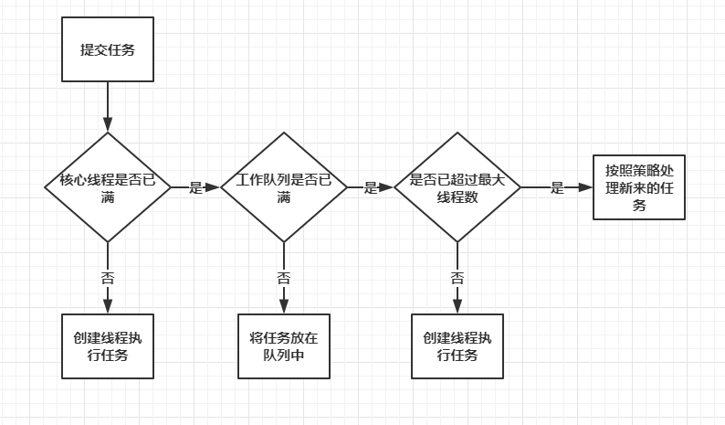
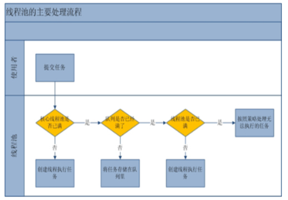
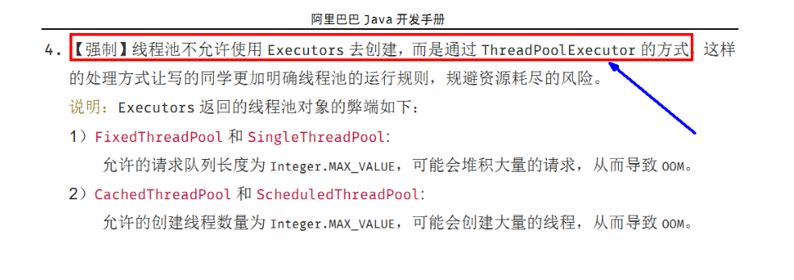
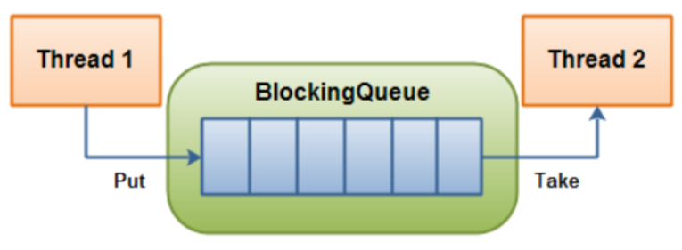

---
# 当前页面内容标题
title: 二、线程池
# 分类
category:
  - JUC
  - java
# 标签
tag: 
  - java
  - juc
  - 并发编程
sticky: false
# 是否收藏在博客主题的文章列表中，当填入数字时，数字越大，排名越靠前。
star: false
# 是否将该文章添加至文章列表中
article: true
# 是否将该文章添加至时间线中
timeline: true
---

## 二、线程池

### 1、什么是线程池

大家用jdbc操作过数据库应该知道，操作数据库需要和数据库建立连接，拿到连接之后才能操作数据库，用完之后销毁。数据库连接的创建和销毁其实是比较耗时的，真正和业务相关的操作耗时是比较短的。每个数据库操作之前都需要创建连接，为了提升系统性能，后来出现了数据库连接池，系统启动的时候，先创建很多连接放在池子里面，使用的时候，直接从连接池中获取一个，使用完毕之后返回到池子里面，继续给其他需要者使用，这其中就省去创建连接的时间，从而提升了系统整体的性能。

线程池和数据库连接池的原理也差不多，创建线程去处理业务，可能创建线程的时间比处理业务的时间还长一些，如果系统能够提前为我们创建好线程，我们需要的时候直接拿来使用，用完之后不是直接将其关闭，而是将其返回到线程中中，给其他需要这使用，这样直接节省了创建和销毁的时间，提升了系统的性能。

简单的说，在使用了线程池之后，创建线程变成了从线程池中获取一个空闲的线程，然后使用，关闭线程变成了将线程归还到线程池。

### 2、为什么用线程池

线程池的优势：

 线程池做的工作主要是控制运行的线程数量，处理过程中将任务放入队列，然后在线程创建后启动这些任务，如果线程数量超过了最大数量，超出数量的线程排队等候，等其他线程执行完毕，再从队列中取出任务来执行。

它的主要特点为：**线程复用;控制最大并发数;管理线程。**

第一：降低资源消耗。通过重复利用已创建的线程降低线程创建和销毁造成的销耗。

第二：提高响应速度。当任务到达时，任务可以不需要等待线程创建就能立即执行。

第三：提高线程的可管理性。线程是稀缺资源，如果无限制的创建，不仅会销耗系统资源，还会降低系统的稳定性，使用线程池可以进行统一的分配，调优和监控

### 3、线程池的使用

#### 1、Executors.newFixedThreadPool(int)

 newFixedThreadPool创建的线程池corePoolSize和maximumPoolSize值是相等的，它使用的是LinkedBlockingQueue执行长期任务性能好，创建一个线程池，一池有N个固定的线程，有固定线程数的线程

```java
public static ExecutorService newFixedThreadPool(int nThreads) {
    return new ThreadPoolExecutor(nThreads, nThreads,
                                  0L, TimeUnit.MILLISECONDS,
                                  new LinkedBlockingQueue<Runnable>());
}
```

#### 2、Executors.newSingleThreadExecutor()

 newSingleThreadExecutor 创建的线程池corePoolSize和maximumPoolSize值都是1，它使用的是LinkedBlockingQueue一个任务一个任务的执行，一池一线程

```java
public static ExecutorService newSingleThreadExecutor() {
    return new FinalizableDelegatedExecutorService
        (new ThreadPoolExecutor(1, 1,
                                0L, TimeUnit.MILLISECONDS,
                                new LinkedBlockingQueue<Runnable>()));
}
```

#### 3、Executors.newCachedThreadPool()

 newCachedThreadPool创建的线程池将corePoolSize设置为0，将maximumPoolSize设置为Integer.MAX_VALUE，它使用的是SynchronousQueue，也就是说来了任务就创建线程运行，当线程空闲超过60秒，就销毁线程。

执行很多短期异步任务，线程池根据需要创建新线程，但在先前构建的线程可用时将重用它们。可扩容，遇强则强

```java
public static ExecutorService newCachedThreadPool() {
    return new ThreadPoolExecutor(0, Integer.MAX_VALUE,
                                  60L, TimeUnit.SECONDS,
                                  new SynchronousQueue<Runnable>());
}
import java.util.Arrays;
import java.util.List;
import java.util.concurrent.Executor;
import java.util.concurrent.ExecutorService;
import java.util.concurrent.Executors;

/**
 * 线程池
 * Arrays
 * Collections
 * Executors
 */
public class MyThreadPoolDemo {

    public static void main(String[] args) {
        //List list = new ArrayList();
        //List list = Arrays.asList("a","b");
        //固定数的线程池，一池五线程

//       ExecutorService threadPool =  Executors.newFixedThreadPool(5); //一个银行网点，5个受理业务的窗口
//       ExecutorService threadPool =  Executors.newSingleThreadExecutor(); //一个银行网点，1个受理业务的窗口
       ExecutorService threadPool =  Executors.newCachedThreadPool(); //一个银行网点，可扩展受理业务的窗口

        //10个顾客请求
        try {
            for (int i = 1; i <=10; i++) {
                threadPool.execute(()->{
                    System.out.println(Thread.currentThread().getName()+"\t 办理业务");
                });
            }
        } catch (Exception e) {
            e.printStackTrace();
        } finally {
            threadPool.shutdown();
        }

    }
}
```

### 4、ThreadPoolExecutor底层原理



**举个例子，加深理解：**

咱们作为开发者，上面都有开发主管，主管下面带领几个小弟干活，CTO给主管授权说，你可以招聘5个小弟干活，新来任务，如果小弟还不到吴哥，立即去招聘一个来干这个新来的任务，当5个小弟都招来了，再来任务之后，将任务记录到一个表格中，表格中最多记录100个，小弟们会主动去表格中获取任务执行，如果5个小弟都在干活，并且表格中也记录满了，那你可以将小弟扩充到20个，如果20个小弟都在干活，并且存放任务的表也满了，产品经理再来任务后，是直接拒绝，还是让产品自己干，这个由你自己决定，小弟们都尽心尽力在干活，任务都被处理完了，突然公司业绩下滑，几个员工没事干，打酱油，为了节约成本，CTO主管把小弟控制到5人，其他15个人直接被干掉了。所以作为小弟们，别让自己闲着，多干活。

**原理：**先找几个人干活，大家都忙于干活，任务太多可以排期，排期的任务太多了，再招一些人来干活，最后干活的和排期都达到上层领导要求的上限了，那需要采取一些其他策略进行处理了。对于长时间不干活的人，考虑将其开掉，节约资源和成本。


```java
public ThreadPoolExecutor(int corePoolSize,
                          int maximumPoolSize,
                          long keepAliveTime,
                          TimeUnit unit,
                          BlockingQueue<Runnable> workQueue,
                          ThreadFactory threadFactory,
                          RejectedExecutionHandler handler) {
    if (corePoolSize < 0 ||
        maximumPoolSize <= 0 ||
        maximumPoolSize < corePoolSize ||
        keepAliveTime < 0)
        throw new IllegalArgumentException();
    if (workQueue == null || threadFactory == null || handler == null)
        throw new NullPointerException();
    this.corePoolSize = corePoolSize;
    this.maximumPoolSize = maximumPoolSize;
    this.workQueue = workQueue;
    this.keepAliveTime = unit.toNanos(keepAliveTime);
    this.threadFactory = threadFactory;
    this.handler = handler;
}
```

1. corePoolSize：核心线程大小，当提交一个任务到线程池时，线程池会创建一个线程来执行任务，即使有其他空闲线程可以处理任务也会创新线程，等到工作的线程数大于核心线程数时就不会在创建了。如果调用了线程池的`prestartAllCoreThreads`方法，线程池会提前把核心线程都创造好，并启动
2. maximumPoolSize：线程池允许创建的最大线程数，此值必须大于等于1。如果队列满了，并且以创建的线程数小于最大线程数，则线程池会再创建新的线程执行任务。如果我们使用了无界队列，那么所有的任务会加入队列，这个参数就没有什么效果了
3. keepAliveTime：多余的空闲线程的存活时间,当前池中线程数量超过corePoolSize时，当空闲时间,达到keepAliveTime时，多余线程会被销毁直到只剩下corePoolSize个线程为止，如果任务很多，并且每个任务的执行时间比较短，避免线程重复创建和回收，可以调大这个时间，提高线程的利用率
4. unit：keepAliveTIme的时间单位，可以选择的单位有天、小时、分钟、毫秒、微妙、千分之一毫秒和纳秒。类型是一个枚举`java.util.concurrent.TimeUnit`，这个枚举也经常使用
5. workQueue：任务队列，被提交但尚未被执行的任务，用于缓存待处理任务的阻塞队列
6. threadFactory：表示生成线程池中工作线程的线程工厂，用于创建线程，一般默认的即可，可以通过线程工厂给每个创建出来的线程设置更有意义的名字
7. handler：拒绝策略，表示当队列满了，并且工作线程大于等于线程池的最大线程数（maximumPoolSize）时如何来拒绝请求执行的runnable的策略




**调用线程池的execute方法处理任务，执行execute方法的过程：**

1. 判断线程池中运行的线程数是否小于corepoolsize，是：则创建新的线程来处理任务，否：执行下一步
2. 试图将任务添加到workQueue指定的队列中，如果无法添加到队列，进入下一步
3. 判断线程池中运行的线程数是否小于`maximumPoolSize`，是：则新增线程处理当前传入的任务，否：将任务传递给`handler`对象`rejectedExecution`方法处理

```
1、在创建了线程池后，开始等待请求。
2、当调用execute()方法添加一个请求任务时，线程池会做出如下判断：
  2.1如果正在运行的线程数量小于corePoolSize，那么马上创建线程运行这个任务；
  2.2如果正在运行的线程数量大于或等于corePoolSize，那么将这个任务放入队列；
  2.3如果这个时候队列满了且正在运行的线程数量还小于maximumPoolSize，那么还是要创建非核心线程立刻运行这个任务；
  2.4如果队列满了且正在运行的线程数量大于或等于maximumPoolSize，那么线程池会启动饱和拒绝策略来执行。
3、当一个线程完成任务时，它会从队列中取下一个任务来执行。
4、当一个线程无事可做超过一定的时间（keepAliveTime）时，线程会判断：
    如果当前运行的线程数大于corePoolSize，那么这个线程就被停掉。
    所以线程池的所有任务完成后，它最终会收缩到corePoolSize的大小。
```

### 5、拒绝策略？生产中如设置合理参数

#### 1、线程池的拒绝策略

 等待队列已经排满了，再也塞不下新任务了，同时，线程池中的max线程也达到了，无法继续为新任务服务。这个是时候我们就需要拒绝策略机制合理的处理这个问题。

#### 2、JDK内置的拒绝策略

AbortPolicy(默认)：直接抛出RejectedExecutionException异常阻止系统正常运行

CallerRunsPolicy：“调用者运行”一种调节机制，该策略既不会抛弃任务，也不会抛出异常，而是将某些任务回退到调用者，从而降低新任务的流量。

DiscardOldestPolicy：抛弃队列中等待最久的任务，然后把当前任务加入队列中尝试再次提交当前任务。

DiscardPolicy：该策略默默地丢弃无法处理的任务，不予任何处理也不抛出异常。如果允许任务丢失，这是最好的一种策略。

**以上内置拒绝策略均实现了RejectedExecutionHandle接口**

```java
import java.util.concurrent.ArrayBlockingQueue;
import java.util.concurrent.Executors;
import java.util.concurrent.ThreadPoolExecutor;
import java.util.concurrent.TimeUnit;
import java.util.concurrent.atomic.AtomicInteger;

public class Demo5 {
    static class Task implements Runnable {
        String name;
        public Task(String name) {
            this.name = name;
        }
        @Override
        public void run() {
            System.out.println(Thread.currentThread().getName() + "处理" + this.name);
            try {
                TimeUnit.SECONDS.sleep(5);
            } catch (InterruptedException e) {
                e.printStackTrace();
            }
        }
        @Override
        public String toString() {
            return "Task{" +
                    "name='" + name + '\'' +
                    '}';
        }
    }
    public static void main(String[] args) {
        ThreadPoolExecutor executor = new ThreadPoolExecutor(1,
                1,
                60L,
                TimeUnit.SECONDS,
                new ArrayBlockingQueue<Runnable>(1),
                Executors.defaultThreadFactory(),
                (r, executors) -> {
                    //自定义饱和策略
                    //记录一下无法处理的任务
                    System.out.println("无法处理的任务：" + r.toString());
                });
        for (int i = 0; i < 5; i++) {
            executor.execute(new Task("任务-" + i));
        }
        executor.shutdown();
    }
}
无法处理的任务：Task{name='任务-2'}
无法处理的任务：Task{name='任务-3'}
pool-1-thread-1处理任务-0
无法处理的任务：Task{name='任务-4'}
pool-1-thread-1处理任务-1
```

输出结果中可以看到有3个任务进入了饱和策略中，记录了任务的日志，对于无法处理多任务，我们最好能够记录一下，让开发人员能够知道。任务进入了饱和策略，说明线程池的配置可能不是太合理，或者机器的性能有限，需要做一些优化调整。

#### 3、生产中合理的设置参数

要想合理的配置线程池，需要先分析任务的特性，可以从以下几个角度分析：

- 任务的性质：CPU密集型任务、IO密集型任务和混合型任务
- 任务的优先级：高、中、低
- 任务的执行时间：长、中、短
- 任务的依赖性：是否依赖其他的系统资源，如数据库连接。

性质不同任务可以用不同规模的线程池分开处理。CPU密集型任务应该尽可能小的线程，如配置cpu数量+1个线程的线程池。由于IO密集型任务并不是一直在执行任务，不能让cpu闲着，则应配置尽可能多的线程，如：cup数量*2。混合型的任务，如果可以拆分，将其拆分成一个CPU密集型任务和一个IO密集型任务，只要这2个任务执行的时间相差不是太大，那么分解后执行的吞吐量将高于串行执行的吞吐量。可以通过`Runtime.getRuntime().availableProcessors()`方法获取cpu数量。优先级不同任务可以对线程池采用优先级队列来处理，让优先级高的先执行。

使用队列的时候建议使用有界队列，有界队列增加了系统的稳定性，如果采用无解队列，任务太多的时候可能导致系统OOM，直接让系统宕机。

线程池汇总线程大小对系统的性能有一定的影响，我们的目标是希望系统能够发挥最好的性能，过多或者过小的线程数量无法有消息的使用机器的性能。咋Java Concurrency inPractice书中给出了估算线程池大小的公式：

```java
Ncpu = CUP的数量
Ucpu = 目标CPU的使用率，0<=Ucpu<=1
W/C = 等待时间与计算时间的比例
为保存处理器达到期望的使用率，最有的线程池的大小等于：
Nthreads = Ncpu × Ucpu × (1+W/C)
```

1. CPU密集型
   
   ```java
   // 查看CPU核数
   System. out .println(Runtime. getRuntime ().availableProcessors());
   ```
   
   

2. IO密集型
   
   1. 由于IO密集型任务线程并不是一直在执行任务，则应配置尽可能多的线程，如**CPU核数 \* 2** 。
   2. 

看公司业务是CPU密集型还是IO密集型的，这两种不一样，来决定线程池线程数的最佳合理配置数。

### 6、超级大坑 在工作中单一的/固定数的/可变的三种创建线程池的方法哪个用的多？

答案是**一个都不用**，我们工作中只能使用自定义的



### 7、自定义线程池

```java
import java.util.Arrays;
import java.util.List;
import java.util.concurrent.*;

/**
 * 线程池
 * Arrays
 * Collections
 * Executors
 */
public class MyThreadPoolDemo {

    public static void main(String[] args) {
        ExecutorService threadPool = new ThreadPoolExecutor(
                2,
                5,
                2L,
                TimeUnit.SECONDS,
                new ArrayBlockingQueue<Runnable>(3),
                Executors.defaultThreadFactory(),
                //new ThreadPoolExecutor.AbortPolicy()
                //new ThreadPoolExecutor.CallerRunsPolicy()
                //new ThreadPoolExecutor.DiscardOldestPolicy()
                new ThreadPoolExecutor.DiscardPolicy()
        );
        //10个顾客请求
        try {
            for (int i = 1; i <= 10; i++) {
                threadPool.execute(() -> {
                    System.out.println(Thread.currentThread().getName() + "\t 办理业务");
                });
            }
        } catch (Exception e) {
            e.printStackTrace();
        } finally {
            threadPool.shutdown();
        }

    }

    private static void threadPool() {
        //List list = new ArrayList();
        //List list = Arrays.asList("a","b");
        //固定数的线程池，一池五线程

//       ExecutorService threadPool =  Executors.newFixedThreadPool(5); //一个银行网点，5个受理业务的窗口
//       ExecutorService threadPool =  Executors.newSingleThreadExecutor(); //一个银行网点，1个受理业务的窗口
        ExecutorService threadPool = Executors.newCachedThreadPool(); //一个银行网点，可扩展受理业务的窗口

        //10个顾客请求
        try {
            for (int i = 1; i <= 10; i++) {
                threadPool.execute(() -> {
                    System.out.println(Thread.currentThread().getName() + "\t 办理业务");
                });
            }
        } catch (Exception e) {
            e.printStackTrace();
        } finally {
            threadPool.shutdown();
        }
    }
}
```

### 8、线程池中的2个关闭方法

线程池提供了2个关闭方法：`shutdown`和`shutdownNow`，当调用者两个方法之后，线程池会遍历内部的工作线程，然后调用每个工作线程的interrrupt方法给线程发送中断信号，内部如果无法响应中断信号的可能永远无法终止，所以如果内部有无线循环的，最好在循环内部检测一下线程的中断信号，合理的退出。调用者两个方法中任意一个，线程池的`isShutdown`方法就会返回true，当所有的任务线程都关闭之后，才表示线程池关闭成功，这时调用`isTerminaed`方法会返回true。

调用`shutdown`方法之后，线程池将不再接口新任务，内部会将所有已提交的任务处理完毕，处理完毕之后，工作线程自动退出。

而调用`shutdownNow`方法后，线程池会将还未处理的（在队里等待处理的任务）任务移除，将正在处理中的处理完毕之后，工作线程自动退出。

至于调用哪个方法来关闭线程，应该由提交到线程池的任务特性决定，多数情况下调用`shutdown`方法来关闭线程池，如果任务不一定要执行完，则可以调用`shutdownNow`方法。

### 9、BlockingQueue阻塞队列

#### 1、栈与队列

栈：先进后出，后进先出

队列：先进先出

#### 2、阻塞队列

阻塞：必须要阻塞/不得不阻塞



线程1往阻塞队列里添加元素，线程2从阻塞队列里移除元素

当队列是空的，从队列中获取元素的操作将会被阻塞

当队列是满的，从队列中添加元素的操作将会被阻塞

试图从空的队列中获取元素的线程将会被阻塞，直到其他线程往空的队列插入新的元素

试图向已满的队列中添加新元素的线程将会被阻塞，直到其他线程从队列中移除一个或多个元素或者完全清空，使队列变得空闲起来并后续新增


#### 3、种类分析

**ArrayBlockingQueue**：是一个基于数组结构的有界阻塞队列，此队列按照先进先出原则对元素进行排序

**LinkedBlockingQueue**：由链表结构组成的有界（但大小默认值为integer.MAX_VALUE）阻塞队列，此队列按照先进先出排序元素，吞吐量通常要高于ArrayBlockingQueue。静态工厂方法`Executors.newFixedThreadPool`使用了这个队列。

PriorityBlockingQueue：支持优先级排序的无界阻塞队列。

DelayQueue：使用优先级队列实现的延迟无界阻塞队列。

**SynchronousQueue**：不存储元素的阻塞队列，也即单个元素的队列,每个插入操作必须等到另外一个线程调用移除操作，否则插入操作一直处理阻塞状态，吞吐量通常要高于LinkedBlockingQueue，静态工厂方法`Executors.newCachedThreadPool`使用这个队列

LinkedTransferQueue：由链表组成的无界阻塞队列。

LinkedBlockingDeque：由链表组成的双向阻塞队列。

```java
import java.util.concurrent.*;

public class Demo2 {
    public static void main(String[] args) {
        ExecutorService executor = Executors.newCachedThreadPool();
        for (int i = 0; i < 50; i++) {
            int j = i;
            String taskName = "任务" + j;
            executor.execute(() -> {
                System.out.println(Thread.currentThread().getName() + "处理" + taskName);
                //模拟任务内部处理耗时
                try {
                    TimeUnit.SECONDS.sleep(1);
                } catch (InterruptedException e) {
                    e.printStackTrace();
                }
            });
        }
        executor.shutdown();
    }
}
```

代码中使用`Executors.newCachedThreadPool()`创建线程池，看一下的源码：

```java
public static ExecutorService newCachedThreadPool() {
        return new ThreadPoolExecutor(0, Integer.MAX_VALUE,
                                      60L, TimeUnit.SECONDS,
                                      new SynchronousQueue<Runnable>());
    }
```

从输出中可以看出，系统创建了50个线程处理任务，代码中使用了`SynchronousQueue`同步队列，这种队列比较特殊，放入元素必须要有另外一个线程去获取这个元素，否则放入元素会失败或者一直阻塞在那里直到有线程取走，示例中任务处理休眠了指定的时间，导致已创建的工作线程都忙于处理任务，所以新来任务之后，将任务丢入同步队列会失败，丢入队列失败之后，会尝试新建线程处理任务。使用上面的方式创建线程池需要注意，如果需要处理的任务比较耗时，会导致新来的任务都会创建新的线程进行处理，可能会导致创建非常多的线程，最终耗尽系统资源，触发OOM。

**PriorityBlockingQueue优先级队列的线程池**

```java
import java.util.concurrent.*;

public class Demo3 {
    static class Task implements Runnable, Comparable<Task> {
        private int i;
        private String name;
        public Task(int i, String name) {
            this.i = i;
            this.name = name;
        }
        @Override
        public void run() {
            System.out.println(Thread.currentThread().getName() + "处理" + this.name);
        }
        @Override
        public int compareTo(Task o) {
            return Integer.compare(o.i, this.i);
        }
    }
    public static void main(String[] args) {
        ExecutorService executor = new ThreadPoolExecutor(1, 1,
                60L, TimeUnit.SECONDS,
                new PriorityBlockingQueue());
        for (int i = 0; i < 10; i++) {
            String taskName = "任务" + i;
            executor.execute(new Task(i, taskName));
        }
        for (int i = 100; i >= 90; i--) {
            String taskName = "任务" + i;
            executor.execute(new Task(i, taskName));
        }
        executor.shutdown();
    }
}
```

输出中，除了第一个任务，其他任务按照优先级高低按顺序处理。原因在于：创建线程池的时候使用了优先级队列，进入队列中的任务会进行排序，任务的先后顺序由Task中的i变量决定。向`PriorityBlockingQueue`加入元素的时候，内部会调用代码中Task的`compareTo`方法决定元素的先后顺序。

#### 4、BlockingQueue核心方法


```java
import java.util.ArrayList;
import java.util.List;
import java.util.concurrent.ArrayBlockingQueue;
import java.util.concurrent.BlockingQueue;
import java.util.concurrent.TimeUnit;

/**
 * 阻塞队列
 */
public class BlockingQueueDemo {

    public static void main(String[] args) throws InterruptedException {

//        List list = new ArrayList();

        BlockingQueue<String> blockingQueue = new ArrayBlockingQueue<>(3);
        //第一组
//        System.out.println(blockingQueue.add("a"));
//        System.out.println(blockingQueue.add("b"));
//        System.out.println(blockingQueue.add("c"));
//        System.out.println(blockingQueue.element());

        //System.out.println(blockingQueue.add("x"));
//        System.out.println(blockingQueue.remove());
//        System.out.println(blockingQueue.remove());
//        System.out.println(blockingQueue.remove());
//        System.out.println(blockingQueue.remove());
//    第二组
//        System.out.println(blockingQueue.offer("a"));
//        System.out.println(blockingQueue.offer("b"));
//        System.out.println(blockingQueue.offer("c"));
//        System.out.println(blockingQueue.offer("x"));
//        System.out.println(blockingQueue.poll());
//        System.out.println(blockingQueue.poll());
//        System.out.println(blockingQueue.poll());
//        System.out.println(blockingQueue.poll());
//    第三组        
//         blockingQueue.put("a");
//         blockingQueue.put("b");
//         blockingQueue.put("c");
//         //blockingQueue.put("x");
//        System.out.println(blockingQueue.take());
//        System.out.println(blockingQueue.take());
//        System.out.println(blockingQueue.take());
//        System.out.println(blockingQueue.take());

//    第四组        
        System.out.println(blockingQueue.offer("a"));
        System.out.println(blockingQueue.offer("b"));
        System.out.println(blockingQueue.offer("c"));
        System.out.println(blockingQueue.offer("a",3L, TimeUnit.SECONDS));

    }
}
```

### 10、扩展线程池

虽然jdk提供了`ThreadPoolExecutor`这个高性能线程池，但是如果我们自己想在这个线程池上面做一些扩展，比如，监控每个任务执行的开始时间，结束时间，或者一些其他自定义的功能，我们应该怎么办？

这个jdk已经帮我们想到了，`ThreadPoolExecutor`内部提供了几个方法`beforeExecute`、`afterExecute`、`terminated`，可以由开发人员自己去这些方法。看一下线程池内部的源码：

```java
try {
    beforeExecute(wt, task);//任务执行之前调用的方法
    Throwable thrown = null;
    try {
        task.run();
    } catch (RuntimeException x) {
        thrown = x;
        throw x;
    } catch (Error x) {
        thrown = x;
        throw x;
    } catch (Throwable x) {
        thrown = x;
        throw new Error(x);
    } finally {
        afterExecute(task, thrown);//任务执行完毕之后调用的方法
    }
} finally {
    task = null;
    w.completedTasks++;
    w.unlock();
}
```

**beforeExecute：任务执行之前调用的方法，有2个参数，第1个参数是执行任务的线程，第2个参数是任务**

```java
protected void beforeExecute(Thread t, Runnable r) { }
```

**afterExecute：任务执行完成之后调用的方法，2个参数，第1个参数表示任务，第2个参数表示任务执行时的异常信息，如果无异常，第二个参数为null**

```java
protected void afterExecute(Runnable r, Throwable t) { }
```

**terminated：线程池最终关闭之后调用的方法。所有的工作线程都退出了，最终线程池会退出，退出时调用该方法**

```java
import java.util.concurrent.ArrayBlockingQueue;
import java.util.concurrent.Executors;
import java.util.concurrent.ThreadPoolExecutor;
import java.util.concurrent.TimeUnit;

public class Demo6 {
    static class Task implements Runnable {
        String name;
        public Task(String name) {
            this.name = name;
        }
        @Override
        public void run() {
            System.out.println(Thread.currentThread().getName() + "处理" + this.name);
            try {
                TimeUnit.SECONDS.sleep(2);
            } catch (InterruptedException e) {
                e.printStackTrace();
            }
        }
        @Override
        public String toString() {
            return "Task{" +
                    "name='" + name + '\'' +
                    '}';
        }
    }
    public static void main(String[] args) throws InterruptedException {
        ThreadPoolExecutor executor = new ThreadPoolExecutor(10,
                10,
                60L,
                TimeUnit.SECONDS,
                new ArrayBlockingQueue<Runnable>(1),
                Executors.defaultThreadFactory(),
                (r, executors) -> {
                    //自定义饱和策略
                    //记录一下无法处理的任务
                    System.out.println("无法处理的任务：" + r.toString());
                }) {
            @Override
            protected void beforeExecute(Thread t, Runnable r) {
                System.out.println(System.currentTimeMillis() + "," + t.getName() + ",开始执行任务:" + r.toString());
            }
            @Override
            protected void afterExecute(Runnable r, Throwable t) {
                System.out.println(System.currentTimeMillis() + "," + Thread.currentThread().getName() + ",任务:" + r.toString() + "，执行完毕!");
            }
            @Override
            protected void terminated() {
                System.out.println(System.currentTimeMillis() + "," + Thread.currentThread().getName() + "，关闭线程池!");
            }
        };
        for (int i = 0; i < 10; i++) {
            executor.execute(new Task("任务-" + i));
        }
        TimeUnit.SECONDS.sleep(1);
        executor.shutdown();
    }
}
1564324574847,pool-1-thread-1,开始执行任务:Task{name='任务-0'}
1564324574850,pool-1-thread-3,开始执行任务:Task{name='任务-2'}
pool-1-thread-3处理任务-2
1564324574849,pool-1-thread-2,开始执行任务:Task{name='任务-1'}
pool-1-thread-2处理任务-1
1564324574848,pool-1-thread-5,开始执行任务:Task{name='任务-4'}
pool-1-thread-5处理任务-4
1564324574848,pool-1-thread-4,开始执行任务:Task{name='任务-3'}
pool-1-thread-4处理任务-3
1564324574850,pool-1-thread-7,开始执行任务:Task{name='任务-6'}
pool-1-thread-7处理任务-6
1564324574850,pool-1-thread-6,开始执行任务:Task{name='任务-5'}
1564324574851,pool-1-thread-8,开始执行任务:Task{name='任务-7'}
pool-1-thread-8处理任务-7
pool-1-thread-1处理任务-0
pool-1-thread-6处理任务-5
1564324574851,pool-1-thread-10,开始执行任务:Task{name='任务-9'}
pool-1-thread-10处理任务-9
1564324574852,pool-1-thread-9,开始执行任务:Task{name='任务-8'}
pool-1-thread-9处理任务-8
1564324576851,pool-1-thread-2,任务:Task{name='任务-1'}，执行完毕!
1564324576851,pool-1-thread-3,任务:Task{name='任务-2'}，执行完毕!
1564324576852,pool-1-thread-1,任务:Task{name='任务-0'}，执行完毕!
1564324576852,pool-1-thread-4,任务:Task{name='任务-3'}，执行完毕!
1564324576852,pool-1-thread-8,任务:Task{name='任务-7'}，执行完毕!
1564324576852,pool-1-thread-7,任务:Task{name='任务-6'}，执行完毕!
1564324576852,pool-1-thread-5,任务:Task{name='任务-4'}，执行完毕!
1564324576853,pool-1-thread-6,任务:Task{name='任务-5'}，执行完毕!
1564324576853,pool-1-thread-10,任务:Task{name='任务-9'}，执行完毕!
1564324576853,pool-1-thread-9,任务:Task{name='任务-8'}，执行完毕!
1564324576853,pool-1-thread-9，关闭线程池!
```

从输出结果中可以看到，每个需要执行的任务打印了3行日志，执行前由线程池的`beforeExecute`打印，执行时会调用任务的`run`方法，任务执行完毕之后，会调用线程池的`afterExecute`方法，从每个任务的首尾2条日志中可以看到每个任务耗时2秒左右。线程池最终关闭之后调用了`terminated`方法。