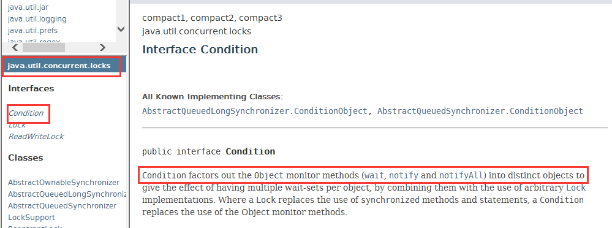

---
# 当前页面内容标题
title: 五、线程间通信
# 分类
category:
  - JUC
  - java
# 标签
tag: 
  - java
  - juc
  - 并发编程
sticky: false
# 是否收藏在博客主题的文章列表中，当填入数字时，数字越大，排名越靠前。
star: false
# 是否将该文章添加至文章列表中
article: true
# 是否将该文章添加至时间线中
timeline: true
---

## 五、线程间通信

### 1、面试题：两个线程打印

两个线程，一个线程打印1-52，另一个打印字母A-Z打印顺序为12A34B...5152Z

#### 1、synchronized实现

```java
package com.xue.thread;

import java.util.concurrent.locks.Condition;
import java.util.concurrent.locks.Lock;
import java.util.concurrent.locks.ReentrantLock;


class ShareDataOne//资源类{
  private int number = 0;//初始值为零的一个变量

  public synchronized void increment() throws InterruptedException {
     //1判断
     if(number !=0 ) {
       this.wait();
     }
     //2干活
     ++number;
     System.out.println(Thread.currentThread().getName()+"\t"+number);
     //3通知
     this.notifyAll();
  }

  public synchronized void decrement() throws InterruptedException {
     // 1判断
     if (number == 0) {
       this.wait();
     }
     // 2干活
     --number;
     System.out.println(Thread.currentThread().getName() + "\t" + number);
     // 3通知
     this.notifyAll();
  }
}

/**
 * 
 * @Description:
 *现在两个线程，
 * 可以操作初始值为零的一个变量，
 * 实现一个线程对该变量加1，一个线程对该变量减1，
 * 交替，来10轮。 
 * @author xialei
 *
 *  * 笔记：Java里面如何进行工程级别的多线程编写
 * 1 多线程变成模板（套路）-----上
 *     1.1  线程    操作    资源类  
 *     1.2  高内聚  低耦合
 * 2 多线程变成模板（套路）-----下
 *     2.1  判断
 *     2.2  干活
 *     2.3  通知

 */
public class NotifyWaitDemoOne{
  public static void main(String[] args){
     ShareDataOne sd = new ShareDataOne();
     new Thread(() -> {
       for (int i = 1; i < 10; i++) {
          try {
            sd.increment();
          } catch (InterruptedException e) {
            // TODO Auto-generated catch block
            e.printStackTrace();
          }
       }
     }, "A").start();
     new Thread(() -> {
       for (int i = 1; i < 10; i++) {
          try {
            sd.decrement();
          } catch (InterruptedException e) {
            // TODO Auto-generated catch block
            e.printStackTrace();
          }
       }
     }, "B").start();
  }
}
/*
 * * 
 * 2 多线程变成模板（套路）-----下
 *     2.1  判断
 *     2.2  干活
 *     2.3  通知
 * 3 防止虚假唤醒用while
 * 
 * 
 * */
```

#### 2、换成4个线程

 换成4个线程会导致错误，虚假唤醒

 原因：在java多线程判断时，不能用if，程序出事出在了判断上面，

突然有一添加的线程进到if了，突然中断了交出控制权，

没有进行验证，而是直接走下去了，加了两次，甚至多次

#### 3、4个线程解决方案

解决虚假唤醒：查看API，java.lang.Object


中断和虚假唤醒是可能产生的，所以要用loop循环，if只判断一次，while是只要唤醒就要拉回来再判断一次。if换成while

#### 4、java8新版实现



```java
class BoundedBuffer {
   final Lock lock = new ReentrantLock();
   final Condition notFull  = lock.newCondition(); 
   final Condition notEmpty = lock.newCondition(); 

   final Object[] items = new Object[100];
   int putptr, takeptr, count;

   public void put(Object x) throws InterruptedException {
     lock.lock();
     try {
       while (count == items.length)
         notFull.await();
       items[putptr] = x;
       if (++putptr == items.length) putptr = 0;
       ++count;
       notEmpty.signal();
     } finally {
       lock.unlock();
     }
   }
package com.xue.thread;

import java.util.concurrent.locks.Condition;
import java.util.concurrent.locks.Lock;
import java.util.concurrent.locks.ReentrantLock;

import org.omg.IOP.Codec;


class ShareData//资源类
{
  private int number = 0;//初始值为零的一个变量

  private Lock lock = new ReentrantLock();
  private Condition condition  = lock.newCondition(); 

  public  void increment() throws InterruptedException 
  {

      lock.lock();
         try {
          //判断
          while(number!=0) {
            condition.await();
          }
          //干活
          ++number;
          System.out.println(Thread.currentThread().getName()+" \t "+number);
          //通知
          condition.signalAll();
     } catch (Exception e) {
       e.printStackTrace();
     } finally {
       lock.unlock();
     }

  }


  public  void decrement() throws InterruptedException 
  {

      lock.lock();
         try {
          //判断
          while(number!=1) {
            condition.await();
          }
          //干活
          --number;
          System.out.println(Thread.currentThread().getName()+" \t "+number);
          //通知
          condition.signalAll();
     } catch (Exception e) {
       e.printStackTrace();
     } finally {
       lock.unlock();
     }

  }

  /*public synchronized void increment() throws InterruptedException 
  {
     //判断
     while(number!=0) {
       this.wait();
     }
     //干活
     ++number;
     System.out.println(Thread.currentThread().getName()+" \t "+number);
     //通知
     this.notifyAll();;
  }

  public synchronized void decrement() throws InterruptedException 
  {
     //判断
     while(number!=1) {
       this.wait();
     }
     //干活
     --number;
     System.out.println(Thread.currentThread().getName()+" \t "+number);
     //通知
     this.notifyAll();
  }*/
}

/**
 * 
 * @Description:
 *现在两个线程，
 * 可以操作初始值为零的一个变量，
 * 实现一个线程对该变量加1，一个线程对该变量减1，
 * 交替，来10轮。 
 *
 *  * 笔记：Java里面如何进行工程级别的多线程编写
 * 1 多线程变成模板（套路）-----上
 *     1.1  线程    操作    资源类  
 *     1.2  高内聚  低耦合
 * 2 多线程变成模板（套路）-----下
 *     2.1  判断
 *     2.2  干活
 *     2.3  通知

 */
public class NotifyWaitDemo
{
  public static void main(String[] args)
  {
     ShareData sd = new ShareData();
     new Thread(() -> {

       for (int i = 1; i <= 10; i++) {
          try {
            sd.increment();
          } catch (InterruptedException e) {
            e.printStackTrace();
          }
       }
     }, "A").start();

     new Thread(() -> {

       for (int i = 1; i <= 10; i++) {
          try {
            sd.decrement();
          } catch (InterruptedException e) {
            e.printStackTrace();
          }
       }
     }, "B").start();
     new Thread(() -> {

       for (int i = 1; i <= 10; i++) {
          try {
            sd.increment();
          } catch (InterruptedException e) {
            e.printStackTrace();
          }
       }
     }, "C").start();
     new Thread(() -> {

       for (int i = 1; i <= 10; i++) {
          try {
            sd.decrement();
          } catch (InterruptedException e) {
            e.printStackTrace();
          }
       }
     }, "D").start();

  }
}

/*
 * * 
 * 2 多线程变成模板（套路）-----下
 *     2.1  判断
 *     2.2  干活
 *     2.3  通知
 * 3 防止虚假唤醒用while
 * 
 * 
 * */
```

### 2、线程间定制化调用通信

1、有顺序通知，需要有标识位

2、有一个锁Lock，3把钥匙Condition

3、判断标志位

4、输出线程名+第几次+第几轮

5、修改标志位，通知下一个

```java
package com.xue.thread;

import java.util.concurrent.locks.Condition;
import java.util.concurrent.locks.Lock;
import java.util.concurrent.locks.ReentrantLock;


class ShareResource
{
  private int number = 1;//1:A 2:B 3:C 
  private Lock lock = new ReentrantLock();
  private Condition c1 = lock.newCondition();
  private Condition c2 = lock.newCondition();
  private Condition c3 = lock.newCondition();

  public void print5(int totalLoopNumber)
  {
     lock.lock();
     try 
     {
       //1 判断
       while(number != 1)
       {
          //A 就要停止
          c1.await();
       }
       //2 干活
       for (int i = 1; i <=5; i++) 
       {
          System.out.println(Thread.currentThread().getName()+"\t"+i+"\t totalLoopNumber: "+totalLoopNumber);
       }
       //3 通知
       number = 2;
       c2.signal();
     } catch (Exception e) {
       e.printStackTrace();
     } finally {
       lock.unlock();
     }
  }
  public void print10(int totalLoopNumber)
  {
     lock.lock();
     try 
     {
       //1 判断
       while(number != 2)
       {
          //A 就要停止
          c2.await();
       }
       //2 干活
       for (int i = 1; i <=10; i++) 
       {
          System.out.println(Thread.currentThread().getName()+"\t"+i+"\t totalLoopNumber: "+totalLoopNumber);
       }
       //3 通知
       number = 3;
       c3.signal();
     } catch (Exception e) {
       e.printStackTrace();
     } finally {
       lock.unlock();
     }
  }  

  public void print15(int totalLoopNumber)
  {
     lock.lock();
     try 
     {
       //1 判断
       while(number != 3)
       {
          //A 就要停止
          c3.await();
       }
       //2 干活
       for (int i = 1; i <=15; i++) 
       {
          System.out.println(Thread.currentThread().getName()+"\t"+i+"\t totalLoopNumber: "+totalLoopNumber);
       }
       //3 通知
       number = 1;
       c1.signal();
     } catch (Exception e) {
       e.printStackTrace();
     } finally {
       lock.unlock();
     }
  }  
}


/**
 * 
 * @Description: 
 * 多线程之间按顺序调用，实现A->B->C
 * 三个线程启动，要求如下：
 * 
 * AA打印5次，BB打印10次，CC打印15次
 * 接着
 * AA打印5次，BB打印10次，CC打印15次
 * ......来10轮  
 *
 */
public class ThreadOrderAccess
{
  public static void main(String[] args)
  {
     ShareResource sr = new ShareResource();

     new Thread(() -> {
       for (int i = 1; i <=10; i++) 
       {
          sr.print5(i);
       }
     }, "AA").start();
     new Thread(() -> {
       for (int i = 1; i <=10; i++) 
       {
          sr.print10(i);
       }
     }, "BB").start();
     new Thread(() -> {
       for (int i = 1; i <=10; i++) 
       {
          sr.print15(i);
       }
     }, "CC").start();   
  }
}
```
