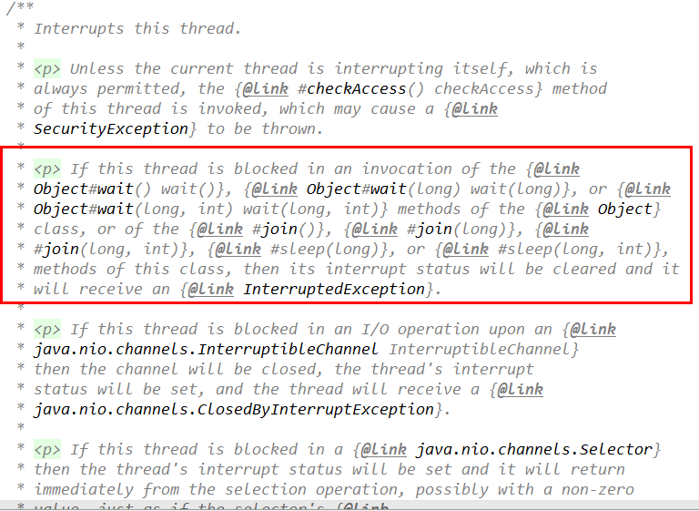
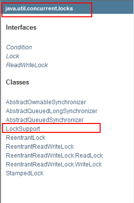
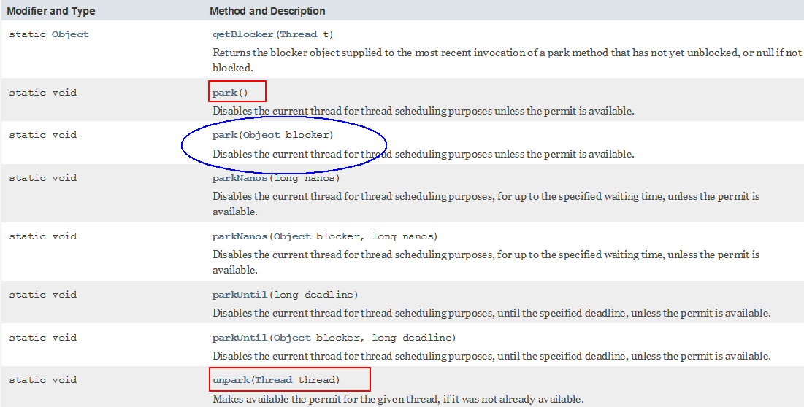
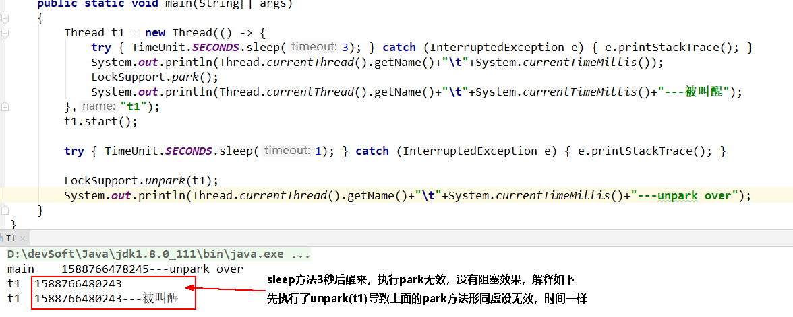

---
# 当前页面内容标题
title: 六、LockSupport与线程中断
# 分类
category:
  - JUC
  - java
# 标签
tag: 
  - java
  - juc
  - 并发编程
sticky: false
# 是否收藏在博客主题的文章列表中，当填入数字时，数字越大，排名越靠前。
star: false
# 是否将该文章添加至文章列表中
article: true
# 是否将该文章添加至时间线中
timeline: true
---

## 六、LockSupport与线程中断

### 1、线程中断机制

##### 1、如何停止、中断一个运行中的线程？？


##### 2、什么是中断？

首先 一个线程不应该由其他线程来强制中断或停止，而是应该由线程自己自行停止。所以，Thread.stop, Thread.suspend, Thread.resume 都已经被废弃了。

其次 在Java中没有办法立即停止一条线程，然而停止线程却显得尤为重要，如取消一个耗时操作。因此，Java提供了一种用于停止线程的机制——中断。

 中断只是一种协作机制，Java没有给中断增加任何语法，中断的过程完全需要程序员自己实现。若要中断一个线程，你需要手动调用该线程的interrupt方法，该方法也仅仅是将线程对象的中断标识设成true；接着你需要自己写代码不断地检测当前线程的标识位，如果为true，表示别的线程要求这条线程中断， 此时究竟该做什么需要你自己写代码实现。

 每个线程对象中都有一个标识，用于表示线程是否被中断；该标识位为true表示中断，为false表示未中断；通过调用线程对象的interrupt方法将该线程的标识位设为true；可以在别的线程中调用，也可以在自己的线程中调用

##### 3、中断的相关API方法

| public void interrupt()             | 实例方法， 实例方法interrupt()仅仅是设置线程的中断状态为true，不会停止线程                                                                               |
| ----------------------------------- | --------------------------------------------------------------------------------------------------------------------------- |
| public static boolean interrupted() | 静态方法，Thread.interrupted();  判断线程是否被中断，并清除当前中断状态 这个方法做了两件事： 1 返回当前线程的中断状态 2 将当前线程的中断状态设为false   这个方法有点不好理解，因为连续调用两次的结果可能不一样。 |
| public boolean isInterrupted()      | 实例方法， 判断当前线程是否被中断（通过检查中断标志位）                                                                                                |

### 2、如何使用中断标识停止线程？

在需要中断的线程中不断监听中断状态，一旦发生中断，就执行相应的中断处理业务逻辑。

#### 1、通过一个volatile变量实现

```java
public class InterruptDemo{

    public volatile static boolean exit = false;
        public static class T extends Thread {
        @Override
        public void run() {
            while (true) {
                //循环处理业务
                if (exit) {
                    break;
                }
            }
        }
    }
    public static void setExit() {
        exit = true;
    }
    public static void main(String[] args) throws InterruptedException {
        T t = new T();
        t.start();
        TimeUnit.SECONDS.sleep(3);
        setExit();
    }
}
```

代码中启动了一个线程，线程的run方法中有个死循环，内部通过exit变量的值来控制是否退出。`TimeUnit.SECONDS.sleep(3);`让主线程休眠3秒，此处为什么使用TimeUnit？TimeUnit使用更方便一些，能够很清晰的控制休眠时间，底层还是转换为Thread.sleep实现的。程序有个重点：**volatile**关键字，exit变量必须通过这个修饰，如果把这个去掉，程序无法正常退出。volatile控制了变量在多线程中的可见性。

#### 2、通过AtomicBoolean

```java
public class StopThreadDemo
{
    private final static AtomicBoolean atomicBoolean = new AtomicBoolean(true);

    public static void main(String[] args)
    {
        Thread t1 = new Thread(() -> {
            while(atomicBoolean.get())
            {
                try { TimeUnit.MILLISECONDS.sleep(500); } catch (InterruptedException e) { e.printStackTrace(); }
                System.out.println("-----hello");
            }
        }, "t1");
        t1.start();

        try { TimeUnit.SECONDS.sleep(3); } catch (InterruptedException e) { e.printStackTrace(); }

        atomicBoolean.set(false);
    }
}
```

#### 3、通过Thread类自带的中断api方法实现

1. 实例方法interrupt()，没有返回值


| public void interrupt() | 实例方法， 调用interrupt()方法仅仅是在当前线程中打了一个停止的标记，并不是真正立刻停止线程。 |
| ----------------------- | ---------------------------------------------------- |
|                         |                                                      |




1. 实例方法isInterrupted，返回布尔值


| public boolean isInterrupted() | 实例方法， 获取中断标志位的当前值是什么， 判断当前线程是否被中断（通过检查中断标志位），默认是false |
| ------------------------------ | ----------------------------------------------------- |
|                                |                                                       |


```java
public class InterruptDemo
{
    public static void main(String[] args)
    {
        Thread t1 = new Thread(() -> {
            while(true)
            {
                if(Thread.currentThread().isInterrupted())
                {
                    System.out.println("-----t1 线程被中断了，break，程序结束");
                    break;
                }
                System.out.println("-----hello");
            }
        }, "t1");
        t1.start();

        System.out.println("**************"+t1.isInterrupted());
        //暂停5毫秒
        try { TimeUnit.MILLISECONDS.sleep(5); } catch (InterruptedException e) { e.printStackTrace(); }
        t1.interrupt();
        System.out.println("**************"+t1.isInterrupted());
    }
}
```

运行上面的程序，程序可以正常结束。线程内部有个中断标志，当调用线程的interrupt()实例方法之后，线程的中断标志会被置为true，可以通过线程的实例方法isInterrupted()获取线程的中断标志。

#### 4、当前线程的中断标识为true，是不是就立刻停止？

具体来说，当对一个线程，调用 interrupt() 时：

① 如果线程处于正常活动状态，那么会将该线程的中断标志设置为 true，仅此而已。 被设置中断标志的线程将继续正常运行，不受影响。所以， interrupt() 并不能真正的中断线程，需要被调用的线程自己进行配合才行。

② 如果线程处于被阻塞状态（例如处于sleep, wait, join 等状态），在别的线程中调用当前线程对象的interrupt方法， 那么线程将立即退出被阻塞状态，并抛出一个InterruptedException异常。

```java
public class InterruptDemo2 {
    public static void main(String[] args) throws InterruptedException {
        Thread t1 = new Thread(() -> {
            for (int i = 0; i < 300; i++) {
                System.out.println("-------" + i);
            }
            System.out.println("after t1.interrupt()--第2次---: " + Thread.currentThread().isInterrupted());
        }, "t1");
        t1.start();

        System.out.println("before t1.interrupt()----: " + t1.isInterrupted());
        //实例方法interrupt()仅仅是设置线程的中断状态位设置为true，不会停止线程
        t1.interrupt();
        //活动状态,t1线程还在执行中
        try {
            TimeUnit.MILLISECONDS.sleep(3);
        } catch (InterruptedException e) {
            e.printStackTrace();
        }
        System.out.println("after t1.interrupt()--第1次---: " + t1.isInterrupted());
        //非活动状态,t1线程不在执行中，已经结束执行了。
        try {
            TimeUnit.MILLISECONDS.sleep(3000);
        } catch (InterruptedException e) {
            e.printStackTrace();
        }
        System.out.println("after t1.interrupt()--第3次---: " + t1.isInterrupted());
    }
}
```


**中断只是一种协同机制，修改中断标识位仅此而已，不是立刻stop打断**

#### 5、静态方法Thread.interrupted()

```java
/**
 * 作用是测试当前线程是否被中断（检查中断标志），返回一个boolean并清除中断状态，
 * 第二次再调用时中断状态已经被清除，将返回一个false。
 */
public class InterruptDemo
{

    public static void main(String[] args) throws InterruptedException
    {
        System.out.println(Thread.currentThread().getName()+"---"+Thread.interrupted());
        System.out.println(Thread.currentThread().getName()+"---"+Thread.interrupted());
        System.out.println("111111");
        Thread.currentThread().interrupt();
        System.out.println("222222");
        System.out.println(Thread.currentThread().getName()+"---"+Thread.interrupted());
        System.out.println(Thread.currentThread().getName()+"---"+Thread.interrupted());
    }
}
```

| public static boolean interrupted() | 静态方法，Thread.interrupted();  判断线程是否被中断，并清除当前中断状态，类似i++ 这个方法做了两件事： 1 返回当前线程的中断状态 2 将当前线程的中断状态设为false   这个方法有点不好理解，因为连续调用两次的结果可能不一样。 |
| ----------------------------------- | --------------------------------------------------------------------------------------------------------------------------------- |
|                                     |                                                                                                                                   |


都会返回中断状态，两者对比


#### 6、总结

线程中断相关的方法：

interrupt()方法是一个实例方法 它通知目标线程中断，也就是设置目标线程的中断标志位为true，中断标志位表示当前线程已经被中断了。

isInterrupted()方法也是一个实例方法 它判断当前线程是否被中断（通过检查中断标志位）并获取中断标志

Thread类的静态方法interrupted() 返回当前线程的中断状态(boolean类型)且将当前线程的中断状态设为false，此方法调用之后会清除当前线程的中断标志位的状态（将中断标志置为false了），返回当前值并清零置false

### 3、LockSupport是什么

**LockSupport**位于**java.util.concurrent**（**简称juc**）包中，算是juc中一个基础类，juc中很多地方都会使用LockSupport，非常重要，希望大家一定要掌握。

关于线程等待/唤醒的方法，前面的文章中我们已经讲过2种了：

1. 方式1：使用Object中的wait()方法让线程等待，使用Object中的notify()方法唤醒线程
2. 方式2：使用juc包中Condition的await()方法让线程等待，使用signal()方法唤醒线程




LockSupport是用来创建锁和其他同步类的基本线程阻塞原语。

下面这句话，后面详细说 LockSupport中的park() 和 unpark() 的作用分别是阻塞线程和解除阻塞线程

### 4、线程等待唤醒机制

#### 1、3种让线程等待和唤醒的方法

1. 使用Object中的wait()方法让线程等待，使用Object中的notify()方法唤醒线程
2. 使用JUC包中Condition的await()方法让线程等待，使用signal()方法唤醒线程
3. LockSupport类可以阻塞当前线程以及唤醒指定被阻塞的线程

#### 2、Object类中的wait和notify方法实现线程等待和唤醒

```java
/**
 *
 * 要求：t1线程等待3秒钟，3秒钟后t2线程唤醒t1线程继续工作
 *
 * 1 正常程序演示
 *
 * 以下异常情况：
 * 2 wait方法和notify方法，两个都去掉同步代码块后看运行效果
 *   2.1 异常情况
 *   Exception in thread "t1" java.lang.IllegalMonitorStateException at java.lang.Object.wait(Native Method)
 *   Exception in thread "t2" java.lang.IllegalMonitorStateException at java.lang.Object.notify(Native Method)
 *   2.2 结论
 *   Object类中的wait、notify、notifyAll用于线程等待和唤醒的方法，都必须在synchronized内部执行（必须用到关键字synchronized）。
 *
 * 3 将notify放在wait方法前面
 *   3.1 程序一直无法结束
 *   3.2 结论
 *   先wait后notify、notifyall方法，等待中的线程才会被唤醒，否则无法唤醒
 */
public class LockSupportDemo
{

    public static void main(String[] args)//main方法，主线程一切程序入口
    {
        Object objectLock = new Object(); //同一把锁，类似资源类

        new Thread(() -> {
            synchronized (objectLock) {
                try {
                    objectLock.wait();
                } catch (InterruptedException e) {
                    e.printStackTrace();
                }
            }
            System.out.println(Thread.currentThread().getName()+"\t"+"被唤醒了");
        },"t1").start();

        //暂停几秒钟线程
        try { TimeUnit.SECONDS.sleep(3L); } catch (InterruptedException e) { e.printStackTrace(); }

        new Thread(() -> {
            synchronized (objectLock) {
                objectLock.notify();
            }

            //objectLock.notify();

            /*synchronized (objectLock) {
                try {
                    objectLock.wait();
                } catch (InterruptedException e) {
                    e.printStackTrace();
                }
            }*/
        },"t2").start();
    }
}
```

##### 1、正常

```java
public class LockSupportDemo
{
    public static void main(String[] args)//main方法，主线程一切程序入口
    {
        Object objectLock = new Object(); //同一把锁，类似资源类

        new Thread(() -> {
            synchronized (objectLock) {
                try {
                    objectLock.wait();
                } catch (InterruptedException e) {
                    e.printStackTrace();
                }
            }
            System.out.println(Thread.currentThread().getName()+"\t"+"被唤醒了");
        },"t1").start();

        //暂停几秒钟线程
        try { TimeUnit.SECONDS.sleep(3L); } catch (InterruptedException e) { e.printStackTrace(); }

        new Thread(() -> {
            synchronized (objectLock) {
                objectLock.notify();
            }
        },"t2").start();
    }
}
```

##### 2、异常1

```java
/**
 * 要求：t1线程等待3秒钟，3秒钟后t2线程唤醒t1线程继续工作
 * 以下异常情况：
 * 2 wait方法和notify方法，两个都去掉同步代码块后看运行效果
 *   2.1 异常情况
 *   Exception in thread "t1" java.lang.IllegalMonitorStateException at java.lang.Object.wait(Native Method)
 *   Exception in thread "t2" java.lang.IllegalMonitorStateException at java.lang.Object.notify(Native Method)
 *   2.2 结论
 *   Object类中的wait、notify、notifyAll用于线程等待和唤醒的方法，都必须在synchronized内部执行（必须用到关键字synchronized）。
 */
public class LockSupportDemo
{

    public static void main(String[] args)//main方法，主线程一切程序入口
    {
        Object objectLock = new Object(); //同一把锁，类似资源类

        new Thread(() -> {
                try {
                    objectLock.wait();
                } catch (InterruptedException e) {
                    e.printStackTrace();
                }
            System.out.println(Thread.currentThread().getName()+"\t"+"被唤醒了");
        },"t1").start();

        //暂停几秒钟线程
        try { TimeUnit.SECONDS.sleep(3L); } catch (InterruptedException e) { e.printStackTrace(); }

        new Thread(() -> {
            objectLock.notify();
        },"t2").start();
    }
}
```

wait方法和notify方法，两个都去掉同步代码块


##### 3、异常2

```java
/**
 *
 * 要求：t1线程等待3秒钟，3秒钟后t2线程唤醒t1线程继续工作
 *
 * 3 将notify放在wait方法前先执行，t1先notify了，3秒钟后t2线程再执行wait方法
 *   3.1 程序一直无法结束
 *   3.2 结论
 *   先wait后notify、notifyall方法，等待中的线程才会被唤醒，否则无法唤醒
 */
public class LockSupportDemo
{

    public static void main(String[] args)//main方法，主线程一切程序入口
    {
        Object objectLock = new Object(); //同一把锁，类似资源类

        new Thread(() -> {
            synchronized (objectLock) {
                objectLock.notify();
            }
            System.out.println(Thread.currentThread().getName()+"\t"+"通知了");
        },"t1").start();

        //t1先notify了，3秒钟后t2线程再执行wait方法
        try { TimeUnit.SECONDS.sleep(3L); } catch (InterruptedException e) { e.printStackTrace(); }

        new Thread(() -> {
            synchronized (objectLock) {
                try {
                    objectLock.wait();
                } catch (InterruptedException e) {
                    e.printStackTrace();
                }
            }
            System.out.println(Thread.currentThread().getName()+"\t"+"被唤醒了");
        },"t2").start();
    }
}
```

将notify放在wait方法前面

程序无法执行，无法唤醒

##### 4、总结

wait和notify方法必须要在同步块或者方法里面，且成对出现使用

先wait后notify才OK

#### 3、Condition接口中的await后signal方法实现线程的等待和唤醒

##### 1、正常

```java
public class LockSupportDemo2
{
    public static void main(String[] args)
    {
        Lock lock = new ReentrantLock();
        Condition condition = lock.newCondition();

        new Thread(() -> {
            lock.lock();
            try
            {
                System.out.println(Thread.currentThread().getName()+"\t"+"start");
                condition.await();
                System.out.println(Thread.currentThread().getName()+"\t"+"被唤醒");
            } catch (InterruptedException e) {
                e.printStackTrace();
            } finally {
                lock.unlock();
            }
        },"t1").start();

        //暂停几秒钟线程
        try { TimeUnit.SECONDS.sleep(3L); } catch (InterruptedException e) { e.printStackTrace(); }

        new Thread(() -> {
            lock.lock();
            try
            {
                condition.signal();
            } catch (Exception e) {
                e.printStackTrace();
            } finally {
                lock.unlock();
            }
            System.out.println(Thread.currentThread().getName()+"\t"+"通知了");
        },"t2").start();

    }
}
```

##### 2、异常1

```java
/**
 * 异常：
 * condition.await();和condition.signal();都触发了IllegalMonitorStateException异常
 *
 * 原因：调用condition中线程等待和唤醒的方法的前提是，要在lock和unlock方法中,要有锁才能调用
 */
public class LockSupportDemo2
{
    public static void main(String[] args)
    {
        Lock lock = new ReentrantLock();
        Condition condition = lock.newCondition();

        new Thread(() -> {
            try
            {
                System.out.println(Thread.currentThread().getName()+"\t"+"start");
                condition.await();
                System.out.println(Thread.currentThread().getName()+"\t"+"被唤醒");
            } catch (InterruptedException e) {
                e.printStackTrace();
            }
        },"t1").start();

        //暂停几秒钟线程
        try { TimeUnit.SECONDS.sleep(3L); } catch (InterruptedException e) { e.printStackTrace(); }

        new Thread(() -> {
            try
            {
                condition.signal();
            } catch (Exception e) {
                e.printStackTrace();
            }
            System.out.println(Thread.currentThread().getName()+"\t"+"通知了");
        },"t2").start();

    }
}
```

去掉lock/unlock


condition.await();和 condition.signal();都触发了 IllegalMonitorStateException异常。

结论： lock、unlock对里面才能正确调用调用condition中线程等待和唤醒的方法

##### 3、异常2

```java
/**
 * 异常：
 * 程序无法运行
 *
 * 原因：先await()后signal才OK，否则线程无法被唤醒
 */
public class LockSupportDemo2
{
    public static void main(String[] args)
    {
        Lock lock = new ReentrantLock();
        Condition condition = lock.newCondition();

        new Thread(() -> {
            lock.lock();
            try
            {
                condition.signal();
                System.out.println(Thread.currentThread().getName()+"\t"+"signal");
            } catch (Exception e) {
                e.printStackTrace();
            }finally {
                lock.unlock();
            }
        },"t1").start();

        //暂停几秒钟线程
        try { TimeUnit.SECONDS.sleep(3L); } catch (InterruptedException e) { e.printStackTrace(); }

        new Thread(() -> {
            lock.lock();
            try
            {
                System.out.println(Thread.currentThread().getName()+"\t"+"等待被唤醒");
                condition.await();
                System.out.println(Thread.currentThread().getName()+"\t"+"被唤醒");
            } catch (Exception e) {
                e.printStackTrace();
            }finally {
                lock.unlock();
            }
        },"t2").start();

    }
}
```

先signal后await

##### 4、总结

Condtion中的线程等待和唤醒方法之前，需要先获取锁

一定要先await后signal，不要反了

#### 4、Object和Condition使用的限制条件

线程先要获得并持有锁，必须在锁块(synchronized或lock)中

必须要先等待后唤醒，线程才能够被唤醒

#### 5、LockSupport类中的park等待和unpark唤醒

通过park()和unpark(thread)方法来实现阻塞和唤醒线程的操作


LockSupport是用来创建锁和其他同步类的基本线程阻塞原语。

 LockSupport类使用了一种名为Permit（许可）的概念来做到阻塞和唤醒线程的功能， 每个线程都有一个许可(permit)， permit只有两个值1和零，默认是零。 可以把许可看成是一种(0,1)信号量（Semaphore），但与 Semaphore 不同的是，许可的累加上限是1。

##### 1、主要方法



**阻塞**

park() /park(Object blocker)


阻塞当前线程/阻塞传入的具体线程

**唤醒**

unpark(Thread thread)


唤醒处于阻塞状态的指定线程

##### 2、代码

正常+无锁块要求

```java
public class LockSupportDemo3
{
    public static void main(String[] args)
    {
        //正常使用+不需要锁块
Thread t1 = new Thread(() -> {
    System.out.println(Thread.currentThread().getName()+" "+"1111111111111");
    LockSupport.park();
    System.out.println(Thread.currentThread().getName()+" "+"2222222222222------end被唤醒");
},"t1");
t1.start();

//暂停几秒钟线程
try { TimeUnit.SECONDS.sleep(3); } catch (InterruptedException e) { e.printStackTrace(); }

LockSupport.unpark(t1);
System.out.println(Thread.currentThread().getName()+"   -----LockSupport.unparrk() invoked over");

    }
}
```

之前错误的先唤醒后等待，LockSupport照样支持

```java
public class T1
{
    public static void main(String[] args)
    {
        Thread t1 = new Thread(() -> {
            try { TimeUnit.SECONDS.sleep(3); } catch (InterruptedException e) { e.printStackTrace(); }
            System.out.println(Thread.currentThread().getName()+"\t"+System.currentTimeMillis());
            LockSupport.park();
            System.out.println(Thread.currentThread().getName()+"\t"+System.currentTimeMillis()+"---被叫醒");
        },"t1");
        t1.start();

        try { TimeUnit.SECONDS.sleep(1); } catch (InterruptedException e) { e.printStackTrace(); }

        LockSupport.unpark(t1);
        System.out.println(Thread.currentThread().getName()+"\t"+System.currentTimeMillis()+"---unpark over");
    }
}
```


