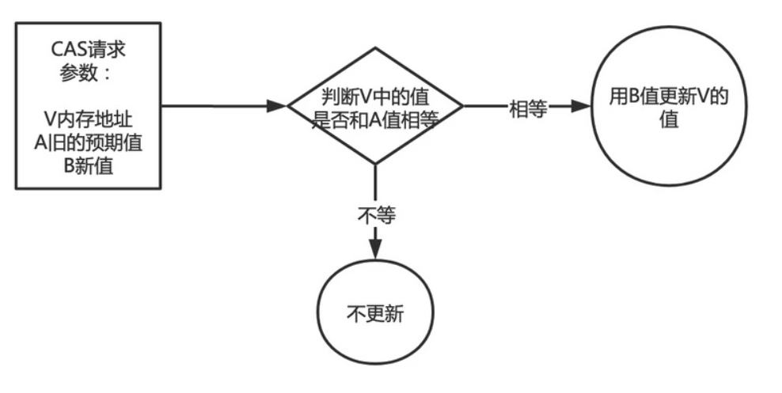
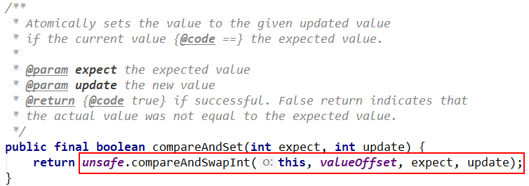
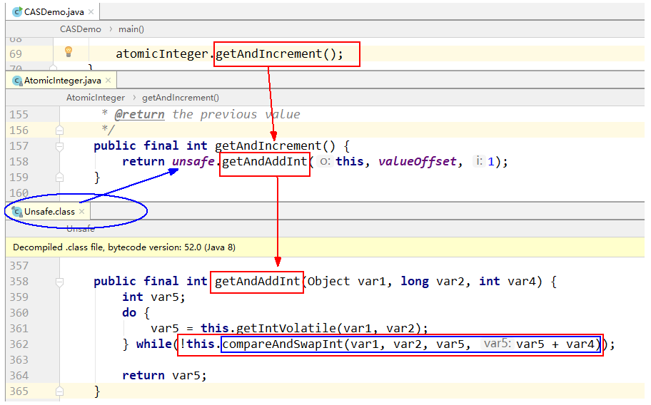

---
# 当前页面内容标题
title: 十一、CAS
# 分类
category:
  - JUC
  - java
# 标签
tag: 
  - java
  - juc
  - 并发编程
sticky: false
# 是否收藏在博客主题的文章列表中，当填入数字时，数字越大，排名越靠前。
star: false
# 是否将该文章添加至文章列表中
article: true
# 是否将该文章添加至时间线中
timeline: true
---

## 十一、CAS

### 1、没有CAS之前

#### 1、多线程环境不使用原子类保证线程安全（基本数据类型）

```java
public class T3
{
    volatile int number = 0;
    //读取
    public int getNumber()
    {
        return number;
    }
    //写入加锁保证原子性
    public synchronized void setNumber()
    {
        number++;
    }
}
```

#### 2、多线程环境 使用原子类保证线程安全（基本数据类型）

```java
public class T3
{
    volatile int number = 0;
    //读取
    public int getNumber()
    {
        return number;
    }
    //写入加锁保证原子性
    public synchronized void setNumber()
    {
        number++;
    }
    //=================================
    AtomicInteger atomicInteger = new AtomicInteger();

    public int getAtomicInteger()
    {
        return atomicInteger.get();
    }

    public void setAtomicInteger()
    {
        atomicInteger.getAndIncrement();
    }
}
```

### 2、CAS是什么

```
compare and swap的缩写，中文翻译成比较并交换,实现并发算法时常用到的一种技术。它包含三个操作数——内存位置、预期原值及更新值。
执行CAS操作的时候，将内存位置的值与预期原值比较：
如果相匹配，那么处理器会自动将该位置值更新为新值，
如果不匹配，处理器不做任何操作，多个线程同时执行CAS操作只有一个会成功。 
```

CAS有3个操作数，位置内存值V，旧的预期值A，要修改的更新值B。 当且仅当旧的预期值A和内存值V相同时，将内存值V修改为B，否则什么都不做或重来



```java
CAS是JDK提供的非阻塞原子性操作，它通过硬件保证了比较-更新的原子性。
它是非阻塞的且自身原子性，也就是说这玩意效率更高且通过硬件保证，说明这玩意更可靠。

CAS是一条CPU的原子指令（cmpxchg指令），不会造成所谓的数据不一致问题，Unsafe提供的CAS方法（如compareAndSwapXXX）底层实现即为CPU指令cmpxchg。
执行cmpxchg指令的时候，会判断当前系统是否为多核系统，如果是就给总线加锁，只有一个线程会对总线加锁成功，加锁成功之后会执行cas操作，也就是说CAS的原子性实际上是CPU实现的， 其实在这一点上还是有排他锁的，只是比起用synchronized， 这里的排他时间要短的多， 所以在多线程情况下性能会比较好
public class CASDemo
{
    public static void main(String[] args) throws InterruptedException
    {
        AtomicInteger atomicInteger = new AtomicInteger(5);

        System.out.println(atomicInteger.compareAndSet(5, 2020)+"\t"+atomicInteger.get());
        System.out.println(atomicInteger.compareAndSet(5, 1024)+"\t"+atomicInteger.get());
    }
}
```

#### 1、源码分析compareAndSet(int expect,int update)

compareAndSet()方法的源代码：


上面三个方法都是类似的，主要对4个参数做一下说明。 var1：表示要操作的对象 var2：表示要操作对象中属性地址的偏移量 var4：表示需要修改数据的期望的值 var5/var6：表示需要修改为的新值



### 3、CAS底层原理？如果知道，谈谈你对UnSafe的理解

#### 1、UnSafe


1. Unsafe

   ```
     是CAS的核心类，由于Java方法无法直接访问底层系统，需要通过本地（native）方法来访问，Unsafe相当于一个后门，基于该类可以直接操作特定内存的数据。Unsafe类存在于sun.misc包中，其内部方法操作可以像C的指针一样直接操作内存，因为Java中CAS操作的执行依赖于Unsafe类的方法。
   ```

   注意Unsafe类中的所有方法都是native修饰的，也就是说Unsafe类中的方法都直接调用操作系统底层资源执行相应任务

2. 变量valueOffset，表示该变量值在内存中的偏移地址，因为Unsafe就是根据内存偏移地址获取数据的。


1. 变量value用volatile修饰，保证了多线程之间的内存可见性。

#### 2、我们知道i++线程不安全的，那atomicInteger.getAndIncrement()

CAS的全称为Compare-And-Swap，它是一条CPU并发原语。 它的功能是判断内存某个位置的值是否为预期值，如果是则更改为新的值，这个过程是原子的。 AtomicInteger 类主要利用 CAS (compare and swap) + volatile 和 native 方法来保证原子操作，从而避免 synchronized 的高开销，执行效率大为提升。



new AtomicInteger().getAndIncrement();


假设线程A和线程B两个线程同时执行getAndAddInt操作（分别跑在不同CPU上）：

1. AtomicInteger里面的value原始值为3，即主内存中AtomicInteger的value为3，根据JMM模型，线程A和线程B各自持有一份值为3的value的副本分别到各自的工作内存。
2. 线程A通过getIntVolatile(var1, var2)拿到value值3，这时线程A被挂起。
3. 线程B也通过getIntVolatile(var1, var2)方法获取到value值3，此时刚好线程B没有被挂起并执行compareAndSwapInt方法比较内存值也为3，成功修改内存值为4，线程B打完收工，一切OK。
4. 这时线程A恢复，执行compareAndSwapInt方法比较，发现自己手里的值数字3和主内存的值数字4不一致，说明该值已经被其它线程抢先一步修改过了，那A线程本次修改失败，只能重新读取重新来一遍了。
5. 线程A重新获取value值，因为变量value被volatile修饰，所以其它线程对它的修改，线程A总是能够看到，线程A继续执行compareAndSwapInt进行比较替换，直到成功。

#### 3、底层汇编

native修饰的方法代表是底层方法

Unsafe类中的compareAndSwapInt，是一个本地方法，该方法的实现位于unsafe.cpp中

```c
UNSAFE_ENTRY(jboolean, Unsafe_CompareAndSwapInt(JNIEnv *env, jobject unsafe, jobject obj, jlong offset, jint e, jint x))
  UnsafeWrapper("Unsafe_CompareAndSwapInt");
  oop p = JNIHandles::resolve(obj);
// 先想办法拿到变量value在内存中的地址，根据偏移量valueOffset，计算 value 的地址
  jint* addr = (jint *) index_oop_from_field_offset_long(p, offset);
// 调用 Atomic 中的函数 cmpxchg来进行比较交换，其中参数x是即将更新的值，参数e是原内存的值
  return (jint)(Atomic::cmpxchg(x, addr, e)) == e;
UNSAFE_END
```

(Atomic::cmpxchg(x, addr, e)) == e;

cmpxchg

```c
// 调用 Atomic 中的函数 cmpxchg来进行比较交换，其中参数x是即将更新的值，参数e是原内存的值
  return (jint)(Atomic::cmpxchg(x, addr, e)) == e;

unsigned Atomic::cmpxchg(unsigned int exchange_value,volatile unsigned int* dest, unsigned int compare_value) {
    assert(sizeof(unsigned int) == sizeof(jint), "more work to do");
  /*
   * 根据操作系统类型调用不同平台下的重载函数，这个在预编译期间编译器会决定调用哪个平台下的重载函数*/
    return (unsigned int)Atomic::cmpxchg((jint)exchange_value, (volatile jint*)dest, (jint)compare_value);
}
```

在不同的操作系统下会调用不同的cmpxchg重载函数，本次用的是win10系统

```c
inline jint Atomic::cmpxchg (jint exchange_value, volatile jint* dest, jint compare_value) {
  //判断是否是多核CPU
  int mp = os::is_MP();
  __asm {
    //三个move指令表示的是将后面的值移动到前面的寄存器上
    mov edx, dest
    mov ecx, exchange_value
    mov eax, compare_value
    //CPU原语级别，CPU触发
    LOCK_IF_MP(mp)
    //比较并交换指令
    //cmpxchg: 即“比较并交换”指令
    //dword: 全称是 double word 表示两个字，一共四个字节
    //ptr: 全称是 pointer，与前面的 dword 连起来使用，表明访问的内存单元是一个双字单元 
    //将 eax 寄存器中的值（compare_value）与 [edx] 双字内存单元中的值进行对比，
    //如果相同，则将 ecx 寄存器中的值（exchange_value）存入 [edx] 内存单元中
    cmpxchg dword ptr [edx], ecx
  }
}
```

到这里应该理解了CAS真正实现的机制了，它最终是由操作系统的汇编指令完成的。

#### 4、总结

```java
你只需要记住：CAS是靠硬件实现的从而在硬件层面提升效率，最底层还是交给硬件来保证原子性和可见性
实现方式是基于硬件平台的汇编指令，在intel的CPU中(X86机器上)，使用的是汇编指令cmpxchg指令。 

核心思想就是：比较要更新变量的值V和预期值E（compare），相等才会将V的值设为新值N（swap）如果不相等自旋再来。
```

### 4、原子引用

AtomicInteger原子整型，可否有其它原子类型？

- AtomicBook
- AtomicOrder
- 。。。

```java
@Getter
@ToString
@AllArgsConstructor
class User
{
    String userName;
    int    age;
}

/**
 * @auther zzyy
 * @create 2018-12-31 17:22
 */
public class AtomicReferenceDemo
{
    public static void main(String[] args)
    {
        User z3 = new User("z3",24);
        User li4 = new User("li4",26);

        AtomicReference<User> atomicReferenceUser = new AtomicReference<>();

        atomicReferenceUser.set(z3);
        System.out.println(atomicReferenceUser.compareAndSet(z3,li4)+"\t"+atomicReferenceUser.get().toString());
        System.out.println(atomicReferenceUser.compareAndSet(z3,li4)+"\t"+atomicReferenceUser.get().toString());
    }
}
```

### 5、自旋锁，借鉴CAS思想

自旋锁（spinlock）

是指尝试获取锁的线程不会立即阻塞，而是采用循环的方式去尝试获取锁， 当线程发现锁被占用时，会不断循环判断锁的状态，直到获取。这样的好处是减少线程上下文切换的消耗，缺点是循环会消耗CPU


```java
/**
 * 题目：实现一个自旋锁
 * 自旋锁好处：循环比较获取没有类似wait的阻塞。
 *
 * 通过CAS操作完成自旋锁，A线程先进来调用myLock方法自己持有锁5秒钟，B随后进来后发现
 * 当前有线程持有锁，不是null，所以只能通过自旋等待，直到A释放锁后B随后抢到。
 */
public class SpinLockDemo
{
    AtomicReference<Thread> atomicReference = new AtomicReference<>();

    public void myLock()
    {
        Thread thread = Thread.currentThread();
        System.out.println(Thread.currentThread().getName()+"\t come in");
        while(!atomicReference.compareAndSet(null,thread))
        {

        }
    }

    public void myUnLock()
    {
        Thread thread = Thread.currentThread();
        atomicReference.compareAndSet(thread,null);
        System.out.println(Thread.currentThread().getName()+"\t myUnLock over");
    }

    public static void main(String[] args)
    {
        SpinLockDemo spinLockDemo = new SpinLockDemo();

        new Thread(() -> {
            spinLockDemo.myLock();
            try { TimeUnit.SECONDS.sleep( 5 ); } catch (InterruptedException e) { e.printStackTrace(); }
            spinLockDemo.myUnLock();
        },"A").start();

        //暂停一会儿线程，保证A线程先于B线程启动并完成
        try { TimeUnit.SECONDS.sleep( 1 ); } catch (InterruptedException e) { e.printStackTrace(); }

        new Thread(() -> {
            spinLockDemo.myLock();
            spinLockDemo.myUnLock();
        },"B").start();

    }
}
```

### 6、CAS缺点

#### 1、循环时间长开销很大

我们可以看到getAndAddInt方法执行时，有个do while


如果CAS失败，会一直进行尝试。如果CAS长时间一直不成功，可能会给CPU带来很大的开销。

#### 2、引出来ABA问题？？？

```java
CAS会导致“ABA问题”。

CAS算法实现一个重要前提需要取出内存中某时刻的数据并在当下时刻比较并替换，那么在这个时间差类会导致数据的变化。

比如说一个线程one从内存位置V中取出A，这时候另一个线程two也从内存中取出A，并且线程two进行了一些操作将值变成了B，
然后线程two又将V位置的数据变成A，这时候线程one进行CAS操作发现内存中仍然是A，然后线程one操作成功。

尽管线程one的CAS操作成功，但是不代表这个过程就是没有问题的。
public class ABADemo
{
    static AtomicInteger atomicInteger = new AtomicInteger(100);
    static AtomicStampedReference atomicStampedReference = new AtomicStampedReference(100,1);

    public static void main(String[] args)
    {
        new Thread(() -> {
            atomicInteger.compareAndSet(100,101);
            atomicInteger.compareAndSet(101,100);
        },"t1").start();

        new Thread(() -> {
            //暂停一会儿线程
            try { Thread.sleep( 500 ); } catch (InterruptedException e) { e.printStackTrace(); };            System.out.println(atomicInteger.compareAndSet(100, 2019)+"\t"+atomicInteger.get());
        },"t2").start();

        //暂停一会儿线程,main彻底等待上面的ABA出现演示完成。
        try { Thread.sleep( 2000 ); } catch (InterruptedException e) { e.printStackTrace(); }

        System.out.println("============以下是ABA问题的解决=============================");

        new Thread(() -> {
            int stamp = atomicStampedReference.getStamp();
            System.out.println(Thread.currentThread().getName()+"\t 首次版本号:"+stamp);//1
            //暂停一会儿线程,
            try { Thread.sleep( 1000 ); } catch (InterruptedException e) { e.printStackTrace(); }
            atomicStampedReference.compareAndSet(100,101,atomicStampedReference.getStamp(),atomicStampedReference.getStamp()+1);
            System.out.println(Thread.currentThread().getName()+"\t 2次版本号:"+atomicStampedReference.getStamp());
            atomicStampedReference.compareAndSet(101,100,atomicStampedReference.getStamp(),atomicStampedReference.getStamp()+1);
            System.out.println(Thread.currentThread().getName()+"\t 3次版本号:"+atomicStampedReference.getStamp());
        },"t3").start();

        new Thread(() -> {
            int stamp = atomicStampedReference.getStamp();
            System.out.println(Thread.currentThread().getName()+"\t 首次版本号:"+stamp);//1
            //暂停一会儿线程，获得初始值100和初始版本号1，故意暂停3秒钟让t3线程完成一次ABA操作产生问题
            try { Thread.sleep( 3000 ); } catch (InterruptedException e) { e.printStackTrace(); }
            boolean result = atomicStampedReference.compareAndSet(100,2019,stamp,stamp+1);
            System.out.println(Thread.currentThread().getName()+"\t"+result+"\t"+atomicStampedReference.getReference());
        },"t4").start();
    }
}
```

