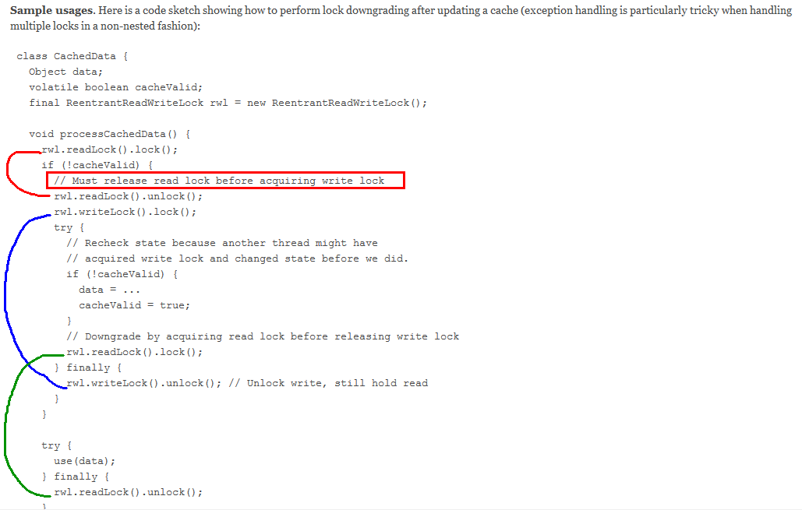

---
# 当前页面内容标题
title: 十七、ReentrantLock、ReentrantReadWriteLock、StampedLock
# 分类
category:
  - JUC
  - java
# 标签
tag: 
  - java
  - juc
  - 并发编程
sticky: false
# 是否收藏在博客主题的文章列表中，当填入数字时，数字越大，排名越靠前。
star: false
# 是否将该文章添加至文章列表中
article: true
# 是否将该文章添加至时间线中
timeline: true
---

## 十七、ReentrantLock、ReentrantReadWriteLock、StampedLock

### 1、ReentrantReadWriteLock

读写锁定义为：一个资源能够被多个读线程访问，或者被一个写线程访问，但是不能同时存在读写线程。


#### 1、读写锁意义和特点

 读写锁ReentrantReadWriteLock并不是真正意义上的读写分离，它只允许读读共存，而读写和写写依然是互斥的， 大多实际场景是“读/读”线程间并不存在互斥关系，只有"读/写"线程或"写/写"线程间的操作需要互斥的。因此引入ReentrantReadWriteLock。

 一个ReentrantReadWriteLock同时只能存在一个写锁但是可以存在多个读锁，但不能同时存在写锁和读锁(切菜还是拍蒜选一个)。也即一个资源可以被多个读操作访问或一个写操作访问，但两者不能同时进行。

只有在读多写少情境之下，读写锁才具有较高的性能体现。

#### 2、特点

- 可重入
- 读写分离

```java
public class ReentrantReadWriteLockDemo
{
    public static void main(String[] args)
    {
        MyResource myResource = new MyResource();

        for (int i = 1; i <=10; i++) {
            int finalI = i;
            new Thread(() -> {
                myResource.write(finalI +"", finalI +"");
            },String.valueOf(i)).start();
        }

        for (int i = 1; i <=10; i++) {
            int finalI = i;
            new Thread(() -> {
                myResource.read(finalI +"");
            },String.valueOf(i)).start();
        }

        //暂停几秒钟线程
        try { TimeUnit.SECONDS.sleep(1); } catch (InterruptedException e) { e.printStackTrace(); }

        //读全部over才可以继续写
        for (int i = 1; i <=3; i++) {
            int finalI = i;
            new Thread(() -> {
                myResource.write(finalI +"", finalI +"");
            },"newWriteThread==="+String.valueOf(i)).start();
        }
    }
}
```

#### 3、从写锁→读锁，ReentrantReadWriteLock可以降级

《Java 并发编程的艺术》中关于锁降级的说明：

锁的严苛程度变强叫做升级，反之叫做降级


锁降级：将写入锁降级为读锁(类似Linux文件读写权限理解，就像写权限要高于读权限一样)

##### 1、读写锁降级演示

可以降级

锁降级：遵循获取写锁→再获取读锁→再释放写锁的次序，写锁能够降级成为读锁。 如果一个线程占有了写锁，在不释放写锁的情况下，它还能占有读锁，即写锁降级为读锁。


Java8 官网说明


重入还允许通过获取写入锁定，然后读取锁然后释放写锁从写锁到读取锁, 但是，从读锁定升级到写锁是不可能的。

**锁降级是为了让当前线程感知到数据的变化，目的是保证数据可见性**

```java
/**
 * 锁降级：遵循获取写锁→再获取读锁→再释放写锁的次序，写锁能够降级成为读锁。
 *
 * 如果一个线程占有了写锁，在不释放写锁的情况下，它还能占有读锁，即写锁降级为读锁。
 */
public class LockDownGradingDemo
{
    public static void main(String[] args)
    {
        ReentrantReadWriteLock readWriteLock = new ReentrantReadWriteLock();

        ReentrantReadWriteLock.ReadLock readLock = readWriteLock.readLock();
        ReentrantReadWriteLock.WriteLock writeLock = readWriteLock.writeLock();


        writeLock.lock();
        System.out.println("-------正在写入");


        readLock.lock();
        System.out.println("-------正在读取");

        writeLock.unlock();
    }
}
```

**如果有线程在读，那么写线程是无法获取写锁的，是悲观锁的策略**

不可锁升级

线程获取读锁是不能直接升级为写入锁的。


在ReentrantReadWriteLock中，当读锁被使用时，如果有线程尝试获取写锁，该写线程会被阻塞。所以，需要释放所有读锁，才可获取写锁，


##### 2、写锁和读锁是互斥的

 写锁和读锁是互斥的（这里的互斥是指线程间的互斥，当前线程可以获取到写锁又获取到读锁，但是获取到了读锁不能继续获取写锁），这是因为读写锁要保持写操作的可见性。因为，如果允许读锁在被获取的情况下对写锁的获取，那么正在运行的其他读线程无法感知到当前写线程的操作

 因此，分析读写锁ReentrantReadWriteLock，会发现它有个潜在的问题：读锁全完，写锁有望；写锁独占，读写全堵；如果有线程正在读，写线程需要等待读线程释放锁后才能获取写锁，见前面Case《code演示LockDownGradingDemo》即ReadWriteLock读的过程中不允许写，只有等待线程都释放了读锁，当前线程才能获取写锁，也就是写入必须等待，这是一种悲观的读锁，o(╥﹏╥)o，人家还在读着那，你先别去写，省的数据乱。

 分析StampedLock(后面详细讲解)，会发现它改进之处在于：读的过程中也允许获取写锁介入(相当牛B，读和写两个操作也让你“共享”(注意引号))，这样会导致我们读的数据就可能不一致！所以，需要额外的方法来判断读的过程中是否有写入，这是一种乐观的读锁，O(∩_∩)O哈哈~。 显然乐观锁的并发效率更高，但一旦有小概率的写入导致读取的数据不一致，需要能检测出来，再读一遍就行。

#### 4、读写锁之读写规矩，再说降级

锁降级 下面的示例代码摘自ReentrantWriteReadLock源码中： ReentrantWriteReadLock支持锁降级，遵循按照获取写锁，获取读锁再释放写锁的次序，写锁能够降级成为读锁，不支持锁升级。 解读在最下面:



1. 代码中声明了一个volatile类型的cacheValid变量，保证其可见性。
2. 首先获取读锁，如果cache不可用，则释放读锁，获取写锁，在更改数据之前，再检查一次cacheValid的值，然后修改数据，将cacheValid置为true，然后在释放写锁前获取读锁；此时，cache中数据可用，处理cache中数据，最后释放读锁。这个过程就是一个完整的锁降级的过程，目的是保证数据可见性。
- 如果违背锁降级的步骤
  - 如果当前的线程C在修改完cache中的数据后，没有获取读锁而是直接释放了写锁，那么假设此时另一个线程D获取了写锁并修改了数据，那么C线程无法感知到数据已被修改，则数据出现错误。
- 如果遵循锁降级的步骤
  - 线程C在释放写锁之前获取读锁，那么线程D在获取写锁时将被阻塞，直到线程C完成数据处理过程，释放读锁。这样可以保证返回的数据是这次更新的数据，该机制是专门为了缓存设计的。

### 2、邮戳锁StampedLock

无锁→独占锁→读写锁→邮戳锁

#### 1、StampedLock是什么

StampedLock是JDK1.8中新增的一个读写锁，也是对JDK1.5中的读写锁ReentrantReadWriteLock的优化。

邮戳锁 - 也叫票据锁

> stamp（戳记，long类型）
> 
> 代表了锁的状态。当stamp返回零时，表示线程获取锁失败。并且，当释放锁或者转换锁的时候，都要传入最初获取的stamp值。

#### 2、它是由锁饥饿问题引出

 ReentrantReadWriteLock实现了读写分离，但是一旦读操作比较多的时候，想要获取写锁就变得比较困难了，假如当前1000个线程，999个读，1个写，有可能999个读取线程长时间抢到了锁，那1个写线程就悲剧了 因为当前有可能会一直存在读锁，而无法获得写锁，根本没机会写，

##### 1、如何缓解锁饥饿问题？

使用“公平”策略可以一定程度上缓解这个问题

```java
new ReentrantReadWriteLock(true);
```

但是“公平”策略是以牺牲系统吞吐量为代价的

**StampedLock类的乐观读锁闪亮登场**

```
ReentrantReadWriteLock
允许多个线程同时读，但是只允许一个线程写，在线程获取到写锁的时候，其他写操作和读操作都会处于阻塞状态，
读锁和写锁也是互斥的，所以在读的时候是不允许写的，读写锁比传统的synchronized速度要快很多，
原因就是在于ReentrantReadWriteLock支持读并发

StampedLock横空出世
ReentrantReadWriteLock的读锁被占用的时候，其他线程尝试获取写锁的时候会被阻塞。
但是，StampedLock采取乐观获取锁后，其他线程尝试获取写锁时不会被阻塞，这其实是对读锁的优化，
所以，在获取乐观读锁后，还需要对结果进行校验。
```

#### 3、StampedLock的特点

- 所有获取锁的方法，都返回一个邮戳（Stamp），Stamp为零表示获取失败，其余都表示成功；
- 所有释放锁的方法，都需要一个邮戳（Stamp），这个Stamp必须是和成功获取锁时得到的Stamp一致；
- StampedLock是不可重入的，危险(如果一个线程已经持有了写锁，再去获取写锁的话就会造成死锁)

##### 1、StampedLock有三种访问模式

1. Reading（读模式）：功能和ReentrantReadWriteLock的读锁类似
2. Writing（写模式）：功能和ReentrantReadWriteLock的写锁类似
3. Optimistic reading（乐观读模式）：无锁机制，类似于数据库中的乐观锁，支持读写并发，很乐观认为读取时没人修改，假如被修改再实现升级为悲观读模式

##### 2、乐观读模式code演示

```java
public class StampedLockDemo
{
    static int number = 37;
    static StampedLock stampedLock = new StampedLock();

    public void write()
    {
        long stamp = stampedLock.writeLock();
        System.out.println(Thread.currentThread().getName()+"\t"+"=====写线程准备修改");
        try
        {
            number = number + 13;
        }catch (Exception e){
            e.printStackTrace();
        }finally {
            stampedLock.unlockWrite(stamp);
        }
        System.out.println(Thread.currentThread().getName()+"\t"+"=====写线程结束修改");
    }

    //悲观读
    public void read()
    {
        long stamp = stampedLock.readLock();
        System.out.println(Thread.currentThread().getName()+"\t come in readlock block,4 seconds continue...");
        //暂停几秒钟线程
        for (int i = 0; i <4 ; i++) {
            try { TimeUnit.SECONDS.sleep(1); } catch (InterruptedException e) { e.printStackTrace(); }
            System.out.println(Thread.currentThread().getName()+"\t 正在读取中......");
        }
        try
        {
            int result = number;
            System.out.println(Thread.currentThread().getName()+"\t"+" 获得成员变量值result：" + result);
            System.out.println("写线程没有修改值，因为 stampedLock.readLock()读的时候，不可以写，读写互斥");
        }catch (Exception e){
            e.printStackTrace();
        }finally {
            stampedLock.unlockRead(stamp);
        }
    }

    //乐观读
    public void tryOptimisticRead()
    {
        long stamp = stampedLock.tryOptimisticRead();
        int result = number;
        //间隔4秒钟，我们很乐观的认为没有其他线程修改过number值，实际靠判断。
        System.out.println("4秒前stampedLock.validate值(true无修改，false有修改)"+"\t"+stampedLock.validate(stamp));
        for (int i = 1; i <=4 ; i++) {
            try { TimeUnit.SECONDS.sleep(1); } catch (InterruptedException e) { e.printStackTrace(); }
            System.out.println(Thread.currentThread().getName()+"\t 正在读取中......"+i+
                    "秒后stampedLock.validate值(true无修改，false有修改)"+"\t"
                    +stampedLock.validate(stamp));
        }
        if(!stampedLock.validate(stamp)) {
            System.out.println("有人动过--------存在写操作！");
            stamp = stampedLock.readLock();
            try {
                System.out.println("从乐观读 升级为 悲观读");
                result = number;
                System.out.println("重新悲观读锁通过获取到的成员变量值result：" + result);
            }catch (Exception e){
                e.printStackTrace();
            }finally {
                stampedLock.unlockRead(stamp);
            }
        }
        System.out.println(Thread.currentThread().getName()+"\t finally value: "+result);
    }

    public static void main(String[] args)
    {
        StampedLockDemo resource = new StampedLockDemo();

        new Thread(() -> {
            resource.read();
            //resource.tryOptimisticRead();
        },"readThread").start();

        // 2秒钟时乐观读失败，6秒钟乐观读取成功resource.tryOptimisticRead();，修改切换演示
        //try { TimeUnit.SECONDS.sleep(6); } catch (InterruptedException e) { e.printStackTrace(); }

        new Thread(() -> {
            resource.write();
        },"writeThread").start();
    }
}
```

**读的过程中也允许获取写锁介入**

#### 4、StampedLock的缺点

- StampedLock 不支持重入，没有Re开头
- StampedLock 的悲观读锁和写锁都不支持条件变量（Condition），这个也需要注意。
- 使用 StampedLock一定不要调用中断操作，即不要调用interrupt() 方法
  - 如果需要支持中断功能，一定使用可中断的悲观读锁 readLockInterruptibly()和写锁writeLockInterruptibly()