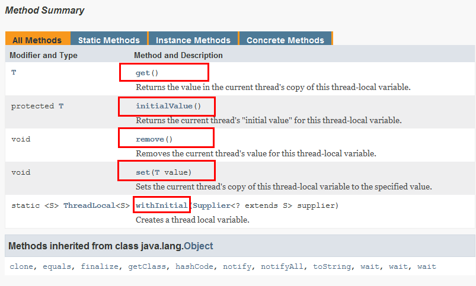
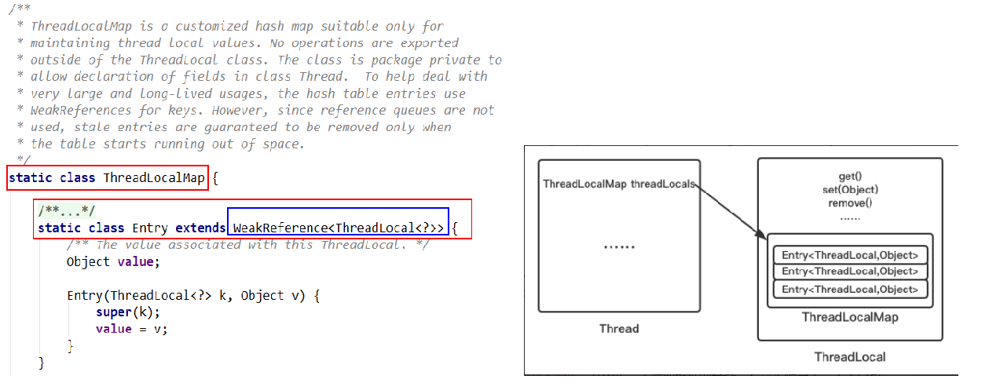
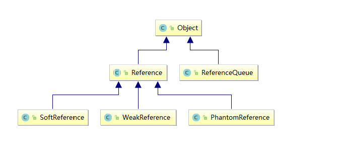
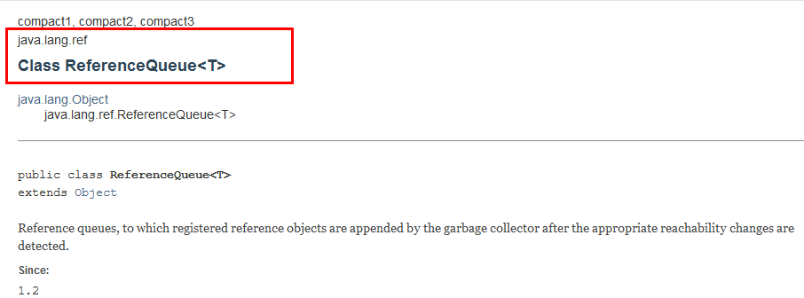
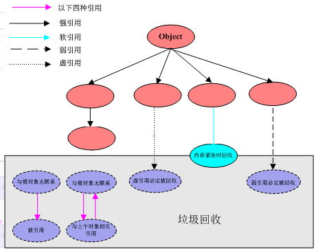
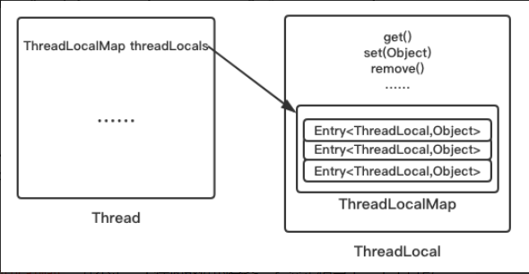
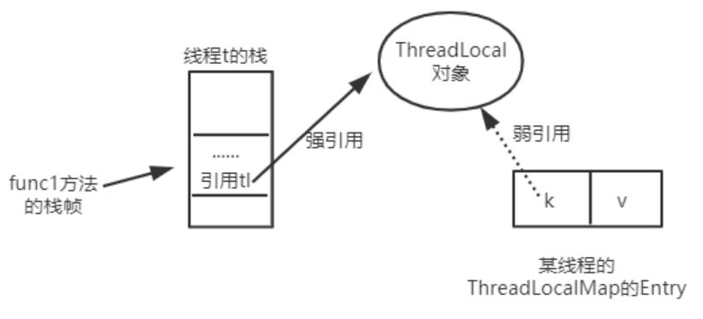
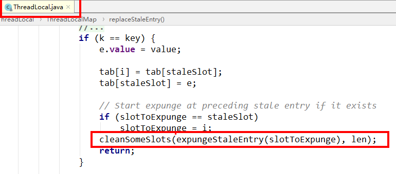
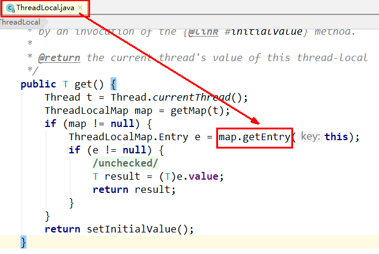
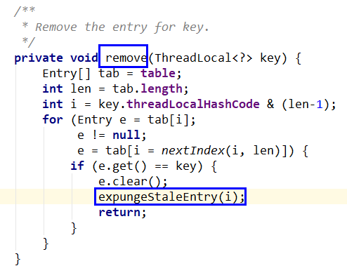

---
# 当前页面内容标题
title: 十三、ThreadLocal、InheritableThreadLocal
# 分类
category:
  - JUC
  - java
# 标签
tag: 
  - java
  - juc
  - 并发编程
sticky: false
# 是否收藏在博客主题的文章列表中，当填入数字时，数字越大，排名越靠前。
star: false
# 是否将该文章添加至文章列表中
article: true
# 是否将该文章添加至时间线中
timeline: true
---

## 十三、ThreadLocal、InheritableThreadLocal

### 1、ThreadLocal简介


 稍微翻译一下：  ThreadLocal提供线程局部变量。这些变量与正常的变量不同，因为每一个线程在访问ThreadLocal实例的时候（通过其get或set方法）都有自己的、独立初始化的变量副本。ThreadLocal实例通常是类中的私有静态字段，使用它的目的是希望将状态（例如，用户ID或事务ID）与线程关联起来。

 实现每一个线程都有自己专属的本地变量副本(自己用自己的变量不麻烦别人，不和其他人共享，人人有份，人各一份)，主要解决了让每个线程绑定自己的值，通过使用get()和set()方法，获取默认值或将其值更改为当前线程所存的副本的值从而避免了线程安全问题。




### 2、永远的helloworld

按照总销售额统计，方便集团公司做计划统计

```java
class MovieTicket
{
    int number = 50;

    public synchronized void saleTicket()
    {
        if(number > 0)
        {
            System.out.println(Thread.currentThread().getName()+"\t"+"号售票员卖出第： "+(number--));
        }else{
            System.out.println("--------卖完了");
        }
    }
}

/**
 * 三个售票员卖完50张票务，总量完成即可，吃大锅饭，售票员每个月固定月薪
 */
public class ThreadLocalDemo
{
    public static void main(String[] args)
    {
        MovieTicket movieTicket = new MovieTicket();

        for (int i = 1; i <=3; i++) {
            new Thread(() -> {
                for (int j = 0; j <20; j++) {
                    movieTicket.saleTicket();
                    try { TimeUnit.MILLISECONDS.sleep(10); } catch (InterruptedException e) { e.printStackTrace(); }
                }
            },String.valueOf(i)).start();
        }
    }
}
```

不参加总和计算，希望各自分灶吃饭，各凭销售本事提成，按照出单数各自统计

```java
class MovieTicket
{
    int number = 50;

    public synchronized void saleTicket()
    {
        if(number > 0)
        {
            System.out.println(Thread.currentThread().getName()+"\t"+"号售票员卖出第： "+(number--));
        }else{
            System.out.println("--------卖完了");
        }
    }
}

class House
{
    ThreadLocal<Integer> threadLocal = ThreadLocal.withInitial(() -> 0);

    public void saleHouse()
    {
        Integer value = threadLocal.get();
        value++;
        threadLocal.set(value);
    }
}

/**
 * 1  三个售票员卖完50张票务，总量完成即可，吃大锅饭，售票员每个月固定月薪
 *
 * 2  分灶吃饭，各个销售自己动手，丰衣足食
 */
public class ThreadLocalDemo
{
    public static void main(String[] args)
    {
        /*MovieTicket movieTicket = new MovieTicket();

        for (int i = 1; i <=3; i++) {
            new Thread(() -> {
                for (int j = 0; j <20; j++) {
                    movieTicket.saleTicket();
                    try { TimeUnit.MILLISECONDS.sleep(10); } catch (InterruptedException e) { e.printStackTrace(); }
                }
            },String.valueOf(i)).start();
        }*/

        //===========================================
        House house = new House();

        new Thread(() -> {
            try {
                for (int i = 1; i <=3; i++) {
                    house.saleHouse();
                }
                System.out.println(Thread.currentThread().getName()+"\t"+"---"+house.threadLocal.get());
            }finally {
                house.threadLocal.remove();//如果不清理自定义的 ThreadLocal 变量，可能会影响后续业务逻辑和造成内存泄露等问题
            }
        },"t1").start();

        new Thread(() -> {
            try {
                for (int i = 1; i <=2; i++) {
                    house.saleHouse();
                }
                System.out.println(Thread.currentThread().getName()+"\t"+"---"+house.threadLocal.get());
            }finally {
                house.threadLocal.remove();
            }
        },"t2").start();

        new Thread(() -> {
            try {
                for (int i = 1; i <=5; i++) {
                    house.saleHouse();
                }
                System.out.println(Thread.currentThread().getName()+"\t"+"---"+house.threadLocal.get());
            }finally {
                house.threadLocal.remove();
            }
        },"t3").start();


        System.out.println(Thread.currentThread().getName()+"\t"+"---"+house.threadLocal.get());
    }
}
```

#### 1、小总结

因为每个 Thread 内有自己的实例副本且该副本只由当前线程自己使用

既然其它 Thread 不可访问，那就不存在多线程间共享的问题。

统一设置初始值，但是每个线程对这个值的修改都是各自线程互相独立的

1. 加入synchronized或者Lock控制资源的访问顺序
2. 人手一份，大家各自安好，没必要抢夺

### 3、从阿里ThreadLocal规范开始


#### 1、非线程安全的SimpleDateFormat


 上述翻译：SimpleDateFormat中的日期格式不是同步的。推荐（建议）为每个线程创建独立的格式实例。如果多个线程同时访问一个格式，则它必须保持外部同步。

```java
public class DateUtils{
    public static final SimpleDateFormat sdf = new SimpleDateFormat("yyyy-MM-dd HH:mm:ss");
    /**
     * 模拟并发环境下使用SimpleDateFormat的parse方法将字符串转换成Date对象
     * @param stringDate
     * @return
     * @throws Exception
     */
    public static Date parseDate(String stringDate)throws Exception{
        return sdf.parse(stringDate);
    }

    public static void main(String[] args) throws Exception{
        for (int i = 1; i <=30; i++) {
            new Thread(() -> {
                try {
                    System.out.println(DateUtils.parseDate("2020-11-11 11:11:11"));
                } catch (Exception e) {
                    e.printStackTrace();
                }
            },String.valueOf(i)).start();
        }
    }
}
java.lang.NumberFormatException: For input string: ""
    at java.lang.NumberFormatException.forInputString(NumberFormatException.java:65)
    at java.lang.Long.parseLong(Long.java:601)
    at java.lang.Long.parseLong(Long.java:631)
    at java.text.DigitList.getLong(DigitList.java:195)
    at java.text.DecimalFormat.parse(DecimalFormat.java:2082)
    at java.text.SimpleDateFormat.subParse(SimpleDateFormat.java:1869)
    at java.text.SimpleDateFormat.parse(SimpleDateFormat.java:1514)
    at java.text.DateFormat.parse(DateFormat.java:364)
    at com.zdww.tcm.utils.DateTimeUtil.parseDate(DateTimeUtil.java:1129)
    at com.zdww.tcm.utils.DateTimeUtil.lambda$main$0(DateTimeUtil.java:1137)
    at java.lang.Thread.run(Thread.java:748)
java.lang.NumberFormatException: For input string: ".20202E.20202E44"
    at sun.misc.FloatingDecimal.readJavaFormatString(FloatingDecimal.java:2043)
    at sun.misc.FloatingDecimal.parseDouble(FloatingDecimal.java:110)
    at java.lang.Double.parseDouble(Double.java:538)
    at java.text.DigitList.getDouble(DigitList.java:169)
    at java.text.DecimalFormat.parse(DecimalFormat.java:2087)
    at java.text.SimpleDateFormat.subParse(SimpleDateFormat.java:1869)
    at java.text.SimpleDateFormat.parse(SimpleDateFormat.java:1514)
    at java.text.DateFormat.parse(DateFormat.java:364)
    at com.zdww.tcm.utils.DateTimeUtil.parseDate(DateTimeUtil.java:1129)
    at com.zdww.tcm.utils.DateTimeUtil.lambda$main$0(DateTimeUtil.java:1137)
```

 SimpleDateFormat类内部有一个Calendar对象引用,它用来储存和这个SimpleDateFormat相关的日期信息,例如sdf.parse(dateStr),sdf.format(date) 诸如此类的方法参数传入的日期相关String,Date等等, 都是交由Calendar引用来储存的.这样就会导致一个问题如果你的SimpleDateFormat是个static的, 那么多个thread 之间就会共享这个SimpleDateFormat, 同时也是共享这个Calendar引用。


#### 2、解决1

将SimpleDateFormat定义成局部变量。

缺点：每调用一次方法就会创建一个SimpleDateFormat对象，方法结束又要作为垃圾回收。

```java
public class DateUtils{
    public static final SimpleDateFormat sdf = new SimpleDateFormat("yyyy-MM-dd HH:mm:ss");
    /**
     * 模拟并发环境下使用SimpleDateFormat的parse方法将字符串转换成Date对象
     * @param stringDate
     * @return
     * @throws Exception
     */
    public static Date parseDate(String stringDate)throws Exception{
        return sdf.parse(stringDate);
    }

    public static void main(String[] args) throws Exception{
        for (int i = 1; i <=30; i++) {
            new Thread(() -> {
                try {
                    SimpleDateFormat sdf = new SimpleDateFormat("yyyy-MM-dd HH:mm:ss");
                    System.out.println(sdf.parse("2020-11-11 11:11:11"));
                    sdf = null;
                } catch (Exception e) {
                    e.printStackTrace();
                }
            },String.valueOf(i)).start();
        }
    }
}
```

#### 3、解决2

ThreadLocal，也叫做线程本地变量或者线程本地存储

```java
public class DateUtils{
    private static final ThreadLocal<SimpleDateFormat>  sdf_threadLocal =
            ThreadLocal.withInitial(()-> new SimpleDateFormat("yyyy-MM-dd HH:mm:ss"));

    /**
     * ThreadLocal可以确保每个线程都可以得到各自单独的一个SimpleDateFormat的对象，那么自然也就不存在竞争问题了。
     * @param stringDate
     * @return
     * @throws Exception
     */
    public static Date parseDateTL(String stringDate)throws Exception{
        return sdf_threadLocal.get().parse(stringDate);
    }

    public static void main(String[] args) throws Exception{
        for (int i = 1; i <=30; i++) {
            new Thread(() -> {
                try {
                    System.out.println(DateUtils.parseDateTL("2020-11-11 11:11:11"));
                } catch (Exception e) {
                    e.printStackTrace();
                }
            },String.valueOf(i)).start();
        }
    }
}
public class DateUtils{
    /*
    1   SimpleDateFormat如果多线程共用是线程不安全的类
    public static final SimpleDateFormat SIMPLE_DATE_FORMAT = new SimpleDateFormat("yyyy-MM-dd HH:mm:ss");

    public static String format(Date date)
    {
        return SIMPLE_DATE_FORMAT.format(date);
    }

    public static Date parse(String datetime) throws ParseException
    {
        return SIMPLE_DATE_FORMAT.parse(datetime);
    }*/

    //2   ThreadLocal可以确保每个线程都可以得到各自单独的一个SimpleDateFormat的对象，那么自然也就不存在竞争问题了。
    public static final ThreadLocal<SimpleDateFormat> SIMPLE_DATE_FORMAT_THREAD_LOCAL = ThreadLocal.withInitial(() -> new SimpleDateFormat("yyyy-MM-dd HH:mm:ss"));

    public static String format(Date date){
        return SIMPLE_DATE_FORMAT_THREAD_LOCAL.get().format(date);
    }

    public static Date parse(String datetime) throws ParseException{
        return SIMPLE_DATE_FORMAT_THREAD_LOCAL.get().parse(datetime);
    }


    //3 DateTimeFormatter 代替 SimpleDateFormat
    /*public static final DateTimeFormatter DATE_TIME_FORMAT = DateTimeFormatter.ofPattern("yyyy-MM-dd HH:mm:ss");

    public static String format(LocalDateTime localDateTime)
    {
        return DATE_TIME_FORMAT.format(localDateTime);
    }

    public static LocalDateTime parse(String dateString)
    {

        return LocalDateTime.parse(dateString,DATE_TIME_FORMAT);
    }*/
}
```

### 4、ThreadLocal源码分析

#### 1、Thread，ThreadLocal，ThreadLocalMap 关系

Thread和ThreadLocal


再次体会，各自线程，人手一份

ThreadLocal和ThreadLocalMap


All三者总概括


 threadLocalMap实际上就是一个以threadLocal实例为key，任意对象为value的Entry对象。 当我们为threadLocal变量赋值，实际上就是以当前threadLocal实例为key，值为value的Entry往这个threadLocalMap中存放

近似的可以理解为: ThreadLocalMap从字面上就可以看出这是一个保存ThreadLocal对象的map(其实是以ThreadLocal为Key)，不过是经过了两层包装的ThreadLocal对象：


 JVM内部维护了一个线程版的Map<Thread,T>(通过ThreadLocal对象的set方法，结果把ThreadLocal对象自己当做key，放进了ThreadLoalMap中),每个线程要用到这个T的时候，用当前的线程去Map里面获取，通过这样让每个线程都拥有了自己独立的变量，人手一份，竞争条件被彻底消除，在并发模式下是绝对安全的变量。

### 5、ThreadLocal内存泄露问题


#### 1、什么是内存泄漏

不再会被使用的对象或者变量占用的内存不能被回收，就是内存泄露。

#### 2、谁惹的祸？


#### 3、强引用、软引用、弱引用、虚引用分别是什么？



ThreadLocalMap从字面上就可以看出这是一个保存ThreadLocal对象的map(其实是以它为Key)，不过是经过了两层包装的ThreadLocal对象： （1）第一层包装是使用 WeakReference<ThreadLocal< ? >> 将ThreadLocal对象变成一个弱引用的对象； （2）第二层包装是定义了一个专门的类 Entry 来扩展 WeakReference<ThreadLocal< ? >>



java 技术允许使用 finalize() 方法在垃圾收集器将对象从内存中清除出去之前做必要的清理工作。

##### 1、强引用(默认支持模式)

当内存不足，JVM开始垃圾回收，对于强引用的对象，就算是出现了OOM也不会对该对象进行回收，死都不收。

 强引用是我们最常见的普通对象引用，只要还有强引用指向一个对象，就能表明对象还“活着”，垃圾收集器不会碰这种对象。在 Java 中最常见的就是强引用，把一个对象赋给一个引用变量，这个引用变量就是一个强引用。当一个对象被强引用变量引用时，它处于可达状态，它是不可能被垃圾回收机制回收的，即使该对象以后永远都不会被用到JVM也不会回收。因此强引用是造成Java内存泄漏的主要原因之一。

 对于一个普通的对象，如果没有其他的引用关系，只要超过了引用的作用域或者显式地将相应（强）引用赋值为 null，一般认为就是可以被垃圾收集的了(当然具体回收时机还是要看垃圾收集策略)。

```java
public static void strongReference()
{
    MyObject myObject = new MyObject();
    System.out.println("-----gc before: "+myObject);

    myObject = null;
    System.gc();
    try { TimeUnit.SECONDS.sleep(1); } catch (InterruptedException e) { e.printStackTrace(); }

    System.out.println("-----gc after: "+myObject);
}
```

##### 2、软引用

软引用是一种相对强引用弱化了一些的引用，需要用java.lang.ref.SoftReference类来实现，可以让对象豁免一些垃圾收集。

对于只有软引用的对象来说，

当系统内存充足时它 不会 被回收，

当系统内存不足时它 会 被回收。

软引用通常用在对内存敏感的程序中，比如高速缓存就有用到软引用，内存够用的时候就保留，不够用就回收！

```java
class MyObject
{
    //一般开发中不用调用这个方法，本次只是为了演示
    @Override
    protected void finalize() throws Throwable
    {
        System.out.println(Thread.currentThread().getName()+"\t"+"---finalize method invoked....");
    }
}

public class ReferenceDemo
{
    public static void main(String[] args)
    {
        //当我们内存不够用的时候，soft会被回收的情况，设置我们的内存大小：-Xms10m -Xmx10m
        SoftReference<MyObject> softReference = new SoftReference<>(new MyObject());

        System.gc();
        try { TimeUnit.SECONDS.sleep(1); } catch (InterruptedException e) { e.printStackTrace(); }
        System.out.println("-----gc after内存够用: "+softReference.get());

        try
        {
            byte[] bytes = new byte[9 * 1024 * 1024];
        }catch (Exception e){
            e.printStackTrace();
        }finally {
            System.out.println("-----gc after内存不够: "+softReference.get());
        }
    }

    public static void strongReference()
    {
        MyObject myObject = new MyObject();
        System.out.println("-----gc before: "+myObject);

        myObject = null;
        System.gc();
        try { TimeUnit.SECONDS.sleep(1); } catch (InterruptedException e) { e.printStackTrace(); }

        System.out.println("-----gc after: "+myObject);
    }
}
```

##### 3、弱引用

 弱引用需要用java.lang.ref.WeakReference类来实现，它比软引用的生存期更短，对于只有弱引用的对象来说，只要垃圾回收机制一运行，不管JVM的内存空间是否足够，都会回收该对象占用的内存。

```java
class MyObject
{
    //一般开发中不用调用这个方法，本次只是为了演示
    @Override
    protected void finalize() throws Throwable
    {
        System.out.println(Thread.currentThread().getName()+"\t"+"---finalize method invoked....");
    }
}

public class ReferenceDemo
{
    public static void main(String[] args)
    {
        WeakReference<MyObject> weakReference = new WeakReference<>(new MyObject());
        System.out.println("-----gc before内存够用: "+weakReference.get());

        System.gc();
        try { TimeUnit.SECONDS.sleep(1); } catch (InterruptedException e) { e.printStackTrace(); }

        System.out.println("-----gc after内存够用: "+weakReference.get());
    }

    public static void softReference()
    {
        //当我们内存不够用的时候，soft会被回收的情况，设置我们的内存大小：-Xms10m -Xmx10m
        SoftReference<MyObject> softReference = new SoftReference<>(new MyObject());

        System.gc();
        try { TimeUnit.SECONDS.sleep(1); } catch (InterruptedException e) { e.printStackTrace(); }
        System.out.println("-----gc after内存够用: "+softReference.get());

        try
        {
            byte[] bytes = new byte[9 * 1024 * 1024];
        }catch (Exception e){
            e.printStackTrace();
        }finally {
            System.out.println("-----gc after内存不够: "+softReference.get());
        }
    }

    public static void strongReference()
    {
        MyObject myObject = new MyObject();
        System.out.println("-----gc before: "+myObject);

        myObject = null;
        System.gc();
        try { TimeUnit.SECONDS.sleep(1); } catch (InterruptedException e) { e.printStackTrace(); }

        System.out.println("-----gc after: "+myObject);
    }
}
```

**软引用和弱引用的适用场景**

假如有一个应用需要读取大量的本地图片:

如果每次读取图片都从硬盘读取则会严重影响性能,

如果一次性全部加载到内存中又可能造成内存溢出。

此时使用软引用可以解决这个问题。

　　设计思路是：用一个HashMap来保存图片的路径和相应图片对象关联的软引用之间的映射关系，在内存不足时，JVM会自动回收这些缓存图片对象所占用的空间，从而有效地避免了OOM的问题。

Map<String, SoftReference< Bitmap >> imageCache = new HashMap<String, SoftReference< Bitmap >>();

##### 4、虚引用

虚引用需要java.lang.ref.PhantomReference类来实现。

 顾名思义，就是形同虚设，与其他几种引用都不同，虚引用并不会决定对象的生命周期。如果一个对象仅持有虚引用，那么它就和没有任何引用一样，在任何时候都可能被垃圾回收器回收，它不能单独使用也不能通过它访问对象，虚引用必须和引用队列 (ReferenceQueue)联合使用。

 虚引用的主要作用是跟踪对象被垃圾回收的状态。 仅仅是提供了一种确保对象被 finalize以后，做某些事情的机制。 PhantomReference的get方法总是返回null，因此无法访问对应的引用对象。

其意义在于：说明一个对象已经进入finalization阶段，可以被gc回收，用来实现比finalization机制更灵活的回收操作。

换句话说，设置虚引用关联的唯一目的，就是在这个对象被收集器回收的时候收到一个系统通知或者后续添加进一步的处理。




我被回收前需要被引用队列保存下。

```java
class MyObject
{
    //一般开发中不用调用这个方法，本次只是为了演示
    @Override
    protected void finalize() throws Throwable
    {
        System.out.println(Thread.currentThread().getName()+"\t"+"---finalize method invoked....");
    }
}

public class ReferenceDemo
{
    public static void main(String[] args)
    {
        ReferenceQueue<MyObject> referenceQueue = new ReferenceQueue();
        PhantomReference<MyObject> phantomReference = new PhantomReference<>(new MyObject(),referenceQueue);
        //System.out.println(phantomReference.get());

        List<byte[]> list = new ArrayList<>();

        new Thread(() -> {
            while (true)
            {
                list.add(new byte[1 * 1024 * 1024]);
                try { TimeUnit.MILLISECONDS.sleep(600); } catch (InterruptedException e) { e.printStackTrace(); }
                System.out.println(phantomReference.get());
            }
        },"t1").start();

        new Thread(() -> {
            while (true)
            {
                Reference< ? extends MyObject> reference = referenceQueue.poll();
                if (reference != null) {
                    System.out.println("***********有虚对象加入队列了");
                }
            }
        },"t2").start();

        //暂停几秒钟线程
        try { TimeUnit.SECONDS.sleep(5); } catch (InterruptedException e) { e.printStackTrace(); }
    }

    public static void weakReference()
    {
        WeakReference<MyObject> weakReference = new WeakReference<>(new MyObject());
        System.out.println("-----gc before内存够用: "+weakReference.get());

        System.gc();
        try { TimeUnit.SECONDS.sleep(1); } catch (InterruptedException e) { e.printStackTrace(); }

        System.out.println("-----gc after内存够用: "+weakReference.get());
    }

    public static void softReference()
    {
        //当我们内存不够用的时候，soft会被回收的情况，设置我们的内存大小：-Xms10m -Xmx10m
        SoftReference<MyObject> softReference = new SoftReference<>(new MyObject());

        System.gc();
        try { TimeUnit.SECONDS.sleep(1); } catch (InterruptedException e) { e.printStackTrace(); }
        System.out.println("-----gc after内存够用: "+softReference.get());

        try
        {
            byte[] bytes = new byte[9 * 1024 * 1024];
        }catch (Exception e){
            e.printStackTrace();
        }finally {
            System.out.println("-----gc after内存不够: "+softReference.get());
        }
    }

    public static void strongReference()
    {
        MyObject myObject = new MyObject();
        System.out.println("-----gc before: "+myObject);

        myObject = null;
        System.gc();
        try { TimeUnit.SECONDS.sleep(1); } catch (InterruptedException e) { e.printStackTrace(); }

        System.out.println("-----gc after: "+myObject);
    }
}
```

##### 5、GCRoots和四大引用小总结



#### 4、关系




```
每个Thread对象维护着一个ThreadLocalMap的引用
ThreadLocalMap是ThreadLocal的内部类，用Entry来进行存储
调用ThreadLocal的set()方法时，实际上就是往ThreadLocalMap设置值，key是ThreadLocal对象，值Value是传递进来的对象
调用ThreadLocal的get()方法时，实际上就是往ThreadLocalMap获取值，key是ThreadLocal对象
ThreadLocal本身并不存储值，它只是自己作为一个key来让线程从ThreadLocalMap获取value，正因为这个原理，所以ThreadLocal能够实现“数据隔离”，获取当前线程的局部变量值，不受其他线程影响～
```

### 6、为什么要用弱引用?不用如何？

```java
public void function01()
{
    ThreadLocal tl = new ThreadLocal<Integer>();    //line1
    tl.set(2021);                                   //line2
    tl.get();                                       //line3
}
//line1新建了一个ThreadLocal对象，t1 是强引用指向这个对象；
//line2调用set()方法后新建一个Entry，通过源码可知Entry对象里的k是弱引用指向这个对象。
```



 当function01方法执行完毕后，栈帧销毁强引用 tl 也就没有了。但此时线程的ThreadLocalMap里某个entry的key引用还指向这个对象,若这个key引用是强引用，就会导致key指向的ThreadLocal对象及v指向的对象不能被gc回收，造成内存泄漏；若这个key引用是弱引用就大概率会减少内存泄漏的问题(还有一个key为null的雷)。使用弱引用，就可以使ThreadLocal对象在方法执行完毕后顺利被回收且Entry的key引用指向为null。

**此后我们调用get,set或remove方法时，就会尝试删除key为null的entry，可以释放value对象所占用的内存。**

##### 1、弱引用就万事大吉了吗？

1. 当我们为threadLocal变量赋值，实际上就是当前的Entry(threadLocal实例为key，值为value)往这个threadLocalMap中存放。Entry中的key是弱引用，当threadLocal外部强引用被置为null(tl=null),那么系统 GC 的时候，根据可达性分析，这个threadLocal实例就没有任何一条链路能够引用到它，这个ThreadLocal势必会被回收，这样一来，ThreadLocalMap中就会出现key为null的Entry，就没有办法访问这些key为null的Entry的value，如果当前线程再迟迟不结束的话，这些key为null的Entry的value就会一直存在一条强引用链：Thread Ref -> Thread -> ThreaLocalMap -> Entry -> value永远无法回收，造成内存泄漏。
2. 当然，如果当前thread运行结束，threadLocal，threadLocalMap,Entry没有引用链可达，在垃圾回收的时候都会被系统进行回收。
3. 但在实际使用中我们有时候会用线程池去维护我们的线程，比如在Executors.newFixedThreadPool()时创建线程的时候，为了复用线程是不会结束的，所以threadLocal内存泄漏就值得我们小心

##### 2、key为null的entry，原理解析


 ThreadLocalMap使用ThreadLocal的弱引用作为key，如果一个ThreadLocal没有外部强引用引用他，那么系统gc的时候，这个ThreadLocal势必会被回收，这样一来，ThreadLocalMap中就会出现key为null的Entry，就没有办法访问这些key为null的Entry的value，如果当前线程再迟迟不结束的话(比如正好用在线程池)，这些key为null的Entry的value就会一直存在一条强引用链。

 虽然弱引用，保证了key指向的ThreadLocal对象能被及时回收，但是v指向的value对象是需要ThreadLocalMap调用get、set时发现key为null时才会去回收整个entry、value，因此弱引用不能100%保证内存不泄露。我们要在不使用某个ThreadLocal对象后，手动调用remoev方法来删除它，尤其是在线程池中，不仅仅是内存泄露的问题，因为线程池中的线程是重复使用的，意味着这个线程的ThreadLocalMap对象也是重复使用的，如果我们不手动调用remove方法，那么后面的线程就有可能获取到上个线程遗留下来的value值，造成bug。

##### 3、set、get方法会去检查所有键为null的Entry对象

set()




get()




remove()



结论

 从前面的set,getEntry,remove方法看出，在threadLocal的生命周期里，针对threadLocal存在的内存泄漏的问题， 都会通过expungeStaleEntry，cleanSomeSlots,replaceStaleEntry这三个方法清理掉key为null的脏entry。

##### 4、结论


### 7、最佳实践


用完记得手动remove

### 8、小总结

- ThreadLocal 并不解决线程间共享数据的问题
- ThreadLocal 适用于变量在线程间隔离且在方法间共享的场景
- ThreadLocal 通过隐式的在不同线程内创建独立实例副本避免了实例线程安全的问题
- 每个线程持有一个只属于自己的专属Map并维护了ThreadLocal对象与具体实例的映射，该Map由于只被持有它的线程访问，故不存在线程安全以及锁的问题
- ThreadLocalMap的Entry对ThreadLocal的引用为弱引用，避免了ThreadLocal对象无法被回收的问题
- 都会通过expungeStaleEntry，cleanSomeSlots,replaceStaleEntry这三个方法回收键为 null 的 Entry 对象的值（即为具体实例）以及 Entry 对象本身从而防止内存泄漏，属于安全加固的方法
- 群雄逐鹿起纷争，人各一份天下安

### 9、ThreadLocal和InheritableThreadLocal

需要解决的问题

> 我们还是以解决问题的方式来引出`ThreadLocal`、`InheritableThreadLocal`，这样印象会深刻一些。

目前java开发web系统一般有3层，controller、service、dao，请求到达controller，controller调用service，service调用dao，然后进行处理。

我们写一个简单的例子，有3个方法分别模拟controller、service、dao。代码如下：

```java
import java.util.ArrayList;
import java.util.List;
import java.util.concurrent.LinkedBlockingDeque;
import java.util.concurrent.ThreadPoolExecutor;
import java.util.concurrent.TimeUnit;
import java.util.concurrent.atomic.AtomicInteger;

public class Demo1 {
    static AtomicInteger threadIndex = new AtomicInteger(1);
    //创建处理请求的线程池子
    static ThreadPoolExecutor disposeRequestExecutor = new ThreadPoolExecutor(3,
            3,
            60,
            TimeUnit.SECONDS,
            new LinkedBlockingDeque<>(),
            r -> {
                Thread thread = new Thread(r);
                thread.setName("disposeRequestThread-" + threadIndex.getAndIncrement());
                return thread;
            });
    //记录日志
    public static void log(String msg) {
        StackTraceElement stack[] = (new Throwable()).getStackTrace();
        System.out.println("****" + System.currentTimeMillis() + ",[线程:" + Thread.currentThread().getName() + "]," + stack[1] + ":" + msg);
    }
    //模拟controller
    public static void controller(List<String> dataList) {
        log("接受请求");
        service(dataList);
    }
    //模拟service
    public static void service(List<String> dataList) {
        log("执行业务");
        dao(dataList);
    }
    //模拟dao
    public static void dao(List<String> dataList) {
        log("执行数据库操作");
        //模拟插入数据
        for (String s : dataList) {
            log("插入数据" + s + "成功");
        }
    }
    public static void main(String[] args) {
        //需要插入的数据
        List<String> dataList = new ArrayList<>();
        for (int i = 0; i < 3; i++) {
            dataList.add("数据" + i);
        }
        //模拟5个请求
        int requestCount = 5;
        for (int i = 0; i < requestCount; i++) {
            disposeRequestExecutor.execute(() -> {
                controller(dataList);
            });
        }
        disposeRequestExecutor.shutdown();
    }
}
****1565338891286,[线程:disposeRequestThread-2],com.itsoku.chat24.Demo1.controller(Demo1.java:36):接受请求
****1565338891286,[线程:disposeRequestThread-1],com.itsoku.chat24.Demo1.controller(Demo1.java:36):接受请求
****1565338891287,[线程:disposeRequestThread-2],com.itsoku.chat24.Demo1.service(Demo1.java:42):执行业务
****1565338891287,[线程:disposeRequestThread-1],com.itsoku.chat24.Demo1.service(Demo1.java:42):执行业务
****1565338891287,[线程:disposeRequestThread-3],com.itsoku.chat24.Demo1.controller(Demo1.java:36):接受请求
****1565338891287,[线程:disposeRequestThread-1],com.itsoku.chat24.Demo1.dao(Demo1.java:48):执行数据库操作
****1565338891287,[线程:disposeRequestThread-1],com.itsoku.chat24.Demo1.dao(Demo1.java:51):插入数据数据0成功
****1565338891287,[线程:disposeRequestThread-1],com.itsoku.chat24.Demo1.dao(Demo1.java:51):插入数据数据1成功
****1565338891287,[线程:disposeRequestThread-2],com.itsoku.chat24.Demo1.dao(Demo1.java:48):执行数据库操作
****1565338891287,[线程:disposeRequestThread-1],com.itsoku.chat24.Demo1.dao(Demo1.java:51):插入数据数据2成功
****1565338891287,[线程:disposeRequestThread-3],com.itsoku.chat24.Demo1.service(Demo1.java:42):执行业务
****1565338891288,[线程:disposeRequestThread-1],com.itsoku.chat24.Demo1.controller(Demo1.java:36):接受请求
****1565338891287,[线程:disposeRequestThread-2],com.itsoku.chat24.Demo1.dao(Demo1.java:51):插入数据数据0成功
****1565338891288,[线程:disposeRequestThread-1],com.itsoku.chat24.Demo1.service(Demo1.java:42):执行业务
****1565338891288,[线程:disposeRequestThread-3],com.itsoku.chat24.Demo1.dao(Demo1.java:48):执行数据库操作
****1565338891288,[线程:disposeRequestThread-1],com.itsoku.chat24.Demo1.dao(Demo1.java:48):执行数据库操作
****1565338891288,[线程:disposeRequestThread-2],com.itsoku.chat24.Demo1.dao(Demo1.java:51):插入数据数据1成功
****1565338891288,[线程:disposeRequestThread-1],com.itsoku.chat24.Demo1.dao(Demo1.java:51):插入数据数据0成功
****1565338891288,[线程:disposeRequestThread-3],com.itsoku.chat24.Demo1.dao(Demo1.java:51):插入数据数据0成功
****1565338891288,[线程:disposeRequestThread-1],com.itsoku.chat24.Demo1.dao(Demo1.java:51):插入数据数据1成功
****1565338891288,[线程:disposeRequestThread-2],com.itsoku.chat24.Demo1.dao(Demo1.java:51):插入数据数据2成功
****1565338891288,[线程:disposeRequestThread-1],com.itsoku.chat24.Demo1.dao(Demo1.java:51):插入数据数据2成功
****1565338891288,[线程:disposeRequestThread-3],com.itsoku.chat24.Demo1.dao(Demo1.java:51):插入数据数据1成功
****1565338891288,[线程:disposeRequestThread-2],com.itsoku.chat24.Demo1.controller(Demo1.java:36):接受请求
****1565338891288,[线程:disposeRequestThread-3],com.itsoku.chat24.Demo1.dao(Demo1.java:51):插入数据数据2成功
****1565338891288,[线程:disposeRequestThread-2],com.itsoku.chat24.Demo1.service(Demo1.java:42):执行业务
****1565338891289,[线程:disposeRequestThread-2],com.itsoku.chat24.Demo1.dao(Demo1.java:48):执行数据库操作
****1565338891289,[线程:disposeRequestThread-2],com.itsoku.chat24.Demo1.dao(Demo1.java:51):插入数据数据0成功
****1565338891289,[线程:disposeRequestThread-2],com.itsoku.chat24.Demo1.dao(Demo1.java:51):插入数据数据1成功
****1565338891289,[线程:disposeRequestThread-2],com.itsoku.chat24.Demo1.dao(Demo1.java:51):插入数据数据2成功
```

代码中调用controller、service、dao 3个方法时，来模拟处理一个请求。main方法中循环了5次模拟发起5次请求，然后交给线程池去处理请求，dao中模拟循环插入传入的dataList数据。

**问题来了：开发者想看一下哪些地方耗时比较多，想通过日志来分析耗时情况，想追踪某个请求的完整日志，怎么搞？**

上面的请求采用线程池的方式处理的，多个请求可能会被一个线程处理，通过日志很难看出那些日志是同一个请求，我们能不能给请求加一个唯一标志，日志中输出这个唯一标志，当然可以。

如果我们的代码就只有上面示例这么简单，我想还是很容易的，上面就3个方法，给每个方法加个traceId参数，log方法也加个traceId参数，就解决了，代码如下：

```java
import java.util.ArrayList;
import java.util.List;
import java.util.concurrent.LinkedBlockingDeque;
import java.util.concurrent.ThreadPoolExecutor;
import java.util.concurrent.TimeUnit;
import java.util.concurrent.atomic.AtomicInteger;

public class Demo2 {
    static AtomicInteger threadIndex = new AtomicInteger(1);
    //创建处理请求的线程池子
    static ThreadPoolExecutor disposeRequestExecutor = new ThreadPoolExecutor(3,
            3,
            60,
            TimeUnit.SECONDS,
            new LinkedBlockingDeque<>(),
            r -> {
                Thread thread = new Thread(r);
                thread.setName("disposeRequestThread-" + threadIndex.getAndIncrement());
                return thread;
            });
    //记录日志
    public static void log(String msg, String traceId) {
        StackTraceElement stack[] = (new Throwable()).getStackTrace();
        System.out.println("****" + System.currentTimeMillis() + "[traceId:" + traceId + "],[线程:" + Thread.currentThread().getName() + "]," + stack[1] + ":" + msg);
    }
    //模拟controller
    public static void controller(List<String> dataList, String traceId) {
        log("接受请求", traceId);
        service(dataList, traceId);
    }
    //模拟service
    public static void service(List<String> dataList, String traceId) {
        log("执行业务", traceId);
        dao(dataList, traceId);
    }
    //模拟dao
    public static void dao(List<String> dataList, String traceId) {
        log("执行数据库操作", traceId);
        //模拟插入数据
        for (String s : dataList) {
            log("插入数据" + s + "成功", traceId);
        }
    }
    public static void main(String[] args) {
        //需要插入的数据
        List<String> dataList = new ArrayList<>();
        for (int i = 0; i < 3; i++) {
            dataList.add("数据" + i);
        }
        //模拟5个请求
        int requestCount = 5;
        for (int i = 0; i < requestCount; i++) {
            String traceId = String.valueOf(i);
            disposeRequestExecutor.execute(() -> {
                controller(dataList, traceId);
            });
        }
        disposeRequestExecutor.shutdown();
    }
}
****1565339559773[traceId:0],[线程:disposeRequestThread-1],com.itsoku.chat24.Demo2.controller(Demo2.java:36):接受请求
****1565339559773[traceId:1],[线程:disposeRequestThread-2],com.itsoku.chat24.Demo2.controller(Demo2.java:36):接受请求
****1565339559773[traceId:2],[线程:disposeRequestThread-3],com.itsoku.chat24.Demo2.controller(Demo2.java:36):接受请求
****1565339559774[traceId:1],[线程:disposeRequestThread-2],com.itsoku.chat24.Demo2.service(Demo2.java:42):执行业务
****1565339559774[traceId:0],[线程:disposeRequestThread-1],com.itsoku.chat24.Demo2.service(Demo2.java:42):执行业务
****1565339559774[traceId:1],[线程:disposeRequestThread-2],com.itsoku.chat24.Demo2.dao(Demo2.java:48):执行数据库操作
****1565339559774[traceId:2],[线程:disposeRequestThread-3],com.itsoku.chat24.Demo2.service(Demo2.java:42):执行业务
****1565339559774[traceId:1],[线程:disposeRequestThread-2],com.itsoku.chat24.Demo2.dao(Demo2.java:51):插入数据数据0成功
****1565339559774[traceId:0],[线程:disposeRequestThread-1],com.itsoku.chat24.Demo2.dao(Demo2.java:48):执行数据库操作
****1565339559774[traceId:1],[线程:disposeRequestThread-2],com.itsoku.chat24.Demo2.dao(Demo2.java:51):插入数据数据1成功
****1565339559774[traceId:2],[线程:disposeRequestThread-3],com.itsoku.chat24.Demo2.dao(Demo2.java:48):执行数据库操作
****1565339559774[traceId:1],[线程:disposeRequestThread-2],com.itsoku.chat24.Demo2.dao(Demo2.java:51):插入数据数据2成功
****1565339559774[traceId:0],[线程:disposeRequestThread-1],com.itsoku.chat24.Demo2.dao(Demo2.java:51):插入数据数据0成功
****1565339559775[traceId:3],[线程:disposeRequestThread-2],com.itsoku.chat24.Demo2.controller(Demo2.java:36):接受请求
****1565339559775[traceId:2],[线程:disposeRequestThread-3],com.itsoku.chat24.Demo2.dao(Demo2.java:51):插入数据数据0成功
****1565339559775[traceId:3],[线程:disposeRequestThread-2],com.itsoku.chat24.Demo2.service(Demo2.java:42):执行业务
****1565339559775[traceId:0],[线程:disposeRequestThread-1],com.itsoku.chat24.Demo2.dao(Demo2.java:51):插入数据数据1成功
****1565339559775[traceId:3],[线程:disposeRequestThread-2],com.itsoku.chat24.Demo2.dao(Demo2.java:48):执行数据库操作
****1565339559775[traceId:2],[线程:disposeRequestThread-3],com.itsoku.chat24.Demo2.dao(Demo2.java:51):插入数据数据1成功
****1565339559775[traceId:3],[线程:disposeRequestThread-2],com.itsoku.chat24.Demo2.dao(Demo2.java:51):插入数据数据0成功
****1565339559775[traceId:0],[线程:disposeRequestThread-1],com.itsoku.chat24.Demo2.dao(Demo2.java:51):插入数据数据2成功
****1565339559775[traceId:3],[线程:disposeRequestThread-2],com.itsoku.chat24.Demo2.dao(Demo2.java:51):插入数据数据1成功
****1565339559775[traceId:2],[线程:disposeRequestThread-3],com.itsoku.chat24.Demo2.dao(Demo2.java:51):插入数据数据2成功
****1565339559775[traceId:3],[线程:disposeRequestThread-2],com.itsoku.chat24.Demo2.dao(Demo2.java:51):插入数据数据2成功
****1565339559775[traceId:4],[线程:disposeRequestThread-1],com.itsoku.chat24.Demo2.controller(Demo2.java:36):接受请求
****1565339559776[traceId:4],[线程:disposeRequestThread-1],com.itsoku.chat24.Demo2.service(Demo2.java:42):执行业务
****1565339559776[traceId:4],[线程:disposeRequestThread-1],com.itsoku.chat24.Demo2.dao(Demo2.java:48):执行数据库操作
****1565339559776[traceId:4],[线程:disposeRequestThread-1],com.itsoku.chat24.Demo2.dao(Demo2.java:51):插入数据数据0成功
****1565339559776[traceId:4],[线程:disposeRequestThread-1],com.itsoku.chat24.Demo2.dao(Demo2.java:51):插入数据数据1成功
****1565339559776[traceId:4],[线程:disposeRequestThread-1],com.itsoku.chat24.Demo2.dao(Demo2.java:51):插入数据数据2成功
```

上面我们通过修改代码的方式，把问题解决了，但前提是你们的系统都像上面这么简单，功能很少，需要改的代码很少，可以这么去改。但事与愿违，我们的系统一般功能都是比较多的，如果我们都一个个去改，岂不是要疯掉，改代码还涉及到重新测试，风险也不可控。那有什么好办法么？

**ThreadLocal**

还是拿上面的问题，我们来分析一下，每个请求都是由一个线程处理的，线程就相当于一个人一样，每个请求相当于一个任务，任务来了，人来处理，处理完毕之后，再处理下一个请求任务。人身上是不是有很多口袋，人刚开始准备处理任务的时候，我们把任务的编号放在处理者的口袋中，然后处理中一路携带者，处理过程中如果需要用到这个编号，直接从口袋中获取就可以了。那么刚好java中线程设计的时候也考虑到了这些问题，Thread对象中就有很多口袋，用来放东西。Thread类中有这么一个变量：

```java
ThreadLocal.ThreadLocalMap threadLocals = null;
```

如何来操作Thread中的这些口袋呢，java为我们提供了一个类`ThreadLocal`，ThreadLocal对象用来操作Thread中的某一个口袋，可以向这个口袋中放东西、获取里面的东西、清除里面的东西，这个口袋一次性只能放一个东西，重复放东西会将里面已经存在的东西覆盖掉。

常用的3个方法：

```java
//向Thread中某个口袋中放东西
public void set(T value);
//获取这个口袋中目前放的东西
public T get();
//清空这个口袋中放的东西
public void remove()
```

我们使用ThreadLocal来改造一下上面的代码，如下：

```java
import java.util.ArrayList;
import java.util.List;
import java.util.concurrent.LinkedBlockingDeque;
import java.util.concurrent.ThreadPoolExecutor;
import java.util.concurrent.TimeUnit;
import java.util.concurrent.atomic.AtomicInteger;

public class Demo3 {
    //创建一个操作Thread中存放请求任务追踪id口袋的对象
    static ThreadLocal<String> traceIdKD = new ThreadLocal<>();
    static AtomicInteger threadIndex = new AtomicInteger(1);
    //创建处理请求的线程池子
    static ThreadPoolExecutor disposeRequestExecutor = new ThreadPoolExecutor(3,
            3,
            60,
            TimeUnit.SECONDS,
            new LinkedBlockingDeque<>(),
            r -> {
                Thread thread = new Thread(r);
                thread.setName("disposeRequestThread-" + threadIndex.getAndIncrement());
                return thread;
            });
    //记录日志
    public static void log(String msg) {
        StackTraceElement stack[] = (new Throwable()).getStackTrace();
        //获取当前线程存放tranceId口袋中的内容
        String traceId = traceIdKD.get();
        System.out.println("****" + System.currentTimeMillis() + "[traceId:" + traceId + "],[线程:" + Thread.currentThread().getName() + "]," + stack[1] + ":" + msg);
    }
    //模拟controller
    public static void controller(List<String> dataList) {
        log("接受请求");
        service(dataList);
    }
    //模拟service
    public static void service(List<String> dataList) {
        log("执行业务");
        dao(dataList);
    }
    //模拟dao
    public static void dao(List<String> dataList) {
        log("执行数据库操作");
        //模拟插入数据
        for (String s : dataList) {
            log("插入数据" + s + "成功");
        }
    }
    public static void main(String[] args) {
        //需要插入的数据
        List<String> dataList = new ArrayList<>();
        for (int i = 0; i < 3; i++) {
            dataList.add("数据" + i);
        }
        //模拟5个请求
        int requestCount = 5;
        for (int i = 0; i < requestCount; i++) {
            String traceId = String.valueOf(i);
            disposeRequestExecutor.execute(() -> {
                //把traceId放入口袋中
                traceIdKD.set(traceId);
                try {
                    controller(dataList);
                } finally {
                    //将tranceId从口袋中移除
                    traceIdKD.remove();
                }
            });
        }
        disposeRequestExecutor.shutdown();
    }
}
****1565339644214[traceId:1],[线程:disposeRequestThread-2],com.itsoku.chat24.Demo3.controller(Demo3.java:41):接受请求
****1565339644214[traceId:2],[线程:disposeRequestThread-3],com.itsoku.chat24.Demo3.controller(Demo3.java:41):接受请求
****1565339644214[traceId:0],[线程:disposeRequestThread-1],com.itsoku.chat24.Demo3.controller(Demo3.java:41):接受请求
****1565339644214[traceId:2],[线程:disposeRequestThread-3],com.itsoku.chat24.Demo3.service(Demo3.java:47):执行业务
****1565339644214[traceId:1],[线程:disposeRequestThread-2],com.itsoku.chat24.Demo3.service(Demo3.java:47):执行业务
****1565339644214[traceId:2],[线程:disposeRequestThread-3],com.itsoku.chat24.Demo3.dao(Demo3.java:53):执行数据库操作
****1565339644214[traceId:0],[线程:disposeRequestThread-1],com.itsoku.chat24.Demo3.service(Demo3.java:47):执行业务
****1565339644214[traceId:2],[线程:disposeRequestThread-3],com.itsoku.chat24.Demo3.dao(Demo3.java:56):插入数据数据0成功
****1565339644214[traceId:0],[线程:disposeRequestThread-1],com.itsoku.chat24.Demo3.dao(Demo3.java:53):执行数据库操作
****1565339644214[traceId:1],[线程:disposeRequestThread-2],com.itsoku.chat24.Demo3.dao(Demo3.java:53):执行数据库操作
****1565339644215[traceId:0],[线程:disposeRequestThread-1],com.itsoku.chat24.Demo3.dao(Demo3.java:56):插入数据数据0成功
****1565339644215[traceId:2],[线程:disposeRequestThread-3],com.itsoku.chat24.Demo3.dao(Demo3.java:56):插入数据数据1成功
****1565339644215[traceId:0],[线程:disposeRequestThread-1],com.itsoku.chat24.Demo3.dao(Demo3.java:56):插入数据数据1成功
****1565339644215[traceId:1],[线程:disposeRequestThread-2],com.itsoku.chat24.Demo3.dao(Demo3.java:56):插入数据数据0成功
****1565339644215[traceId:0],[线程:disposeRequestThread-1],com.itsoku.chat24.Demo3.dao(Demo3.java:56):插入数据数据2成功
****1565339644215[traceId:2],[线程:disposeRequestThread-3],com.itsoku.chat24.Demo3.dao(Demo3.java:56):插入数据数据2成功
****1565339644215[traceId:1],[线程:disposeRequestThread-2],com.itsoku.chat24.Demo3.dao(Demo3.java:56):插入数据数据1成功
****1565339644215[traceId:4],[线程:disposeRequestThread-3],com.itsoku.chat24.Demo3.controller(Demo3.java:41):接受请求
****1565339644215[traceId:3],[线程:disposeRequestThread-1],com.itsoku.chat24.Demo3.controller(Demo3.java:41):接受请求
****1565339644215[traceId:4],[线程:disposeRequestThread-3],com.itsoku.chat24.Demo3.service(Demo3.java:47):执行业务
****1565339644215[traceId:1],[线程:disposeRequestThread-2],com.itsoku.chat24.Demo3.dao(Demo3.java:56):插入数据数据2成功
****1565339644215[traceId:4],[线程:disposeRequestThread-3],com.itsoku.chat24.Demo3.dao(Demo3.java:53):执行数据库操作
****1565339644215[traceId:3],[线程:disposeRequestThread-1],com.itsoku.chat24.Demo3.service(Demo3.java:47):执行业务
****1565339644215[traceId:4],[线程:disposeRequestThread-3],com.itsoku.chat24.Demo3.dao(Demo3.java:56):插入数据数据0成功
****1565339644215[traceId:3],[线程:disposeRequestThread-1],com.itsoku.chat24.Demo3.dao(Demo3.java:53):执行数据库操作
****1565339644215[traceId:4],[线程:disposeRequestThread-3],com.itsoku.chat24.Demo3.dao(Demo3.java:56):插入数据数据1成功
****1565339644215[traceId:3],[线程:disposeRequestThread-1],com.itsoku.chat24.Demo3.dao(Demo3.java:56):插入数据数据0成功
****1565339644215[traceId:4],[线程:disposeRequestThread-3],com.itsoku.chat24.Demo3.dao(Demo3.java:56):插入数据数据2成功
****1565339644215[traceId:3],[线程:disposeRequestThread-1],com.itsoku.chat24.Demo3.dao(Demo3.java:56):插入数据数据1成功
****1565339644215[traceId:3],[线程:disposeRequestThread-1],com.itsoku.chat24.Demo3.dao(Demo3.java:56):插入数据数据2成功
```

可以看出输出和刚才使用traceId参数的方式结果一致，但是却简单了很多。不用去修改controller、service、dao代码了，风险也减少了很多。

代码中创建了一个`ThreadLocal traceIdKD`，这个对象用来操作Thread中一个口袋，用这个口袋来存放tranceId。在main方法中通过`traceIdKD.set(traceId)`方法将traceId放入口袋，log方法中通`traceIdKD.get()`获取口袋中的traceId，最后任务处理完之后，main中的finally中调用`traceIdKD.remove();`将口袋中的traceId清除。

**ThreadLocal的官方API解释为：**

> “该类提供了线程局部 (thread-local) 变量。这些变量不同于它们的普通对应物，因为访问某个变量（通过其 get 或 set 方法）的每个线程都有自己的局部变量，它独立于变量的初始化副本。ThreadLocal 实例通常是类中的 private static 字段，它们希望将状态与某一个线程（例如，用户 ID 或事务 ID）相关联。”

**InheritableThreadLocal**

继续上面的实例，dao中循环处理dataList的内容，假如dataList处理比较耗时，我们想加快处理速度有什么办法么？大家已经想到了，用多线程并行处理`dataList`，那么我们把代码改一下，如下：

```java
import java.util.ArrayList;
import java.util.List;
import java.util.concurrent.CountDownLatch;
import java.util.concurrent.LinkedBlockingDeque;
import java.util.concurrent.ThreadPoolExecutor;
import java.util.concurrent.TimeUnit;
import java.util.concurrent.atomic.AtomicInteger;

public class Demo4 {
    //创建一个操作Thread中存放请求任务追踪id口袋的对象
    static ThreadLocal<String> traceIdKD = new ThreadLocal<>();
    static AtomicInteger threadIndex = new AtomicInteger(1);
    //创建处理请求的线程池子
    static ThreadPoolExecutor disposeRequestExecutor = new ThreadPoolExecutor(3,
            3,
            60,
            TimeUnit.SECONDS,
            new LinkedBlockingDeque<>(),
            r -> {
                Thread thread = new Thread(r);
                thread.setName("disposeRequestThread-" + threadIndex.getAndIncrement());
                return thread;
            });
    //记录日志
    public static void log(String msg) {
        StackTraceElement stack[] = (new Throwable()).getStackTrace();
        //获取当前线程存放tranceId口袋中的内容
        String traceId = traceIdKD.get();
        System.out.println("****" + System.currentTimeMillis() + "[traceId:" + traceId + "],[线程:" + Thread.currentThread().getName() + "]," + stack[1] + ":" + msg);
    }
    //模拟controller
    public static void controller(List<String> dataList) {
        log("接受请求");
        service(dataList);
    }
    //模拟service
    public static void service(List<String> dataList) {
        log("执行业务");
        dao(dataList);
    }
    //模拟dao
    public static void dao(List<String> dataList) {
        CountDownLatch countDownLatch = new CountDownLatch(dataList.size());
        log("执行数据库操作");
        String threadName = Thread.currentThread().getName();
        //模拟插入数据
        for (String s : dataList) {
            new Thread(() -> {
                try {
                    //模拟数据库操作耗时100毫秒
                    TimeUnit.MILLISECONDS.sleep(100);
                    log("插入数据" + s + "成功,主线程：" + threadName);
                } catch (InterruptedException e) {
                    e.printStackTrace();
                } finally {
                    countDownLatch.countDown();
                }
            }).start();
        }
        //等待上面的dataList处理完毕
        try {
            countDownLatch.await();
        } catch (InterruptedException e) {
            e.printStackTrace();
        }
    }
    public static void main(String[] args) {
        //需要插入的数据
        List<String> dataList = new ArrayList<>();
        for (int i = 0; i < 3; i++) {
            dataList.add("数据" + i);
        }
        //模拟5个请求
        int requestCount = 5;
        for (int i = 0; i < requestCount; i++) {
            String traceId = String.valueOf(i);
            disposeRequestExecutor.execute(() -> {
                //把traceId放入口袋中
                traceIdKD.set(traceId);
                try {
                    controller(dataList);
                } finally {
                    //将tranceId从口袋中移除
                    traceIdKD.remove();
                }
            });
        }
        disposeRequestExecutor.shutdown();
    }
}
```

看一下上面的输出，有些traceId为null，这是为什么呢？这是因为dao中为了提升处理速度，创建了子线程来并行处理，子线程调用log的时候，去自己的存放traceId的口袋中拿去东西，肯定是空的了。

那有什么办法么？可不可以这样？

父线程相当于主管，子线程相当于干活的小弟，主管让小弟们干活的时候，将自己兜里面的东西复制一份给小弟们使用，主管兜里面可能有很多牛逼的工具，为了提升小弟们的工作效率，给小弟们都复制一个，丢到小弟们的兜里，然后小弟就可以从自己的兜里拿去这些东西使用了，也可以清空自己兜里面的东西。

`Thread`对象中有个`inheritableThreadLocals`变量，代码如下：

```java
ThreadLocal.ThreadLocalMap inheritableThreadLocals = null;
```

inheritableThreadLocals相当于线程中另外一种兜，这种兜有什么特征呢，当创建子线程的时候，子线程会将父线程这种类型兜的东西全部复制一份放到自己的`inheritableThreadLocals`兜中，使用`InheritableThreadLocal`对象可以操作线程中的`inheritableThreadLocals`兜。

`InheritableThreadLocal`常用的方法也有3个：

```java
//向Thread中某个口袋中放东西
public void set(T value);
//获取这个口袋中目前放的东西
public T get();
//清空这个口袋中放的东西
public void remove()
```

使用`InheritableThreadLocal`解决上面子线程中无法输出traceId的问题，只需要将上一个示例代码中的`ThreadLocal`替换成`InheritableThreadLocal`即可，代码如下：

```java
import java.util.ArrayList;
import java.util.List;
import java.util.concurrent.CountDownLatch;
import java.util.concurrent.LinkedBlockingDeque;
import java.util.concurrent.ThreadPoolExecutor;
import java.util.concurrent.TimeUnit;
import java.util.concurrent.atomic.AtomicInteger;
/**
 * 跟着阿里p7学并发，微信公众号：javacode2018
 */
public class Demo4 {
    //创建一个操作Thread中存放请求任务追踪id口袋的对象,子线程可以继承父线程中内容
    static InheritableThreadLocal<String> traceIdKD = new InheritableThreadLocal<>();
    static AtomicInteger threadIndex = new AtomicInteger(1);
    //创建处理请求的线程池子
    static ThreadPoolExecutor disposeRequestExecutor = new ThreadPoolExecutor(3,
            3,
            60,
            TimeUnit.SECONDS,
            new LinkedBlockingDeque<>(),
            r -> {
                Thread thread = new Thread(r);
                thread.setName("disposeRequestThread-" + threadIndex.getAndIncrement());
                return thread;
            });
    //记录日志
    public static void log(String msg) {
        StackTraceElement stack[] = (new Throwable()).getStackTrace();
        //获取当前线程存放tranceId口袋中的内容
        String traceId = traceIdKD.get();
        System.out.println("****" + System.currentTimeMillis() + "[traceId:" + traceId + "],[线程:" + Thread.currentThread().getName() + "]," + stack[1] + ":" + msg);
    }
    //模拟controller
    public static void controller(List<String> dataList) {
        log("接受请求");
        service(dataList);
    }
    //模拟service
    public static void service(List<String> dataList) {
        log("执行业务");
        dao(dataList);
    }
    //模拟dao
    public static void dao(List<String> dataList) {
        CountDownLatch countDownLatch = new CountDownLatch(dataList.size());
        log("执行数据库操作");
        String threadName = Thread.currentThread().getName();
        //模拟插入数据
        for (String s : dataList) {
            new Thread(() -> {
                try {
                    //模拟数据库操作耗时100毫秒
                    TimeUnit.MILLISECONDS.sleep(100);
                    log("插入数据" + s + "成功,主线程：" + threadName);
                } catch (InterruptedException e) {
                    e.printStackTrace();
                } finally {
                    countDownLatch.countDown();
                }
            }).start();
        }
        //等待上面的dataList处理完毕
        try {
            countDownLatch.await();
        } catch (InterruptedException e) {
            e.printStackTrace();
        }
    }
    public static void main(String[] args) {
        //需要插入的数据
        List<String> dataList = new ArrayList<>();
        for (int i = 0; i < 3; i++) {
            dataList.add("数据" + i);
        }
        //模拟5个请求
        int requestCount = 5;
        for (int i = 0; i < requestCount; i++) {
            String traceId = String.valueOf(i);
            disposeRequestExecutor.execute(() -> {
                //把traceId放入口袋中
                traceIdKD.set(traceId);
                try {
                    controller(dataList);
                } finally {
                    //将tranceId从口袋中移除
                    traceIdKD.remove();
                }
            });
        }
        disposeRequestExecutor.shutdown();
    }
}
```

