---
# 当前页面内容标题
title: 十二、原子操作类之18罗汉增强
# 分类
category:
  - JUC
  - java
# 标签
tag: 
  - java
  - juc
  - 并发编程
sticky: false
# 是否收藏在博客主题的文章列表中，当填入数字时，数字越大，排名越靠前。
star: false
# 是否将该文章添加至文章列表中
article: true
# 是否将该文章添加至时间线中
timeline: true
---

## 十二、原子操作类之18罗汉增强


1. AtomicBoolean
2. AtomicInteger
3. AtomicIntegerArray
4. AtomicIntegerFieldUpdater
5. AtomicLong
6. AtomicLongArray
7. AtomicLongFieldUpdater
8. AtomicMarkableReference
9. AtomicReference
10. AtomicReferenceArray
11. AtomicReferenceFieldUpdater
12. AtomicStampedReference
13. DoubleAccumulator
14. DoubleAdder
15. LongAccumulator
16. LongAdder

### 1、基本类型原子类

- AtomicInteger
- AtomicBoolean
- AtomicLong

#### 1、常用API简介

```java
public final int get() //获取当前的值
public final int getAndSet(int newValue)//获取当前的值，并设置新的值
public final int getAndIncrement()//获取当前的值，并自增
public final int getAndDecrement() //获取当前的值，并自减
public final int getAndAdd(int delta) //获取当前的值，并加上预期的值
boolean compareAndSet(int expect, int update) //如果输入的数值等于预期值，则以原子方式将该值设置为输入值（update）
```

#### 2、tsleep→countDownLatch

```java
class MyNumber
{
    @Getter
    private AtomicInteger atomicInteger = new AtomicInteger();
    public void addPlusPlus()
    {
        atomicInteger.incrementAndGet();
    }
}

/**
 * @create 2020-07-03 17:16
 */
public class AtomicIntegerDemo
{
    public static void main(String[] args) throws InterruptedException
    {
        MyNumber myNumber = new MyNumber();
        CountDownLatch countDownLatch = new CountDownLatch(100);

        for (int i = 1; i <=100; i++) {
            new Thread(() -> {
                try
                {
                    for (int j = 1; j <=5000; j++)
                    {
                        myNumber.addPlusPlus();
                    }
                }finally {
                    countDownLatch.countDown();
                }
            },String.valueOf(i)).start();
        }

        countDownLatch.await();

        System.out.println(myNumber.getAtomicInteger().get());
    }
}
```

### 2、数组类型原子类

- AtomicIntegerArray
- AtomicLongArray
- AtomicReferenceArray

```java
public class AtomicIntegerArrayDemo
{
    public static void main(String[] args)
    {
        AtomicIntegerArray atomicIntegerArray = new AtomicIntegerArray(new int[5]);
        //AtomicIntegerArray atomicIntegerArray = new AtomicIntegerArray(5);
        //AtomicIntegerArray atomicIntegerArray = new AtomicIntegerArray(new int[]{1,2,3,4,5});

        for (int i = 0; i <atomicIntegerArray.length(); i++) {
            System.out.println(atomicIntegerArray.get(i));
        }
        System.out.println();
        System.out.println();
        System.out.println();
        int tmpInt = 0;

        tmpInt = atomicIntegerArray.getAndSet(0,1122);
        System.out.println(tmpInt+"\t"+atomicIntegerArray.get(0));
        atomicIntegerArray.getAndIncrement(1);
        atomicIntegerArray.getAndIncrement(1);
        tmpInt = atomicIntegerArray.getAndIncrement(1);
        System.out.println(tmpInt+"\t"+atomicIntegerArray.get(1));
    }
}
```

### 3、引用类型原子类

- AtomicReference

```java
@Getter
@ToString
@AllArgsConstructor
class User
{
    String userName;
    int    age;
}

public class AtomicReferenceDemo
{
    public static void main(String[] args)
    {
        User z3 = new User("z3",24);
        User li4 = new User("li4",26);

        AtomicReference<User> atomicReferenceUser = new AtomicReference<>();

        atomicReferenceUser.set(z3);
        System.out.println(atomicReferenceUser.compareAndSet(z3,li4)+"\t"+atomicReferenceUser.get().toString());
        System.out.println(atomicReferenceUser.compareAndSet(z3,li4)+"\t"+atomicReferenceUser.get().toString());
    }
}
```

自旋锁SpinLockDemo

```java
/**
 * 题目：实现一个自旋锁
 * 自旋锁好处：循环比较获取没有类似wait的阻塞。
 *
 * 通过CAS操作完成自旋锁，A线程先进来调用myLock方法自己持有锁5秒钟，B随后进来后发现
 * 当前有线程持有锁，不是null，所以只能通过自旋等待，直到A释放锁后B随后抢到。
 */
public class SpinLockDemo
{
    AtomicReference<Thread> atomicReference = new AtomicReference<>();

    public void myLock()
    {
        Thread thread = Thread.currentThread();
        System.out.println(Thread.currentThread().getName()+"\t come in");
        while(!atomicReference.compareAndSet(null,thread))
        {

        }
    }

    public void myUnLock()
    {
        Thread thread = Thread.currentThread();
        atomicReference.compareAndSet(thread,null);
        System.out.println(Thread.currentThread().getName()+"\t myUnLock over");
    }

    public static void main(String[] args)
    {
        SpinLockDemo spinLockDemo = new SpinLockDemo();

        new Thread(() -> {
            spinLockDemo.myLock();
            //暂停一会儿线程
            try { TimeUnit.SECONDS.sleep( 5 ); } catch (InterruptedException e) { e.printStackTrace(); }
            spinLockDemo.myUnLock();
        },"A").start();
        //暂停一会儿线程，保证A线程先于B线程启动并完成
        try { TimeUnit.SECONDS.sleep( 1 ); } catch (InterruptedException e) { e.printStackTrace(); }

        new Thread(() -> {
            spinLockDemo.myLock();
            spinLockDemo.myUnLock();
        },"B").start();

    }
}
```

- AtomicStampedReference
  - 携带版本号的引用类型原子类，可以解决ABA问题
  - 解决修改过几次
  - 状态戳原子引用

ABADemo

```java
public class ABADemo
{
    static AtomicInteger atomicInteger = new AtomicInteger(100);
    static AtomicStampedReference atomicStampedReference = new AtomicStampedReference(100,1);

    public static void main(String[] args)
    {
        abaProblem();
        abaResolve();
    }

    public static void abaResolve()
    {
        new Thread(() -> {
            int stamp = atomicStampedReference.getStamp();
            System.out.println("t3 ----第1次stamp  "+stamp);
            try { TimeUnit.SECONDS.sleep(1); } catch (InterruptedException e) { e.printStackTrace(); }
            atomicStampedReference.compareAndSet(100,101,stamp,stamp+1);
            System.out.println("t3 ----第2次stamp  "+atomicStampedReference.getStamp());
            atomicStampedReference.compareAndSet(101,100,atomicStampedReference.getStamp(),atomicStampedReference.getStamp()+1);
            System.out.println("t3 ----第3次stamp  "+atomicStampedReference.getStamp());
        },"t3").start();

        new Thread(() -> {
            int stamp = atomicStampedReference.getStamp();
            System.out.println("t4 ----第1次stamp  "+stamp);
            //暂停几秒钟线程
            try { TimeUnit.SECONDS.sleep(3); } catch (InterruptedException e) { e.printStackTrace(); }
            boolean result = atomicStampedReference.compareAndSet(100, 20210308, stamp, stamp + 1);
            System.out.println(Thread.currentThread().getName()+"\t"+result+"\t"+atomicStampedReference.getReference());
        },"t4").start();
    }

    public static void abaProblem()
    {
        new Thread(() -> {
            atomicInteger.compareAndSet(100,101);
            atomicInteger.compareAndSet(101,100);
        },"t1").start();

        try { TimeUnit.MILLISECONDS.sleep(200); } catch (InterruptedException e) { e.printStackTrace(); }

        new Thread(() -> {
            atomicInteger.compareAndSet(100,20210308);
            System.out.println(atomicInteger.get());
        },"t2").start();
    }
}
```

- AtomicMarkableReference
  - 原子更新带有标记位的引用类型对象
  - 解决是否修改过 它的定义就是将状态戳简化为true|false -- 类似一次性筷子

状态戳(true/false)原子引用

```java
public class ABADemo
{
    static AtomicInteger atomicInteger = new AtomicInteger(100);
    static AtomicStampedReference<Integer> stampedReference = new AtomicStampedReference<>(100,1);
    static AtomicMarkableReference<Integer> markableReference = new AtomicMarkableReference<>(100,false);

    public static void main(String[] args)
    {
        new Thread(() -> {
            atomicInteger.compareAndSet(100,101);
            atomicInteger.compareAndSet(101,100);
            System.out.println(Thread.currentThread().getName()+"\t"+"update ok");
        },"t1").start();

        new Thread(() -> {
            //暂停几秒钟线程
            try { TimeUnit.SECONDS.sleep(1); } catch (InterruptedException e) { e.printStackTrace(); }
            atomicInteger.compareAndSet(100,2020);
        },"t2").start();

        //暂停几秒钟线程
        try { TimeUnit.SECONDS.sleep(2); } catch (InterruptedException e) { e.printStackTrace(); }

        System.out.println(atomicInteger.get());

        System.out.println();
        System.out.println();
        System.out.println();

        System.out.println("============以下是ABA问题的解决,让我们知道引用变量中途被更改了几次=========================");
        new Thread(() -> {
            System.out.println(Thread.currentThread().getName()+"\t 1次版本号"+stampedReference.getStamp());
            //故意暂停200毫秒，让后面的t4线程拿到和t3一样的版本号
            try { TimeUnit.MILLISECONDS.sleep(200); } catch (InterruptedException e) { e.printStackTrace(); }

            stampedReference.compareAndSet(100,101,stampedReference.getStamp(),stampedReference.getStamp()+1);
            System.out.println(Thread.currentThread().getName()+"\t 2次版本号"+stampedReference.getStamp());
            stampedReference.compareAndSet(101,100,stampedReference.getStamp(),stampedReference.getStamp()+1);
            System.out.println(Thread.currentThread().getName()+"\t 3次版本号"+stampedReference.getStamp());
        },"t3").start();

        new Thread(() -> {
            int stamp = stampedReference.getStamp();
            System.out.println(Thread.currentThread().getName()+"\t =======1次版本号"+stamp);
            //暂停2秒钟,让t3先完成ABA操作了，看看自己还能否修改
            try { TimeUnit.SECONDS.sleep(2); } catch (InterruptedException e) { e.printStackTrace(); }
            boolean b = stampedReference.compareAndSet(100, 2020, stamp, stamp + 1);
            System.out.println(Thread.currentThread().getName()+"\t=======2次版本号"+stampedReference.getStamp()+"\t"+stampedReference.getReference());
        },"t4").start();

        System.out.println();
        System.out.println();
        System.out.println();

        System.out.println("============AtomicMarkableReference不关心引用变量更改过几次，只关心是否更改过======================");

        new Thread(() -> {
            boolean marked = markableReference.isMarked();
            System.out.println(Thread.currentThread().getName()+"\t 1次版本号"+marked);
            try { TimeUnit.MILLISECONDS.sleep(100); } catch (InterruptedException e) { e.printStackTrace(); }
            markableReference.compareAndSet(100,101,marked,!marked);
            System.out.println(Thread.currentThread().getName()+"\t 2次版本号"+markableReference.isMarked());
            markableReference.compareAndSet(101,100,markableReference.isMarked(),!markableReference.isMarked());
            System.out.println(Thread.currentThread().getName()+"\t 3次版本号"+markableReference.isMarked());
        },"t5").start();

        new Thread(() -> {
            boolean marked = markableReference.isMarked();
            System.out.println(Thread.currentThread().getName()+"\t 1次版本号"+marked);
            //暂停几秒钟线程
            try { TimeUnit.MILLISECONDS.sleep(100); } catch (InterruptedException e) { e.printStackTrace(); }
            markableReference.compareAndSet(100,2020,marked,!marked);
            System.out.println(Thread.currentThread().getName()+"\t"+markableReference.getReference()+"\t"+markableReference.isMarked());
        },"t6").start();
    }
}
```

### 4、对象的属性修改原子类

- AtomicIntegerFieldUpdater
  - 原子更新对象中int类型字段的值
- AtomicLongFieldUpdater
  - 原子更新对象中Long类型字段的值
- AtomicReferenceFieldUpdater
  - 原子更新引用类型字段的值

#### 1、使用目的

以一种线程安全的方式操作非线程安全对象内的某些字段

#### 2、使用要求

更新的对象属性必须使用 public volatile 修饰符。

因为对象的属性修改类型原子类都是抽象类，所以每次使用都必须使用静态方法newUpdater()创建一个更新器，并且需要设置想要更新的类和属性。

#### 3、AtomicIntegerFieldUpdaterDemo

```java
class BankAccount
{
    private String bankName = "CCB";//银行
    public volatile int money = 0;//钱数
    AtomicIntegerFieldUpdater<BankAccount> accountAtomicIntegerFieldUpdater = AtomicIntegerFieldUpdater.newUpdater(BankAccount.class,"money");

    //不加锁+性能高，局部微创
    public void transferMoney(BankAccount bankAccount)
    {
        accountAtomicIntegerFieldUpdater.incrementAndGet(bankAccount);
    }
}

/**
 * @auther zzyy
 * @create 2020-07-14 18:06
 * 以一种线程安全的方式操作非线程安全对象的某些字段。
 * 需求：
 * 1000个人同时向一个账号转账一元钱，那么累计应该增加1000元，
 * 除了synchronized和CAS,还可以使用AtomicIntegerFieldUpdater来实现。
 */
public class AtomicIntegerFieldUpdaterDemo
{

    public static void main(String[] args)
    {
        BankAccount bankAccount = new BankAccount();

        for (int i = 1; i <=1000; i++) {
            int finalI = i;
            new Thread(() -> {
                bankAccount.transferMoney(bankAccount);
            },String.valueOf(i)).start();
        }

        //暂停毫秒
        try { TimeUnit.MILLISECONDS.sleep(500); } catch (InterruptedException e) { e.printStackTrace(); }

        System.out.println(bankAccount.money);

    }
}
```

#### 4、AtomicReferenceFieldUpdater

```java
class MyVar
{
    public volatile Boolean isInit = Boolean.FALSE;
    AtomicReferenceFieldUpdater<MyVar,Boolean> atomicReferenceFieldUpdater = AtomicReferenceFieldUpdater.newUpdater(MyVar.class,Boolean.class,"isInit");


    public void init(MyVar myVar)
    {
        if(atomicReferenceFieldUpdater.compareAndSet(myVar,Boolean.FALSE,Boolean.TRUE))
        {
            System.out.println(Thread.currentThread().getName()+"\t"+"---init.....");
            //暂停几秒钟线程
            try { TimeUnit.SECONDS.sleep(2); } catch (InterruptedException e) { e.printStackTrace(); }
            System.out.println(Thread.currentThread().getName()+"\t"+"---init.....over");
        }else{
            System.out.println(Thread.currentThread().getName()+"\t"+"------其它线程正在初始化");
        }
    }


}


/**
 * 多线程并发调用一个类的初始化方法，如果未被初始化过，将执行初始化工作，要求只能初始化一次
 */
public class AtomicIntegerFieldUpdaterDemo
{
    public static void main(String[] args) throws InterruptedException
    {
        MyVar myVar = new MyVar();

        for (int i = 1; i <=5; i++) {
            new Thread(() -> {
                myVar.init(myVar);
            },String.valueOf(i)).start();
        }
    }
}
```

### 5、你在哪里用了volatile

AtomicReferenceFieldUpdater

### 6、原子操作增强类原理深度解析

- DoubleAccumulator
- DoubleAdder
- LongAccumulator
- LongAdder


#### 1、点赞计数器，看看性能


LongAdder只能用来计算加法，且从零开始计算

LongAccumulator提供了自定义的函数操作

```java
//long类型的聚合器，需要传入一个long类型的二元操作，可以用来计算各种聚合操作，包括加乘等

import java.util.concurrent.atomic.LongAccumulator;
import java.util.concurrent.atomic.LongAdder;
import java.util.function.LongBinaryOperator;

public class LongAccumulatorDemo
{

    LongAdder longAdder = new LongAdder();
    public void add_LongAdder()
    {
        longAdder.increment();
    }

    //LongAccumulator longAccumulator = new LongAccumulator((x, y) -> x + y,0);
    LongAccumulator longAccumulator = new LongAccumulator(new LongBinaryOperator()
    {
        @Override
        public long applyAsLong(long left, long right)
        {
            return left - right;
        }
    },777);

    public void add_LongAccumulator()
    {
        longAccumulator.accumulate(1);
    }

    public static void main(String[] args)
    {
        LongAccumulatorDemo demo = new LongAccumulatorDemo();

        demo.add_LongAccumulator();
        demo.add_LongAccumulator();
        System.out.println(demo.longAccumulator.longValue());
    }
}
```

#### 2、LongAdderAPIDemo

```java
public class LongAdderAPIDemo
{
    public static void main(String[] args)
    {
        LongAdder longAdder = new LongAdder();

        longAdder.increment();
        longAdder.increment();
        longAdder.increment();

        System.out.println(longAdder.longValue());

        LongAccumulator longAccumulator = new LongAccumulator((x,y) -> x * y,2);

        longAccumulator.accumulate(1);
        longAccumulator.accumulate(2);
        longAccumulator.accumulate(3);

        System.out.println(longAccumulator.longValue());

    }
}
```

#### 3、LongAdder高性能对比Code演示

```java
class ClickNumberNet
{
    int number = 0;
    public synchronized void clickBySync()
    {
        number++;
    }

    AtomicLong atomicLong = new AtomicLong(0);
    public void clickByAtomicLong()
    {
        atomicLong.incrementAndGet();
    }

    LongAdder longAdder = new LongAdder();
    public void clickByLongAdder()
    {
        longAdder.increment();
    }

    LongAccumulator longAccumulator = new LongAccumulator((x,y) -> x + y,0);
    public void clickByLongAccumulator()
    {
        longAccumulator.accumulate(1);
    }
}

/**
 * @auther zzyy
 * @create 2020-05-21 22:23
 * 50个线程，每个线程100W次，总点赞数出来
 */
public class LongAdderDemo2
{
    public static void main(String[] args) throws InterruptedException
    {
        ClickNumberNet clickNumberNet = new ClickNumberNet();

        long startTime;
        long endTime;
        CountDownLatch countDownLatch = new CountDownLatch(50);
        CountDownLatch countDownLatch2 = new CountDownLatch(50);
        CountDownLatch countDownLatch3 = new CountDownLatch(50);
        CountDownLatch countDownLatch4 = new CountDownLatch(50);


        startTime = System.currentTimeMillis();
        for (int i = 1; i <=50; i++) {
            new Thread(() -> {
                try
                {
                    for (int j = 1; j <=100 * 10000; j++) {
                        clickNumberNet.clickBySync();
                    }
                }finally {
                    countDownLatch.countDown();
                }
            },String.valueOf(i)).start();
        }
        countDownLatch.await();
        endTime = System.currentTimeMillis();
        System.out.println("----costTime: "+(endTime - startTime) +" 毫秒"+"\t clickBySync result: "+clickNumberNet.number);

        startTime = System.currentTimeMillis();
        for (int i = 1; i <=50; i++) {
            new Thread(() -> {
                try
                {
                    for (int j = 1; j <=100 * 10000; j++) {
                        clickNumberNet.clickByAtomicLong();
                    }
                }finally {
                    countDownLatch2.countDown();
                }
            },String.valueOf(i)).start();
        }
        countDownLatch2.await();
        endTime = System.currentTimeMillis();
        System.out.println("----costTime: "+(endTime - startTime) +" 毫秒"+"\t clickByAtomicLong result: "+clickNumberNet.atomicLong);

        startTime = System.currentTimeMillis();
        for (int i = 1; i <=50; i++) {
            new Thread(() -> {
                try
                {
                    for (int j = 1; j <=100 * 10000; j++) {
                        clickNumberNet.clickByLongAdder();
                    }
                }finally {
                    countDownLatch3.countDown();
                }
            },String.valueOf(i)).start();
        }
        countDownLatch3.await();
        endTime = System.currentTimeMillis();
        System.out.println("----costTime: "+(endTime - startTime) +" 毫秒"+"\t clickByLongAdder result: "+clickNumberNet.longAdder.sum());

        startTime = System.currentTimeMillis();
        for (int i = 1; i <=50; i++) {
            new Thread(() -> {
                try
                {
                    for (int j = 1; j <=100 * 10000; j++) {
                        clickNumberNet.clickByLongAccumulator();
                    }
                }finally {
                    countDownLatch4.countDown();
                }
            },String.valueOf(i)).start();
        }
        countDownLatch4.await();
        endTime = System.currentTimeMillis();
        System.out.println("----costTime: "+(endTime - startTime) +" 毫秒"+"\t clickByLongAccumulator result: "+clickNumberNet.longAccumulator.longValue());


    }
}
```


#### 4、源码、原理分析

##### 1、架构

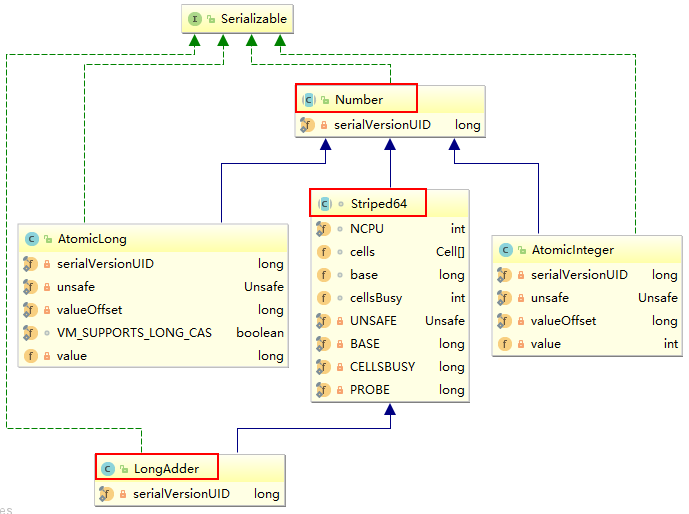

LongAdder是Striped64的子类


##### 2、剩下两罗汉

```java
Striped64
Number
```

##### 3、原理(LongAdder为什么这么快)


###### 1、Striped64有几个比较重要的成员函数

```java
/** Number of CPUS, to place bound on table size        CPU数量，即cells数组的最大长度 */
static final int NCPU = Runtime.getRuntime().availableProcessors();

/**
 * Table of cells. When non-null, size is a power of 2.
cells数组，为2的幂，2,4,8,16.....，方便以后位运算
 */
transient volatile Cell[] cells;

/**基础value值，当并发较低时，只累加该值主要用于没有竞争的情况，通过CAS更新。
 * Base value, used mainly when there is no contention, but also as
 * a fallback during table initialization races. Updated via CAS.
 */
transient volatile long base;

/**创建或者扩容Cells数组时使用的自旋锁变量调整单元格大小（扩容），创建单元格时使用的锁。
 * Spinlock (locked via CAS) used when resizing and/or creating Cells. 
 */
transient volatile int cellsBusy;
```

最重要的2个


###### 2、Striped64中一些变量或者方法的定义


###### 3、Cell

是 java.util.concurrent.atomic 下 Striped64 的一个内部类

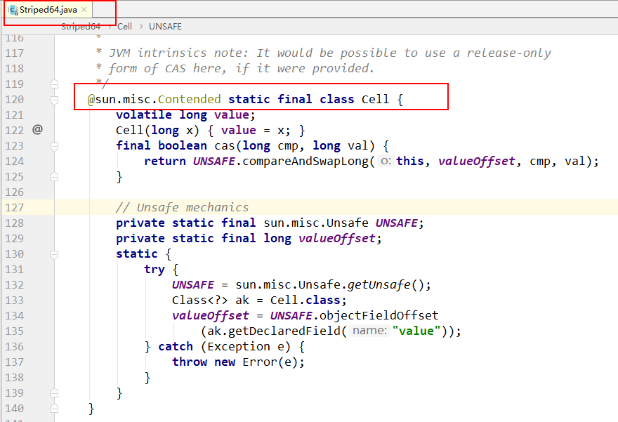

###### 4、LongAdder为什么这么快

 LongAdder的基本思路就是分散热点，将value值分散到一个Cell数组中，不同线程会命中到数组的不同槽中，各个线程只对自己槽中的那个值进行CAS操作，这样热点就被分散了，冲突的概率就小很多。如果要获取真正的long值，只要将各个槽中的变量值累加返回。

 sum()会将所有Cell数组中的value和base累加作为返回值，核心的思想就是将之前AtomicLong一个value的更新压力分散到多个value中去， 从而降级更新热点。

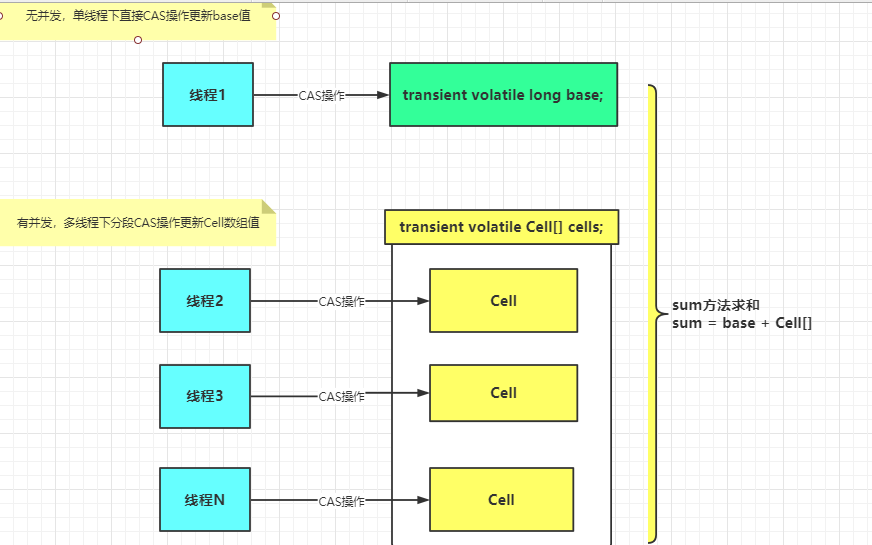


内部有一个base变量，一个Cell[]数组。

base变量：非竞态条件下，直接累加到该变量上

Cell[]数组：竞态条件下，累加个各个线程自己的槽Cell[i]中

##### 4、源码解读深度分析

 LongAdder在无竞争的情况，跟AtomicLong一样，对同一个base进行操作，当出现竞争关系时则是采用化整为零的做法，从空间换时间，用一个数组cells，将一个value拆分进这个数组cells。多个线程需要同时对value进行操作时候，可以对线程id进行hash得到hash值，再根据hash值映射到这个数组cells的某个下标，再对该下标所对应的值进行自增操作。当所有线程操作完毕，将数组cells的所有值和无竞争值base都加起来作为最终结果。

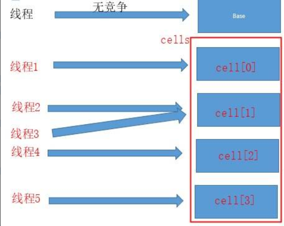

```java
longAdder.increment()
```

###### 1、add(1L)

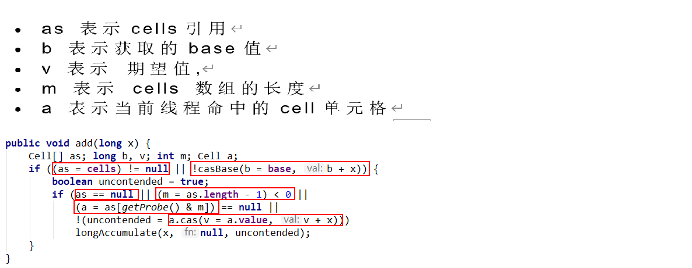

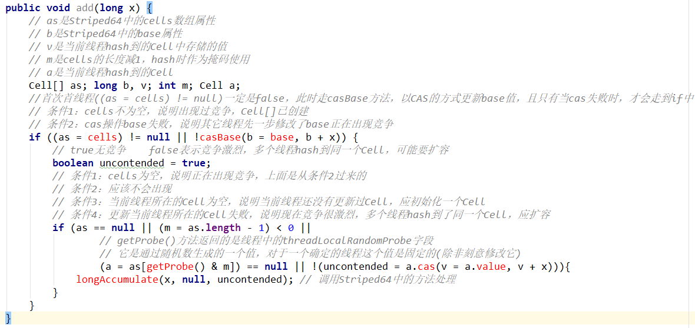

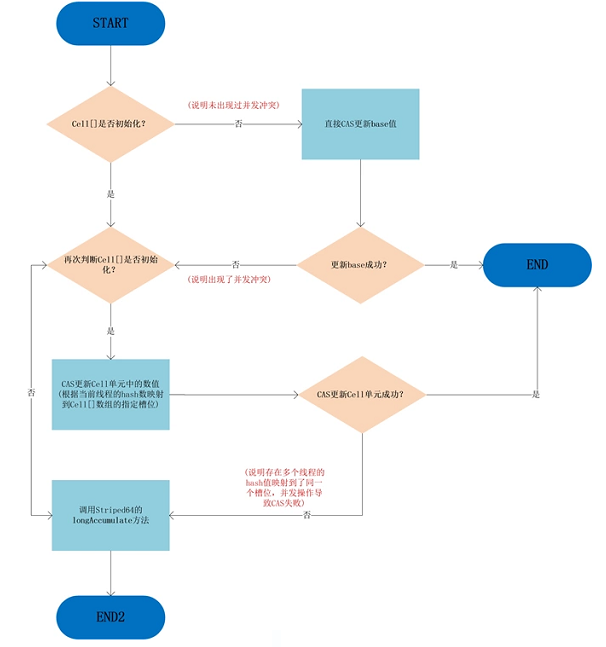

1. 最初无竞争时只更新base；
2. 如果更新base失败后，首次新建一个Cell[]数组
3. 当多个线程竞争同一个Cell比较激烈时，可能就要对Cell[]扩容

###### 2、longAccumulate

**longAccumulate入参说明**


**Striped64中一些变量或者方法的定义**


**线程hash值：probe**


**总纲**


```
上述代码首先给当前线程分配一个hash值，然后进入一个for(;;)自旋，这个自旋分为三个分支：
CASE1：Cell[]数组已经初始化
CASE2：Cell[]数组未初始化(首次新建)
CASE3：Cell[]数组正在初始化中
```

刚刚要初始化Cell[]数组(首次新建)

未初始化过Cell[]数组，尝试占有锁并首次初始化cells数组

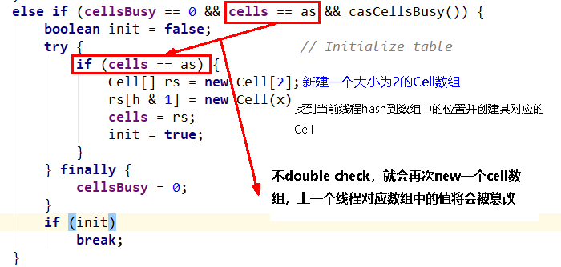

```
如果上面条件都执行成功就会执行数组的初始化及赋值操作， Cell[] rs = new Cell[2]表示数组的长度为2，
rs[h & 1] = new Cell(x) 表示创建一个新的Cell元素，value是x值，默认为1。
h & 1类似于我们之前HashMap常用到的计算散列桶index的算法，通常都是hash & (table.len - 1)。同hashmap一个意思。
```

**兜底**

多个线程尝试CAS修改失败的线程会走到这个分支


该分支实现直接操作base基数，将值累加到base上，也即其它线程正在初始化，多个线程正在更新base的值。

**Cell数组不再为空且可能存在Cell数组扩容**

多个线程同时命中一个cell的竞争


1. 

```
上面代码判断当前线程hash后指向的数据位置元素是否为空，
如果为空则将Cell数据放入数组中，跳出循环。
如果不空则继续循环。
```

1. 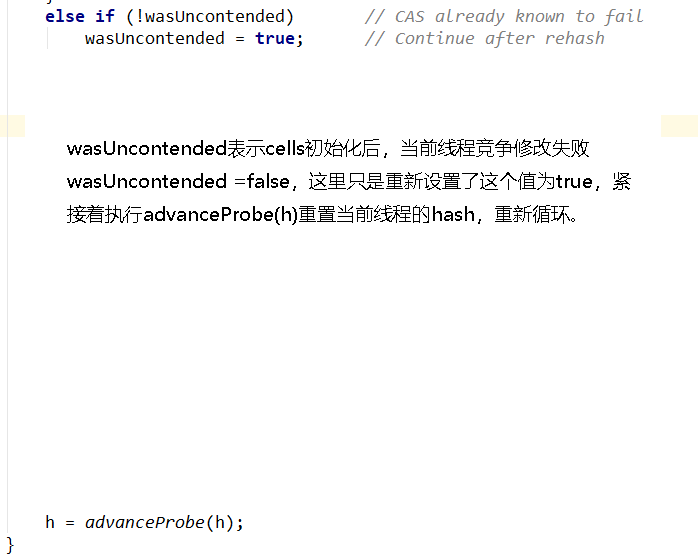

2. 

   ```
   说明当前线程对应的数组中有了数据，也重置过hash值，
   这时通过CAS操作尝试对当前数中的value值进行累加x操作，x默认为1，如果CAS成功则直接跳出循环。
   ```

3. 

4. 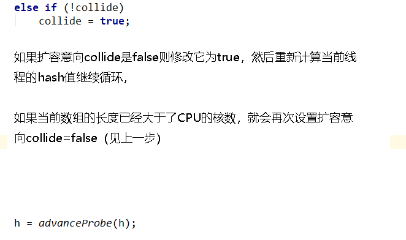

5. 

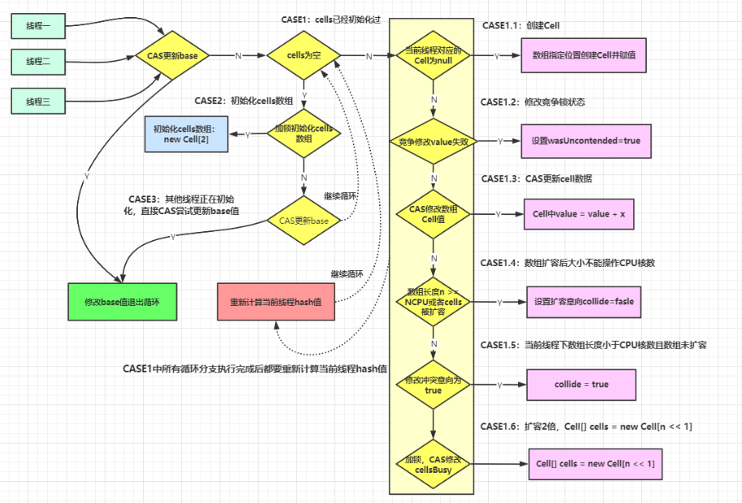

###### 3、sum

sum()会将所有Cell数组中的value和base累加作为返回值。 核心的思想就是将之前AtomicLong一个value的更新压力分散到多个value中去，从而降级更新热点。

**为啥在并发情况下sum的值不精确**

sum执行时，并没有限制对base和cells的更新(一句要命的话)。所以LongAdder不是强一致性的，它是最终一致性的。

 首先，最终返回的sum局部变量，初始被复制为base，而最终返回时，很可能base已经被更新了，而此时局部变量sum不会更新，造成不一致。 其次，这里对cell的读取也无法保证是最后一次写入的值。所以，sum方法在没有并发的情况下，可以获得正确的结果。


#### 5、使用总结

- AtomicLong
  - 线程安全，可允许一些性能损耗，要求高精度时可使用
  - 保证精度，性能代价
  - AtomicLong是多个线程针对单个热点值value进行原子操作
- LongAdder
  - 当需要在高并发下有较好的性能表现，且对值的精确度要求不高时，可以使用
  - 保证性能，精度代价
  - LongAdder是每个线程拥有自己的槽，各个线程一般只对自己槽中的那个值进行CAS操作

### 7、总结

#### 1、AtomicLong

- 原理
  - CAS+自旋
  - incrementAndGet
- 场景
  - 低并发下的全局计算
  - AtomicLong能保证并发情况下计数的准确性，其内部通过CAS来解决并发安全性的问题。
- 缺陷
  - 高并发后性能急剧下降
  - AtomicLong的自旋会成为瓶颈
  - N个线程CAS操作修改线程的值，每次只有一个成功过，其它N - 1失败，失败的不停的自旋直到成功，这样大量失败自旋的情况，一下子cpu就打高了。

#### 2、LongAdder

- 原理
  - CAS+Base+Cell数组分散
  - 空间换时间并分散了热点数据
- 场景
  - 高并发下的全局计算
- 缺陷
  - sum求和后还有计算线程修改结果的话，最后结果不够准确