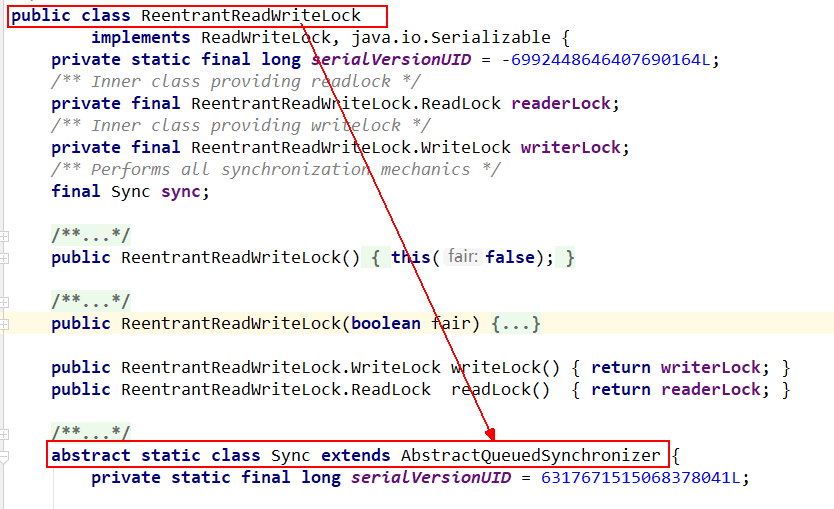
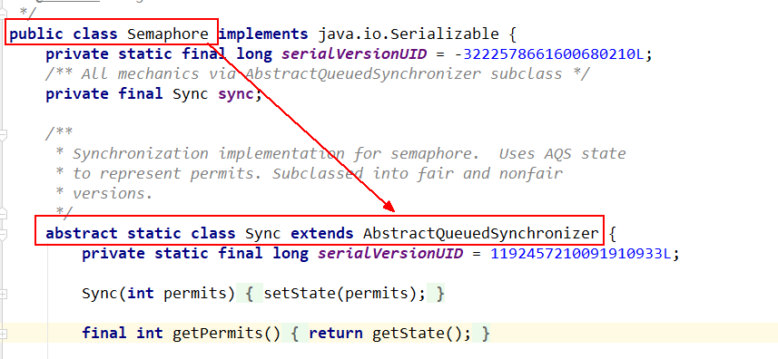
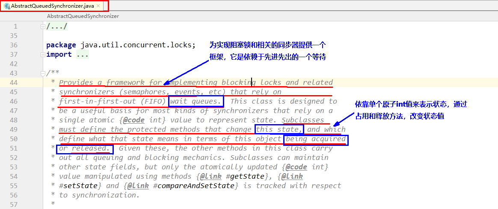
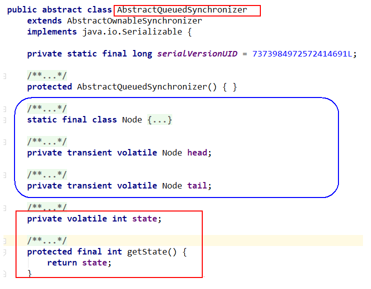
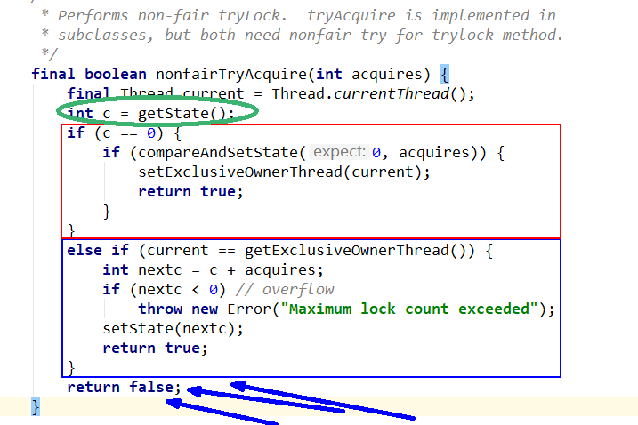
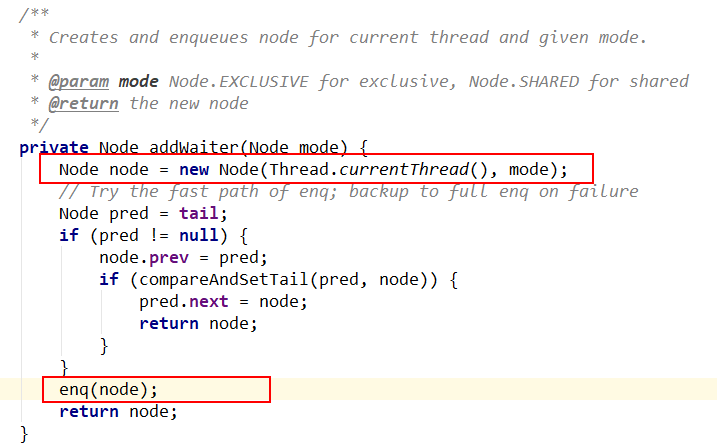
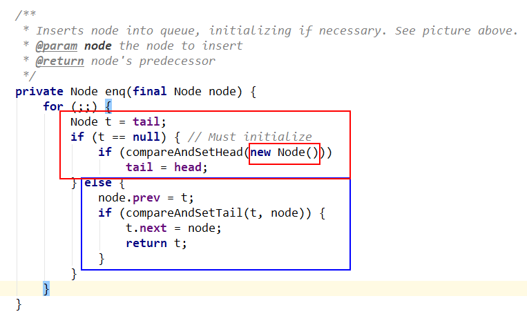
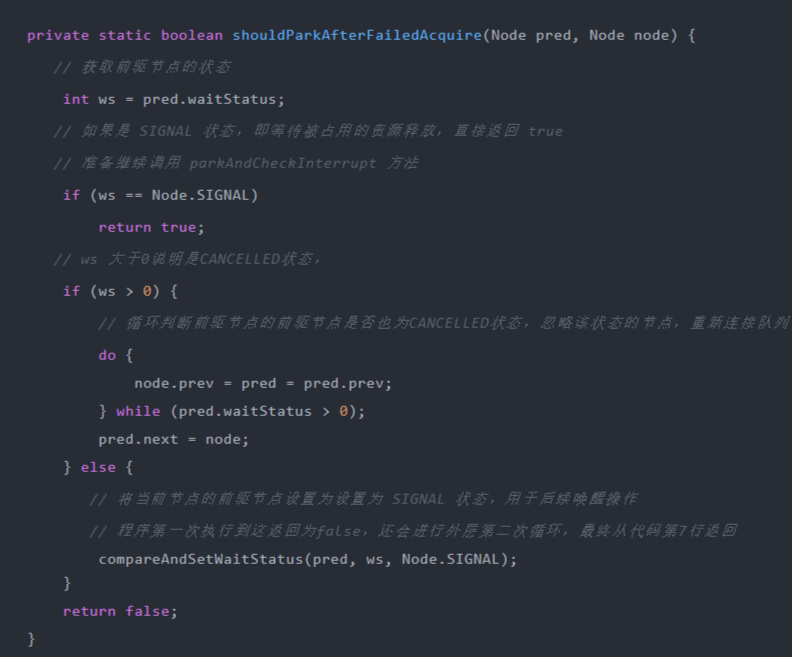

---
# 当前页面内容标题
title: 十六、AbstractQueuedSynchronizer之AQS
# 分类
category:
  - JUC
  - java
# 标签
tag: 
  - java
  - juc
  - 并发编程
sticky: false
# 是否收藏在博客主题的文章列表中，当填入数字时，数字越大，排名越靠前。
star: false
# 是否将该文章添加至文章列表中
article: true
# 是否将该文章添加至时间线中
timeline: true
---

## 十六、AbstractQueuedSynchronizer之AQS

### 1、AQS是什么

字面意思:抽象的队列同步器


```java
AbstractOwnableSynchronizer
AbstractQueuedLongSynchronizer
AbstractQueuedSynchronizer                  
通常地：AbstractQueuedSynchronizer简称为AQS
```

**技术解释**

 是用来构建锁或者其它同步器组件的重量级基础框架及整个JUC体系的基石，通过内置的FIFO队列来完成资源获取线程的排队工作，并通过一个int类变量表示持有锁的状态


CLH：Craig、Landin and Hagersten 队列，是一个单向链表，AQS中的队列是CLH变体的虚拟双向队列FIFO

### 2、AQS为什么是JUC内容中最重要的基石

#### 1、和AQS有关的


#### 2、ReentrantLock


#### 3、CountDownLatch


#### 4、ReentrantReadWriteLock



#### 5、Semaphore



#### 6、进一步理解锁和同步器的关系

锁，面向锁的使用者

定义了程序员和锁交互的使用层API，隐藏了实现细节，你调用即可。

同步器，面向锁的实现者

比如Java并发大神DougLee，提出统一规范并简化了锁的实现，屏蔽了同步状态管理、阻塞线程排队和通知、唤醒机制等。

### 3、AQS能干嘛

加锁会导致阻塞，有阻塞就需要排队，实现排队必然需要队列

 抢到资源的线程直接使用处理业务，抢不到资源的必然涉及一种排队等候机制。抢占资源失败的线程继续去等待(类似银行业务办理窗口都满了，暂时没有受理窗口的顾客只能去候客区排队等候)，但等候线程仍然保留获取锁的可能且获取锁流程仍在继续(候客区的顾客也在等着叫号，轮到了再去受理窗口办理业务)。

既然说到了排队等候机制，那么就一定会有某种队列形成，这样的队列是什么数据结构呢？

 如果共享资源被占用，就需要一定的阻塞等待唤醒机制来保证锁分配。这个机制主要用的是CLH队列的变体实现的，将暂时获取不到锁的线程加入到队列中，这个队列就是AQS的抽象表现。它将请求共享资源的线程封装成队列的结点（Node），通过CAS、自旋以及LockSupport.park()的方式，维护state变量的状态，使并发达到同步的效果。


### 4、AQS初步

#### 1、官网解释



有阻塞就需要排队，实现排队必然需要队列

 AQS使用一个volatile的int类型的成员变量来表示同步状态，通过内置的FIFO队列来完成资源获取的排队工作将每条要去抢占资源的线程封装成一个Node节点来实现锁的分配，通过CAS完成对State值的修改。


#### 2、AQS内部体系架构




##### 1、AQS自身

1. AQS的int变量

AQS的同步状态State成员变量


银行办理业务的受理窗口状态

零就是没人，自由状态可以办理

大于等于1，有人占用窗口，等着去

1. AQS的CLH队列

CLH队列(三个大牛的名字组成)，为一个双向队列


**小总结**

有阻塞就需要排队，实现排队必然需要队列

state变量+CLH双端队列

##### 2、内部类Node(Node类在AQS类内部)

1. Node的int变量

Node的等待状态waitState成员变量

```java
volatile int waitStatus
```

等候区其它顾客(其它线程)的等待状态

队列中每个排队的个体就是一个 Node

1. Node此类的讲解


##### 3、AQS同步队列的基本结构


CLH：Craig、Landin and Hagersten 队列，是个单向链表，AQS中的队列是CLH变体的虚拟双向队列（FIFO）

### 5、从ReentrantLock开始解读AQS

Lock接口的实现类，基本都是通过【聚合】了一个【队列同步器】的子类完成线程访问控制的

#### 1、ReentrantLock的原理


#### 2、从最简单的lock方法开始看看公平和非公平


> 可以明显看出公平锁与非公平锁的lock()方法唯一的区别就在于公平锁在获取同步状态时多了一个限制条件： hasQueuedPredecessors() hasQueuedPredecessors是公平锁加锁时判断等待队列中是否存在有效节点的方法

#### 3、非公平锁 方法lock()

对比公平锁和非公平锁的 tryAcquire()方法的实现代码，其实差别就在于非公平锁获取锁时比公平锁中少了一个判断 !hasQueuedPredecessors()

hasQueuedPredecessors() 中判断了是否需要排队，导致公平锁和非公平锁的差异如下：

公平锁：公平锁讲究先来先到，线程在获取锁时，如果这个锁的等待队列中已经有线程在等待，那么当前线程就会进入等待队列中；

非公平锁：不管是否有等待队列，如果可以获取锁，则立刻占有锁对象。也就是说队列的第一个排队线程在unpark()，之后还是需要竞争锁（存在线程竞争的情况下）


#### 4、源码解读

##### 1、lock()


##### 2、acquire()


##### 3、tryAcquire(arg)

非公平锁


nonfairTryAcquire(acquires)



return false; 继续推进条件，走下一个方法

return true; 结束

##### 4、addWaiter(Node.EXCLUSIVE)

addWaiter(Node mode)



enq(node);



双向链表中，第一个节点为虚节点(也叫哨兵节点)，其实并不存储任何信息，只是占位。 真正的第一个有数据的节点，是从第二个节点开始的。

假如3号ThreadC线程进来

prev - compareAndSetTail - next

##### 5、acquireQueued(addWaiter(Node.EXCLUSIVE), arg)

acquireQueued


假如再抢抢失败就会进入

shouldParkAfterFailedAcquire 和 parkAndCheckInterrupt 方法中


shouldParkAfterFailedAcquire



 如果前驱节点的 waitStatus 是 SIGNAL状态，即 shouldParkAfterFailedAcquire 方法会返回 true 程序会继续向下执行 parkAndCheckInterrupt 方法，用于将当前线程挂起

parkAndCheckInterrupt


#### 5、unlock

sync.release(1);

tryRelease(arg)

unparkSuccessor