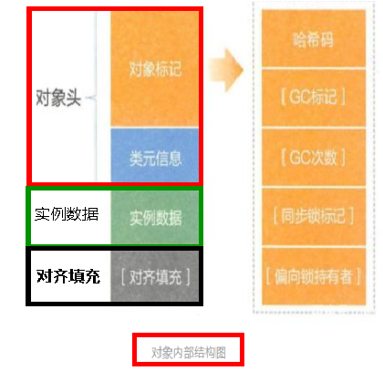
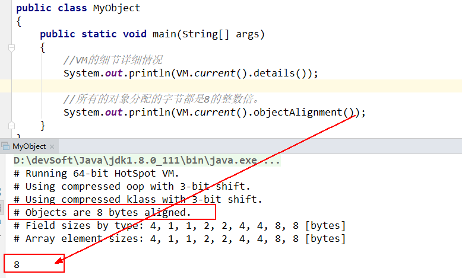
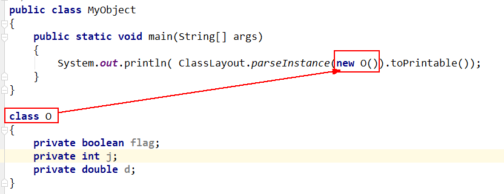

---
# 当前页面内容标题
title: 十四、Java对象内存布局和对象头
# 分类
category:
  - JUC
  - java
# 标签
tag: 
  - java
  - juc
  - 并发编程
sticky: false
# 是否收藏在博客主题的文章列表中，当填入数字时，数字越大，排名越靠前。
star: false
# 是否将该文章添加至文章列表中
article: true
# 是否将该文章添加至时间线中
timeline: true
---

## 十四、Java对象内存布局和对象头

### 1、对象在堆内存中布局


#### 1、对象在堆内存中的存储布局


对象内部结构分为：对象头、实例数据、对齐填充（保证8个字节的倍数）。 对象头分为对象标记（markOop）和类元信息（klassOop），类元信息存储的是指向该对象类元数据（klass）的首地址。

#### 2、对象头

##### 1、对象标记Mark Word




在64位系统中，Mark Word占了8个字节，类型指针占了8个字节，一共是16个字节


 默认存储对象的HashCode、分代年龄和锁标志位等信息。这些信息都是与对象自身定义无关的数据，所以MarkWord被设计成一个非固定的数据结构以便在极小的空间内存存储尽量多的数据。它会根据对象的状态复用自己的存储空间，也就是说在运行期间MarkWord里存储的数据会随着锁标志位的变化而变化。

##### 2、类元信息(又叫类型指针)


对象指向它的类元数据的指针，虚拟机通过这个指针来确定这个对象是哪个类的实例。

##### 3、对象头多大

在64位系统中，Mark Word占了8个字节，类型指针占了8个字节，一共是16个字节。

#### 3、实例数据

存放类的属性(Field)数据信息，包括父类的属性信息，如果是数组的实例部分还包括数组的长度，这部分内存按4字节对齐。

#### 4、对齐填充

虚拟机要求对象起始地址必须是8字节的整数倍。填充数据不是必须存在的，仅仅是为了字节对齐这部分内存按8字节补充对齐。

http://openjdk.java.net/groups/hotspot/docs/HotSpotGlossary.html

http://hg.openjdk.java.net/jdk8u/jdk8u/hotspot/file/89fb452b3688/src/share/vm/oops/oop.hpp


_mark字段是mark word，_metadata是类指针klass pointer， 对象头（object header）即是由这两个字段组成，这些术语可以参考Hotspot术语表，


### 2、MarkWord

#### 1、oop.hpp


#### 2、markOop.hpp

```
hash： 保存对象的哈希码
age： 保存对象的分代年龄
biased_lock： 偏向锁标识位
lock： 锁状态标识位
JavaThread* ：保存持有偏向锁的线程ID
epoch： 保存偏向时间戳
```


markword(64位)分布图，对象布局、GC回收和后面的锁升级就是对象标记MarkWord里面标志位的变化


### 3、聊聊Object obj = new Object()

#### 1、JOL证明

http://openjdk.java.net/projects/code-tools/jol/

```xml
<!--
官网：http://openjdk.java.net/projects/code-tools/jol/
定位：分析对象在JVM的大小和分布
-->
<dependency>
    <groupId>org.openjdk.jol</groupId>
    <artifactId>jol-core</artifactId>
    <version>0.9</version>
</dependency>
public class MyObject
{
    public static void main(String[] args){
        //VM的细节详细情况
        System.out.println(VM.current().details());
        //所有的对象分配的字节都是8的整数倍。
        System.out.println(VM.current().objectAlignment());
    }
}
```



```java
public class JOLDemo
{
    public static void main(String[] args)
    {
        Object o = new Object();
        System.out.println( ClassLayout.parseInstance(o).toPrintable());
    }
}
```


| OFFSET      | 偏移量，也就是到这个字段位置所占用的byte数 |
| ----------- | ----------------------- |
| SIZE        | 后面类型的字节大小               |
| TYPE        | 是Class中定义的类型            |
| DESCRIPTION | DESCRIPTION是类型的描述       |
| VALUE       | VALUE是TYPE在内存中的值        |

**GC年龄采用4位bit存储，最大为15，例如MaxTenuringThreshold参数默认值就是15**

-XX:MaxTenuringThreshold=16


#### 2、默认开启压缩说明

```
java -XX:+PrintCommandLineFlags -version
```


```
-XX:+UseCompressedClassPointers
```


上述表示开启了类型指针的压缩，以节约空间，假如不加压缩？？？

**手动关闭压缩再看看**

```
-XX:-UseCompressedClassPointers
```


### 4、换成其他对象试试




