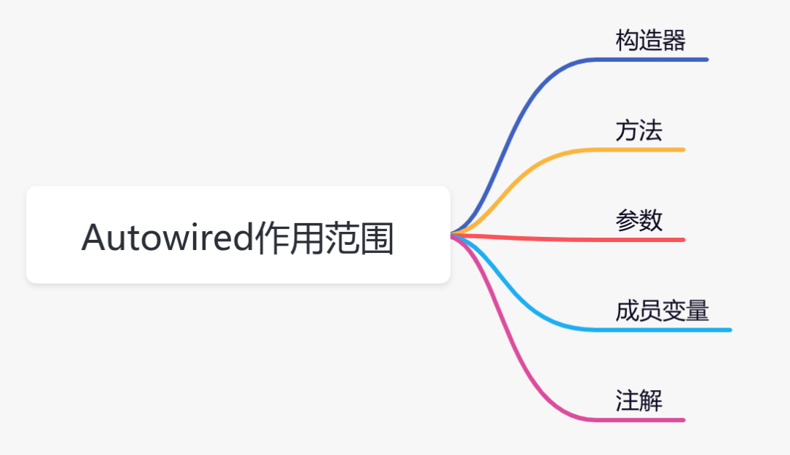
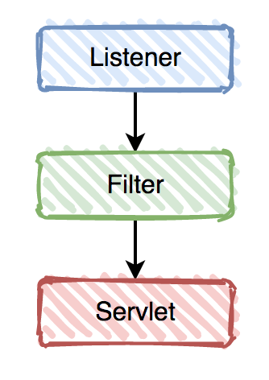
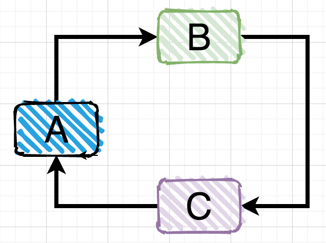
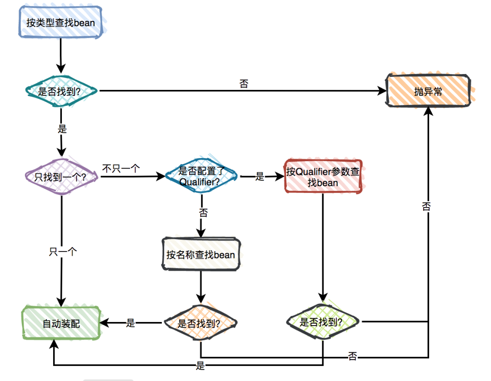
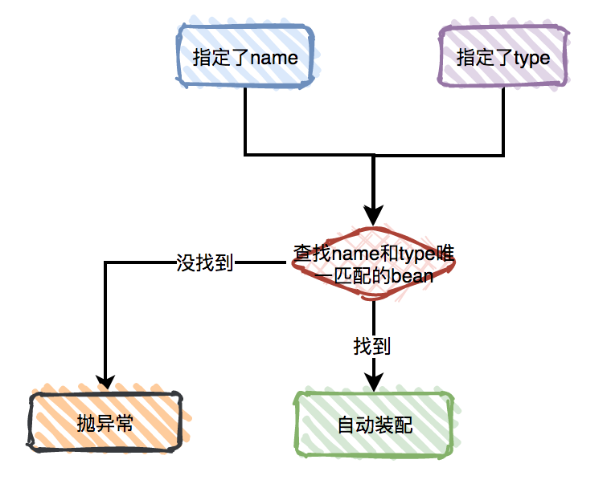
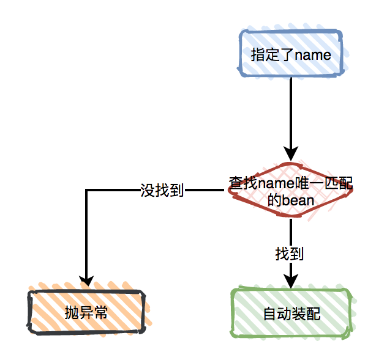
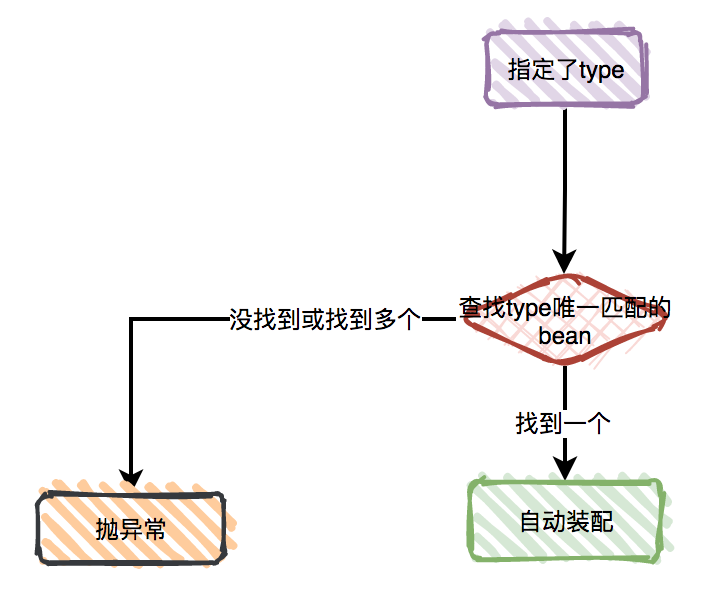
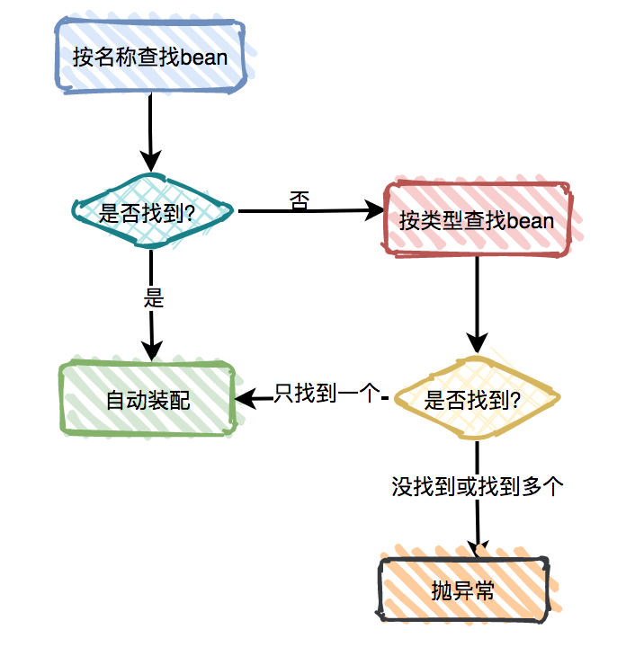

---
# 当前页面内容标题
title: Spring和IDEA都不推荐用的@Autowired注解，为什么还有那么多人用？
# 分类
category:
  - java
# 标签
tag: 
  - java
  - spring
sticky: false
# 是否收藏在博客主题的文章列表中，当填入数字时，数字越大，排名越靠前。
star: false
# 是否将该文章添加至文章列表中
article: true
# 是否将该文章添加至时间线中
timeline: true
---

## 前言

最近review别人代码的时候，看到了一些`@Autowired`不一样的用法，觉得有些意思，特定花时间研究了一下，收获了不少东西，现在分享给大家。

也许`@Autowired`比你想象中更强大。


## 1. @Autowired的默认装配

我们都知道在spring中@Autowired注解，是用来自动装配对象的。通常，我们在项目中是这样用的：

```java
package com.sue.cache.service;

import org.springframework.stereotype.Service;

@Service
public class TestService1 {
    public void test1() {
    }
}
```

```java
package com.sue.cache.service;

import org.springframework.stereotype.Service;

@Service
public class TestService2 {

    @Autowired
    private TestService1 testService1;

    public void test2() {
    }
}
```

没错，这样是能够装配成功的，因为默认情况下spring是按照类型装配的，也就是我们所说的`byType`方式。

此外，@Autowired注解的`required`参数默认是true，表示开启自动装配，有些时候我们不想使用自动装配功能，可以将该参数设置成false。

## 2. 相同类型的对象不只一个时

上面`byType`方式主要针对相同类型的对象只有一个的情况，此时对象类型是唯一的，可以找到正确的对象。

但如果相同类型的对象不只一个时，会发生什么？

在项目的test目录下，建了一个同名的类TestService1：

```java
package com.sue.cache.service.test;

import org.springframework.stereotype.Service;

@Service
public class TestService1 {

    public void test1() {
    }
}
```

重新启动项目时：

```java
`Caused by: org.springframework.context.annotation.ConflictingBeanDefinitionException: Annotation-specified bean name 'testService1' for bean class [com.sue.cache.service.test.TestService1] conflicts with existing, non-compatible bean definition of same name and class [com.sue.cache.service.TestService1]      `
```

结果报错了，报类类名称有冲突，直接导致项目启动不来。

> 注意，这种情况不是相同类型的对象在Autowired时有两个导致的，非常容易产生混淆。这种情况是因为spring的@Service方法不允许出现相同的类名，因为spring会将类名的第一个字母转换成小写，作为bean的名称，比如：testService1，而默认情况下bean名称必须是唯一的。

下面看看如何产生两个相同的类型bean：

```java
public class TestService1 {

    public void test1() {
    }
}
```

```java
@Service
public class TestService2 {

    @Autowired
    private TestService1 testService1;

    public void test2() {
    }
}
```

```java
@Configuration
public class TestConfig {

    @Bean("test1")
    public TestService1 test1() {
        return new TestService1();
    }

    @Bean("test2")
    public TestService1 test2() {
        return new TestService1();
    }
}
```

在TestConfig类中手动创建TestService1实例，并且去掉TestService1类上原有的@Service注解。

重新启动项目：


果然报错了，提示testService1是单例的，却找到两个对象。

其实还有一个情况会产生两个相同的类型bean：

```java
public interface IUser {
    void say();
}
```

```java
@Service
public class User1 implements IUser{
    @Override
    public void say() {
    }
}
```

```java
@Service
public class User2 implements IUser{
    @Override
    public void say() {
    }
}
```

```java
@Service
public class UserService {

    @Autowired
    private IUser user;
}
```

项目重新启动时：


报错了，提示跟上面一样，testService1是单例的，却找到两个对象。

第二种情况在实际的项目中出现得更多一些，后面的例子，我们主要针对第二种情况。

## 3. @Qualifier和@Primary

显然在spring中，按照Autowired默认的装配方式：byType，是无法解决上面的问题的，这时可以改用按名称装配：byName。

只需在代码上加上`@Qualifier`注解即可：

```java
@Service
public class UserService {

    @Autowired
    @Qualifier("user1")
    private IUser user;
}
```

> Qualifier意思是合格者，一般跟Autowired配合使用，需要指定一个bean的名称，通过bean名称就能找到需要装配的bean。

除了上面的`@Qualifier`注解之外，还能使用`@Primary`注解解决上面的问题。在User1上面加上@Primary注解：

```java
@Primary
@Service
public class User1 implements IUser{
    @Override
    public void say() {
    }
}
```

去掉UserService上的@Qualifier注解：

```java
@Service
public class UserService {

    @Autowired
    private IUser user;
}
```

重新启动项目，一样能正常运行。

> 当我们使用自动配置的方式装配Bean时，如果这个Bean有多个候选者，假如其中一个候选者具有@Primary注解修饰，该候选者会被选中，作为自动配置的值。

## 4. @Autowired的使用范围

上面的实例中@Autowired注解，都是使用在成员变量上，但@Autowired的强大之处，远非如此。


从图中可以看出该注解能够使用在5种目标类型上，下面用一张图总结一下：



该注解我们平常使用最多的地方可能是在成员变量上。

接下来，我们重点看看在其他地方该怎么用？

### 4.1 成员变量

在成员变量上使用Autowired注解：

```java
@Service
public class UserService {

    @Autowired
    private IUser user;
}
```

这种方式可能是平时用得最多的。

### 4.2 构造器

在构造器上使用Autowired注解：

```java
@Service
public class UserService {

    private IUser user;

    @Autowired
    public UserService(IUser user) {
        this.user = user;
        System.out.println("user:" + user);
    }
}
```

> 注意，在构造器上加Autowired注解，实际上还是使用了Autowired装配方式，并非构造器装配。

### 4.3 方法

在普通方法上加Autowired注解：

```java
@Service
public class UserService {

    @Autowired
    public void test(IUser user) {
       user.say();
    }
}
```

spring会在项目启动的过程中，自动调用一次加了@Autowired注解的方法，我们可以在该方法做一些初始化的工作。

也可以在setter方法上Autowired注解：

```java
@Service
public class UserService {

    private IUser user;

    @Autowired
    public void setUser(IUser user) {
        this.user = user;
    }
}
```

### 4.4 参数

可以在构造器的入参上加Autowired注解：

```java
@Service
public class UserService {

    private IUser user;

    public UserService(@Autowired IUser user) {
        this.user = user;
        System.out.println("user:" + user);
    }
}
```

也可以在非静态方法的入参上加Autowired注解：

```java
@Service
public class UserService {

    public void test(@Autowired IUser user) {
       user.say();
    }
}
```

### 4.5 注解

这种方式其实用得不多，我就不过多介绍了。

## 5. @Autowired的高端玩法

其实上面举的例子都是通过@Autowired自动装配单个实例，但这里我会告诉你，它也能自动装配多个实例，怎么回事呢？

将UserService方法调整一下，用一个List集合接收IUser类型的参数：

```java
@Service
public class UserService {

    @Autowired
    private List<IUser> userList;

    @Autowired
    private Set<IUser> userSet;

    @Autowired
    private Map<String, IUser> userMap;

    public void test() {
        System.out.println("userList:" + userList);
        System.out.println("userSet:" + userSet);
        System.out.println("userMap:" + userMap);
    }
}
```

增加一个controller：

```java
@RequestMapping("/u")
@RestController
public class UController {

    @Autowired
    private UserService userService;

    @RequestMapping("/test")
    public String test() {
        userService.test();
        return "success";
    }
}
```

调用该接口后：


从上图中看出：userList、userSet和userMap都打印出了两个元素，说明@Autowired会自动把相同类型的IUser对象收集到集合中。

意不意外，惊不惊喜？

## 6. @Autowired一定能装配成功？

前面介绍了@Autowired注解这么多牛逼之处，其实有些情况下，即使使用了@Autowired装配的对象还是null，到底是什么原因呢？

### 6.1 没有加@Service注解

在类上面忘了加@Controller、@Service、@Component、@Repository等注解，spring就无法完成自动装配的功能，例如：

```java
public class UserService {

    @Autowired
    private IUser user;

    public void test() {
        user.say();
    }
}
```

这种情况应该是最常见的错误了，不会因为你长得帅，就不会犯这种低级的错误。

### 6.2 注入Filter或Listener

web应用启动的顺序是：`listener`->`filter`->`servlet`。



接下来看看这个案例：

```java
public class UserFilter implements Filter {

    @Autowired
    private IUser user;

    @Override
    public void init(FilterConfig filterConfig) throws ServletException {
        user.say();
    }

    @Override
    public void doFilter(ServletRequest request, ServletResponse response, FilterChain chain) throws IOException, ServletException {

    }

    @Override
    public void destroy() {
    }
}
```

```java
@Configuration
public class FilterConfig {

    @Bean
    public FilterRegistrationBean filterRegistrationBean() {
        FilterRegistrationBean bean = new FilterRegistrationBean();
        bean.setFilter(new UserFilter());
        bean.addUrlPatterns("/*");
        return bean;
    }
}
```

程序启动会报错：


tomcat无法正常启动。

什么原因呢？

众所周知，springmvc的启动是在DisptachServlet里面做的，而它是在listener和filter之后执行。如果我们想在listener和filter里面@Autowired某个bean，肯定是不行的，因为filter初始化的时候，此时bean还没有初始化，无法自动装配。

如果工作当中真的需要这样做，我们该如何解决这个问题呢？

```java
public class UserFilter  implements Filter {

    private IUser user;

    @Override
    public void init(FilterConfig filterConfig) throws ServletException {
        ApplicationContext applicationContext = WebApplicationContextUtils.getWebApplicationContext(filterConfig.getServletContext());
        this.user = ((IUser)(applicationContext.getBean("user1")));
        user.say();
    }

    @Override
    public void doFilter(ServletRequest request, ServletResponse response, FilterChain chain) throws IOException, ServletException {

    }

    @Override
    public void destroy() {

    }
}
```

答案是使用WebApplicationContextUtils.getWebApplicationContext获取当前的ApplicationContext，再通过它获取到bean实例。

### 6.3 注解未被@ComponentScan扫描

通常情况下，@Controller、@Service、@Component、@Repository、@Configuration等注解，是需要通过@ComponentScan注解扫描，收集元数据的。

但是，如果没有加@ComponentScan注解，或者@ComponentScan注解扫描的路径不对，或者路径范围太小，会导致有些注解无法收集，到后面无法使用@Autowired完成自动装配的功能。

有个好消息是，在springboot项目中，如果使用了`@SpringBootApplication`注解，它里面内置了@ComponentScan注解的功能。

### 6.4 循环依赖问题

如果A依赖于B，B依赖于C，C又依赖于A，这样就形成了一个死循环。



spring的bean默认是单例的，如果单例bean使用@Autowired自动装配，大多数情况，能解决循环依赖问题。

但是如果bean是多例的，会出现循环依赖问题，导致bean自动装配不了。

还有有些情况下，如果创建了代理对象，即使bean是单例的，依然会出现循环依赖问题。

如果你对循环依赖问题比较感兴趣，也可以看一下我的另一篇专题《》，里面介绍的非常详细。

## 7. @Autowired和@Resouce的区别

@Autowired功能虽说非常强大，但是也有些不足之处。比如：比如它跟spring强耦合了，如果换成了JFinal等其他框架，功能就会失效。而@Resource是JSR-250提供的，它是Java标准，绝大部分框架都支持。

除此之外，有些场景使用@Autowired无法满足的要求，改成@Resource却能解决问题。接下来，我们重点看看@Autowired和@Resource的区别。

- @Autowired默认按byType自动装配，而@Resource默认byName自动装配。

- @Autowired只包含一个参数：required，表示是否开启自动准入，默认是true。而@Resource包含七个参数，其中最重要的两个参数是：name 和 type。

- @Autowired如果要使用byName，需要使用@Qualifier一起配合。而@Resource如果指定了name，则用byName自动装配，如果指定了type，则用byType自动装配。

- @Autowired能够用在：构造器、方法、参数、成员变量和注解上，而@Resource能用在：类、成员变量和方法上。

- @Autowired是spring定义的注解，而@Resource是JSR-250定义的注解。

此外，它们的装配顺序不同。

**@Autowired的装配顺序如下：**



**@Resource的装配顺序如下：**

1. 如果同时指定了name和type：



2. 如果指定了name：



3. 如果指定了type：



4. 如果既没有指定name，也没有指定type：


