---
# 标题
title: 既然有Map了，为什么还要有Redis？
# 分类
category:
  - java
# 标签
tag:
  - java
  - redis
  - Map
sticky: false
# 是否收藏在博客主题的文章列表中，当填入数字时，数字越大，排名越靠前。
star: false
# 是否将该文章添加至文章列表中
article: true
# 是否将该文章添加至时间线中
timeline: true
---

## 一、同样是缓存，用map不行吗？

1. Redis可以存储几十个G的数据，Map行吗？
2. Redis的缓存可以进行本地持久化，Map行吗？
3. Redis可以作为分布式缓存，Map只能在同一个JVM中进行缓存；
4. Redis支持每秒百万级的并发，Map行吗？
5. Redis有过期机制，Map有吗？
6. Redis有丰富的API，支持非常多的应用场景，Map行吗？


## 二、Redis为什么是单线程的？

1. 代码更清晰，处理逻辑更简单；
2. 不用考虑各种锁的问题，不存在加锁和释放锁的操作，没有因为可能出现死锁而导致的性能问题；
3. 不存在多线程切换而消耗CPU；
4. 无法发挥多核CPU的优势，但可以采用多开几个Redis实例来完善；

## 三、Redis真的是单线程的吗？

1. Redis6.0之前是单线程的，Redis6.0之后开始支持多线程；
2. Redis内部使用了基于epoll的多路服用，也可以多部署几个Redis服务器解决单线程的问题；
3. Redis主要的性能瓶颈是内存和网络；
4. 内存好说，加内存条就行了，而网络才是大麻烦，所以Redis6内存好说，加内存条就行了；
5. 而网络才是大麻烦，所以Redis6.0引入了多线程的概念，
6. Redis6.0在网络IO处理方面引入了多线程，如网络数据的读写和协议解析等，需要注意的是，执行命令的核心模块还是单线程的。

## 四、Redis优缺点

### 1、优点

1. Redis是KV数据库，MySQL是关系型数据库，Redis速度更快；
2. Redis数据操作主要在内存中，MySQL主要将数据存储在硬盘，Redis速度更快；
3. Redis同样支持持久化（RDB+AOF），Redis支持将数据异步将内存的数据持久化到硬盘上，避免Redis宕机出现数据丢失的问题；
4. Redis性能极高，读的速度是110000次/秒，写的速度是81000次/秒；
5. Redis数据类型丰富，不仅支持KV键值对，还支持list、set、zset、hash等数据结构的存储；
6. Redis支持数据的备份，即master-slave模式的数据备份；
7. Redis支持简单的事务，操作满足原子性；
8. Redis支持读写分离，分担读的压力；
9. Redis支持哨兵模式，实现故障的自动转移；
10. 单线程操作，避免了频繁的上下文切换；
11. 采用了非阻塞I/O多路复用机制，性能卓越；

### 2、缺点

1. 数据存储在内存，容易造成数据丢失；
2. 存储容量受内存的限制，只能存储少量的常用数据；
3. 缓存和数据库双写一致性问题；
4. 用于缓存时，容易出现内存穿透、缓存击穿、缓存雪崩的问题；
5. 修改配置文件后，需要进行重启，将硬盘中的数据同步到内存中，消耗的时间较长，而且数据同步的时间里Redis不能提供服务；

## 五、Redis常见业务场景

1. Redis是基于内存的nosql数据库，可以通过新建线程的形式进行持久化，不影响Redis单线程的读写操作
2. 通过list取最新的N条数据
3. 模拟类似于token这种需要设置过期时间的场景
4. 发布订阅消息系统
5. 定时器、计数器
6. 缓存加速、分布式会话、排行榜、分布式计数器、分布式锁；
7. Redis支持事务、持久化、LUA脚本、发布/订阅、缓存淘汰、流技术等特性；

## 六、Redis常见数据类型

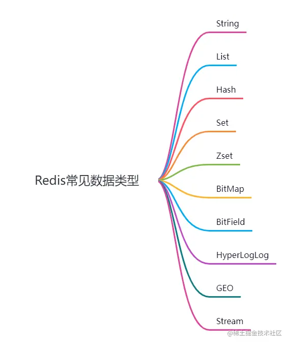

### 1、String

（1）String简介

String 是最基本的 key-value 结构，key 是唯一标识，value 是具体的值，value其实不仅是字符串， 也可以是数字（整数或浮点数），value 最多可以容纳的数据长度是 512M。

（2）应用场景

① 作为缓存数据库

在Java管理系统体系中，大多数都是用MySQL存储数据，redis作为缓存，因为Redis具有支撑高并发的特性，通常能起到加速读写和降低数据库服务器压力的作用，大多数请求都会先请求Redis，如果Redis中没有数据，再请求MySQL数据库，然后再缓存到Redis中，以备下次使用。

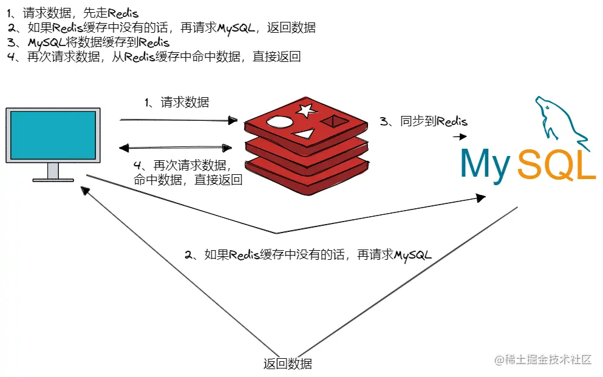

② 计数器

Redis字符串中有一个命令`INCR key`，incr命令会对值进行自增操作，比如CSDN的文章阅读，视频的播放量，都可以通过Redis来计数，每阅读一次就+1，同时将这些数据异步存储到MySQL数据库中，降低MySQL服务器的写入压力。

③ 共享session

在分布式系统中，用户每次请求一般会访问不同的服务器 ，这就会导致session不同步的问题，这时，一般会使用Redis来解决这个问题，将session存入Redis，使用的时候从Redis中取出就可以了。

④ 分布式锁

1. setnx key value，加锁
2. del key，释放锁

（3）key操作命令

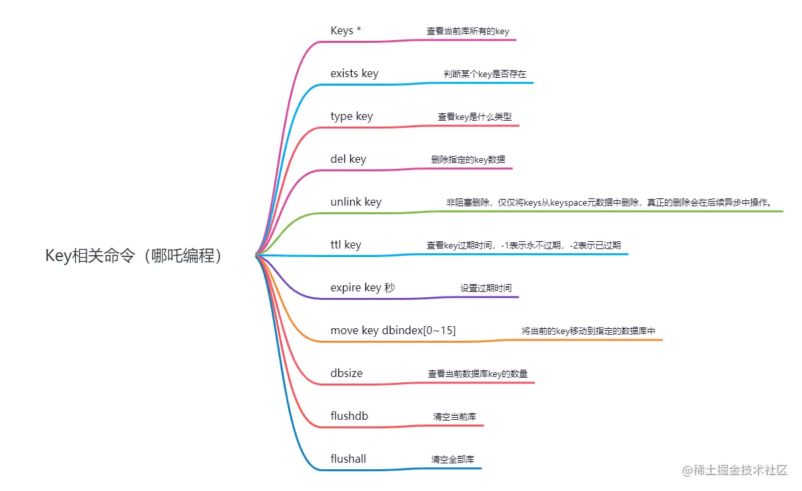

（4）set key value

```
SET key value [NX | XX] [GET] [EX seconds | PX milliseconds |  EXAT unix-time-seconds | PXAT unix-time-milliseconds | KEEPTTL]
```

1. EX seconds，设置过期时间，单位秒
2. PX milliseconds，设置过期时间，单位毫秒
3. EXAT timestamp-seconds，设置过期时间，以秒为单位的UNIX时间戳
4. PXAT timestamp-milliseconds，设置过期时间，以毫秒为单位的UNIX时间戳
5. NX，键不存在的时候设置键值
6. XX，键存在的时候设置键值
7. KEEPTTL，保留设置前指定键的生存时间
8. GET，返回指定键原本的值，若键不存在返回nil

备注：

命令不区分大小写，而key是区分大小写的。

`help @类型`：查看当前类型相关的操作命令。

Since the SET command options can replace SETNX, SETEX, PSETEX, GETSET, it is possible that in future versions of Redis these commands will be deprecated and finally removed。

（5）同时设置多个键值

（6）获取指定区间范围内的值

getrange、setrange。

（7）数值增减

1. INCR key，递增数字
2. INCRBY key increment，增加指定的数值递增
3. DECR key，递减数值
4. DECRBY key decrement，指定指定的数值递减

（8）获取字符串的长度，内容追加

1. STRLEN key，获取值的长度
2. APPEND key value，内容追加

### 2、List

（1）List 列表简介

List 列表是简单的字符串列表，按照插入顺序排序，可以从头部或尾部向 List 列表添加元素。

列表的最大长度为 2^32 - 1，也即每个列表支持超过 40 亿个元素。

主要功能有push/pop，一般用在栈、队列、消息队列等场景。

1. left、right都可以插入添加；
2. 如果键不存在，创建新的链表；
3. 如果键存在，新增内容；
4. 如果值全部移除，对应的键也会消失；

它的底层是**双向链表，对两端的操作性能很高**，通过索引下标操作中间的节点，性能会较差。

（2）应用场景

① 消息队列

使用 `lpush + rpop`或者 `rpush + lpop`实现消息队列，Redis还支持阻塞操作，在弹出元素的时候使用阻塞命令来实现阻塞队列。


② 作为栈使用

使用 `lpush+lpop`或者 `rpush+rpop`实现栈。


③ 文章列表

（3）常用命令

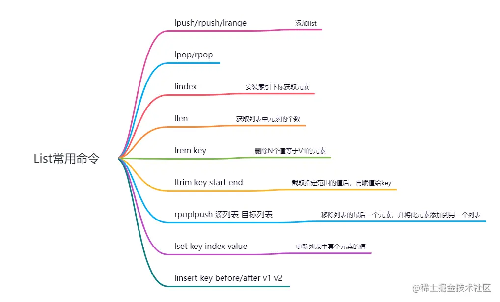

### 3、Hash

（1）hash简介

Hash 是一个键值对（key - value）集合，value也是一个hash，相当于 `Map<String,Map<Object,Object>>`。

（2）常用场景

由于特殊的数据结构，hash一般作为存储bean使用，String+JSON的数据结构存储特定的应用场景。


（3）常用命令

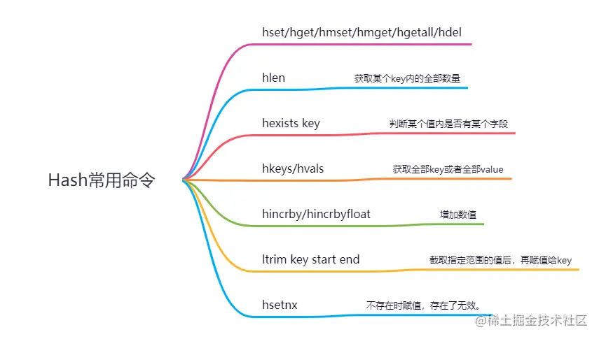

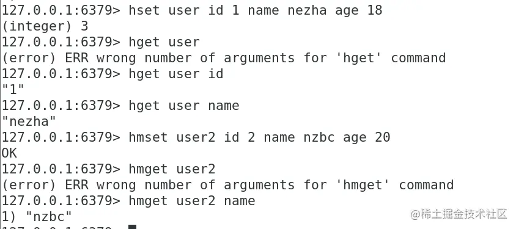

### 4、Set

（1）Set类型简介

Set 类型是一个无序并唯一的键值集合，它的存储顺序不会按照插入的先后顺序进行存储。

一个集合最多可以存储 2^32-1 个元素。概念和数学中个的集合基本类似，可以交集，并集，差集等等，所以 Set 类型除了支持集合内的增删改查，同时还支持多个集合取交集、并集、差集。

（2）应用场景

① 相同好友可见

在朋友圈场景中，对于点赞、评论的功能，通过交集实现相同还有可见的功能。

② 共同关注、共同喜好

③ 抽奖功能

（3）常用命令

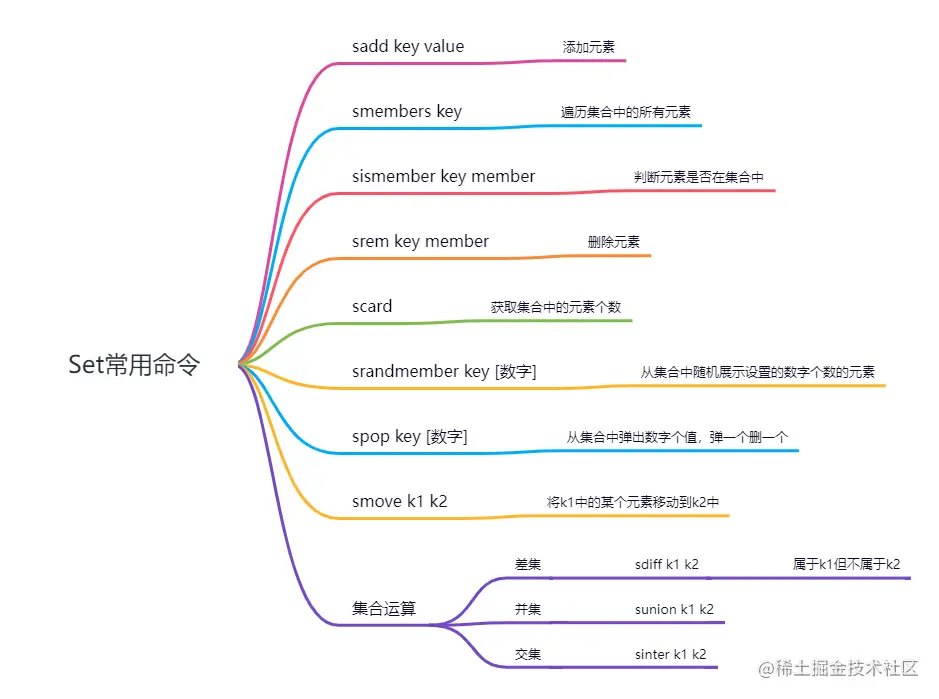

### 5、Zset

（1）Zset 类型简介

Zset 类型（有序集合类型）相比于 Set 类型多了一个排序属性 score（分值），对于有序集合 ZSet 来说，每个存储元素相当于有两个值组成的，一个是有序结合的元素值，一个是排序值。

有序集合保留了集合不能有重复成员的特性（分值可以重复），但不同的是，有序集合中的元素可以排序。

```
zset k1 score1 v1 score2 v2
```

（2）应用场景

① 排行榜

通过score来记录点赞数，然后根据score进行排序，实现排行榜的功能。

② 延迟消息队列

订单系统，下单后需要在15分钟内进行支付操作，否则自动取消订单。

将下单后15分钟后的时间作为score，订单作为value存入Redis，消费者轮询去消费，如果消费的大于等于score，则取消该订单。

（3）Zset常用命令

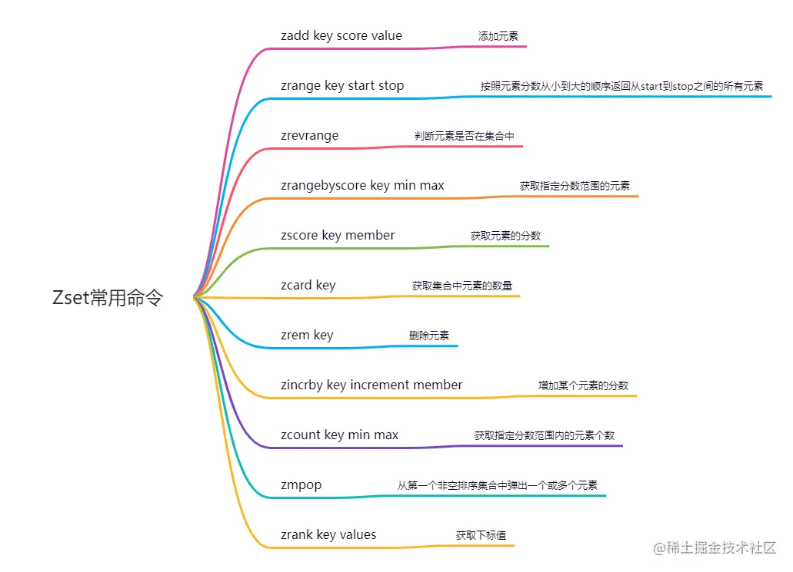

### 6、BitMap

（1）Bitmap简介

Bitmap，即位图，是一串连续的二进制数组（0和1），可以通过偏移量（offset）定位元素。BitMap通过最小的单位bit来进行0|1的设置，表示某个元素的值或者状态，时间复杂度为O(1)。

（2）应用场景

由于 bit 是计算机中最小的单位，使用它进行储存将非常节省空间，特别适合一些数据量大且使用二值统计的场景。

① 签到统计

② 判断用户是否登录

③ 统计连续学习打卡的人

（3）BitMap常用命令

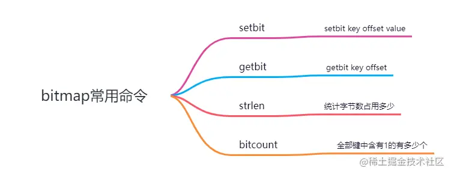

### 7、BitField

通过bitfield命令可以一次性操作多个比特位，它会执行一系列操作并返回一个响应数组，这个数组中的元素对参数列表中的相应操作的执行结果。

### 8、HyperLogLog

（1）HyperLogLog简介

Redis HyperLogLog 是 Redis 2.8.9 版本新增的数据类型，是一种用于「**统计基数**」的数据集合类型，基数统计就是指统计一个集合中不重复的元素个数。但要注意，HyperLogLog 是统计规则是基于概率完成的，不是非常准确，标准误算率是 0.81%。

所以，简单来说 HyperLogLog 提供不精确的去重计数。

HyperLogLog 的优点是，在输入元素的数量或者体积非常非常大时，计算基数所需的内存空间总是固定的、并且是很小的。

在 Redis 里面，每个 HyperLogLog 键只需要花费 12 KB 内存，就可以计算接近 2^64 个不同元素的基数，和元素越多就越耗费内存的 Set 和 Hash 类型相比，HyperLogLog 就非常节省空间。

（2）应用场景

百万级网页 UV 计数

（3）常用命令

1. pfadd key element，添加元素
2. pfcount key，返回指定HyperLogLog的基数的估算值；
3. pfmerge destkey sourcekey，将多个HyperLogLog合并成一个HyperLogLog；

### 9、GEO

（1）GEO简介

Redis GEO 是 Redis 3.2 版本新增的数据类型，主要用于存储地理位置信息，并对存储的信息进行操作。

在日常生活中，我们越来越依赖搜索“附近的餐馆”、在打车软件上叫车，这些都离不开基于位置信息服务（Location-Based Service，LBS）的应用。LBS 应用访问的数据是和人或物关联的一组经纬度信息，而且要能查询相邻的经纬度范围，GEO 就非常适合应用在 LBS 服务的场景中。

（2）应用场景

高德地图、滴滴打车等定位软件。

（3）常用命令

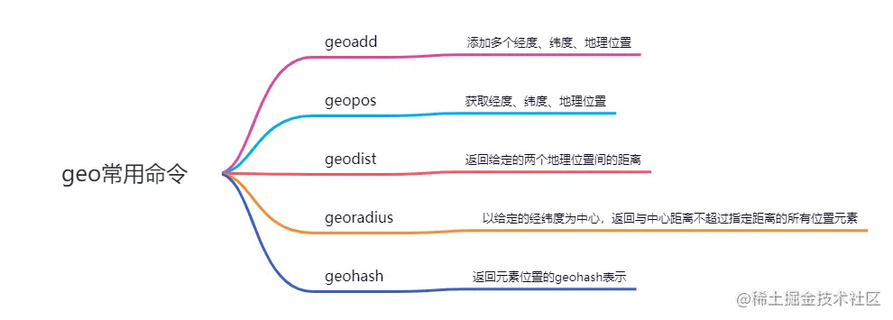

### 10、Stream

（1）Stream简介

Redis Stream 是 Redis 5.0 版本新增加的数据类型，Redis 专门为消息队列设计的数据类型。


在 Redis 5.0 Stream 没出来之前，消息队列的实现方式都有着各自的缺陷，例如：

- 发布订阅模式，不能持久化也就无法可靠的保存消息，并且对于离线重连的客户端不能读取历史消息的缺陷；
- List 实现消息队列的方式不能重复消费，一个消息消费完就会被删除，而且生产者需要自行实现全局唯一 ID。

基于以上问题，Redis 5.0 便推出了 Stream 类型也是此版本最重要的功能，用于完美地实现消息队列，它支持消息的持久化、支持自动生成全局唯一 ID、支持 ack 确认消息的模式、支持消费组模式等，让消息队列更加的稳定和可靠。

（2）应用场景

消息队列

（3）常用命令

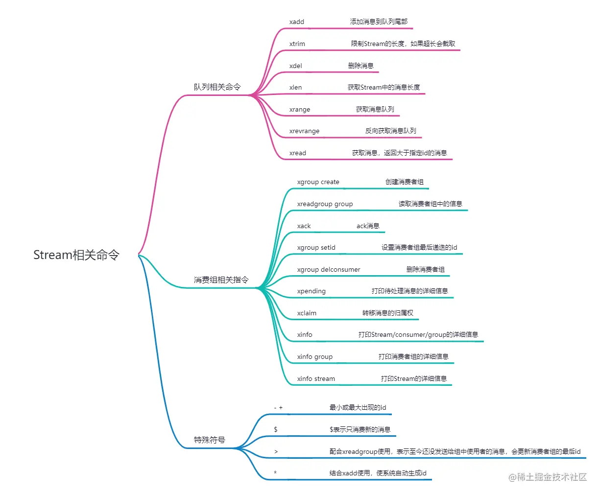

### 七、总结

Redis是一个key-value存储系统，支持10种数据类型，总结了为何要用Redis替代map作为程序缓存、Redis为什么是单线程的、Redis的优缺点、Redis的常用场景，做了一次Redis的快速入门。
