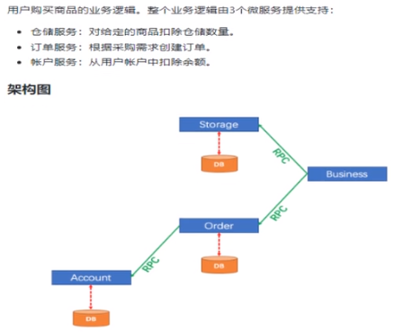
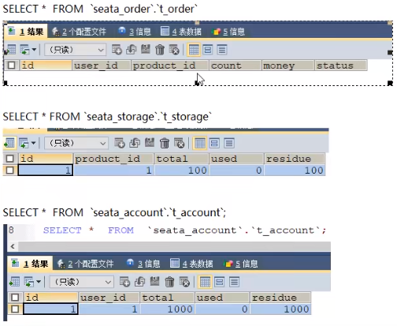
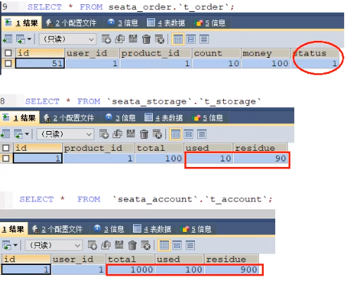
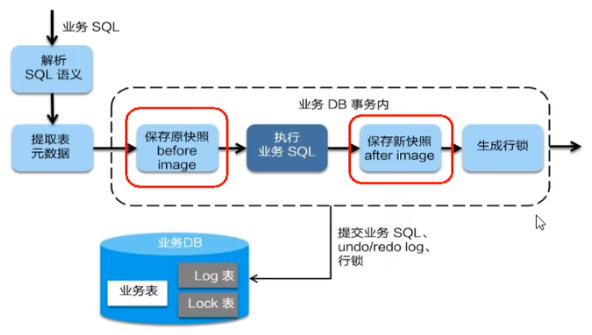

---
# 当前页面内容标题
title: 二十、SpringCloud Alibaba Seata处理分布式事务
# 分类
category:
  - springcloud
# 标签
tag: 
  - spring
  - springcloud
  - 微服务
  - java
sticky: false
# 是否收藏在博客主题的文章列表中，当填入数字时，数字越大，排名越靠前。
star: false
# 是否将该文章添加至文章列表中
article: true
# 是否将该文章添加至时间线中
timeline: true
---

## 01、分布式事务问题由来

分布式前

- 单机单库没这个问题
- 从1:1 -> 1:N -> N:N

单体应用被拆分成微服务应用，原来的三个模块被拆分成三个独立的应用,分别使用三个独立的数据源，业务操作需要调用三三 个服务来完成。此时**每个服务内部的数据一致性由本地事务来保证， 但是全局的数据一致性问题没法保证**。



一句话：**一次业务操作需要跨多个数据源或需要跨多个系统进行远程调用，就会产生分布式事务问题**。

## 02、Seata术语

**是什么**

Seata是一款开源的分布式事务解决方案，致力于在微服务架构下提供高性能和简单易用的分布式事务服务。

[官方网址](http://seata.io/zh-cn/)

**能干嘛**

一个典型的分布式事务过程

分布式事务处理过程的一ID+三组件模型：

- Transaction ID XID 全局唯一的事务ID
- 三组件概念
  - **TC (Transaction Coordinator) - 事务协调者**：维护全局和分支事务的状态，驱动全局事务提交或回滚。
  - **TM (Transaction Manager) - 事务管理器**：定义全局事务的范围：开始全局事务、提交或回滚全局事务。
  - **RM (Resource Manager) - 资源管理器**：管理分支事务处理的资源，与TC交谈以注册分支事务和报告分支事务的状态，并驱动分支事务提交或回滚。

处理过程：

1. TM向TC申请开启一个全局事务，全局事务创建成功并生成一个全局唯一的XID；
2. XID在微服务调用链路的上下文中传播；
3. RM向TC注册分支事务，将其纳入XID对应全局事务的管辖；
4. TM向TC发起针对XID的全局提交或回滚决议；
5. TC调度XID下管辖的全部分支事务完成提交或回滚请求。


## 03、Seata-Server安装

**去哪下**

发布说明: https://github.com/seata/seata/releases

**怎么玩**

本地@Transactional

全局@GlobalTransactional

**SEATA 的分布式交易解决方案**


我们只需要使用一个 `@GlobalTransactional` 注解在业务方法上:

**Seata-Server安装**

官网地址 - http://seata.io/zh-cn/

下载版本 - 0.9.0

seata-server-0.9.0.zip解压到指定目录并修改conf目录下的file.conf配置文件

先备份原始file.conf文件

主要修改:自定义事务组名称+事务日志存储模式为db +数据库连接信息

file.conf

service模块

```conf
service {
    ##fsp_tx_group是自定义的
    vgroup_mapping.my.test.tx_group="fsp_tx_group" 
    default.grouplist = "127.0.0.1:8091"
    enableDegrade = false
    disable = false
    max.commitretry.timeout= "-1"
    max.ollbackretry.timeout= "-1"
}
```

store模块

```conf
## transaction log store
store {
    ## store mode: file, db
    ## 改成db
    mode = "db"

    ## file store
    file {
        dir = "sessionStore"

        # branch session size, if exceeded first try compress lockkey, still exceeded throws exceptions
        max-branch-session-size = 16384
        # globe session size, if exceeded throws exceptions
        max-global-session-size = 512
        # file buffer size, if exceeded allocate new buffer
        file-write-buffer-cache-size = 16384
        # when recover batch read size
        session.reload.read_size= 100
        # async, sync
        flush-disk-mode = async
    }

    # database store
    db {
        ## the implement of javax.sql.DataSource, such as DruidDataSource(druid)/BasicDataSource(dbcp) etc.
        datasource = "dbcp"
        ## mysql/oracle/h2/oceanbase etc.
        ## 配置数据源
        db-type = "mysql"
        driver-class-name = "com.mysql.jdbc.Driver"
        url = "jdbc:mysql://127.0.0.1:3306/seata"
        user = "root"
        password = "你自己密码"
        min-conn= 1
        max-conn = 3
        global.table = "global_table"
        branch.table = "branch_table"
        lock-table = "lock_table"
        query-limit = 100
    }
}
```

mysql5.7数据库新建库seata，在seata库里建表

建表db_store.sql在\seata-server-0.9.0\seata\conf目录里面

```sql
-- the table to store GlobalSession data
drop table if exists `global_table`;
create table `global_table` (
  `xid` varchar(128)  not null,
  `transaction_id` bigint,
  `status` tinyint not null,
  `application_id` varchar(32),
  `transaction_service_group` varchar(32),
  `transaction_name` varchar(128),
  `timeout` int,
  `begin_time` bigint,
  `application_data` varchar(2000),
  `gmt_create` datetime,
  `gmt_modified` datetime,
  primary key (`xid`),
  key `idx_gmt_modified_status` (`gmt_modified`, `status`),
  key `idx_transaction_id` (`transaction_id`)
);

-- the table to store BranchSession data
drop table if exists `branch_table`;
create table `branch_table` (
  `branch_id` bigint not null,
  `xid` varchar(128) not null,
  `transaction_id` bigint ,
  `resource_group_id` varchar(32),
  `resource_id` varchar(256) ,
  `lock_key` varchar(128) ,
  `branch_type` varchar(8) ,
  `status` tinyint,
  `client_id` varchar(64),
  `application_data` varchar(2000),
  `gmt_create` datetime,
  `gmt_modified` datetime,
  primary key (`branch_id`),
  key `idx_xid` (`xid`)
);

-- the table to store lock data
drop table if exists `lock_table`;
create table `lock_table` (
  `row_key` varchar(128) not null,
  `xid` varchar(96),
  `transaction_id` long ,
  `branch_id` long,
  `resource_id` varchar(256) ,
  `table_name` varchar(32) ,
  `pk` varchar(36) ,
  `gmt_create` datetime ,
  `gmt_modified` datetime,
  primary key(`row_key`)
);
```

修改seata-server-0.9.0\seata\conf目录下的registry.conf配置文件

```conf
registry {
  # file 、nacos 、eureka、redis、zk、consul、etcd3、sofa
  # 改用为nacos
  type = "nacos"

  nacos {
      ## 加端口号
    serverAddr = "localhost:8848"
    namespace = ""
    cluster = "default"
  }
  ...
}
```

目的是：指明注册中心为nacos，及修改nacos连接信息

先启动Nacos端口号8848 nacos\bin\startup.cmd

再启动seata-server - seata-server-0.9.0\seata\bin\seata-server.bat

## 04、Seata业务数据库准备

以下演示都需要先启动Nacos后启动Seata,保证两个都OK。

分布式事务业务说明

这里我们会创建三个服务，一个订单服务，一个库存服务，一个账户服务。

当用户下单时,会在订单服务中创建一个订单, 然后通过远程调用库存服务来扣减下单商品的库存，再通过远程调用账户服务来扣减用户账户里面的余额，最后在订单服务中修改订单状态为已完成。

该操作跨越三个数据库，有两次远程调用，很明显会有分布式事务问题。

一言蔽之，下订单—>扣库存—>减账户(余额)。

创建业务数据库

- seata_ order：存储订单的数据库;
- seata_ storage：存储库存的数据库;
- seata_ account：存储账户信息的数据库。

建库SQL

```sql
CREATE DATABASE seata_order;
CREATE DATABASE seata_storage;
CREATE DATABASE seata_account;
```

按照上述3库分别建对应业务表

- seata_order库下建t_order表

```sql
CREATE TABLE t_order (
    `id` BIGINT(11) NOT NULL AUTO_INCREMENT PRIMARY KEY,
    `user_id` BIGINT(11) DEFAULT NULL COMMENT '用户id',
    `product_id` BIGINT(11) DEFAULT NULL COMMENT '产品id',
    `count` INT(11) DEFAULT NULL COMMENT '数量',
    `money` DECIMAL(11,0) DEFAULT NULL COMMENT '金额',
    `status` INT(1) DEFAULT NULL COMMENT '订单状态: 0:创建中; 1:已完结'
) ENGINE=INNODB AUTO_INCREMENT=1 DEFAULT CHARSET=utf8;

SELECT * FROM t_order;
```

- seata_storage库下建t_storage表

```sql
CREATE TABLE t_storage (
`id` BIGINT(11) NOT NULL AUTO_INCREMENT PRIMARY KEY,
`product_id` BIGINT(11) DEFAULT NULL COMMENT '产品id',
`total` INT(11) DEFAULT NULL COMMENT '总库存',
`used` INT(11) DEFAULT NULL COMMENT '已用库存',
`residue` INT(11) DEFAULT NULL COMMENT '剩余库存'
) ENGINE=INNODB AUTO_INCREMENT=1 DEFAULT CHARSET=utf8;

INSERT INTO seata_storage.t_storage(`id`, `product_id`, `total`, `used`, `residue`)
VALUES ('1', '1', '100', '0','100');

SELECT * FROM t_storage;
```

- seata_account库下建t_account表

```sql
CREATE TABLE t_account(
    `id` BIGINT(11) NOT NULL AUTO_INCREMENT PRIMARY KEY COMMENT 'id',
    `user_id` BIGINT(11) DEFAULT NULL COMMENT '用户id',
    `total` DECIMAL(10,0) DEFAULT NULL COMMENT '总额度',
    `used` DECIMAL(10,0) DEFAULT NULL COMMENT '已用余额',
    `residue` DECIMAL(10,0) DEFAULT '0' COMMENT '剩余可用额度'
) ENGINE=INNODB AUTO_INCREMENT=1 DEFAULT CHARSET=utf8;

INSERT INTO seata_account.t_account(`id`, `user_id`, `total`, `used`, `residue`)
VALUES ('1', '1', '1000', '0', '1000');

SELECT * FROM t_account;
```

按照上述3库分别建对应的回滚日志表

- 订单-库存-账户3个库下**都需要建各自的回滚日志表**
- \seata-server-0.9.0\seata\conf目录下的db_ undo_ log.sql
- 建表SQL

```sql
-- the table to store seata xid data
-- 0.7.0+ add context
-- you must to init this sql for you business databese. the seata server not need it.
-- 此脚本必须初始化在你当前的业务数据库中，用于AT 模式XID记录。与server端无关（注：业务数据库）
-- 注意此处0.3.0+ 增加唯一索引 ux_undo_log
drop table `undo_log`;
CREATE TABLE `undo_log` (
  `id` bigint(20) NOT NULL AUTO_INCREMENT,
  `branch_id` bigint(20) NOT NULL,
  `xid` varchar(100) NOT NULL,
  `context` varchar(128) NOT NULL,
  `rollback_info` longblob NOT NULL,
  `log_status` int(11) NOT NULL,
  `log_created` datetime NOT NULL,
  `log_modified` datetime NOT NULL,
  `ext` varchar(100) DEFAULT NULL,
  PRIMARY KEY (`id`),
  UNIQUE KEY `ux_undo_log` (`xid`,`branch_id`)
) ENGINE=InnoDB AUTO_INCREMENT=1 DEFAULT CHARSET=utf8;
```

## 05、Seata之Order-Module配置搭建

下订单 -> 减库存 -> 扣余额 -> 改（订单）状态

seata-order-service2001

POM

```xml
<?xml version="1.0" encoding="UTF-8"?>
<project xmlns="http://maven.apache.org/POM/4.0.0"
         xmlns:xsi="http://www.w3.org/2001/XMLSchema-instance"
         xsi:schemaLocation="http://maven.apache.org/POM/4.0.0 http://maven.apache.org/xsd/maven-4.0.0.xsd">
    <parent>
        <artifactId>cloud2020</artifactId>
        <groupId>com.nakanomay.springcloud</groupId>
        <version>1.0-SNAPSHOT</version>
    </parent>
    <modelVersion>4.0.0</modelVersion>

    <artifactId>seata-order-service2001</artifactId>

    <dependencies>
        <!--nacos-->
        <dependency>
            <groupId>com.alibaba.cloud</groupId>
            <artifactId>spring-cloud-starter-alibaba-nacos-discovery</artifactId>
        </dependency>
        <!--seata-->
        <dependency>
            <groupId>com.alibaba.cloud</groupId>
            <artifactId>spring-cloud-starter-alibaba-seata</artifactId>
            <exclusions>
                <exclusion>
                    <artifactId>seata-all</artifactId>
                    <groupId>io.seata</groupId>
                </exclusion>
            </exclusions>
        </dependency>
        <dependency>
            <groupId>io.seata</groupId>
            <artifactId>seata-all</artifactId>
            <version>0.9.0</version>
        </dependency>
        <!--feign-->
        <dependency>
            <groupId>org.springframework.cloud</groupId>
            <artifactId>spring-cloud-starter-openfeign</artifactId>
        </dependency>
        <!--web-actuator-->
        <dependency>
            <groupId>org.springframework.boot</groupId>
            <artifactId>spring-boot-starter-web</artifactId>
        </dependency>
        <dependency>
            <groupId>org.springframework.boot</groupId>
            <artifactId>spring-boot-starter-actuator</artifactId>
        </dependency>
        <!--mysql-druid-->
        <dependency>
            <groupId>mysql</groupId>
            <artifactId>mysql-connector-java</artifactId>
            <version>5.1.37</version>
        </dependency>
        <dependency>
            <groupId>com.alibaba</groupId>
            <artifactId>druid-spring-boot-starter</artifactId>
            <version>1.1.10</version>
        </dependency>
        <dependency>
            <groupId>org.mybatis.spring.boot</groupId>
            <artifactId>mybatis-spring-boot-starter</artifactId>
            <version>2.0.0</version>
        </dependency>
        <dependency>
            <groupId>org.springframework.boot</groupId>
            <artifactId>spring-boot-starter-test</artifactId>
            <scope>test</scope>
        </dependency>
        <dependency>
            <groupId>org.projectlombok</groupId>
            <artifactId>lombok</artifactId>
            <optional>true</optional>
        </dependency>
    </dependencies>

</project>
```

配置文件

YML

```yml
server:
  port: 2001

spring:
  application:
    name: seata-order-service
  cloud:
    alibaba:
      seata:
        #自定义事务组名称需要与seata-server中的对应
        tx-service-group: fsp_tx_group
    nacos:
      discovery:
        server-addr: localhost:8848
  datasource:
    driver-class-name: com.mysql.jdbc.Driver
    url: jdbc:mysql://localhost:3306/seata_order
    username: root
    password: 123456

feign:
  hystrix:
    enabled: false

logging:
  level:
    io:
      seata: info

mybatis:
  mapperLocations: classpath:mapper/*.xml
```

file.conf

```conf
transport {
  # tcp udt unix-domain-socket
  type = "TCP"
  #NIO NATIVE
  server = "NIO"
  #enable heartbeat
  heartbeat = true
  #thread factory for netty
  thread-factory {
    boss-thread-prefix = "NettyBoss"
    worker-thread-prefix = "NettyServerNIOWorker"
    server-executor-thread-prefix = "NettyServerBizHandler"
    share-boss-worker = false
    client-selector-thread-prefix = "NettyClientSelector"
    client-selector-thread-size = 1
    client-worker-thread-prefix = "NettyClientWorkerThread"
    # netty boss thread size,will not be used for UDT
    boss-thread-size = 1
    #auto default pin or 8
    worker-thread-size = 8
  }
  shutdown {
    # when destroy server, wait seconds
    wait = 3
  }
  serialization = "seata"
  compressor = "none"
}

service {

  vgroup_mapping.fsp_tx_group = "default" #修改自定义事务组名称

  default.grouplist = "127.0.0.1:8091"
  enableDegrade = false
  disable = false
  max.commit.retry.timeout = "-1"
  max.rollback.retry.timeout = "-1"
  disableGlobalTransaction = false
}


client {
  async.commit.buffer.limit = 10000
  lock {
    retry.internal = 10
    retry.times = 30
  }
  report.retry.count = 5
  tm.commit.retry.count = 1
  tm.rollback.retry.count = 1
}

## transaction log store
store {
  ## store mode: file、db
  mode = "db"

  ## file store
  file {
    dir = "sessionStore"

    # branch session size , if exceeded first try compress lockkey, still exceeded throws exceptions
    max-branch-session-size = 16384
    # globe session size , if exceeded throws exceptions
    max-global-session-size = 512
    # file buffer size , if exceeded allocate new buffer
    file-write-buffer-cache-size = 16384
    # when recover batch read size
    session.reload.read_size = 100
    # async, sync
    flush-disk-mode = async
  }

  ## database store
  db {
    ## the implement of javax.sql.DataSource, such as DruidDataSource(druid)/BasicDataSource(dbcp) etc.
    datasource = "dbcp"
    ## mysql/oracle/h2/oceanbase etc.
    db-type = "mysql"
    driver-class-name = "com.mysql.jdbc.Driver"
    url = "jdbc:mysql://127.0.0.1:3306/seata"
    user = "root"
    password = "123456"
    min-conn = 1
    max-conn = 3
    global.table = "global_table"
    branch.table = "branch_table"
    lock-table = "lock_table"
    query-limit = 100
  }
}
lock {
  ## the lock store mode: local、remote
  mode = "remote"

  local {
    ## store locks in user's database
  }

  remote {
    ## store locks in the seata's server
  }
}
recovery {
  #schedule committing retry period in milliseconds
  committing-retry-period = 1000
  #schedule asyn committing retry period in milliseconds
  asyn-committing-retry-period = 1000
  #schedule rollbacking retry period in milliseconds
  rollbacking-retry-period = 1000
  #schedule timeout retry period in milliseconds
  timeout-retry-period = 1000
}

transaction {
  undo.data.validation = true
  undo.log.serialization = "jackson"
  undo.log.save.days = 7
  #schedule delete expired undo_log in milliseconds
  undo.log.delete.period = 86400000
  undo.log.table = "undo_log"
}

## metrics settings
metrics {
  enabled = false
  registry-type = "compact"
  # multi exporters use comma divided
  exporter-list = "prometheus"
  exporter-prometheus-port = 9898
}

support {
  ## spring
  spring {
    # auto proxy the DataSource bean
    datasource.autoproxy = false
  }
}
```

registry.conf

```conf
registry {
  # file 、nacos 、eureka、redis、zk、consul、etcd3、sofa
  type = "nacos"

  nacos {
    serverAddr = "localhost:8848"
    namespace = ""
    cluster = "default"
  }
  eureka {
    serviceUrl = "http://localhost:8761/eureka"
    application = "default"
    weight = "1"
  }
  redis {
    serverAddr = "localhost:6379"
    db = "0"
  }
  zk {
    cluster = "default"
    serverAddr = "127.0.0.1:2181"
    session.timeout = 6000
    connect.timeout = 2000
  }
  consul {
    cluster = "default"
    serverAddr = "127.0.0.1:8500"
  }
  etcd3 {
    cluster = "default"
    serverAddr = "http://localhost:2379"
  }
  sofa {
    serverAddr = "127.0.0.1:9603"
    application = "default"
    region = "DEFAULT_ZONE"
    datacenter = "DefaultDataCenter"
    cluster = "default"
    group = "SEATA_GROUP"
    addressWaitTime = "3000"
  }
  file {
    name = "file.conf"
  }
}

config {
  # file、nacos 、apollo、zk、consul、etcd3
  type = "file"

  nacos {
    serverAddr = "localhost"
    namespace = ""
  }
  consul {
    serverAddr = "127.0.0.1:8500"
  }
  apollo {
    app.id = "seata-server"
    apollo.meta = "http://192.168.1.204:8801"
  }
  zk {
    serverAddr = "127.0.0.1:2181"
    session.timeout = 6000
    connect.timeout = 2000
  }
  etcd3 {
    serverAddr = "http://localhost:2379"
  }
  file {
    name = "file.conf"
  }
}
```

domain

```java
import lombok.AllArgsConstructor;
import lombok.Data;
import lombok.NoArgsConstructor;

@Data
@AllArgsConstructor
@NoArgsConstructor
public class CommonResult<T>
{
    private Integer code;
    private String  message;
    private T       data;

    public CommonResult(Integer code, String message)
    {
        this(code,message,null);
    }
}
```

```java
package com.nakanomay.springcloud.alibaba.domain;

import lombok.AllArgsConstructor;
import lombok.Data;
import lombok.NoArgsConstructor;

import java.math.BigDecimal;

@Data
@AllArgsConstructor
@NoArgsConstructor
public class Order
{
    private Long id;

    private Long userId;

    private Long productId;

    private Integer count;

    private BigDecimal money;

    private Integer status; //订单状态：0：创建中；1：已完结
}
```

## 06、Seata之Order-Module撸码(上)

Dao接口及实现

```java
import com.nakanomay.springcloud.alibaba.domain.Order;
import org.apache.ibatis.annotations.Mapper;
import org.apache.ibatis.annotations.Param;

@Mapper
public interface OrderDao
{
    //1 新建订单
    void create(Order order);

    //2 修改订单状态，从零改为1
    void update(@Param("userId") Long userId,@Param("status") Integer status);
}
```

```xml
<?xml version="1.0" encoding="UTF-8" ?>
<!DOCTYPE mapper PUBLIC "-//mybatis.org//DTD Mapper 3.0//EN" "http://mybatis.org/dtd/mybatis-3-mapper.dtd" >

<mapper namespace="com.nakanomay.springcloud.alibaba.dao.OrderDao">

    <resultMap id="BaseResultMap" type="com.atguigu.springcloud.alibaba.domain.Order">
        <id column="id" property="id" jdbcType="BIGINT"/>
        <result column="user_id" property="userId" jdbcType="BIGINT"/>
        <result column="product_id" property="productId" jdbcType="BIGINT"/>
        <result column="count" property="count" jdbcType="INTEGER"/>
        <result column="money" property="money" jdbcType="DECIMAL"/>
        <result column="status" property="status" jdbcType="INTEGER"/>
    </resultMap>

    <insert id="create">
        insert into t_order (id,user_id,product_id,count,money,status)
        values (null,#{userId},#{productId},#{count},#{money},0);
    </insert>


    <update id="update">
        update t_order set status = 1
        where user_id=#{userId} and status = #{status};
    </update>

</mapper>
```

Service接口及实现

- OrderService
  - OrderServiceImpl
- StorageService
- AccountService

```java
import com.atguigu.springcloud.alibaba.domain.Order;

public interface OrderService
{
    void create(Order order);
}
```

```java
import com.nakanomay.springcloud.alibaba.domain.CommonResult;
import org.springframework.cloud.openfeign.FeignClient;
import org.springframework.web.bind.annotation.PostMapping;
import org.springframework.web.bind.annotation.RequestParam;

import java.math.BigDecimal;

@FeignClient(value = "seata-storage-service")
public interface StorageService
{
    @PostMapping(value = "/storage/decrease")
    CommonResult decrease(@RequestParam("productId") Long productId, @RequestParam("count") Integer count);
}
```

```java
import com.nakanomay.springcloud.alibaba.domain.CommonResult;
import org.springframework.cloud.openfeign.FeignClient;
import org.springframework.web.bind.annotation.PostMapping;
import org.springframework.web.bind.annotation.RequestParam;

import java.math.BigDecimal;

@FeignClient(value = "seata-account-service")
public interface AccountService
{
    @PostMapping(value = "/account/decrease")
    CommonResult decrease(@RequestParam("userId") Long userId, @RequestParam("money") BigDecimal money);
}
```

```java
import com.nakanomay.springcloud.alibaba.dao.OrderDao;
import com.nakanomay.springcloud.alibaba.domain.Order;
import com.nakanomay.springcloud.alibaba.service.AccountService;
import com.nakanomay.springcloud.alibaba.service.OrderService;
import com.nakanomay.springcloud.alibaba.service.StorageService;
import io.seata.spring.annotation.GlobalTransactional;
import lombok.extern.slf4j.Slf4j;
import org.springframework.stereotype.Service;

import javax.annotation.Resource;

@Service
@Slf4j
public class OrderServiceImpl implements OrderService
{
    @Resource
    private OrderDao orderDao;
    @Resource
    private StorageService storageService;
    @Resource
    private AccountService accountService;

    /**
     * 创建订单->调用库存服务扣减库存->调用账户服务扣减账户余额->修改订单状态
     * 简单说：下订单->扣库存->减余额->改状态
     */
    @Override
    //@GlobalTransactional(name = "fsp-create-order",rollbackFor = Exception.class)
    public void create(Order order)
    {
        log.info("----->开始新建订单");
        //1 新建订单
        orderDao.create(order);

        //2 扣减库存
        log.info("----->订单微服务开始调用库存，做扣减Count");
        storageService.decrease(order.getProductId(),order.getCount());
        log.info("----->订单微服务开始调用库存，做扣减end");

        //3 扣减账户
        log.info("----->订单微服务开始调用账户，做扣减Money");
        accountService.decrease(order.getUserId(),order.getMoney());
        log.info("----->订单微服务开始调用账户，做扣减end");

        //4 修改订单状态，从零到1,1代表已经完成
        log.info("----->修改订单状态开始");
        orderDao.update(order.getUserId(),0);
        log.info("----->修改订单状态结束");

        log.info("----->下订单结束了，O(∩_∩)O哈哈~");

    }
}
```

07、Seata之Order-Module撸码(下)

Controller

```java
import com.nakanomay.springcloud.alibaba.domain.CommonResult;
import com.nakanomay.springcloud.alibaba.domain.Order;
import com.nakanomay.springcloud.alibaba.service.OrderService;
import org.springframework.web.bind.annotation.GetMapping;
import org.springframework.web.bind.annotation.RestController;

import javax.annotation.Resource;

@RestController
public class OrderController
{
    @Resource
    private OrderService orderService;


    @GetMapping("/order/create")
    public CommonResult create(Order order)
    {
        orderService.create(order);
        return new CommonResult(200,"订单创建成功");
    }
}
```

Config配置

- MyBatisConfig
- DataSourceProxyConfig

```java
import org.mybatis.spring.annotation.MapperScan;
import org.springframework.context.annotation.Configuration;

@Configuration
@MapperScan({"com.atguigu.springcloud.alibaba.dao"})
public class MyBatisConfig {
}
```

```java
import com.alibaba.druid.pool.DruidDataSource;
import io.seata.rm.datasource.DataSourceProxy;
import org.apache.ibatis.session.SqlSessionFactory;
import org.mybatis.spring.SqlSessionFactoryBean;
import org.mybatis.spring.transaction.SpringManagedTransactionFactory;
import org.springframework.beans.factory.annotation.Value;
import org.springframework.boot.context.properties.ConfigurationProperties;
import org.springframework.context.annotation.Bean;
import org.springframework.context.annotation.Configuration;
import org.springframework.core.io.support.PathMatchingResourcePatternResolver;
import javax.sql.DataSource;

/**
 * 使用Seata对数据源进行代理
 */
@Configuration
public class DataSourceProxyConfig {

    @Value("${mybatis.mapperLocations}")
    private String mapperLocations;

    @Bean
    @ConfigurationProperties(prefix = "spring.datasource")
    public DataSource druidDataSource(){
        return new DruidDataSource();
    }

    @Bean
    public DataSourceProxy dataSourceProxy(DataSource dataSource) {
        return new DataSourceProxy(dataSource);
    }

    @Bean
    public SqlSessionFactory sqlSessionFactoryBean(DataSourceProxy dataSourceProxy) throws Exception {
        SqlSessionFactoryBean sqlSessionFactoryBean = new SqlSessionFactoryBean();
        sqlSessionFactoryBean.setDataSource(dataSourceProxy);
        sqlSessionFactoryBean.setMapperLocations(new PathMatchingResourcePatternResolver().getResources(mapperLocations));
        sqlSessionFactoryBean.setTransactionFactory(new SpringManagedTransactionFactory());
        return sqlSessionFactoryBean.getObject();
    }

}
```

主启动

```java
import org.springframework.boot.SpringApplication;
import org.springframework.boot.autoconfigure.SpringBootApplication;
import org.springframework.boot.autoconfigure.jdbc.DataSourceAutoConfiguration;
import org.springframework.cloud.client.discovery.EnableDiscoveryClient;
import org.springframework.cloud.openfeign.EnableFeignClients;

@EnableDiscoveryClient
@EnableFeignClients
//取消数据源的自动创建，而是使用自己定义的
@SpringBootApplication(exclude = DataSourceAutoConfiguration.class)
public class SeataOrderMainApp2001
{

    public static void main(String[] args)
    {
        SpringApplication.run(SeataOrderMainApp2001.class, args);
    }
}
```

## 07、Seata之Storage-Module说明

与seata-order-service2001模块大致相同

seata- storage - service2002

POM（与seata-order-service2001模块大致相同）

YML

```yml
server:
  port: 2002

spring:
  application:
    name: seata-storage-service
  cloud:
    alibaba:
      seata:
        tx-service-group: fsp_tx_group
    nacos:
      discovery:
        server-addr: localhost:8848
  datasource:
    driver-class-name: com.mysql.jdbc.Driver
    url: jdbc:mysql://localhost:3306/seata_storage
    username: root
    password: 123456

logging:
  level:
    io:
      seata: info

mybatis:
  mapperLocations: classpath:mapper/*.xml
```

file.conf（与seata-order-service2001模块大致相同）

registry.conf（与seata-order-service2001模块大致相同）

domain

```java
import lombok.Data;

@Data
public class Storage {

    private Long id;

    /**
     * 产品id
     */
    private Long productId;

    /**
     * 总库存
     */
    private Integer total;

    /**
     * 已用库存
     */
    private Integer used;

    /**
     * 剩余库存
     */
    private Integer residue;
}
```

CommonResult（与seata-order-service2001模块大致相同）

Dao接口及实现

```java
import org.apache.ibatis.annotations.Mapper;
import org.apache.ibatis.annotations.Param;

@Mapper
public interface StorageDao {

    //扣减库存
    void decrease(@Param("productId") Long productId, @Param("count") Integer count);
}
```

```java
<?xml version="1.0" encoding="UTF-8" ?>
<!DOCTYPE mapper PUBLIC "-//mybatis.org//DTD Mapper 3.0//EN" "http://mybatis.org/dtd/mybatis-3-mapper.dtd" >

<mapper namespace="com.nakanomay.springcloud.alibaba.dao.StorageDao">

    <resultMap id="BaseResultMap" type="com.atguigu.springcloud.alibaba.domain.Storage">
        <id column="id" property="id" jdbcType="BIGINT"/>
        <result column="product_id" property="productId" jdbcType="BIGINT"/>
        <result column="total" property="total" jdbcType="INTEGER"/>
        <result column="used" property="used" jdbcType="INTEGER"/>
        <result column="residue" property="residue" jdbcType="INTEGER"/>
    </resultMap>

    <update id="decrease">
        UPDATE
            t_storage
        SET
            used = used + #{count},residue = residue - #{count}
        WHERE
            product_id = #{productId}
    </update>

</mapper>
```

Service接口及实现

```java
public interface StorageService {
    /**
     * 扣减库存
     */
    void decrease(Long productId, Integer count);
}
```

```java
import com.nakanomay.springcloud.alibaba.dao.StorageDao;
import com.nakanomay.springcloud.alibaba.service.StorageService ;
import org.slf4j.Logger;
import org.slf4j.LoggerFactory;
import org.springframework.beans.factory.annotation.Autowired;
import org.springframework.stereotype.Service;

import javax.annotation.Resource;


@Service
public class StorageServiceImpl implements StorageService {

    private static final Logger LOGGER = LoggerFactory.getLogger(StorageServiceImpl.class);

    @Resource
    private StorageDao storageDao;

    /**
     * 扣减库存
     */
    @Override
    public void decrease(Long productId, Integer count) {
        LOGGER.info("------->storage-service中扣减库存开始");
        storageDao.decrease(productId,count);
        LOGGER.info("------->storage-service中扣减库存结束");
    }
}
```

Controller

```java
import com.atguigu.springcloud.alibaba.domain.CommonResult ;
import com.atguigu.springcloud.alibaba.service.StorageService ;
import org.springframework.beans.factory.annotation.Autowired;
import org.springframework.web.bind.annotation.RequestMapping;
import org.springframework.web.bind.annotation.RestController;

@RestController
public class StorageController {

    @Autowired
    private StorageService storageService;

    /**
     * 扣减库存
     */
    @RequestMapping("/storage/decrease")
    public CommonResult decrease(Long productId, Integer count) {
        storageService.decrease(productId, count);
        return new CommonResult(200,"扣减库存成功！");
    }
}
```

Config配置（与seata-order-service2001模块大致相同）

主启动（与seata-order-service2001模块大致相同）

## 08、Seata之Account-Module说明

与seata-order-service2001模块大致相同

seata- account- service2003

POM（与seata-order-service2001模块大致相同）

YML

```yml
server:
  port: 2003

spring:
  application:
    name: seata-account-service
  cloud:
    alibaba:
      seata:
        tx-service-group: fsp_tx_group
    nacos:
      discovery:
        server-addr: localhost:8848
  datasource:
    driver-class-name: com.mysql.jdbc.Driver
    url: jdbc:mysql://localhost:3306/seata_account
    username: root
    password: 123456

feign:
  hystrix:
    enabled: false

logging:
  level:
    io:
      seata: info

mybatis:
  mapperLocations: classpath:mapper/*.xml
```

file.conf（与seata-order-service2001模块大致相同）

registry.conf（与seata-order-service2001模块大致相同）

domain

```java
import lombok.AllArgsConstructor;
import lombok.Data;
import lombok.NoArgsConstructor;

import java.math.BigDecimal;

@Data
@AllArgsConstructor
@NoArgsConstructor
public class Account {

    private Long id;

    /**
     * 用户id
     */
    private Long userId;

    /**
     * 总额度
     */
    private BigDecimal total;

    /**
     * 已用额度
     */
    private BigDecimal used;

    /**
     * 剩余额度
     */
    private BigDecimal residue;
}
```

CommonResult（与seata-order-service2001模块大致相同）

Dao接口及实现

```java
import org.apache.ibatis.annotations.Mapper;
import org.apache.ibatis.annotations.Param;
import org.springframework.stereotype.Component;
import org.springframework.stereotype.Repository;

import java.math.BigDecimal;

@Mapper
public interface AccountDao {

    /**
     * 扣减账户余额
     */
    void decrease(@Param("userId") Long userId, @Param("money") BigDecimal money);
}
```

```xml
<?xml version="1.0" encoding="UTF-8" ?>
<!DOCTYPE mapper PUBLIC "-//mybatis.org//DTD Mapper 3.0//EN" "http://mybatis.org/dtd/mybatis-3-mapper.dtd" >

<mapper namespace="com.nakanomay.springcloud.alibaba.dao.AccountDao">

    <resultMap id="BaseResultMap" type="com.atguigu.springcloud.alibaba.domain.Account">
        <id column="id" property="id" jdbcType="BIGINT"/>
        <result column="user_id" property="userId" jdbcType="BIGINT"/>
        <result column="total" property="total" jdbcType="DECIMAL"/>
        <result column="used" property="used" jdbcType="DECIMAL"/>
        <result column="residue" property="residue" jdbcType="DECIMAL"/>
    </resultMap>

    <update id="decrease">
        UPDATE t_account
        SET
          residue = residue - #{money},used = used + #{money}
        WHERE
          user_id = #{userId};
    </update>

</mapper>
```

Service接口及实现

```java
import org.springframework.web.bind.annotation.RequestParam;
import org.springframework.web.bind.annotation.ResponseBody;

import java.math.BigDecimal;

public interface AccountService {

    /**
     * 扣减账户余额
     * @param userId 用户id
     * @param money 金额
     */
    void decrease(@RequestParam("userId") Long userId, @RequestParam("money") BigDecimal money);
}
```

```java
import com.nakanomay.springcloud.alibaba.dao.AccountDao;
import com.nakanomay.springcloud.alibaba.service.AccountService ;
import org.slf4j.Logger;
import org.slf4j.LoggerFactory;
import org.springframework.beans.factory.annotation.Autowired;
import org.springframework.stereotype.Service;

import javax.annotation.Resource;
import java.math.BigDecimal;
import java.util.concurrent.TimeUnit;

/**
 */
@Service
public class AccountServiceImpl implements AccountService {

    private static final Logger LOGGER = LoggerFactory.getLogger(AccountServiceImpl.class);


    @Resource
    AccountDao accountDao;

    /**
     * 扣减账户余额
     */
    @Override
    public void decrease(Long userId, BigDecimal money) {
        LOGGER.info("------->account-service中扣减账户余额开始");
        accountDao.decrease(userId,money);
        LOGGER.info("------->account-service中扣减账户余额结束");
    }
}
```

Controller

```java
import com.nakanomay.springcloud.alibaba.domain.CommonResult ;
import com.nakanomay.springcloud.alibaba.service.AccountService ;
import org.springframework.beans.factory.annotation.Autowired;
import org.springframework.web.bind.annotation.PostMapping;
import org.springframework.web.bind.annotation.RequestMapping;
import org.springframework.web.bind.annotation.RequestParam;
import org.springframework.web.bind.annotation.RestController;

import javax.annotation.Resource;
import java.math.BigDecimal;

@RestController
public class AccountController {

    @Resource
    AccountService accountService;

    /**
     * 扣减账户余额
     */
    @RequestMapping("/account/decrease")
    public CommonResult decrease(@RequestParam("userId") Long userId, @RequestParam("money") BigDecimal money){
        accountService.decrease(userId,money);
        return new CommonResult(200,"扣减账户余额成功！");
    }
}
```

Config配置（与seata-order-service2001模块大致相同）

主启动（与seata-order-service2001模块大致相同）

## 09、Seata之@GlobalTransactional验证

下订单 -> 减库存 -> 扣余额 -> 改（订单）状态

数据库初始情况：



正常下单 - http://localhost:2001/order/create?userId=1&productId=1&count=10&money=100

数据库正常下单后状况：



---

**超时异常，没加@GlobalTransactional**

模拟AccountServiceImpl添加超时

```java
@Service
public class AccountServiceImpl implements AccountService {

    private static final Logger LOGGER = LoggerFactory.getLogger(AccountServiceImpl.class);


    @Resource
    AccountDao accountDao;

    /**
     * 扣减账户余额
     */
    @Override
    public void decrease(Long userId, BigDecimal money) {
        LOGGER.info("------->account-service中扣减账户余额开始");
        //模拟超时异常，全局事务回滚
        //暂停几秒钟线程
        try { TimeUnit.SECONDS.sleep(20); } catch (InterruptedException e) { e.printStackTrace(); }
        accountDao.decrease(userId,money);
        LOGGER.info("------->account-service中扣减账户余额结束");
    }
}
```

另外，OpenFeign的调用默认时间是1s以内，所以最后会抛异常。

数据库情况


**故障情况**

- 当库存和账户金额扣减后，订单状态并没有设置为已经完成，没有从零改为1
- 而且由于feign的重试机制，账户余额还有可能被多次扣减

---

**超时异常，加了@GlobalTransactional**

用@GlobalTransactional标注OrderServiceImpl的create()方法。

```java
@Service
@Slf4j
public class OrderServiceImpl implements OrderService {

    ...

    /**
     * 创建订单->调用库存服务扣减库存->调用账户服务扣减账户余额->修改订单状态
     * 简单说：下订单->扣库存->减余额->改状态
     */
    @Override
    //rollbackFor = Exception.class表示对任意异常都进行回滚
    @GlobalTransactional(name = "fsp-create-order",rollbackFor = Exception.class)
    public void create(Order order)
    {
        ...
    }
}
```

还是模拟AccountServiceImpl添加超时，下单后数据库数据并没有任何改变，记录都添加不进来，**达到出异常，数据库回滚的效果**。

## 10、Seata之原理简介

2019年1月份蚂蚁金服和阿里巴巴共同开源的分布式事务解决方案。

Simple Extensible Autonomous Transaction Architecture，简单可扩展自治事务框架。

2020起始，用1.0以后的版本。Alina Gingertail


**分布式事务的执行流程**

- TM开启分布式事务(TM向TC注册全局事务记录) ;

- 按业务场景，编排数据库、服务等事务内资源(RM向TC汇报资源准备状态) ;

- TM结束分布式事务，事务一阶段结束(TM通知TC提交/回滚分布式事务) ;

- TC汇总事务信息，决定分布式事务是提交还是回滚；

- TC通知所有RM提交/回滚资源，事务二阶段结束。

**AT模式如何做到对业务的无侵入**

- 是什么

> **前提**
> 
> - 基于支持本地 ACID 事务的关系型数据库。
> - Java 应用，通过 JDBC 访问数据库。
> 
> **整体机制**
> 
> 两阶段提交协议的演变：
> 
> - 一阶段：业务数据和回滚日志记录在同一个本地事务中提交，释放本地锁和连接资源。
> - 二阶段：
>   - 提交异步化，非常快速地完成。
>   - 回滚通过一阶段的回滚日志进行反向补偿。
> 
> [link](http://seata.io/zh-cn/docs/overview/what-is-seata.html)

- 一阶段加载

在一阶段，Seata会拦截“业务SQL”

1. 解析SQL语义，找到“业务SQL" 要更新的业务数据，在业务数据被更新前，将其保存成"before image”
2. 执行“业务SQL" 更新业务数据，在业务数据更新之后,
3. 其保存成"after image”，最后生成行锁。

以上操作全部在一个数据库事务内完成, 这样保证了一阶段操作的原子性。



- 二阶段提交

二阶段如果顺利提交的话，因为"业务SQL"在一阶段已经提交至数据库，所以Seata框架只需将一阶段保存的快照数据和行锁删掉，完成数据清理即可。


- 二阶段回滚
  二阶段如果是回滚的话，Seata 就需要回滚一阶段已经执行的 “业务SQL"，还原业务数据。

回滚方式便是用"before image"还原业务数据；但在还原前要首先要校验脏写，对比“数据库当前业务数据”和"after image"。

如果两份数据完全一致就说明没有脏写， 可以还原业务数据，如果不一致就说明有脏写, 出现脏写就需要转人工处理。


补充

