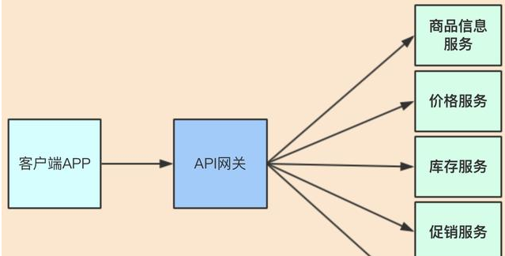
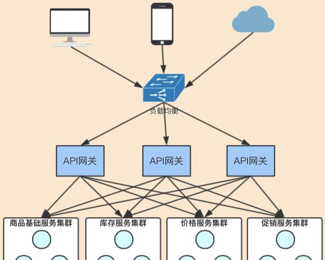
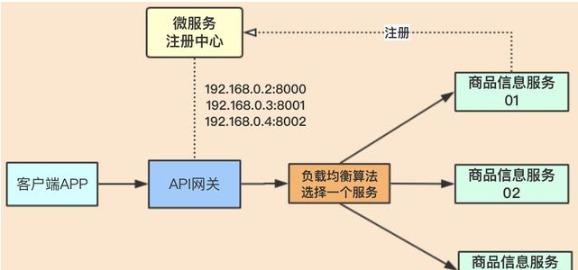
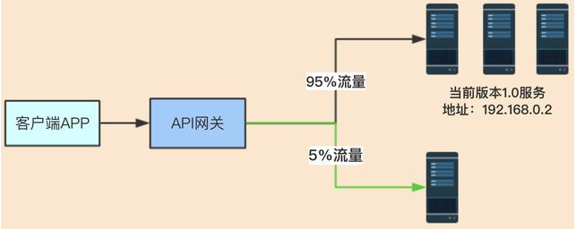
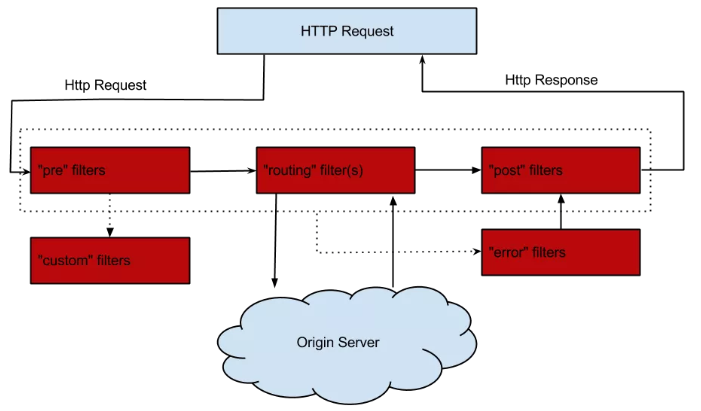

---
# 当前页面内容标题
title: 十一、Zuul路由网关
# 分类
category:
  - springcloud
# 标签
tag: 
  - spring
  - springcloud
  - 微服务
  - java
sticky: false
# 是否收藏在博客主题的文章列表中，当填入数字时，数字越大，排名越靠前。
star: false
# 是否将该文章添加至文章列表中
article: true
# 是否将该文章添加至时间线中
timeline: true
---

## GateWay和Zuul课程说明

Zuul开发人员窝里斗，实属明日黄花

重点关注Gate Way

## 01、Zuul概述

[官网Github资料](https://github.com/Netflix/zuul/wiki/Getting-Started)

[官网资料](https://cloud.spring.io/spring-cloud-static/spring-cloud-netflix/2.2.1.RELEASE/reference/html/#router-and-filter-zuul)

**是什么？**

Zuul是一种提供动态路由、监视、弹性、安全性等功能的边缘服务。

Zuul是Netflix出品的一个基于JVM路由和服务端的负载均衡器。


API网关为微服务架构中的服务提供了统一的访问入口，客户端通过API网关访问相关服务。API网关的定义类似于设计模式中的门面模式，它相当于整个微服务架构中的门面，所有客户端的访问都通过它来进行路由及过滤。它实现了请求路由、负载均衡、校验过滤、服务容错、服务聚合等功能。



uul包含了如下最主要的功能：

代理+路由+过滤三大功能

## 02、Zuul能干嘛？

- 路由
- 过滤
- 负载均衡

网关为入口，由网关与微服务进行交互，所以网关必须要实现负载均衡的功能；

网关会获取微服务注册中心里面的服务连接地址，再配合一些算法选择其中一个服务地址，进行处理业务。

这个属于客户端侧的负载均衡，由调用方去实现负载均衡逻辑。



- 灰度发布（又称金丝雀发布）

起源是，矿井工人发现，金丝雀对瓦斯气体很敏感，矿工会在下井之前，先放一只金丝雀到井中，如果金丝雀不叫了，就代表瓦斯浓度高。



在灰度发布开始后，先启动一个新版本应用，但是并不直接将流量切过来，而是测试人员对新版本进行线上测试，启动的这个新版本应用，就是我们的金丝雀。如果没有问题，那么可以将少量的用户流量导入到新版本上，然后再对新版本做运行状态观察，收集各种运行时数据，如果此时对新旧版本做各种数据对比，就是所谓的A/B测试。新版本没什么问题，那么逐步扩大范围、流量，把所有用户都迁移到新版本上面来。

## 03、路由基本配置

**功能**

路由功能负责将外部请求转发到具体的服务实例上去，是实现统一访问入口的基础

---

1.新建Module模块cloud-zuul-gateway9527

2.POM

```xml
<?xml version="1.0" encoding="UTF-8"?>
<project xmlns="http://maven.apache.org/POM/4.0.0"
         xmlns:xsi="http://www.w3.org/2001/XMLSchema-instance"
         xsi:schemaLocation="http://maven.apache.org/POM/4.0.0 http://maven.apache.org/xsd/maven-4.0.0.xsd">
    <parent>
        <artifactId>cloud2020</artifactId>
        <groupId>com.nakanomay.springcloud</groupId>
        <version>1.0-SNAPSHOT</version>
    </parent>
    <modelVersion>4.0.0</modelVersion>

    <artifactId>cloud-zuul-gateway9527</artifactId>

    <properties>
        <maven.compiler.source>8</maven.compiler.source>
        <maven.compiler.target>8</maven.compiler.target>
    </properties>

    <dependencies>
        <dependency>
            <groupId>org.springframework.cloud</groupId>
            <artifactId>spring-cloud-starter-netflix-eureka-client</artifactId>
        </dependency>
        <dependency>
            <groupId>org.springframework.cloud</groupId>
            <artifactId>spring-cloud-starter-zuul</artifactId>
        </dependency>
        <dependency>
            <groupId>org.springframework.boot</groupId>
            <artifactId>spring-boot-starter-actuator</artifactId>
        </dependency>
        <dependency>
            <groupId>org.springframework.boot</groupId>
            <artifactId>spring-boot-starter-actuator</artifactId>
            <scope>runtime</scope>
            <optional>true</optional>
        </dependency>
        <dependency>
            <groupId>org.projectlombok</groupId>
            <artifactId>lombok</artifactId>
            <optional>true</optional>
        </dependency>
        <dependency>
            <groupId>org.springframework.boot</groupId>
            <artifactId>spring-boot-starter-test</artifactId>
            <scope>test</scope>
        </dependency>
    </dependencies>

</project>
```

3.YML

```yml
server:
  port: 9527

spring:
  application:
    name: cloud-zuul-gateway

eureka:
  client:
    service-url:
#defaultZone: http://eureka7001.com:7001/eureka,http://eureka7002.com:7002/eureka,http://eureka7003.com:7003/eureka
defaultZone: http://eureka7001.com:7001/eureka
instance:
    instance-id: gateway-9527.com
prefer-ip-address: true

```

4.hosts修改

```sh
127.0.0.1  myzuul.com
```

5.主启动类（`@EnableZuulProxy`）

```java
import org.springframework.boot.SpringApplication;
import org.springframework.boot.autoconfigure.SpringBootApplication;
import org.springframework.cloud.netflix.zuul.EnableZuulProxy;

@SpringBootApplication
@EnableZuulProxy
public class Zuul_9527_StartSpringCloudApp
{
    public static void main(String[] args)
    {
        SpringApplication.run(Zuul_9527_StartSpringCloudApp.class, args);
    }
}
```

6.启动


- 三个eureka集群
- 一个服务提供类microservicecloud-provider-dept-8001
- 一个路由

7.测试

- 不用路由：http://localhost:8001/paymentInfo
- 启用路由：http://myzuul.com:9527/cloud-provider-payment/paymentInfo

zuul映射配置+注册中心注册后对外暴露的服务名称+rest调用地址

## 04、路由访问映射规则

1.新建工程microservicecloud-zuul-gateway-9527

2.代理名称

YML

```yml
before
http://myzuul.com:9527/cloud-provider-payment/paymentInfo
#----------

zuul:
  routes: # 路由映射配置
mypayment.path: /mypayment/**                 #IE地址栏输入的路径
mypayment.serviceId: cloud-provider-payment   #注册进eureka服务器的地址

#----------
after
http://myzuul.com:9527/weixin/paymentInfo
```

此时问题

路由访问OK：http://myzuul.com:9527/weixin/paymentInfo

原路径访问OK：http://myzuul.com:9527/cloud-provider-payment/paymentInfo

**如果不想使用默认的路由规则，可以添加以下配置来忽略默认路由配置**

**原有真实服务名忽略**

YML

```yml
server:
  port: 9527

spring:
  application:
    name: cloud-zuul-gateway

eureka:
  client:
    service-url:
#defaultZone: http://eureka7001.com:7001/eureka,http://eureka7002.com:7002/eureka,http://eureka7003.com:7003/eureka
defaultZone: http://eureka7001.com:7001/eureka
instance:
    instance-id: gateway-9527.com
prefer-ip-address: true

zuul:
ignored-services: cloud-provider-payment
routes: # 路由映射配置
mypayment.serviceId: cloud-provider-payment
mypayment.path: /weixin/**
mysms.serviceId: cloud-provider-sms
mysms.path: /mysms/**
```

上一步配置后，cloud-provider-payment就不行了

http://myzuul.com:9527/cloud-provider-payment/paymentInfo

单个具体，多个可以用"*"

```yml
zuul:
ignored-services: "*"
routes:
mydept.serviceId: microservicecloud-dept
mydept.path: /mydept/**
```

**路由转发和负载均衡功能**

## 05、服务提供者SMS短信模块

1.建模块cloud-provider-sms8008

2.POM

```xml
<?xml version="1.0" encoding="UTF-8"?>
<project xmlns="http://maven.apache.org/POM/4.0.0"
         xmlns:xsi="http://www.w3.org/2001/XMLSchema-instance"
         xsi:schemaLocation="http://maven.apache.org/POM/4.0.0 http://maven.apache.org/xsd/maven-4.0.0.xsd">
    <parent>
        <artifactId>cloud2020</artifactId>
        <groupId>com.nakanomay.springcloud</groupId>
        <version>1.0-SNAPSHOT</version>
    </parent>
    <modelVersion>4.0.0</modelVersion>

    <artifactId>cloud-provider-sms8008</artifactId>

    <properties>
        <maven.compiler.source>8</maven.compiler.source>
        <maven.compiler.target>8</maven.compiler.target>
    </properties>

    <dependencies>
        <dependency>
            <groupId>org.springframework.boot</groupId>
            <artifactId>spring-boot-starter-web</artifactId>
        </dependency>
        <dependency>
            <groupId>org.springframework.cloud</groupId>
            <artifactId>spring-cloud-starter-netflix-eureka-client</artifactId>
        </dependency>
        <dependency>
            <groupId>org.springframework.boot</groupId>
            <artifactId>spring-boot-starter-actuator</artifactId>
        </dependency>
        <dependency>
            <groupId>org.springframework.boot</groupId>
            <artifactId>spring-boot-devtools</artifactId>
            <scope>runtime</scope>
            <optional>true</optional>
        </dependency>
        <dependency>
            <groupId>org.projectlombok</groupId>
            <artifactId>lombok</artifactId>
            <optional>true</optional>
        </dependency>
        <dependency>
            <groupId>org.springframework.boot</groupId>
            <artifactId>spring-boot-starter-test</artifactId>
            <scope>test</scope>
        </dependency>
    </dependencies>

</project>
```

3.YML

```yml
server:
  port: 8008

###服务名称(服务注册到eureka名称)
spring:
    application:
        name:cloud-provider-sms

eureka:
  client: #服务提供者provider注册进eureka服务列表内
service-url:
      register-with-eureka: true
fetch-registry: true
defaultZone: http://eureka7001.com:7001/eureka,http://eureka7002.com:7002/eureka,http://eureka7003.com:7003/eureka
#defaultZone: http://127.0.0.1:7001/eureka,http://127.0.0.1:7002/eureka
      #defaultZone: http://eureka7001.com:7001/eureka   # eureka集群加@老本版

```

4.业务类

```java
import org.springframework.beans.factory.annotation.Value;
import org.springframework.web.bind.annotation.ControllerAdvice;
import org.springframework.web.bind.annotation.GetMapping;
import org.springframework.web.bind.annotation.RestController;

/**
 * @auther zzyy
 * @create 2019-11-14 14:35
 */
@RestController
public class SMSController
{
@Value("${server.port}")
private String serverPort;

@GetMapping("/sms")
public String sms()
    {
return "sms provider service: "+"\t"+serverPort;
    }
}

```

5.主启动

```java
import org.springframework.boot.SpringApplication;
import org.springframework.boot.autoconfigure.SpringBootApplication;
import org.springframework.cloud.netflix.eureka.EnableEurekaClient;

/**
 * @auther zzyy
 * @create 2019-11-14 14:34
 */
@SpringBootApplication
@EnableEurekaClient
public class MainAppSMS8008
{
public static void main(String[] args)
    {
        SpringApplication.run(MainAppSMS8008.class,args);
    }
}
```

启动8008并成功注册进eureka服务器上


**修改我们的zuul服务9527**

修改YML，体现路由转发和负载均衡

YML

```yml


server:
  port: 9527

spring:
  application:
    name: cloud-zuul-gateway

eureka:
  client:
    service-url:
#defaultZone: http://eureka7001.com:7001/eureka,http://eureka7002.com:7002/eureka,http://eureka7003.com:7003/eureka
defaultZone: http://eureka7001.com:7001/eureka
instance:
    instance-id: gateway-9527.com
prefer-ip-address: true

zuul:
#ignored-services: cloud-provider-payment
routes: # 路由映射配置
mypayment.serviceId: cloud-provider-payment
mypayment.path: /weixin/**
mysms.serviceId: cloud-provider-sms
mysms.path: /mysms/**
```

由于Zuul自动集成了Ribbon和Hystrix，所以Zuul天生就有负载均衡和服务容错能力

**测试**

http://myzuul.com:9527/weixin/paymentInfo— 负载均衡

http://myzuul.com:9527/mysms/sms —路由转发

微信服务找8001/8002

短信服务找8008

## 06、设置统一公共前缀

YML

```yml
zuul:
  prefix: /atguigu
ignored-services: "*"
routes:
mydept.serviceId: microservicecloud-dept
mydept.path: /mydept/**
```

> http://myzuul.com:9527/atguigu/weixin/paymentInfo
>
> http://myzuul.com:9527/atguigu/mysms/sms
>
> http://myzuul.com:9527/atguigu/cloud-provider-payment/paymentInfo

最后YML

```yml
server:
  port: 9527

spring:
  application:
    name: cloud-zuul-gateway

eureka:
  client:
    service-url:
#defaultZone: http://eureka7001.com:7001/eureka,http://eureka7002.com:7002/eureka,http://eureka7003.com:7003/eureka
defaultZone: http://eureka7001.com:7001/eureka
instance:
    instance-id: gateway-9527.com
prefer-ip-address: true

zuul:
#ignored-services: cloud-provider-payment
prefix: /atguigu
routes: # 路由映射配置
mypayment.serviceId: cloud-provider-payment
mypayment.path: /weixin/**
mysms.serviceId: cloud-provider-sms
mysms.path: /mysms/**
```

## 07、过滤器

**功能**

过滤功能负责对请求过程进行额外的处理，是请求校验过滤及服务聚合的基础。

**过滤器的生命周期**



**ZuulFilter**

- 过滤类型
  1. pre：在请求被路由到目标服务前执行，比如权限校验、打印日志等功能；
  2. routing：在请求被路由到目标服务时执行
  3. post：在请求被路由到目标服务后执行，比如给目标服务的响应添加头信息，收集统计数据等功能；
  4. error：请求在其他阶段发生错误时执行。
- 过滤顺序
  - 数字小的先执行
- 过滤是否开启
  - shouldFilter方法为true走
- 执行逻辑
  - 自己的业务逻辑

- 案例Case

  - 前置过滤器，用于在请求路由到目标服务前打印请求日志

  - 业务代码

    ```java
    
    
    package com.atguigu.springcloud.Filter;
    
    import com.netflix.zuul.ZuulFilter;
    import com.netflix.zuul.context.RequestContext;
    import com.netflix.zuul.exception.ZuulException;
    import lombok.extern.slf4j.Slf4j;
    import org.slf4j.Logger;
    import org.springframework.stereotype.Component;
    
    import javax.servlet.http.HttpServletRequest;
    import java.util.Date;
    
    /**
     * @auther zzyy
     * @create 2019-11-14 16:00
     */
    @Component
    @Slf4j
    public class PreLogFilter extends ZuulFilter
    {
    @Override
    public String filterType()
        {
    return "pre";
        }
    
    @Override
    public int filterOrder()
        {
    return 1;
        }
    
    @Override
    public boolean shouldFilter()
        {
    return true;
        }
    
    @Override
    public Object run() throws ZuulException
        {
            RequestContext requestContext = RequestContext.getCurrentContext();
            HttpServletRequest request = requestContext.getRequest();
            String host = request.getRemoteHost();
            String method = request.getMethod();
            String uri = request.getRequestURI();
    //log.info("=====> Remote host:{},method:{},uri:{}", host, method, uri);
    System.out.println("********"+new Date().getTime());
    return null;
        }
    }
    ```

    测试

  - > http://myzuul.com:9527/atguigu/mysms/sms
    >
    > 在调用8008之前会打印日志

  - 开关，YML配置

    ```yml
    zuul:
      PreLogFilter:
        pre:
          disable: true
    
    ```

    