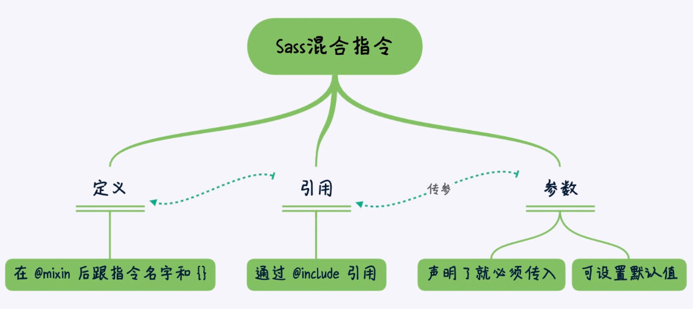

---
# 当前页面内容标题
title: 八、Sass语法介绍-混合指令
# 分类
category:
  - css
# 标签
tag: 
  - css
  - sass
sticky: false
# 是否收藏在博客主题的文章列表中，当填入数字时，数字越大，排名越靠前。
star: false
# 是否将该文章添加至文章列表中
article: true
# 是否将该文章添加至时间线中
timeline: true
---

## 1.前言

混合指令在 Sass 中也是一个比较常用的指令，在前面我们讲解的内容中有编写过混合指令 @mixin ，本节我们将详细讲解混合指令 @mixin 的语法包括定义混合指令和引用混合指令等等，混合指令同样非常好用，我们一起来学习它吧。

## 2.什么是 Sass 混合指令

混合指令的出现使你可以定义在样式表中重复使用的样式，这可以使你免去编写过多重复的样式，而且在混合指令 @mixin 中你也可以做一些逻辑处理。混合指令是一个很好用的指令，它将帮你更合理的维护样式代码，学会这种方式写起样式来也很便利，下面我们开始详细的讲解它。

## 3.语法详情

混合指令的写法是 @mixin name { … } 或者 @mixin name(<arguments…>) { … }，第一种写法是不传参的指令，第二种写法是传参的指令，我们先来举个简单的例子看下混合指令的样子：

```scss
@mixin border {
  border: {
    width: 1px;
    color: #cccccc;
    style: solid;
  }
}
```

上面我写的这个混合指令是一个不需要传参的，那么它怎么用呢？转换为 CSS 后是什么呢？下面我们从混合指令的定义开始逐一讲解。

## 4.定义和引用混合指令

混合指令的定义是**在 @mixin 后跟指令名字和 {}** ，在 {} 中你可以写一些样式，同时也可以用一些函数或者前面章节讲的控制指令，现在我们定义一个不接收参数的混合指令和一个接收参数的混合指令：

```scss
// 不接收参数的混合指令
@mixin border {
  border: {
    width: 1px;
    color: #cccccc;
    style: solid;
  }
}
// 接收参数的混合指令
@mixin font($size: 12px, $weight: 100) {
  font: {
    family: "Myfont";
    weight: $weight;
    size: $size;
  }
}
.box {
  // 引用混合指令
  @include border;
}
.item {
  // 引用混合指令并传参
  @include font(20px, 500);
}
```

上面的代码中我们分别定义了两个简单的混合指令，然后在 .box 和 .item 的样式中**通过 @include 引用混合指令**，在 @include 后直接跟混合指令的名称就可以引用了，传参如上面代码所示，那么上面这段代码将会转换为如下的 CSS 代码：

```css
.box {
  border-width: 1px;
  border-color: #cccccc;
  border-style: solid;
}

.item {
  font-family: "Myfont";
  font-weight: 500;
  font-size: 20px;
}
```

看到转换后的 CSS 代码是不是感觉混合指令很强大，我们把指令写好后，可以在任何需要它的地方来使用，而且我们只需要传参就可以生成各种各样的样式代码。还有一点需要注意的是，在 Sass 中，@minxin 后面的名字将连字符和下划线视为是相同的！

## 5.混合指令的参数

在上面的代码中我们已经知道了混合指令是可以传参数的，参数是在指令名后面由括号括起来的变量名列表，混合指令每次调用都可以操作这些传入的参数。

这些参数只要**声明了就必须传入**，如果你想让某个参数成为**可选的**，你需要**为这个参数赋一个默认值**，赋默认值的方法就像变量声明赋值一样，直接在变量名后面加冒号然后跟默认值。我们举例看下：

```scss
// 没有赋默认值的参数
@mixin font-one($size, $weight) {
  font: {
    family: "Myfont";
    weight: $weight;
    size: $size;
  }
}
// 赋默认值的参数
@mixin font($size: 12px, $weight: 100) {
  font: {
    family: "Myfont";
    weight: $weight;
    size: $size;
  }
}
```

从上面的代码中可以看出是否赋默认值的区别，默认值还可以引用前面的参数。除了默认值，在传入参数的时候我们还可以**按名称传入参数**，什么意思呢，我们直接举例看下：

```scss
@mixin font($size: 12px, $weight: 100) {
  font: {
    family: "Myfont";
    weight: $weight;
    size: $size;
  }
}
.item {
  // 按名称传入参数
  @include font-one(20px, $weight: 800);
}
```

上面这段代码将会转换为如下的 CSS 代码：

```css
.item {
  font-family: "Myfont";
  font-weight: 800;
  font-size: 20px;
}
```

按名称传入参数使我们可以更好的控制混合指令接收的参数，但这个方法还是尽量少用，因为参数名有时在多人开发的时候可能不是一成不变的！

有时候 @mixin 接收的参数个数你可能不不清楚有多少个，那么你可以**将最后一个参数以 … 结尾**，那么所有额外的参数都将传给该参数，然后在 @mixin 里来获取所有参数，我们举个例子直观的感受下：

```scss
@mixin fonts($s, $familys...) {
  font:{
    size: $s;
    family: $familys;
  }
}
.p {
  @include fonts(12px, "one", "two", "three")
}
```

上面这段代码转换为 CSS 代码如下：

```css
.p {
  font-size: 12px;
  font-family: "one", "two", "three";
}
```

除此之外，@mixin 还可以通过参数列表接收任意参数，然后通过 meta.keywords() 这个函数来使用传入的这些参数，我们下面举例看下：

```scss
@mixin args($args...) {

  @each $key, $val in keywords($args) {
    font: $key $val;
  }
}

.p {
  @include args($one: 1, $two: 2, $three: 3)
}
```

上面这个例子是为了让你更直观的看到这种传参方式，实际样式中不会这么写，上面这段代码我们通过循环 keywords() 函数返回的值来使用传入的参数，它将会被转化成如下的 CSS 代码：

```css
.p {
  font: one 1;
  font: two 2;
  font: three 3;
}
```

混合指令在传参这块还是有挺多方式的，你可以根据实际的需求来自行选择上面的传参方式，这使得我们用起它来很灵活。

## 6.实战经验

我们的项目是一个 Vue 单页应用，在我们的实际项目中有专门的 mixin.scss 文件来管理全局的 @mixin 指令，这里我从中截取出一部分来展示下：

```scss
@mixin border ($width: 1px, $color: #cccccc, $style: solid) {
  border: {
    width: $width;
    color: $color;
    style: $style;
  }
}
@mixin font($size: 12px, $weight: 100, $familys...) {
  $family: "Times";
  @if length($familys) > 0 {
    $family: $familys;
  }
  font: {
    size:$size;
    weight: $weight;
    family: $family;
  }
}

@mixin btn($type: "main") {
  border-radius: 4px;
  @if $type == "small" {
    width: 60px;
    height: 20px;
    background-color: #e5e5e5;
    color: #ffffff;
    &:hover {
      background-color: #4AA1FF;
    }
  } @else if $type == "disable" {
    width: 80px;
    height: 30px;
    background-color: #CCCCCC;
    color: #ffffff;
  } @else {
    width: 80px;
    height: 30px;
    background-color: #e5e5e5;
    color: #ffffff;
    &:hover {
      background-color: #4AA1FF;
    }
  }
}
```

从上面的代码可以看出，我定义的全局的 @mixin 有关于 border 样式的，有关于 font 样式的，还有一个我们自己封装的 button 样式，这样在项目的任何需要写这些样式的地方直接应用这些指令就可以了，而不需要编写大量的 CSS 样式，下面我截取一部分在某些页面中使用这些指令的代码：

```scss
// 使用 border 混合指令
.normal-border {
  @include border;
}
.error-border {
  @include border(2px, red, solid);
}
// 使用 font 混合指令
.main {
  @include font(24px);
  .item {
    @include font(16px, 600, "serif", "Roman", "Times");
  }
}
//  使用 button 混合指令
.btn {
  &-main {
    @include btn(); 
  }
  &-disable{
    @include btn("disable");
  }
  &-small{
    @include btn("small");
  }
}
```

上面的代码转换为 CSS 会非常的长，这里我就不贴出转换后的 CSS 代码了。

你可以仔细看下这些代码，看看是怎么封装和使用的，在公司的实际项目中，如果使用了 Sass ，你一定会看到类似的这些封装，当然你可能也会自己封装这些；你可以对照这上面两段定义混合指令和使用混合指令的代码来复习本节的内容，然后自己尝试这将它转换为 CSS 以便更好的理解！

## 7.小结

本节内容我们讲了 Sass 混合指令，这也是一个好用且常用的指令。你要牢牢记住如何**定义混合指令**，如何**引用混合指令**以及如何**处理混合指令的参数**！我们用一张图来演示下：



一般开始频繁使用指令的时候就说明你已经开始进入 Sass 的进阶水平了，你可以用混合指令为自己或者为其他人封装一些通用的样式，不但可以让自己开发样式高效，还可以减少其他人的工作量，所以学会 Sass 指令很重要！