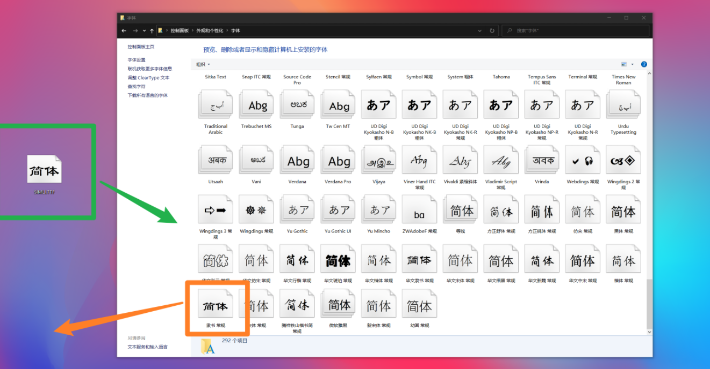
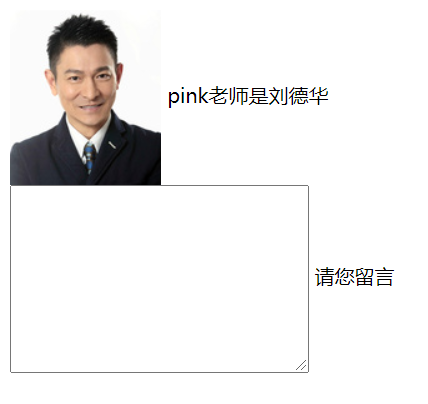
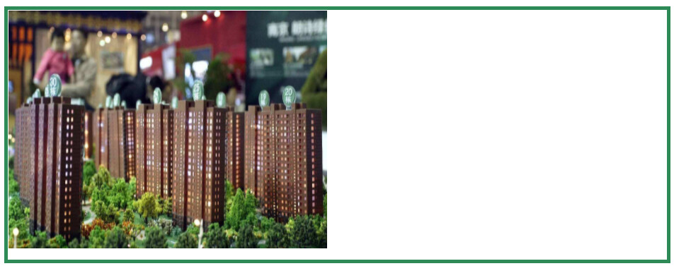
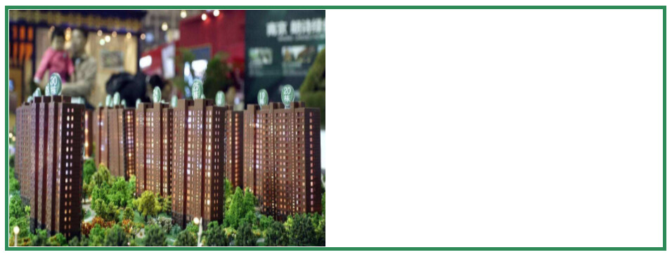
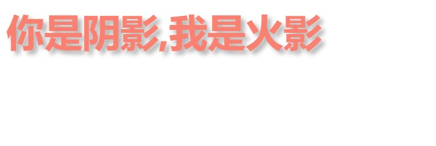

---
# 当前页面内容标题
title: CSS字体属性 CSS文本属性
# 当前页面图标
icon: css
# 分类
category:
  - HTML
  - CSS
# 标签
tag:
  - HTML
sticky: false
# 是否收藏在博客主题的文章列表中，当填入数字时，数字越大，排名越靠前。
star: false
# 是否将该文章添加至文章列表中
article: true
# 是否将该文章添加至时间线中
timeline: true
---

# 8.CSS字体属性

CSS Fonts（字体）属性用于定义：`字体系列`、`大小`、`粗细`、和 `文字样式`（如：斜体）。

## 8.1字体族

`font-family` 字体族（字体的格式）

CSS 使用 font-family 属性定义文本的字体系列。

```css
p {
 font-family: "Microsoft YaHei";
}

div {
 font-family: Arial, "Microsoft YaHei";
}
```

- 各种字体之间必须使用英文状态下的逗号隔开
- 一般情况下，如果有空格隔开的多个单词组成的字体，加引号
- 字体生效时优先使用第一个，第一个无法使用则使用第二个，以此类推
- 尽量使用系统默认自带字体，保证在任何用户的浏览器中都能正确显示
- 最常用的字体：`body {font-family: "Microsoft YaHei", tahoma, arial, sans-serif, "Hiragino Sans GB";}`

> Apple 官网字体：
>
> ```css
> body {
>  font-family: "SF Pro SC", "SF Pro Text", "SF Pro Icons", "PingFang SC", "Helvetica Neue", "Helvetica", "Arial", sans-serif
> }
> ```

> Instagram 官网字体：
>
> ```css
> body {
>  font-family: -apple-system, BlinkMacSystemFont,"Segoe UI", Roboto, Helvetica, Arial, sans-serif
> }
> ```

>知乎官网字体：
>
>```css
>body {
> font-family: -apple-system, BlinkMacSystemFont, Helvetica Neue, PingFang SC, Microsoft YaHei, Source Han Sans SC, Noto Sans CJK SC, WenQuanYi Micro Hei, sans-serif
>}
>```

> 爱奇艺官网字体：
>
> ```css
> body {
> font-family: PingFangSC-Regular, Helvetica, Arial, Microsoft Yahei, sans-serif
> }
> ```

```html
    <style type="text/css">
        /* 浏览器会从第一个字体开始进行适配，如果本机可以适配的话，那么就使用该字体，否则看下一个字体，
           如果都不可以，那么浏览器会使用自带的默认字体，所以实际开发中一般建议使用比较标准化的字体 */
        h2 {
            /* font-family: '微软雅黑'; 可以使用中文，但不建议 */
            font-family: "Microsoft YaHei", Arial, sans-serif;
        }

        p {
            font-family: "Times New Roman", Times, serif;
        }
    </style>
```

```html
    <style type="text/css">
        /* 一些情况下，如果要全局设置字体可以直接在 body 标签选择器中指明 */
        body {
            font-family: "Microsoft YaHei", Arial, sans-serif;
        }
    </style>
```

注意：浏览器字体是依据用户操作系统来调用的，所以这里介绍一种 Windows 系统安装字体的方法。

> 当然实际开发中通常浏览器请求时，会把字体文件随 HTML CSS JS 等一同传送到客服端。



## 8.2 @font-face

我们除了可以使用系统自带的字体样式外，还可以在服务器端自定义字体位置

`@font-face`可以将服务器中的字体直接提供给用户去使用

```css
@font-face {
    /* 指定字体名字 */
    font-family: 'myFont1';
    /* 服务器中字体路径 */
    src: url('/font/ZCOOLKuaiLe-Regular.woff'),
        url('/font/ZCOOLKuaiLe-Regular.otf'),
        url('/font/ZCOOLKuaiLe-Regular.ttf') format('truetype');/* 指定字体格式，一般不写 */
}

p {
    font-size: 30px;
    color: salmon;
    font-family: myFont1;
}
```


**问题**

1. 加载速度：受网络速度影响，可能会出现字体闪烁一下变成最终的字体

2. 版权：有些字体是商用收费的，需要注意

3. 字体格式：字体格式也有很多种（woff、otf、ttf），未必兼容，可能需要指定多个

## 8.2字体大小

CSS 使用 font-size 属性定义字体大小。

```css
p {
 font-size: 20px;
}
```

- px（像素）大小是我们网页的最常用的单位
- 谷歌浏览器默认的文字大小为：16px
- 不同浏览器可能默认显示的字号大小不一致，我们尽量给一个明确值大小，不要默认大小
- 可以给 body 指定整个页面文字的大小

```html
    <style type="text/css">
        /* 全局设置时，一般在 body 标签选择器中指定文字大小，谷歌浏览器默认 16px，
           但是最好还是指定一个明确值，以保证在不同浏览器中的效果是一样的 */
        body {
            font-size: 24px;
        }

        /* 标题标签比较特殊，body 中的设置对其是不生效的，需要单独指定文字大小 */
        h2 {
            font-size: 54px;
        }
    </style>
```

## 8.3字体粗细

CSS 使用 font-weight 属性设置文本字体的粗细。

```css
p {
 font-weight: bold;
}
```

| 属性值    | 描述                                                         |
| --------- | ------------------------------------------------------------ |
| `normal`  | 默认值（不加粗的）                                           |
| `bold`    | 定义粗体（加粗的）                                           |
| `100-900` | 400 等同于 normal，而 700 等同于 bold，其它值一般不使用，注意这个数字后面不跟单位 |

- 学会让加粗标签（比如 h 和 strong 等）变为不加粗，或者让其他标签加粗
- 实际开发时，我们更喜欢用数字表示粗细

```html
    <style type="text/css">
        .bold {
            /* font-weight: bold; */
            /* 实际开发中，我们更提倡使用数字来表示加粗的效果 */
            /* 这个 700 的后面不要跟单位 */
            font-weight: 700;
        }

        /* 使文字不加粗 */
        h2 {
            /* font-weight: normal; */
            font-weight: 400;
        }
    </style>
```

## 8.4文字样式

CSS 使用 font-style 属性设置文本的风格。

```css
p {
 font-style: normal;
}
```

| 属性值   | 作用                                                   |
| -------- | ------------------------------------------------------ |
| `normal` | 默认值，浏览器会显示标准的字体样式 font-style: normal; |
| `italic` | 浏览器会显示斜体的字体样式                             |

**注意：**平时我们很少给文字加斜体，反而要给斜体标签 (em、i) 改为不倾斜字体。

```html
    <style type="text/css">
        p {
            /* 让不倾斜的字体倾斜 */
            font-style: italic;
        }

        em {
            /* 让倾斜的字体不倾斜 */
            font-style: normal;
        }
    </style>

    <p>上课时候的你</p>
    <em>下课时候的你</em>
```

## 8.5字体复合属性

字体属性可以把以上文字样式综合来写，这样可以更节约代码。

```css
body {
 font: font-style font-weight font-size/line-height font-family;
}

body {
 font: normal 400 font-size/line-height "Microsoft YaHei", Arial, sans-serif;
}
```

- 使用 font 属性时，必须按上面语法格式中的顺序书写，不能更换顺序，并且各个属性间以空格隔开
- 不需要设置的属性可以省略（取默认值），但必须保留 font-size 和 font-family 属性，否则 font 属性将不起作用

```html
    <style type="text/css">
        /* 想要 div 文字变倾斜、加粗、字号设置为 16 像素，并且是微软雅黑 */
        div {
            /* font-style: italic;
               font-weight: 700;
               font-size: 16px;
               font-family: 'Microsoft YaHei'; */

            /* 复合属性：简写的方式，里面的顺序不能打乱 以空格隔开 */
            /* font: font-style font-weight font-size/line-height font-family; */
            font: italic 700 16px 'Microsoft YaHei';
            /* 注意：不需要设置的属性可以省略（取默认值），但必须保留 font-size 和 font-family 属性，否则 font 属性将不起作用 */
            /* font: 20px 'Microsoft YaHei'； */
        }
    </style>

    <div>三生三世十里桃花，一心一意百行代码</div>
```

## 8.6字体属性总结

| 属性          | 表示     | 注意点                                                       |
| ------------- | -------- | ------------------------------------------------------------ |
| `font-size`   | 字号     | 我们通常用的单位是 px 像素，一定要跟上单位                   |
| `font-family` | 字体     | 实际工作中按照团队约定来写字体                               |
| `font-weight` | 字体属性 | 记住加粗是 700 或者 bold 不加粗 是 normal 或者 400 记住数字不要跟单位 |
| `font-style`  | 字体样式 | 记住倾斜是 italic 不倾斜是 normal 工作中我们最常用 normal    |
| `font`        | 字体连写 | 1、字体连写是有顺序的不能随意换位置，2、其中字号和字体必须同时出现 |

# 9.CSS文本属性

CSS Text（文本）属性可定义文本的 `外观`，比如：`文本颜色`、`文本对齐`、`文本装饰`、`文本缩进`、`行间距` 等。

## 9.1文本颜色

`color` 属性用于定义文本的颜色。

```css
div {
 color: red;
}
```

| 表示方式       | 属性值                                              |
| -------------- | --------------------------------------------------- |
| 预定义的颜色值 | red，green，blue，black，white，gray                |
| 十六进制       | #FF0000，#FF6600，#29D794（每两位对应：#红R绿G蓝B） |
| RGB 代码       | rgb(255, 0, 0) 或 rgb(100%, 0%, 0%)                 |

**注意：**开发中最常用的是十六进制。

> 熟记开发常用色：
>
> 黑色：`black`、`#000000`、`rgb(0, 0, 0)`（三原色啥也没有混合就为黑）
>
> 白色：`white`、`#FFFFFF`、`rgb(255, 255, 255)`（三原色全满混合就为白）
>
> 灰色：`gray`、`#808080`、`rgb(128, 128, 128)`（三原色全半混合就为灰）
>
> 红色：`red`、`#FF0000`、`rgb(255, 0, 0)`
>
> 绿色：`green`、`#008000`、`rgb(0, 128, 0)`（绿色较为特殊，green 对应的是 #008000）
>
> 蓝色：`blue`、`#0000FF`、`rgb(0, 0, 255)`
>
> 黄色：`yellow`、`#FFFF00`、`rgb(255, 255, 0)`
>
> 青色：`#00FFFF`、`rgb(0, 255, 255)`
>
> 洋红：`#FF00FF`、`rgb(255, 0, 255)`
>
> 橙色：`orange`
>
> 粉色：`pink`
>
> 烈粉色：`hotpink`（浓度低）、`deeppink`（浓度高）
>
> 天蓝色：`skyblue`
>
> 深色系：`dark颜色` 如：`darkgreen`
>
> 浅色系：`light颜色` 如：`lightgreen`

## 9.2文本对齐

### 9.2.1水平对齐

`text-align` 属性用于设置元素内文本内容的水平对齐方式。

```css
div {
 text-align: center;
}
```

| 属性值  | 解释             |
| ------- | ---------------- |
| left    | 左对齐（默认值） |
| rigth   | 右对齐           |
| center  | 居中对齐         |
| justify | 两端对齐         |

```html
    <style type="text/css">
        h1 {
            /* 本质是让 h1 盒子里面的文字水平居中对齐 */
            /* text-align: center; */
            text-align: right;
        }
    </style>

    <h1>右对齐的标题</h1>
```

注意：

`text-align` 属性只能作用于 `块级元素`，并让该块级元素内的 `行内元素` 实现居中（不一定是文字）。

上述例子中：h1 为块级元素，所以给 h1 设置 text-align，便会作用于里面的文本（如果里面还有行内元素的话，也会一同作用）。

```html
    <style type="text/css">
        div {
            text-align: center;
        }
    </style>

   <div>
    <p>dselegent</p>
   </div>
```

上述例子中：为 div 设置 text-align 之所以能够使其内部的块级元素 p 里的文字居中，原因是 p 会继承父元素 div 的 text-align 属性，所以相当于对 p 设置了 text-align。

### 9.2.2垂直对齐

CSS 的 `vertical-align` 属性使用场景：经常用于设置图片或者表单（行内块元素）与文字垂直对齐。

官方解释：用于设置一个元素的垂直对齐方式，但是它只针对于行内元素或者行内块元素有效。

语法：

```css
vertical-align: baseline | top | middle | bottom
```

| 值         | 描述                                   |
| ---------- | -------------------------------------- |
| `baseline` | 默认。元素放置在父元素的基线上         |
| `top`      | 把元素的顶端与行中最高元素的顶端对齐   |
| `middle`   | 把此元素放置在父元素的中部             |
| `bottom`   | 把元素的顶端与行中最低的元素的顶端对齐 |


`baseline` **基线对齐**


`top` **顶部对齐**


`bottom` **底部对齐**


`middle` **居中对齐**


这里的居中对齐高度 = 基线高度 + x的高度 / 2

这种居中对齐并非实际上的居中对齐，一般也不会用这种方式对文字进行垂直方向的对齐

 **图片、表单和文字对齐**

图片、表单都属于行内块元素，默认的 vertical-align 是基线对齐。

此时可以给图片、表单这些行内块元素的 vertical-align 属性设置为 middle 就可以让文字和图片垂直居中对齐了。

```html
<!doctype html>
<html lang="en">

<head>
    <meta charset="UTF-8">
    <meta name="viewport" content="width=device-width, initial-scale=1.0">
    <meta http-equiv="X-UA-Compatible" content="ie=edge">
    <title>利用vertical-align实现图片文字垂直居中对齐</title>
    <style>
        img {
            /* vertical-align: bottom; */
            /* 让图片和文字垂直居中 */
            vertical-align: middle;
            /* vertical-align: top; */
        }

        textarea {
            vertical-align: middle;
        }
    </style>
</head>

<body>
     pink老师是刘德华

    <br>
    <textarea name="" id="" cols="30" rows="10"></textarea> 请您留言
</body>

</html>
```



> 运用重点：
>
> 我们知道，当对盒子设置 `line-height: 盒子高度;` 时，盒子内的 `文字` 会垂直居中，其实不只是文字可以垂直居中，盒子内的图片同样也能垂直居中，只不过图片默认是基于基线对齐的，所以要真正实现 `垂直居中` 需要在图片加上：`vertical-align: middle;`

**解决图片底部默认空白缝隙问题**

```html
<style>
    .imgDiv {
        border: 5px seagreen solid;
    }

    .imgDiv img {
        width: 400px;
        height: 300px;
    }
</style>

<div class="imgDiv">
    
</div>
```



主要解决方法有两种：

1. 给图片添加 `vertical-align: middle | top | bottom` 等（推荐）
2. 把图片转换为块级元素 `display: block;`

明显默认情况下，图片底部有一定缝隙，我们稍作修改，给img元素添加`vertical-align`属性值

```css
/* 只要不是基线对齐，就能消除底部缝隙 */
vertical-align: top;
vertical-align: bottom;
vertical-align: middle;
```



**Q：为什么图片会有缝隙？**

A：图片属于替换元素，特点与文本一致，也有自己的基线，默认也是基线对齐。而基线位置不在最底部，所以会出现缝隙

## 9.3文本装饰

`text-decoration` 属性规定添加到文本的修饰，可以给文本添加 `下划线`、`删除线`、`上划线` 等。

```css
div {
 text-decoration: underline;
}
```

| 属性值         | 描述                              |
| -------------- | --------------------------------- |
| `none`         | 默认，没有装饰线（**最常用**）    |
| `underline`    | 下划线，链接 a 自带下划线（常用） |
| `overline`     | 上划线（几乎不用）                |
| `line-through` | 删除线（不常用）                  |

```html
<!doctype html>
<html lang="en">

<head>
    <meta charset="UTF-8">
    <meta http-equiv="X-UA-Compatible" content="IE=edge">
    <meta name="viewport" content="width=device-width, initial-scale=1.0">
    <title>CSS文本外观之文本装饰</title>
    <style type="text/css">
        /* 默认为 none 没有装饰 */
        div {
            /* 上划线 几乎不用 */
            /* text-decoration: overline; */
            /* 删除线 不常用 */
            /* text-decoration: line-through; */
            /* 下划线 常用，链接 a 自带下划线 */
            text-decoration: underline;
        }

        a {
            /* 取消 a 默认的下划线 */
            text-decoration: none;
            color: #333333;
        }
    </style>
</head>

<body>
    <div>粉红色的回忆</div>
    <a href="#">JERRY</a>
</body>

</html>
```

## 9.4文本缩进

`text-indent` 属性用来指定文本的第一行的缩进，通常是将段落的首行缩进。

```css
div {
 text-indent: 10px;
}
```

通过设置该属性，所有元素的第一行都可以缩进一个给定的长度，甚至该长度可以是负值。

```css
p {
 text-indent: 2em;
}
```

em 是一个相对单位，就是当前元素 (font-size) 1 个文字的大小，如果当前元素没有设置大小，则会按照父元素的 1 个文字大小。

```html
<!doctype html>
<html lang="en">

<head>
    <meta charset="UTF-8">
    <meta http-equiv="X-UA-Compatible" content="IE=edge">
    <meta name="viewport" content="width=device-width, initial-scale=1.0">
    <title>CSS文本外观之文本缩进</title>
    <style type="text/css">
        p {
            font-size: 24px;
            /* 文本的首行缩进多少距离，不仅可以为正值，还可以为负值 */
            /* text-indent: 20px; */
            /* em 为相对于当前元素的大小单位 */
            text-indent: 2em;
        }
    </style>
</head>

<body>
    <p>打开北京、上海与广州的地铁地图，你会看见三张纵横交错的线路网络，
        这代表了中国最成熟的三套城市轨道交通系统</p>

    <p>可即使是这样，在北上广生活的人依然少不了对地铁的抱怨，其中谈及最多的问题便是拥挤，
        对很多人而言，每次挤地铁的过程，都像是一场硬仗。更何况，还都是败仗居多。</p>

    <p>那么，当越来越多的二线甚至三线城市迎接来了自己的地铁，中国哪里的地铁是最拥挤的呢？</p>
</body>

</html>
```

## 9.5行间距（行高）

`line-height` 属性用于设置行间的距离（行高），可以控制文字行与行之间的距离。

```css
p {
 line-height: 26px;
}
```

- `行间距 = 上间距 + 文本高度 + 下间距`

- `上下间距 = （行间距 - 文本高度）/ 2`

- `文本高度 = font-size`

```html
<!doctype html>
<html lang="en">

<head>
    <meta charset="UTF-8">
    <meta http-equiv="X-UA-Compatible" content="IE=edge">
    <meta name="viewport" content="width=device-width, initial-scale=1.0">
    <title>CSS文本外观之行间距</title>
    <style type="text/css">
        /* 行间距 = 上间距 + 文本高度 + 下间距 */
        /* 行间距 = 行高 */
        /* 文本高度 = 字体像素大小 */
        /* 上下间距 = （行间距 - 文本高度）/ 2 */
        p {
            line-height: 25px;
        }
    </style>
</head>

<body>
    <p>打开北京、上海与广州的地铁地图，你会看见三张纵横交错的线路网络，
        这代表了中国最成熟的三套城市轨道交通系统</p>

    <p>可即使是这样，在北上广生活的人依然少不了对地铁的抱怨，其中谈及最多的问题便是拥挤，
        对很多人而言，每次挤地铁的过程，都像是一场硬仗。更何况，还都是败仗居多。</p>

    <p>那么，当越来越多的二线甚至三线城市迎接来了自己的地铁，中国哪里的地铁是最拥挤的呢？</p>
</body>

</html>
```

补充：行间距测量技巧：上一行文字的底部与本行文字的底部之间的距离就是行间距。

## 9.6文字阴影

CSS 3 新增了文字阴影。

text-shadow 属性用于为文本添加阴影。

语法：

```css
text-shadow: h-shadow v-shadow blur color;
```

| 值         | 描述                                |
| ---------- | ----------------------------------- |
| `h-shadow` | 必须。水平阴影的位置。允许负值。    |
| `v-shadow` | 必须。垂直阴影的位置。允许负值。    |
| `blur`     | 可选。模糊的距离（虚实程度）。      |
| `color`    | 可选。阴影的颜色。参阅 CSS 颜色值。 |

```html
<!doctype html>
<html lang="en">

<head>
    <meta charset="UTF-8">
    <meta name="viewport" content="width=device-width, initial-scale=1.0">
    <meta http-equiv="X-UA-Compatible" content="ie=edge">
    <title>文字阴影</title>
    <style>
        div {
            font-size: 50px;
            color: salmon;
            font-weight: 700;
            text-shadow: 5px 5px 6px rgba(0, 0, 0, .3);
        }
    </style>
</head>

<body>
    <div>
        你是阴影,我是火影
    </div>
</body>

</html>
```



## 9.7文本属性总结

| 属性              | 表示     | 注意点                                                       |
| ----------------- | -------- | ------------------------------------------------------------ |
| `color`           | 文本颜色 | 我们通常用 十六进制 而且通常是简写形式 #fff（6 个一样可以简写） |
| `text-align`      | 文本对齐 | 可以设定文字水平的对齐方式                                   |
| `text-indent`     | 文本缩进 | 通常我们用于段落首行缩进2个字的距离 text-indent: 2em;        |
| `text-decoration` | 文本修饰 | 牢记 添加下划线 underline 取消下划线 none                    |
| `line-height`     | 行高     | 控制行与行之间的距离                                         |
