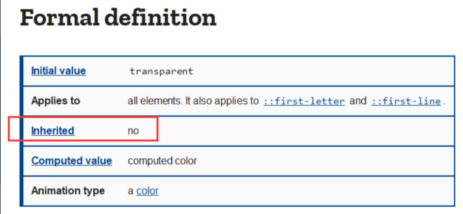
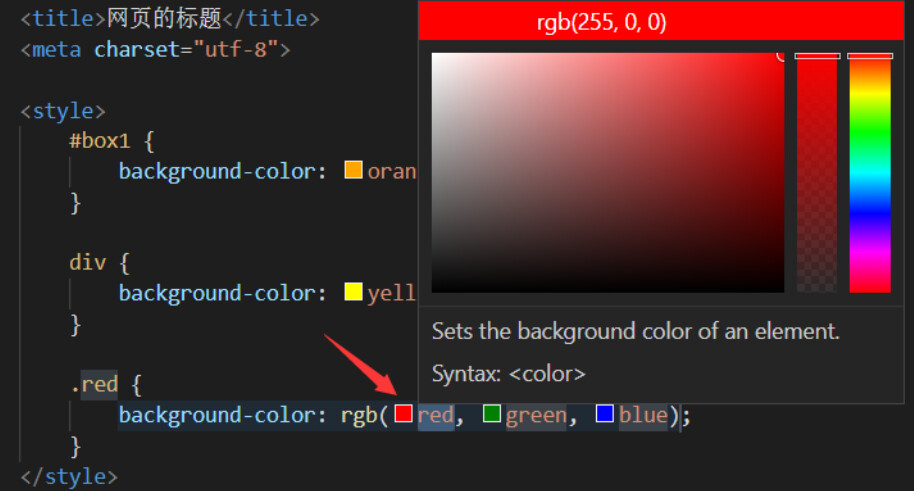

---
# 当前页面内容标题
title: Emmet语法 三大特性及单位
# 当前页面图标
icon: html
# 分类
category:
  - HTML
  - CSS
# 标签
tag:
  - HTML
sticky: false
# 是否收藏在博客主题的文章列表中，当填入数字时，数字越大，排名越靠前。
star: false
# 是否将该文章添加至文章列表中
article: true
# 是否将该文章添加至时间线中
timeline: true
---

# 10.Emmet语法

`Emmet` 语法的前身是 `Zen coding`，它使用缩写，来提高 `html/css` 的编写速度,，`VSCode` 内部已经集成该语法。

- 快速生成 HTML 结构语法
- 快速生成 CSS 样式语法

## 10.1快速生成HTML结构语法

- 生成标签直接输入标签名按 `tab` 键即可，比如 `div` 然后 `tab` 键， 就可以生成 `<div></div>`
- 如果想要生成多个相同标签加上 `*` 就可以了，比如 `div*3` 就可以快速生成 3 个 `div`
- 如果有父子级关系的标签，可以用 `>` 比如 `ul>li` 就可以了
- 如果有兄弟关系的标签，用 `+` 就可以了 比如 `div+p`
- 如果生成带有 `类名` 或者 `id` 名字的标签， 直接写 `标签.demo` 或者 `标签#demo` 再按下 tab 键就可以了
- 如果生成的事物有顺序，可以用自增符号 `$`
- 如果想要在生成的标签内部写内容可以用 `{}` 表示

```html
<!doctype html>
<html lang="en">

<head>
    <meta charset="UTF-8">
    <meta http-equiv="X-UA-Compatible" content="IE=edge">
    <meta name="viewport" content="width=device-width, initial-scale=1.0">
    <title>Emmet语法之快速生成HTML结构语法</title>
</head>

<body>
    <!-- div -->
    <div></div>
    <!-- table -->
    <table></table>
    <!-- div*6 -->
    <div></div>
    <div></div>
    <div></div>
    <div></div>
    <div></div>
    <div></div>
    <!-- p*4 -->
    <p></p>
    <p></p>
    <p></p>
    <p></p>
    <!-- ul>li -->
    <ul>
        <li></li>
    </ul>
    <!-- div>span -->
    <div><span></span></div>
    <!-- div+p -->
    <div></div>
    <p></p>
    <!-- .nav -->
    <div class="nav"></div>
    <!-- #banner -->
    <div id="banner"></div>
    <!-- p.one -->
    <p class="one"></p>
    <!-- span.gray -->
    <span class="gray"></span>
    <!-- ul>li#two -->
    <ul>
        <li id="two"></li>
    </ul>
    <!-- .demo*5 -->
    <div class="demo"></div>
    <div class="demo"></div>
    <div class="demo"></div>
    <div class="demo"></div>
    <div class="demo"></div>
    <!-- .demo$*5 -->
    <div class="demo1"></div>
    <div class="demo2"></div>
    <div class="demo3"></div>
    <div class="demo4"></div>
    <div class="demo5"></div>
    <!-- div{pink老师不是gay} -->
    <div>pink老师是帅哥</div>
    <!-- div{他不喜欢男人}*6 -->
    <div>他喜欢玩</div>
    <div>他喜欢玩</div>
    <div>他喜欢玩</div>
    <div>他喜欢玩</div>
    <div>他喜欢玩</div>
    <div>他喜欢玩</div>
    <!-- div{$}*6 -->
    <div>1</div>
    <div>2</div>
    <div>3</div>
    <div>4</div>
    <div>5</div>
    <div>6</div>
</body>

</html>
```

## 10.2快速生成CSS样式语法

CSS 基本采取简写形式即可。

- 比如 `w200` 按 `tab` 可以 生成 `width: 200px;`
- 比如 `lh26px` 按 `tab`可以生成 `line-height: 26px;`

```html
<!doctype html>
<html lang="en">

<head>
    <meta charset="UTF-8">
    <meta name="viewport" content="width=device-width, initial-scale=1.0">
    <title>Emmet语法之快速生成CSS样式语法</title>
    <style>
        .one {
            /* tac */
            text-align: center;
            /* ti2e */
            text-indent: 2em;
            /* w */
            /* width: ; */
            /* h */
            /* height: ; */
            /* w24 */
            width: 24px;
            /* h24 */
            height: 24px;
            /* tdn */
            text-decoration: none;
        }
    </style>
</head>

<body>

</body>

</html>
```

## 10.3快速格式化代码

`VSCode` 快速格式化代码：`Shift` + `Alt` +` F`。

`WebStorm` 快速格式化代码：`Ctrl` +`Alt` + `L`。

# 11.三大特性及单位

## 11.1层叠性

给同一个选择器设置相同的样式，此时一个样式就会**覆盖**（层叠）另一个冲突的样式，**层叠性主要解决样式冲突的问题**。

层叠性原则：

- 样式冲突，遵循的原则是 `就近原则`，哪个样式距离结构近，就执行哪个样式
- 样式不冲突，不会层叠

注：就近的标准是：**后 > 前**

```html
    <style>
        div {
            color: red;
        }

        div {
            color: pink;
        }
    </style>
</head>

<body>
    <!-- pink 色 -->
    <div>dselegent</div>
</body>

</html>
```

## 11.2继承

现实中的继承：我们继承了父亲的姓。

CSS 中的继承：**样式的继承，我们为一个元素设置的样式，同时也会应用到它的后代元素上**，如：文本颜色和字号，简单的理解就是：子承父业。

- 恰当地使用继承可以简化代码，降低 CSS 样式的复杂性
- 子元素可以继承父元素的样式（ `text-`、`font-`、`line-`、`color` ） 文本、字体、段落、颜色

继承是发生在祖先后后代之间的，继承的设计是为了方便我们的开发。利用继承，我们可以将一些通用的样式，统一设置到共同的祖先元素上。这样只需设置一次即可让所有的元素都具有该样式

> 注意，并不是所有的样式都会被继承：
>
> 比如背景相关的，布局相关等的这些样式都不会被继承。
>
> 我们可以再Zeal手册中，搜索`background-color`属性，可以看到一个定义的表格。其中就说明了其不可被继承性
>
> 

```html
    <style>
        div {
            color: pink;
            font-size: 14px;
        }
    </style>
</head>

<body>
    <div>
        <p>dselegent</p>
    </div>
</body>
```

**行高的继承**

```css
body {
    font: 12px/1.5 'Microsoft YaHei';
}
```

- 行高可以跟单位也可以不跟单位
- 如果子元素没有设置行高，则会继承父元素的行高为 1.5
- 此时子元素的行高是：**当前元素**的**文字大小** * 1.5
- body 行高 1.5 这样写法最大的优势就是**里面的子元素可以根据自己文字的大小自动调整行高**

```html
    <style>
        body {
            color: pink;
            /* font: 12px/18px; */
            font: 12px/1.5;  /* 12 + 12 * 0.5 = 18 */
        }

        div {
            /* 子元素继承了父元素 body 的行高 1.5 */
            /* 这个 1.5 就是当前元素文字大小 font-size 的 1.5 倍 */
            /* 所以当前 div 的行高就是：14 + 14 * 0.5 = 21px */
            font-size: 14px;
        }

        p {
            /* 1.5 * 16 = 24 当前行高 */
            font-size: 16px;
        }

        /* li 没有手动指定文字大小，则会继承父亲（此处的父亲可以层层向上推）的文字大小  */
        /* 即：body 12px 所有 li 的文字大小为 12px */
        /* 当前 li 的行高就是 12 * 1.5 = 18  */
    </style>
</head>

<body>
    <div>dselegent</div>
    <p>dselegent2</p>
    <ul>
        <li>没有指定文字大小</li>
    </ul>
</body>

</html>
```

## 11.3权重(优先级)

当我们通过不同的选择器，选中相同的元素，并且为相同的样式设置不同的值时，此时就发生了样式的冲突。

发生样式冲突时，应用哪个样式由选择器的权重（优先级）决定选择器的权重

- 选择器相同，则执行层叠性
- 选择器不同，则根据选择器权重执行

**选择器权重如下表所示：**

| 选择器               | 选择器权重 |
| -------------------- | ---------- |
| 继承 或  `*`         | `0,0,0,0`  |
| 元素选择器           | `0,0,0,1`  |
| 类选择器、伪类选择器 | `0,0,1,0`  |
| ID 选择器            | `0,1,0,0`  |
| 内联样式             | `1,0,0,0`  |
| !important 重要的    | `∞` 无穷大 |

**规则：**比较位级别，位级别相同时比较位大小。

**优先级注意问题：**

- 权重是由 4 组数字组成的，但是不会有进位！
- 可以理解为：`类选择器` 永远大于 `元素选择器`，`ID 选择器` 永远大于 `类选择器`，以此类推！
- 比较优先级时，需要将所有的选择器的优先级进行`相加计算`，最后优先级越高，则越优先显示（分组选择器是单独计算的）
- 可以简单的记忆：`通配符` 和 `继承` 权重为 0，`标签选择器` 为 1，`类`（`伪类`）选择器为 10，`ID` 选择器为 100，`行内样式表` 为 1000，`!important` 无穷大
- 继承的权重是 0，不管父元素权重多高，子元素得到的权重都是 0 ！
- `a` 链接浏览器默认指定了一个样式，所以它不参与继承，所以设置样式需要选中单独设置

**权重的叠加：**

如果是复合选择器，则会有权重叠加，需要计算权重。

注意：再次强调！权重虽然会叠加，但一定不会进位！（1万个元素选择器也比不过一个类选择器）。

从左到右逐位比较，只有左`一位同样大，才比较右边一位！

**例如：**

- `div ul li` ——> `0,0,0,3`
- `.nav ul li` ——> `0,0,1,2`
- `a:hover` ——> `0,0,1,1`
- `.nav a` ——> `0,0,1,1`

如果要对某一元素设置样式，那么就必须给它足够高的权重（注意：是给他，而不是他的父亲！）。

> 提高选择器权重的技巧之一：
>
> - 多写几层类选择器

## 11.4长度单位

### 11.4.1像素

我们先来看下某度上关于像素（pixel,缩写px）的介绍

> 像素是指由图像的小方格组成的，这些小方块都有一个明确的位置和被分配的色彩数值，小方格颜色和位置就决定该图像所呈现出来的样子
>
> 可以将像素视为整个图像中不可分割的单位或者是元素。不可分割的意思是它不能够再切割成更小单位抑或是元素，它是以一个单一颜色的小格存在 [1] 。每一个点阵图像包含了一定量的像素，这些像素决定图像在屏幕上所呈现的大小。

也就是说，显示器屏幕实际上是由一个一个的小点（单位色块，即像素）构成的

**问题1：像素和分辨率有什么关系呢？**

分辨率 = 水平方向像素 * 垂直方向像素

#### 屏幕分辨率

例如，屏幕分辨率是1920×1080，则该屏幕水平方向有1920个像素，垂直方向有1080个像素

- 不同屏幕的像素大小是不同的，也就是说像素大小不像我们现行的长度单位（如米/m）那样有着固定的国际标准

- 所以同样的像素大小在不同的设备上显示效果是不一样的，像素越小的屏幕显示的效果越清晰

#### 图像分辨率

例如，一张图片分辨率是300x200，则该图片在屏幕上按1:1缩放时，水平方向有300个像素，垂直方向有200个像素点

- 图片分辨率越高，1:1缩放时面积越大

- 图片分辨率越低，1:1缩放时面积越小

同一台设备像素大小是不变的，那把图片放大超过100%时占的像素点就多了，但是图像也会变得模糊

**问题2：屏幕实现图片放大或缩小的原理是什么呢？**

- 其实是设备通过算法对图像进行了像素补足；

- 同理，把图片按小于100%缩放时，也是通过算法将图片像素减少

### 11.4.2百分比

也可以将属性值设置为相对于其父元素属性的百分比，可以使子元素跟随父元素的改变而改变

### 11.4.3em

em是相对于元素的字体大小来计算的，`1em = <self>.font-size`，也就说em值会根据元素本身的字体大小的改变而改变

### 11.4.5rem

rem是相对于根元素的字体大小来计算，`1em = <root>.font-size`，也就说em值会根据根元素的字体大小的改变而改变

## 11.5颜色单位

**css中的颜色名称**

我们生活中会使用各种颜色名称去描述看到的各种颜色，在css中当然也可以直接使用颜色名来设置颜色，比如：red、orange、yellow、blue、green等等

其中有140 种颜色名称是所有浏览器都支持的，但是有个问题，就是在css中直接使用颜色名非常不方便

而且世界上有无数种颜色，人眼也不能分辨出所有颜色，更不可能对每一种颜色都进行命名

而且就算能够有办法对那么多种颜色进行命名，我们也不可能一个一个的去记或去查这种对应关系。试问下，有多少人看一眼某个颜色，就能够在调色板上快速准确的定位那个颜色或者直接叫出那种颜色的名称？这显然不现实，至少现在如此

另外，那么css中还可以怎么调和出更多的颜色呢？


### 11.5.1RGB值

RGB通过三原色的不同浓度来调配出不同的颜色

- 语法：`RGB(red, green, blue)`

- 范围：每一种颜色的范围在0 ~ 255（0% ~ 100%）之间

### 11.5.2RGBA

就是在rgb的基础上增加了一个a表示不透明度

- `1`表示完全不透明

- `0`表示完全透明

- `.5`半透明

### 11.5.3十六进制的RGB值

就是RGB值的十六进制写法

- 语法：`#RRGGBB`

- 范围：每一种颜色的范围在00 ~ ff 之间

如果颜色两位两位重复可以进行简写，如`#aabbcc` => `#abc`

在vscode中，我们可以看到其会对颜色进行预览展示。并且将鼠标移至color处悬浮，会智能的弹出一个rgb调色板，方便我们进行调色


