---
# 当前页面内容标题
title: 盒模型(上) 盒模型(下)
# 当前页面图标
icon: html
# 分类
category:
  - HTML
  - CSS
# 标签
tag:
  - HTML
sticky: false
# 是否收藏在博客主题的文章列表中，当填入数字时，数字越大，排名越靠前。
star: false
# 是否将该文章添加至文章列表中
article: true
# 是否将该文章添加至时间线中
timeline: true
---

# 12.盒模型(上)

## 12.1文档流（normalflow）

网页是一个多层的结构，一层摁着一层

通过CSS可以分别为每一层来设置样式，作为用户来讲只能看到最顶上一层

这些层中，最底下的一层称为文档流

文档流是网页的基础我们所创建的元素默认都是在文档流中进行排列

对于我们来元素主要有两个状态

- 在文档流中

- 不在文档流中（脱离文档流）

## 12.2块元素

- 块元素会在页面中独占一行

- 默认宽度是父元素的全部（会把父元素撑满）

- 默认高度是被内容撑开（子元素）

## 12.3行内元素

- 行内元素不会独占页面的一行，只占自身的大小

- 行内元素在页面中左向右水平排列（书写习惯一致）

- 如果一行之中不能容纳下所有的行内元素，则元素会换到第二行继续自左向右排列

- 行内元素的默认宽度和高度都是被内容撑开

## 12.4盒子模型

> 网页设计中常听的属性名：内容(content)、内边距(padding)、边框(border)、外边距(margin)， CSS盒子模型都具备这些属性。
>
> 这些属性我们可以用日常生活中的常见事物——盒子作一个比喻来理解，所以叫它盒子模型。
>
> CSS盒子模型就是在网页设计中经常用到的CSS技术所使用的一种思维模型。[[1\]](#fn1)

### 12.4.1盒子模型（box model）

所谓盒子模型：就是把 HTML 页面中的布局元素看作是一个矩形的盒子，也就是一个盛**装内容的容器**。
CSS 盒子模型本质上是一个盒子，封装周围的 HTML 元素。

CSS将页面中的所有元素都设置为了一个矩形的盒子

将元素设置为矩形的盒子后，对页面的布局就变成将不同的盒子摆放到不同的位置

每一个盒子都由一下几个部分组成：

- 内容区（content）

- 内边距（padding）

- 边框（border）

- 外边距（margin）


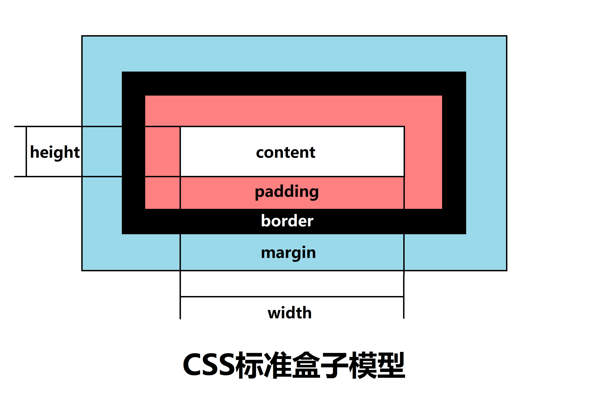

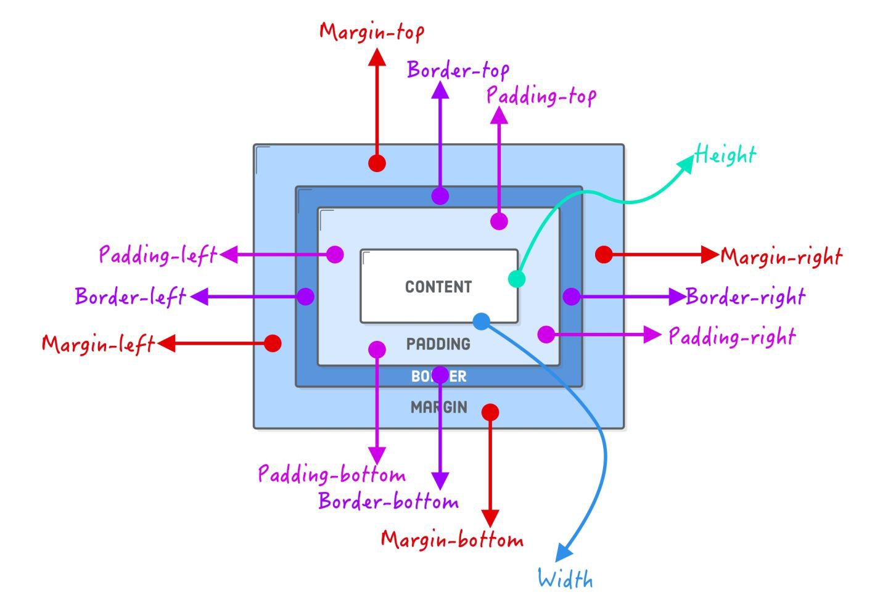

### 12.4.2内容区（content）

内容区是盒子模型的中心，它呈现了盒子的主要信息内容，这些内容可以是文本、图片等多种类型

元素中的所有的子元素和文本内容都在内容区中

- `width和height` 设置排列内容区的大小

- `width` 设置内容区的宽度

- `height` 设置内容区的高度

```css
.box1{
    width: 200px; 
    height: 200px; 
    background-color: #bfa;
}
```

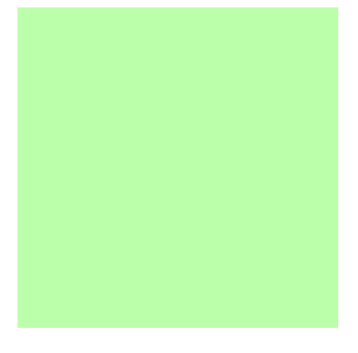

### 12.4.3边框（border）

`border` 可以设置元素的边框。

边框有三部分组成：`边框宽度（粗细）`、`边框样式`、`边框颜色`。

边框属于盒子边缘，边框里边属于盒子内部，出了边框都是盒子的外部

> 注意：边框会额外增加盒子的实际区域大小。因此我们有两种方案解决：
>
> - 测量盒子大小的时候，不量边框
>
> - 如果测量的时候包含了边框，则需要 width、height 减去边框宽度（注意减单边还是双边）
>
>   盒子实际区域大小 = 内容区大小 + 内边距大小 + 边框大小 + 外边距大小

**语法：**

```css
border: border-width || border-style || border-color
```

| 属性           | 作用                      |
| -------------- | ------------------------- |
| `border-width` | 定义边框粗细，单位是 `px` |
| `border-style` | 边框的样式                |
| `border-color` | 边框颜色                  |

边框样式 border-style 可以设置如下值：

- `none`：没有边框，即忽略所有边框的宽度（默认值）
- `solid`：边框为单实线（最为常用的）
- `dashed`：边框为虚线
- `dotted`：边框为点线
- `double`：边框为双线

**边框简写：**

`border`：简写属性，通过该属性可以同时设置边框所有的相关样式，并且没有顺序要求

```css
border: 1px solid red;  /* 没有顺序 */
```

**边框分开写法：**

- `border-top` 上边框的宽度、颜色和样式

- `border-right` 右边框的宽度、颜色和样式

- `border-bottom` 下边框的宽度、颜色和样式

- `border-left` 左边框的宽度、颜色和样式

```css
border-top: 1px solid red;   /* 只设定上边框，其余同理 */
```

**补充：**

> - `border-width` 边框的宽度：默认3px
>
>   - - `border-top-width` 上边框的宽度
>
>   - - `border-right-width` 右边框的宽度
>
>   - - `border-bottom-width` 下边框的宽度
>
>   - - `border-left-width` 左边框的宽度
>
> - `border-color` 边框的颜色：默认使用color的颜色值
>
> - `border-top-color` 上边框的颜色
>
> - `border-right-color` 右边框的颜色
>
> - `border-bottom-color` 下边框的颜色
>
> - `border-left-color` 左边框的颜色
>
> - `border-style` 边框的样式：没有默认值，必须指定
>
>   - - `border-top-style` 上边框的样式
>
>   - - `border-right-style` 右边框的样式
>
>   - - `border-bottom-style` 下边框的样式
>
>   - - `border-left-style` 左边框的样式

### 12.4.4内边距(padding）

padding 属性用于设置**内边距**，即**边框与内容之间的距离**。

| 属性             | 作用     |
| ---------------- | -------- |
| `padding-left`   | 左内边距 |
| `padding-rigth`  | 右内边距 |
| `padding-top`    | 上内边距 |
| `padding-bottom` | 下内边距 |

padding 属性（简写属性）可以有一到四个值。

| 值的个数                       | 表达意思                                                     |
| ------------------------------ | ------------------------------------------------------------ |
| `padding: 5px;`                | 1 个值，代表上下左右都有 5 像素内边距                        |
| `padding: 5px 10px;`           | 2 个值，代表上下内边距是 5 像素，左右内边距是 10 像素        |
| `padding: 5px 10px 20px;`      | 3 个值，代码上内边距 5 像素，左右内边距 10 像素，下内边距 20 像素 |
| `padding: 5px 10px 20px 30px;` | 4 个值，上是 5 像素，右 10 像素，下 20 像素，左是 30 像素（顺时针） |

以上 4 种情况，我们实际开发都会遇到。

当我们给盒子指定 `padding` 值之后，发生了 2 件事情：

- 内容和边框有了距离，添加了内边距
- `padding` 影响了盒子实际区域大小

也就是说，如果盒子已经有了宽度和高度，此时再指定内边距，会撑大盒子区域！

解决方案：

- 如果保证盒子跟效果图大小保持一致，则让 width、height 减去多出来的内边距大小即可
- 如果盒子本身没有指定 width、height 属性，则此时 padding 不会撑开盒子区域大小

盒子可见框的大小，由内容区、内边距和边框共同决定，所以在计算盒子大小时，需要将这三个区域加到一起计算

### 12.4.5外边距（margin）

外边距，也叫空白边，位于盒子的最外围，是添加在边框外周围的空间。空白边使盒子之间不会紧凑地连接在一起，是CSS 布局的一个重要手段

注意：外边距不会影响盒子可见框的大小，但是外边距会影响盒子的位置和占用空间

`margin` 属性用于设置**外边距**，即控制**盒子和盒子之间的距离**。

| 属性            | 作用     |
| --------------- | -------- |
| `margin-left`   | 左外边距 |
| `margin-right`  | 右外边距 |
| `margin-top`    | 上外边距 |
| `margin-bottom` | 下外边距 |

一共有四个方向的外边距：

- `margin-top` 上外边距

  - - 设置正值，元素自身向下移动

  - - 设置负值，元素自身向上移动

- `margin-right` 右外边距

  - - 设置正值，其右边的元素向右移动

  - - 设置负值，其右边的元素向左移动

  - - 上述说法并不准确，对于块元素，设置`margin-right`不会产生任何效果

- `margin-bottom` 下外边距

  - - 设置正值，其下边的元素向下移动

  - - 设置负值，其下边的元素向上移动

  - - 上述说法并不准确，对于块元素，会有垂直方向上的边距重叠问题（后面会细说）

- `margin-left` 左外边距

  - - 设置正值，元素自身向右移动

  - - 设置负值，元素自身向左移动

元素在页面中是按照自左向右的顺序排列的，所以默认情况下

- 如果我们设置的左和上外边距则会移动元素自身

- 而设置下和右外边距会移动其他元素

`margin` 简写方式代表的意义跟 `padding` 完全一致。

外边距典型应用：

外边距可以让**块级盒子水平居中**，但是必须满足两个条件：

- 盒子必须指定了宽度 `width`
- 盒子左右的外边距都设置为 `auto`

```css
.header { width: 960px; margin: 0 auto;}
```

常见的写法，以下三种都可以：

- `margin-left: auto; margin-right: auto;`
- `margin: auto;`
- `margin: 0 auto;`

注意：以上方法是让块级元素水平居中，行内元素或者行内块元素水平居中给其父元素添加 `text-align: center` 即可。

## 12.5水平方向布局

元素在其父元素中水平方向的位置由以下几个属性共同决定

- `margin-left`

- `border-left`

- `padding-left`

- `width`

- `padding-right`

- `border-right`

- `margin-right`

一个元素在其父元素中，水平布局必须要满足以下的等式

```
margin-left + border-left + padding-left + width + padding-right + border-right + margin-right = 其父元素的宽度
```

以上等式必须满足，如果相加结果使等式不成立，则称为**过渡约束**

则等式会自动调整调整的情况：

- 如果这七个值中没有`auto`的情况，则浏览器会自动调整`margin-right`值以使等式满足
   `100 + 0 + 0 + 200 + 0 + 0 + 0 = 800` ==> `100 + 0 + 0 + 200 + 0 + 0 + 500 = 800`

- 如果这七个值中有`auto`的情况，则会自动调整`auto`值以使等式成立
   这七个值中有三个值可以设置为`auto` ：`width`、`margin-left`、`maring-right`

1. 1.  如果某个值为auto，则会自动调整`auto`的那个值以使等式成立
       `200 + 0 + 0 + auto + 0 + 0 + 200 = 800` ==> `200 + 0 + 0 + 400 + 0 + 0 + 200 = 800`
       `auto + 0 + 0 + 200 + 0 + 0 + 200 = 800` ==> `400 + 0 + 0 + 200 + 0 + 0 + 200 = 800`
       `200 + 0 + 0 + 200 + 0 + 0 + auto = 800` ==> `200 + 0 + 0 + 200 + 0 + 0 + 400 = 800`
2. 如果宽度为`auto`，则宽度会调整到最大，其他`auto`的外边距会自动设置为0
       `auto + 0 + 0 + auto + 0 + 0 + 200 = 800` ==> `0 + 0 + 0 + 600 + 0 + 0 + 200 = 800`
       `200 + 0 + 0 + auto + 0 + 0 + auto = 800` ==> `200 + 0 + 0 + 600 + 0 + 0 + 0 = 800`
       `auto + 0 + 0 + auto + 0 + 0 + auto = 800` ==> `0 + 0 + 0 + 800 + 0 + 0 + 0 = 800`
3. 如果外边距都为`auto`，则`auto`的外边距会自动均分以使等式成立
       `auto + 0 + 0 + 200 + 0 + 0 + auto = 800` ==> `300 + 0 + 0 + 200 + 0 + 0 + 300 = 800`

```html
<style>
    .box1 {
        width: 200px;
        height: 200px;
        background-color: #bfa;
        border: 10px orange solid;
        /* 下列条件等价于 margin: 0 auto */
        margin-left: auto;
        margin-right: auto;
    }
</style>
<div class="box1"></div>
```


## 12.6垂直方向布局

### 12.6.1元素溢出

子元素是在父元素的内容区中排列的，如果子元素的大小超过了父元素，则子元素会从父元素中溢出

使用`overflow`/`overflow-x`/`overflow-y`属性来设置父元素如何处理溢出的子元素

可选值：`visible`/`hidden`/`scroll`/`auto`

`visible` 溢出内容会在父元素外部位置显示，默认值

### 12.6.2边距折叠

使用 `margin` 定义块元素的垂直外边距时，可能会出现外边距的合并。

注意：**内边距没有合并一说！浮动的盒子不会发生外边距合并！**

主要有两种情况:

- **相邻块元素垂直外边距的合并**
- **嵌套块元素垂直外边距的塌陷**

#### 兄弟元素

当上下相邻的两个块元素（兄弟关系）相遇时，如果上面的元素有下外边距 `margin-bottom`，下面的元素有上外边距 `margin-top` ，则他们之间的垂直间距不是 `margin-bottom` 与 `margin-top` 之和。而是取两个值中的**较大者**，这种现象被称为相邻块元素垂直外边距的合并（准确的描述应该是：**大的外边距覆盖小的**）。

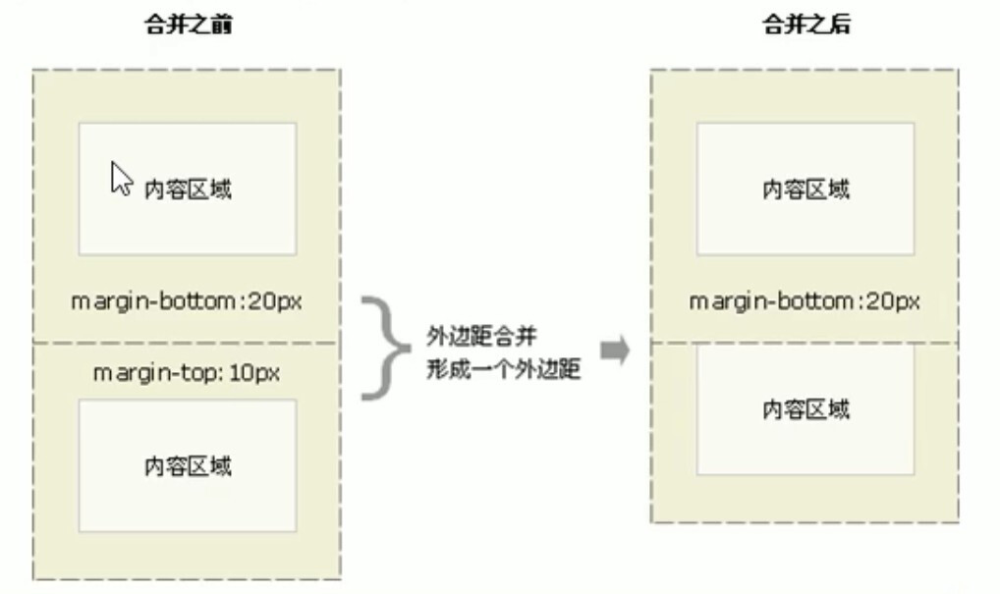

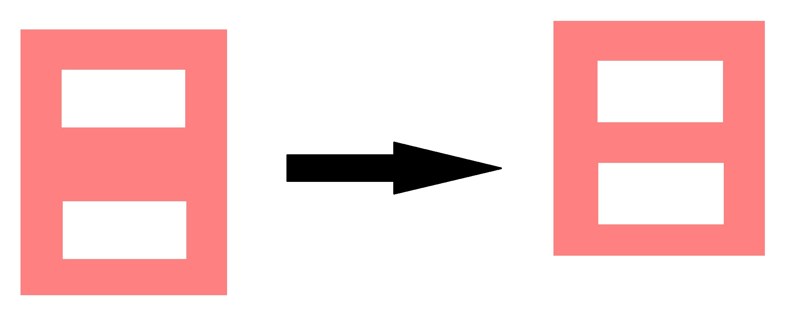

**解决方案：**

尽量只给一个盒子添加 `margin` 值。

特殊情况：

- 如果相邻的外边距一正一负，则取两者的和

- 如果相邻的外边距都是负值，则取两者中绝对值较大的

> 在网页布局中，通过谷歌浏览器或火狐浏览器预览时，发现我们定义的盒模型width，height，margin，padding 值都是不准确的
>
> 谷歌、火狐浏览器 缩放为80% 时，margin值才正确[[2\]](#fn2)

**总结**

兄弟元素之间的外边距的重叠，对于开发是有利的，所以我们不需要进行处理

#### 父子元素

对于两个嵌套关系（父子关系）的块元素，当子元素有上外边距，此时父元素会塌陷较大的外边距值（**外边距效果显示在父元素之上**）。

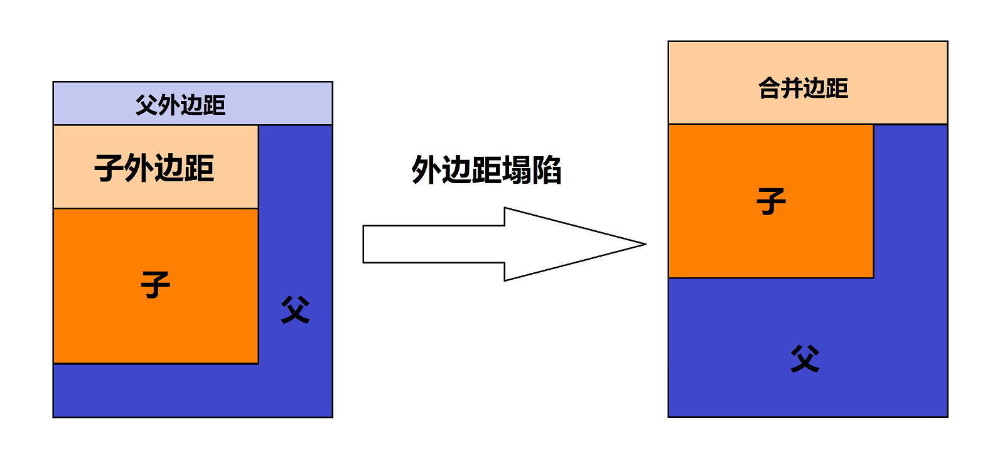

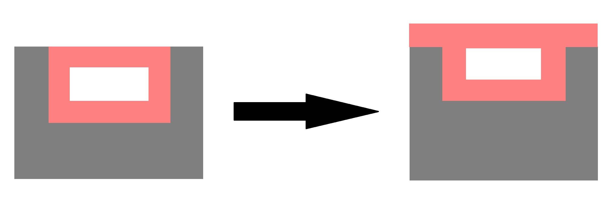

父子外边距的折叠会影响到页面的布局，必须要进行处理

**解决方案：**

- 可以为父元素定义上边框（比如：可以给一个透明 transparent 、rebeccapurple 边框）`border-top: 1px rebeccapurple solid;`,然后调整父元素的高度

```css
.box3 {
    width: 200px;
    height: 199px;
    background-color: #bfa;
    border-top: 1px #bfa solid; 
}

.box4 {
    width: 100px;
    height: 100px;
    background-color: orange;
    margin-top: 99px; /* margin-top: 100px; */
}
```


- 可以为父元素定义上内边距，然后调整父元素的高度

```css
.box3 {
    width: 200px;
    height: 100px; /* height: 200px; */
    background-color: #bfa;
    padding-top: 100px; 
}

.box4 {
    width: 100px;
    height: 100px;
    background-color: orange;
}
```

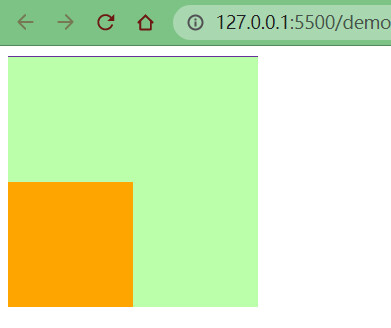

- 可以为父元素添加 `overflow: hidden`

还有其他方法，比如浮动、固定，绝对定位的盒子不会有塌陷问题，后面咱们再总结。

## 12.7行内元素的盒模型

- 行内元素不支持设置宽度和高度

```css
.s1 {
    /* 行内元素设置了宽高也没用，不会生效 */
    width: 100px;
    height: 100px;
    background-color: yellow;
}
```

- 行内元素可以设置`padding`，但是垂直方向`padding`不会影响页面的布局

```css
.s1 {
    /* 下方的div元素并没有因span设置了padding属性，而受到位置上的影响 */
    padding: 100px;
    background-color: yellow;
}

.box1 {
    width: 200px;
    height: 200px;
    background-color: #bfa;
}
```


- 行内元素可以设置`border`，垂直方向的`border`不会影响页面的布局

```css
.s1 {
    border: 10px orange solid;
    background-color: yellow;
}

.box1 {
    width: 200px;
    height: 200px;
    background-color: #bfa;
}
```

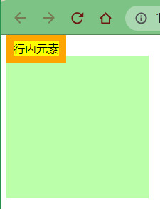

- 行内元素可以设置`margin`，垂直方向的`margin`不会影响页面的布局

```css
.s1 {
    margin: 100px;
    background-color: yellow;
}

.box1 {
    width: 200px;
    height: 200px;
    background-color: #bfa;
}
```

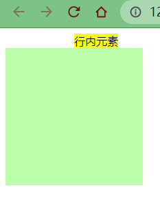

`display`用来设置元素显示的类型

- `inline`将元素设置为行内元素

- `block`将元素设置为块元素

```css
.s1 {
    margin: 100px;
    background-color: yellow;
    /* 将行内元素设置为块元素 */
    display: block; 
}
```

- `inline-block` 将元素设置为行内块元素行内块，既可以设置宽度和高度又不会独占一行

```css
.s1 {
    margin: 100px;
    background-color: yellow;
    /* 将行内元素设置为行内块元素，兼顾行内元素和块元素的特点 */
    display: inline-block; 
}
```

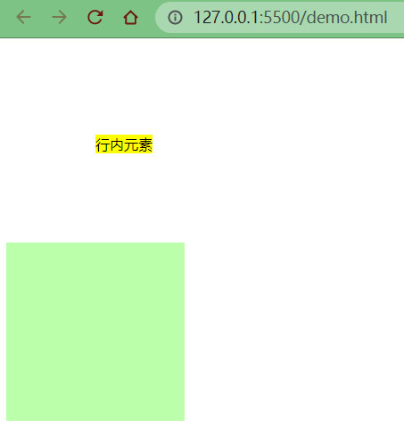

`visibility`用来设置元素的显示状态

- `visible`默认值，元素在页面中正常显示

- `hidden`元素在页面中隐藏不显示，但是依然占据页面的位置

## 12.8浏览器的默认样式

通常情况，浏览器都会为元素设置一些默认样式

默认样式的存在会影响到页面的布局，通常情况下编写网页时必须要去除浏览器的默认样式（PC端的页面）

> 在当今网页设计/开发实践中，使用CSS来为语义化的(X)HTML标记添加样式风格是重要的关键。
>
> 在设计师们的梦想中都存在着这样的一个完美世界：所有的浏览器都能够理解和适用多有CSS规则，并且呈现相同的视觉效果(没有兼容性问题)。
>
> 但是，我们并没有生活在这个完美的世界，现实中发生的失窃却总是恰恰相反，很多CSS样式在不同的浏览器中有着不同的解释和呈现。
>
> 当今流行的浏览器(如:Firefox、Opera、Internet Explorer、Chrome、Safari等等)中，有一些都是以自己的方式去理解CSS规范，这就会导致有的浏览器对CSS的解释与设计师的CSS定义初衷相冲突，使得网页的样子在某些浏览器下能正确按照设计师的想法显示
>
> 而且有些浏览器却并没有按照设计师想要的样子显示出来，这就导致浏览器的兼容性问题。
>
> 更糟的是，有的浏览器完全无视CSS的一些声明和属性。[[5\]](#fn5)

我们可以尝试编写css样式，以去除浏览器的默认样式

```css
* {
    margin: 0;
    padding: 0;
    list-style: none;
}
```

> 正因为上述冲突和问题依然存在于这个”不完美的世界”，所以一些设计师想到了一种避免浏览器兼容性问题的方法，那就是CSS Reset
>
> 什么是CSS Reset？
>
> 我们可以把它叫做CSS重设，也有人叫做CSS复位、默认CSS、CSS重置等
>
> CSS重设就是先定义好一些CSS样式，来让所有浏览器都按照同样的规则解释CSS，这样就能避免发生这种问题。[[](#fn5)

### reset样式

官方地址：[reset.css](https://meyerweb.com/eric/tools/css/reset/)

```html
<link rel="stylesheet" href="assets/reset.css">
```

### normalize样式

官方地址：[normalize.css](https://necolas.github.io/normalize.css/8.0.1/normalize.css)

```html
<link rel="stylesheet" href="assets/normalize.css">
```

## 12.9参考资料

1CSS盒子模型：`https://baike.baidu.com/item/CSS盒子模型/9814562?fr=aladdin`

2谷歌、火狐浏览器 缩放为80% 时，margin值才正确：<https://www.cnblogs.com/taohuaya/p/7642742.html>

3margin (子元素远离父元素边框)：<https://www.cnblogs.com/FlFtFw/p/9627026.html>

4目前比较全的CSS重设(reset)方法总结：<https://www.cnblogs.com/hnyei/archive/2011/10/04/2198779.html>

# 13.盒模型(下)

## 13.1盒子大小

CSS3 中可以通过 box-sizing 来指定盒模型，有 2 个值：即可指定为 content-box、border-box，这样我们计算盒子大小的方式就发生了改变。

可以分成两种情况：

1. box-sizing: content-box 盒子大小为 width + padding + border （以前默认的）
2. box-sizing: border-box 盒子大小为 width

如果盒子模型我们改为了 box-sizing: border-box， 那 padding 和 border 就不会撑大盒子了（前提 padding 和 border 不会超过 width 宽度）

默认情况下，盒子可见框的大小由内容区、内边距和边框共同决定

`box-sizing`用来设置盒子尺寸的计算方式（设置width和height的作用）

```css
.box {
    width: 200px;
    height: 200px;
    background-color: yellow;
    border: 10px red solid;
    /* box-sizing: content-box; */
    box-sizing: border-box;
}
```

可选值：

- `content-box`默认值，宽度和高度用来设置内容区的大小
   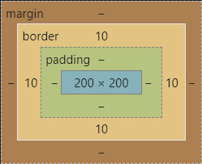

- `border-box` 宽度和高度用来设置整个盒子可见框的大小
   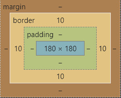

`width`和`height`指的是内容区、内边距和边框的总大小

## 13.2轮廓

`outline`用来设置元素的轮廓线，用法和`border`一模一样

轮廓和边框不同点是，轮廓不会影响到可见框的大小

```css
.box {
    width: 200px;
    height: 200px;
    background-color: yellow;
    outline: 10px red solid;
}
```

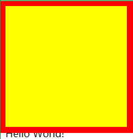

可以很明显看到`outline`与`border`的区别

我们一般不会直接这么设置轮廓，而是下面这种场景

```css
.box:hover {
    outline: 10px red solid;
}
```


从上面的动态图也可以很清晰地看出，`outline`属性并没有改变盒子的布局

## 13.3盒子阴影

CSS 3 新增了盒子阴影。

`box-shadow`用来设置元素的阴影效果，阴影不会影响页面布局。

语法：

```css
box-shadow: h-shadow v-shadow blur spread color inset;
```

| 值         | 描述                                                         |
| ---------- | ------------------------------------------------------------ |
| `h-shadow` | 必须。水平阴影的位置，允许负值。                             |
| `v-shadow` | 必须。垂直阴影的位置，允许负值。                             |
| `blur`     | 可选。阴影的模糊半径（虚实程度）。                           |
| `spread`   | 可选。阴影的尺寸（大小）。                                   |
| `color`    | 可选。阴影的颜色，请参阅 CSS 颜色值（阴影多为半透明颜色）。  |
| `inset`    | 可选。将外部阴影（outset）改为内部阴影（outset 不能指定，默认为空即可）。 |

```html
<head>
    <meta charset="UTF-8">
    <meta name="viewport" content="width=device-width, initial-scale=1.0">
    <meta http-equiv="X-UA-Compatible" content="ie=edge">
    <title>盒子阴影</title>
    <style>
        div {
            width: 200px;
            height: 200px;
            background-color: salmon;
            margin: 100px auto;
            /* box-shadow: 10px 10px; */
        }

        /* 伪类不仅仅可以用于 a 链接，还能用于其他标签 */
        /* 原先盒子没有影子,当我们鼠标经过盒子就添加阴影效果 */
        div:hover {
            box-shadow: 10px 10px 10px -4px rgba(0, 0, 0, .3);
        }
    </style>
</head>

<body>
    <div></div>
</body>

```

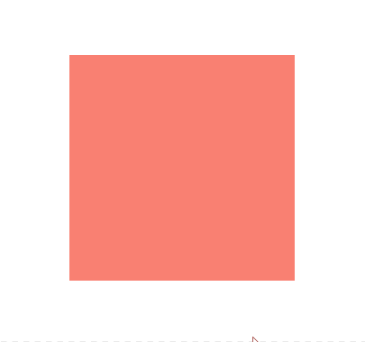

**三边阴影、双边阴影、单边阴影的设置方法：**

```html
<!doctype html>
<html lang="en">

<head>
    <meta charset="UTF-8">
    <meta http-equiv="X-UA-Compatible" content="IE=edge">
    <meta name="viewport" content="width=device-width, initial-scale=1.0">
    <title>盒子阴影 三边阴影、双边阴影、单边阴影</title>
    <style>
        div {
            width: 100px;
            height: 100px;
            background-color: #000;
            margin: 25px auto;
            color: white;
        }

        .a {
            box-shadow: 0 0 25px 5px red;
        }

        /* 三边阴影就是直接把整个阴影部分往下边移 */
        .b {
            box-shadow: 0 6px 10px 0 red;
        }

        /* 两边阴影要用盒子嵌套来解决 */
        .c1 {
            box-shadow: 0 10px 10px -5px red;
        }

        .c2 {
            width: 100%;
            box-shadow: 0 -10px 10px -5px red;
        }

        /* 单边阴影就是直接把整个阴影部分往下边移，并且减小阴影大小 */
        .d {
            box-shadow: 0 10px 10px -5px red;
        }
    </style>
</head>

<body>
    <div class="a">四边阴影</div>
    <div class="b">三边阴影</div>
    <div class="c1">
        <div class="c2">两边阴影</div>
    </div>
    <div class="d">一边阴影</div>
</body>

</html>
```

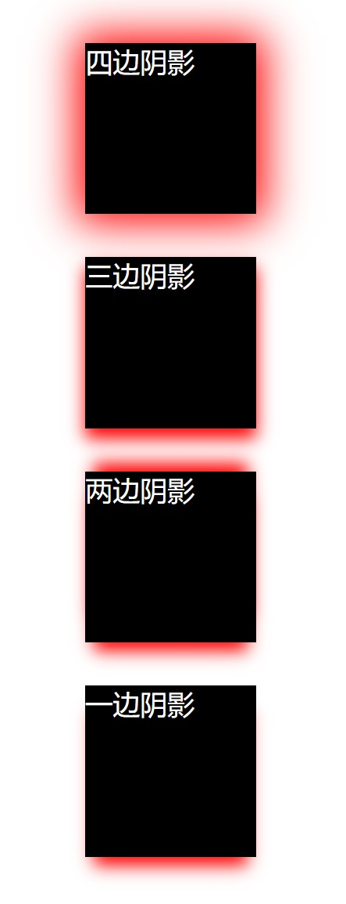

## 13.4圆角边框

CSS 3 新增了圆角边框样式。

border-radius 属性用于设置元素的外边框圆角。

语法：

```css
border-radius: length;
```

原理：

border-radius 顾名思义：边框半径。

（椭）圆与边框的交集形成圆角效果。

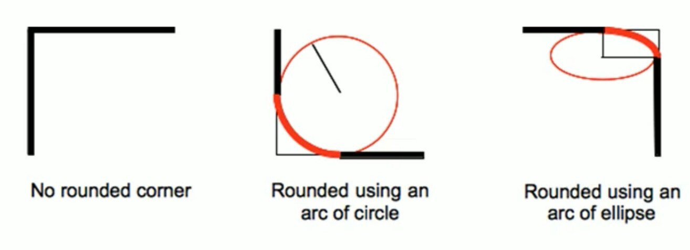

```html
<!doctype html>
<html lang="en">

<head>
    <meta charset="UTF-8">
    <meta name="viewport" content="width=device-width, initial-scale=1.0">
    <meta http-equiv="X-UA-Compatible" content="ie=edge">
    <title>圆角边框</title>
    <style>
        div {
            width: 300px;
            height: 150px;
            background-color: pink;
            border-radius: 24px;
        }
    </style>
</head>

<body>
    <div></div>
</body>

</html>
```

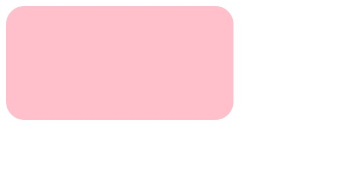

注意：

- 参数值可以为数值或百分比的形式
- 如果是正方形，想要设置为圆形，那么只需要把数值修改为高度或者宽度的一半即可，或者直接写为 50%
- 如果是个矩形，设置为高度的一半就可以做 “胶囊” 效果了
- 该属性是一个简写属性，可以跟多个值
  - 四个值：左上角、右上角、右下角、左下角（从左上开始顺时针）
  - 三个值：左上、右上+左下、右下（对角为一组）
  - 两个值：左上+右下、右上+左下（对角为一组）
- 同时可以对特定角单独设置
  - 左上角：`border-top-left-radius`
  - 右上角：`border-top-right-radius`
  - 右下角：`border-bottom-right-radius`
  - 左下角：`border-bottom-left-radius`

## 13.5 CSS3其他特性（了解）

1. 图片变模糊
2. 计算盒子宽度 width:calc 函数

```html
<!doctype html>
<html lang="en">
<head>
    <meta charset="UTF-8">
    <meta name="viewport" content="width=device-width, initial-scale=1.0">
    <meta http-equiv="X-UA-Compatible" content="ie=edge">
    <title>图片模糊处理filter</title>
    <style>
        img {
            /* blur 是一个函数 小括号里面数值越大，图片越模糊 注意数值要加 px 单位 */
            filter: blur(15px);
        }

        img:hover {
            filter: blur(0);
        }
    </style>
</head>
<body>

</body>
</html>
```

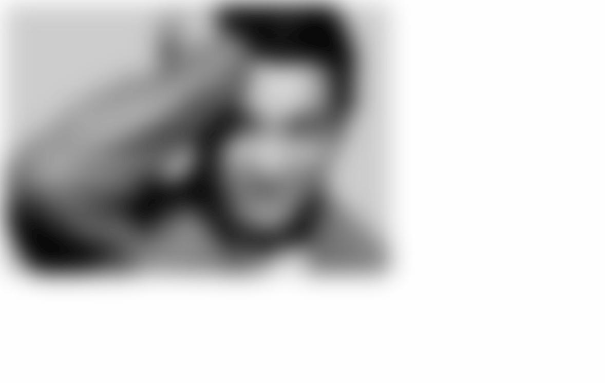

```html
<!doctype html>
<html lang="en">
<head>
    <meta charset="UTF-8">
    <meta name="viewport" content="width=device-width, initial-scale=1.0">
    <meta http-equiv="X-UA-Compatible" content="ie=edge">
    <title>CSS3属性calc函数</title>
    <style>
        .father {
            width: 500px;
            height: 500px;
            background-color: black;
        }

        .son {
            /* width: 300px; */
            /* width: calc(500px - 100px); */
            width: calc(100% - 100px);
            height: 200px;
            background-color: salmon;
        }
    </style>
</head>
<body>
<!-- 需求：我们的子盒子宽度永远比父盒子小 100 像素 -->
<div class="father">
    <div class="son"></div>
</div>
</body>
</html>
```


### 13.5.1 CSS3滤镜 filter

filter CSS 属性将模糊或颜色偏移等图形效果应用于元素。

```css
filter: 函数(); 例如：filter: blur(5px); blur 模糊处理，数值越大越模糊
```

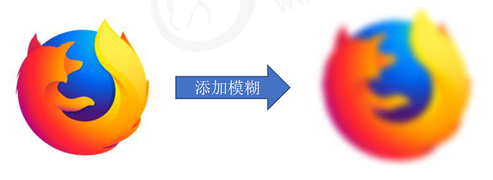

### 13.5.2 CSS3 calc 函数

calc() 此 CSS 函数让你在声明 CSS 属性值时执行一些计算。

```css
width: calc(100% - 80px);
```

括号里面可以使用 `+` `-` `*` `/` 来进行计算。
