---
# 当前页面内容标题
title: 浮动 常见网页布局
# 当前页面图标
icon: html
# 分类
category:
  - HTML
  - CSS
# 标签
tag:
  - HTML
sticky: false
# 是否收藏在博客主题的文章列表中，当填入数字时，数字越大，排名越靠前。
star: false
# 是否将该文章添加至文章列表中
article: true
# 是否将该文章添加至时间线中
timeline: true
---

# 14.浮动

## 14.1传统网页布局的三种方式

网页布局的本质：用 CSS 来摆放盒子，把盒子摆放到相应位置。

CSS 提供了三种传统布局方式（简单说就是盒子如何进行排列）。

- 普通流（标准流）
- 浮动
- 定位

> 这里指的只是传统布局，其实还有一些特殊高级的布局方式。

## 14.2标准流（普通流/文档流）

所谓的标准流：就是标签按照规定好的默认方式排列。

1. **块级元素会独占一行，从上向下顺序排列。**
2. **行内元素会按照顺序，从左到右顺序排列，碰到父元素边缘则自动换行。**

以上都是标准流布局，我们前面学习的就是标准流，标准流是最基本的布局方式。

这三种布局方式都是用来摆放盒子的，盒子摆放到合适位置，布局自然就完成了。

**注意：**实际开发中，一个页面基本都包含了这三种布局方式（后面移动端学习新的布局方式） 。

## 14.3为什么需要浮动？

提问：我们用标准流能很方便的实现如下效果吗？

1. **如何让多个块级盒子（div）水平排列成一行？**


比较难，虽然转换为行内块元素可以实现一行显示，但是他们之间会有大的**空白缝隙**，很难控制。

```html
<head>
    <title>行内块中间有缝隙</title>
    <style>
        div {
            width: 150px;
            height: 200px;
            background-color: #d87093;
            display: inline-block;
        }
    </style>
</head>

<body>
    <div>1</div>
    <div>2</div>
    <div>3</div>
</body>
```

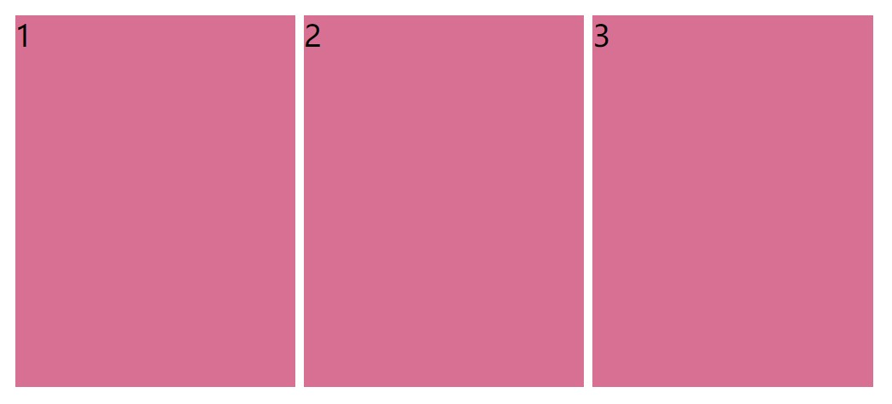

2. **如何实现两个盒子的左右对齐？**


总结： 有很多的布局效果，标准流没有办法完成，此时就可以利用浮动完成布局。 因为浮动可以改变元素标签默认的排列方式。

**浮动最典型的应用：可以让多个块级元素一行内排列显示。**

**网页布局第一准则：多个块级元素纵向排列找标准流，多个块级元素横向排列找浮动！**

```html
<head>
    <style>
        div {
            float: left;
            width: 150px;
            height: 200px;
            background-color: #d87093;
        }
    </style>
</head>

<body>
    <div>1</div>
    <div>2</div>
    <div>3</div>
</body>
```

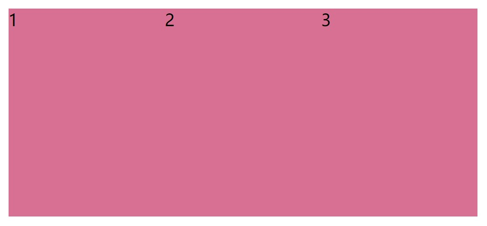

**拓展：**浮动的盒子不会发生外边距合并！

## 14.4什么是浮动？

通过浮动可以使一个元素向其父元素的左侧或右侧移动

注意

- 元素设置浮动以后，水平布局的等式便不需要强制成立

- 元素设置浮动以后，会完全从文档流中脱离，不再占用文档流的位置，所以元素下边的还在文档流中的元素会自动向上移动

语法：

```css
选择器 { float: 属性值;}
```

| 属性  | 描述                 |
| ----- | -------------------- |
| none  | 元素不浮动（默认值） |
| left  | 元素向左浮动         |
| right | 元素向右浮动         |

```html
<!doctype html>
<html lang="en">

<head>
    <meta charset="UTF-8">
    <meta name="viewport" content="width=device-width, initial-scale=1.0">
    <meta http-equiv="X-UA-Compatible" content="ie=edge">
    <title>什么是浮动</title>
    <style>
        .left,
        .right {
            float: left;
            width: 200px;
            height: 200px;
            background-color: pink;
        }
    </style>
</head>

<body>
    <div class="left">左青龙</div>
    <div class="right">右白虎</div>
</body>

</html>
```


```html
<!doctype html>
<html lang="en">

<head>
    <meta charset="UTF-8">
    <meta name="viewport" content="width=device-width, initial-scale=1.0">
    <meta http-equiv="X-UA-Compatible" content="ie=edge">
    <title>什么是浮动</title>
    <style>
        .left,
        .right {
            float: left;
            width: 200px;
            height: 200px;
            background-color: pink;
        }

        /* 层叠性 */
        .right {
            float: right;
        }
    </style>
</head>

<body>
    <div class="left">左青龙</div>
    <div class="right">右白虎</div>
</body>

</html>
```


## 14.5浮动的特点

1. 浮动元素会脱离标准流（脱标），不再占据文档流中的位置

- 脱离标准普通流的控制（浮） 移动到指定位置（动），（俗称脱标）
- 浮动的盒子不再保留原先的位置

 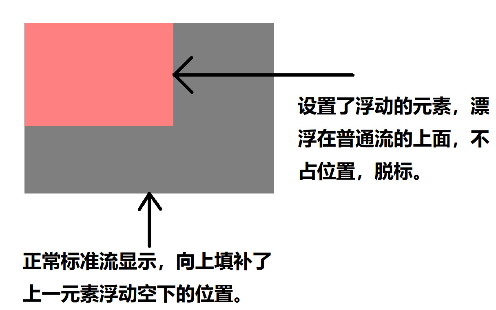

 ```html
 <!doctype html>
 <html lang="en">
 
 <head>
     <meta charset="UTF-8">
     <meta name="viewport" content="width=device-width, initial-scale=1.0">
     <meta http-equiv="X-UA-Compatible" content="ie=edge">
     <title>浮动特性1</title>
     <style>
         /* 设置了浮动（float）的元素会：
         1.脱离标准普通流的控制（浮）移动到指定位置（动）。
         2.浮动的盒子不再保留原先的位置 */
         .box1 {
             float: left;
             width: 200px;
             height: 200px;
             background-color: pink;
         }
 
         .box2 {
             width: 300px;
             height: 300px;
             background-color: gray;
         }
     </style>
 </head>
 
 <body>
     <div class="box1">浮动的盒子</div>
     <div class="box2">标准流的盒子</div>
 </body>
 
 </html>
 ```

 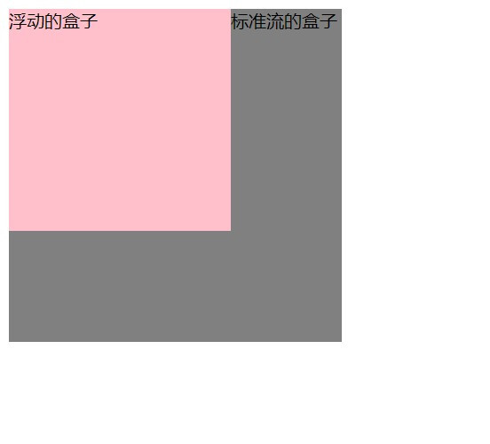

2. 设置浮动以后，元素会向父元素的左侧或右侧移动

3. 浮动元素默认不会从父元素中移出

```html
<style>
    .box1 {
        width: 100px;
        height: 100px;
        background-color: orange;
        float: left;
    }

    .box2 {
        width: 200px;
        height: 200px;
        background-color: red;
    }
</style>

<div class="box1"></div>
<div class="box2"></div>
```

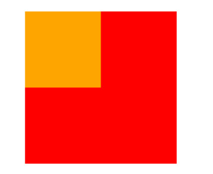

4. 浮动元素向左或向右移动时，不会超过前边的浮动元素（先来后到的顺序）

```html
<style>
    .box1 {
        width: 200px;
        height: 200px;
        background-color: orange;
        float: left;
    }

    .box2 {
        width: 200px;
        height: 200px;
        background-color: red;
        float: left;
    }

    .box3 {
        width: 200px;
        height: 200px;
        background-color: yellow;
        float: left;
    }
</style>

<div class="box1"></div>
<div class="box2"></div>
<div class="box3"></div>
```

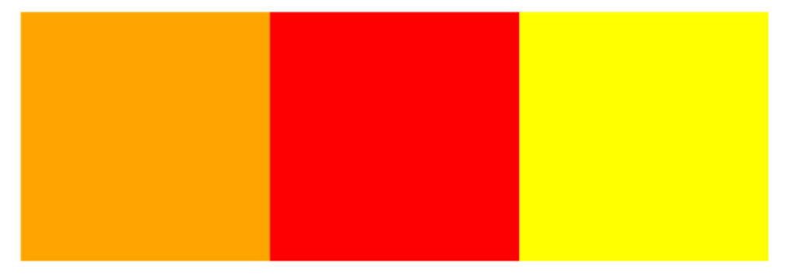

5. 浮动元素不会超过上边的浮动的兄弟元素，最多就是和它一样高

```html
<style>
    .box1 {
        width: 300px;
        height: 300px;
        background-color: orange;
        float: left;
    }

    .box2 {
        width: 400px;
        height: 400px;
        background-color: red;
        float: left;
    }

    .box3 {
        width: 300px;
        height: 300px;
        background-color: yellow;
        float: right;
    }
</style>

<div class="box1"></div>
<div class="box2"></div>
<div class="box3"></div>
```


6. 如果浮动元素的上边是一个没有浮动的块元素，则浮动元素无法上移

```html
<style>
    .box1 {
        width: 200px;
        height: 200px;
        background-color: orange;
    }

    .box2 {
        width: 200px;
        height: 200px;
        background-color: red;
        float: left;
    }
</style>

<div class="box1"></div>
<div class="box2"></div>
```

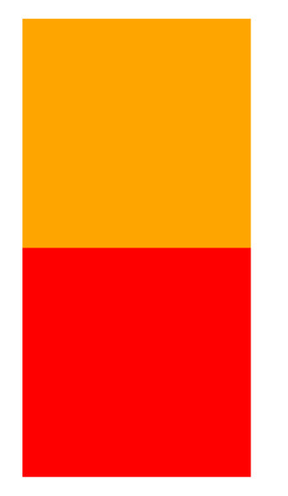

7. 浮动元素不会盖住文字，文字会自动环绕在浮动元素的周围，所以我们可以利用浮动来设置文字环绕图片的效果
   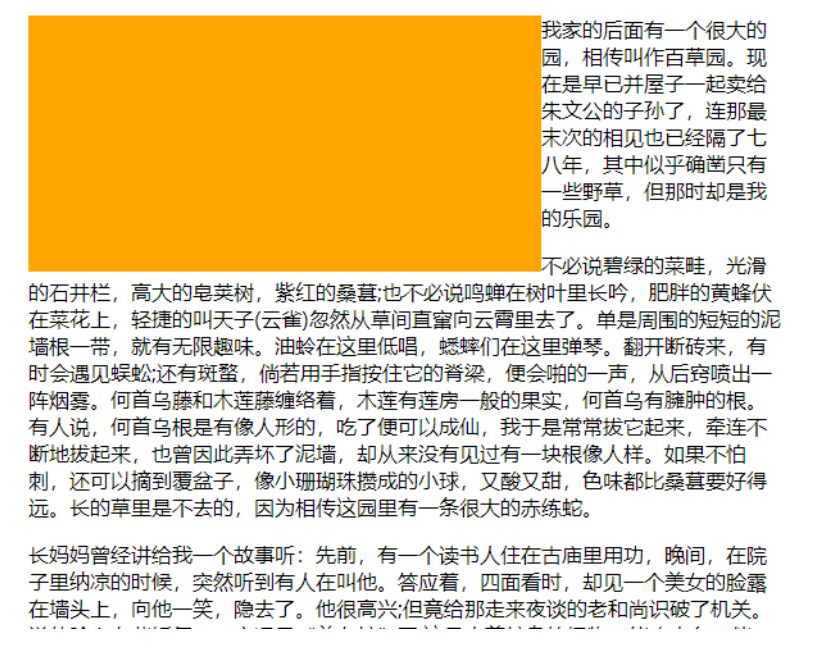

8. 浮动的元素会一行内显示并且元素顶部对齐

- 如果多个盒子都设置了浮动，则它们会按照属性值一行内显示并且顶端对齐排列。
- 浮动的元素是互相贴靠在一起的（不会有缝隙），如果父级宽度装不下这些浮动的盒子，多出的盒子会另起一行对齐。

```html
<!doctype html>
<html lang="en">

<head>
    <meta charset="UTF-8">
    <meta name="viewport" content="width=device-width, initial-scale=1.0">
    <meta http-equiv="X-UA-Compatible" content="ie=edge">
    <title>浮动元素特性-浮动元素一行显示</title>
    <style>
        div {
            float: left;
            width: 200px;
            height: 200px;
            background-color: pink;
        }

        .two {
            background-color: skyblue;
            height: 249px;
        }

        .four {
            background-color: skyblue;
        }
    </style>
</head>

<body>
    <div>1</div>
    <div class="two">2</div>
    <div>3</div>
    <div class="four">4</div>
</body>

</html>
```


9. 浮动的元素会具有行内块元素的特性

任何元素都可以浮动。不管原先是什么模式的元素，添加浮动之后具有行内块元素相似的特性。

- 块级盒子：没有设置宽度时默认宽度和父级一样宽，但是添加浮动后，它的大小根据内容来决定
- 行内盒子：宽度默认和内容一样宽，直接设置高宽无效，但是添加浮动后，它的大小可以直接设置
- 浮动的盒子中间是没有缝隙的，是紧挨着一起的
- **即：默认宽度由内容决定，同时支持指定高宽，盒子之间无空隙**

```html
<!doctype html>
<html lang="en">

<head>
    <meta charset="UTF-8">
    <meta name="viewport" content="width=device-width, initial-scale=1.0">
    <meta http-equiv="X-UA-Compatible" content="ie=edge">
    <title>浮动的元素具有行内块元素特点</title>
    <style>
        /* 任何元素都可以浮动。不管原先是什么模式的元素，添加浮动之后具有行内块元素相似的特性。 */
        span,
        div {
            float: left;
            width: 200px;
            height: 100px;
            background-color: pink;
        }

        /* 如果行内元素有了浮动，则不需要转换块级\行内块元素就可以直接给高度和宽度 */
        p {
            float: right;
            height: 200px;
            background-color: skyblue;
        }
    </style>
</head>

<body>
    <span>span1</span>
    <span>span2</span>

    <div>div</div>
    <p>pppppppppppppp</p>
</body>

</html>
```


注意：之所以顶部没有对齐，原因是 p 标签自带的外边距 > span div 自带的外边距。

```html
<!doctype html>
<html lang="en">

<head>
    <meta charset="UTF-8">
    <meta name="viewport" content="width=device-width, initial-scale=1.0">
    <meta http-equiv="X-UA-Compatible" content="ie=edge">
    <title>浮动的元素具有行内块元素特点</title>
    <style>
        * {
            margin: 0px;
        }

        /* 任何元素都可以浮动。不管原先是什么模式的元素，添加浮动之后具有行内块元素相似的特性。 */
        span,
        div {
            float: left;
            width: 200px;
            height: 100px;
            background-color: pink;
        }

        /* 如果行内元素有了浮动,则不需要转换块级\行内块元素就可以直接给高度和宽度 */
        p {
            float: right;
            height: 200px;
            background-color: skyblue;
        }
    </style>
</head>

<body>
    <span>span1</span>
    <span>span2</span>

    <div>div</div>
    <p>pppppppppppppp</p>
</body>

</html>
```


简单总结：

- 浮动目前来讲它的主要作用就是让页面中的元素可以水平排列，通过浮动可以制作一些水平方向的布局

- 元素设置浮动以后，将会从文档流中脱离，从文档流中脱离后，元素的一些特点也会发生变化

## 14.6脱离文档流的特点

块元素：

- 块元素不再独占页面的一行

- 脱离文档流以后，块元素的宽度和高度默认都被内容撑开

```html
<style>
    .box1 {
        background-color: orange;
        /* float: left; */
    }
</style>

<div class="box1">hello</div>
```


行内元素：

- 行内元素脱离文档流以后会，特点和块元素一样

```html
<style>
    span {
        width: 200px;
        height: 200px;
        background-color: orange;
        float: left;
    }
</style>

<span>I am a Span</span>
```


脱离文档流之后的特点很像行内块元素，不过存在一些差异

```html
<style>
    span {
        width: 200px;
        height: 200px;
        background-color: orange;
        /* display: inline-block; */
        float: left;
    }
</style>

<span>I am a Span</span>
<span>I am a Span</span>
```


# 15.常见网页布局

## 15.1页面布局分析

**为了提高网页制作的效率，布局时通常有以下的布局流程：**

1. 必须确定页面的版心（可视区），我们测量可得知

2. 分析页面中的行模块，以及每个行模块中的列模块。其实页面布局，就是一行行罗列而成的

3. 制作 `HTML` 结构。我们还是遵循，先有结构，后有样式的原则。结构永远最重要

4. 开始运用盒子模型的原理，通过 `div` + `CSS` 布局来控制网页的各个模块

## 15.2初识常见网页布局

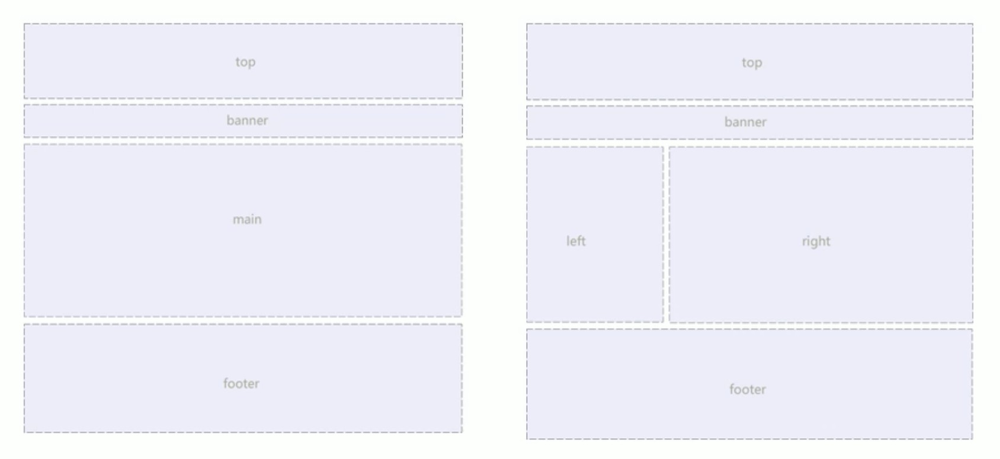

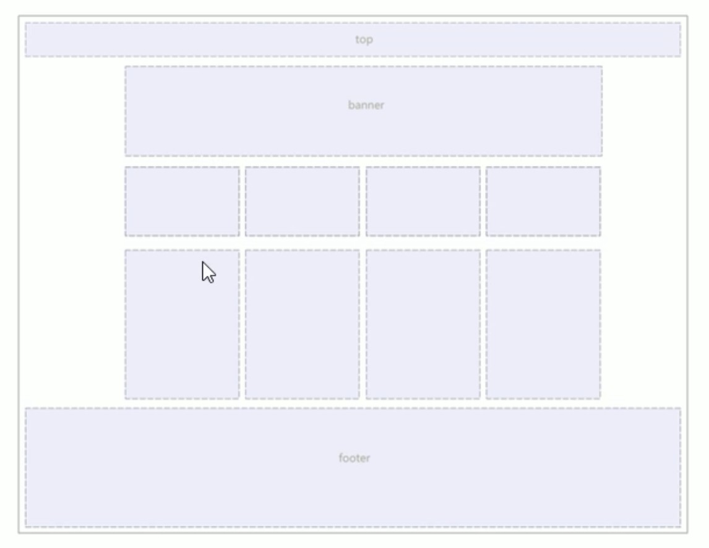

```html
<!doctype html>
<html lang="en">

<head>
    <meta charset="UTF-8">
    <meta name="viewport" content="width=device-width, initial-scale=1.0">
    <meta http-equiv="X-UA-Compatible" content="ie=edge">
    <title>常见网页布局</title>
    <style>
        * {
            margin: 0;
            padding: 0;
        }

        li {
            list-style: none;
        }

        .top {
            height: 50px;
            background-color: gray;
        }

        .banner {
            width: 980px;
            height: 150px;
            background-color: gray;
            margin: 10px auto;
        }

        .box {
            width: 980px;
            margin: 0 auto;
            height: 300px;
            background-color: pink;
        }

        .box li {
            float: left;
            width: 237px;
            height: 300px;
            background-color: gray;
            margin-right: 10px;
        }

        .box .last {
            margin-right: 0;
        }

        /* 只要是通栏的盒子（和浏览器一样宽）不需要指定宽度 */
        .footer {
            height: 200px;
            background-color: gray;
            margin-top: 10px;
        }
    </style>
</head>

<body>
    <div class="top">top</div>
    <div class="banner">banner</div>
    <div class="box">
        <ul>
            <li>1</li>
            <li>2</li>
            <li>3</li>
            <li class="last">4</li>
        </ul>
    </div>
    <div class="footer">footer</div>
</body>

</html>
```


## 15.3完整布局

**整体样式**

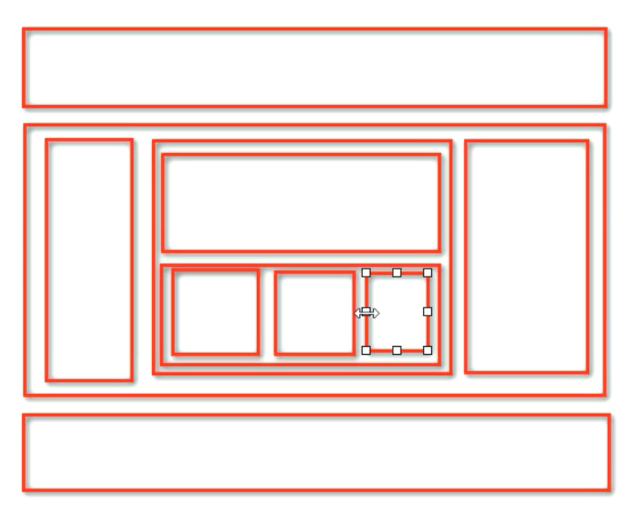

**目的**

1. 熟悉布局（块元素、浮动）

2. 公共css部分复用

3. 复习语义标签

**代码**

```html
<!-- 页眉 -->
<header></header>
<!-- 主体 -->
<main>
    <!-- 左边栏 -->
    <nav></nav>
    <!-- 中心 -->
    <article>
        <!-- 内容上 -->
        <div class="top"></div>
        <!-- 内容下 -->
        <div class="bottom">
            <!-- 内容左 -->
            <div class="left"></div>
            <!-- 内容中 -->
            <div class="middle"></div>
            <!-- 内容右 -->
            <div class="right"></div>
        </div>
    </article>
    <!-- 右边栏 -->
    <aside></aside>
</main>
<!-- 页脚 -->
<footer></footer>
```

**css代码**

```css
/* 公共部分 */
header,
main,
footer {
    width: 1000px;
    margin: 10px auto;
}

main nav,
main article,
main aside {
    float: left;
    /* 虽然设置浮动了，但整体大小是被内容撑开的，所以设置一个高度 */
    height: 100%;
}

.bottom .left,
.bottom .middle,
.bottom .right {
    float: left;
    width: 220px;
    height: 100%;
}

/* ==========整体布局-上========== */
header {
    height: 100px;
    background-color: silver;
}

/* ==========整体布局-中========== */
main {
    height: 400px;
    background-color: #bfa;
}


/* ------左边栏------ */
main nav {
    width: 150px;
    background-color: red;
}

/* ------中心------ */
main article {
    width: 680px;
    background-color: green;
    margin: 0 10px;
}

/* ---上--- */
article .top {
    height: 190px;
    background-color: yellow;
    margin-bottom: 10px;
}

/* ---下--- */
article .bottom {
    height: 200px;
    background-color: orange;
}


/* 左 */
.bottom .left {
    background-color: lightblue;
}

/* 中 */
.bottom .middle {
    background-color: gray;
    margin: 0 10px;
}

/* 右 */
.bottom .right {
    background-color: wheat;
}

/* ------右边栏------ */
main aside {
    width: 150px;
    background-color: blue;
}

/* ==========整体布局-下========== */
footer {
    height: 100px;
    background-color: tomato;
}
```

**效果**

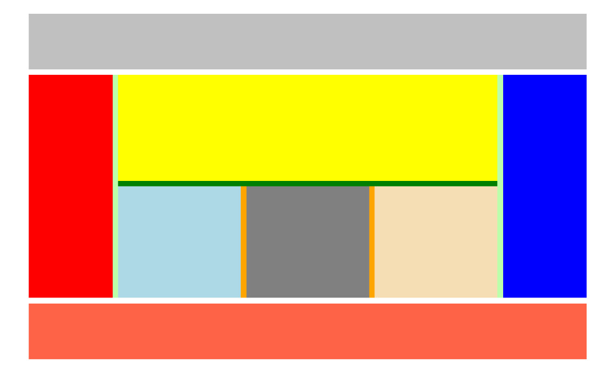
