---
# 当前页面内容标题
title: 定位
# 当前页面图标
icon: html
# 分类
category:
  - HTML
  - CSS
# 标签
tag:
  - HTML
sticky: false
# 是否收藏在博客主题的文章列表中，当填入数字时，数字越大，排名越靠前。
star: false
# 是否将该文章添加至文章列表中
article: true
# 是否将该文章添加至时间线中
timeline: true
---

# 17.定位

## 17.1为什么需要定位？

提问： 以下情况使用标准流或者浮动能实现吗？

1. 某个元素可以**自由**的在一个盒子内移动位置，并且压住其他盒子。

2. 当我们滚动窗口的时候，盒子是**固定**屏幕某个位置的。

以上效果，标准流或浮动都无法快速实现，此时需要定位来实现。

所以：

1. 浮动可以让多个块级盒子一行没有缝隙排列显示， 经常用于横向排列盒子。
2. 定位则是可以让盒子自由的在某个盒子内移动位置或者固定屏幕中某个位置，并且可以压住其他盒子。

## 17.2定位组成

定位：将盒子定在某一个位置，所以定位也是在摆放盒子， 按照定位的方式移动盒子。

`定位 = 定位模式 + 边偏移`

- 定位模式用于指定一个元素在文档中的定位方式
- 边偏移则决定了该元素的最终位置

**（1）定位模式**

定位模式决定元素的定位方式，它通过 CSS 的 `position` 属性来设置，其值可以分为四个。

| 值         | 语义     |
| ---------- | -------- |
| `static`   | 静态定位 |
| `relative` | 相对定位 |
| `absolute` | 绝对定位 |
| `fixed`    | 固定定位 |
| `sticky`   | 粘滞定位 |

**（2）边偏移**

边偏移就是定位的盒子移动的最终位置。有 `top`、`bottom`、`left` 和 `right` 4 个属性。

注意：可以为负值。

| 边偏移属性 | 实例           | 描述                                           |
| ---------- | -------------- | ---------------------------------------------- |
| `top`      | `top: 80px`    | 顶端偏移量，定位元素相对于其父元素上边线的距离 |
| `bottom`   | `bottom: 80px` | 底部偏移量，定位元素相对于其父元素下边线的距离 |
| `left`     | `left: 80px`   | 左侧偏移量，定位元素相对于其父元素左边线的距离 |
| `rigth`    | `right: 80px`  | 右侧偏移量，定位元素相对于其父元素右边线的距离 |

## 17.3相对定位

### 17.3.1基本使用

相对定位是元素在移动位置的时候**相对于它原来的位置**来说的定位。

语法：

```css
选择器 { position: relative; }
```

当元素开启相对定位以后，可以通过偏移量来设置元素的位置

| offset属性 | 含义                         |
| ---------- | ---------------------------- |
| `top`      | 定位元素和定位位置的上边距离 |
| `bottom`   | 定位元素和定位位置的下边距离 |
| `left`     | 定位元素和定位位置的左侧距离 |
| `right`    | 定位元素和定位位置的右侧距离 |

定位元素垂直方向的位置由`top`和`bottom`两个属性控制，通常情况下只会使用其中之一

- `top`值越大，定位元素越靠下

- `bottom`值越大，定位元素靠上

定位元素水平方向的位置由`left`和`right`两个属性控制，通常情况下只会使用其中之一

- `left`越大，定位元素越靠右

- `right`越大，定位元素越靠左

```html
<!doctype html>
<html lang="en">

<head>
    <meta charset="UTF-8">
    <meta name="viewport" content="width=device-width, initial-scale=1.0">
    <meta http-equiv="X-UA-Compatible" content="ie=edge">
    <title>相对定位</title>
    <style>
        .box1 {
            position: relative;
            top: 100px;
            left: 100px;
            width: 200px;
            height: 200px;
            background-color: pink;
        }

        .box2 {
            width: 200px;
            height: 200px;
            background-color: deeppink;
        }
    </style>
</head>

<body>
    <div class="box1">

    </div>
    <div class="box2">

    </div>

</body>

</html>
```


### 17.3.2相对定位的特点

**相对定位的特点：（务必记住）**

1. 当元素开启相对定位以后，如果不设置偏移量元素，则元素不会发生任何变化（这里注意，不仅仅是位置）

2. 相对定位是**参照于元素在文档流中的位置**进行定位的（可以理解为相对于自身原始位置）

3. 相对定位会**提升元素的层级**（表现为可以覆盖其他元素）

4. 相对定位**不会改变元素的性质**：块还是块，行内还是行内


**Q1：如果给上述三个div都设置相对定位，那么它们的层级关系会是什么样的呢？或者说谁会被谁覆盖呢？**

A：我们直接进行测试验证

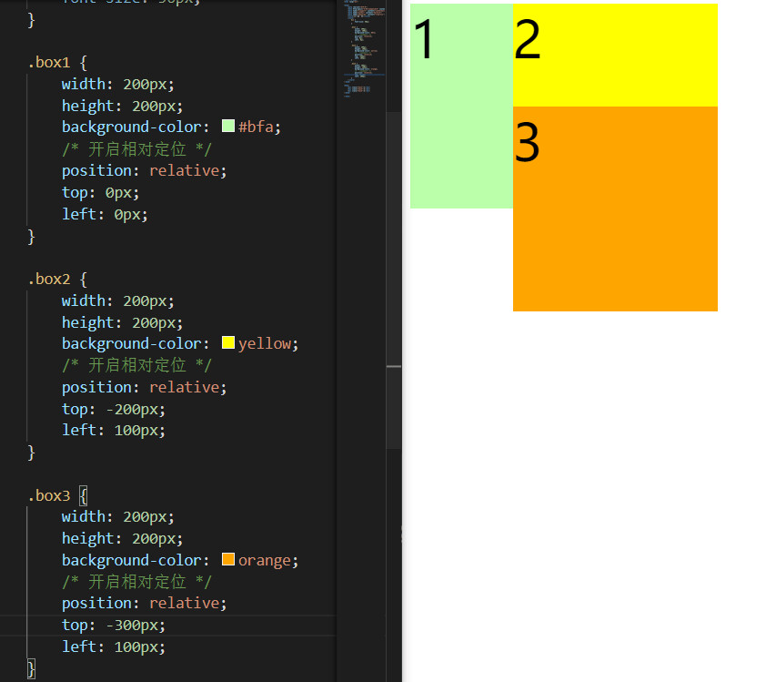

可以看到覆盖关系是：box3 >> box2 >> box1

可以大概猜测：在页面文档流中，越靠下的元素开启相对定位后，其层级越高（没有设置层级或层级`z-index`设置相同值时，优先显示靠下的元素）

**Q2：相对定位的第三个特点相对定位会提升元素的层级，是不是就类似于浮动一样脱离了文档流？**

A：我们可以对比下，浮动和相对定位的区别

- 参考系不同：浮动的参考系是其父元素；相对定位是相对于自身

- 可移动方向不同：浮动只能左右移动；相对定位是上下左右移动

- 影响不同：浮动会影响页面布局（包括下方元素位置影响和高度塌陷问题）；相对定位不对影响页面布局

- 性质不同：浮动会改变元素的性质（不再独占一行，其宽高都会被内容撑开）；相对定位不会改变元素的性质

- 文字环绕：浮动不会覆盖文字；相对定位可以覆盖文字（这个可以自行验证，不再赘述）

当然，浮动和相对定位也有其相似之处

- 浮动和相对定位都是移动位置

- 浮动和相对定位不会从父元素中移出

可以看出，浮动和相对定位的区别是更多的

最后回答一点：浮动脱离了文档流，不再占据页面位置；相对定位仍然占据页面位置

**Q3：相对定位的第四个特点相对定位不会改变元素的性质：块还是块，行内还是行内，但是上述例子中元素开启相对定位后好像就不再独占一行了，这个怎么理解？**

A：相比于浮动元素的特点，相对定位不会改变元素的性质其实是一个相对不容易理解的问题。其位置发生改变以后，布局并没有产生影响，因为它的结构仍然占据着原来的那个位置。只是其内容发生了移动。

**Q4：相对定位的第四个特点中块还是块，行内还是行内，意味着行内元素也可以使用相对定位是吗？**

A：是的

## 17.4绝对定位

绝对定位是元素在移动位置的时候**相对于它祖先元素**来说的定位（拼爹型）。

语法：

```css
选择器 { position: absolute; }
```

绝对定位的特点：（务必记住）

1. 开启绝对定位后，如果不设置偏移量，元素的位置不会发生变化

2. 绝对定位**不再占有原先的位置**（脱标），并且**脱标的程度大于浮动**（会压住浮动）

3. 绝对定位会**改变元素的性质**：行内变成块，块的宽高被内容撑开（与相对定位相反）

4. 绝对定位会**使元素提升一个层级**

5. 如果没有祖先元素或者祖先元素没有定位，则以浏览器为准定位（Document 文档）

6. 如果祖先元素有定位（相对、绝对、固定定位），则以**最近一级的有定位祖先元素为参考点**移动位置


## 17.5布局

### 17.5.1水平方向的布局

我们之前说过，水平方向的布局等式：

```css
margin-left + border-left + padding-left + width + padding-right + border-right + margin-right = 其父元素的宽度
```

当使用绝对定位时，需要添加`left`和`right`两个值（此时规则和之前一样，只是多添加了两个值）

```css
left + margin-left + border-left + padding-left + width + padding-right + border-right + margin-right + right = 其父元素的宽度
```

当发生过度约束时

- 如果9个值中没有`auto`，则自动调整`right`值以使等式满足（之前7个值是`margin-right`）

- 如果9个值中有`auto`，则自动调整`auto`的值以使等式满足

可设置`auto`的值：`margin-left`/`margin-right` /`width`/`left`/`right`

因为`left`和`right`的值默认是`auto`，所以如果没有设置`left`和`right`，当等式不满足时，则会自动调整这两个值

### 17.5.2水平居中

```html
<style>
    .box1 {
        width: 500px;
        height: 500px;
        background-color: #bfa;
        position: relative;
    }

    .box2 {
        width: 100px;
        height: 100px;
        background-color: orange;
        /* 左右外边距设置为auto */
        margin-left: auto;
        margin-right: auto;
        /* 绝对定位 */
        position: absolute;
        left: 0;
        right: 0;
    }
</style>

<div class="box1">
    <div class="box2"></div>
</div>
```

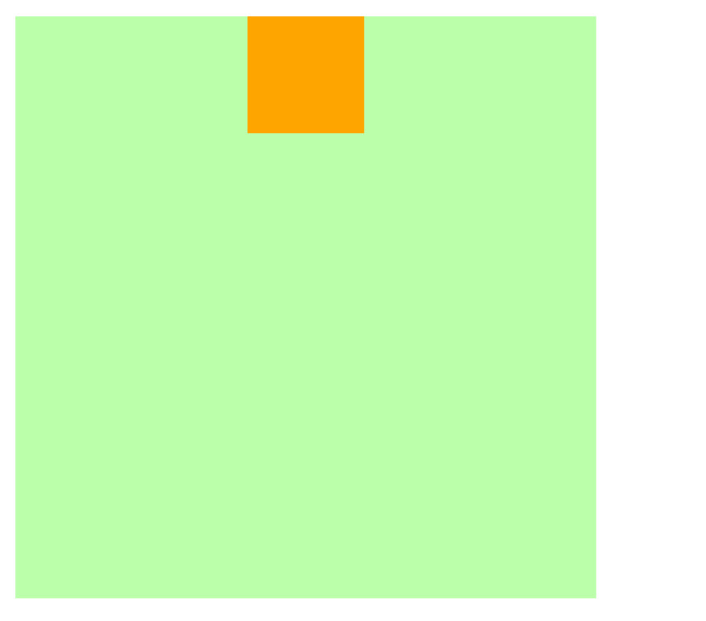

### 17.5.3垂直方向的布局

垂直方向布局的等式的也必须要满足

```css
top + margin-top + border-top + padding-top + height + padding-bottom + border-bottom + margin-bottom + top = 其父元素的高度
```

### 17.5.4垂直居中

```css
.box2 {
    width: 100px;
    height: 100px;
    background-color: orange;
    /* 左右外边距设置为auto */
    margin-top: auto;
    margin-bottom: auto;
    /* 绝对定位 */
    position: absolute;
    top: 0;
    bottom: 0;
}
```

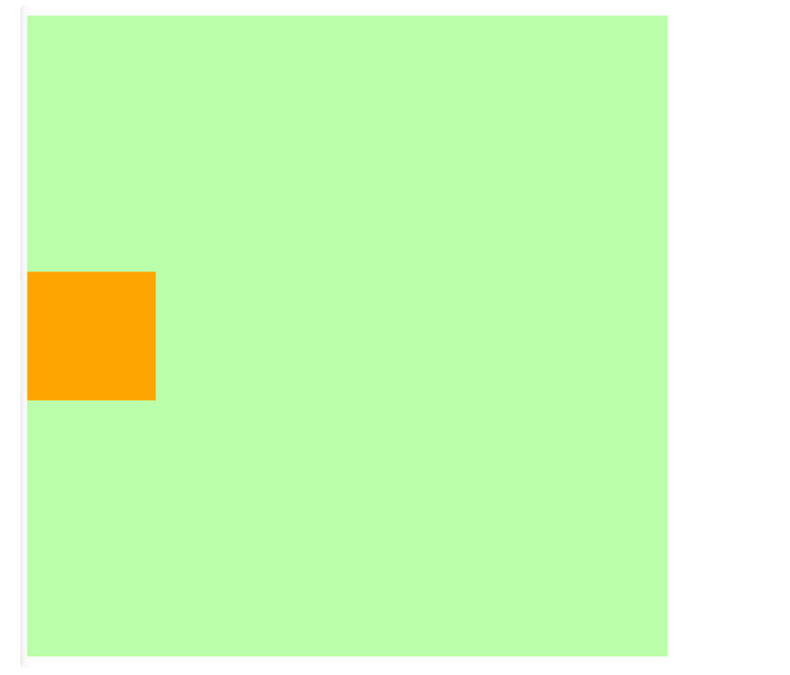

### 17.5.5水平垂直居中

目前，我们可以根据绝对定位进行元素的水平垂直双方向居中，所以这个方法只是其中之一

```css
.box2 {
    width: 100px;
    height: 100px;
    background-color: orange;
    /* 左右外边距设置为auto */
    margin: auto;
    /* 绝对定位 */
    position: absolute;
    top: 0;
    bottom: 0;
    left: 0;
    right: 0;
}
```

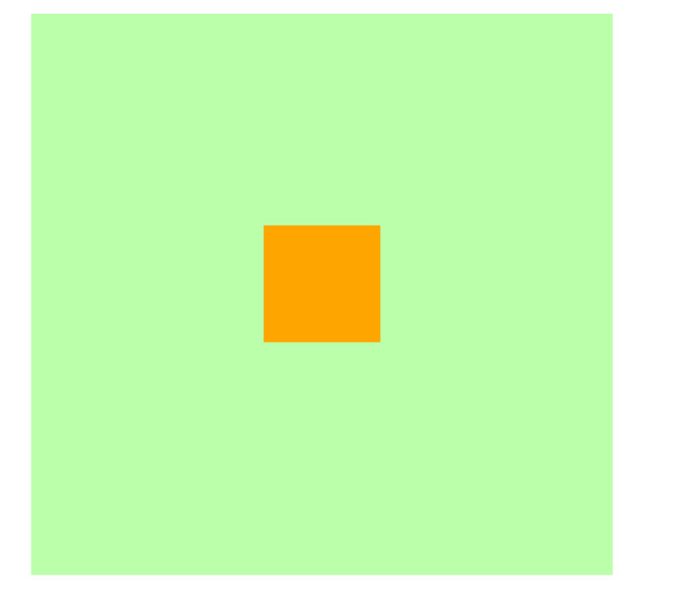

### 17.5.6小结

- 水平布局等式：`left + margin-left + border-left + padding-left + width + padding-right + border-right + margin-right + right = 其父元素的宽度`

- 垂直布局等式：`top + margin-top + border-top + padding-top + height + padding-bottom + border-bottom + margin-bottom + top = 其父元素的高度`

- 只是在没有`auto`时，会自动调整`top`/`bottom`/`left`/`right`

## 17.6子绝父相的由来

弄清楚这个口诀，就明白了绝对定位和相对定位的使用场景。

这个 “子绝父相” 太重要了，是我们学习定位的口诀，是定位中最常用的一种方式这句话的意思是：子级是绝对定位的话，父级要用相对定位。

1. **子级绝对定位，不会占有位置，可以放到父盒子里面的任何一个地方，不会影响其他的兄弟盒子**
2. **父盒子需要加定位限制子盒子在父盒子内显示**
3. **父盒子布局时，需要占有位置，因此父亲只能是相对定位**

这就是子绝父相的由来，所以相对定位经常用来作为绝对定位的父级。

总结： 因为父级需要占有位置，因此是相对定位， 子盒子不需要占有位置，则是绝对定位。

当然，子绝父相不是永远不变的，如果父元素不需要占有位置，“子绝父绝” 也会遇到。

**思考：为什么非要用定位？浮动不可以吗？**

答案：用浮动做某些布局远远没有定位简单和方便！例如，轮播图。


- 左右两边的图片切换按钮，利用浮动也可以做。但是，假如放置图片的盒子是在切换按钮之前添加的，那么根据浮动元素只能影响后面盒子的特性，切换按钮就只可能在图片底部之下，不可能浮于图片之上！
- 就算切换按钮用浮动实现了，但是左下角的轮播序号点图如果也用浮动实现，结果就是轮播序号点图会与切换按钮在一行并排浮动！

可见，浮动单纯用于左右排列盒子是非常适合的，但是用于空间层次上排列盒子就不适合了！应该用定位实现。

**重点：竖向上布局找标准流，横向上布局找浮动，空间上布局找定位！**

## 17.7固定定位

固定定位是元素固定于浏览器可视区的位置。

主要使用场景： 可以在浏览器页面滚动时元素的位置不会改变。

语法：

```css
选择器 { position: fixed; }
```

固定定位的特点（务必记住）：

1. 以**浏览器的可视窗口为参照点**移动元素
   - 跟父元素没有任何关系
   - 不随滚动条滚动
2. 固定定位不再占有原先的位置
   - 固定定位也是**脱标**的，其实固定定位也可以看做是一种**特殊的绝对定位**。

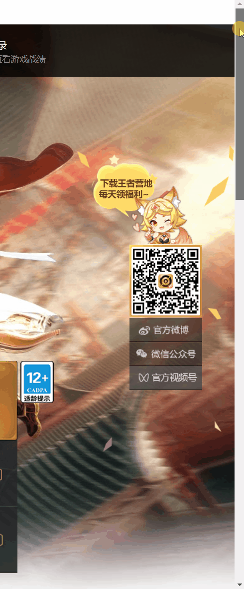

```html
<!doctype html>
<html lang="en">

<head>
    <meta charset="UTF-8">
    <meta name="viewport" content="width=device-width, initial-scale=1.0">
    <meta http-equiv="X-UA-Compatible" content="ie=edge">
    <title>固定定位</title>
    <style>
        .dj {
            position: fixed;
            top: 100px;
            left: 200px;
        }
    </style>
</head>

<body>
    <div class="dj">
        
    </div>
    <p>请尽情吩咐妲己，主人</p>
    <p>请尽情吩咐妲己，主人</p>
    <p>请尽情吩咐妲己，主人</p>
    <p>请尽情吩咐妲己，主人</p>
    <p>请尽情吩咐妲己，主人</p>
    <p>请尽情吩咐妲己，主人</p>
    <p>请尽情吩咐妲己，主人</p>
    <p>请尽情吩咐妲己，主人</p>
    <p>请尽情吩咐妲己，主人</p>
    <p>请尽情吩咐妲己，主人</p>
    <p>请尽情吩咐妲己，主人</p>
    <p>请尽情吩咐妲己，主人</p>
    <p>请尽情吩咐妲己，主人</p>
    <p>请尽情吩咐妲己，主人</p>
    <p>请尽情吩咐妲己，主人</p>
    <p>请尽情吩咐妲己，主人</p>
    <p>请尽情吩咐妲己，主人</p>
    <p>请尽情吩咐妲己，主人</p>
    <p>请尽情吩咐妲己，主人</p>
    <p>请尽情吩咐妲己，主人</p>
    <p>请尽情吩咐妲己，主人</p>
    <p>请尽情吩咐妲己，主人</p>
    <p>请尽情吩咐妲己，主人</p>
    <p>请尽情吩咐妲己，主人</p>
    <p>请尽情吩咐妲己，主人</p>
    <p>请尽情吩咐妲己，主人</p>
    <p>请尽情吩咐妲己，主人</p>
    <p>请尽情吩咐妲己，主人</p>
    <p>请尽情吩咐妲己，主人</p>
    <p>请尽情吩咐妲己，主人</p>
    <p>请尽情吩咐妲己，主人</p>
    <p>请尽情吩咐妲己，主人</p>
    <p>请尽情吩咐妲己，主人</p>
    <p>请尽情吩咐妲己，主人</p>
    <p>请尽情吩咐妲己，主人</p>
    <p>请尽情吩咐妲己，主人</p>
    <p>请尽情吩咐妲己，主人</p>
    <p>请尽情吩咐妲己，主人</p>
    <p>请尽情吩咐妲己，主人</p>
    <p>请尽情吩咐妲己，主人</p>
    <p>请尽情吩咐妲己，主人</p>
    <p>请尽情吩咐妲己，主人</p>
    <p>请尽情吩咐妲己，主人</p>
    <p>请尽情吩咐妲己，主人</p>
    <p>请尽情吩咐妲己，主人</p>
    <p>请尽情吩咐妲己，主人</p>
    <p>请尽情吩咐妲己，主人</p>
    <p>请尽情吩咐妲己，主人</p>
    <p>请尽情吩咐妲己，主人</p>
    <p>请尽情吩咐妲己，主人</p>
    <p>请尽情吩咐妲己，主人</p>
    <p>请尽情吩咐妲己，主人</p>

</body>

</html>
```

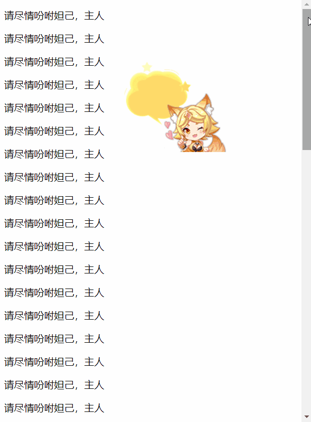

## 17.8固定定位小技巧：固定在版心右侧位置

**小算法：**

1. 让固定定位的盒子 `left: 50%`，走到浏览器可视区（也可以看做版心） 一半的位置
2. 让固定定位的盒子 `margin-left: 版心宽度的一半距离`，多走版心宽度的一半位置

就可以让固定定位的盒子贴着版心右侧对齐了。

```html
<!doctype html>
<html lang="en">

<head>
    <meta charset="UTF-8">
    <meta name="viewport" content="width=device-width, initial-scale=1.0">
    <meta http-equiv="X-UA-Compatible" content="ie=edge">
    <title>固定定位小技巧-固定到版心右侧</title>
    <style>
        .w {
            width: 800px;
            height: 1400px;
            background-color: pink;
            margin: 0 auto;
        }

        .fixed {
            position: fixed;
            /* 1. 走浏览器宽度的一半 */
            left: 50%;
            /* 2. 利用 margin 走版心盒子宽度的一半距离（为了美观多加了 5px）*/
            margin-left: 405px;
            width: 50px;
            height: 150px;
            background-color: skyblue;
        }
    </style>
</head>

<body>
    <div class="fixed"></div>
    <div class="w">版心盒子 800像素</div>

</body>

</html>
```

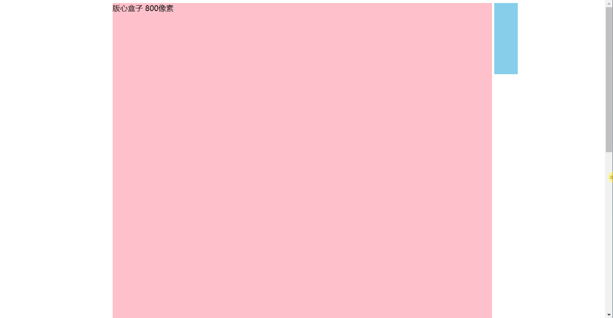

## 17.9粘滞定位

粘性定位可以被认为是相对定位和固定定位的混合。

Sticky 粘性的。

语法：

```css
选择器 { position: sticky; top: 10px; }
```

粘性定位的特点：

1. 以浏览器的**可视窗口为参照点**移动元素（固定定位特点）
2. 粘性定位**占有原先的位置**（相对定位特点）
3. 必须添加 top 、left、right、bottom 其中一个才有效
4. **粘滞定位可以在元素到达某个位置时将其固定**

跟页面滚动搭配使用。 兼容性较差，IE 不支持。

未来开发的趋势，但目前并不常用（目前用 javascript 来实现粘性定位效果）。

应用举例：

我们拿之前的`w3cschool顶部导航栏`进行下魔改

```css
/* 设置一个高度 */
body {
    height: 3000px;
}

.menu {
    width: 1211px;
    height: 48px;
    background-color: #E8E7E3;
    margin: 100px auto;
    /* 开启粘滞定位 */
    position: sticky;
    top: 10px;
}
```


## 17.10定位的总结

我们通过上面的学习，知道`position`属性有五个可选值

但`static`是默认值，即不开启定位，所以我们只需要对比4种定位方式即可

| 定位方式             | 是否不设置偏移量，元素不会发生改变 | 是否脱离文档流 | 是否改变元素性质 | 是否提升元素层级 | 参考系                     |
| -------------------- | ---------------------------------- | -------------- | ---------------- | ---------------- | -------------------------- |
| relative（相对定位） | √                                  | ×              | ×                | √                | 参照于元素在文档流中的位置 |
| absolute（绝对定位） | ×                                  | √              | √                | √                | 参照于其包含块             |
| fixed（固定定位）    | ×                                  | √              | √                | √                | 参照于浏览器的视口         |
| sticky（粘滞定位）   | ×                                  | √              | √                | √                | 参照于浏览器的视口         |

1. 一定记住，相对定位、固定定位、绝对定位 两个大的特点： 1. 是否占有位置（脱标否） 2. 以谁为基准点移动位置。
2. 学习定位重点学会子绝父相。

## 17.11元素层级

对于开启了定位元素，可以通过`z-index`属性来指定元素的层级

- `z-index`需要一个整数作为参数，值越大元素的层级越高，元素的层级越高越优先显示

- 如果元素的层级一样，则优先显示靠下的元素

- 祖先的元素的层级再高，也不会盖住后代元素

语法：

```css
选择器 { z-index: 1; }
```

- 数值可以是正整数、负整数或 0，默认是 auto，数值越大，盒子越靠上
- 如果属性值相同，则按照书写顺序，后来居上
- 数字后面不能加单位
- 只有定位的盒子才有 z-index 属性

```html
<style>
    div {
        font-size: 40px;
    }

    .box1 {
        width: 200px;
        height: 200px;
        background-color: #bfa;
        position: absolute;
        top: 0;
        left: 0;
    }

    .box2 {
        width: 200px;
        height: 200px;
        background-color: orange;
        position: absolute;
        top: 50px;
        left: 50px;
    }

    .box3 {
        width: 200px;
        height: 200px;
        background-color: salmon;
        position: absolute;
        top: 100px;
        left: 100px;
    }

    .box4 {
        width: 100px;
        height: 100px;
        background-color: skyblue;
        position: absolute;
        bottom: 0;
        left: 0;
    }
</style>

<div class="box1">1</div>
<div class="box2">2</div>
<div class="box3">3
    <div class="box4">4</div>
</div>
```

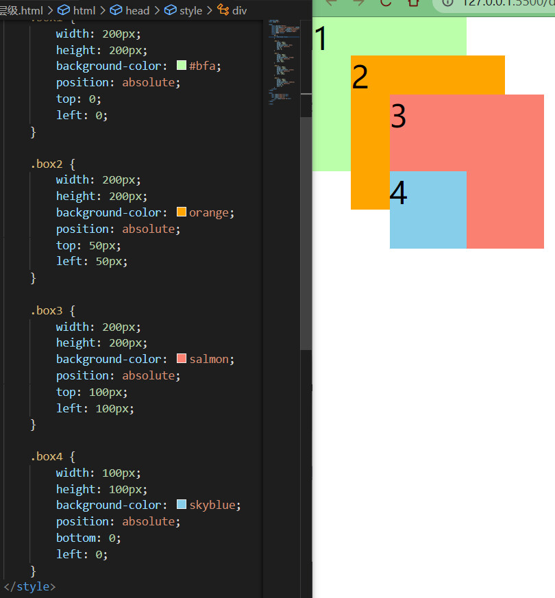

## 17.12定位的拓展

**（1）绝对定位的盒子居中**

加了绝对定位的盒子不能通过 `margin: 0 auto` 水平居中，但是可以通过以下计算方法实现水平和垂直居中。

1. `left: 50%;`：让盒子的左侧移动到父级元素的水平中心位置。
2. `margin-left: -0.5widthpx;`：让盒子向左移动自身宽度的一半。

```html
<!doctype html>
<html lang="en">

<head>
    <meta charset="UTF-8">
    <meta name="viewport" content="width=device-width, initial-scale=1.0">
    <meta http-equiv="X-UA-Compatible" content="ie=edge">
    <title>绝对定位水平垂直居中</title>
    <style>
        .box {
            position: absolute;
            /* 1. left 走 50%  父容器宽度的一半 */
            left: 50%;
            /* 2. margin 负值 往左边走 自己盒子宽度的一半 */
            margin-left: -100px;
            /* 垂直居中同理 */
            top: 50%;
            margin-top: -100px;
            width: 200px;
            height: 200px;
            background-color: pink;
            /* margin: auto; */
        }
    </style>
</head>

<body>
    <div class="box"></div>
</body>

</html>
```

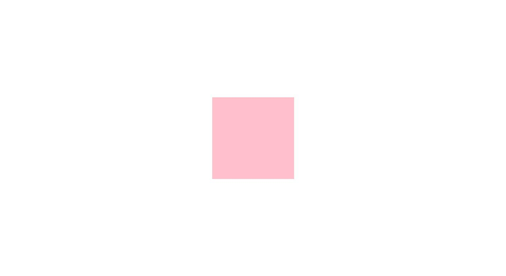

**（2）定位特殊特性**

**绝对定位和固定定位也和浮动类似。**

1. 行内元素添加绝对或者固定定位，可以直接设置高度和宽度。
2. 块级元素添加绝对或者固定定位，如果不给宽度或者高度，默认大小是内容的大小。

```html
<!doctype html>
<html lang="en">

<head>
    <meta charset="UTF-8">
    <meta name="viewport" content="width=device-width, initial-scale=1.0">
    <meta http-equiv="X-UA-Compatible" content="ie=edge">
    <title>定位的特殊特性</title>
    <style>
        span {
            position: absolute;
            top: 100px;
            width: 200px;
            height: 150px;
            background-color: pink;
        }

        div {
            position: absolute;
            background-color: skyblue;
        }
    </style>
</head>

<body>
    <span>123</span>

    <div>abcd</div>
</body>

</html>
```

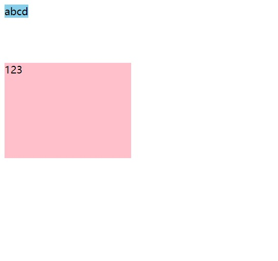

**（3）脱标的盒子不会触发外边距塌陷**

浮动元素、绝对定位（固定定位）元素的都不会触发外边距合并的问题。

**（4）绝对定位（固定定位）会完全压住盒子**

浮动元素不同，只会压住它下面标准流的盒子，但是不会压住下面标准流盒子里面的文字（图片）。

但是绝对定位（固定定位） 会压住下面标准流所有的内容。

浮动之所以不会压住文字，因为浮动产生的目的最初是为了做文字环绕效果的。 文字会围绕浮动元素。

```html
<!doctype html>
<html lang="en">

<head>
    <meta charset="UTF-8">
    <meta name="viewport" content="width=device-width, initial-scale=1.0">
    <meta http-equiv="X-UA-Compatible" content="ie=edge">
    <title>浮动产生原来的目的是做文字环绕效果</title>
    <style>
        img {
            float: left;
        }
    </style>
</head>

<body>
    1993年，在古装片《战神传说》中扮演一个武功超群的渔民；同年，主演动作喜剧片《至尊三十六计之偷天换日》，在片中饰演赌术高明的千门高手钱文迪；此外，他还主演了爱情片《天长地久》，在片中塑造了一个风流不羁的江湖浪子形象。
    1994年，刘德华投资并主演了剧情片《天与地》，在片中饰演面对恶势力却毫不退缩的禁毒专员张一鹏。1995年，主演赛车励志片《烈火战车》，在片中饰演叛逆、倔强的阿祖，并凭借该片获得第15届香港电影金像奖最佳男主角提名；同年在动作片《大冒险家》中演绎了立仁从小时候父母双亡到长大后进入泰国空军的故事。
    1996年，主演黑帮题材的电影《新上海滩》，在片中饰演对冯程程痴情一片的丁力。1997年，担任剧情片《香港制造》的制作人；同年，主演爱情片《天若有情之烽火佳人》，在片中饰演家世显赫的空军少尉刘天伟；12月，与梁家辉联袂主演警匪动作片《黑金》，在片中饰演精明干练、嫉恶如仇的调查局机动组组长方国辉。1998年，主演动作片《龙在江湖》
    
    ，饰演重义气的黑帮成员韦吉祥；同年，出演喜剧片《赌侠1999》；此外，他还担任剧情片《去年烟花特别多》的制作人。
    1993年，在古装片《战神传说》中扮演一个武功超群的渔民；同年，主演动作喜剧片《至尊三十六计之偷天换日》，在片中饰演赌术高明的千门高手钱文迪；此外，他还主演了爱情片《天长地久》，在片中塑造了一个风流不羁的江湖浪子形象。
    1994年，刘德华投资并主演了剧情片《天与地》，在片中饰演面对恶势力却毫不退缩的禁毒专员张一鹏。1995年，主演赛车励志片《烈火战车》，在片中饰演叛逆、倔强的阿祖，并凭借该片获得第15届香港电影金像奖最佳男主角提名；同年在动作片《大冒险家》中演绎了立仁从小时候父母双亡到长大后进入泰国空军的故事。
    1996年，主演黑帮题材的电影《新上海滩》，在片中饰演对冯程程痴情一片的丁力。1997年，担任剧情片《香港制造》的制作人；同年，主演爱情片《天若有情之烽火佳人》，在片中饰演家世显赫的空军少尉刘天伟；12月，与梁家辉联袂主演警匪动作片《黑金》，在片中饰演精明干练、嫉恶如仇的调查局机动组组长方国辉。1998年，主演动作片《龙在江湖》，饰演重义气的黑帮成员韦吉祥；同年，出演喜剧片《赌侠1999》；此外，他还担任剧情片《去年烟花特别多》的制作人。
</body>

</html>
```

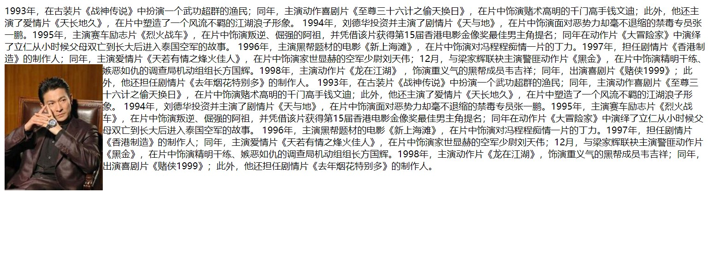

---

```html
<!doctype html>
<html lang="en">

<head>
    <meta charset="UTF-8">
    <meta name="viewport" content="width=device-width, initial-scale=1.0">
    <meta http-equiv="X-UA-Compatible" content="ie=edge">
    <title>定位会完全压住标准流盒子内容</title>
    <style>
        .box {
            /* 1.浮动的元素不会压住下面标准流的文字 */
            /* float: left; */
            /* 2. 绝对定位（固定定位） 会压住下面标准流所有的内容。 */
            position: absolute;
            width: 150px;
            height: 150px;
            background-color: pink;
        }
    </style>
</head>

<body>
    <div class="box"></div>
    <p>阁下何不同风起，扶摇直上九万里</p>
</body>

</html>
```


