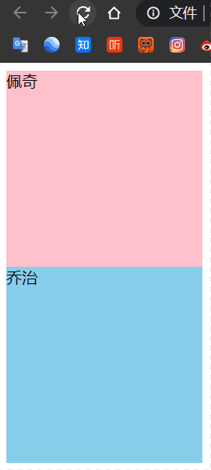
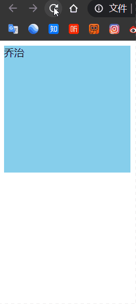
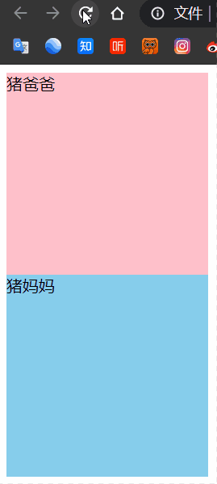
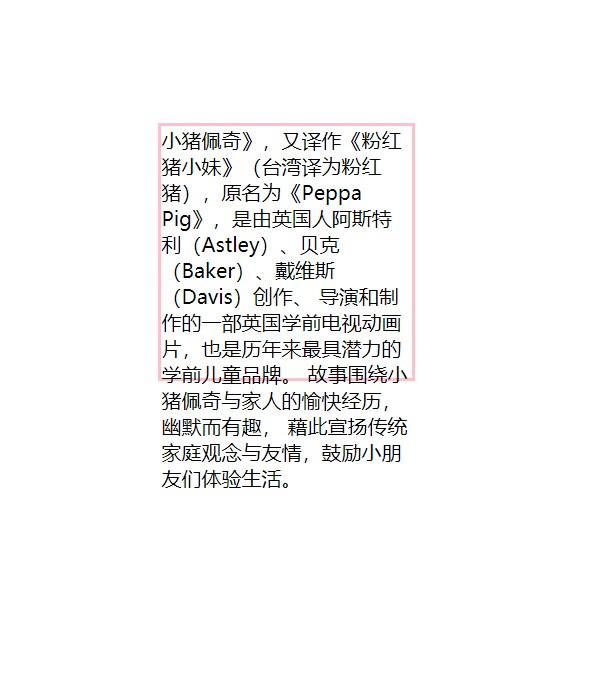
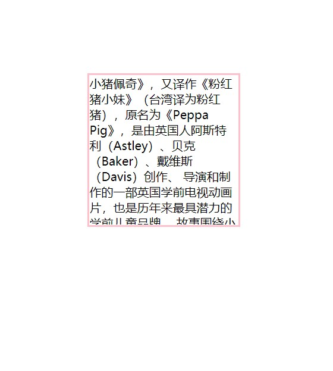
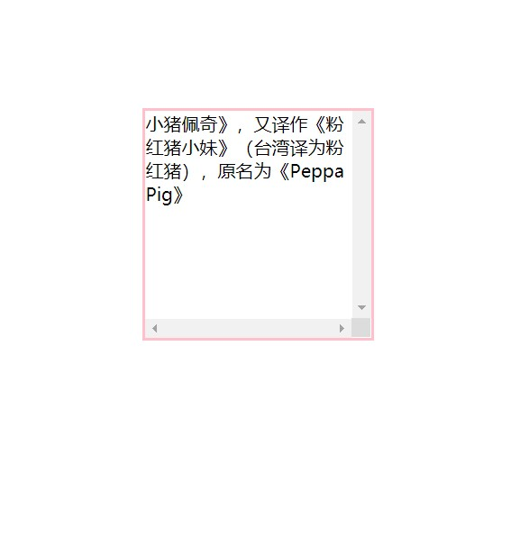
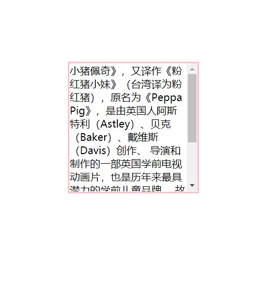
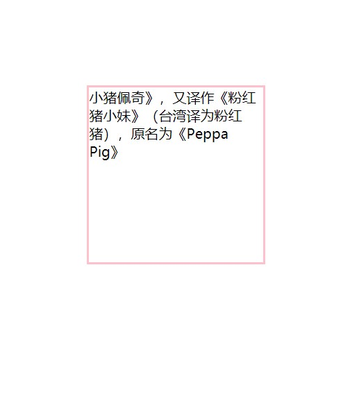

---
# 当前页面内容标题
title: 网页布局总结 元素的显示与隐藏
# 当前页面图标
icon: html
# 分类
category:
  - HTML
  - CSS
# 标签
tag:
  - HTML
sticky: false
# 是否收藏在博客主题的文章列表中，当填入数字时，数字越大，排名越靠前。
star: false
# 是否将该文章添加至文章列表中
article: true
# 是否将该文章添加至时间线中
timeline: true
---

# 18.网页布局总结

通过盒子模型，清楚知道大部分 html 标签是一个盒子。

通过 CSS 浮动、定位可以让每个盒子排列成为网页。

一个完整的网页，是标准流、浮动、定位一起完成布局的，每个都有自己的专门用法。

1. 标准流

可以让盒子上下排列或者左右排列，垂直的块级盒子显示就用标准流布局。

2. 浮动

可以让多个块级元素一行显示或者左右对齐盒子，多个块级盒子水平显示就用浮动布局。

3. 定位

定位最大的特点是有层叠的概念，就是可以让多个盒子前后叠压来显示。如果元素自由在某个盒子内移动就用定位布局。

**重点：竖向上布局找标准流，横向上布局找浮动，空间上布局找定位！**

# 19.元素的显示与隐藏

类似网站广告，当我们点击关闭就不见了，但是我们重新刷新页面，会重新出现！

本质：让一个元素在页面中隐藏或者显示出来。

注意：是隐藏，不是删除！

1. display 显示隐藏（脱标）
2. visibility 显示隐藏（不脱标）
3. overflow 溢出显示隐藏

## 19.1display 属性

display 属性用于设置一个元素应如何显示。

- `display: none`：隐藏对象
- `display：block`：除了转换为块级元素之外，同时还有显示元素的意思

display 隐藏元素后，不再占有原来的位置（**脱标**）。

后面应用及其广泛，搭配 JS 可以做很多的网页特效。

```html
<!doctype html>
<html lang="en">

<head>
    <meta charset="UTF-8">
    <meta name="viewport" content="width=device-width, initial-scale=1.0">
    <meta http-equiv="X-UA-Compatible" content="ie=edge">
    <title>显示隐藏元素之display</title>
    <style>
        .peppa {
            display: none;
            /* display: block; */
            width: 200px;
            height: 200px;
            background-color: pink;

        }

        .george {
            width: 200px;
            height: 200px;
            background-color: skyblue;
        }
    </style>
</head>

<body>
    <div class="peppa">佩奇</div>  <!-- 佩奇被隐藏 -->
    <div class="george">乔治</div>
</body>

</html>
```



---

```html
<!doctype html>
<html lang="en">

<head>
    <meta charset="UTF-8">
    <meta name="viewport" content="width=device-width, initial-scale=1.0">
    <meta http-equiv="X-UA-Compatible" content="ie=edge">
    <title>显示隐藏元素之display</title>
    <style>
        .peppa {
            /* display: none; */
            display: block;
            width: 200px;
            height: 200px;
            background-color: pink;

        }

        .george {
            width: 200px;
            height: 200px;
            background-color: skyblue;
        }
    </style>
</head>

<body>
    <div class="peppa">佩奇</div>  <!-- 佩奇被显示 -->
    <div class="george">乔治</div>
</body>

</html>
```



## 19.2visibility 可见性

visibility 属性用于指定一个元素应可见还是隐藏。

- `visibility：visible`：元素可视
- `visibility：hidden`：元素隐藏

visibility **隐藏元素后，继续占有原来的位置**。

如果隐藏元素想要原来位置， 就用 visibility：hidden。

如果隐藏元素不想要原来位置， 就用 display：none（用处更多，重点）。

```html
<!doctype html>
<html lang="en">

<head>
    <meta charset="UTF-8">
    <meta name="viewport" content="width=device-width, initial-scale=1.0">
    <meta http-equiv="X-UA-Compatible" content="ie=edge">
    <title>显示隐藏元素之display</title>
    <style>
        .baba {
            visibility: hidden;
            width: 200px;
            height: 200px;
            background-color: pink;

        }

        .mama {
            width: 200px;
            height: 200px;
            background-color: skyblue;
        }
    </style>
</head>

<body>
    <div class="baba">猪爸爸</div>
    <div class="mama">猪妈妈</div>
</body>

</html>
```



## 19.3overflow 溢出

overflow 属性指定了如果内容溢出一个元素的框（**超过其指定高度及宽度**）时，会发生什么。

| 属性值    | 描述                                                   |
| --------- | ------------------------------------------------------ |
| `visible` | 不剪切内容也不添加滚动条（默认方式）                   |
| `hidden`  | 不显示超过对象尺寸的内容，超出的部分隐藏掉（并非删除） |
| `scroll`  | 不管超出的内容否，总是显示滚动条                       |
| `auto`    | 超出自动显示滚动条，不超出不显示滚动条                 |

一般情况下，我们都不想让溢出的内容显示出来，因为溢出的部分会影响布局。

但是如果有定位的盒子， 请慎用 overflow: hidden 因为它会隐藏多余的部分。

```html
<!doctype html>
<html lang="en">

<head>
    <meta charset="UTF-8">
    <meta name="viewport" content="width=device-width, initial-scale=1.0">
    <meta http-equiv="X-UA-Compatible" content="ie=edge">
    <title>显示隐藏元素之overflow</title>
    <style>
        .peppa {
            /* overflow: visible; */
            /* overflow: hidden; */
            /* scroll 溢出的部分显示滚动条  不溢出也显示滚动条 */
            /* overflow: scroll; */
            /* auto 溢出的时候才显示滚动条 不溢出不显示滚动条 */
            /* overflow: auto; */
            width: 200px;
            height: 200px;
            border: 3px solid pink;
            margin: 100px auto;
        }
    </style>
</head>

<body>
    <div class="peppa">
        小猪佩奇》，又译作《粉红猪小妹》（台湾译为粉红猪），原名为《Peppa
        Pig》，是由英国人阿斯特利（Astley）、贝克（Baker）、戴维斯（Davis）创作、
        导演和制作的一部英国学前电视动画片，也是历年来最具潜力的学前儿童品牌。
        故事围绕小猪佩奇与家人的愉快经历，幽默而有趣，
        藉此宣扬传统家庭观念与友情，鼓励小朋友们体验生活。
    </div>

</body>

</html>
```


---

```html
<!doctype html>
<html lang="en">

<head>
    <meta charset="UTF-8">
    <meta name="viewport" content="width=device-width, initial-scale=1.0">
    <meta http-equiv="X-UA-Compatible" content="ie=edge">
    <title>显示隐藏元素之overflow</title>
    <style>
        .peppa {
            overflow: visible;
            /* overflow: hidden; */
            /* scroll 溢出的部分显示滚动条  不溢出也显示滚动条 */
            /* overflow: scroll; */
            /* auto 溢出的时候才显示滚动条 不溢出不显示滚动条 */
            /* overflow: auto; */
            width: 200px;
            height: 200px;
            border: 3px solid pink;
            margin: 100px auto;
        }
    </style>
</head>

<body>
    <div class="peppa">
        小猪佩奇》，又译作《粉红猪小妹》（台湾译为粉红猪），原名为《Peppa
        Pig》，是由英国人阿斯特利（Astley）、贝克（Baker）、戴维斯（Davis）创作、
        导演和制作的一部英国学前电视动画片，也是历年来最具潜力的学前儿童品牌。
        故事围绕小猪佩奇与家人的愉快经历，幽默而有趣，
        藉此宣扬传统家庭观念与友情，鼓励小朋友们体验生活。
    </div>

</body>

</html>
```



---

```html
<!doctype html>
<html lang="en">

<head>
    <meta charset="UTF-8">
    <meta name="viewport" content="width=device-width, initial-scale=1.0">
    <meta http-equiv="X-UA-Compatible" content="ie=edge">
    <title>显示隐藏元素之overflow</title>
    <style>
        .peppa {
            /* overflow: visible; */
            overflow: hidden;
            /* scroll 溢出的部分显示滚动条  不溢出也显示滚动条 */
            /* overflow: scroll; */
            /* auto 溢出的时候才显示滚动条 不溢出不显示滚动条 */
            /* overflow: auto; */
            width: 200px;
            height: 200px;
            border: 3px solid pink;
            margin: 100px auto;
        }
    </style>
</head>

<body>
    <div class="peppa">
        小猪佩奇》，又译作《粉红猪小妹》（台湾译为粉红猪），原名为《Peppa
        Pig》，是由英国人阿斯特利（Astley）、贝克（Baker）、戴维斯（Davis）创作、
        导演和制作的一部英国学前电视动画片，也是历年来最具潜力的学前儿童品牌。
        故事围绕小猪佩奇与家人的愉快经历，幽默而有趣，
        藉此宣扬传统家庭观念与友情，鼓励小朋友们体验生活。
    </div>

</body>

</html>
```



---

```html
<!doctype html>
<html lang="en">

<head>
    <meta charset="UTF-8">
    <meta name="viewport" content="width=device-width, initial-scale=1.0">
    <meta http-equiv="X-UA-Compatible" content="ie=edge">
    <title>显示隐藏元素之overflow</title>
    <style>
        .peppa {
            /* overflow: visible; */
            /* overflow: hidden; */
            /* scroll 溢出的部分显示滚动条  不溢出也显示滚动条 */
            overflow: scroll;
            /* auto 溢出的时候才显示滚动条 不溢出不显示滚动条 */
            /* overflow: auto; */
            width: 200px;
            height: 200px;
            border: 3px solid pink;
            margin: 100px auto;
        }
    </style>
</head>

<body>
    <div class="peppa">
        小猪佩奇》，又译作《粉红猪小妹》（台湾译为粉红猪），原名为《Peppa
        Pig》
    </div>

</body>

</html>
```



---

```html
<!doctype html>
<html lang="en">

<head>
    <meta charset="UTF-8">
    <meta name="viewport" content="width=device-width, initial-scale=1.0">
    <meta http-equiv="X-UA-Compatible" content="ie=edge">
    <title>显示隐藏元素之overflow</title>
    <style>
        .peppa {
            /* overflow: visible; */
            /* overflow: hidden; */
            /* scroll 溢出的部分显示滚动条  不溢出也显示滚动条 */
            /* overflow: scroll; */
            /* auto 溢出的时候才显示滚动条 不溢出不显示滚动条 */
            overflow: auto;
            width: 200px;
            height: 200px;
            border: 3px solid pink;
            margin: 100px auto;
        }
    </style>
</head>

<body>
    <div class="peppa">
        小猪佩奇》，又译作《粉红猪小妹》（台湾译为粉红猪），原名为《Peppa
        Pig》，是由英国人阿斯特利（Astley）、贝克（Baker）、戴维斯（Davis）创作、
        导演和制作的一部英国学前电视动画片，也是历年来最具潜力的学前儿童品牌。
        故事围绕小猪佩奇与家人的愉快经历，幽默而有趣，
        藉此宣扬传统家庭观念与友情，鼓励小朋友们体验生活。
    </div>

</body>

</html>
```



---

```html
<!doctype html>
<html lang="en">

<head>
    <meta charset="UTF-8">
    <meta name="viewport" content="width=device-width, initial-scale=1.0">
    <meta http-equiv="X-UA-Compatible" content="ie=edge">
    <title>显示隐藏元素之overflow</title>
    <style>
        .peppa {
            /* overflow: visible; */
            /* overflow: hidden; */
            /* scroll 溢出的部分显示滚动条  不溢出也显示滚动条 */
            /* overflow: scroll; */
            /* auto 溢出的时候才显示滚动条 不溢出不显示滚动条 */
            overflow: auto;
            width: 200px;
            height: 200px;
            border: 3px solid pink;
            margin: 100px auto;
        }
    </style>
</head>

<body>
    <div class="peppa">
        小猪佩奇》，又译作《粉红猪小妹》（台湾译为粉红猪），原名为《Peppa
        Pig》
    </div>

</body>

</html>
```



## 19.4总结

1. display 显示隐藏元素 但是不保留位置
2. visibility 显示隐藏元素 但是保留原来的位置
3. overflow 溢出显示隐藏 但是只是对于溢出的部分处理
