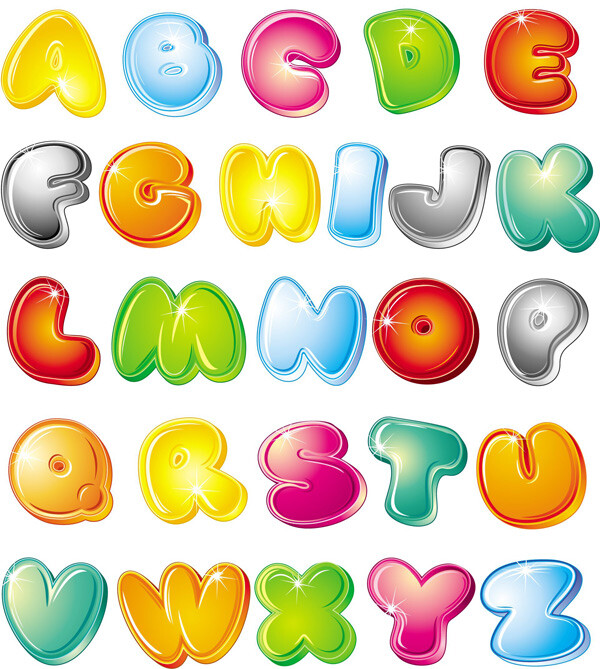
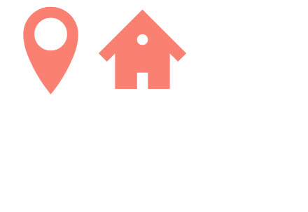
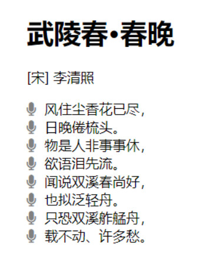
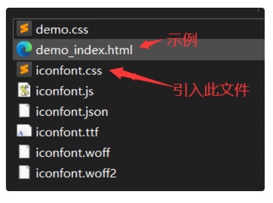
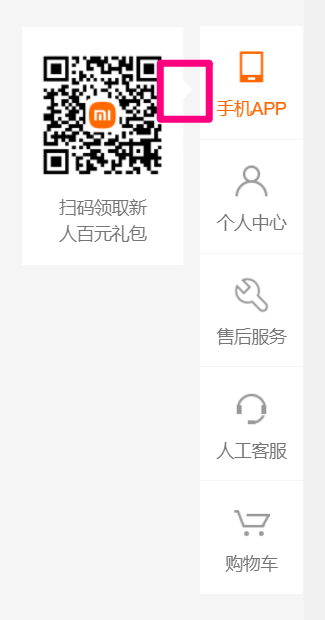
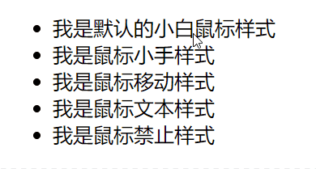
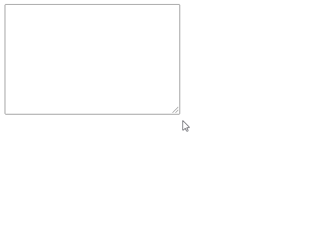
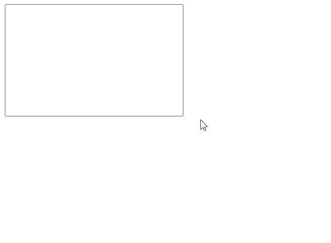
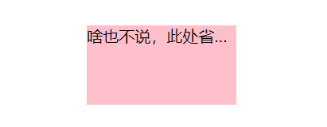
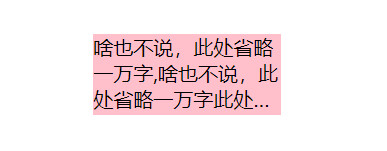

---
# 当前页面内容标题
title: 精灵图 圆标字体 CSS三角 鼠标样式 溢出省略号
# 当前页面图标
icon: css
# 分类
category:
  - HTML
  - CSS
# 标签
tag:
  - HTML
sticky: false
# 是否收藏在博客主题的文章列表中，当填入数字时，数字越大，排名越靠前。
star: false
# 是否将该文章添加至文章列表中
article: true
# 是否将该文章添加至时间线中
timeline: true
---

# 20.精灵图

## 20.1为什么需要精灵图？

一个网页中往往会应用很多小的背景图像作为修饰，当网页中的图像过多时，服务器就会频繁地接收和发送
请求图片，造成服务器请求压力过大，这将大大降低页面的加载速度。

因此，为了有效地减少服务器接收和发送请求的次数，提高页面的加载速度，出现了 CSS 精灵技术（也称 CSS Sprites、CSS 雪碧）。

核心原理：将网页中的一些小背景图像整合到一张大图中 ，这样服务器只需要一次请求就可以了。

精灵技术目的：为了有效地减少服务器接收和发送请求的次数，提高页面的加载速度。

## 20.2精灵图（sprites）的使用

使用精灵图核心：

1. 精灵技术主要针对于背景图片使用。就是把多个小背景图片整合到一张大图片中
2. 这个大图片也称为 sprites 精灵图 或者 雪碧图
3. 移动背景图片位置以控制显示区域， 此时可以使用 `background-position`
4. 移动的距离就是这个目标图片的 `x` 和 `y` 坐标。注意网页中的坐标有所不同
5. 因为一般情况下都是将精灵图往上往左移动，所以两个坐标数值基本是负值
6. 使用精灵图的时候需要精确测量，每个小背景图片的大小和位置

雪碧图的使用步骤：

1. 先确定要使用的图标

2. 测量图标的大小

3. 根据测量结果创建一个元素

4. 将雪碧图设置为元素的背景图片

5. 设置一个偏移量以显示正确的图片

使用精灵图核心总结：

1. 精灵图主要针对于小的背景图片使用
2. 主要借助于背景位置来实现 `background-position`
3. 一般情况下精灵图都是负值（千万注意网页中的坐标： x轴右边走是正值，左边走是负值， y轴同理）

**示例1**


```css
a:link {
    display: block;
    width: 93px;
    height: 29px;
    background: url("assets/背景/练习2-背景/btn.png");
    /* 默认值，可以不设置 */
    background-position: 0 0;
}

a:hover {
    /* 设置水平方向的一个偏移量；注意是向左移动，所以是负值 */
    background-position: -93px 0;
}

a:active {
    /* 设置水平方向的一个偏移量；注意是向左移动，所以是负值 */
    background-position: calc(-93px*2) 0;
}
```

> 如果不使用雪碧图会因为图片需要临时去发请求加载，会闪一下才出现图片

**示例2**



```html
<!doctype html>
<html lang="en">

<head>
    <meta charset="UTF-8">
    <meta name="viewport" content="width=device-width, initial-scale=1.0">
    <meta http-equiv="X-UA-Compatible" content="ie=edge">
    <title>利用精灵图拼出自己名字</title>
    <style>
        span {
            display: inline-block;
            background: url(./images/abcd.jpg) no-repeat;
        }

        .p {
            width: 100px;
            height: 112px;
            /* background-color: pink; */
            background-position: -493px -276px;
        }

        .i {
            width: 60px;
            height: 108px;
            /* background-color: pink; */
            background-position: -327px -142px;
        }

        .n {
            width: 115px;
            height: 112px;
            /* background-color: pink; */
            background-position: -255px -275px;
        }

        .k {
            width: 105px;
            height: 114px;
            /* background-color: pink; */
            background-position: -495px -142px;
        }
    </style>
</head>

<body>
    <span class="p">p</span>
    <span class="i">i</span>
    <span class="n">n</span>
    <span class="k">k</span>
</body>

</html>
```


# 21.图标字体

## 21.1字体图标的产生

字体图标使用场景：主要用于显示网页中通用、常用的一些小图标。

精灵图是有诸多优点的，但是缺点很明显。

1. 图片文件还是比较大的
2. 图片本身放大和缩小会失真
3. 一旦图片制作完毕想要更换非常复杂

此时，有一种技术的出现很好的解决了以上问题，就是字体图标 iconfont。

字体图标可以为前端工程师提供一种方便高效的图标使用方式，展示的是图标，但本质却属于字体。

## 21.2字体图标的优点

- 轻量级：一个图标字体要比一系列的图像要小。一旦字体加载了，图标就会马上渲染出来，减少了服务器请求
- 灵活性：本质其实是文字，可以很随意的改变颜色、产生阴影、透明效果、旋转等
- 兼容性：几乎支持所有的浏览器，请放心使用

注意： 字体图标不能替代精灵技术，只是对工作中图标部分技术的提升和优化。

总结：

1. 如果遇到一些结构和样式比较简单的小图标，就用字体图标
2. 如果遇到一些结构和样式复杂一点的小图片，就用精灵图

字体图标是一些网页常见的小图标，我们直接网上下载即可。 因此使用可以分为：

1. 字体图标的下载
2. 字体图标的引入（引入到我们 html 页面中）
3. 字体图标的追加（在原有的基础上添加新的小图标）

## 21.3字体图标的下载

推荐下载网站：

- icomoon 字库 [https://icomoon.io/](https://icomoon.io/)

IcoMoon 成立于 2011 年，推出了第一个自定义图标字体生成器，它允许用户选择所需要的图标，使它们成一字型。该字库内容种类繁多，非常全面，唯一的遗憾是国外服务器，打开网速较慢。

- 阿里 iconfont 字库 [https://www.iconfont.cn/](https://www.iconfont.cn/)

这个是阿里妈妈 M2UX 的一个 iconfont 字体图标字库，包含了淘宝图标库和阿里妈妈图标库。可以使用 AI 制作图标上传生成。 重点是，免费！

> 以下内容以 icomoon 字库 为例。

## 21.4字体图标的引入

下载完毕之后，注意原先的文件不要删，后面会用！

1. **把下载包里面的 fonts 文件夹放入页面根目录下**

不同浏览器所支持的字体格式是不一样的，字体图标之所以兼容，就是因为包含了主流浏览器支持的字体文件。

- TureType (.ttf) 格式 .ttf 字体是 Windows 和 Mac 的最常见的字体，支持这种字体的浏览器有 IE9+、Firefox3.5+、Chrome4+、Safari3+、Opera10+、iOS Mobile、Safari4.2+；
- Web Open Font Format (.woff) 格式 woff 字体，支持这种字体的浏览器有 IE9+、Firefox3.5+、Chrome6+、Safari3.6+、Opera11.1+；
- Embedded Open Type (.eot) 格式 .eot 字体是 IE 专用字体，支持这种字体的浏览器有 IE4+；
- SVG (.svg) 格式 .svg 字体是基于 SVG 字体渲染的一种格式，支持这种字体的浏览器有 Chrome4+、Safari3.1+、Opera10.0+、iOS Mobile Safari3.2+；

2. **在 CSS 样式中全局声明字体：简单理解把这些字体文件通过 css 引入到我们页面中**

一定注意字体文件路径的问题。

```css
@font-face {
 font-family: 'icomoon';
 src: url('fonts/icomoon.eot?7kkyc2');
 src: url('fonts/icomoon.eot?7kkyc2#iefix') format('embedded-opentype'),
 url('fonts/icomoon.ttf?7kkyc2') format('truetype'),
 url('fonts/icomoon.woff?7kkyc2') format('woff'),
 url('fonts/icomoon.svg?7kkyc2#icomoon') format('svg');
 font-weight: normal;
 font-style: normal;
}
```

3. **html 标签内添加小图标**

复制小图标对应的字符（一个小方框）到 html 中，一般建议放在 `<i></i>` 标签里。

4. **给标签定义字体**

```css
span {
 font-family: "icomoon";
}
```

注意：务必保证这个字体和上面 @font-face 里面的字体保持一致（默认为：icomoon）。

## 21.5字体图标的追加

如果工作中，原来的字体图标不够用了，我们便需要添加新的字体图标到原来的字体文件中。

选择 Import Icons 按钮，把原压缩包里面的 selection.json 重新上传，然后选中自己想要新的图标，从新下载压缩包，并替换原来的文件即可。

## 21.6字体图标加载的原理

服务器只需接受一次浏览器请求便可以将 fonts 文件一次性返回，如此而来网页中所有用到 fonts 字体图标的部分便一次性加载好了，大大减轻了服务器压力。

```html
<!doctype html>
<html lang="en">

<head>
  <meta charset="UTF-8">
  <meta name="viewport" content="width=device-width, initial-scale=1.0">
  <meta http-equiv="X-UA-Compatible" content="ie=edge">
  <title>字体图标的使用</title>
  <style>
    /* 字体声明 */
    @font-face {
     font-family: 'icomoon';
       src: url('fonts/icomoon.eot?p4ssmb');
       src: url('fonts/icomoon.eot?p4ssmb#iefix') format('embedded-opentype'),
        url('fonts/icomoon.ttf?p4ssmb') format('truetype'),
        url('fonts/icomoon.woff?p4ssmb') format('woff'),
        url('fonts/icomoon.svg?p4ssmb#icomoon') format('svg');
       font-weight: normal;
       font-style: normal;
       font-display: block;
    }

    span {
      font-family: 'icomoon';
      font-size: 100px;
      color: salmon;
    }
  </style>
</head>

<body>
  <span class="icon-location"></span>
  <span class="icon-home"></span>
</body>

</html>
```



## 21.7fontawesome

官方网站：<https://fontawesome.com/>

下载解压完毕之后，直接将css和webfonts移动到项目中即可使用

**示例**

```html
<link rel="stylesheet" href="/font/fontawesome/css/all.css">
<style>
    i {
        color: green;
    }

    .fa-venus-mars,
    .fa-mars-double {
        color: red;
    }

    .fa-html5 {
        color: #E34D22;
    }

    .fa-css3 {
        color: blue;
    }

    .fa-js {
        color: #D1B514;
    }
</style>

<!-- 大小 -->
<i class="fab fa-weixin fa-lg"></i>
<i class="fab fa-weixin fa-2x"></i>
<i class="fab fa-weixin fa-3x"></i>
<br>

<!-- 边框 -->
<i class="fab fa-weixin fa-2x fa-border"></i>
<br>

<!-- 旋转 -->
<i class="fab fa-weixin fa-2x  fa-rotate-90 "></i>
<!-- 水平对称 -->
<i class="fab fa-weixin fa-2x fa-flip-horizontal "></i>
<!-- 垂直对称 -->
<i class="fab fa-weixin fa-2x fa-flip-vertical "></i>
<br>

<!-- 动画 -->
<i class="fa fa-venus-mars fa-3x fa-spin"></i>
<i class="fa fa-mars-double  fa-3x fa-pulse"></i>
<br>

<!-- 列表 -->
<ul class="fa-ul">
    <li><i class="fa-li fa fa-check-square"></i>can be used</li>
    <li><i class="fa-li fa fa-spinner fa-spin"></i>as bullets</li>
    <li><i class="fa-li fa fa-square"></i>in lists</li>
</ul>
<br><br><br>

<!-- 组合 -->
<span class="fa-stack fa-lg">
    <i class="fab fa-html5 fa-stack-1x fa-10x"></i>
    <i class="fab fa-css3 fa-stack-1x fa-4x"></i>
    <i class="fab fa-js fa-stack-1x fa-2x"></i>
</span>
```


其中`fas`/`fab`是免费的，其他是收费的

## 21.8图标字体其他使用方式

### 21.8.1通过伪元素设置

1. 找到要设置图标的元素通过`::before`或`::after`选中

2. 在`content`中设置字体的编码

3. 设置字体的样式

  - - `fab`：`font-family: 'Font Awesome 5 Brands';`

  - - `fas`：`font-family: 'Font Awesome 5 Free'; font-weight：900;`

```html
<style>
    .poem {
        width: 200px;
        height: 300px;
        margin: auto;
    }

    li {
        list-style: none;
        margin-left: -40px;
    }

    li::before {
        content: '\f130';
        /* font-family: 'Font Awesome 5 Brands'; */
        font-family: 'Font Awesome 5 Free';
        font-weight: 900;
        margin-right: 10px;
        color: gray;
    }
</style>

<div class="poem">
    <h1>武陵春·春晚</h1>
    <p> [宋] 李清照</p>
    <ul>
        <li>风住尘香花已尽，</li>
        <li>日晚倦梳头。</li>
        <li>物是人非事事休，</li>
        <li>欲语泪先流。</li>
        <li>闻说双溪春尚好，</li>
        <li>也拟泛轻舟。</li>
        <li>只恐双溪舴艋舟，</li>
        <li>载不动、许多愁。</li>
    </ul>
</div>
```



### 21.8.2通过实体设置

通过实体来使用图标字体：`&#x图标编码;`

**示例**

```html
<i class="fas">&#xf025;</i>
```

**效果**


## 21.9iconfont

官方网站：<https://www.iconfont.cn/>

iconfont是阿里的一个图标字体库，海量图标库，图标字体非常丰富

但是版权有点模横两可，如果需要商用，最好联系作者

不过一般情况下，公司企业都会有自己的UI设计团队，会自己去进行设计

这里使用方式大同小异，不过

- iconfont需要添加购物车后再添加至项目然后下载，下载包中有demo.html，详细介绍了使用方式

- iconfont也提供了一种在线方式，直接在`我的项目`中选择`在线链接`可以复制出一份`@font-face`的css代码



**示例**

```html
<!-- <link rel="stylesheet" href="/font/iconfont/iconfont.css"> -->
<style>
    i.iconfont {
        font-size: 100px;
    }

    p::before {
        content: '\e811';
        font-family: 'iconfont';
        font-size: 50px;
    }
    
    /* 3、通过在线连接：这里link和@font-face择其一即可  */
    @font-face {
        font-family: 'iconfont';
        /* Project id 2580407 */
        src: url('//at.alicdn.com/t/font_2580407_c0kpuhebb7r.woff2?t=1622373966454') format('woff2'),
            url('//at.alicdn.com/t/font_2580407_c0kpuhebb7r.woff?t=1622373966454') format('woff'),
            url('//at.alicdn.com/t/font_2580407_c0kpuhebb7r.ttf?t=1622373966454') format('truetype');
    }
</style>

<!-- 1、通过字符实体设置 -->
<i class="iconfont">&#xe810;</i>
<i class="iconfont">&#xe811;</i>
<i class="iconfont">&#xe812;</i>
<i class="iconfont">&#xe813;</i>

<!-- 2、通过伪元素设置 -->
<p>Lorem ipsum, dolor sit amet consectetur adipisicing elit. Totam deserunt tempore fugit quos eaque, ipsa rerum
    suscipit iure cumque aspernatur esse cupiditate nihil quas nulla odit? Sequi accusantium labore maiores.</p>

<!-- 通过class类名是最常用的方式 -->
<i class="iconfont icon-home"></i>
```


# 22.CSS三角

网页中常见一些三角形，使用 CSS 直接画出来就可以，不必做成图片或者字体图标。



CSS 三角是怎么来的？原理如下：

对一个没有大小的盒子设置边框，那么只要边框足够粗，就可以呈现三角效果。

如果只需要一个三角，那么对其他三个边框设置透明色即可。

通常 CSS 三角要配合定位来布局。

```html
<!doctype html>
<html lang="en">

<head>
    <meta charset="UTF-8">
    <meta name="viewport" content="width=device-width, initial-scale=1.0">
    <meta http-equiv="X-UA-Compatible" content="ie=edge">
    <title>CSS 三角制作</title>
    <style>
        .box1 {
            width: 0;
            height: 0;
            /* border: 10px solid pink; */
            border-top: 30px solid hotpink;
            border-right: 30px solid black;
            border-bottom: 30px solid skyblue;
            border-left: 30px solid gray;
        }

        .box2 {
            width: 0;
            height: 0;
            border: 50px solid transparent;
            border-left-color: black;
            margin: 50px;
        }

        .jd {
            /* 子绝父相 */
            position: relative;
            width: 120px;
            height: 249px;
            background-color: black;
        }

        .jd span {
            /* 子绝父相 */
            position: absolute;
            right: 15px;
            top: -20px;
            width: 0;
            height: 0;
            /* 下面两行为了照顾兼容性 */
            line-height: 0;
            font-size: 0;
            border: 10px solid transparent;
            border-bottom-color: black;
        }
    </style>
</head>

<body>
    <div class="box1"></div>
    <div class="box2"></div>
    <div class="jd">
        <span></span>
    </div>
</body>

</html>
```


# 23.CSS用户界面样式

## 23.1什么是界面样式

所谓的界面样式，就是更改一些用户操作样式，以提高更好的用户体验。

- 更改用户的鼠标样式
- 表单轮廓
- 防止表单域拖拽

## 23.2鼠标样式 cursor

```css
li { cursor: pointer; }
```

设置或检索在对象上移动的鼠标指针采用何种系统预定义的光标形状。

| 属性值        | 描述     |
| ------------- | -------- |
| `default`     | 默认箭头 |
| `pointer`     | 小手     |
| `move`        | 十字移动 |
| `text`        | 文本竖杠 |
| `not-allowed` | 禁止     |

注意：除了以上类型，还有其他很多类型。

```html
<!doctype html>
<html lang="en">

<head>
    <meta charset="UTF-8">
    <meta name="viewport" content="width=device-width, initial-scale=1.0">
    <meta http-equiv="X-UA-Compatible" content="ie=edge">
    <title>用户界面样式-鼠标样式</title>
</head>

<body>
    <ul>
        <li style="cursor: default;">我是默认的小白鼠标样式</li>
        <li style="cursor: pointer;">我是鼠标小手样式</li>
        <li style="cursor: move;">我是鼠标移动样式</li>
        <li style="cursor: text;">我是鼠标文本样式</li>
        <li style="cursor: not-allowed;">我是鼠标禁止样式</li>
    </ul>
</body>

</html>
```



## 23.3轮廓线 outline

给表单添加 `outline: 0;` 或者 `outline: none;` 样式之后，就可以去掉默认的边框。

```css
input { outline: none; }
```

默认样式：


修改后样式：

```html
<!doctype html>
<html lang="en">

<head>
    <meta charset="UTF-8">
    <meta http-equiv="X-UA-Compatible" content="IE=edge">
    <meta name="viewport" content="width=device-width, initial-scale=1.0">
    <title>轮廓线 outline</title>
    <style>
        input {
            /* 取消表单轮廓 */
            outline: none;
        }
    </style>
</head>

<body>
    <!-- 取消表单轮廓 -->
    <input type="text">
</body>

</html>
```


## 23.4防止拖拽文本域 resize

实际开发中，我们文本域右下角是不允许拖拽的。（会破坏布局！）

```css
textarea { resize: none; }
```

默认样式：



修改后样式：

```html
<!doctype html>
<html lang="en">

<head>
    <meta charset="UTF-8">
    <meta http-equiv="X-UA-Compatible" content="IE=edge">
    <meta name="viewport" content="width=device-width, initial-scale=1.0">
    <title>防止拖拽文本域 resize</title>
    <style>
        textarea {
            /* 取消表单轮廓 */
            outline: none;
            /* 防止拖拽文本域 */
            resize: none;
        }
    </style>
</head>

<body>
    <!-- 防止拖拽文本域 -->
    <!-- <textarea></textarea>起始标签建议放在一行，因为这样不会导致文本域里文字前有空白，
    后期可以专门通过 padding 来设置文本周围的留白 -->
    <textarea name="" id="" cols="30" rows="10"></textarea>
</body>

</html>
```



# 24.溢出的文字省略号显示

## 24.1单行文本溢出省略号显示

三个必要条件：

```css
/* 1. 先强制一行内显示文本 */ 
white-space: nowrap;  /*（ 默认 normal 自动换行）*/ 
/* 2. 超出的部分隐藏 */ 
overflow: hidden; 
/* 3. 文字用省略号替代超出的部分 */ 
text-overflow: ellipsis;
```

案例：

```html
<!doctype html>
<html lang="en">

<head>
    <meta charset="UTF-8">
    <meta name="viewport" content="width=device-width, initial-scale=1.0">
    <meta http-equiv="X-UA-Compatible" content="ie=edge">
    <title>单行文本溢出显示省略号</title>
    <style>
        div {
            width: 150px;
            height: 80px;
            background-color: pink;
            margin: 100px auto;
            /* 这个单词的意思是如果文字显示不开自动换行 */
            /* white-space: normal; */
            /* 1.这个单词的意思是如果文字显示不开也必须强制一行内显示 */
            white-space: nowrap;
            /* 2.溢出的部分隐藏起来 */
            overflow: hidden;
            /* 3.文字溢出的时候用省略号来显示 */
            text-overflow: ellipsis;
        }
    </style>
</head>

<body>
    <div>
        啥也不说，此处省略一万字
    </div>
</body>

</html>
```



## 24.2多行文本溢出省略号显示

多行文本溢出显示省略号，有较大兼容性问题， 适合于 webkit 浏览器或移动端（移动端大部分是 webkit 内核）。

```css
overflow: hidden;
text-overflow: ellipsis;
/* 弹性伸缩盒子模型显示 */
display: -webkit-box;
/* 限制在一个块元素显示的文本的行数 */
-webkit-line-clamp: 2;
/* 设置或检索伸缩盒对象的子元素的排列方式 */
-webkit-box-orient: vertical;
```

更推荐让后台人员来做这个效果，因为后台人员可以设置显示多少个字，操作更简单。

案例：

```html
<!doctype html>
<html lang="en">

<head>
    <meta charset="UTF-8">
    <meta name="viewport" content="width=device-width, initial-scale=1.0">
    <meta http-equiv="X-UA-Compatible" content="ie=edge">
    <title>单行文本溢出显示省略号</title>
    <style>
        div {
            width: 150px;
            height: 65px;
            background-color: pink;
            margin: 100px auto;
            overflow: hidden;
            text-overflow: ellipsis;
            /* 弹性伸缩盒子模型显示 */
            display: -webkit-box;
            /* 限制在一个块元素显示的文本的行数 */
            -webkit-line-clamp: 3;
            /* 设置或检索伸缩盒对象的子元素的排列方式 */
            -webkit-box-orient: vertical;
        }
    </style>
</head>

<body>
    <div>
        啥也不说，此处省略一万字,啥也不说，此处省略一万字此处省略一万字
    </div>
</body>

</html>
```

Chrome 浏览器效果：


