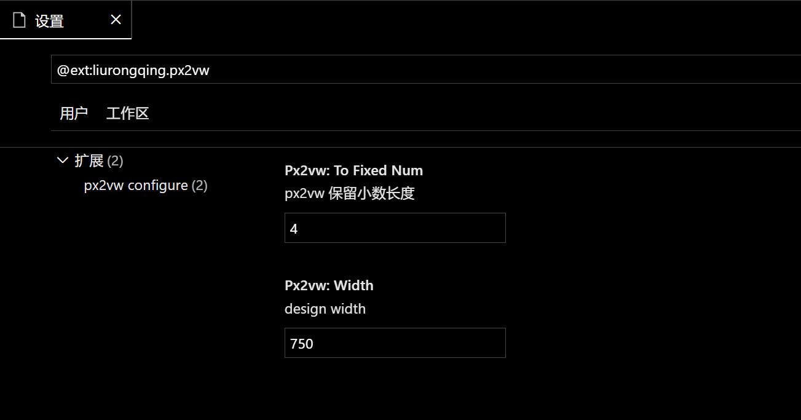

---
# 当前页面内容标题
title: vw布局
# 当前页面图标
icon: css
# 分类
category:
  - HTML
  - CSS
# 标签
tag:
  - HTML
sticky: false
# 是否收藏在博客主题的文章列表中，当填入数字时，数字越大，排名越靠前。
star: false
# 是否将该文章添加至文章列表中
article: true
# 是否将该文章添加至时间线中
timeline: true
---

# 36.vw布局

## 36.1 移动端布局

移动端布局 --- flex 布局

为了实现可以适配移动端，页面元素可以宽度和高度等比例缩放

需要移动端适配有如下方案：

（1）rem

市场比较常见：

1. 需要不断修改 html 文字大小
2. 需要媒体查询 media
3. 需要 flexible.js

（2）vw / vh

未来的趋势：

1. 省去各种判断和修改
2. 代表：bilibili、小米……

## 36.2 vw/vh是什么？

- vw/vh 是一个相对单位（类似 em 和 rem 相对单位）
  - vw 是：viewport width 视口宽度单位
  - vh 是：viewport height 视口高度单位
- 相对视口的尺寸计算结果
  - 1vw = 1/100 视口宽度
  - 1vh = 1/100 视口高度

例如：

当前屏幕视口是 375px，则 1vw 就是 3.75px，如果当前屏幕视口为 414px，则 1vw 就是 4.14px。

**注意：和百分比有区别，百分比是相对于父元素来说的，而 vw 和 vh 总是针对于当前视口来说的。**

## 36.3 vw/vh怎么用？

- 超级简单，元素单位直接使用新单位 vw/vh 即可
- 因为 vw/vh 是相对单位，所以不同视口（屏幕）下，宽高一起变化完成适配

> 直接使用即可！永远滴神！

【案例】

```css
div {
    width: 10vw;
    height: 10vh;
    background-color: pink;
}
```

 **如何还原设计稿？**

前提：我们设计稿按照 iPhone 6/7/8 来设计，有个盒子是 50px * 50px 的，如何使用 vw 呢？

分析：

1. 设计稿参照 iPhone 6/7/8，所以视口宽度尺寸是 375px（设计原型图平台切换到 2x 模式再测量，因为 UI 设计图是 750px 的）

2. 那么 1vw 是多少像素？

   375px / 100 = 3.75px

3. 我们元素的目标是多少像素？

   50px * 50px

4. 那么 50 * 50 是多少个 vw？

   50 / 3.75 = 13.3333vw

> 在像素大厨等 UI 软件中，直接选择 vw 单位然后测量即可，不用人工计算。

## 36.4 vw注意事项

- 因为涉及到大量除法且有除不尽的情况，所以还是适应 LESS 搭配更好点

- 我们本质是根据视口宽度来等比例缩放页面元素高度和宽度的，所以开发中使用 vw 就基本够用了。vh 很少使用（高度变化时，我们一般不需要元素大小进行变化，所以用不到 vh）

  ```css
  div {
      /* 都用vm */
      width: 13.333333vw;
      height: 12.666666vw;
      font-size: 5.333333vw;
      background-color: pink;
  }
  ```

- 兼容性，网站：<https://caniuse.com/>

> 目前适用于移动端，PC 端不适用。

## 36.5 VSCode px->vw 插件


记得进行设置：

> 打开 px2vw 插件主页、点击设置按钮、点击扩展设置。



## 36.6 移动端布局推荐

`flex` + `less` + `vw`
