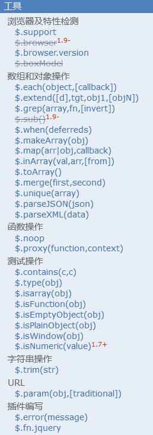
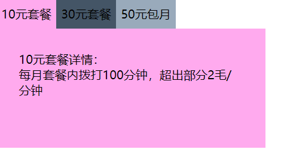
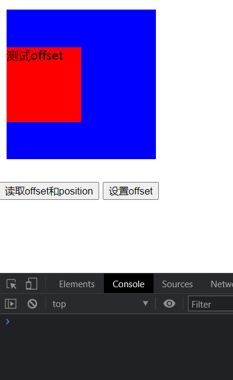
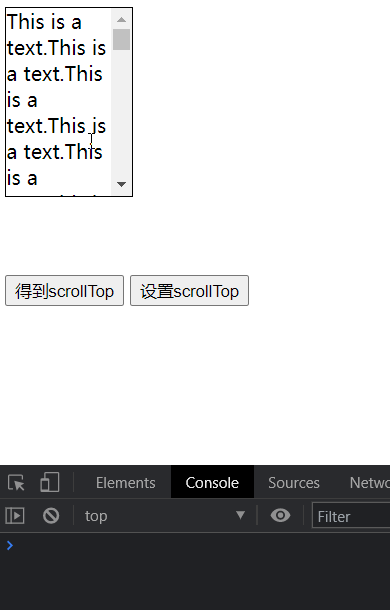

---
# 当前页面内容标题
title: jQuery工具、属性、CSS
# 分类
category:
  - jquery
# 标签
tag: 
  - jquery
  - javascript
sticky: false
# 是否收藏在博客主题的文章列表中，当填入数字时，数字越大，排名越靠前。
star: false
# 是否将该文章添加至文章列表中
article: true
# 是否将该文章添加至时间线中
timeline: true
---

## 1、jQuery工具方法



不过，我们常用的工具方法并不多

| 工具方法                    | 描述                                 |
| --------------------------- | ------------------------------------ |
| `$.each(object,[callback])` | 通用例遍方法，可用于例遍对象和数组   |
| `$.type(obj)`               | 检测obj的数据类型                    |
| `$.isArray(obj)`            | 测试对象是否为数组                   |
| `$.isFunction(obj)`         | 测试对象是否为函数                   |
| `$.isNumeric(value)`        | 测试对象是否为数字                   |
| `$.parseJSON(json)`         | 接受一个JSON字符串，返回解析后的对象 |

### $.each()

```js
// 1、$.each()：遍历数组或对象中的数据
var obj = {
    name: 'Tom',
    setName: function (name) {
        this.name = name;
    }
}
$.each(obj, function (key, value) {
    console.log(key, value); // name Tom   setName ƒ (name) {}
});
```

### $.trim()

```js
// 2、$.trim()：去除字符两边的空格
var str = '    ddd ';
console.log($.trim(str)); // ddd
```

### $.type()

```js
// 3、$.type(obj)：得到数据的类型
console.log($.type($), $.type($())); // function object
```

### $.isArray()

```js
// 4、$.isArray(obj)：判断是否是数组
console.log($.isArray($('body')), $.isArray([])); // false true
```

### $.isFunction()

```js
// 5、$.isFunction(obj)：判断是否是函数
console.log($.isFunction($), $.isFunction($())); // true false
```

### $.isNumberic()

```js
// 6、$.isNumberic(obj)：判断是否是数字
console.log($.isNumeric('a'), $.isNumeric('2'), $.isNumeric(2)); // false true true
```

### $.parseJSON()

```js
// 7、$.parseJSON(json)：解析json字符转换为js对象/数组
var jsonObj = '{"name":"Tom", "age": 18}';
console.log($.parseJSON(jsonObj)); // {name: "Tom", age: 18}
var jsonArr = '[{"name":"Tom", "age": 18}, {"name":"Jack", "age": 28}]';
console.log($.parseJSON(jsonArr)); // (2) [{…}, {…}]
```

## 2、练习：多Tab点击切换

HTML 代码

```html
<ul id="tab">
    <li id="tab1" value="1">10元套餐</li>
    <li id="tab2" value="2">30元套餐</li>
    <li id="tab3" value="3">50元包月</li>
</ul>
<div id="container">
    <div id="content1">
        10元套餐详情：<br> 每月套餐内拨打100分钟，超出部分2毛/分钟
    </div>
    <div id="content2" style="display:none">
        30元套餐详情：<br> 每月套餐内拨打300分钟，超出部分1.5毛/分钟
    </div>
    <div id="content3" style="display:none">
        50元包月详情：<br> 每月无限量随心打
    </div>
</div>
```

jQuery 代码

```js
var $containers = $('#container>div');
var curIndex = 0;
$('#tab>li').click(function () { // 隐式遍历
    // 隐藏上一次
    $containers[curIndex].style.display = 'none';
    // 显示当前的
    curIndex = $(this).index();
    $containers[curIndex].style.display = 'block';
});
```



## 3、jQuery操作属性

| 属性            | 描述                                     |
| --------------- | ---------------------------------------- |
| `attr()`        | 设置或返回被选元素的属性值               |
| `removeAttr()`  | 从每一个匹配的元素中删除一个属性         |
| `prop()`        | 获取在匹配的元素集中的第一个元素的属性值 |
| `removeProp()`  | 用来删除由.prop()方法设置的属性集        |
| `addClass()`    | 为每个匹配的元素添加指定的类名           |
| `removeClass()` | 从所有匹配的元素中删除全部或者指定的类   |
| `toggleClass()` | 如果存在（不存在）就删除（添加）一个类   |
| `html()`        | 取得第一个匹配元素的html内容             |
| `text()`        | 取得所有匹配元素的内容                   |
| `val()`         | 获得匹配元素的当前值                     |

### attr()、removeAttr()

```js
//1.读取第一个div的title属性
console.log($('div:first').attr('title')); // one
//2.给所有的div设置name属性（value 为atguigu）
$('div').attr('name', 'atguigu');
//3.移除所有div的title属性
$('div').removeAttr('title');
//4.给所有的div设置class='guiguClass'
$('div').attr('class', 'guiguClass');
```

### addClass()、removeClass()

```js
//5.给所有的div添加class='abc'
$('div').addClass('abc');
//6.移除所有div的guiguClass的class
$('div').removeClass('guiguClass');
```

### html()、val()

```js
//7.得到最后一个li的标签体文本
console.log($('ul>li:last').html()); // <span>BBBBB</span>
//8.设置第一个li的标签体为"<h1>mmmmmmmmm</h1>"
$('ul>li:first').html('<h1>mmmmmmmmm</h1>');
//9.得到输入框中的value值
console.log($(':text').val()); // guiguClass
//10.将输入框的值设置为atguigu
$(':text').val('atguigu');
```

### prop()、removeProp()

```js
//11.点击’全选’按留实现全选
var $checkbox = $(':checkbox');
$('button:first').click(function () {
    $checkbox.prop('checked', true);
});
//12.点击’全不选’按留实现全不选
$('button:last').click(function () {
    $checkbox.prop("checked", false);
});
```

`attr()`：操作属性值为非布尔值的属性件 `prop()`：专门操作属性值为布尔值的属性

## 4、jQuery操作CSS

| CSS             | 描述                                                   |
| --------------- | ------------------------------------------------------ |
| `css()`         | 访问匹配元素的样式属性                                 |
| `offset()`      | 获取匹配元素在当前视口的相对偏移                       |
| `position()`    | 获取匹配元素相对父元素的偏移                           |
| `scrollTop()`   | 获取匹配元素相对滚动条顶部的偏移                       |
| `scrollLeft()`  | 获取匹配元素相对滚动条左侧的偏移                       |
| `height()`      | 取得匹配元素当前计算的高度值（px）                     |
| `width()`       | 取得第一个匹配元素当前计算的宽度值（px）               |
| `innerHeight()` | 获取第一个匹配元素内部区域高度（包括补白、不包括边框） |
| `innerWidth()`  | 获取第一个匹配元素内部区域宽度（包括补白、不包括边框） |
| `outerHeight()` | 获取第一个匹配元素外部高度（默认包括补白和边框）       |
| `outerWidth()`  | 获取第一个匹配元素外部宽度（默认包括补白和边框）       |

### css()

```js
// 1.得到第一个p标签的颜色
console.log($('p:first').css('color')); // rgb(0, 0, 255);
// 2.设置所有p标签的文本颜色为red
$('p').css('color', 'red');
// 3.设第2个p的字体颜色（#ffee11），背景（blue），宽（300px），高（30px）
$('p:eq(1)').css({
    color: '#ffee11',
    backgroundColor: 'blue',
    width: 300,
    height: 30
});
```


### offset和position

```js
// 1.点击btn1
$('#btn1').click(function () {
    // 打印div1相对于页面左上角的位置
    var offset1 = $('.div1').offset();
    console.log(offset1.left, offset1.top); // 10 20
    // 打印div2相对于页面左上角的位置
    var offset2 = $('.div2').offset();
    console.log(offset2.left, offset2.top); // 10 70

    // 打印div1相对于父元素左上角的位置
    var position1 = $('.div1').position();
    console.log(position1.left, position1.top); // 10 20
    // 打印div2相对于父元素左上角的位置
    var position2 = $('.div2').position();
    console.log(position2.left, position2.top); // 0 50
});

// 2.点击btn2
$('#btn2').click(function () {
    // 设置div2相对于页面的左上角的位置
    $('.div2').offset({left: 0, top: 0});
});
```



### scrollTop和scrollLeft

```js
// 1.得到div或页面滚动条的坐标
$('#btn1').click(function () {
    console.log($('div').scrollTop()); // 400
    console.log($(document.documentElement).scrollTop() + $(document.body).scrollTop()); // 200
});
// 2.让div或页面的滚动条滚动到指定位置
$('#btn2').click(function () {
    $('div').scrollTop(1000);
    $('html,body').scrollTop(100);
});
```



### 元素的尺寸

#### 1.内容尺寸

- `height()`：`height`
- `width()`：`width`

#### 2.内部尺寸

- `innerHeight()`：`height + padding`
- `innerwidth()`：`width + padding`

#### 3.外部尺寸

- `outerHeight(false/true)`：`height + padding + border` 如果是`true`，加上`margin`
- `outerwidth(false/true)`：`width + padding + border` 如果是`true`，加上`margin`

```js
var $div = $('div');
console.log($div.height(), $div.width()); // 150, 100
console.log($div.innerHeight(), $div.innerWidth()); // 170 120
console.log($div.outerHeight(), $div.outerWidth()); // 190 140
console.log($div.outerHeight(true), $div.outerWidth(true)); // 210 160
```