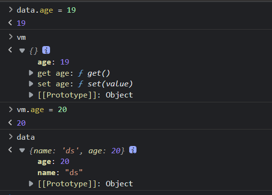
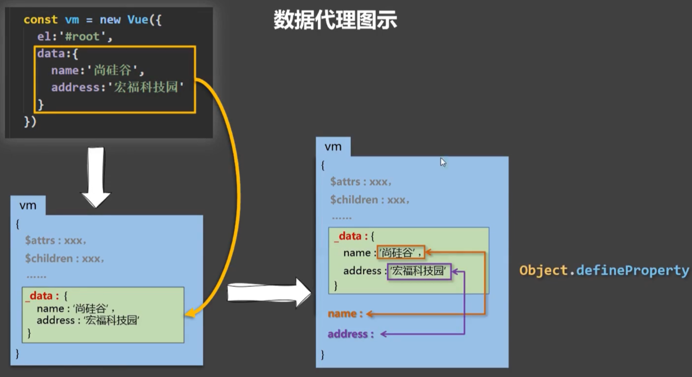

---
# 当前页面内容标题
title: 数据代理 事件处理
# 分类
category:
  - Vue2
# 标签
tag:
  - Vue
  - javascript
  - 渐进式框架
sticky: false
# 是否收藏在博客主题的文章列表中，当填入数字时，数字越大，排名越靠前。
star: false
# 是否将该文章添加至文章列表中
article: true
# 是否将该文章添加至时间线中
timeline: true
---

# 03 【数据代理 事件处理】

## 1.数据代理

> 了解数据代理需要js的一些知识：Object.defineProperty()，属性标志，属性描述符，getter，setter。。。

### 1.1数据代理

建议学习文章地址：

<https://zh.javascript.info/property-descriptors>

<https://zh.javascript.info/property-accessors>

这里简单介绍一下：

**属性标志**:

对象属性（properties），除 **`value`** 外，还有三个特殊的特性（attributes），也就是所谓的“标志”

* **`writable`** — 如果为 `true`，则值可以被修改，否则它是只可读的
* **`enumerable`** — 如果为 `true`，则表示是可以遍历的，可以在for.. .in   Object.keys()中遍历出来
* **`configurable`** — 如果为 `true`，则此控制属性可以被删除，默认值是false

**Object.defineProperty**(obj, prop, descriptor)

> obj：要定义属性的对象。
>
> prop：要定义或修改的属性的名称
>
> descriptor：要定义或修改的属性描述符

```js
let number = 18
let person = {
  name: '张三',
  sex: '男',
}

Object.defineProperty(person, 'age', {
  // value:18,
  // enumerable:true,  // 控制属性是否可以枚举，默认值是false
  // writable:true,   // 控制属性是否可以被修改，默认值是false
  // configurable:true // 控制属性是否可以被删除，默认值是false

  // 当有人读取person的age属性时，get函数(getter)就会被调用，且返回值就是age的值
  get() {
    console.log('有人读取age属性了')
    return number
  },

  // 当有人修改person的age属性时，set函数(setter)就会被调用，且会收到修改的具体值
  set(value) {
    console.log('有人修改了age属性，且值是', value)
    number = value
  }

})
// console.log(Object.keys(person))
console.log(person)
```

### 1.2vue中的数据代理

**数据代理**：通过一个对象代理对另一个对象中属性的操作（读/写）

```js
      let vm = {};
      let data = {
        name: 'ds',
        age: 18,
      };
      Object.defineProperty(vm, 'age', {
        get() {
          return data.age;
        },
        set(value) {
          data.age = value;
        },
      });
```



> 使用{{}}插值语法获取vm的x时，触发get方法，将data的x赋值给vm的x
>
> 修改`data`中的`age`时并没有改变`vm`里的`age`的值，当`{{}}`获取`vm`中`age`的值时，就会将`data`的`age`赋值给`vm`的`age`
>
> 修改`vm`中的`age`，触发`set`方法，将修改的值赋值给`data`中的`age`

1. Vue中的数据代理通过vm对象来代理data对象中属性的操作（读/写）
2. Vue中数据代理的好处：更加方便的操作data中的数据
3. 基本原理

* 通过`object.defineProperty()`把`data`对象中所有属性添加到`vm`上
* 为每一个添加到`vm`上的属性，都指定一个 `getter`,`setter`
* 在`getter`,`setter`内部去操作（读/写）data中对应的属



`Vue`将`data`中的数据拷贝了一份到`_data`属性中，又将`_data`里面的属性提到`Vue实例`中（如name），通过`defineProperty`实现数据代理，这样通过`geter/setter`操作 name，进而操作`_data`中的 `name`。而`_data`又对`data`进行数据劫持，实现响应式。

> name被修改-->调用setter-->重新解析模板-->生成新的虚拟DOM-->新旧DOM对比（diff）-->更新页面

## 2.事件处理

### 2.1事件的基本用法

1. 使用`v-on:xxx`或`@xxx`绑定事件，其中 xxx 是事件名
2. 事件的回调需要配置在methods对象中，最终会在vm上
3. `methods`中配置的函数，不要用箭头函数，否则 this 就不是vm了
4. `methods`中配置的函数，都是被 Vue所管理的函数，this 的指向是`vm`或`组件实例对象`
5. `@click="demo"`和`@click="demo($event)"`效果一致，但后者可以传参

```html
<!-- 准备好一个容器-->
<div id="root">
    <h2>欢迎来到{{name}}学习</h2>
    <!-- <button v-on:click="showInfo">点我提示信息</button> -->
    <button @click="showInfo1">点我提示信息1（不传参）</button>
    <!-- 主动传事件本身 -->
    <button @click="showInfo2($event,66)">点我提示信息2（传参）</button>
</div>

<script>
 const vm = new Vue({
        el:'#root',
        data:{
            name:'vue',
        },
        methods:{
            // 如果vue模板没有写event，会自动传 event 给函数
            showInfo1(event){
                // console.log(event.target.innerText)
                // console.log(this) //此处的this是vm
                alert('同学你好！')
            },
            showInfo2(event,number){
                console.log(event,number)
                // console.log(event.target.innerText)
                // console.log(this) //此处的this是vm
                alert('同学你好！！')
            }
        }
 });
</script>
```

### 2.2事件修饰符

`Vue`中的事件修饰符

1.`prevent` 阻止默认事件（常用）

2.`stop`  阻止事件冒泡（常用）

3.`once`  事件只触发一次（常用）

4.capture 使用事件的捕获模式

5.self  只有event.target是当前操作的元素时才触发事件

1.passive 事件的默认行为立即执行，无需等待事件回调执行完毕

修饰符可以连续写，比如可以这么用：`@click.prevent.stop="showInfo"`

```html
    <style>
      * {margin-top: 20px;}
      .demo1 {height: 50px;background-color: skyblue;}
      .box1 {padding: 5px;background-color: skyblue;}
      .box2 {padding: 5px;background-color: white;}
      .list {width: 200px;height: 200px;background-color: skyblue;overflow: auto;}
      li {height: 100px;}
    </style>

    <div id="root">
      <h2>欢迎来到{{ name }}学习</h2>
      <!-- 阻止默认事件（常用） -->
      <a href="http://www.atguigu.com" @click.prevent="showInfo">点我提示信息</a>

      <!-- 阻止事件冒泡（常用） -->
      <div class="demo1" @click="showInfo">
        <button @click.stop="showInfo">点我提示信息</button>
        <!-- 修饰符可以连续写 -->
        <!-- <a href="http://www.qq.com" @click.prevent.stop="showInfo">点我提示</a> -->
      </div>

      <!-- 事件只触发一次（常用） -->
      <button @click.once="showInfo">点我提示信息</button>

      <!-- 使用事件的捕获模式 -->
      <div class="box1" @click.capture="showMsg(1)">捕获到的时候就直接触发
        div1
        <div class="box2" @click="showMsg(2)">
          div2
        </div>
      </div>

      <!-- 只有event.target是当前操作的元素时才触发事件； -->
      <div class="demo1" @click.self="showInfo">
        <button @click="showInfo">点我提示信息</button>
      </div>

      <!-- 事件的默认行为立即执行，无需等待事件回调执行完毕； -->
      <!-- scroll是滚动条滚动，passsive没有影响 -->
      <!-- wheel是鼠标滚轮滚动，passive有影响 -->
      <ul @wheel.passive="demo" class="list">
        <li>1</li>
        <li>2</li>
        <li>3</li>
        <li>4</li>
      </ul>
    </div>

    <script type="text/javascript">
      Vue.config.productionTip = false

      new Vue({
        el: '#root',
        data: {
          name: '尚硅谷'
        },
        methods: {
          showInfo(e) {
            alert('同学你好！')
            // console.log(e.target)
          },
          showMsg(msg) {
            console.log(msg)
          },
          demo() {
            for (let i = 0; i < 100000; i++) {
              console.log('#')
            }
            console.log('累坏了')
          }
        }
      })
    </script>
```

### 2.3键盘事件

> 键盘上的每个按键都有自己的名称和编码，例如：Enter（13）。而Vue还对一些常用按键起了别名方便使用

**1**.`Vue`中常用的按键别名

回车`enter`

删除`delete`捕获“删除”和“退格”键

退出`esc`

空格`space`

换行`tab`特殊，必须配合keydown去使用

上`up`

下`down`

左`left`

右`right`

2.Vue未提供别名的按键，可以使用按键原始的key值去绑定，但注意要转为kebab-case（多单词小写短横线写法  `NumLock(num-lock)`  `CapsLock(caps-lock)`）

3.系统修饰键（用法特殊）ctrl、alt、shift、meta（meta就是win键）

3.1配合`keyup`使用：按下修饰键的同时，再按下其他键，随后释放其他键，事件才被触发

指定 ctrl+y 使用 @keyup.ctrl.y

3.2配合`keydown`使用：正常触发事件

4.也可以使用keyCode去指定具体的按键**（不推荐）**

`@keyup.13=xxx(@keyup.enter=xxx)`

5.**Vue.config.keyCodes** 自定义键名 = 键码，可以去定制按键别名

```html
    <div id="root">
      <h2>欢迎打开{{name}}笔记</h2>
      <input type="text" placeholder="按下回车提示输入" @keyup.enter="showInfo"><br/>
      <input type="text" placeholder="按下tab提示输入" @keydown.tab="showInfo"><br/>
      <input type="text" placeholder="按下回车提示输入" @keydown.huiche="showInfo"><br/>
    </div>
 
    <script type="text/javascript">
      Vue.config.productionTip = false // 阻止 vue 在启动时生成生产提示。
      Vue.config.keyCodes.huiche = 13  // 定义了一个别名按键

      new Vue({
        el: '#root',
        data: {
          name: 'vue'
        },
        methods: {
          showInfo(e) {
            // console.log(e.key,e.keyCode)
            console.log(e.target.value)
          }
        },
      })
    </script>
```
