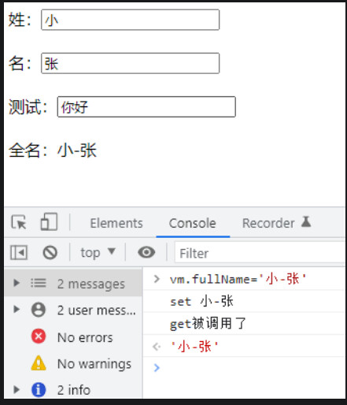
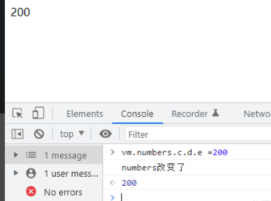

---
# 当前页面内容标题
title: 计算属性 侦听属性
# 分类
category:
  - Vue2
# 标签
tag:
  - Vue
  - javascript
  - 渐进式框架
sticky: false
# 是否收藏在博客主题的文章列表中，当填入数字时，数字越大，排名越靠前。
star: false
# 是否将该文章添加至文章列表中
article: true
# 是否将该文章添加至时间线中
timeline: true
---

# 04 【计算属性 侦听属性】

## 1.计算属性

### 1.1插值语法实现

```html
<title>姓名案例_插值语法实现</title>

<div id="root">
  姓：<input type="text" v-model="firstName"> <br/>
  名：<input type="text" v-model="lastName"> <br/>
  全名：<span>{{ firstName }}-{{ lastName }}</span>
</div>

<script type="text/javascript">
  Vue.config.productionTip = false
  new Vue({
    el:'#root',
    data:{
      firstName:'张',
      lastName:'三'
    }
  })
</script>
```


### 1.2method实现

> **数据发生变化，模板就会被重新解析**

```html
<title>姓名案例_methods实现</title>

<div id="root">
  姓：<input type="text" v-model="firstName"><br/>
  名：<input type="text" v-model="lastName"><br/>
  全名：<span>{{ fullName() }}</span>
</div>

<script type="text/javascript">
  Vue.config.productionTip = false
  new Vue({
    el: '#root',
    data: {
      firstName: '张',
      lastName: '三'
    },
    methods: {
      fullName() {
        return this.firstName + '-' + this.lastName
      }
    },
  })
</script>
```

### 1.3computed实现

* 定义：要用的属性不存在，**要通过已有属性计算得来**
* 原理：底层借助了`Objcet.defineProperty`方法提供的getter和setter
* get函数什么时候执行？
  * (1).初次读取时会执行一次
  * (2).当依赖的数据发生改变时会被再次调用
* 优势：与methods实现相比，**`内部有缓存机制`**（复用），效率更高，调试方便
* 备注：
  * 计算属性最终会出现在`vm`上，直接读取使用即可
  * 如果计算属性要被修改，那必须写`set函数`去响应修改，且set中要引起计算时依赖的数据发生改变
  * 如果计算属性确定不考虑修改，可以使用计算属性的简写形式

> 完整写法

```html
<!-- 准备好一个容器-->
<div id="root">
    姓：<input type="text" v-model="firstName">
    名：<input type="text" v-model="lastName"> 
    全名：<span>{{fullName}}</span>
</div>

<script>
 const vm = new Vue({
        el:'#root',
        data:{
            firstName:'张',
            lastName:'三',
        }
        computed:{
            fullName:{
                //get有什么作用？当有人读取fullName时，get就会被调用，且返回值就作为fullName的值
                //get什么时候调用？1.初次读取fullName时。2.所依赖的数据发生变化时。
                get(){
                    console.log('get被调用了')
                    return this.firstName + '-' + this.lastName
                },
                //set什么时候调用? 当fullName被修改时。
                // 可以主动在控制台修改fullName来查看情况
                set(value){
                    console.log('set',value)
                    const arr = value.split('-')
                    this.firstName = arr[0]
                    this.lastName = arr[1]
                }
            }
        }
    })
</script>
```



> 简写

```html
<!-- 准备好一个容器-->
<div id="root">
    姓：<input type="text" v-model="firstName">
    名：<input type="text" v-model="lastName"> 
    全名：<span>{{fullName}}</span>
</div>

<script>
 const vm = new Vue({
        el:'#root',
        data:{
            firstName:'张',
            lastName:'三',
        }
        computed:{
            fullName() {
          console.log('get被调用了')
    return this.firstName + '-' + this.lastName
      }
        }
    })
</script>
```

> 读取fullName时会自动调用get方法

### 1.4method和computed区别

```html
<title>姓名案例_methods实现</title>

<div id="root">
  姓：<input type="text" v-model="firstName"><br/>
  名：<input type="text" v-model="lastName"><br/>
  全名：<span>{{ fullName() }}</span>
  全名：<span>{{ fullName() }}</span>
  全名：<span>{{ fullName() }}</span>

</div>

<script type="text/javascript">
  Vue.config.productionTip = false
  new Vue({
    el: '#root',
    data: {
      firstName: '张',
      lastName: '三'
    },
    methods: {
      fullName() {
        return this.firstName + '-' + this.lastName
      }
    },
  })
</script>
```

> 如果只使用一次，其实没什么区别。
>
> 使用多次的时候，method每次都会重新调用，而computed会从缓存中读取。

## 2.侦听属性

### 2.1method实现

````html
<div id="root">
  <h3>今天天气很{{ info }}</h3>
  <!-- 绑定事件的时候：@xxx="yyy" yyy可以写一些简单的语句 -->
  <!-- <button @click="isHot = !isHot">切换天气</button> -->
  <button @click="changeWeather">切换天气</button>
</div>

<script type="text/javascript">
  Vue.config.productionTip = false
  const vm = new Vue({
    el:'#root',
    data:{
      isHot:true,
    },
    computed:{
      info(){
        return this.isHot ? '炎热' : '凉爽'
      }
    },
    methods: {
      changeWeather(){
        this.isHot = !this.isHot
      }
    }
  })
</script>
````


### 2.2watch实现

监视属性watch：

* 当被监视的属性变化时, 回调函数自动调用, 进行相关操作
* 监视的属性必须存在，才能进行监视,既可以监视`data`，也可以监视计算属性
* 配置项属性`immediate:false`，改为 **true**，则初始化时调用一次 `handler(newValue,oldValue)`
* 监视的两种写法：
  * (1).new Vue时传入watch配置
  * (2).通过vm.$watch监视

> 第一种写法

```html
<!-- 准备好一个容器-->
<div id="root">
    <h2>今天天气很{{ info }}</h2>
    <button @click="changeWeather">切换天气</button>
</div>

<script>
 const vm = new Vue({
        el:'#root',
        data:{
            isHot:true,
        },
        computed:{
            info(){
                return this.isHot ? '炎热' : '凉爽'
            }
        },
        methods: {
            changeWeather(){
                this.isHot = !this.isHot
            }
        },
        watch:{
            isHot:{
                immediate: true, // 初始化时让handler调用一下
                // handler什么时候调用？当isHot发生改变时。
                handler(newValue, oldValue){
                    console.log('isHot被修改了',newValue,oldValue)
                }
            }
        } 
    })
</script>
```

> 第二种写法

```html
<!-- 准备好一个容器-->
<div id="root">
    <h2>今天天气很{{ info }}</h2>
    <button @click="changeWeather">切换天气</button>
</div>

<script>
 const vm = new Vue({
        el:'#root',
        data:{
            isHot:true,
        },
        computed:{
            info(){
                return this.isHot ? '炎热' : '凉爽'
            }
        },
        methods: {
            changeWeather(){
                this.isHot = !this.isHot
            }
        }
    })
    
    vm.$watch('isHot',{
        immediate:true, //初始化时让handler调用一下
        //handler什么时候调用？当isHot发生改变时。
        handler(newValue,oldValue){
            console.log('isHot被修改了',newValue,oldValue)
        }
    })
</script>
```

### 2.3深度侦听

* (1).Vue中的watch默认不监测对象内部值的改变（一层）
  obj:{name:’ds’,age:18} 这里的一层指的后面整个对象字面量，而不是里面的值是第一层
* (2).配置`deep:true`可以监测对象内部值改变（多层）

> 备注：
>
> (1).Vue自身可以监测对象内部值的改变，但Vue提供的watch默认不可以
>
> (2).使用watch时根据数据的具体结构，决定是否采用深度监视

```html
<title>天气案例_深度监视</title>
<script type="text/javascript" src="../js/vue.js"></script>

<div id="root">
  <h3>a的值是:{{ numbers.a }}</h3>
  <button @click="numbers.a++">点我让a+1</button>
  <h3>b的值是:{{ numbers.b }}</h3>
  <button @click="numbers.b++">点我让b+1</button>
  <button @click="numbers = {a:666,b:888}">彻底替换掉numbers</button>
  {{numbers.c.d.e}}
</div>

<script type="text/javascript">
  Vue.config.productionTip = false
  const vm = new Vue({
    el: '#root',
    data: {
      isHot: true,
      numbers: {
        a: 1,
        b: 1,
        c: {
          d: {
            e: 100
          }
        }
      }
    },
    watch: {
      // 监视多级结构中某个属性的变化
      /* 'numbers.a':{
    handler(){
     console.log('a被改变了')
    }
   } */
      // 监视多级结构中所有属性的变化
      numbers: {
        deep: true,
        handler() {
          console.log('numbers改变了')
        }
      }
    }
  })
</script>
```



### 2.4简写

如果监视属性除了`handler`没有其他配置项的话，可以进行简写

```html
<div id="root">
  <h3>今天天气很{{ info }}</h3>
  <button @click="changeWeather">切换天气</button>
</div>

<script type="text/javascript">
  Vue.config.productionTip = false
  const vm = new Vue({
    el: '#root',
    data: {isHot: true,},
    computed: {info() {return this.isHot ? '炎热' : '凉爽'}},
    methods: {changeWeather() {this.isHot = !this.isHot}},
    watch: {
      //简写
      isHot(newValue, oldValue) {
        console.log('isHot被修改了', newValue, oldValue)
      }
    }
  })

  //简写
  // vm.$watch('isHot', (newValue, oldValue) => {
  //  console.log('isHot被修改了', newValue, oldValue, this)
  // })
</script>
```

> 监视到`isHot`改变会自动调用`handler`方法

### 2.5computed和watch之间的区别

* computed能完成的功能，watch都可以完成
* watch能完成的功能，computed不一定能完成，例如：watch可以进行异步操作

> 两个重要的小原则：
>
> 1.所被Vue管理的函数，最好写成普通函数，这样this的指向才是vm 或 组件实例对象
>
> 2.所有不被Vue所管理的函数（定时器的回调函数、ajax的回调函数等、Promise的回调函数），最好写成箭头函数，这样this的指向才是vm 或 组件实例对象

> 比如想延迟一秒显示`fullName`,只能用`watch`实现

```js
new Vue({
  el:'#root',
  data:{
    firstName:'张',
    lastName:'三',
    fullName:'张-三'
  },
  watch:{
    firstName(val){
      setTimeout(()=>{
        this.fullName = val + '-' + this.lastName
      },1000);
    },
    lastName(val){
      this.fullName = this.firstName + '-' + val
    }
  }
})
```
