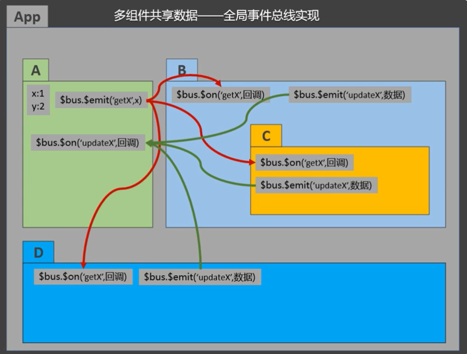
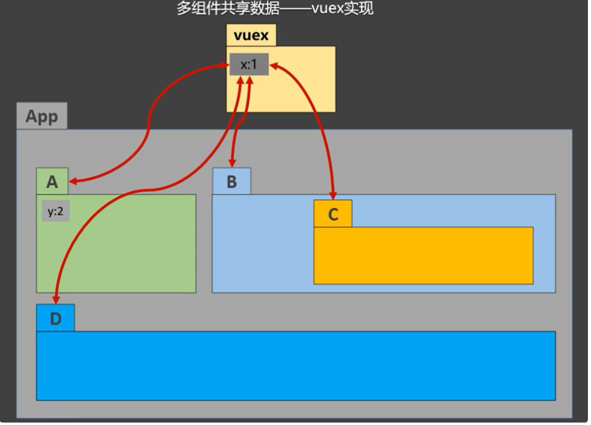
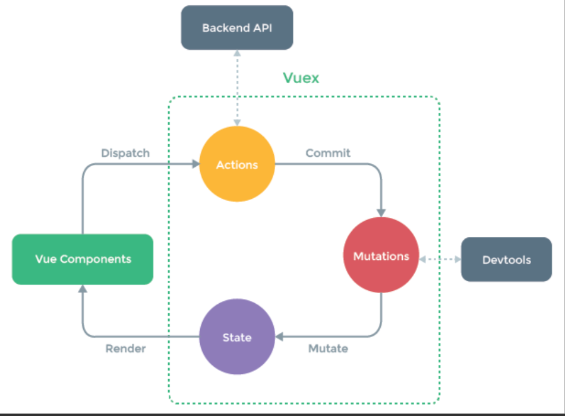

---
# 当前页面内容标题
title: Vuex
# 分类
category:
  - Vue2
# 标签
tag:
  - Vue
  - javascript
  - 渐进式框架
sticky: false
# 是否收藏在博客主题的文章列表中，当填入数字时，数字越大，排名越靠前。
star: false
# 是否将该文章添加至文章列表中
article: true
# 是否将该文章添加至时间线中
timeline: true
---

# 14 【Vuex】

## 1.理解 Vuex

### 1.1 Vuex 是什么

概念：专门在Vue中实现集中式状态（数据）管理的一个Vue插件，对Vue应用中多个组件的共享状态进行集中式的管理（读/写），也是一种组件间通信的方式，且适用于任意组件间通信





### 1.2 什么时候使用 Vuex

1多个组件依赖于同一状态

2来自不同组件的行为需要变更同一状态

### 1.3 原理图



## 2.搭建Vuex环境

1. 下载安装 `pnpm add vuex@3`

2. 创建文件：```src/store/index.js```

   ```js
   import Vue from 'vue'
   import Vuex from 'vuex' // 引入Vuex
   
   Vue.use(Vuex) // 应用Vuex插件
   
   const actions = {}  // 准备actions——用于响应组件中的动作
   const mutations = {} // 准备mutations——用于操作数据（state）
   const state = {}   // 准备state——用于存储数据
   
   // 创建并暴露store
   export default new Vuex.Store({
    actions,
    mutations,
    state,
   })
   ```

3. 在`main.js`中创建`vm`时传入`store`配置项

   ```js
   import Vue from 'vue'
   import App from './App.vue'
   import store from './store' // 引入store
   
   Vue.config.productionTip = false
   
   new Vue({
    el: '#app',
    render: h => h(App),
    store, // 配置项添加store
    beforeCreate() {
     Vue.prototype.$bus = this
    }
   })
   ```

## 3.使用Vuex编写

1. 初始化数据、配置```actions```、配置```mutations```，操作文件```store.js```

   ```js
   import Vue from 'vue'
   import Vuex from 'vuex' // 引入Vuex
   
   Vue.use(Vuex) // 应用Vuex插件
   
   // 准备actions——用于响应组件中的动作
   const actions = {
    /* jia(context,value){
     console.log('actions中的jia被调用了')
     context.commit('JIA',value)
    },
    jian(context,value){
     console.log('actions中的jian被调用了')
     context.commit('JIAN',value)
    }, */
    jiaOdd(context,value){ // context 相当于精简版的 $store
     console.log('actions中的jiaOdd被调用了')
     if(context.state.sum % 2){
      context.commit('JIA',value)
     }
    }
   }
   // 准备mutations——用于操作数据（state）
   const mutations = {
    JIA(state,value){
     console.log('mutations中的JIA被调用了')
     state.sum += value
    },
    JIAN(state,value){
     console.log('mutations中的JIAN被调用了')
     state.sum -= value
    }
   }
   // 准备state——用于存储数据
   const state = {
    sum:0 //当前的和
   }
   
   // 创建并暴露store
   export default new Vuex.Store({
    actions,
    mutations,
    state,
   })
   ```

2. 组件中读取vuex中的数据：```$store.state.sum```

3. 组件中修改vuex中的数据：```$store.dispatch('action中的方法名',数据)``` 或 ```$store.commit('mutations中的方法名',数据)```

   >  备注：若没有网络请求或其他业务逻辑，组件中也可以越过actions，即不写```dispatch```，直接编写```commit```

`src/components/Count.vue`

```vue
<template>
 <div>
  <h1>当前求和为：{{ $store.state.sum }}</h1>
  <select v-model.number="n">
   <option value="1">1</option>
   <option value="2">2</option>
   <option value="3">3</option>
  </select>
  <button @click="increment">+</button>
  <button @click="decrement">-</button>
  <button @click="incrementOdd">当前求和为奇数再加</button>
 </div>
</template>

<script>
 export default {
  name:'Count',
  data() {
   return {
    n:1, //用户选择的数字
   }
  },
  methods: {
   increment(){
                // commit 是操作 mutations
    this.$store.commit('JIA',this.n)
   },
   decrement(){
                // commit 是操作 mutations
    this.$store.commit('JIAN',this.n)
   },
   incrementOdd(){
                // dispatch 是操作 actions
    this.$store.dispatch('jiaOdd',this.n)
   },
  }
 }
</script>

<style lang="css">button{margin-left: 5px;}</style>
```

## 4.getters 配置项

1. 概念：当state中的数据需要经过加工后再使用时，可以使用getters加工。

2. 在```store.js```中追加```getters```配置

   ```js
   ......
   
   const getters = {
    bigSum(state){
     return state.sum * 10
    }
   }
   
   // 创建并暴露store
   export default new Vuex.Store({
    ......
    getters
   })
   ```

3. 组件中读取数据：```$store.getters.bigSum```

## 5.四个map方法的使用

1. <strong>mapState方法：</strong>用于帮助我们映射```state```中的数据为计算属性

   ```js
   computed: {
       //借助mapState生成计算属性：sum、school、subject（对象写法）
        ...mapState({sum:'sum',school:'school',subject:'subject'}),
            
       //借助mapState生成计算属性：sum、school、subject（数组写法）
       ...mapState(['sum','school','subject']),
   },
   ```

2. <strong>mapGetters方法：</strong>用于帮助我们映射```getters```中的数据为计算属性

   ```js
   computed: {
       //借助mapGetters生成计算属性：bigSum（对象写法）
       ...mapGetters({bigSum:'bigSum'}),
   
       //借助mapGetters生成计算属性：bigSum（数组写法）
       ...mapGetters(['bigSum'])
   },
   ```

3. <strong>mapActions方法：</strong>用于帮助我们生成与```actions```对话的方法，即：包含```$store.dispatch(xxx)```的函数

   ```js
   methods:{
       //靠mapActions生成：incrementOdd、incrementWait（对象形式）
       ...mapActions({incrementOdd:'jiaOdd',incrementWait:'jiaWait'})
   
       //靠mapActions生成：incrementOdd、incrementWait（数组形式）
       ...mapActions(['jiaOdd','jiaWait'])
   }
   ```

4. <strong>mapMutations方法：</strong>用于帮助我们生成与```mutations```对话的方法，即：包含```$store.commit(xxx)```的函数

   ```js
   methods:{
       //靠mapActions生成：increment、decrement（对象形式）
       ...mapMutations({increment:'JIA',decrement:'JIAN'}),
       
       //靠mapMutations生成：JIA、JIAN（对象形式）
       ...mapMutations(['JIA','JIAN']),
   }
   ```

> 备注：`mapActions`与`mapMutations`使用时，若需要传递参数需要：在模板中绑定事件时传递好参数，否则参数是事件对象。

```vue
<template>
 <div>
  <h1>当前求和为：{{ sum }}</h1>
  <h3>当前求和的10倍为：{{ bigSum }}</h3>
  <h3>我是{{ name }}，我在{{ school }}学习</h3>
  <select v-model.number="n">
   <option value="1">1</option>
   <option value="2">2</option>
   <option value="3">3</option>
  </select>
  <button @click="increment(n)">+</button>
  <button @click="decrement(n)">-</button>
  <button @click="addOdd(n)">当前求和为奇数再加</button>
  <button @click="addWait(n)">等一等再加</button>
 </div>
</template>

<script>
 import {mapState, mapGetters, mapMutations, mapActions} from 'vuex' 

 export default {
  name: 'Count',
  data() {
   return {
    n:1, //用户选择的数字
   }
  },
  computed: {  
   ...mapState(['sum','school','name']),
   ...mapGetters(['bigSum'])
  },
  methods: {
   ...mapMutations({increment:'ADD', decrement:'SUBTRACT'}),
   ...mapActions(['addOdd', 'addWait'])
  },
 }
</script>

<style>
 button{
  margin-left: 5px;
 }
</style>
```

## 6.模块化+命名空间

1. 目的：让代码更好维护，让多种数据分类更加明确。

2. 修改```store.js```
   为了解决不同模块命名冲突的问题，将不同模块的`namespaced: true`，之后在不同页面中引入`getter、actions、mutations`时，需要加上所属的模块名

   ```javascript
   const countAbout = {
     namespaced:true,//开启命名空间
     state:{x:1},
     mutations: { ... },
     actions: { ... },
     getters: {
       bigSum(state){
          return state.sum * 10
       }
     }
   }
   
   const personAbout = {
     namespaced:true,//开启命名空间
     state:{ ... },
     mutations: { ... },
     actions: { ... }
   }
   
   const store = new Vuex.Store({
     modules: {
       countAbout,
       personAbout
     }
   })
   ```

3. 开启命名空间后，组件中读取state数据：

   ```js
   //方式一：自己直接读取
   this.$store.state.personAbout.list
   //方式二：借助mapState读取：
   ...mapState('countAbout',['sum','school','subject']),
   ```

4. 开启命名空间后，组件中读取getters数据：

   ```js
   //方式一：自己直接读取
   this.$store.getters['personAbout/firstPersonName']
   //方式二：借助mapGetters读取：
   ...mapGetters('countAbout',['bigSum'])
   ```

5. 开启命名空间后，组件中调用dispatch

   ```js
   //方式一：自己直接dispatch
   this.$store.dispatch('personAbout/addPersonWang',person)
   //方式二：借助mapActions：
   ...mapActions('countAbout',{incrementOdd:'jiaOdd',incrementWait:'jiaWait'})
   ```

6. 开启命名空间后，组件中调用commit

   ```js
   //方式一：自己直接commit
   this.$store.commit('personAbout/ADD_PERSON',person)
   //方式二：借助mapMutations：
   ...mapMutations('countAbout',{increment:'JIA',decrement:'JIAN'}),
   ```

​ 
